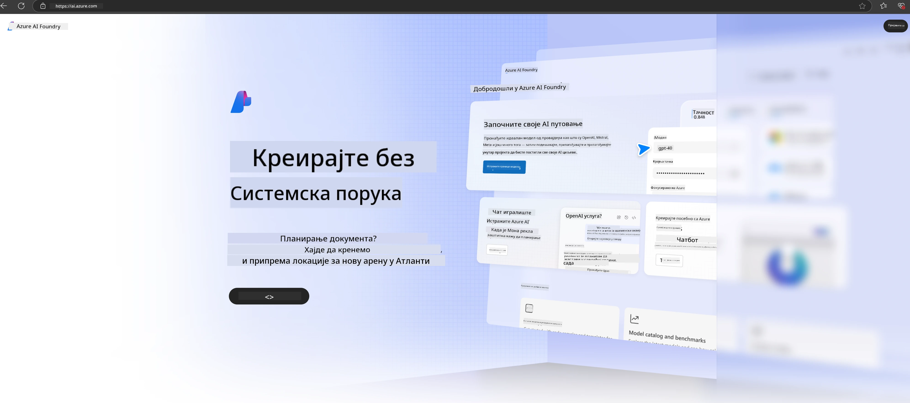

<!--
CO_OP_TRANSLATOR_METADATA:
{
  "original_hash": "3a1e48b628022485aac989c9f733e792",
  "translation_date": "2025-07-17T05:28:26+00:00",
  "source_file": "md/02.QuickStart/AzureAIFoundry_QuickStart.md",
  "language_code": "sr"
}
-->
# **Коришћење Phi-3 у Azure AI Foundry**

Са развојем генеративне вештачке интелигенције, желимо да користимо јединствену платформу за управљање различитим LLM и SLM моделима, интеграцију података предузећа, фино подешавање/RAG операције и процену различитих пословних процеса након интеграције LLM и SLM, како би се паметне апликације засноване на генеративној вештачкој интелигенцији боље реализовале. [Azure AI Foundry](https://ai.azure.com) је платформа за примену генеративне вештачке интелигенције на нивоу предузећа.

Помоћу Azure AI Foundry можете процењивати одговоре великих језичких модела (LLM) и оркестрирати компоненте апликација са prompt flow-ом ради бољих перформанси. Платформа омогућава лаку скалабилност за трансформацију прототипа у пуну производњу. Континуирано праћење и унапређење подржавају дугорочни успех.

Модел Phi-3 можемо брзо поставити на Azure AI Foundry кроз једноставне кораке, а затим користити Azure AI Foundry за завршетак повезаних активности као што су Playground/Chat, фино подешавање, процена и друго.

## **1. Припрема**

Ако већ имате инсталиран [Azure Developer CLI](https://learn.microsoft.com/azure/developer/azure-developer-cli/overview?WT.mc_id=aiml-138114-kinfeylo) на свом рачунару, коришћење овог шаблона је једноставно као покретање ове команде у новом директоријуму.

## Ручно креирање

Креирање Microsoft Azure AI Foundry пројекта и хаба је одличан начин да организујете и управљате својим AI радом. Ево корак по корак упутства за почетак:

### Креирање пројекта у Azure AI Foundry

1. **Идите на Azure AI Foundry**: Пријавите се на портал Azure AI Foundry.
2. **Креирајте пројекат**:
   - Ако сте унутар неког пројекта, изаберите „Azure AI Foundry“ у горњем левом углу странице да бисте отишли на почетну страницу.
   - Изаберите „+ Create project“.
   - Унесите име пројекта.
   - Ако већ имате хаб, он ће бити подразумевано изабран. Ако имате приступ више хабова, можете изабрати други из падајућег менија. Ако желите да креирате нови хаб, изаберите „Create new hub“ и унесите име.
   - Изаберите „Create“.

### Креирање хаба у Azure AI Foundry

1. **Идите на Azure AI Foundry**: Пријавите се са својим Azure налогом.
2. **Креирајте хаб**:
   - Изаберите Management center из левог менија.
   - Изаберите „All resources“, затим стрелицу поред „+ New project“ и изаберите „+ New hub“.
   - У дијалогу „Create a new hub“ унесите име за ваш хаб (нпр. contoso-hub) и по потреби измените остала поља.
   - Изаберите „Next“, прегледајте информације, па изаберите „Create“.

За детаљнија упутства можете погледати званичну [Microsoft документацију](https://learn.microsoft.com/azure/ai-studio/how-to/create-projects).

Након успешног креирања, приступ студију који сте направили можете добити преко [ai.azure.com](https://ai.azure.com/)

На једном AI Foundry-ју може бити више пројеката. Креирајте пројекат у AI Foundry-ју као припрему.

Креирајте Azure AI Foundry [QuickStarts](https://learn.microsoft.com/azure/ai-studio/quickstarts/get-started-code)

## **2. Постављање Phi модела у Azure AI Foundry**

Кликните на опцију Explore у пројекту да уђете у Model Catalog и изаберите Phi-3

Изаберите Phi-3-mini-4k-instruct

Кликните „Deploy“ да бисте поставили Phi-3-mini-4k-instruct модел

> [!NOTE]
>
> При постављању можете изабрати рачунарску снагу

## **3. Playground Chat Phi у Azure AI Foundry**

Идите на страницу постављања, изаберите Playground и ћаскајте са Phi-3 у Azure AI Foundry

## **4. Постављање модела из Azure AI Foundry**

Да бисте поставили модел из Azure Model Catalog-а, пратите ове кораке:

- Пријавите се у Azure AI Foundry.
- Изаберите модел који желите да поставите из Azure AI Foundry каталога модела.
- На страници са детаљима модела изаберите Deploy, а затим Serverless API са Azure AI Content Safety.
- Изаберите пројекат у који желите да поставите модел. Да бисте користили Serverless API, ваш workspace мора бити у региону East US 2 или Sweden Central. Можете прилагодити име постављања.
- У чаробњаку за постављање изаберите Pricing and terms да бисте сазнали о ценама и условима коришћења.
- Изаберите Deploy. Сачекајте да постављање буде спремно и да будете преусмерени на страницу Deployments.
- Изаберите Open in playground да почнете интеракцију са моделом.
- Можете се вратити на страницу Deployments, изабрати постављање и забележити Target URL и Secret Key, које можете користити за позив постављања и генерисање одговора.
- Увек можете пронаћи детаље о endpoint-у, URL и приступне кључеве тако што ћете отићи на Build таб и изабрати Deployments у одељку Components.

> [!NOTE]
> Имајте у виду да ваш налог мора имати Azure AI Developer улогу са дозволама на Resource Group да бисте извршили ове кораке.

## **5. Коришћење Phi API у Azure AI Foundry**

Можете приступити https://{Your project name}.region.inference.ml.azure.com/swagger.json преко Postman GET захтева и комбиновати га са Key-ом да бисте сазнали о доступним интерфејсима

Веома је једноставно добити параметре захтева, као и параметре одговора.

**Одрицање од одговорности**:  
Овај документ је преведен коришћењем AI сервиса за превођење [Co-op Translator](https://github.com/Azure/co-op-translator). Иако тежимо прецизности, молимо вас да имате у виду да аутоматски преводи могу садржати грешке или нетачности. Оригинални документ на његовом изворном језику треба сматрати ауторитетним извором. За критичне информације препоручује се професионални људски превод. Нисмо одговорни за било каква неспоразума или погрешна тумачења која произилазе из коришћења овог превода.