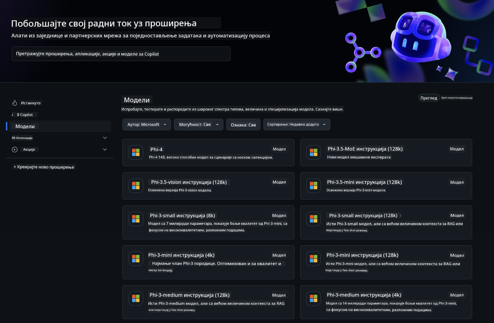
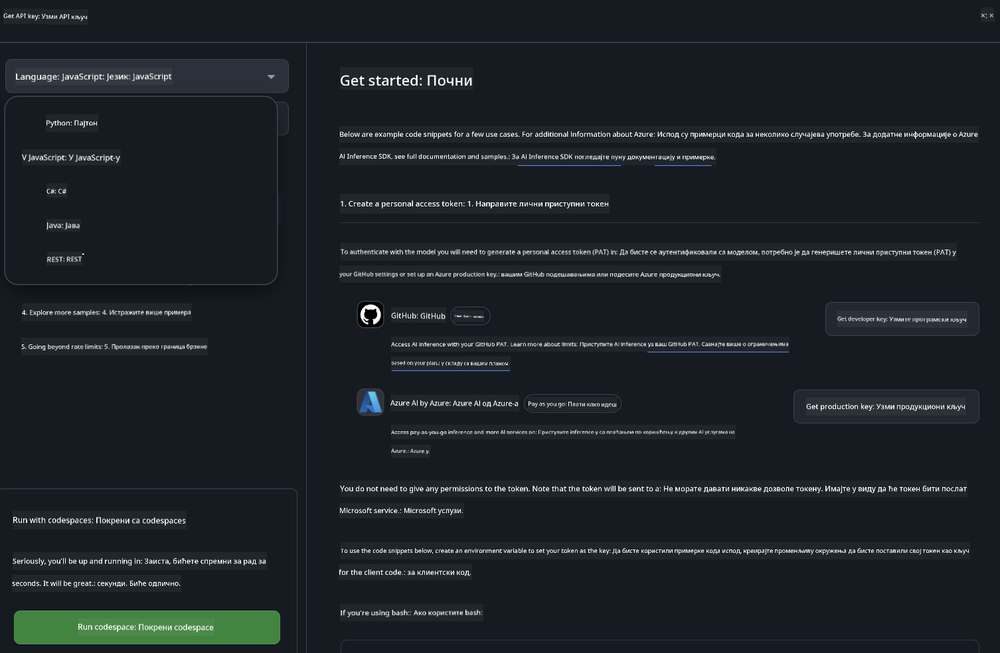
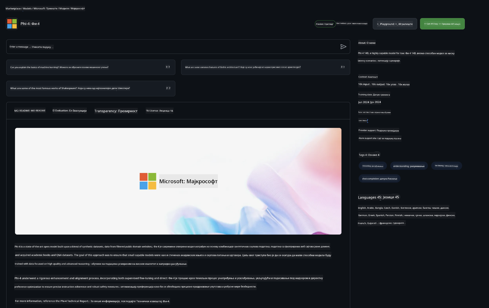

<!--
CO_OP_TRANSLATOR_METADATA:
{
  "original_hash": "5113634b77370af6790f9697d5d7de90",
  "translation_date": "2025-05-09T20:22:11+00:00",
  "source_file": "md/02.QuickStart/GitHubModel_QuickStart.md",
  "language_code": "sr"
}
-->
## GitHub modeli - Ograničena javna beta

Dobrodošli na [GitHub Models](https://github.com/marketplace/models)! Sve je spremno da istražite AI modele hostovane na Azure AI.



Za više informacija o modelima dostupnim na GitHub Models, pogledajte [GitHub Model Marketplace](https://github.com/marketplace/models)

## Dostupni modeli

Svaki model ima svoj prostor za testiranje i primere koda


### Phi-3 modeli u GitHub Model katalogu

[Phi-3-Medium-128k-Instruct](https://github.com/marketplace/models/azureml/Phi-3-medium-128k-instruct)

[Phi-3-medium-4k-instruct](https://github.com/marketplace/models/azureml/Phi-3-medium-4k-instruct)

[Phi-3-mini-128k-instruct](https://github.com/marketplace/models/azureml/Phi-3-mini-128k-instruct)

[Phi-3-mini-4k-instruct](https://github.com/marketplace/models/azureml/Phi-3-mini-4k-instruct)

[Phi-3-small-128k-instruct](https://github.com/marketplace/models/azureml/Phi-3-small-128k-instruct)

[Phi-3-small-8k-instruct](https://github.com/marketplace/models/azureml/Phi-3-small-8k-instruct)

## Početak rada

Postoji nekoliko osnovnih primera spremnih za pokretanje. Možete ih pronaći u direktorijumu samples. Ako želite da odmah pređete na omiljeni jezik, primere možete pronaći u sledećim jezicima:

- Python
- JavaScript
- cURL

Takođe postoji poseban Codespaces okruženje za pokretanje primera i modela.



## Primer koda

Ispod su primeri koda za nekoliko slučajeva upotrebe. Za dodatne informacije o Azure AI Inference SDK, pogledajte kompletnu dokumentaciju i primere.

## Podešavanje

1. Kreirajte personalni pristupni token  
Ne morate dodeljivati nikakve dozvole tokenu. Imajte na umu da će token biti poslat Microsoft servisu.

Da biste koristili primere koda ispod, kreirajte promenljivu okruženja i postavite svoj token kao ključ za klijentski kod.

Ako koristite bash:  
```
export GITHUB_TOKEN="<your-github-token-goes-here>"
```  
Ako ste u powershell-u:  

```
$Env:GITHUB_TOKEN="<your-github-token-goes-here>"
```  

Ako koristite Windows komandnu liniju:  

```
set GITHUB_TOKEN=<your-github-token-goes-here>
```  

## Python primer

### Instalirajte zavisnosti  
Instalirajte Azure AI Inference SDK koristeći pip (zahteva Python >=3.8):  

```
pip install azure-ai-inference
```  
### Pokrenite osnovni primer koda

Ovaj primer prikazuje osnovni poziv chat completion API-ja. Koristi GitHub AI model inference endpoint i vaš GitHub token. Poziv je sinhron.

```
import os
from azure.ai.inference import ChatCompletionsClient
from azure.ai.inference.models import SystemMessage, UserMessage
from azure.core.credentials import AzureKeyCredential

endpoint = "https://models.inference.ai.azure.com"
# Replace Model_Name 
model_name = "Phi-3-small-8k-instruct"
token = os.environ["GITHUB_TOKEN"]

client = ChatCompletionsClient(
    endpoint=endpoint,
    credential=AzureKeyCredential(token),
)

response = client.complete(
    messages=[
        SystemMessage(content="You are a helpful assistant."),
        UserMessage(content="What is the capital of France?"),
    ],
    model=model_name,
    temperature=1.,
    max_tokens=1000,
    top_p=1.
)

print(response.choices[0].message.content)
```

### Pokrenite višekratni razgovor

Ovaj primer prikazuje višekratni razgovor sa chat completion API-jem. Kada koristite model za chat aplikaciju, potrebno je da upravljate istorijom razgovora i šaljete najnovije poruke modelu.

```
import os
from azure.ai.inference import ChatCompletionsClient
from azure.ai.inference.models import AssistantMessage, SystemMessage, UserMessage
from azure.core.credentials import AzureKeyCredential

token = os.environ["GITHUB_TOKEN"]
endpoint = "https://models.inference.ai.azure.com"
# Replace Model_Name
model_name = "Phi-3-small-8k-instruct"

client = ChatCompletionsClient(
    endpoint=endpoint,
    credential=AzureKeyCredential(token),
)

messages = [
    SystemMessage(content="You are a helpful assistant."),
    UserMessage(content="What is the capital of France?"),
    AssistantMessage(content="The capital of France is Paris."),
    UserMessage(content="What about Spain?"),
]

response = client.complete(messages=messages, model=model_name)

print(response.choices[0].message.content)
```

### Strimujte izlaz

Za bolje korisničko iskustvo, poželećete da strimujete odgovor modela kako bi se prvi token pojavio ranije i da ne čekate duge odgovore.

```
import os
from azure.ai.inference import ChatCompletionsClient
from azure.ai.inference.models import SystemMessage, UserMessage
from azure.core.credentials import AzureKeyCredential

token = os.environ["GITHUB_TOKEN"]
endpoint = "https://models.inference.ai.azure.com"
# Replace Model_Name
model_name = "Phi-3-small-8k-instruct"

client = ChatCompletionsClient(
    endpoint=endpoint,
    credential=AzureKeyCredential(token),
)

response = client.complete(
    stream=True,
    messages=[
        SystemMessage(content="You are a helpful assistant."),
        UserMessage(content="Give me 5 good reasons why I should exercise every day."),
    ],
    model=model_name,
)

for update in response:
    if update.choices:
        print(update.choices[0].delta.content or "", end="")

client.close()
```  
## JavaScript

### Instalirajte zavisnosti

Instalirajte Node.js.

Kopirajte sledeće linije teksta i sačuvajte ih kao fajl package.json u vašem folderu.

```
{
  "type": "module",
  "dependencies": {
    "@azure-rest/ai-inference": "latest",
    "@azure/core-auth": "latest",
    "@azure/core-sse": "latest"
  }
}
```

Napomena: @azure/core-sse je potreban samo ako strimujete odgovor chat completions.

Otvorite terminal u ovom folderu i pokrenite npm install.

Za svaki od sledećih primera koda, kopirajte sadržaj u fajl sample.js i pokrenite sa node sample.js.

### Pokrenite osnovni primer koda

Ovaj primer prikazuje osnovni poziv chat completion API-ja. Koristi GitHub AI model inference endpoint i vaš GitHub token. Poziv je sinhron.

```
import ModelClient from "@azure-rest/ai-inference";
import { AzureKeyCredential } from "@azure/core-auth";

const token = process.env["GITHUB_TOKEN"];
const endpoint = "https://models.inference.ai.azure.com";
// Update your modelname
const modelName = "Phi-3-small-8k-instruct";

export async function main() {

  const client = new ModelClient(endpoint, new AzureKeyCredential(token));

  const response = await client.path("/chat/completions").post({
    body: {
      messages: [
        { role:"system", content: "You are a helpful assistant." },
        { role:"user", content: "What is the capital of France?" }
      ],
      model: modelName,
      temperature: 1.,
      max_tokens: 1000,
      top_p: 1.
    }
  });

  if (response.status !== "200") {
    throw response.body.error;
  }
  console.log(response.body.choices[0].message.content);
}

main().catch((err) => {
  console.error("The sample encountered an error:", err);
});
```

### Pokrenite višekratni razgovor

Ovaj primer prikazuje višekratni razgovor sa chat completion API-jem. Kada koristite model za chat aplikaciju, potrebno je da upravljate istorijom razgovora i šaljete najnovije poruke modelu.

```
import ModelClient from "@azure-rest/ai-inference";
import { AzureKeyCredential } from "@azure/core-auth";

const token = process.env["GITHUB_TOKEN"];
const endpoint = "https://models.inference.ai.azure.com";
// Update your modelname
const modelName = "Phi-3-small-8k-instruct";

export async function main() {

  const client = new ModelClient(endpoint, new AzureKeyCredential(token));

  const response = await client.path("/chat/completions").post({
    body: {
      messages: [
        { role: "system", content: "You are a helpful assistant." },
        { role: "user", content: "What is the capital of France?" },
        { role: "assistant", content: "The capital of France is Paris." },
        { role: "user", content: "What about Spain?" },
      ],
      model: modelName,
    }
  });

  if (response.status !== "200") {
    throw response.body.error;
  }

  for (const choice of response.body.choices) {
    console.log(choice.message.content);
  }
}

main().catch((err) => {
  console.error("The sample encountered an error:", err);
});
```

### Strimujte izlaz  
Za bolje korisničko iskustvo, poželećete da strimujete odgovor modela kako bi se prvi token pojavio ranije i da ne čekate duge odgovore.

```
import ModelClient from "@azure-rest/ai-inference";
import { AzureKeyCredential } from "@azure/core-auth";
import { createSseStream } from "@azure/core-sse";

const token = process.env["GITHUB_TOKEN"];
const endpoint = "https://models.inference.ai.azure.com";
// Update your modelname
const modelName = "Phi-3-small-8k-instruct";

export async function main() {

  const client = new ModelClient(endpoint, new AzureKeyCredential(token));

  const response = await client.path("/chat/completions").post({
    body: {
      messages: [
        { role: "system", content: "You are a helpful assistant." },
        { role: "user", content: "Give me 5 good reasons why I should exercise every day." },
      ],
      model: modelName,
      stream: true
    }
  }).asNodeStream();

  const stream = response.body;
  if (!stream) {
    throw new Error("The response stream is undefined");
  }

  if (response.status !== "200") {
    stream.destroy();
    throw new Error(`Failed to get chat completions, http operation failed with ${response.status} code`);
  }

  const sseStream = createSseStream(stream);

  for await (const event of sseStream) {
    if (event.data === "[DONE]") {
      return;
    }
    for (const choice of (JSON.parse(event.data)).choices) {
        process.stdout.write(choice.delta?.content ?? ``);
    }
  }
}

main().catch((err) => {
  console.error("The sample encountered an error:", err);
});
```

## REST

### Pokrenite osnovni primer koda

Nalepite sledeće u shell:

```
curl -X POST "https://models.inference.ai.azure.com/chat/completions" \
    -H "Content-Type: application/json" \
    -H "Authorization: Bearer $GITHUB_TOKEN" \
    -d '{
        "messages": [
            {
                "role": "system",
                "content": "You are a helpful assistant."
            },
            {
                "role": "user",
                "content": "What is the capital of France?"
            }
        ],
        "model": "Phi-3-small-8k-instruct"
    }'
```  
### Pokrenite višekratni razgovor

Pozovite chat completion API i prosledite istoriju razgovora:

```
curl -X POST "https://models.inference.ai.azure.com/chat/completions" \
    -H "Content-Type: application/json" \
    -H "Authorization: Bearer $GITHUB_TOKEN" \
    -d '{
        "messages": [
            {
                "role": "system",
                "content": "You are a helpful assistant."
            },
            {
                "role": "user",
                "content": "What is the capital of France?"
            },
            {
                "role": "assistant",
                "content": "The capital of France is Paris."
            },
            {
                "role": "user",
                "content": "What about Spain?"
            }
        ],
        "model": "Phi-3-small-8k-instruct"
    }'
```  
### Strimujte izlaz

Ovo je primer poziva endpointa sa strimovanjem odgovora.

```
curl -X POST "https://models.inference.ai.azure.com/chat/completions" \
    -H "Content-Type: application/json" \
    -H "Authorization: Bearer $GITHUB_TOKEN" \
    -d '{
        "messages": [
            {
                "role": "system",
                "content": "You are a helpful assistant."
            },
            {
                "role": "user",
                "content": "Give me 5 good reasons why I should exercise every day."
            }
        ],
        "stream": true,
        "model": "Phi-3-small-8k-instruct"
    }'
```

## BESPLATNA upotreba i ograničenja za GitHub modele



[Ograničenja brzine za playground i besplatnu API upotrebu](https://docs.github.com/en/github-models/prototyping-with-ai-models#rate-limits) su tu da vam pomognu da eksperimentišete sa modelima i napravite prototip AI aplikacije. Za korišćenje izvan tih ograničenja i za skaliranje vaše aplikacije, morate obezbediti resurse iz Azure naloga i autentifikovati se preko njega umesto ličnog GitHub tokena. Ne morate menjati ništa drugo u svom kodu. Koristite ovaj link da saznate kako da pređete granice besplatnog nivoa u Azure AI.

### Napomene

Zapamtite da kada radite sa modelom, eksperimentišete sa AI, pa su greške u sadržaju moguće.

Funkcionalnost je ograničena raznim limitima (uključujući zahteve po minuti, zahteve po danu, tokene po zahtevu i istovremene zahteve) i nije namenjena za produkcijske slučajeve.

GitHub Models koristi Azure AI Content Safety. Ovi filteri se ne mogu isključiti kao deo GitHub Models iskustva. Ako odlučite da koristite modele preko plaćenih servisa, podesite filtere sadržaja prema vašim potrebama.

Ova usluga je podložna GitHub-ovim uslovima za predizdanje (Pre-release Terms).

**Одрицање од одговорности**:  
Овај документ је преведен коришћењем AI сервиса за превођење [Co-op Translator](https://github.com/Azure/co-op-translator). Иако тежимо прецизности, молимо вас да имате у виду да аутоматски преводи могу садржати грешке или нетачности. Оригинални документ на његовом изворном језику треба сматрати ауторитетним извором. За критичне информације препоручује се професионални људски превод. Нисмо одговорни за било каква неспоразума или погрешне тумачења која произилазе из коришћења овог превода.