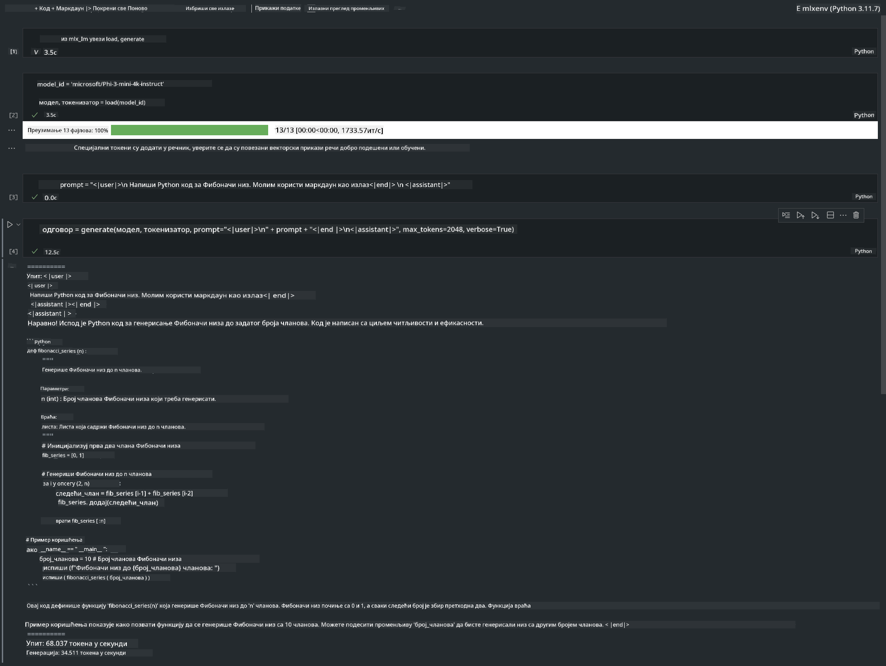

<!--
CO_OP_TRANSLATOR_METADATA:
{
  "original_hash": "dcb656f3d206fc4968e236deec5d4384",
  "translation_date": "2025-07-17T10:09:35+00:00",
  "source_file": "md/03.FineTuning/03.Inference/MLX_Inference.md",
  "language_code": "sr"
}
-->
# **Инференција Phi-3 уз Apple MLX Framework**

## **Шта је MLX Framework**

MLX је фрејмворк за рад са низовима намењен истраживању машинског учења на Apple силицијуму, развијен од стране Apple тима за истраживање машинског учења.

MLX су дизајнирали истраживачи машинског учења за истраживаче машинског учења. Фрејмворк је направљен да буде једноставан за коришћење, али и ефикасан за тренирање и покретање модела. Сам концепт дизајна фрејмворка је такође једноставан. Желимо да омогућимо истраживачима да лако проширују и унапређују MLX како би брзо испробавали нове идеје.

LLM модели могу бити убрзани на Apple Silicon уређајима преко MLX-а, а модели се могу врло једноставно покретати локално.

## **Коришћење MLX за инференцију Phi-3-mini**

### **1. Подешавање MLX окружења**

1. Python 3.11.x  
2. Инсталирање MLX библиотеке


```bash

pip install mlx-lm

```

### **2. Покретање Phi-3-mini у терминалу уз MLX**


```bash

python -m mlx_lm.generate --model microsoft/Phi-3-mini-4k-instruct --max-token 2048 --prompt  "<|user|>\nCan you introduce yourself<|end|>\n<|assistant|>"

```

Резултат (моје окружење је Apple M1 Max, 64GB) је


### **3. Квантизација Phi-3-mini уз MLX у терминалу**


```bash

python -m mlx_lm.convert --hf-path microsoft/Phi-3-mini-4k-instruct

```

***Note：*** Модел се може квантизовати преко mlx_lm.convert, а подразумевана квантизација је INT4. Овај пример квантизује Phi-3-mini у INT4.

Модел се може квантизовати преко mlx_lm.convert, а подразумевана квантизација је INT4. У овом примеру квантизујемо Phi-3-mini у INT4. Након квантизације, модел ће бити сачуван у подразумеваном директоријуму ./mlx_model

Можемо тестирати квантизовани модел уз MLX из терминала


```bash

python -m mlx_lm.generate --model ./mlx_model/ --max-token 2048 --prompt  "<|user|>\nCan you introduce yourself<|end|>\n<|assistant|>"

```

Резултат је


### **4. Покретање Phi-3-mini уз MLX у Jupyter Notebook-у**




***Note:*** Молимо прочитајте овај пример [кликните овде](../../../../../code/03.Inference/MLX/MLX_DEMO.ipynb)


## **Ресурси**

1. Сазнајте више о Apple MLX Framework-у [https://ml-explore.github.io](https://ml-explore.github.io/mlx/build/html/index.html)

2. Apple MLX GitHub репозиторијум [https://github.com/ml-explore](https://github.com/ml-explore)

**Одрицање од одговорности**:  
Овај документ је преведен коришћењем AI услуге за превођење [Co-op Translator](https://github.com/Azure/co-op-translator). Иако се трудимо да превод буде тачан, молимо вас да имате у виду да аутоматски преводи могу садржати грешке или нетачности. Оригинални документ на његовом изворном језику треба сматрати ауторитетним извором. За критичне информације препоручује се професионални људски превод. Нисмо одговорни за било каква неспоразума или погрешна тумачења која произилазе из коришћења овог превода.