<!--
CO_OP_TRANSLATOR_METADATA:
{
  "original_hash": "c1559c5af6caccf6f623fd43a6b3a9a3",
  "translation_date": "2025-05-09T20:38:02+00:00",
  "source_file": "md/03.FineTuning/FineTuning_AIFoundry.md",
  "language_code": "sr"
}
-->
# Fino podešavanje Phi-3 uz Azure AI Foundry

Hajde da istražimo kako da fino podesimo Microsoft-ov Phi-3 Mini jezički model koristeći Azure AI Foundry. Fino podešavanje vam omogućava da prilagodite Phi-3 Mini za specifične zadatke, čineći ga još moćnijim i svesnijim konteksta.

## Razmatranja

- **Mogućnosti:** Koji modeli se mogu fino podesiti? Za šta se osnovni model može fino podesiti?
- **Troškovi:** Kakav je model naplate za fino podešavanje?
- **Prilagodljivost:** Koliko mogu da modifikujem osnovni model – i na koje načine?
- **Praktičnost:** Kako zapravo izgleda proces fino podešavanja – da li moram da pišem prilagođeni kod? Da li moram da obezbedim sopstvene resurse za računanje?
- **Bezbednost:** Fino podešeni modeli mogu imati bezbednosne rizike – da li postoje zaštitne mere koje sprečavaju neželjenu štetu?

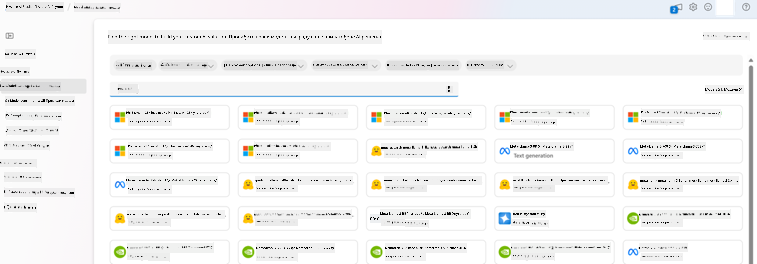

## Priprema za fino podešavanje

### Preduslovi

> [!NOTE]
> Za modele iz Phi-3 porodice, opcija fino podešavanja po modelu "pay-as-you-go" je dostupna samo za hub-ove kreirane u **East US 2** regionima.

- Azure pretplata. Ako nemate Azure pretplatu, napravite [plaćeni Azure nalog](https://azure.microsoft.com/pricing/purchase-options/pay-as-you-go) da biste započeli.

- [AI Foundry projekat](https://ai.azure.com?WT.mc_id=aiml-138114-kinfeylo).
- Azure kontrola pristupa zasnovana na ulogama (Azure RBAC) se koristi za dodeljivanje pristupa operacijama u Azure AI Foundry. Da biste izvršili korake u ovom članku, vaš korisnički nalog mora imati __Azure AI Developer ulogu__ na grupi resursa.

### Registracija provajdera pretplate

Proverite da li je pretplata registrovana za `Microsoft.Network` resource provider.

1. Prijavite se na [Azure portal](https://portal.azure.com).
1. Izaberite **Subscriptions** iz levog menija.
1. Izaberite pretplatu koju želite da koristite.
1. Izaberite **AI project settings** > **Resource providers** iz levog menija.
1. Potvrdite da je **Microsoft.Network** na listi resource providera. Ako nije, dodajte ga.

### Priprema podataka

Pripremite svoje trening i validacione podatke za fino podešavanje modela. Vaši trening i validacioni skupovi podataka sastoje se od ulaznih i izlaznih primera koji pokazuju kako želite da model funkcioniše.

Obavezno da svi vaši primeri treninga prate očekivani format za inferencu. Da biste efikasno fino podesili modele, obezbedite uravnotežen i raznovrstan skup podataka.

To uključuje održavanje balansa podataka, uključivanje različitih scenarija i povremeno usavršavanje trening podataka kako bi se uskladili sa realnim očekivanjima, što na kraju dovodi do tačnijih i uravnoteženijih odgovora modela.

Različiti tipovi modela zahtevaju različit format trening podataka.

### Chat Completion

Podaci za trening i validaciju koje koristite **moraju** biti formatirani kao JSON Lines (JSONL) dokument. Za `Phi-3-mini-128k-instruct`, skup podataka za fino podešavanje mora biti u konverzacijskom formatu koji koristi Chat completions API.

### Primer formata fajla

```json
    {"messages": [{"role": "system", "content": "You are an Xbox customer support agent whose primary goal is to help users with issues they are experiencing with their Xbox devices. You are friendly and concise. You only provide factual answers to queries, and do not provide answers that are not related to Xbox."}, {"role": "user", "content": "Is Xbox better than PlayStation?"}, {"role": "assistant", "content": "I apologize, but I cannot provide personal opinions. My primary job is to assist you with any issues related to your Xbox device. Do you have any Xbox-related issues that need addressing?"}]}
    {"messages": [{"role": "system", "content": "You are an Xbox customer support agent whose primary goal is to help users with issues they are experiencing with their Xbox devices. You are friendly and concise. You only provide factual answers to queries, and do not provide answers that are not related to Xbox."}, {"role": "user", "content": "Can I play PC games on my Xbox?"}, {"role": "assistant", "content": "While Xbox consoles don't natively support PC games, they can play an array of Xbox games, many of which are also available on PC. Can I assist you with finding games compatible with your Xbox device?"}]}
    {"messages": [{"role": "system", "content": "You are an Xbox customer support agent whose primary goal is to help users with issues they are experiencing with their Xbox devices. You are friendly and concise. You only provide factual answers to queries, and do not provide answers that are not related to Xbox."}, {"role": "user", "content": "I'm having trouble connecting my Xbox to the Wi-Fi."}, {"role": "assistant", "content": "No worries, let's go through the network settings on your Xbox. Can you please tell me what happens when you try to connect it to the Wi-Fi?"}]}
```

Podržani tip fajla je JSON Lines. Fajlovi se otpremaju u podrazumevani skladišni prostor i postaju dostupni u vašem projektu.

## Fino podešavanje Phi-3 uz Azure AI Foundry

Azure AI Foundry vam omogućava da prilagodite velike jezičke modele koristeći vaše lične skupove podataka kroz proces poznat kao fino podešavanje. Fino podešavanje donosi značajnu vrednost omogućavajući prilagođavanje i optimizaciju za specifične zadatke i primene. To vodi ka poboljšanim performansama, uštedi troškova, smanjenju latencije i prilagođenim rezultatima.

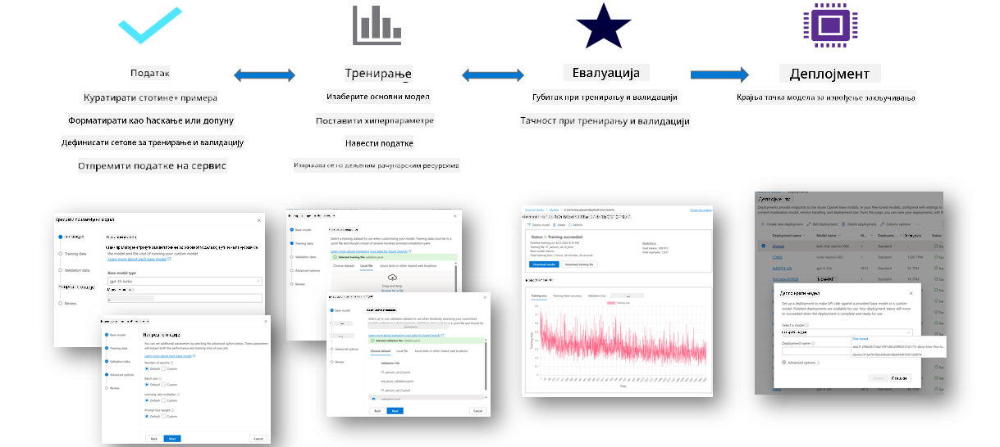

### Kreiranje novog projekta

1. Prijavite se na [Azure AI Foundry](https://ai.azure.com).

1. Izaberite **+New project** da kreirate novi projekat u Azure AI Foundry.

    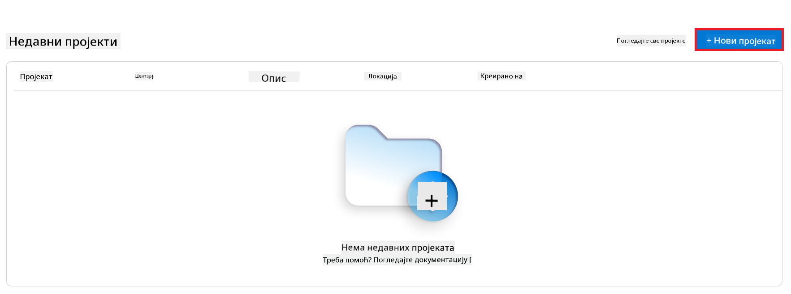

1. Izvršite sledeće zadatke:

    - Naziv projekta **Hub name**. Mora biti jedinstvena vrednost.
    - Izaberite **Hub** koji želite da koristite (kreirajte novi ako je potrebno).

    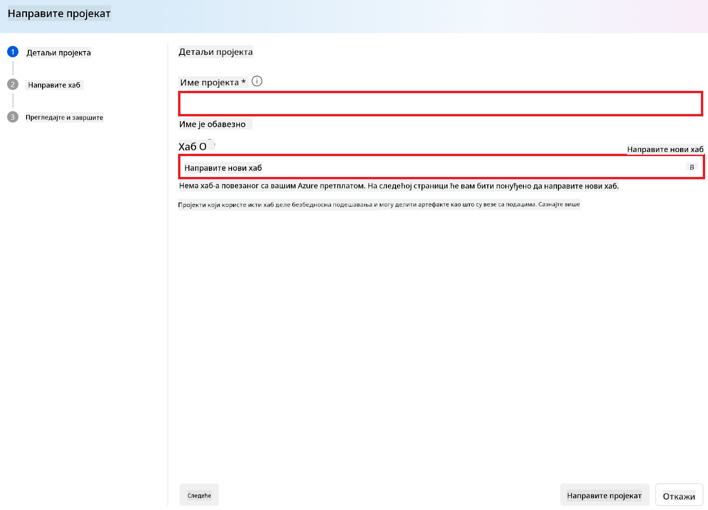

1. Izvršite sledeće zadatke za kreiranje novog huba:

    - Unesite **Hub name**. Mora biti jedinstvena vrednost.
    - Izaberite vašu Azure **Subscription**.
    - Izaberite **Resource group** koji želite da koristite (kreirajte novi ako je potrebno).
    - Izaberite **Location** koji želite da koristite.
    - Izaberite **Connect Azure AI Services** koji želite da koristite (kreirajte novi ako je potrebno).
    - Izaberite **Connect Azure AI Search** i izaberite **Skip connecting**.

    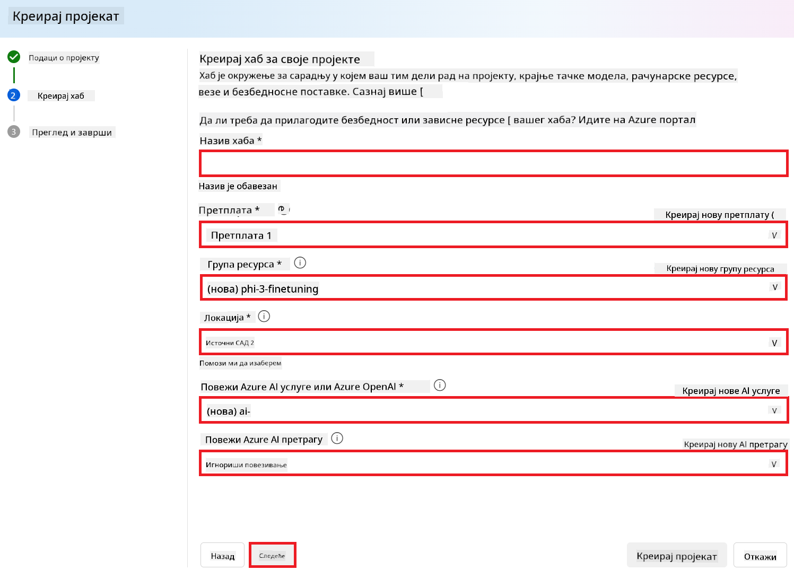

1. Izaberite **Next**.
1. Izaberite **Create a project**.

### Priprema podataka

Pre fino podešavanja, prikupite ili kreirajte skup podataka relevantan za vaš zadatak, kao što su uputstva za chat, parovi pitanja i odgovora ili bilo koji drugi odgovarajući tekstualni podaci. Očistite i pripremite te podatke uklanjanjem šuma, rešavanjem nedostajućih vrednosti i tokenizacijom teksta.

### Fino podešavanje Phi-3 modela u Azure AI Foundry

> [!NOTE]
> Fino podešavanje Phi-3 modela trenutno je podržano samo u projektima lociranim u East US 2.

1. Izaberite **Model catalog** sa leve strane.

1. Ukucajte *phi-3* u **search bar** i izaberite phi-3 model koji želite da koristite.

    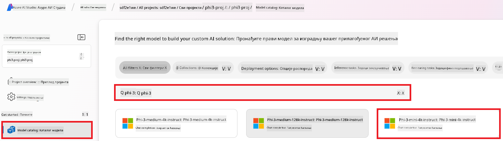

1. Izaberite **Fine-tune**.

    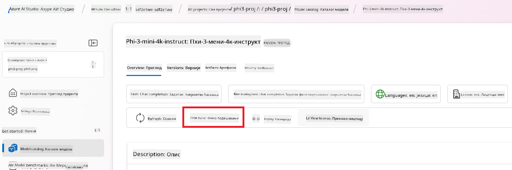

1. Unesite **Fine-tuned model name**.

    

1. Izaberite **Next**.

1. Izvršite sledeće zadatke:

    - Izaberite **task type** na **Chat completion**.
    - Izaberite **Training data** koji želite da koristite. Možete ga otpremiti preko Azure AI Foundry podataka ili sa vašeg lokalnog okruženja.

    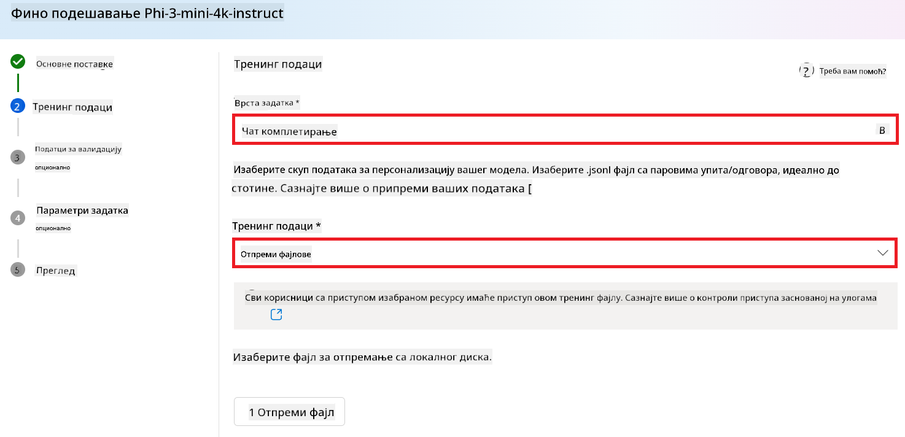

1. Izaberite **Next**.

1. Otpremite **Validation data** koji želite da koristite, ili izaberite **Automatic split of training data**.

    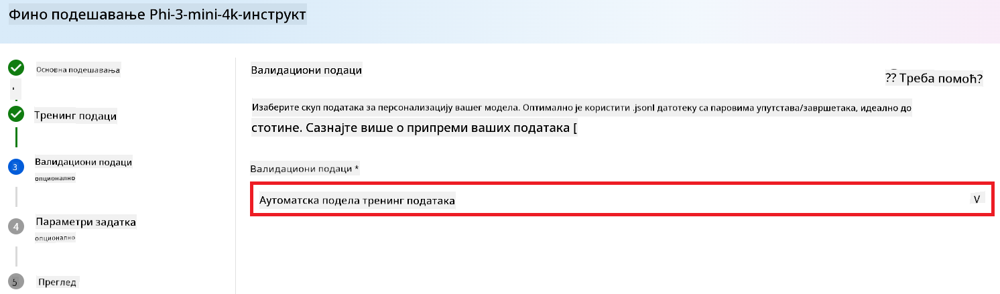

1. Izaberite **Next**.

1. Izvršite sledeće zadatke:

    - Izaberite **Batch size multiplier** koji želite da koristite.
    - Izaberite **Learning rate** koji želite da koristite.
    - Izaberite **Epochs** koje želite da koristite.

    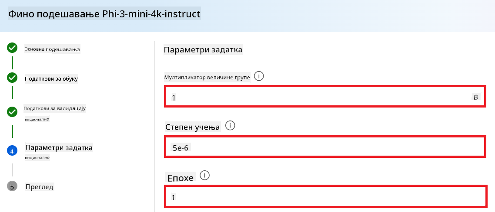

1. Izaberite **Submit** da započnete proces fino podešavanja.

    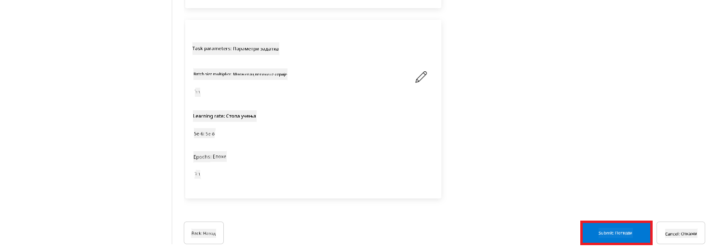

1. Kada je vaš model fino podešen, status će biti prikazan kao **Completed**, kao što je prikazano na slici ispod. Sada možete da implementirate model i koristite ga u svojoj aplikaciji, u playground-u ili u prompt flow-u. Za više informacija, pogledajte [How to deploy Phi-3 family of small language models with Azure AI Foundry](https://learn.microsoft.com/azure/ai-studio/how-to/deploy-models-phi-3?tabs=phi-3-5&pivots=programming-language-python).

    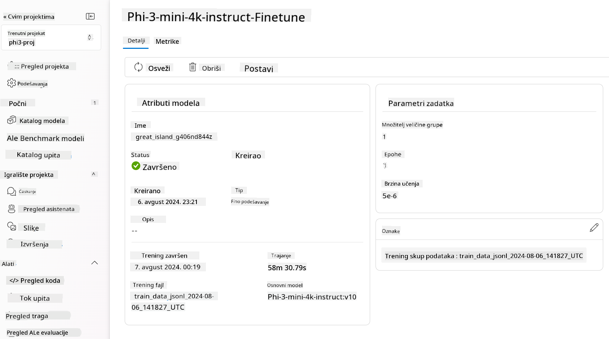

> [!NOTE]
> Za detaljnije informacije o fino podešavanju Phi-3, posetite [Fine-tune Phi-3 models in Azure AI Foundry](https://learn.microsoft.com/azure/ai-studio/how-to/fine-tune-phi-3?tabs=phi-3-mini).

## Brisanje fino podešenih modela

Možete obrisati fino podešen model sa liste modela za fino podešavanje u [Azure AI Foundry](https://ai.azure.com) ili sa stranice detalja modela. Izaberite fino podešen model koji želite da obrišete na stranici Fine-tuning, a zatim kliknite na dugme Delete da biste uklonili model.

> [!NOTE]
> Ne možete obrisati prilagođeni model ako ima postojeću implementaciju. Prvo morate obrisati implementaciju modela pre nego što možete obrisati prilagođeni model.

## Troškovi i kvote

### Razmatranja troškova i kvota za Phi-3 modele fino podešene kao servis

Phi modeli fino podešeni kao servis su ponuđeni od strane Microsoft-a i integrisani sa Azure AI Foundry za korišćenje. Cene možete pronaći prilikom [implementacije](https://learn.microsoft.com/azure/ai-studio/how-to/deploy-models-phi-3?tabs=phi-3-5&pivots=programming-language-python) ili fino podešavanja modela pod karticom Pricing and terms u čarobnjaku za implementaciju.

## Filtriranje sadržaja

Modeli implementirani kao servis sa "pay-as-you-go" modelom su zaštićeni Azure AI Content Safety. Kada su implementirani na real-time krajnje tačke, možete se odjaviti iz ove funkcionalnosti. Sa omogućenim Azure AI Content Safety, i prompt i završetak prolaze kroz skup klasifikacionih modela čiji je cilj da otkriju i spreče generisanje štetnog sadržaja. Sistem filtriranja sadržaja detektuje i preduzima akciju na određene kategorije potencijalno štetnog sadržaja u ulaznim promptovima i izlaznim odgovorima. Saznajte više o [Azure AI Content Safety](https://learn.microsoft.com/azure/ai-studio/concepts/content-filtering).

**Konfiguracija fino podešavanja**

Hiparametri: Definišite hiparametre kao što su learning rate, batch size i broj epoha treninga.

**Funkcija gubitka**

Izaberite odgovarajuću funkciju gubitka za vaš zadatak (npr. cross-entropy).

**Optimizator**

Izaberite optimizator (npr. Adam) za ažuriranje gradijenata tokom treninga.

**Proces fino podešavanja**

- Učitajte prethodno trenirani model: Učitajte Phi-3 Mini checkpoint.
- Dodajte prilagođene slojeve: Dodajte slojeve specifične za zadatak (npr. klasifikaciona glava za chat instrukcije).

**Trenirajte model**  
Fino podesite model koristeći pripremljeni skup podataka. Pratite napredak treninga i po potrebi prilagođavajte hiparametre.

**Evaluacija i validacija**

Validacioni skup: Podelite podatke na trening i validacioni skup.

**Procena performansi**

Koristite metrike kao što su tačnost, F1-score ili perplexity za procenu performansi modela.

## Čuvanje fino podešenog modela

**Checkpoint**  
Sačuvajte checkpoint fino podešenog modela za buduću upotrebu.

## Implementacija

- Implementirajte kao Web servis: Postavite vaš fino podešeni model kao web servis u Azure AI Foundry.
- Testirajte krajnju tačku: Pošaljite test upite na implementiranu krajnju tačku da biste proverili njenu funkcionalnost.

## Iterirajte i unapredite

Iterirajte: Ako performanse nisu zadovoljavajuće, prilagodite hiparametre, dodajte više podataka ili fino podesite dodatne epohe.

## Pratite i usavršavajte

Kontinuirano pratite ponašanje modela i po potrebi ga usavršavajte.

## Prilagodite i proširite

Prilagođeni zadaci: Phi-3 Mini može biti fino podešen za različite zadatke van chat instrukcija. Istražite druge primene!  
Eksperimentišite: Isprobajte različite arhitekture, kombinacije slojeva i tehnike za poboljšanje performansi.

> [!NOTE]
> Fino podešavanje je iterativan proces. Eksperimentišite, učite i prilagođavajte svoj model kako biste postigli najbolje rezultate za vaš specifičan zadatak!

**Одрицање од одговорности**:  
Овај документ је преведен коришћењем AI преводилачке услуге [Co-op Translator](https://github.com/Azure/co-op-translator). Иако тежимо прецизности, молимо вас да имате у виду да аутоматски преводи могу садржати грешке или нетачности. Оригинални документ на његовом изворном језику треба сматрати ауторитетним извором. За критичне информације препоручује се професионални људски превод. Нисмо одговорни за било каква неспоразума или погрешна тумачења која произлазе из коришћења овог превода.