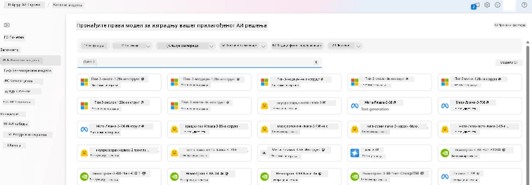
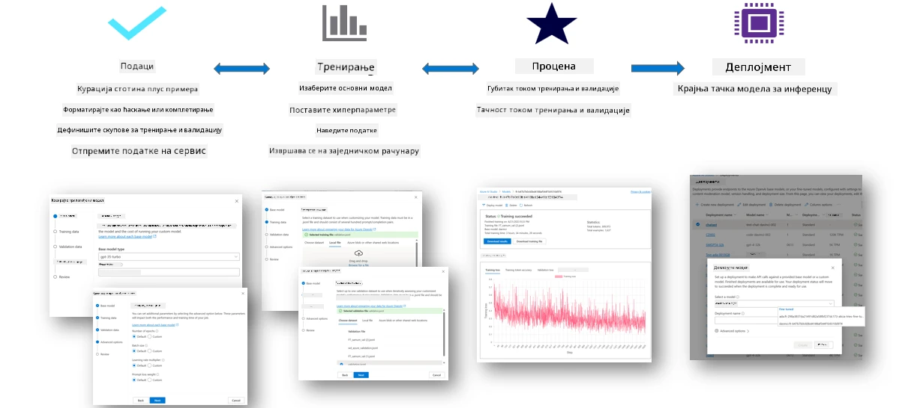
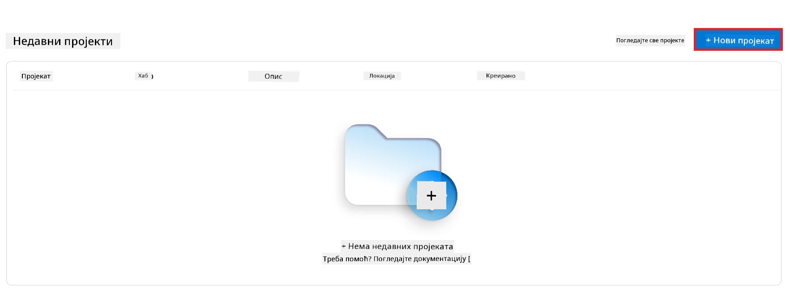
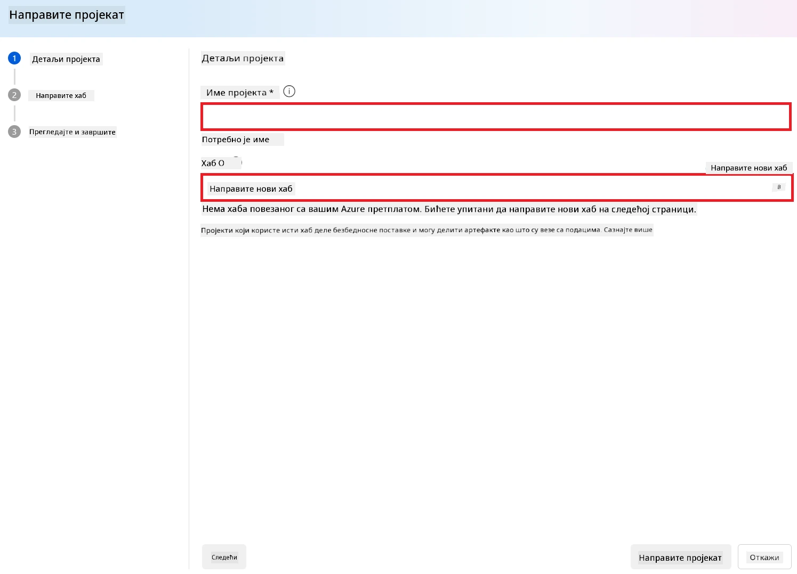
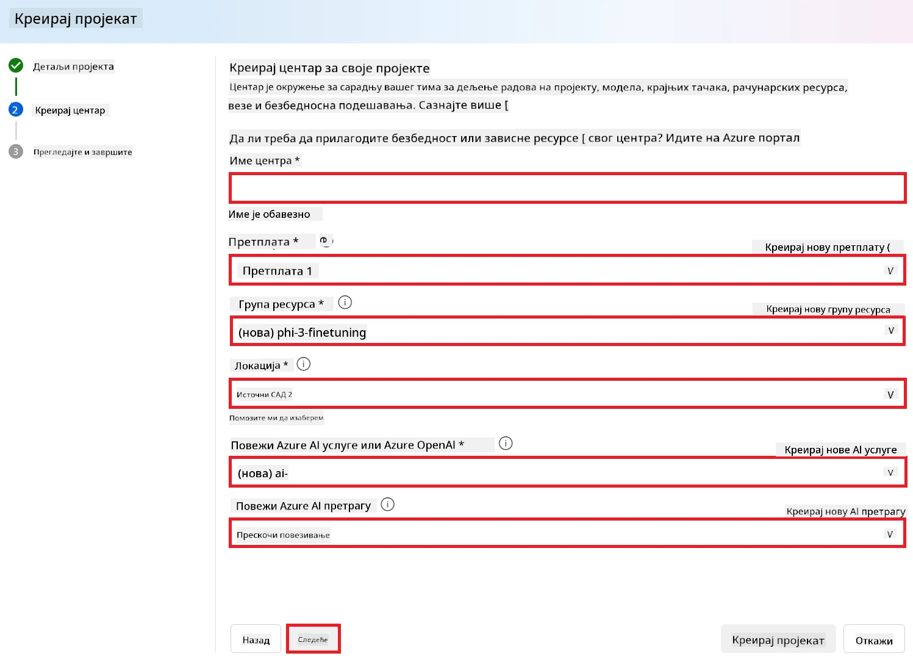
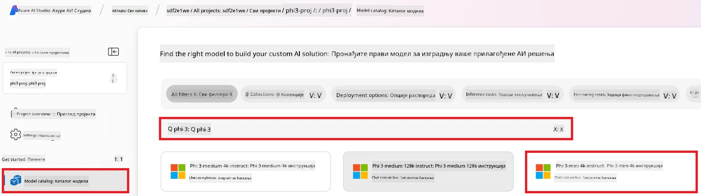
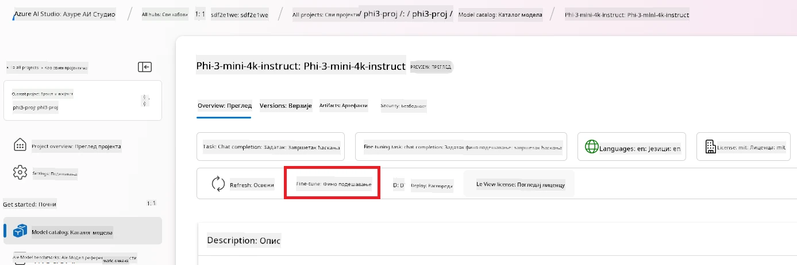
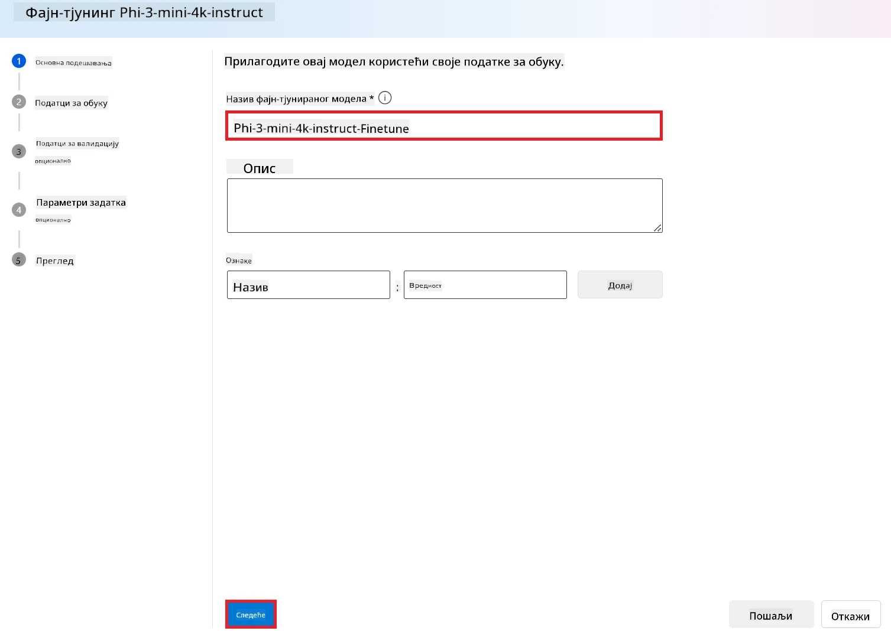
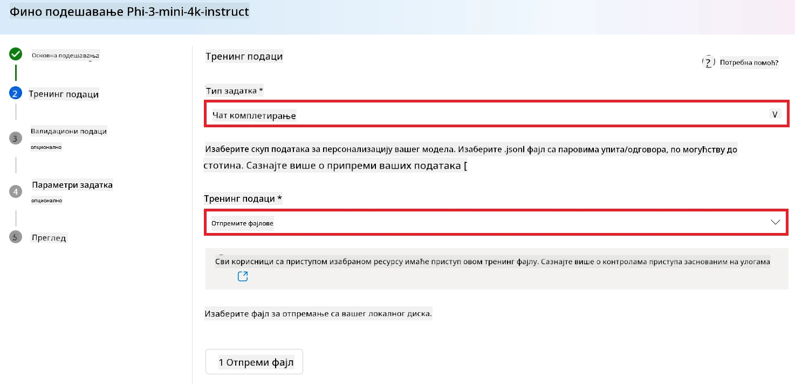
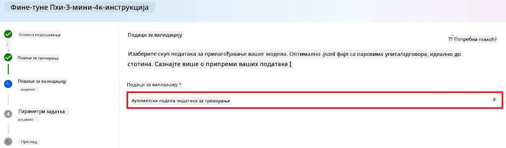

<!--
CO_OP_TRANSLATOR_METADATA:
{
  "original_hash": "c1559c5af6caccf6f623fd43a6b3a9a3",
  "translation_date": "2025-07-17T06:14:53+00:00",
  "source_file": "md/03.FineTuning/FineTuning_AIFoundry.md",
  "language_code": "sr"
}
-->
# Фино подешавање Phi-3 помоћу Azure AI Foundry

Хајде да истражимо како да фино подесимо Microsoft-ов Phi-3 Mini језички модел користећи Azure AI Foundry. Фино подешавање вам омогућава да прилагодите Phi-3 Mini за специфичне задатке, чинећи га још моћнијим и свеснијим контекста.

## Разматрања

- **Могућности:** Који модели се могу фино подесити? Шта основни модел може да уради након фино подешавања?
- **Трошкови:** Како изгледа модел цена за фино подешавање?
- **Прилагодљивост:** Колико могу да изменим основни модел – и на који начин?
- **Практичност:** Како се фино подешавање заправо обавља – да ли морам да пишем прилагођени код? Да ли морам да обезбедим сопствене ресурсе за рачунарство?
- **Безбедност:** Фино подешени модели могу имати безбедносне ризике – да ли постоје неке мере заштите од нежељених последица?



## Припрема за фино подешавање

### Предуслови

> [!NOTE]
> За Phi-3 породицу модела, опција фино подешавања по моделу плаћања по коришћењу је доступна само за хабове креиране у регионима **East US 2**.

- Azure претплата. Ако немате Azure претплату, направите [плаћени Azure налог](https://azure.microsoft.com/pricing/purchase-options/pay-as-you-go) да бисте почели.

- [AI Foundry пројекат](https://ai.azure.com?WT.mc_id=aiml-138114-kinfeylo).
- Azure контроле приступа засноване на улогама (Azure RBAC) се користе за доделу приступа операцијама у Azure AI Foundry. Да бисте извршили кораке у овом чланку, ваш кориснички налог мора имати __Azure AI Developer улогу__ на групи ресурса.

### Регистрација провајдера претплате

Проверите да ли је претплата регистрована за `Microsoft.Network` провајдера ресурса.

1. Пријавите се у [Azure портал](https://portal.azure.com).
1. Изаберите **Subscriptions** из левог менија.
1. Изаберите претплату коју желите да користите.
1. Изаберите **AI project settings** > **Resource providers** из левог менија.
1. Потврдите да је **Microsoft.Network** на листи провајдера ресурса. У супротном, додајте га.

### Припрема података

Припремите своје податке за тренирање и валидацију за фино подешавање модела. Ваши скупови података за тренирање и валидацију састоје се од примера улаза и излаза који показују како желите да модел функционише.

Уверите се да сви ваши примери за тренирање прате очекивани формат за инференцију. Да бисте ефикасно фино подесили моделе, обезбедите уравнотежен и разноврстан скуп података.

Ово подразумева одржавање равнотеже података, укључивање различитих сценарија и периодично усавршавање података за тренирање у складу са стварним очекивањима, што на крају доводи до прецизнијих и уравнотеженијих одговора модела.

Различити типови модела захтевају различит формат података за тренирање.

### Chat Completion

Подаци за тренирање и валидацију које користите **морају** бити форматирани као JSON Lines (JSONL) документ. За `Phi-3-mini-128k-instruct` скуп за фино подешавање мора бити форматиран у конверзацијски формат који користи Chat completions API.

### Пример формата фајла

```json
    {"messages": [{"role": "system", "content": "You are an Xbox customer support agent whose primary goal is to help users with issues they are experiencing with their Xbox devices. You are friendly and concise. You only provide factual answers to queries, and do not provide answers that are not related to Xbox."}, {"role": "user", "content": "Is Xbox better than PlayStation?"}, {"role": "assistant", "content": "I apologize, but I cannot provide personal opinions. My primary job is to assist you with any issues related to your Xbox device. Do you have any Xbox-related issues that need addressing?"}]}
    {"messages": [{"role": "system", "content": "You are an Xbox customer support agent whose primary goal is to help users with issues they are experiencing with their Xbox devices. You are friendly and concise. You only provide factual answers to queries, and do not provide answers that are not related to Xbox."}, {"role": "user", "content": "Can I play PC games on my Xbox?"}, {"role": "assistant", "content": "While Xbox consoles don't natively support PC games, they can play an array of Xbox games, many of which are also available on PC. Can I assist you with finding games compatible with your Xbox device?"}]}
    {"messages": [{"role": "system", "content": "You are an Xbox customer support agent whose primary goal is to help users with issues they are experiencing with their Xbox devices. You are friendly and concise. You only provide factual answers to queries, and do not provide answers that are not related to Xbox."}, {"role": "user", "content": "I'm having trouble connecting my Xbox to the Wi-Fi."}, {"role": "assistant", "content": "No worries, let's go through the network settings on your Xbox. Can you please tell me what happens when you try to connect it to the Wi-Fi?"}]}
```

Подржани тип фајла је JSON Lines. Фајлови се отпремају у подразумевани датастор и постају доступни у вашем пројекту.

## Фино подешавање Phi-3 помоћу Azure AI Foundry

Azure AI Foundry вам омогућава да прилагодите велике језичке моделе вашим личним скуповима података коришћењем процеса познатог као фино подешавање. Фино подешавање пружа значајну вредност омогућавајући прилагођавање и оптимизацију за специфичне задатке и апликације. То доводи до побољшаних перформанси, ефикасности трошкова, смањене латенције и прилагођених резултата.



### Креирање новог пројекта

1. Пријавите се у [Azure AI Foundry](https://ai.azure.com).

1. Изаберите **+New project** да бисте креирали нови пројекат у Azure AI Foundry.

    

1. Извршите следеће задатке:

    - Име пројекта **Hub name**. Мора бити јединствена вредност.
    - Изаберите **Hub** који желите да користите (направите нови ако је потребно).

    

1. Извршите следеће кораке за креирање новог хаба:

    - Унесите **Hub name**. Мора бити јединствена вредност.
    - Изаберите вашу Azure **Subscription**.
    - Изаберите **Resource group** коју желите да користите (направите нову ако је потребно).
    - Изаберите **Location** коју желите да користите.
    - Изаберите **Connect Azure AI Services** коју желите да користите (направите нову ако је потребно).
    - Изаберите **Connect Azure AI Search** и изаберите **Skip connecting**.

    

1. Изаберите **Next**.
1. Изаберите **Create a project**.

### Припрема података

Пре фино подешавања, прикупите или направите скуп података релевантан вашем задатку, као што су упутства за ћаскање, парови питања и одговора или било који други релевантни текстуални подаци. Очистите и претходно обрадите ове податке уклањањем шума, обрадом недостајућих вредности и токенизацијом текста.

### Фино подешавање Phi-3 модела у Azure AI Foundry

> [!NOTE]
> Фино подешавање Phi-3 модела тренутно је подржано само у пројектима лоцираним у East US 2.

1. Изаберите **Model catalog** из левог таба.

1. Упишите *phi-3* у **search bar** и изаберите phi-3 модел који желите да користите.

    

1. Изаберите **Fine-tune**.

    

1. Унесите име **Fine-tuned model name**.

    

1. Изаберите **Next**.

1. Извршите следеће задатке:

    - Изаберите тип задатка **task type** као **Chat completion**.
    - Изаберите **Training data** који желите да користите. Можете га отпремити преко Azure AI Foundry података или са вашег локалног окружења.

    

1. Изаберите **Next**.

1. Отпремите **Validation data** који желите да користите или изаберите **Automatic split of training data**.

    

1. Изаберите **Next**.

1. Извршите следеће задатке:

    - Изаберите **Batch size multiplier** који желите да користите.
    - Изаберите **Learning rate** који желите да користите.
    - Изаберите број **Epochs** који желите да користите.

    

1. Изаберите **Submit** да бисте покренули процес фино подешавања.

    

1. Када је ваш модел фино подешен, статус ће бити приказан као **Completed**, као што је приказано на слици испод. Сада можете да имплементирате модел и користите га у својој апликацији, у playground-у или у prompt flow-у. За више информација, погледајте [How to deploy Phi-3 family of small language models with Azure AI Foundry](https://learn.microsoft.com/azure/ai-studio/how-to/deploy-models-phi-3?tabs=phi-3-5&pivots=programming-language-python).

    

> [!NOTE]
> За детаљније информације о фино подешавању Phi-3, посетите [Fine-tune Phi-3 models in Azure AI Foundry](https://learn.microsoft.com/azure/ai-studio/how-to/fine-tune-phi-3?tabs=phi-3-mini).

## Брисање фино подешених модела

Можете избрисати фино подешени модел са листе модела за фино подешавање у [Azure AI Foundry](https://ai.azure.com) или са странице детаља модела. Изаберите фино подешени модел који желите да избришете са странице за фино подешавање, а затим изаберите дугме Delete да бисте га избрисали.

> [!NOTE]
> Не можете избрисати прилагођени модел ако има постојећу имплементацију. Прво морате избрисати имплементацију модела пре него што избришете прилагођени модел.

## Трошкови и квоте

### Разматрања о трошковима и квотама за Phi-3 моделе фино подешене као услуга

Phi модели фино подешени као услуга нуде се од стране Microsoft-а и интегрисани су са Azure AI Foundry за употребу. Можете пронаћи цене приликом [деплоја](https://learn.microsoft.com/azure/ai-studio/how-to/deploy-models-phi-3?tabs=phi-3-5&pivots=programming-language-python) или фино подешавања модела у одељку Pricing and terms у чаробњаку за деплој.

## Филтрирање садржаја

Модели деплојовани као услуга по моделу плаћања по коришћењу заштићени су Azure AI Content Safety. Када се деплојују на реално време крајње тачке, можете искључити ову могућност. Са омогућеним Azure AI content safety, и упит и одговор пролазе кроз ансамбл класификационих модела чији је циљ да открију и спрече излаз штетног садржаја. Систем за филтрирање садржаја детектује и реагује на одређене категорије потенцијално штетног садржаја у улазним упитима и излазним одговорима. Сазнајте више о [Azure AI Content Safety](https://learn.microsoft.com/azure/ai-studio/concepts/content-filtering).

**Конфигурација фино подешавања**

Хиперпараметри: Дефинишите хиперпараметре као што су learning rate, batch size и број епоха тренирања.

**Функција губитка**

Изаберите одговарајућу функцију губитка за ваш задатак (нпр. cross-entropy).

**Оптимизатор**

Изаберите оптимизатор (нпр. Adam) за ажурирање градијента током тренирања.

**Процес фино подешавања**

- Учитајте претходно обучени модел: Учитајте Phi-3 Mini checkpoint.
- Додајте прилагођене слојеве: Додајте слојеве специфичне за задатак (нпр. classification head за упутства за ћаскање).

**Тренирање модела**  
Фино подесите модел користећи припремљени скуп података. Пратите напредак тренирања и по потреби прилагођавајте хиперпараметре.

**Евалуација и валидација**

Валидациони скуп: Поделите податке на тренирајући и валидациони скуп.

**Процените перформансе**

Користите метрике као што су тачност, F1-score или perplexity за процену перформанси модела.

## Чување фино подешеног модела

**Checkpoint**  
Сачувајте checkpoint фино подешеног модела за будућу употребу.

## Деплој

- Деплојујте као веб услугу: Деплојујте свој фино подешени модел као веб услугу у Azure AI Foundry.
- Тестирајте крајњу тачку: Пошаљите тест упите на деплојовану крајњу тачку да бисте проверили њену функционалност.

## Итерација и унапређење

Итерација: Ако перформансе нису задовољавајуће, поновите процес прилагођавањем хиперпараметара, додавањем више података или финим подешавањем током додатних епоха.

## Праћење и усавршавање

Континуирано пратите понашање модела и усавршавајте га по потреби.

## Прилагођавање и проширење

Прилагођени задаци: Phi-3 Mini се може фино подесити за различите задатке осим упутстава за ћаскање. Истражите друге примене!  
Експериментишите: Испробајте различите архитектуре, комбинације слојева и технике за побољшање перформанси.

> [!NOTE]
> Фино подешавање је итеративан процес. Експериментишите, учите и прилагођавајте свој модел да бисте постигли најбоље резултате за свој специфични задатак!

**Одрицање од одговорности**:  
Овај документ је преведен коришћењем AI сервиса за превођење [Co-op Translator](https://github.com/Azure/co-op-translator). Иако се трудимо да превод буде тачан, молимо вас да имате у виду да аутоматски преводи могу садржати грешке или нетачности. Оригинални документ на његовом изворном језику треба сматрати ауторитетним извором. За критичне информације препоручује се професионални људски превод. Нисмо одговорни за било каква неспоразума или погрешна тумачења настала коришћењем овог превода.