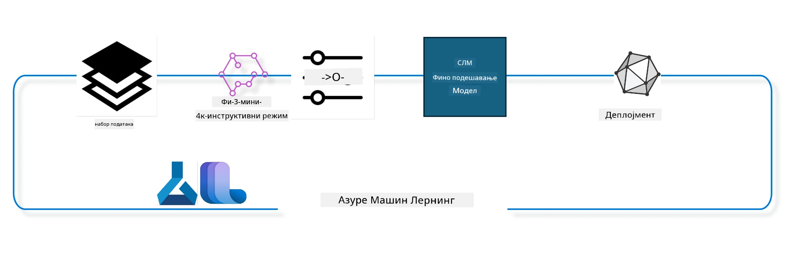

## Како користити chat-completion компоненте из Azure ML системског регистра за фино подешавање модела

У овом примеру ћемо извршити фино подешавање модела Phi-3-mini-4k-instruct да заврши разговор између 2 особе користећи ultrachat_200k скуп података.



Пример ће вам показати како да извршите фино подешавање користећи Azure ML SDK и Python, а затим како да распоредите фино подешени модел на онлајн крајњу тачку за реално време предвиђања.

### Тренинг подаци

Користићемо ultrachat_200k скуп података. Ово је јако филтрирана верзија UltraChat скупа података и коришћена је за тренирање Zephyr-7B-β, врхунског 7b chat модела.

### Модел

Користићемо Phi-3-mini-4k-instruct модел да покажемо како корисник може фино подесити модел за задатак chat-completion. Ако сте отворили овај notebook са одређене странице модела, запамтите да замените име модела.

### Задаци

- Изаберите модел за фино подешавање.
- Изаберите и истражите тренинг податке.
- Конфигуришите посао фино подешавања.
- Покрените посао фино подешавања.
- Прегледајте метрике тренинга и евалуације.
- Региструјте фино подешени модел.
- Распоредите фино подешени модел за реално време предвиђања.
- Очистите ресурсе.

## 1. Подешавање предуслова

- Инсталирајте зависности
- Повежите се са AzureML Workspace-ом. Сазнајте више о подешавању аутентификације SDK-а. Замените <WORKSPACE_NAME>, <RESOURCE_GROUP> и <SUBSCRIPTION_ID> у наставку.
- Повежите се са azureml системским регистром
- Поставите опционално име експеримента
- Проверите или креирајте рачунарске ресурсе.

> [!NOTE]
> Захтеви: један GPU чвор може имати више GPU картица. На пример, у једном чвору Standard_NC24rs_v3 налазе се 4 NVIDIA V100 GPU-а, док у Standard_NC12s_v3 има 2 NVIDIA V100 GPU-а. Погледајте документацију за ове информације. Број GPU картица по чвору се подешава у параметру gpus_per_node у наставку. Правилно подешавање ове вредности обезбедиће коришћење свих GPU-а у чвору. Препоручени GPU compute SKU-ови могу се наћи овде и овде.

### Python библиотеке

Инсталирајте зависности покретањем следеће ћелије. Ово није опционални корак ако радите у новом окружењу.

```bash
pip install azure-ai-ml
pip install azure-identity
pip install datasets==2.9.0
pip install mlflow
pip install azureml-mlflow
```

### Интеракција са Azure ML

1. Овај Python скрипт служи за интеракцију са Azure Machine Learning (Azure ML) сервисом. Ево шта ради:

    - Увози потребне модуле из azure.ai.ml, azure.identity и azure.ai.ml.entities пакета. Такође увози и time модул.

    - Покушава да се аутентификује користећи DefaultAzureCredential(), који пружа поједностављено искуство аутентификације за брз почетак развоја апликација у Azure облаку. Ако то не успе, користи InteractiveBrowserCredential(), који пружа интерактивни прозор за пријаву.

    - Затим покушава да креира MLClient инстанцу користећи from_config методу, која чита конфигурацију из подразумеваног конфигурационог фајла (config.json). Ако то не успе, креира MLClient инстанцу ручно пружајући subscription_id, resource_group_name и workspace_name.

    - Креира још једну MLClient инстанцу, овог пута за Azure ML регистар под именом "azureml". Овај регистар је место где се чувају модели, pipeline-ови за фино подешавање и окружења.

    - Поставља experiment_name на "chat_completion_Phi-3-mini-4k-instruct".

    - Генерише јединствени временски жиг претварајући тренутно време (у секундама од епохе, као број са покретним зарезом) у целобројну вредност, а затим у стринг. Овај временски жиг може да се користи за креирање јединствених имена и верзија.

    ```python
    # Import necessary modules from Azure ML and Azure Identity
    from azure.ai.ml import MLClient
    from azure.identity import (
        DefaultAzureCredential,
        InteractiveBrowserCredential,
    )
    from azure.ai.ml.entities import AmlCompute
    import time  # Import time module
    
    # Try to authenticate using DefaultAzureCredential
    try:
        credential = DefaultAzureCredential()
        credential.get_token("https://management.azure.com/.default")
    except Exception as ex:  # If DefaultAzureCredential fails, use InteractiveBrowserCredential
        credential = InteractiveBrowserCredential()
    
    # Try to create an MLClient instance using the default config file
    try:
        workspace_ml_client = MLClient.from_config(credential=credential)
    except:  # If that fails, create an MLClient instance by manually providing the details
        workspace_ml_client = MLClient(
            credential,
            subscription_id="<SUBSCRIPTION_ID>",
            resource_group_name="<RESOURCE_GROUP>",
            workspace_name="<WORKSPACE_NAME>",
        )
    
    # Create another MLClient instance for the Azure ML registry named "azureml"
    # This registry is where models, fine-tuning pipelines, and environments are stored
    registry_ml_client = MLClient(credential, registry_name="azureml")
    
    # Set the experiment name
    experiment_name = "chat_completion_Phi-3-mini-4k-instruct"
    
    # Generate a unique timestamp that can be used for names and versions that need to be unique
    timestamp = str(int(time.time()))
    ```

## 2. Изаберите основни модел за фино подешавање

1. Phi-3-mini-4k-instruct је модел са 3.8 милијарди параметара, лаган и врхунски отворени модел базиран на скупу података коришћеном за Phi-2. Модел припада Phi-3 породичном моделу, а Mini верзија долази у две варијанте 4K и 128K, што је дужина контекста (у токенима) коју може да подржи. Потребно је да фино подесимо модел за нашу специфичну употребу. Можете прегледати ове моделе у Model Catalog у AzureML Studio-у, филтрирајући по задатку chat-completion. У овом примеру користимо Phi-3-mini-4k-instruct модел. Ако сте отворили овај notebook за други модел, замените име и верзију модела у складу са тим.

    > [!NOTE]
    > својство model id модела. Ово ће бити прослеђено као улаз у посао фино подешавања. Такође је доступно као Asset ID поље на страници детаља модела у AzureML Studio Model Catalog-у.

2. Овај Python скрипт интерагује са Azure Machine Learning (Azure ML) сервисом. Ево шта ради:

    - Поставља model_name на "Phi-3-mini-4k-instruct".

    - Користи get методу са models својства registry_ml_client објекта да преузме најновију верзију модела са наведеним именом из Azure ML регистра. get метода се позива са два аргумента: именом модела и ознаком која указује да треба преузети најновију верзију модела.

    - Исписује поруку у конзолу која показује име, верзију и id модела који ће се користити за фино подешавање. format метода стринга се користи да убаци име, верзију и id модела у поруку. Име, верзија и id модела се приступају као својства foundation_model објекта.

    ```python
    # Set the model name
    model_name = "Phi-3-mini-4k-instruct"
    
    # Get the latest version of the model from the Azure ML registry
    foundation_model = registry_ml_client.models.get(model_name, label="latest")
    
    # Print the model name, version, and id
    # This information is useful for tracking and debugging
    print(
        "\n\nUsing model name: {0}, version: {1}, id: {2} for fine tuning".format(
            foundation_model.name, foundation_model.version, foundation_model.id
        )
    )
    ```

## 3. Креирајте рачунарске ресурсе за посао

Фино подешавање ради САМО са GPU рачунарским ресурсима. Величина ресурса зависи од величине модела и у већини случајева је тешко одредити прави ресурс за посао. У овој ћелији водимо корисника како да изабере прави ресурс.

> [!NOTE]
> Испод наведени ресурси раде са најоптимизованијом конфигурацијом. Било какве промене у конфигурацији могу довести до Cuda Out Of Memory грешке. У таквим случајевима покушајте да надоградите ресурс на већу величину.

> [!NOTE]
> При избору compute_cluster_size испод, уверите се да је ресурс доступан у вашој resource group. Ако одређени ресурс није доступан, можете поднети захтев за приступ рачунарским ресурсима.

### Провера подршке модела за фино подешавање

1. Овај Python скрипт интерагује са Azure Machine Learning (Azure ML) моделом. Ево шта ради:

    - Увози ast модул, који пружа функције за обраду стабала Python апстрактне синтаксе.

    - Проверава да ли foundation_model објекат (који представља модел у Azure ML) има таг finetune_compute_allow_list. Тагови у Azure ML су парови кључ-вредност које можете креирати и користити за филтрирање и сортирање модела.

    - Ако таг finetune_compute_allow_list постоји, користи ast.literal_eval функцију да безбедно парсира вредност тага (стринг) у Python листу. Ова листа се додељује променљивој computes_allow_list. Затим исписује поруку да треба креирати ресурс са листе.

    - Ако таг finetune_compute_allow_list не постоји, поставља computes_allow_list на None и исписује поруку да таг није део тагова модела.

    - Укратко, овај скрипт проверава одређени таг у метаподацима модела, претвара вредност тага у листу ако постоји и пружа повратну информацију кориснику.

    ```python
    # Import the ast module, which provides functions to process trees of the Python abstract syntax grammar
    import ast
    
    # Check if the 'finetune_compute_allow_list' tag is present in the model's tags
    if "finetune_compute_allow_list" in foundation_model.tags:
        # If the tag is present, use ast.literal_eval to safely parse the tag's value (a string) into a Python list
        computes_allow_list = ast.literal_eval(
            foundation_model.tags["finetune_compute_allow_list"]
        )  # convert string to python list
        # Print a message indicating that a compute should be created from the list
        print(f"Please create a compute from the above list - {computes_allow_list}")
    else:
        # If the tag is not present, set computes_allow_list to None
        computes_allow_list = None
        # Print a message indicating that the 'finetune_compute_allow_list' tag is not part of the model's tags
        print("`finetune_compute_allow_list` is not part of model tags")
    ```

### Провера Compute Instance

1. Овај Python скрипт интерагује са Azure Machine Learning (Azure ML) сервисом и извршава неколико провера на compute инстанци. Ево шта ради:

    - Покушава да преузме compute инстанцу са именом из compute_cluster из Azure ML workspace-а. Ако је стање provisioning-а "failed", баца ValueError.

    - Проверава да ли је computes_allow_list различит од None. Ако јесте, претвара све величине ресурса у листи у мала слова и проверава да ли је величина тренутне compute инстанце у листи. Ако није, баца ValueError.

    - Ако је computes_allow_list None, проверава да ли је величина compute инстанце у листи неподржаних GPU VM величина. Ако јесте, баца ValueError.

    - Преузима листу свих доступних величина compute ресурса у workspace-у. Затим пролази кроз ову листу и за сваки ресурс проверава да ли се име поклапа са величином тренутне compute инстанце. Ако јесте, преузима број GPU-а за ту величину и поставља gpu_count_found на True.

    - Ако је gpu_count_found True, исписује број GPU-а у compute инстанци. Ако није, баца ValueError.

    - Укратко, овај скрипт извршава неколико провера на compute инстанци у Azure ML workspace-у, укључујући проверу стања provisioning-а, величине у односу на листу дозвољених или забрањених величина и броја GPU-а.

    ```python
    # Print the exception message
    print(e)
    # Raise a ValueError if the compute size is not available in the workspace
    raise ValueError(
        f"WARNING! Compute size {compute_cluster_size} not available in workspace"
    )
    
    # Retrieve the compute instance from the Azure ML workspace
    compute = workspace_ml_client.compute.get(compute_cluster)
    # Check if the provisioning state of the compute instance is "failed"
    if compute.provisioning_state.lower() == "failed":
        # Raise a ValueError if the provisioning state is "failed"
        raise ValueError(
            f"Provisioning failed, Compute '{compute_cluster}' is in failed state. "
            f"please try creating a different compute"
        )
    
    # Check if computes_allow_list is not None
    if computes_allow_list is not None:
        # Convert all compute sizes in computes_allow_list to lowercase
        computes_allow_list_lower_case = [x.lower() for x in computes_allow_list]
        # Check if the size of the compute instance is in computes_allow_list_lower_case
        if compute.size.lower() not in computes_allow_list_lower_case:
            # Raise a ValueError if the size of the compute instance is not in computes_allow_list_lower_case
            raise ValueError(
                f"VM size {compute.size} is not in the allow-listed computes for finetuning"
            )
    else:
        # Define a list of unsupported GPU VM sizes
        unsupported_gpu_vm_list = [
            "standard_nc6",
            "standard_nc12",
            "standard_nc24",
            "standard_nc24r",
        ]
        # Check if the size of the compute instance is in unsupported_gpu_vm_list
        if compute.size.lower() in unsupported_gpu_vm_list:
            # Raise a ValueError if the size of the compute instance is in unsupported_gpu_vm_list
            raise ValueError(
                f"VM size {compute.size} is currently not supported for finetuning"
            )
    
    # Initialize a flag to check if the number of GPUs in the compute instance has been found
    gpu_count_found = False
    # Retrieve a list of all available compute sizes in the workspace
    workspace_compute_sku_list = workspace_ml_client.compute.list_sizes()
    available_sku_sizes = []
    # Iterate over the list of available compute sizes
    for compute_sku in workspace_compute_sku_list:
        available_sku_sizes.append(compute_sku.name)
        # Check if the name of the compute size matches the size of the compute instance
        if compute_sku.name.lower() == compute.size.lower():
            # If it does, retrieve the number of GPUs for that compute size and set gpu_count_found to True
            gpus_per_node = compute_sku.gpus
            gpu_count_found = True
    # If gpu_count_found is True, print the number of GPUs in the compute instance
    if gpu_count_found:
        print(f"Number of GPU's in compute {compute.size}: {gpus_per_node}")
    else:
        # If gpu_count_found is False, raise a ValueError
        raise ValueError(
            f"Number of GPU's in compute {compute.size} not found. Available skus are: {available_sku_sizes}."
            f"This should not happen. Please check the selected compute cluster: {compute_cluster} and try again."
        )
    ```

## 4. Изаберите скуп података за фино подешавање модела

1. Користимо ultrachat_200k скуп података. Скуп има четири подскупа, погодна за Supervised fine-tuning (sft).
Generation ranking (gen). Број примера по подскупу је приказан овако:

    ```bash
    train_sft test_sft  train_gen  test_gen
    207865  23110  256032  28304
    ```

1. Следеће ћелије показују основну припрему података за фино подешавање:

### Визуелизација неких редова података

Желимо да овај узорак брзо ради, па сачувајте train_sft, test_sft фајлове који садрже 5% већ обрезаних редова. То значи да ће фино подешени модел имати мању прецизност, па не би требало да се користи у стварним условима.
download-dataset.py се користи за преузимање ultrachat_200k скупа података и трансформацију скупа у формат који може да користи pipeline за фино подешавање. Пошто је скуп велики, овде имамо само део скупа.

1. Покретање следећег скрипта преузима само 5% података. Ово се може повећати променом параметра dataset_split_pc на жељени проценат.

    > [!NOTE]
    > Неки језички модели имају различите језичке кодове, па имена колона у скупу података треба да одговарају томе.

1. Ево примера како подаци треба да изгледају
chat-completion скуп података је сачуван у parquet формату са сваком ставком која користи следећу шему:

    - Ово је JSON (JavaScript Object Notation) документ, популаран формат за размену података. Није извршни код, већ начин за чување и пренос података. Ево структуре:

    - "prompt": Овај кључ садржи стринг вредност која представља задатак или питање постављено AI асистенту.

    - "messages": Овај кључ садржи низ објеката. Сваки објекат представља поруку у разговору између корисника и AI асистента. Сваки објекат поруке има два кључа:

    - "content": Овај кључ садржи стринг вредност која представља садржај поруке.
    - "role": Овај кључ садржи стринг вредност која представља улогу ентитета који је послао поруку. Може бити "user" или "assistant".
    - "prompt_id": Овај кључ садржи стринг вредност која представља јединствени идентификатор за prompt.

1. У овом конкретном JSON документу, приказан је разговор у ком корисник тражи од AI асистента да креира протагониста за дистопијску причу. Асистент одговара, а корисник затим тражи више детаља. Асистент се слаже да пружи више детаља. Цео разговор је повезан са одређеним prompt_id.

    ```python
    {
        // The task or question posed to an AI assistant
        "prompt": "Create a fully-developed protagonist who is challenged to survive within a dystopian society under the rule of a tyrant. ...",
        
        // An array of objects, each representing a message in a conversation between a user and an AI assistant
        "messages":[
            {
                // The content of the user's message
                "content": "Create a fully-developed protagonist who is challenged to survive within a dystopian society under the rule of a tyrant. ...",
                // The role of the entity that sent the message
                "role": "user"
            },
            {
                // The content of the assistant's message
                "content": "Name: Ava\n\n Ava was just 16 years old when the world as she knew it came crashing down. The government had collapsed, leaving behind a chaotic and lawless society. ...",
                // The role of the entity that sent the message
                "role": "assistant"
            },
            {
                // The content of the user's message
                "content": "Wow, Ava's story is so intense and inspiring! Can you provide me with more details.  ...",
                // The role of the entity that sent the message
                "role": "user"
            }, 
            {
                // The content of the assistant's message
                "content": "Certainly! ....",
                // The role of the entity that sent the message
                "role": "assistant"
            }
        ],
        
        // A unique identifier for the prompt
        "prompt_id": "d938b65dfe31f05f80eb8572964c6673eddbd68eff3db6bd234d7f1e3b86c2af"
    }
    ```

### Преузимање података

1. Овај Python скрипт се користи за преузимање скупа података помоћу помоћног скрипта download-dataset.py. Ево шта ради:

    - Увози os модул, који пружа преносив начин коришћења функционалности зависних од оперативног система.

    - Користи os.system функцију да покрене download-dataset.py скрипт у шкољци са одређеним аргументима командне линије. Аргументи одређују који скуп података да се преузме (HuggingFaceH4/ultrachat_200k), у који директоријум (ultrachat_200k_dataset) и проценат података за подељеност (5). os.system враћа статус изласка команде; овај статус се чува у променљивој exit_status.

    - Проверава да ли exit_status није 0. У Unix-у, статус 0 обично значи да је команда успешно извршена, док свака друга вредност указује на грешку. Ако exit_status није 0, баца Exception са поруком о грешци приликом преузимања скупа података.

    - Укратко, овај скрипт покреће команду за преузимање скупа података помоћу помоћног скрипта и баца изузетак ако команда не успе.

    ```python
    # Import the os module, which provides a way of using operating system dependent functionality
    import os
    
    # Use the os.system function to run the download-dataset.py script in the shell with specific command-line arguments
    # The arguments specify the dataset to download (HuggingFaceH4/ultrachat_200k), the directory to download it to (ultrachat_200k_dataset), and the percentage of the dataset to split (5)
    # The os.system function returns the exit status of the command it executed; this status is stored in the exit_status variable
    exit_status = os.system(
        "python ./download-dataset.py --dataset HuggingFaceH4/ultrachat_200k --download_dir ultrachat_200k_dataset --dataset_split_pc 5"
    )
    
    # Check if exit_status is not 0
    # In Unix-like operating systems, an exit status of 0 usually indicates that a command has succeeded, while any other number indicates an error
    # If exit_status is not 0, raise an Exception with a message indicating that there was an error downloading the dataset
    if exit_status != 0:
        raise Exception("Error downloading dataset")
    ```

### Учитавање података у DataFrame

1. Овај Python скрипт учитава JSON Lines фајл у pandas DataFrame и приказује првих 5 редова. Ево шта ради:

    - Увози pandas библиотеку, која је моћан алат за манипулацију и анализу података.

    - Поставља максималну ширину колоне за приказ у pandas-у на 0. То значи да ће цео текст у колони бити приказан без скраћивања када се DataFrame испише.

    - Користи pd.read_json функцију да учита train_sft.jsonl фајл из ultrachat_200k_dataset директоријума у DataFrame. Аргумент lines=True указује да је фајл у JSON Lines формату, где је сваки ред посебан JSON објекат.
- Користи метод head да прикаже првих 5 редова DataFrame-а. Ако DataFrame има мање од 5 редова, приказаће све.

- Укратко, овај скрипт учитава JSON Lines фајл у DataFrame и приказује првих 5 редова са потпуним текстом колона.

```python
    # Import the pandas library, which is a powerful data manipulation and analysis library
    import pandas as pd
    
    # Set the maximum column width for pandas' display options to 0
    # This means that the full text of each column will be displayed without truncation when the DataFrame is printed
    pd.set_option("display.max_colwidth", 0)
    
    # Use the pd.read_json function to load the train_sft.jsonl file from the ultrachat_200k_dataset directory into a DataFrame
    # The lines=True argument indicates that the file is in JSON Lines format, where each line is a separate JSON object
    df = pd.read_json("./ultrachat_200k_dataset/train_sft.jsonl", lines=True)
    
    # Use the head method to display the first 5 rows of the DataFrame
    # If the DataFrame has less than 5 rows, it will display all of them
    df.head()
    ```

## 5. Пошаљите задатак фино подешавање користећи модел и податке као улаз

Креирајте задатак који користи компоненту chat-completion pipeline. Сазнајте више о свим параметрима који се подржавају за фино подешавање.

### Дефинисање параметара фино подешавања

1. Параметри фино подешавања могу се груписати у 2 категорије - параметри тренинга и параметри оптимизације

1. Параметри тренинга дефинишу аспекте тренинга као што су -

    - Оптимизатор, scheduler који се користи
    - Метрика која се оптимизује током фино подешавања
    - Број корака тренинга, величина batch-а и слично
    - Параметри оптимизације помажу у оптимизацији GPU меморије и ефикасном коришћењу рачунарских ресурса.

1. Испод су неки од параметара који припадају овој категорији. Параметри оптимизације се разликују за сваки модел и долазе упаковани са моделом како би се управљало тим варијацијама.

    - Омогућити deepspeed и LoRA
    - Омогућити тренинг са мешовитом прецизношћу
    - Омогућити тренинг на више чворова


> [!NOTE]
> Надгледано фино подешавање може довести до губитка усклађености или катастрофалног заборава. Препоручујемо да проверите овај проблем и покренете фазу усклађивања након фино подешавања.

### Параметри фино подешавања

1. Овај Python скрипт подешава параметре за фино подешавање модела машинског учења. Ево шта ради:

    - Поставља подразумеване параметре тренинга као што су број епоха, величина batch-а за тренинг и евалуацију, learning rate и тип learning rate scheduler-а.

    - Поставља подразумеване параметре оптимизације као што су да ли се примењује Layer-wise Relevance Propagation (LoRa) и DeepSpeed, и DeepSpeed стадијум.

    - Комбинује параметре тренинга и оптимизације у један речник под називом finetune_parameters.

    - Проверава да ли foundation_model има неке подразумеване параметре специфичне за модел. Ако има, исписује упозорење и ажурира finetune_parameters речник тим модел-специфичним подразумеваним вредностима. Функција ast.literal_eval се користи да конвертује те вредности из стринга у Python речник.

    - Исписује коначни скуп параметара за фино подешавање који ће се користити током извршавања.

    - Укратко, овај скрипт подешава и приказује параметре за фино подешавање модела машинског учења, са могућношћу да се подразумевани параметри препишу модел-специфичним.

```python
    # Set up default training parameters such as the number of training epochs, batch sizes for training and evaluation, learning rate, and learning rate scheduler type
    training_parameters = dict(
        num_train_epochs=3,
        per_device_train_batch_size=1,
        per_device_eval_batch_size=1,
        learning_rate=5e-6,
        lr_scheduler_type="cosine",
    )
    
    # Set up default optimization parameters such as whether to apply Layer-wise Relevance Propagation (LoRa) and DeepSpeed, and the DeepSpeed stage
    optimization_parameters = dict(
        apply_lora="true",
        apply_deepspeed="true",
        deepspeed_stage=2,
    )
    
    # Combine the training and optimization parameters into a single dictionary called finetune_parameters
    finetune_parameters = {**training_parameters, **optimization_parameters}
    
    # Check if the foundation_model has any model-specific default parameters
    # If it does, print a warning message and update the finetune_parameters dictionary with these model-specific defaults
    # The ast.literal_eval function is used to convert the model-specific defaults from a string to a Python dictionary
    if "model_specific_defaults" in foundation_model.tags:
        print("Warning! Model specific defaults exist. The defaults could be overridden.")
        finetune_parameters.update(
            ast.literal_eval(  # convert string to python dict
                foundation_model.tags["model_specific_defaults"]
            )
        )
    
    # Print the final set of fine-tuning parameters that will be used for the run
    print(
        f"The following finetune parameters are going to be set for the run: {finetune_parameters}"
    )
    ```

### Тренинг Pipeline

1. Овај Python скрипт дефинише функцију за генерисање приказног имена за pipeline тренинга машинског учења, а затим позива ту функцију да генерише и испише приказно име. Ево шта ради:

1. Дефинисана је функција get_pipeline_display_name. Ова функција генерише приказно име на основу различитих параметара везаних за тренинг pipeline.

1. Унутар функције, израчунава укупну величину batch-а множећи batch size по уређају, број корака акумулације градијента, број GPU-а по чвору и број чворова који се користе за фино подешавање.

1. Преузима различите друге параметре као што су тип learning rate scheduler-а, да ли се користи DeepSpeed, DeepSpeed стадијум, да ли се користи Layer-wise Relevance Propagation (LoRa), ограничење броја сачуваних checkpoint-ова и максимална дужина секвенце.

1. Конструише стринг који укључује све ове параметре, раздвојене цртицама. Ако се користи DeepSpeed или LoRa, стринг укључује "ds" праћено DeepSpeed стадијумом, или "lora", респективно. Ако не, укључује "nods" или "nolora".

1. Функција враћа овај стринг који служи као приказно име за тренинг pipeline.

1. Након дефиниције, функција се позива да генерише приказно име, које се затим исписује.

1. Укратко, овај скрипт генерише приказно име за тренинг pipeline машинског учења на основу различитих параметара и исписује га.

```python
    # Define a function to generate a display name for the training pipeline
    def get_pipeline_display_name():
        # Calculate the total batch size by multiplying the per-device batch size, the number of gradient accumulation steps, the number of GPUs per node, and the number of nodes used for fine-tuning
        batch_size = (
            int(finetune_parameters.get("per_device_train_batch_size", 1))
            * int(finetune_parameters.get("gradient_accumulation_steps", 1))
            * int(gpus_per_node)
            * int(finetune_parameters.get("num_nodes_finetune", 1))
        )
        # Retrieve the learning rate scheduler type
        scheduler = finetune_parameters.get("lr_scheduler_type", "linear")
        # Retrieve whether DeepSpeed is applied
        deepspeed = finetune_parameters.get("apply_deepspeed", "false")
        # Retrieve the DeepSpeed stage
        ds_stage = finetune_parameters.get("deepspeed_stage", "2")
        # If DeepSpeed is applied, include "ds" followed by the DeepSpeed stage in the display name; if not, include "nods"
        if deepspeed == "true":
            ds_string = f"ds{ds_stage}"
        else:
            ds_string = "nods"
        # Retrieve whether Layer-wise Relevance Propagation (LoRa) is applied
        lora = finetune_parameters.get("apply_lora", "false")
        # If LoRa is applied, include "lora" in the display name; if not, include "nolora"
        if lora == "true":
            lora_string = "lora"
        else:
            lora_string = "nolora"
        # Retrieve the limit on the number of model checkpoints to keep
        save_limit = finetune_parameters.get("save_total_limit", -1)
        # Retrieve the maximum sequence length
        seq_len = finetune_parameters.get("max_seq_length", -1)
        # Construct the display name by concatenating all these parameters, separated by hyphens
        return (
            model_name
            + "-"
            + "ultrachat"
            + "-"
            + f"bs{batch_size}"
            + "-"
            + f"{scheduler}"
            + "-"
            + ds_string
            + "-"
            + lora_string
            + f"-save_limit{save_limit}"
            + f"-seqlen{seq_len}"
        )
    
    # Call the function to generate the display name
    pipeline_display_name = get_pipeline_display_name()
    # Print the display name
    print(f"Display name used for the run: {pipeline_display_name}")
    ```

### Конфигурисање Pipeline

Овај Python скрипт дефинише и конфигурише pipeline машинског учења користећи Azure Machine Learning SDK. Ево шта ради:

1. Увози потребне модуле из Azure AI ML SDK.

1. Преузима компоненту pipeline-а под именом "chat_completion_pipeline" из регистра.

1. Дефинише pipeline job користећи `@pipeline` декоратор и функцију `create_pipeline`. Име pipeline-а је подешено на `pipeline_display_name`.

1. Унутар функције `create_pipeline`, иницијализује преузету компоненту pipeline-а са различитим параметрима, укључујући пут до модела, compute кластере за различите фазе, податке за тренинг и тестирање, број GPU-а за фино подешавање и друге параметре фино подешавања.

1. Мапира излаз фино подешавања на излаз pipeline job-а. Ово је урађено како би се фино подешени модел лако регистровао, што је потребно за деплој модела на online или batch endpoint.

1. Креира инстанцу pipeline-а позивом функције `create_pipeline`.

1. Поставља подешавање `force_rerun` pipeline-а на `True`, што значи да се неће користити кеширани резултати претходних задатака.

1. Поставља подешавање `continue_on_step_failure` pipeline-а на `False`, што значи да ће pipeline престати ако неки корак не успе.

1. Укратко, овај скрипт дефинише и конфигурише pipeline машинског учења за задатак chat completion користећи Azure Machine Learning SDK.

```python
    # Import necessary modules from the Azure AI ML SDK
    from azure.ai.ml.dsl import pipeline
    from azure.ai.ml import Input
    
    # Fetch the pipeline component named "chat_completion_pipeline" from the registry
    pipeline_component_func = registry_ml_client.components.get(
        name="chat_completion_pipeline", label="latest"
    )
    
    # Define the pipeline job using the @pipeline decorator and the function create_pipeline
    # The name of the pipeline is set to pipeline_display_name
    @pipeline(name=pipeline_display_name)
    def create_pipeline():
        # Initialize the fetched pipeline component with various parameters
        # These include the model path, compute clusters for different stages, dataset splits for training and testing, the number of GPUs to use for fine-tuning, and other fine-tuning parameters
        chat_completion_pipeline = pipeline_component_func(
            mlflow_model_path=foundation_model.id,
            compute_model_import=compute_cluster,
            compute_preprocess=compute_cluster,
            compute_finetune=compute_cluster,
            compute_model_evaluation=compute_cluster,
            # Map the dataset splits to parameters
            train_file_path=Input(
                type="uri_file", path="./ultrachat_200k_dataset/train_sft.jsonl"
            ),
            test_file_path=Input(
                type="uri_file", path="./ultrachat_200k_dataset/test_sft.jsonl"
            ),
            # Training settings
            number_of_gpu_to_use_finetuning=gpus_per_node,  # Set to the number of GPUs available in the compute
            **finetune_parameters
        )
        return {
            # Map the output of the fine tuning job to the output of pipeline job
            # This is done so that we can easily register the fine tuned model
            # Registering the model is required to deploy the model to an online or batch endpoint
            "trained_model": chat_completion_pipeline.outputs.mlflow_model_folder
        }
    
    # Create an instance of the pipeline by calling the create_pipeline function
    pipeline_object = create_pipeline()
    
    # Don't use cached results from previous jobs
    pipeline_object.settings.force_rerun = True
    
    # Set continue on step failure to False
    # This means that the pipeline will stop if any step fails
    pipeline_object.settings.continue_on_step_failure = False
    ```

### Пошаљите задатак

1. Овај Python скрипт шаље pipeline job машинског учења у Azure Machine Learning workspace и чека да се задатак заврши. Ево шта ради:

    - Позива метод create_or_update објекта jobs у workspace_ml_client-у да пошаље pipeline job. Pipeline који се извршава је назначен преко pipeline_object, а експеримент под којим се задатак извршава је назначен преко experiment_name.

    - Затим позива метод stream објекта jobs у workspace_ml_client-у да сачека да pipeline job буде завршен. Задатак који се чека је назначен преко name атрибута pipeline_job објекта.

    - Укратко, овај скрипт шаље pipeline job машинског учења у Azure Machine Learning workspace и чека да се задатак заврши.

```python
    # Submit the pipeline job to the Azure Machine Learning workspace
    # The pipeline to be run is specified by pipeline_object
    # The experiment under which the job is run is specified by experiment_name
    pipeline_job = workspace_ml_client.jobs.create_or_update(
        pipeline_object, experiment_name=experiment_name
    )
    
    # Wait for the pipeline job to complete
    # The job to wait for is specified by the name attribute of the pipeline_job object
    workspace_ml_client.jobs.stream(pipeline_job.name)
    ```

## 6. Региструјте фино подешени модел у workspace-у

Регистроваћемо модел из излаза задатка фино подешавања. Ово ће пратити порекло између фино подешеног модела и задатка фино подешавања. Задатак фино подешавања даље прати порекло до основног модела, података и кода за тренинг.

### Регистрација ML модела

1. Овај Python скрипт региструје модел машинског учења који је трениран у Azure Machine Learning pipeline-у. Ево шта ради:

    - Увози потребне модуле из Azure AI ML SDK.

    - Проверава да ли је излаз trained_model доступан из pipeline job-а позивајући get метод објекта jobs у workspace_ml_client-у и приступајући његовом outputs атрибуту.

    - Конструише пут до тренираног модела форматирањем стринга са именом pipeline job-а и именом излаза ("trained_model").

    - Дефинише име за фино подешени модел додавањем "-ultrachat-200k" оригиналном имену модела и замењује све косе црте цртицама.

    - Припрема регистрацију модела креирањем Model објекта са различитим параметрима, укључујући пут до модела, тип модела (MLflow модел), име и верзију модела, и опис модела.

    - Региструје модел позивајући create_or_update метод објекта models у workspace_ml_client-у са Model објектом као аргументом.

    - Исписује регистровани модел.

1. Укратко, овај скрипт региструје модел машинског учења који је трениран у Azure Machine Learning pipeline-у.

```python
    # Import necessary modules from the Azure AI ML SDK
    from azure.ai.ml.entities import Model
    from azure.ai.ml.constants import AssetTypes
    
    # Check if the `trained_model` output is available from the pipeline job
    print("pipeline job outputs: ", workspace_ml_client.jobs.get(pipeline_job.name).outputs)
    
    # Construct a path to the trained model by formatting a string with the name of the pipeline job and the name of the output ("trained_model")
    model_path_from_job = "azureml://jobs/{0}/outputs/{1}".format(
        pipeline_job.name, "trained_model"
    )
    
    # Define a name for the fine-tuned model by appending "-ultrachat-200k" to the original model name and replacing any slashes with hyphens
    finetuned_model_name = model_name + "-ultrachat-200k"
    finetuned_model_name = finetuned_model_name.replace("/", "-")
    
    print("path to register model: ", model_path_from_job)
    
    # Prepare to register the model by creating a Model object with various parameters
    # These include the path to the model, the type of the model (MLflow model), the name and version of the model, and a description of the model
    prepare_to_register_model = Model(
        path=model_path_from_job,
        type=AssetTypes.MLFLOW_MODEL,
        name=finetuned_model_name,
        version=timestamp,  # Use timestamp as version to avoid version conflict
        description=model_name + " fine tuned model for ultrachat 200k chat-completion",
    )
    
    print("prepare to register model: \n", prepare_to_register_model)
    
    # Register the model by calling the create_or_update method of the models object in the workspace_ml_client with the Model object as the argument
    registered_model = workspace_ml_client.models.create_or_update(
        prepare_to_register_model
    )
    
    # Print the registered model
    print("registered model: \n", registered_model)
    ```

## 7. Деплојујте фино подешени модел на online endpoint

Online endpoint-и пружају трајан REST API који се може користити за интеграцију са апликацијама које треба да користе модел.

### Управљање Endpoint-ом

1. Овај Python скрипт креира managed online endpoint у Azure Machine Learning за регистровани модел. Ево шта ради:

    - Увози потребне модуле из Azure AI ML SDK.

    - Дефинише јединствено име за online endpoint додавањем временске ознаке на стринг "ultrachat-completion-".

    - Припрема креирање online endpoint-а креирањем ManagedOnlineEndpoint објекта са различитим параметрима, укључујући име endpoint-а, опис endpoint-а и режим аутентификације ("key").

    - Креира online endpoint позивајући begin_create_or_update метод workspace_ml_client-а са ManagedOnlineEndpoint објектом као аргументом. Затим чека да операција креирања буде завршена позивајући wait метод.

1. Укратко, овај скрипт креира managed online endpoint у Azure Machine Learning за регистровани модел.

```python
    # Import necessary modules from the Azure AI ML SDK
    from azure.ai.ml.entities import (
        ManagedOnlineEndpoint,
        ManagedOnlineDeployment,
        ProbeSettings,
        OnlineRequestSettings,
    )
    
    # Define a unique name for the online endpoint by appending a timestamp to the string "ultrachat-completion-"
    online_endpoint_name = "ultrachat-completion-" + timestamp
    
    # Prepare to create the online endpoint by creating a ManagedOnlineEndpoint object with various parameters
    # These include the name of the endpoint, a description of the endpoint, and the authentication mode ("key")
    endpoint = ManagedOnlineEndpoint(
        name=online_endpoint_name,
        description="Online endpoint for "
        + registered_model.name
        + ", fine tuned model for ultrachat-200k-chat-completion",
        auth_mode="key",
    )
    
    # Create the online endpoint by calling the begin_create_or_update method of the workspace_ml_client with the ManagedOnlineEndpoint object as the argument
    # Then wait for the creation operation to complete by calling the wait method
    workspace_ml_client.begin_create_or_update(endpoint).wait()
    ```

> [!NOTE]
> Овде можете пронаћи листу SKU-ова који се подржавају за деплој - [Managed online endpoints SKU list](https://learn.microsoft.com/azure/machine-learning/reference-managed-online-endpoints-vm-sku-list)

### Деплојовање ML модела

1. Овај Python скрипт деплојује регистровани модел машинског учења на managed online endpoint у Azure Machine Learning. Ево шта ради:

    - Увози ast модул, који пружа функције за обраду стабала Python апстрактне синтаксе.

    - Поставља тип инстанце за деплој на "Standard_NC6s_v3".

    - Проверава да ли је таг inference_compute_allow_list присутан у foundation model-у. Ако јесте, конвертује вредност тага из стринга у Python листу и додељује је inference_computes_allow_list. Ако није, поставља inference_computes_allow_list на None.

    - Проверава да ли је назначени тип инстанце у листи дозвољених. Ако није, исписује поруку која тражи од корисника да изабере тип инстанце из дозвољене листе.

    - Припрема креирање деплоја креирањем ManagedOnlineDeployment објекта са различитим параметрима, укључујући име деплоја, име endpoint-а, ID модела, тип и број инстанци, подешавања probe-а за живост и подешавања захтева.

    - Креира деплој позивајући begin_create_or_update метод workspace_ml_client-а са ManagedOnlineDeployment објектом као аргументом. Затим чека да операција креирања буде завршена позивајући wait метод.

    - Поставља саобраћај endpoint-а да усмерава 100% саобраћаја на "demo" деплој.

    - Ажурира endpoint позивајући begin_create_or_update метод workspace_ml_client-а са endpoint објектом као аргументом. Затим чека да операција ажурирања буде завршена позивајући result метод.

1. Укратко, овај скрипт деплојује регистровани модел машинског учења на managed online endpoint у Azure Machine Learning.

```python
    # Import the ast module, which provides functions to process trees of the Python abstract syntax grammar
    import ast
    
    # Set the instance type for the deployment
    instance_type = "Standard_NC6s_v3"
    
    # Check if the `inference_compute_allow_list` tag is present in the foundation model
    if "inference_compute_allow_list" in foundation_model.tags:
        # If it is, convert the tag value from a string to a Python list and assign it to `inference_computes_allow_list`
        inference_computes_allow_list = ast.literal_eval(
            foundation_model.tags["inference_compute_allow_list"]
        )
        print(f"Please create a compute from the above list - {computes_allow_list}")
    else:
        # If it's not, set `inference_computes_allow_list` to `None`
        inference_computes_allow_list = None
        print("`inference_compute_allow_list` is not part of model tags")
    
    # Check if the specified instance type is in the allow list
    if (
        inference_computes_allow_list is not None
        and instance_type not in inference_computes_allow_list
    ):
        print(
            f"`instance_type` is not in the allow listed compute. Please select a value from {inference_computes_allow_list}"
        )
    
    # Prepare to create the deployment by creating a `ManagedOnlineDeployment` object with various parameters
    demo_deployment = ManagedOnlineDeployment(
        name="demo",
        endpoint_name=online_endpoint_name,
        model=registered_model.id,
        instance_type=instance_type,
        instance_count=1,
        liveness_probe=ProbeSettings(initial_delay=600),
        request_settings=OnlineRequestSettings(request_timeout_ms=90000),
    )
    
    # Create the deployment by calling the `begin_create_or_update` method of the `workspace_ml_client` with the `ManagedOnlineDeployment` object as the argument
    # Then wait for the creation operation to complete by calling the `wait` method
    workspace_ml_client.online_deployments.begin_create_or_update(demo_deployment).wait()
    
    # Set the traffic of the endpoint to direct 100% of the traffic to the "demo" deployment
    endpoint.traffic = {"demo": 100}
    
    # Update the endpoint by calling the `begin_create_or_update` method of the `workspace_ml_client` with the `endpoint` object as the argument
    # Then wait for the update operation to complete by calling the `result` method
    workspace_ml_client.begin_create_or_update(endpoint).result()
    ```

## 8. Тестирајте endpoint са примером података

Узмемо неке примерке података из тест сета и пошаљемо их на online endpoint за инференцу. Затим ћемо приказати предвиђене ознаке заједно са стварним ознакама.

### Читање резултата

1. Овај Python скрипт учитава JSON Lines фајл у pandas DataFrame, узима насумичан узорак и ресетује индекс. Ево шта ради:

    - Учитава фајл ./ultrachat_200k_dataset/test_gen.jsonl у pandas DataFrame. Функција read_json се користи са аргументом lines=True јер је фајл у JSON Lines формату, где је сваки ред посебан JSON објекат.

    - Узима насумичан узорак од 1 реда из DataFrame-а. Функција sample се користи са аргументом n=1 да би се одредио број насумичних редова.

    - Ресетује индекс DataFrame-а. Функција reset_index се користи са аргументом drop=True да би се оригинални индекс одбацио и заменио новим индексом са подразумеваним целобројним вредностима.

    - Приказује прва 2 реда DataFrame-а користећи функцију head са аргументом 2. Међутим, пошто DataFrame садржи само један ред након узорковања, приказаће само тај један ред.

1. Укратко, овај скрипт учитава JSON Lines фајл у pandas DataFrame, узима насумичан узорак од 1 реда, ресетује индекс и приказује први ред.

```python
    # Import pandas library
    import pandas as pd
    
    # Read the JSON Lines file './ultrachat_200k_dataset/test_gen.jsonl' into a pandas DataFrame
    # The 'lines=True' argument indicates that the file is in JSON Lines format, where each line is a separate JSON object
    test_df = pd.read_json("./ultrachat_200k_dataset/test_gen.jsonl", lines=True)
    
    # Take a random sample of 1 row from the DataFrame
    # The 'n=1' argument specifies the number of random rows to select
    test_df = test_df.sample(n=1)
    
    # Reset the index of the DataFrame
    # The 'drop=True' argument indicates that the original index should be dropped and replaced with a new index of default integer values
    # The 'inplace=True' argument indicates that the DataFrame should be modified in place (without creating a new object)
    test_df.reset_index(drop=True, inplace=True)
    
    # Display the first 2 rows of the DataFrame
    # However, since the DataFrame only contains one row after the sampling, this will only display that one row
    test_df.head(2)
    ```

### Креирање JSON објекта

1. Овај Python скрипт креира JSON објекат са одређеним параметрима и чува га у фајл. Ево шта ради:

    - Увози json модул, који пружа функције за рад са JSON подацима.

    - Креира речник parameters са кључевима и вредностима који представљају параметре за модел машинског учења. Кључеви су "temperature", "top_p", "do_sample" и "max_new_tokens", а њихове вредности су 0.6, 0.9, True и 200, респективно.

    - Креира други речник test_json са два кључа: "input_data" и "params". Вредност "input_data" је други речник са кључевима "input_string" и "parameters". Вредност "input_string" је листа која садржи прву поруку из test_df DataFrame-а. Вредност "parameters" је речник parameters креиран раније. Вредност "params" је празан речник.
- Отвара фајл под именом sample_score.json

```python
    # Import the json module, which provides functions to work with JSON data
    import json
    
    # Create a dictionary `parameters` with keys and values that represent parameters for a machine learning model
    # The keys are "temperature", "top_p", "do_sample", and "max_new_tokens", and their corresponding values are 0.6, 0.9, True, and 200 respectively
    parameters = {
        "temperature": 0.6,
        "top_p": 0.9,
        "do_sample": True,
        "max_new_tokens": 200,
    }
    
    # Create another dictionary `test_json` with two keys: "input_data" and "params"
    # The value of "input_data" is another dictionary with keys "input_string" and "parameters"
    # The value of "input_string" is a list containing the first message from the `test_df` DataFrame
    # The value of "parameters" is the `parameters` dictionary created earlier
    # The value of "params" is an empty dictionary
    test_json = {
        "input_data": {
            "input_string": [test_df["messages"][0]],
            "parameters": parameters,
        },
        "params": {},
    }
    
    # Open a file named `sample_score.json` in the `./ultrachat_200k_dataset` directory in write mode
    with open("./ultrachat_200k_dataset/sample_score.json", "w") as f:
        # Write the `test_json` dictionary to the file in JSON format using the `json.dump` function
        json.dump(test_json, f)
    ```

### Позивање Endpoint-а

1. Овај Python скрипт позива online endpoint у Azure Machine Learning-у да би оценио JSON фајл. Ево шта ради:

    - Позива invoke методу својства online_endpoints објекта workspace_ml_client. Ова метода се користи за слање захтева online endpoint-у и добијање одговора.

    - Наводи име endpoint-а и deployment-а помоћу аргумената endpoint_name и deployment_name. У овом случају, име endpoint-а је у променљивој online_endpoint_name, а име deployment-а је "demo".

    - Наводи путању до JSON фајла који треба оценити помоћу аргумента request_file. У овом случају, фајл је ./ultrachat_200k_dataset/sample_score.json.

    - Чува одговор од endpoint-а у променљиву response.

    - Исписује необрађени одговор.

1. Укратко, овај скрипт позива online endpoint у Azure Machine Learning-у да оцени JSON фајл и исписује одговор.

```python
    # Invoke the online endpoint in Azure Machine Learning to score the `sample_score.json` file
    # The `invoke` method of the `online_endpoints` property of the `workspace_ml_client` object is used to send a request to an online endpoint and get a response
    # The `endpoint_name` argument specifies the name of the endpoint, which is stored in the `online_endpoint_name` variable
    # The `deployment_name` argument specifies the name of the deployment, which is "demo"
    # The `request_file` argument specifies the path to the JSON file to be scored, which is `./ultrachat_200k_dataset/sample_score.json`
    response = workspace_ml_client.online_endpoints.invoke(
        endpoint_name=online_endpoint_name,
        deployment_name="demo",
        request_file="./ultrachat_200k_dataset/sample_score.json",
    )
    
    # Print the raw response from the endpoint
    print("raw response: \n", response, "\n")
    ```

## 9. Брисање online endpoint-а

1. Не заборавите да обришете online endpoint, иначе ће вам рачунарски ресурс који користи endpoint наставити да се наплаћује. Ова линија Python кода брише online endpoint у Azure Machine Learning-у. Ево шта ради:

    - Позива begin_delete методу својства online_endpoints објекта workspace_ml_client. Ова метода покреће брисање online endpoint-а.

    - Наводи име endpoint-а који треба обрисати помоћу аргумента name. У овом случају, име endpoint-а је у променљивој online_endpoint_name.

    - Позива wait методу да сачека да операција брисања буде завршена. Ово је блокирајућа операција, што значи да ће спречити наставак скрипте док се брисање не заврши.

    - Укратко, ова линија кода покреће брисање online endpoint-а у Azure Machine Learning-у и чека да операција буде завршена.

```python
    # Delete the online endpoint in Azure Machine Learning
    # The `begin_delete` method of the `online_endpoints` property of the `workspace_ml_client` object is used to start the deletion of an online endpoint
    # The `name` argument specifies the name of the endpoint to be deleted, which is stored in the `online_endpoint_name` variable
    # The `wait` method is called to wait for the deletion operation to complete. This is a blocking operation, meaning that it will prevent the script from continuing until the deletion is finished
    workspace_ml_client.online_endpoints.begin_delete(name=online_endpoint_name).wait()
    ```

**Одрицање од одговорности**:  
Овај документ је преведен коришћењем AI услуге за превођење [Co-op Translator](https://github.com/Azure/co-op-translator). Иако се трудимо да превод буде тачан, молимо вас да имате у виду да аутоматски преводи могу садржати грешке или нетачности. Оригинални документ на његовом изворном језику треба сматрати ауторитетним извором. За критичне информације препоручује се професионални људски превод. Нисмо одговорни за било каква неспоразума или погрешна тумачења која произилазе из коришћења овог превода.