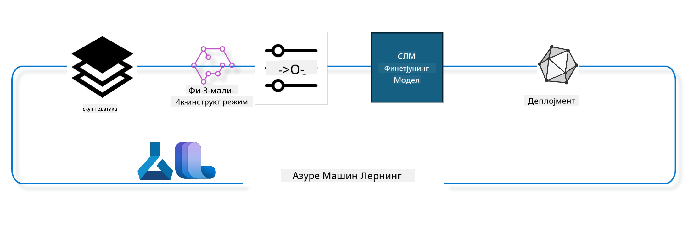

<!--
CO_OP_TRANSLATOR_METADATA:
{
  "original_hash": "944949f040e61b2ea25b3460f7394fd4",
  "translation_date": "2025-05-09T21:37:47+00:00",
  "source_file": "md/03.FineTuning/FineTuning_MLSDK.md",
  "language_code": "sr"
}
-->
## Kako koristiti chat-completion komponente iz Azure ML sistemskog registra za fino podešavanje modela

U ovom primeru ćemo izvršiti fino podešavanje modela Phi-3-mini-4k-instruct da bismo dovršili razgovor između 2 osobe koristeći ultrachat_200k dataset.



Primer će vam pokazati kako da izvršite fino podešavanje koristeći Azure ML SDK i Python, a zatim kako da postavite fino podešen model na online endpoint za real-time inferencu.

### Podaci za obuku

Koristićemo ultrachat_200k dataset. Ovo je jako filtrirana verzija UltraChat dataseta i korišćen je za treniranje Zephyr-7B-β, najsavremenijeg 7b chat modela.

### Model

Koristićemo Phi-3-mini-4k-instruct model da pokažemo kako korisnik može fino podesiti model za zadatak chat-completion. Ako ste otvorili ovaj notebook sa određene model kartice, zapamtite da zamenite ime modela.

### Zadaci

- Izabrati model za fino podešavanje.
- Izabrati i istražiti podatke za obuku.
- Konfigurisati posao fino podešavanja.
- Pokrenuti posao fino podešavanja.
- Pregledati metrike obuke i evaluacije.
- Registrovati fino podešen model.
- Postaviti fino podešen model za real-time inferencu.
- Očistiti resurse.

## 1. Priprema preduveta

- Instalirati zavisnosti
- Povezati se na AzureML Workspace. Više informacija na set up SDK authentication. Zameniti <WORKSPACE_NAME>, <RESOURCE_GROUP> i <SUBSCRIPTION_ID> ispod.
- Povezati se na azureml sistemski registar
- Postaviti opcioni naziv eksperimenta
- Proveriti ili kreirati compute.

> [!NOTE]
> Zahtevi su da jedan GPU čvor može imati više GPU kartica. Na primer, jedan čvor Standard_NC24rs_v3 ima 4 NVIDIA V100 GPU-a, dok Standard_NC12s_v3 ima 2 NVIDIA V100 GPU-a. Pogledajte dokumentaciju za ove informacije. Broj GPU kartica po čvoru podešava se u parametru gpus_per_node ispod. Ispravno podešavanje ove vrednosti osiguraće korišćenje svih GPU-a u čvoru. Preporučeni GPU compute SKU-ovi mogu se naći ovde i ovde.

### Python biblioteke

Instalirajte zavisnosti pokretanjem sledeće ćelije. Ovo nije opciono ako radite u novom okruženju.

```bash
pip install azure-ai-ml
pip install azure-identity
pip install datasets==2.9.0
pip install mlflow
pip install azureml-mlflow
```

### Interakcija sa Azure ML

1. Ovaj Python skript služi za interakciju sa Azure Machine Learning (Azure ML) servisom. Evo šta radi:

    - Uvozi potrebne module iz azure.ai.ml, azure.identity i azure.ai.ml.entities paketa. Takođe uvozi time modul.

    - Pokušava da se autentifikuje koristeći DefaultAzureCredential(), koji omogućava pojednostavljenu autentifikaciju za brzo pokretanje aplikacija u Azure oblaku. Ako to ne uspe, prelazi na InteractiveBrowserCredential(), koji omogućava interaktivni login.

    - Zatim pokušava da kreira MLClient instancu koristeći from_config metodu, koja čita konfiguraciju iz podrazumevanog config fajla (config.json). Ako to ne uspe, kreira MLClient instancu ručno navodeći subscription_id, resource_group_name i workspace_name.

    - Kreira još jednu MLClient instancu, ovaj put za Azure ML registar pod imenom "azureml". Ovaj registar je mesto gde se čuvaju modeli, pipeline-ovi za fino podešavanje i okruženja.

    - Postavlja ime eksperimenta na "chat_completion_Phi-3-mini-4k-instruct".

    - Generiše jedinstveni timestamp konvertujući trenutno vreme (u sekundama od epohe, kao decimalni broj) u ceo broj, a zatim u string. Ovaj timestamp može da se koristi za kreiranje jedinstvenih imena i verzija.

    ```python
    # Import necessary modules from Azure ML and Azure Identity
    from azure.ai.ml import MLClient
    from azure.identity import (
        DefaultAzureCredential,
        InteractiveBrowserCredential,
    )
    from azure.ai.ml.entities import AmlCompute
    import time  # Import time module
    
    # Try to authenticate using DefaultAzureCredential
    try:
        credential = DefaultAzureCredential()
        credential.get_token("https://management.azure.com/.default")
    except Exception as ex:  # If DefaultAzureCredential fails, use InteractiveBrowserCredential
        credential = InteractiveBrowserCredential()
    
    # Try to create an MLClient instance using the default config file
    try:
        workspace_ml_client = MLClient.from_config(credential=credential)
    except:  # If that fails, create an MLClient instance by manually providing the details
        workspace_ml_client = MLClient(
            credential,
            subscription_id="<SUBSCRIPTION_ID>",
            resource_group_name="<RESOURCE_GROUP>",
            workspace_name="<WORKSPACE_NAME>",
        )
    
    # Create another MLClient instance for the Azure ML registry named "azureml"
    # This registry is where models, fine-tuning pipelines, and environments are stored
    registry_ml_client = MLClient(credential, registry_name="azureml")
    
    # Set the experiment name
    experiment_name = "chat_completion_Phi-3-mini-4k-instruct"
    
    # Generate a unique timestamp that can be used for names and versions that need to be unique
    timestamp = str(int(time.time()))
    ```

## 2. Izaberite osnovni model za fino podešavanje

1. Phi-3-mini-4k-instruct je model sa 3.8 milijardi parametara, lagan i najsavremeniji otvoreni model zasnovan na dataset-ima korišćenim za Phi-2. Model pripada Phi-3 porodici modela, a Mini verzija dolazi u dve varijante 4K i 128K, što je dužina konteksta (u tokenima) koju može da podrži. Potrebno je fino podesiti model za našu specifičnu namenu da bismo ga koristili. Možete pregledati ove modele u Model Catalog u AzureML Studio, filtrirajući po zadatku chat-completion. U ovom primeru koristimo Phi-3-mini-4k-instruct model. Ako ste otvorili ovaj notebook za drugi model, zamenite ime i verziju modela u skladu sa tim.

    > [!NOTE]
    > id modela je svojstvo modela. Ovo će biti prosleđeno kao ulaz za posao fino podešavanja. Takođe je dostupno kao Asset ID polje na stranici detalja modela u AzureML Studio Model Catalog.

2. Ovaj Python skript komunicira sa Azure Machine Learning (Azure ML) servisom. Evo šta radi:

    - Postavlja model_name na "Phi-3-mini-4k-instruct".

    - Koristi get metodu models svojstva objekta registry_ml_client da preuzme najnoviju verziju modela sa navedenim imenom iz Azure ML registra. Metoda get se poziva sa dva argumenta: imenom modela i oznakom koja specificira da treba preuzeti najnoviju verziju modela.

    - Ispisuje poruku u konzolu koja pokazuje ime, verziju i id modela koji će biti korišćen za fino podešavanje. Metoda format stringa koristi se da ubaci ime, verziju i id modela u poruku. Ime, verzija i id modela se pristupaju kao svojstva objekta foundation_model.

    ```python
    # Set the model name
    model_name = "Phi-3-mini-4k-instruct"
    
    # Get the latest version of the model from the Azure ML registry
    foundation_model = registry_ml_client.models.get(model_name, label="latest")
    
    # Print the model name, version, and id
    # This information is useful for tracking and debugging
    print(
        "\n\nUsing model name: {0}, version: {1}, id: {2} for fine tuning".format(
            foundation_model.name, foundation_model.version, foundation_model.id
        )
    )
    ```

## 3. Kreirajte compute koji će se koristiti za posao

Fino podešavanje radi SAMO sa GPU compute-om. Veličina compute-a zavisi od veličine modela i u većini slučajeva je izazovno identifikovati pravi compute za posao. U ovoj ćeliji pomažemo korisniku da izabere odgovarajući compute za posao.

> [!NOTE]
> Compute-ovi navedeni ispod rade sa najoptimizovanijom konfiguracijom. Bilo kakve izmene u konfiguraciji mogu dovesti do Cuda Out Of Memory greške. U takvim slučajevima pokušajte da nadogradite compute na veću veličinu.

> [!NOTE]
> Prilikom izbora compute_cluster_size ispod, proverite da li je compute dostupan u vašoj resource grupi. Ako neki compute nije dostupan, možete podneti zahtev za pristup resursima.

### Provera podrške modela za fino podešavanje

1. Ovaj Python skript komunicira sa Azure Machine Learning (Azure ML) modelom. Evo šta radi:

    - Uvozi ast modul, koji pruža funkcije za obradu stabala Python apstraktne sintakse.

    - Proverava da li objekat foundation_model (koji predstavlja model u Azure ML) ima tag nazvan finetune_compute_allow_list. Tagovi u Azure ML su parovi ključ-vrednost koje možete koristiti za filtriranje i sortiranje modela.

    - Ako tag finetune_compute_allow_list postoji, koristi ast.literal_eval funkciju da bezbedno parsira vrednost taga (string) u Python listu. Ta lista se zatim dodeljuje promenljivoj computes_allow_list. Ispisuje poruku da treba kreirati compute sa te liste.

    - Ako tag ne postoji, postavlja computes_allow_list na None i ispisuje poruku da tag nije deo tagova modela.

    - Ukratko, skript proverava specifičan tag u metapodacima modela, konvertuje vrednost taga u listu ako postoji i daje povratnu informaciju korisniku.

    ```python
    # Import the ast module, which provides functions to process trees of the Python abstract syntax grammar
    import ast
    
    # Check if the 'finetune_compute_allow_list' tag is present in the model's tags
    if "finetune_compute_allow_list" in foundation_model.tags:
        # If the tag is present, use ast.literal_eval to safely parse the tag's value (a string) into a Python list
        computes_allow_list = ast.literal_eval(
            foundation_model.tags["finetune_compute_allow_list"]
        )  # convert string to python list
        # Print a message indicating that a compute should be created from the list
        print(f"Please create a compute from the above list - {computes_allow_list}")
    else:
        # If the tag is not present, set computes_allow_list to None
        computes_allow_list = None
        # Print a message indicating that the 'finetune_compute_allow_list' tag is not part of the model's tags
        print("`finetune_compute_allow_list` is not part of model tags")
    ```

### Provera Compute Instance

1. Ovaj Python skript komunicira sa Azure Machine Learning (Azure ML) servisom i vrši nekoliko provera na compute instanci. Evo šta radi:

    - Pokušava da preuzme compute instancu sa imenom iz promenljive compute_cluster iz Azure ML workspace-a. Ako je stanje provisioning-a compute instance "failed", baca ValueError.

    - Proverava da li je computes_allow_list različit od None. Ako jeste, konvertuje sve veličine compute-a u listi u mala slova i proverava da li je veličina trenutne compute instance u toj listi. Ako nije, baca ValueError.

    - Ako je computes_allow_list None, proverava da li je veličina compute instance u listi nepodržanih GPU VM veličina. Ako jeste, baca ValueError.

    - Preuzima listu svih dostupnih veličina compute-a u workspace-u. Iterira kroz tu listu i za svaku veličinu proverava da li se ime poklapa sa veličinom trenutne compute instance. Ako se poklapa, preuzima broj GPU-a za tu veličinu i postavlja gpu_count_found na True.

    - Ako je gpu_count_found True, ispisuje broj GPU-a u compute instanci. Ako nije, baca ValueError.

    - Ukratko, skript vrši nekoliko provera na compute instanci u Azure ML workspace-u, uključujući stanje provisioning-a, veličinu u odnosu na dozvoljenu listu ili listu zabrana, i broj GPU-a.

    ```python
    # Print the exception message
    print(e)
    # Raise a ValueError if the compute size is not available in the workspace
    raise ValueError(
        f"WARNING! Compute size {compute_cluster_size} not available in workspace"
    )
    
    # Retrieve the compute instance from the Azure ML workspace
    compute = workspace_ml_client.compute.get(compute_cluster)
    # Check if the provisioning state of the compute instance is "failed"
    if compute.provisioning_state.lower() == "failed":
        # Raise a ValueError if the provisioning state is "failed"
        raise ValueError(
            f"Provisioning failed, Compute '{compute_cluster}' is in failed state. "
            f"please try creating a different compute"
        )
    
    # Check if computes_allow_list is not None
    if computes_allow_list is not None:
        # Convert all compute sizes in computes_allow_list to lowercase
        computes_allow_list_lower_case = [x.lower() for x in computes_allow_list]
        # Check if the size of the compute instance is in computes_allow_list_lower_case
        if compute.size.lower() not in computes_allow_list_lower_case:
            # Raise a ValueError if the size of the compute instance is not in computes_allow_list_lower_case
            raise ValueError(
                f"VM size {compute.size} is not in the allow-listed computes for finetuning"
            )
    else:
        # Define a list of unsupported GPU VM sizes
        unsupported_gpu_vm_list = [
            "standard_nc6",
            "standard_nc12",
            "standard_nc24",
            "standard_nc24r",
        ]
        # Check if the size of the compute instance is in unsupported_gpu_vm_list
        if compute.size.lower() in unsupported_gpu_vm_list:
            # Raise a ValueError if the size of the compute instance is in unsupported_gpu_vm_list
            raise ValueError(
                f"VM size {compute.size} is currently not supported for finetuning"
            )
    
    # Initialize a flag to check if the number of GPUs in the compute instance has been found
    gpu_count_found = False
    # Retrieve a list of all available compute sizes in the workspace
    workspace_compute_sku_list = workspace_ml_client.compute.list_sizes()
    available_sku_sizes = []
    # Iterate over the list of available compute sizes
    for compute_sku in workspace_compute_sku_list:
        available_sku_sizes.append(compute_sku.name)
        # Check if the name of the compute size matches the size of the compute instance
        if compute_sku.name.lower() == compute.size.lower():
            # If it does, retrieve the number of GPUs for that compute size and set gpu_count_found to True
            gpus_per_node = compute_sku.gpus
            gpu_count_found = True
    # If gpu_count_found is True, print the number of GPUs in the compute instance
    if gpu_count_found:
        print(f"Number of GPU's in compute {compute.size}: {gpus_per_node}")
    else:
        # If gpu_count_found is False, raise a ValueError
        raise ValueError(
            f"Number of GPU's in compute {compute.size} not found. Available skus are: {available_sku_sizes}."
            f"This should not happen. Please check the selected compute cluster: {compute_cluster} and try again."
        )
    ```

## 4. Izaberite dataset za fino podešavanje modela

1. Koristimo ultrachat_200k dataset. Dataset ima četiri podele, pogodne za Supervised fine-tuning (sft).
Generation ranking (gen). Broj primera po podeli je prikazan ovako:

    ```bash
    train_sft test_sft  train_gen  test_gen
    207865  23110  256032  28304
    ```

1. Sledeće ćelije prikazuju osnovnu pripremu podataka za fino podešavanje:

### Vizualizacija nekoliko redova podataka

Želimo da ovaj uzorak brzo radi, pa sačuvajte train_sft i test_sft fajlove koji sadrže 5% već obrezanih redova. To znači da će fino podešeni model imati nižu tačnost, te ga ne treba koristiti u stvarnom svetu.
download-dataset.py se koristi za preuzimanje ultrachat_200k dataseta i transformaciju dataseta u format koji pipeline komponenta za fino podešavanje može da koristi. Takođe, pošto je dataset velik, ovde imamo samo deo dataseta.

1. Pokretanje sledećeg skripta preuzima samo 5% podataka. Ovo se može povećati promenom parametra dataset_split_pc na željeni procenat.

    > [!NOTE]
    > Neki jezički modeli imaju različite kodove jezika i zato nazivi kolona u datasetu treba da budu u skladu sa tim.

1. Evo primera kako podaci treba da izgledaju.
Chat-completion dataset je sačuvan u parquet formatu, a svaki zapis koristi sledeću šemu:

    - Ovo je JSON (JavaScript Object Notation) dokument, koji je popularan format za razmenu podataka. Nije izvršni kod, već način za čuvanje i prenos podataka. Evo strukture:

    - "prompt": Ovaj ključ sadrži string vrednost koja predstavlja zadatak ili pitanje postavljeno AI asistentu.

    - "messages": Ovaj ključ sadrži niz objekata. Svaki objekat predstavlja poruku u razgovoru između korisnika i AI asistenta. Svaka poruka ima dva ključa:

    - "content": String koji predstavlja sadržaj poruke.
    - "role": String koji označava ulogu entiteta koji je poslao poruku. Može biti "user" ili "assistant".
    - "prompt_id": String koji predstavlja jedinstveni identifikator za prompt.

1. U ovom JSON dokumentu, razgovor je prikazan gde korisnik traži od AI asistenta da kreira protagonistu za distopijsku priču. Asistent odgovara, a korisnik traži dodatne detalje. Asistent pristaje da pruži dodatne informacije. Cela konverzacija je povezana sa specifičnim prompt_id.

    ```python
    {
        // The task or question posed to an AI assistant
        "prompt": "Create a fully-developed protagonist who is challenged to survive within a dystopian society under the rule of a tyrant. ...",
        
        // An array of objects, each representing a message in a conversation between a user and an AI assistant
        "messages":[
            {
                // The content of the user's message
                "content": "Create a fully-developed protagonist who is challenged to survive within a dystopian society under the rule of a tyrant. ...",
                // The role of the entity that sent the message
                "role": "user"
            },
            {
                // The content of the assistant's message
                "content": "Name: Ava\n\n Ava was just 16 years old when the world as she knew it came crashing down. The government had collapsed, leaving behind a chaotic and lawless society. ...",
                // The role of the entity that sent the message
                "role": "assistant"
            },
            {
                // The content of the user's message
                "content": "Wow, Ava's story is so intense and inspiring! Can you provide me with more details.  ...",
                // The role of the entity that sent the message
                "role": "user"
            }, 
            {
                // The content of the assistant's message
                "content": "Certainly! ....",
                // The role of the entity that sent the message
                "role": "assistant"
            }
        ],
        
        // A unique identifier for the prompt
        "prompt_id": "d938b65dfe31f05f80eb8572964c6673eddbd68eff3db6bd234d7f1e3b86c2af"
    }
    ```

### Preuzimanje podataka

1. Ovaj Python skript koristi pomoćni skript download-dataset.py za preuzimanje dataseta. Evo šta radi:

    - Uvozi os modul, koji omogućava prenosivu upotrebu funkcija operativnog sistema.

    - Koristi os.system funkciju da pokrene download-dataset.py skript u shell-u sa određenim komandnim argumentima. Argumenti specificiraju koji dataset se preuzima (HuggingFaceH4/ultrachat_200k), direktorijum za preuzimanje (ultrachat_200k_dataset) i procenat podeljenog dataseta (5). os.system vraća status izlaza komande koji se čuva u exit_status promenljivoj.

    - Proverava da li exit_status nije 0. U Unix-like sistemima, status izlaza 0 znači uspeh, dok bilo koji drugi broj označava grešku. Ako nije 0, baca Exception sa porukom o grešci pri preuzimanju dataseta.

    - Ukratko, skript pokreće komandu za preuzimanje dataseta koristeći pomoćni skript i baca grešku ako komanda ne uspe.

    ```python
    # Import the os module, which provides a way of using operating system dependent functionality
    import os
    
    # Use the os.system function to run the download-dataset.py script in the shell with specific command-line arguments
    # The arguments specify the dataset to download (HuggingFaceH4/ultrachat_200k), the directory to download it to (ultrachat_200k_dataset), and the percentage of the dataset to split (5)
    # The os.system function returns the exit status of the command it executed; this status is stored in the exit_status variable
    exit_status = os.system(
        "python ./download-dataset.py --dataset HuggingFaceH4/ultrachat_200k --download_dir ultrachat_200k_dataset --dataset_split_pc 5"
    )
    
    # Check if exit_status is not 0
    # In Unix-like operating systems, an exit status of 0 usually indicates that a command has succeeded, while any other number indicates an error
    # If exit_status is not 0, raise an Exception with a message indicating that there was an error downloading the dataset
    if exit_status != 0:
        raise Exception("Error downloading dataset")
    ```

### Učitavanje podataka u DataFrame

1. Ovaj Python skript učitava JSON Lines fajl u pandas DataFrame i prikazuje prvih 5 redova. Evo šta radi:

    - Uvozi pandas biblioteku, moćan alat za manipulaciju i analizu podataka.

    - Postavlja maksimalnu širinu kolone za prikaz u pandas-u na 0. To znači da će ceo tekst kolone biti prikazan bez skraćivanja kada se DataFrame ispiše.

    - Koristi pd.read_json funkciju da učita train_sft.jsonl fajl iz ultrachat_200k_dataset direktorijuma u DataFrame. Argument lines=True označava da je fajl u JSON Lines formatu, gde je svaki red poseban JSON objekat.

    - Koristi head metodu da prikaže prvih 5 redova DataFrame-a. Ako DataFrame ima manje od 5 redova, prikazaće sve.

    - Ukratko, skript učitava JSON Lines fajl u DataFrame i prikazuje prvih 5 redova sa punim tekstom kolona.

    ```python
    # Import the pandas library, which is a powerful data manipulation and analysis library
    import pandas as pd
    
    # Set the maximum column width for pandas' display options to 0
    # This means that the full text of each column will be displayed without truncation when the DataFrame is printed
    pd.set_option("display.max_colwidth", 0)
    
    # Use the pd.read_json function to load the train_sft.jsonl file from the ultrachat_200k_dataset directory into a DataFrame
    # The lines=True argument indicates that the file is in JSON Lines format, where each line is a separate JSON object
    df = pd.read_json("./ultrachat_200k_dataset/train_sft.jsonl", lines=True)
    
    # Use the head method to display the first 5 rows of the DataFrame
    # If the DataFrame has less than 5 rows, it will display all of them
    df.head()
    ```

## 5. Pokrenite posao fino podešavanja koristeći model i podatke kao ulaze

Kreirajte posao koji koristi chat-completion pipeline komponentu. Više o svim podržanim parametrima za fino podešavanje.

### Definisanje parametara fino podešavanja

1. Parametri fino podešavanja mogu se grupisati u 2 kategorije - parametri obuke i parametri optimizacije.

1. Parametri obuke definišu aspekte obuke kao što su:

    - Optimizer, scheduler koji se koristi
    - Metrička vrednost koja se optimizuje tokom fino podešavanja
    - Broj koraka obuke i veličina batch-a i slično
    - Parametri optimizacije pomažu u optimizaciji GPU memorije i efikasnom korišćenju računarskih resursa.

1. Ispod su neki od parametara koji spadaju u ovu kategoriju. Parametri optimizacije se razlikuju za svaki model i dolaze upakovani sa modelom da bi se te varijacije obradile.

    - Omogućavanje deepspeed i LoRA
    - Omogućavanje treninga sa mešovitom preciznošću
    - Omogućavanje multi-node treninga

> [!NOTE]
> Supervised finetuning može dovesti do gubitka poravnanja ili katastrofalnog zaborava. Preporučujemo proveru ovog problema i pokretanje faze poravnanja nakon fino podešavanja.

### Parametri fino podešavanja

1. Ovaj Python skript postavlja parametre za fino podešavanje mašinskog učenja. Evo šta radi:

    - Postavlja podrazumevane parametre obuke kao što su broj epoha obuke, veličine batch-a za obuku i evaluaciju, stopu učenja i tip scheduler-a za stopu učenja.

    - Postavlja podrazumevane parametre optimizacije kao što su da li se primenjuje Layer-wise Relevance Propagation (LoRa) i DeepSpeed, i fazu DeepSpeed-a.

    - Kombinuje parametre obuke i optimizacije u jedan rečnik pod nazivom finetune_parameters.

    - Proverava da li foundation_model ima neke podrazumevane parametre specifične za model. Ako ima, ispisuje upozorenje i ažurira finetune_parameters sa tim specifičnim podrazumevanim vrednostima. ast.literal_eval se koristi da konvertuje string u Python rečnik.

    - Ispisuje konačni skup parametara za fino podešavanje koji će se koristiti za pokretanje.

    - Ukratko, skript postavlja i prikazuje parametre za fino podešavanje mašinskog učenja, sa mogućnošću preklapanja podrazumevanih vrednosti model-specifičnim vrednostima.

    ```python
    # Set up default training parameters such as the number of training epochs, batch sizes for training and evaluation, learning rate, and learning rate scheduler type
    training_parameters = dict(
        num_train_epochs=3,
        per_device_train_batch_size=1,
        per_device_eval_batch_size=1,
        learning_rate=5e-6,
        lr_scheduler_type="cosine",
    )
    
    # Set up default optimization parameters such as whether to apply Layer-wise Relevance Propagation (LoRa) and DeepSpeed, and the DeepSpeed stage
    optimization_parameters = dict(
        apply_lora="true",
        apply_deepspeed="true",
        deepspeed_stage=2,
    )
    
    # Combine the training and optimization parameters into a single dictionary called finetune_parameters
    finetune_parameters = {**training_parameters, **optimization_parameters}
    
    # Check if the foundation_model has any model-specific default parameters
    # If it does, print a warning message and update the finetune_parameters dictionary with these model-specific defaults
    # The ast.literal_eval function is used to convert the model-specific defaults from a string to a Python dictionary
    if "model_specific_defaults" in foundation_model.tags:
        print("Warning! Model specific defaults exist. The defaults could be overridden.")
        finetune_parameters.update(
            ast.literal_eval(  # convert string to python dict
                foundation_model.tags["model_specific_defaults"]
            )
        )
    
    # Print the final set of fine-tuning parameters that will be used for the run
    print(
        f"The following finetune parameters are going to be set for the run: {finetune_parameters}"
    )
    ```

### Pipeline obuke

1. Ovaj Python skript definiše funkciju za generisanje prikaznog imena mašinskog trening pipeline-a, a zatim poziva tu funkciju da generiše i ispiše to ime. Evo šta radi:

    1. Definiše se funkcija get_pipeline_display_name. Ova funkcija generiše prikazno ime na osnovu različitih parametara vezanih za pipeline obuke.

    2. Unutar funkcije izračunava se ukupna veličina batch-a množenjem veličine batch-a po uređaju, broja
training pipeline zasnovan na različitim parametrima, a zatim štampanje ovog prikaznog imena. ```python
    # Define a function to generate a display name for the training pipeline
    def get_pipeline_display_name():
        # Calculate the total batch size by multiplying the per-device batch size, the number of gradient accumulation steps, the number of GPUs per node, and the number of nodes used for fine-tuning
        batch_size = (
            int(finetune_parameters.get("per_device_train_batch_size", 1))
            * int(finetune_parameters.get("gradient_accumulation_steps", 1))
            * int(gpus_per_node)
            * int(finetune_parameters.get("num_nodes_finetune", 1))
        )
        # Retrieve the learning rate scheduler type
        scheduler = finetune_parameters.get("lr_scheduler_type", "linear")
        # Retrieve whether DeepSpeed is applied
        deepspeed = finetune_parameters.get("apply_deepspeed", "false")
        # Retrieve the DeepSpeed stage
        ds_stage = finetune_parameters.get("deepspeed_stage", "2")
        # If DeepSpeed is applied, include "ds" followed by the DeepSpeed stage in the display name; if not, include "nods"
        if deepspeed == "true":
            ds_string = f"ds{ds_stage}"
        else:
            ds_string = "nods"
        # Retrieve whether Layer-wise Relevance Propagation (LoRa) is applied
        lora = finetune_parameters.get("apply_lora", "false")
        # If LoRa is applied, include "lora" in the display name; if not, include "nolora"
        if lora == "true":
            lora_string = "lora"
        else:
            lora_string = "nolora"
        # Retrieve the limit on the number of model checkpoints to keep
        save_limit = finetune_parameters.get("save_total_limit", -1)
        # Retrieve the maximum sequence length
        seq_len = finetune_parameters.get("max_seq_length", -1)
        # Construct the display name by concatenating all these parameters, separated by hyphens
        return (
            model_name
            + "-"
            + "ultrachat"
            + "-"
            + f"bs{batch_size}"
            + "-"
            + f"{scheduler}"
            + "-"
            + ds_string
            + "-"
            + lora_string
            + f"-save_limit{save_limit}"
            + f"-seqlen{seq_len}"
        )
    
    # Call the function to generate the display name
    pipeline_display_name = get_pipeline_display_name()
    # Print the display name
    print(f"Display name used for the run: {pipeline_display_name}")
    ```

### Konfigurisanje pipeline-a

Ovaj Python skript definiše i konfiguriše mašinski learning pipeline koristeći Azure Machine Learning SDK. Evo pregleda šta radi:

1. Uvozi potrebne module iz Azure AI ML SDK-a.
2. Preuzima pipeline komponentu nazvanu "chat_completion_pipeline" iz registra.
3. Definiše pipeline job koristeći `@pipeline` decorator and the function `create_pipeline`. The name of the pipeline is set to `pipeline_display_name`.

1. Inside the `create_pipeline` function, it initializes the fetched pipeline component with various parameters, including the model path, compute clusters for different stages, dataset splits for training and testing, the number of GPUs to use for fine-tuning, and other fine-tuning parameters.

1. It maps the output of the fine-tuning job to the output of the pipeline job. This is done so that the fine-tuned model can be easily registered, which is required to deploy the model to an online or batch endpoint.

1. It creates an instance of the pipeline by calling the `create_pipeline` function.

1. It sets the `force_rerun` setting of the pipeline to `True`, meaning that cached results from previous jobs will not be used.

1. It sets the `continue_on_step_failure` setting of the pipeline to `False`, što znači da će pipeline stati ako bilo koji korak zakaže.
4. Ukratko, ovaj skript definiše i konfiguriše mašinski learning pipeline za zadatak dovršavanja četa koristeći Azure Machine Learning SDK.

```python
    # Import necessary modules from the Azure AI ML SDK
    from azure.ai.ml.dsl import pipeline
    from azure.ai.ml import Input
    
    # Fetch the pipeline component named "chat_completion_pipeline" from the registry
    pipeline_component_func = registry_ml_client.components.get(
        name="chat_completion_pipeline", label="latest"
    )
    
    # Define the pipeline job using the @pipeline decorator and the function create_pipeline
    # The name of the pipeline is set to pipeline_display_name
    @pipeline(name=pipeline_display_name)
    def create_pipeline():
        # Initialize the fetched pipeline component with various parameters
        # These include the model path, compute clusters for different stages, dataset splits for training and testing, the number of GPUs to use for fine-tuning, and other fine-tuning parameters
        chat_completion_pipeline = pipeline_component_func(
            mlflow_model_path=foundation_model.id,
            compute_model_import=compute_cluster,
            compute_preprocess=compute_cluster,
            compute_finetune=compute_cluster,
            compute_model_evaluation=compute_cluster,
            # Map the dataset splits to parameters
            train_file_path=Input(
                type="uri_file", path="./ultrachat_200k_dataset/train_sft.jsonl"
            ),
            test_file_path=Input(
                type="uri_file", path="./ultrachat_200k_dataset/test_sft.jsonl"
            ),
            # Training settings
            number_of_gpu_to_use_finetuning=gpus_per_node,  # Set to the number of GPUs available in the compute
            **finetune_parameters
        )
        return {
            # Map the output of the fine tuning job to the output of pipeline job
            # This is done so that we can easily register the fine tuned model
            # Registering the model is required to deploy the model to an online or batch endpoint
            "trained_model": chat_completion_pipeline.outputs.mlflow_model_folder
        }
    
    # Create an instance of the pipeline by calling the create_pipeline function
    pipeline_object = create_pipeline()
    
    # Don't use cached results from previous jobs
    pipeline_object.settings.force_rerun = True
    
    # Set continue on step failure to False
    # This means that the pipeline will stop if any step fails
    pipeline_object.settings.continue_on_step_failure = False
    ```

### Slanje posla

1. Ovaj Python skript šalje mašinski learning pipeline job u Azure Machine Learning workspace i zatim čeka da se posao završi. Evo pregleda šta radi:

- Poziva metodu create_or_update objekta jobs u workspace_ml_client da pošalje pipeline job. Pipeline koji treba da se pokrene je definisan sa pipeline_object, a eksperiment pod kojim se posao izvršava je definisan sa experiment_name.
- Zatim poziva metodu stream objekta jobs u workspace_ml_client da sačeka završetak pipeline job-a. Posao koji se čeka je definisan atributom name objekta pipeline_job.
- Ukratko, ovaj skript šalje mašinski learning pipeline job u Azure Machine Learning workspace i zatim čeka da se posao završi.

```python
    # Submit the pipeline job to the Azure Machine Learning workspace
    # The pipeline to be run is specified by pipeline_object
    # The experiment under which the job is run is specified by experiment_name
    pipeline_job = workspace_ml_client.jobs.create_or_update(
        pipeline_object, experiment_name=experiment_name
    )
    
    # Wait for the pipeline job to complete
    # The job to wait for is specified by the name attribute of the pipeline_job object
    workspace_ml_client.jobs.stream(pipeline_job.name)
    ```

## 6. Registracija fino podešenog modela u workspace

Registrujemo model dobijen iz izlaza fine tuning posla. Ovo će pratiti poreklo između fino podešenog modela i fine tuning posla. Fine tuning posao dodatno prati poreklo do osnovnog modela, podataka i koda za treniranje.

### Registracija ML modela

1. Ovaj Python skript registruje mašinski learning model koji je treniran u Azure Machine Learning pipeline-u. Evo pregleda šta radi:

- Uvozi potrebne module iz Azure AI ML SDK-a.
- Proverava da li je izlaz trained_model dostupan iz pipeline job-a pozivom metode get objekta jobs u workspace_ml_client i pristupanjem njegovom outputs atributu.
- Konstrukcijom puta do treniranog modela formatira string sa imenom pipeline job-a i imenom izlaza ("trained_model").
- Definiše ime za fino podešeni model dodavanjem "-ultrachat-200k" na originalno ime modela i zamenom svih kosih crta sa crtama.
- Priprema se za registraciju modela kreiranjem Model objekta sa različitim parametrima, uključujući put do modela, tip modela (MLflow model), ime i verziju modela, i opis modela.
- Registruje model pozivom metode create_or_update objekta models u workspace_ml_client sa Model objektom kao argumentom.
- Štampa registrovani model.

2. Ukratko, ovaj skript registruje mašinski learning model treniran u Azure Machine Learning pipeline-u.

```python
    # Import necessary modules from the Azure AI ML SDK
    from azure.ai.ml.entities import Model
    from azure.ai.ml.constants import AssetTypes
    
    # Check if the `trained_model` output is available from the pipeline job
    print("pipeline job outputs: ", workspace_ml_client.jobs.get(pipeline_job.name).outputs)
    
    # Construct a path to the trained model by formatting a string with the name of the pipeline job and the name of the output ("trained_model")
    model_path_from_job = "azureml://jobs/{0}/outputs/{1}".format(
        pipeline_job.name, "trained_model"
    )
    
    # Define a name for the fine-tuned model by appending "-ultrachat-200k" to the original model name and replacing any slashes with hyphens
    finetuned_model_name = model_name + "-ultrachat-200k"
    finetuned_model_name = finetuned_model_name.replace("/", "-")
    
    print("path to register model: ", model_path_from_job)
    
    # Prepare to register the model by creating a Model object with various parameters
    # These include the path to the model, the type of the model (MLflow model), the name and version of the model, and a description of the model
    prepare_to_register_model = Model(
        path=model_path_from_job,
        type=AssetTypes.MLFLOW_MODEL,
        name=finetuned_model_name,
        version=timestamp,  # Use timestamp as version to avoid version conflict
        description=model_name + " fine tuned model for ultrachat 200k chat-completion",
    )
    
    print("prepare to register model: \n", prepare_to_register_model)
    
    # Register the model by calling the create_or_update method of the models object in the workspace_ml_client with the Model object as the argument
    registered_model = workspace_ml_client.models.create_or_update(
        prepare_to_register_model
    )
    
    # Print the registered model
    print("registered model: \n", registered_model)
    ```

## 7. Deploy fino podešenog modela na online endpoint

Online endpoint-i pružaju trajni REST API koji može da se integriše sa aplikacijama kojima je potreban model.

### Upravljanje endpoint-om

1. Ovaj Python skript kreira upravljani online endpoint u Azure Machine Learning za registrovani model. Evo pregleda šta radi:

- Uvozi potrebne module iz Azure AI ML SDK-a.
- Definiše jedinstveno ime za online endpoint dodavanjem vremenske oznake na string "ultrachat-completion-".
- Priprema kreiranje online endpoint-a kreiranjem ManagedOnlineEndpoint objekta sa različitim parametrima, uključujući ime endpoint-a, opis endpoint-a i režim autentifikacije ("key").
- Kreira online endpoint pozivom metode begin_create_or_update workspace_ml_client-a sa ManagedOnlineEndpoint objektom kao argumentom. Zatim čeka da se operacija kreiranja završi pozivom metode wait.

2. Ukratko, ovaj skript kreira upravljani online endpoint u Azure Machine Learning za registrovani model.

```python
    # Import necessary modules from the Azure AI ML SDK
    from azure.ai.ml.entities import (
        ManagedOnlineEndpoint,
        ManagedOnlineDeployment,
        ProbeSettings,
        OnlineRequestSettings,
    )
    
    # Define a unique name for the online endpoint by appending a timestamp to the string "ultrachat-completion-"
    online_endpoint_name = "ultrachat-completion-" + timestamp
    
    # Prepare to create the online endpoint by creating a ManagedOnlineEndpoint object with various parameters
    # These include the name of the endpoint, a description of the endpoint, and the authentication mode ("key")
    endpoint = ManagedOnlineEndpoint(
        name=online_endpoint_name,
        description="Online endpoint for "
        + registered_model.name
        + ", fine tuned model for ultrachat-200k-chat-completion",
        auth_mode="key",
    )
    
    # Create the online endpoint by calling the begin_create_or_update method of the workspace_ml_client with the ManagedOnlineEndpoint object as the argument
    # Then wait for the creation operation to complete by calling the wait method
    workspace_ml_client.begin_create_or_update(endpoint).wait()
    ```

> [!NOTE]  
> Ovde možete pronaći listu SKU-ova podržanih za deployment - [Managed online endpoints SKU list](https://learn.microsoft.com/azure/machine-learning/reference-managed-online-endpoints-vm-sku-list)

### Deploy ML modela

1. Ovaj Python skript deploy-uje registrovani mašinski learning model na upravljani online endpoint u Azure Machine Learning. Evo pregleda šta radi:

- Uvozi ast modul, koji pruža funkcije za obradu stabala Python apstraktne sintakse.
- Postavlja tip instance za deployment na "Standard_NC6s_v3".
- Proverava da li tag inference_compute_allow_list postoji u foundation modelu. Ako postoji, konvertuje vrednost taga iz stringa u Python listu i dodeljuje je promenljivoj inference_computes_allow_list. Ako ne postoji, postavlja inference_computes_allow_list na None.
- Proverava da li je navedeni tip instance u dozvoljenoj listi. Ako nije, štampa poruku korisniku da izabere tip instance iz dozvoljene liste.
- Priprema kreiranje deployment-a kreiranjem ManagedOnlineDeployment objekta sa različitim parametrima, uključujući ime deployment-a, ime endpoint-a, ID modela, tip i broj instanci, podešavanja za liveness probe i podešavanja zahteva.
- Kreira deployment pozivom metode begin_create_or_update workspace_ml_client-a sa ManagedOnlineDeployment objektom kao argumentom. Zatim čeka da se operacija kreiranja završi pozivom metode wait.
- Postavlja saobraćaj endpoint-a tako da 100% saobraćaja ide na "demo" deployment.
- Ažurira endpoint pozivom metode begin_create_or_update workspace_ml_client-a sa endpoint objektom kao argumentom. Zatim čeka da se operacija ažuriranja završi pozivom metode result.

2. Ukratko, ovaj skript deploy-uje registrovani mašinski learning model na upravljani online endpoint u Azure Machine Learning.

```python
    # Import the ast module, which provides functions to process trees of the Python abstract syntax grammar
    import ast
    
    # Set the instance type for the deployment
    instance_type = "Standard_NC6s_v3"
    
    # Check if the `inference_compute_allow_list` tag is present in the foundation model
    if "inference_compute_allow_list" in foundation_model.tags:
        # If it is, convert the tag value from a string to a Python list and assign it to `inference_computes_allow_list`
        inference_computes_allow_list = ast.literal_eval(
            foundation_model.tags["inference_compute_allow_list"]
        )
        print(f"Please create a compute from the above list - {computes_allow_list}")
    else:
        # If it's not, set `inference_computes_allow_list` to `None`
        inference_computes_allow_list = None
        print("`inference_compute_allow_list` is not part of model tags")
    
    # Check if the specified instance type is in the allow list
    if (
        inference_computes_allow_list is not None
        and instance_type not in inference_computes_allow_list
    ):
        print(
            f"`instance_type` is not in the allow listed compute. Please select a value from {inference_computes_allow_list}"
        )
    
    # Prepare to create the deployment by creating a `ManagedOnlineDeployment` object with various parameters
    demo_deployment = ManagedOnlineDeployment(
        name="demo",
        endpoint_name=online_endpoint_name,
        model=registered_model.id,
        instance_type=instance_type,
        instance_count=1,
        liveness_probe=ProbeSettings(initial_delay=600),
        request_settings=OnlineRequestSettings(request_timeout_ms=90000),
    )
    
    # Create the deployment by calling the `begin_create_or_update` method of the `workspace_ml_client` with the `ManagedOnlineDeployment` object as the argument
    # Then wait for the creation operation to complete by calling the `wait` method
    workspace_ml_client.online_deployments.begin_create_or_update(demo_deployment).wait()
    
    # Set the traffic of the endpoint to direct 100% of the traffic to the "demo" deployment
    endpoint.traffic = {"demo": 100}
    
    # Update the endpoint by calling the `begin_create_or_update` method of the `workspace_ml_client` with the `endpoint` object as the argument
    # Then wait for the update operation to complete by calling the `result` method
    workspace_ml_client.begin_create_or_update(endpoint).result()
    ```

## 8. Testiranje endpoint-a sa primerom podataka

Preuzećemo neki uzorak podataka iz test skupa i poslati ga na online endpoint za inferencu. Zatim ćemo prikazati ocenjene oznake zajedno sa stvarnim oznakama.

### Čitanje rezultata

1. Ovaj Python skript učitava JSON Lines fajl u pandas DataFrame, uzima nasumični uzorak i resetuje indeks. Evo pregleda šta radi:

- Učitava fajl ./ultrachat_200k_dataset/test_gen.jsonl u pandas DataFrame. Funkcija read_json se koristi sa argumentom lines=True jer je fajl u JSON Lines formatu, gde je svaki red poseban JSON objekat.
- Uzima nasumični uzorak od 1 reda iz DataFrame-a. Funkcija sample se koristi sa argumentom n=1 da specificira broj nasumičnih redova.
- Resetuje indeks DataFrame-a. Funkcija reset_index se koristi sa argumentom drop=True da bi se originalni indeks odbacio i zamenio novim, podrazumevanim indeksom celobrojnih vrednosti.
- Prikazuje prva 2 reda DataFrame-a koristeći funkciju head sa argumentom 2. Međutim, pošto DataFrame sadrži samo jedan red nakon uzorkovanja, prikazaće se samo taj jedan red.

2. Ukratko, ovaj skript učitava JSON Lines fajl u pandas DataFrame, uzima nasumični uzorak od 1 reda, resetuje indeks i prikazuje prvi red.

```python
    # Import pandas library
    import pandas as pd
    
    # Read the JSON Lines file './ultrachat_200k_dataset/test_gen.jsonl' into a pandas DataFrame
    # The 'lines=True' argument indicates that the file is in JSON Lines format, where each line is a separate JSON object
    test_df = pd.read_json("./ultrachat_200k_dataset/test_gen.jsonl", lines=True)
    
    # Take a random sample of 1 row from the DataFrame
    # The 'n=1' argument specifies the number of random rows to select
    test_df = test_df.sample(n=1)
    
    # Reset the index of the DataFrame
    # The 'drop=True' argument indicates that the original index should be dropped and replaced with a new index of default integer values
    # The 'inplace=True' argument indicates that the DataFrame should be modified in place (without creating a new object)
    test_df.reset_index(drop=True, inplace=True)
    
    # Display the first 2 rows of the DataFrame
    # However, since the DataFrame only contains one row after the sampling, this will only display that one row
    test_df.head(2)
    ```

### Kreiranje JSON objekta

1. Ovaj Python skript kreira JSON objekat sa specifičnim parametrima i čuva ga u fajl. Evo pregleda šta radi:

- Uvozi json modul, koji pruža funkcije za rad sa JSON podacima.
- Kreira rečnik parameters sa ključevima i vrednostima koji predstavljaju parametre za mašinski learning model. Ključevi su "temperature", "top_p", "do_sample" i "max_new_tokens", a njihove vrednosti su 0.6, 0.9, True i 200 respektivno.
- Kreira još jedan rečnik test_json sa dva ključa: "input_data" i "params". Vrednost "input_data" je drugi rečnik sa ključevima "input_string" i "parameters". Vrednost "input_string" je lista koja sadrži prvu poruku iz test_df DataFrame-a. Vrednost "parameters" je rečnik parameters kreiran ranije. Vrednost "params" je prazan rečnik.
- Otvara fajl pod nazivom sample_score.json

```python
    # Import the json module, which provides functions to work with JSON data
    import json
    
    # Create a dictionary `parameters` with keys and values that represent parameters for a machine learning model
    # The keys are "temperature", "top_p", "do_sample", and "max_new_tokens", and their corresponding values are 0.6, 0.9, True, and 200 respectively
    parameters = {
        "temperature": 0.6,
        "top_p": 0.9,
        "do_sample": True,
        "max_new_tokens": 200,
    }
    
    # Create another dictionary `test_json` with two keys: "input_data" and "params"
    # The value of "input_data" is another dictionary with keys "input_string" and "parameters"
    # The value of "input_string" is a list containing the first message from the `test_df` DataFrame
    # The value of "parameters" is the `parameters` dictionary created earlier
    # The value of "params" is an empty dictionary
    test_json = {
        "input_data": {
            "input_string": [test_df["messages"][0]],
            "parameters": parameters,
        },
        "params": {},
    }
    
    # Open a file named `sample_score.json` in the `./ultrachat_200k_dataset` directory in write mode
    with open("./ultrachat_200k_dataset/sample_score.json", "w") as f:
        # Write the `test_json` dictionary to the file in JSON format using the `json.dump` function
        json.dump(test_json, f)
    ```

### Pozivanje endpoint-a

1. Ovaj Python skript poziva online endpoint u Azure Machine Learning da izvrši ocenjivanje JSON fajla. Evo pregleda šta radi:

- Poziva metodu invoke svojstva online_endpoints objekta workspace_ml_client. Ova metoda se koristi za slanje zahteva online endpoint-u i dobijanje odgovora.
- Navodi ime endpoint-a i deployment-a preko argumenata endpoint_name i deployment_name. U ovom slučaju, ime endpoint-a je u promenljivoj online_endpoint_name, a ime deployment-a je "demo".
- Navodi putanju do JSON fajla koji treba oceniti preko argumenta request_file. U ovom slučaju, fajl je ./ultrachat_200k_dataset/sample_score.json.
- Čuva odgovor sa endpoint-a u promenljivu response.
- Štampa sirovi odgovor.

2. Ukratko, ovaj skript poziva online endpoint u Azure Machine Learning da oceni JSON fajl i štampa odgovor.

```python
    # Invoke the online endpoint in Azure Machine Learning to score the `sample_score.json` file
    # The `invoke` method of the `online_endpoints` property of the `workspace_ml_client` object is used to send a request to an online endpoint and get a response
    # The `endpoint_name` argument specifies the name of the endpoint, which is stored in the `online_endpoint_name` variable
    # The `deployment_name` argument specifies the name of the deployment, which is "demo"
    # The `request_file` argument specifies the path to the JSON file to be scored, which is `./ultrachat_200k_dataset/sample_score.json`
    response = workspace_ml_client.online_endpoints.invoke(
        endpoint_name=online_endpoint_name,
        deployment_name="demo",
        request_file="./ultrachat_200k_dataset/sample_score.json",
    )
    
    # Print the raw response from the endpoint
    print("raw response: \n", response, "\n")
    ```

## 9. Brisanje online endpoint-a

1. Ne zaboravite da obrišete online endpoint, u suprotnom će vam račun za korišćenje računarskih resursa na endpoint-u nastaviti da se obračunava. Ovaj red Python koda briše online endpoint u Azure Machine Learning. Evo pregleda šta radi:

- Poziva metodu begin_delete svojstva online_endpoints objekta workspace_ml_client. Ova metoda pokreće brisanje online endpoint-a.
- Navodi ime endpoint-a koji treba obrisati preko argumenta name. U ovom slučaju, ime endpoint-a je u promenljivoj online_endpoint_name.
- Poziva metodu wait da sačeka da se operacija brisanja završi. Ovo je blokirajuća operacija, što znači da će sprečiti nastavak izvršavanja skripta dok se brisanje ne završi.
- Ukratko, ovaj red koda pokreće brisanje online endpoint-a u Azure Machine Learning i čeka da se operacija završi.

```python
    # Delete the online endpoint in Azure Machine Learning
    # The `begin_delete` method of the `online_endpoints` property of the `workspace_ml_client` object is used to start the deletion of an online endpoint
    # The `name` argument specifies the name of the endpoint to be deleted, which is stored in the `online_endpoint_name` variable
    # The `wait` method is called to wait for the deletion operation to complete. This is a blocking operation, meaning that it will prevent the script from continuing until the deletion is finished
    workspace_ml_client.online_endpoints.begin_delete(name=online_endpoint_name).wait()
    ```

**Ограничење одговорности**:  
Овај документ је преведен коришћењем AI преводилачке услуге [Co-op Translator](https://github.com/Azure/co-op-translator). Иако се трудимо да превод буде прецизан, имајте у виду да аутоматски преводи могу садржати грешке или нетачности. Оригинални документ на његовом изворном језику треба сматрати ауторитетом. За критичне информације препоручује се професионални људски превод. Нисмо одговорни за било каква неспоразума или погрешна тумачења настала коришћењем овог превода.