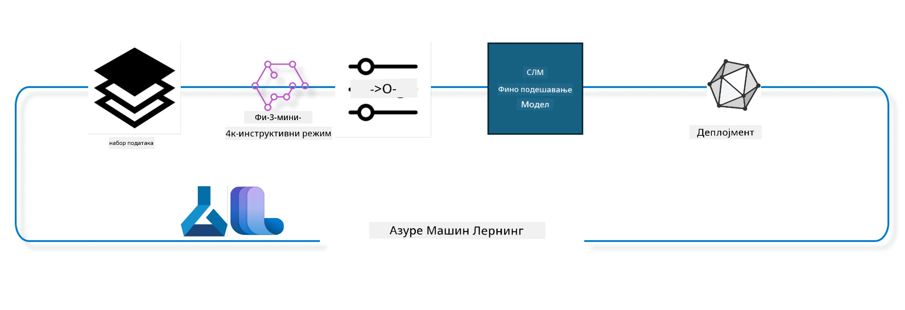

## Како користити компоненте за довршавање разговора из Azure ML системског регистра за фино подешавање модела

У овом примеру ћемо извршити фино подешавање модела Phi-3-mini-4k-instruct да доврши разговор између 2 особе користећи ultrachat_200k скуп података.



Пример ће вам показати како извршити фино подешавање коришћењем Azure ML SDK и Pythona, а затим распоредити фино подешени модел на онлајн крајњу тачку за доток у реалном времену.

### Податак за обуку

Користићемо ultrachat_200k скуп података. Ово је јако филтрирана верзија UltraChat скупа података и коришћена је за тренирање Zephyr-7B-β, врхунског 7b чат модела.

### Модел

Користићемо Phi-3-mini-4k-instruct модел да прикажемо како корисник може извршити фино подешавање модела за задатак довршавања разговора. Ако сте отворили овај нотебоок са одређене картице модела, запамтите да замените одређено име модела.

### Задаци

- Одабрати модел за фино подешавање.
- Одабрати и испитати податке за обуку.
- Конфигурисати посао фино подешавања.
- Покренути посао фино подешавања.
- Прегледати метрике обуке и процене.
- Регистровати фино подешени модел.
- Распоредити фино подешени модел за доток у реалном времену.
- Очистити ресурсе.

## 1. Подешавање предуслова

- Инсталирати зависности
- Повезати се са AzureML Workspace-ом. Сазнајте више у одељку подешавање аутентификације SDK. Замените <WORKSPACE_NAME>, <RESOURCE_GROUP> и <SUBSCRIPTION_ID> испод.
- Повезати се са azureml системским регистром
- Поставити опционални назив експеримента
- Проверити или креирати рачунар ресурса.

> [!NOTE]
> Захтеви: један GPU чвор може имати више GPU картица. На пример, у једном чвору Standard_NC24rs_v3 постоје 4 NVIDIA V100 GPU-а, док у Standard_NC12s_v3 постоје 2 NVIDIA V100 GPU-а. Погледајте документацију за ове информације. Број GPU картица по чвору подешава се параметром gpus_per_node испод. Правилно подешавање ове вредности обезбеђује коришћење свих GPU-а у чвору. Препоручени SKU-ови за GPU рачунаре могу се наћи овде и овде.

### Python библиотеке

Инсталирајте зависности покретањем следеће ћелије. Ово није опционални корак ако покрећете у новом окружењу.

```bash
pip install azure-ai-ml
pip install azure-identity
pip install datasets==2.9.0
pip install mlflow
pip install azureml-mlflow
```

### Рад са Azure ML

1. Овај Python скрипт се користи за интеракцију са Azure Machine Learning (Azure ML) сервисом. Ево шта ради:

    - Увози потребне модуле из пакета azure.ai.ml, azure.identity, и azure.ai.ml.entities. Такође увози и модул time.

    - Покушава да се аутентификује користећи DefaultAzureCredential(), који омогућава поједностављено аутентификовање за брзи почетак развоја апликација у Azure облаку. Уколико овај начин не успе, користи InteractiveBrowserCredential() који пружа интерактивни мени за пријаву.

    - Затим покушава да креира MLClient инстанцу користећи metodu from_config која чита конфигурацију из подразумеване датотеке конфигурације (config.json). Ако то не успе, креира MLClient инстанцу ручно, прослеђујући subscription_id, resource_group_name и workspace_name.

    - Креира још једну MLClient инстанцу, овога пута за Azure ML регистар који се зове "azureml". Овај регистар је место где се чувају модели, pipeline-ови за фино подешавање и окружења.

    - Поставља назив експеримента на "chat_completion_Phi-3-mini-4k-instruct".

    - Генерише јединствени timestamp тако што претвара тренутно време (у секундама од епохе, као број у покретном зарезу) у целобројни тип, а затим у стринг. Овим timestamp-ом се могу креирати јединствени називи и верзије.

    ```python
    # Увоз неопходних модула из Azure ML и Azure Identity
    from azure.ai.ml import MLClient
    from azure.identity import (
        DefaultAzureCredential,
        InteractiveBrowserCredential,
    )
    from azure.ai.ml.entities import AmlCompute
    import time  # Увоз модула за време
    
    # Покушај аутентификације користећи DefaultAzureCredential
    try:
        credential = DefaultAzureCredential()
        credential.get_token("https://management.azure.com/.default")
    except Exception as ex:  # Ако DefaultAzureCredential не успе, користи InteractiveBrowserCredential
        credential = InteractiveBrowserCredential()
    
    # Покушај креирања примерка MLClient користећи подразумевани конфигурациони фајл
    try:
        workspace_ml_client = MLClient.from_config(credential=credential)
    except:  # Ако то не успе, креирај примерак MLClient ручним уношењем података
        workspace_ml_client = MLClient(
            credential,
            subscription_id="<SUBSCRIPTION_ID>",
            resource_group_name="<RESOURCE_GROUP>",
            workspace_name="<WORKSPACE_NAME>",
        )
    
    # Креирај још један примерак MLClient за Azure ML регистри под именом "azureml"
    # Ова регистрија је место где се чувају модели, цевоводи за фино подешавање и окружења
    registry_ml_client = MLClient(credential, registry_name="azureml")
    
    # Постави име експеримента
    experiment_name = "chat_completion_Phi-3-mini-4k-instruct"
    
    # Генериши јединствени временски жиг који се може користити за имена и верзије које морају бити јединствене
    timestamp = str(int(time.time()))
    ```

## 2. Одаберите основни модел за фино подешавање

1. Phi-3-mini-4k-instruct је модел са 3.8 милијарди параметара, лаган, врхунски отворени модел базиран на скуповима података који су коришћени за Phi-2. Модел припада Phi-3 фамилији, а Mini верзија долази у две варијанте 4K и 128K што је дужина контекста (у токенима) коју може подржати. Потребно је извести фино подешавање модела за нашу специфичну намену да бисмо га користили. Моделе можете прегледати у Model Catalog у AzureML Studio, филтрирајући по задатку довршавања разговора. У овом примеру користимо Phi-3-mini-4k-instruct модел. Ако сте отворили овај нотебоок за други модел, замените име и верзију модела у складу са тим.

> [!NOTE]
> ИД модела својство је модела. Он ће бити прослеђен као улаз за посао фино подешавања. Такође је доступан као поље Asset ID на страници детаља модела у AzureML Studio Model Catalog-у.

2. Овај Python скрипт интерагује са Azure Machine Learning (Azure ML) сервисом. Ево шта ради:

    - Поставља model_name на "Phi-3-mini-4k-instruct".

    - Користи метод get својства models објекта registry_ml_client да дохвати најновију верзију модела са назначеним именом из Azure ML регистра. Метод се позива са два аргумента: назив модела и ознаку која одређује да треба вратити најновију верзију модела.

    - Исписује поруку у конзолу која указује на назив, верзију и ид модела који ће се користити за фино подешавање. Метод format стринга користи се за уметање имена, верзије и ид модела у поруку. Име, верзија и ид модела се приступају као својства објекта foundation_model.

    ```python
    # Постави име модела
    model_name = "Phi-3-mini-4k-instruct"
    
    # Преузми најновију верзију модела из Azure ML регистра
    foundation_model = registry_ml_client.models.get(model_name, label="latest")
    
    # Испиши име модела, верзију и ид
    # Ове информације су корисне за праћење и отклањање грешака
    print(
        "\n\nUsing model name: {0}, version: {1}, id: {2} for fine tuning".format(
            foundation_model.name, foundation_model.version, foundation_model.id
        )
    )
    ```

## 3. Креирајте рачунар који ће се користити за посао

Фино подешавање ради САМО са GPU рачунарима. Величина рачунара зависи од величине модела и у већини случајева је тешко одредити одговарајући рачунар за посао. У овој ћелији водимо корисника да одабере прави рачунар.

> [!NOTE]
> Рачунари наведени испод раде са најоптимизованијом конфигурацијом. Свака промена конфигурације може довести до Cuda Out Of Memory грешке. У таквим случајевима покушајте да повећате величину рачунара.

> [!NOTE]
> При одабиру compute_cluster_size испод, уверите се да је рачунар доступан у вашој групи ресурса. Ако одређени рачунар није доступан, можете послати захтев за приступ рачунарским ресурсима.

### Провера подршке модела за фино подешавање

1. Овај Python скрипт интерагује са Azure Machine Learning (Azure ML) моделом. Ево шта ради:

    - Увози модул ast, који пружа функције за обраду стабала апстрактне синтаксе Python-а.

    - Проверава да ли објекат foundation_model (који представља модел у Azure ML) садржи ознаку finetune_compute_allow_list. Ознаке у Azure ML су парови кључ-вредност које можете користити за филтрирање и сортирање модела.

    - Уколико ознака finetune_compute_allow_list постоји, користи ast.literal_eval функцију да сигурно парсира вредност ознаке (стринг) у Python листу. Ова листа се онда додељује променљивој computes_allow_list. Онда исписује поруку која указује да треба креирати рачунар са листе.

    - Ако ознака finetune_compute_allow_list није присутна, поставља computes_allow_list на None и исписује поруку да ознака није део ознака модела.

    - Укратко, скрипт проверава постојање конкретне ознаке у метаподацима модела, претвара вредност ознаке у листу ако постоји, и пружа повратне информације кориснику.

    ```python
    # Увези модул ast, који пружа функције за обраду стабала апстрактне синтаксне граматике Питона
    import ast
    
    # Проверити да ли је ознака 'finetune_compute_allow_list' присутна у ознакама модела
    if "finetune_compute_allow_list" in foundation_model.tags:
        # Ако је ознака присутна, користити ast.literal_eval да безбедно парсира вредност ознаке (низ) у Питон листу
        computes_allow_list = ast.literal_eval(
            foundation_model.tags["finetune_compute_allow_list"]
        )  # конвертовати низ у питон листу
        # Исписати поруку која указује да треба креирати вычисљавање из листе
        print(f"Please create a compute from the above list - {computes_allow_list}")
    else:
        # Ако ознака није присутна, поставити computes_allow_list на None
        computes_allow_list = None
        # Исписати поруку која указује да ознака 'finetune_compute_allow_list' није део ознака модела
        print("`finetune_compute_allow_list` is not part of model tags")
    ```

### Провера compute instance

1. Овај Python скрипт интерагује са Azure Machine Learning (Azure ML) сервисом и извршава неколико провера за compute instance. Ево шта ради:

    - Покушава да преузме compute instance са именом које се налази у compute_cluster из Azure ML радног простора. Ако је стање провизије compute instance-а "failed", подиже ValueError.

    - Проверава да ли је computes_allow_list None. Ако није, конвертује све величине рачунара у листи у мала слова и проверава да ли величина тренутног compute instance-а припада листи. Ако не припада, подиже ValueError.

    - Ако је computes_allow_list None, проверава да ли величина compute instance-а припада листи неподржаних GPU VM величина. Ако припада, подиже ValueError.

    - Дохвата листу свих доступних величина рачунара у радном простору. Прошетава кроз листу и за сваку величину проверава да ли се име поклапа са величином тренутног compute instance-а. Ако јесте, добија број GPU-ова за ту величину и поставља gpu_count_found на True.

    - Ако је gpu_count_found True, исписује број GPU-а у compute instance-у. Ако је False, подиже ValueError.

    - Укратко, овај скрипт изводи неколико провера на compute instance-у у Azure ML радном простору, укључујући проверу стања провизије, величине у односу на дозволјену или забрањену листу, и број GPU-а који поседује.
    
    ```python
    # Испиши поруку изузетка
    print(e)
    # Подигни ValueError ако величина рачунара није доступна у радном простору
    raise ValueError(
        f"WARNING! Compute size {compute_cluster_size} not available in workspace"
    )
    
    # Преузми инстанцу рачунара из Azure ML радног простора
    compute = workspace_ml_client.compute.get(compute_cluster)
    # Провери да ли је стање обезбеђења инстанце рачунара "неуспешно"
    if compute.provisioning_state.lower() == "failed":
        # Подигни ValueError ако је стање обезбеђења "неуспешно"
        raise ValueError(
            f"Provisioning failed, Compute '{compute_cluster}' is in failed state. "
            f"please try creating a different compute"
        )
    
    # Провери да ли `computes_allow_list` није None
    if computes_allow_list is not None:
        # Претвори све величине рачунара у `computes_allow_list` у мала слова
        computes_allow_list_lower_case = [x.lower() for x in computes_allow_list]
        # Провери да ли је величина инстанце рачунара у `computes_allow_list_lower_case`
        if compute.size.lower() not in computes_allow_list_lower_case:
            # Подигни ValueError ако величина инстанце рачунара није у `computes_allow_list_lower_case`
            raise ValueError(
                f"VM size {compute.size} is not in the allow-listed computes for finetuning"
            )
    else:
        # Дефиниши листу неподржаних величина GPU виртуелних машина
        unsupported_gpu_vm_list = [
            "standard_nc6",
            "standard_nc12",
            "standard_nc24",
            "standard_nc24r",
        ]
        # Провери да ли је величина инстанце рачунара у `unsupported_gpu_vm_list`
        if compute.size.lower() in unsupported_gpu_vm_list:
            # Подигни ValueError ако је величина инстанце рачунара у `unsupported_gpu_vm_list`
            raise ValueError(
                f"VM size {compute.size} is currently not supported for finetuning"
            )
    
    # Иницијализуј заставицу да провериш да ли је број GPU-а у инстанци рачунара пронађен
    gpu_count_found = False
    # Преузми листу свих расположивих величина рачунара у радном простору
    workspace_compute_sku_list = workspace_ml_client.compute.list_sizes()
    available_sku_sizes = []
    # Итерирај кроз листу расположивих величина рачунара
    for compute_sku in workspace_compute_sku_list:
        available_sku_sizes.append(compute_sku.name)
        # Провери да ли име величине рачунара одговара величини инстанце рачунара
        if compute_sku.name.lower() == compute.size.lower():
            # Ако одговара, преузми број GPU-а за ту величину рачунара и подеси `gpu_count_found` на True
            gpus_per_node = compute_sku.gpus
            gpu_count_found = True
    # Ако је `gpu_count_found` True, испиши број GPU-а у инстанци рачунара
    if gpu_count_found:
        print(f"Number of GPU's in compute {compute.size}: {gpus_per_node}")
    else:
        # Ако је `gpu_count_found` False, подигни ValueError
        raise ValueError(
            f"Number of GPU's in compute {compute.size} not found. Available skus are: {available_sku_sizes}."
            f"This should not happen. Please check the selected compute cluster: {compute_cluster} and try again."
        )
    ```

## 4. Одаберите скуп података за фино подешавање модела

1. Користимо ultrachat_200k скуп података. Скуп има четири подскупа, погодна за Супервисед фино подешавање (sft).
Рангирање генерације (gen). Број примера по подскупу је приказан како следи:

    ```bash
    train_sft test_sft  train_gen  test_gen
    207865  23110  256032  28304
    ```

1. Следеће ћелије приказују основну припрему података за фино подешавање:

### Визуализација неколико редова података

Желимо да овај пример покренемо брзо, па чувамо train_sft и test_sft фајлове са 5% већ обрезаних редова. То значи да ће фино подешени модел имати мању тачност, те стога не би требао бити коришћен у реалним условима.
download-dataset.py скрипта се користи за преузимање ultrachat_200k скупа података и претвара тај скуп у формат погодан за компоненету pipeline-а фино подешавања. Пошто је скуп података велик, овде имамо само део скупа.

1. Покретање овог скрипта преузима само 5% података. Ово се може повећати променом параметра dataset_split_pc на жељени проценат.

> [!NOTE]
> Неки језички модели имају различите језичке кодове, па имена колона у скупу података треба да то рефлектују.

1. Ево примера како подаци треба да изгледају
Скуп података за довршавање разговора је сачуван у parquet формату са сваком ставком која користи следећу шему:

    - Ово је JSON (JavaScript Object Notation) документ, који је популаран формат за размену података. Није извршни код, већ начин чувања и транспорта података. Ево структуре:

    - "prompt": Овај кључ садржи стринг вредност која представља задатак или питање постављено AI асистенту.

    - "messages": Овај кључ садржи низ објеката. Свaки објекат представља поруку у разговору између корисника и AI асистента. Свaки објекат поруке има два кључа:

    - "content": Овај кључ садржи стринг вредност која представља садржај поруке.
    - "role": Овај кључ садржи стринг вредност која представља улогу ентитета који је послао поруку. То може бити "user" или "assistant".
    - "prompt_id": Овај кључ садржи стринг вредност која представља јединствени идентификатор за prompt.

1. У овом конкретном JSON документу приказан је разговор у којем корисник тражи од AI асистента да креира протагониста за дистопијску причу. Асистент одговара, а корисник затим тражи више детаља. Асистент се слаже да пружи више детаља. Цели разговор је повезан са специфичним prompt_id-ом.

    ```python
    {
        // The task or question posed to an AI assistant
        "prompt": "Create a fully-developed protagonist who is challenged to survive within a dystopian society under the rule of a tyrant. ...",
        
        // An array of objects, each representing a message in a conversation between a user and an AI assistant
        "messages":[
            {
                // The content of the user's message
                "content": "Create a fully-developed protagonist who is challenged to survive within a dystopian society under the rule of a tyrant. ...",
                // The role of the entity that sent the message
                "role": "user"
            },
            {
                // The content of the assistant's message
                "content": "Name: Ava\n\n Ava was just 16 years old when the world as she knew it came crashing down. The government had collapsed, leaving behind a chaotic and lawless society. ...",
                // The role of the entity that sent the message
                "role": "assistant"
            },
            {
                // The content of the user's message
                "content": "Wow, Ava's story is so intense and inspiring! Can you provide me with more details.  ...",
                // The role of the entity that sent the message
                "role": "user"
            }, 
            {
                // The content of the assistant's message
                "content": "Certainly! ....",
                // The role of the entity that sent the message
                "role": "assistant"
            }
        ],
        
        // A unique identifier for the prompt
        "prompt_id": "d938b65dfe31f05f80eb8572964c6673eddbd68eff3db6bd234d7f1e3b86c2af"
    }
    ```

### Преузимање података

1. Овај Python скрипт користи помоћни скрипт download-dataset.py за преузимање скупа података. Ево шта ради:

    - Увози модул os, који пружа преносив начин коришћења функционалности оперативног система.

    - Користи os.system функцију да покрене download-dataset.py скрипт у shell-у са одређеним аргументима командне линије. Аргументи одређују скуп података који се преузима (HuggingFaceH4/ultrachat_200k), директоријум за преузимање (ultrachat_200k_dataset), и проценат података за подскуп (5). Возраста функција враћа статус изласка команде, који се чува у променљивој exit_status.

    - Проверава да ли exit_status није 0. На Unix-попут системима, статус 0 обично значи да је команда успела, док било који други број означава грешку. Ако exit_status није 0, подиже изузетак са поруком да је дошло до грешке приликом преузимања скупа података.

    - Укратко, скрипт покреће команду за преузимање скупа података помоћу помоћног скрипта и подиже изузетак ако команда не успе.
    
    ```python
    # Импортовање модула ос, који пружа начин коришћења функционалности зависне од оперативног система
    import os
    
    # Користите функцију os.system да бисте покренули скрипту download-dataset.py у шкољци са одређеним аргументима командне линије
    # Аргументи одређују скуп података који треба преузети (HuggingFaceH4/ultrachat_200k), директоријум у који ће се преузети (ultrachat_200k_dataset) и проценат скупа података за подјелу (5)
    # Функција os.system враћа статус изласка команде коју је извршила; овај статус се чува у променљивој exit_status
    exit_status = os.system(
        "python ./download-dataset.py --dataset HuggingFaceH4/ultrachat_200k --download_dir ultrachat_200k_dataset --dataset_split_pc 5"
    )
    
    # Провери ако exit_status није 0
    # У Unix-подобним оперативним системима, статус изласка 0 обично означава да је команда успешно извршена, док други број означава грешку
    # Ако exit_status није 0, избаци изузетак са поруком која указује на грешку приликом преузимања скупа података
    if exit_status != 0:
        raise Exception("Error downloading dataset")
    ```

### Учитавање података у DataFrame


1. Овај Python скрипт учитава JSON Lines фајл у pandas DataFrame и приказује првих 5 редова. Ево прегледа шта ради:

    - Импортовао је pandas библиотеку, која је моћна библиотека за манипулацију и анализу података.

    - Поставља максималну ширину колоне у pandas опцији приказа на 0. То значи да ће цео текст сваке колоне бити приказан без скраћивања када се DataFrame одштампа.

    - Користи pd.read_json функцију за учитавање train_sft.jsonl фајла из ultrachat_200k_dataset директоријума у DataFrame. Аргумент lines=True указује да је фајл у JSON Lines формату, где је сваки ред засебан JSON објекат.

    - Користи head методу да прикаже првих 5 редова DataFrame-а. Ако DataFrame има мање од 5 редова, приказаће све њих.

    - Укратко, овај скрипт учитава JSON Lines фајл у DataFrame и приказује првих 5 редова са потпуним текстом колоне.
    
    ```python
    # Увоз библиотеke pandas, која је моћна библиотека за манипулацију и анализу података
    import pandas as pd
    
    # Поставити максималну ширину колоне за опције приказа pandas на 0
    # Ово значи да ће цео текст сваке колоне бити приказан без скраћивања када се DataFrame испише
    pd.set_option("display.max_colwidth", 0)
    
    # Користити функцију pd.read_json да се учита фајл train_sft.jsonl из директоријума ultrachat_200k_dataset у DataFrame
    # Аргумент lines=True указује да је фајл у JSON Lines формату, где је сваки ред посебан JSON објекат
    df = pd.read_json("./ultrachat_200k_dataset/train_sft.jsonl", lines=True)
    
    # Користити методу head да се прикажу првих 5 редова DataFrame
    # Ако DataFrame има мање од 5 редова, приказаће их све
    df.head()
    ```

## 5. Поднесите задатак фино подешавање користећи модел и податке као улазе

Направите задатак који користи компоненту pipeline за chat-completion. Сазнајте више о свим параметрима који се подржавају за фино подешавање.

### Дефинисање параметара фино подешавања

1. Параметри фино подешавања могу се груписати у 2 категорије - параметри тренинга и параметри оптимизације

1. Параметри тренинга дефинишу аспекте тренинга као што су -

    - Оптимизатор, scheduler који ће се користити
    - Метрика коју треба оптимизовати при фином подешавању
    - Број корака тренинга и величина batch-а и тако даље
    - Параметри оптимизације помажу у оптимизацији GPU меморије и ефективном коришћењу рачунарских ресурса.

1. Испод су неки од параметара који припадају овој категорији. Параметри оптимизације се разликују за сваки модел и пакетирани су са моделом да би се ове разлике обрадиле.

    - Укључи deepspeed и LoRA
    - Укључи тренинг са мешовитом прецизношћу
    - Укључи тренинг на више чворова

> [!NOTE]
> Надгледано фино подешавање може довести до губитка усклађености или катастрофалног заборављања. Препоручујемо да проверите овај проблем и покренете фазу усаглашавања након фино подешавања.

### Параметри фино подешавања

1. Овај Python скрипт поставља параметре за фино подешавање машинског учења. Ево прегледа шта ради:

    - Поставља подразумеване параметре тренинга као број епоха тренинга, величину batch-а за тренинг и евалуацију, стопу учења и тип scheduler-а за стопу учења.

    - Поставља подразумеване параметре оптимизације као да ли ће се применити Layer-wise Relevance Propagation (LoRa) и DeepSpeed, и DeepSpeed стадијум.

    - Комбинује параметре тренинга и оптимизације у један речник под називом finetune_parameters.

    - Проверава да ли foundation_model има неке подразумеване параметре специфичне за модел. Ако их има, штампа упозорење и ажурира finetune_parameters речник тиме. Функција ast.literal_eval се користи за конверзију тих подразумеваних параметара из string-а у Python речник.

    - Штампа коначни скуп параметара за фино подешавање који ће се користити за извођење.

    - Укратко, овај скрипт поставља и приказује параметре за фино подешавање машинског учења, са могућношћу префињавања подразумеваних параметара модел-специфичним.

    ```python
    # Подесите подразумеване параметре тренинга као што су број епоха тренинга, величине пакета за тренинг и евалуацију, стопа учења и тип распоредника стопе учења
    training_parameters = dict(
        num_train_epochs=3,
        per_device_train_batch_size=1,
        per_device_eval_batch_size=1,
        learning_rate=5e-6,
        lr_scheduler_type="cosine",
    )
    
    # Подесите подразумеване параметре оптимизације као што су да ли се користи Layer-wise Relevance Propagation (LoRa) и DeepSpeed, и DeepSpeed стадијум
    optimization_parameters = dict(
        apply_lora="true",
        apply_deepspeed="true",
        deepspeed_stage=2,
    )
    
    # Комбиновање параметара тренинга и оптимизације у један речник под називом finetune_parameters
    finetune_parameters = {**training_parameters, **optimization_parameters}
    
    # Проверите да ли foundation_model има неке подразумеване параметре специфичне за модел
    # Ако има, испишите упозорење и ажурирајте речник finetune_parameters тим моделски специфичним подразумеваним вредностима
    # Функција ast.literal_eval се користи да конвертује моделски специфичне подразумеване вредности из низа у Python речник
    if "model_specific_defaults" in foundation_model.tags:
        print("Warning! Model specific defaults exist. The defaults could be overridden.")
        finetune_parameters.update(
            ast.literal_eval(  # конвертујте низ у Python речник
                foundation_model.tags["model_specific_defaults"]
            )
        )
    
    # Испишите коначни скуп параметара фино подешавања који ће бити коришћени за извођење
    print(
        f"The following finetune parameters are going to be set for the run: {finetune_parameters}"
    )
    ```

### Тренинг Pipeline

1. Овај Python скрипт дефинише функцију за генерисање приказног имена машинског тренинг pipeline-а, а затим позива ову функцију да генерише и одштампа име. Ево прегледа шта ради:

1. Дефинисана је функција get_pipeline_display_name. Ова функција генерише приказно име на основу различитих параметара везаних за тренинг pipeline.

1. Унутар функције, израчунава укупну величину batch-а множењем величине batch-а по уређају, броја корака акмулације градијената, броја GPU-а по чвору и броја чворова који се користе за фино подешавање.

1. Добија различите друге параметре као што су тип scheduler-а за стопу учења, да ли се примењује DeepSpeed, DeepSpeed стадијум, да ли се примењује Layer-wise Relevance Propagation (LoRa), ограничење броја чуваних checkpoint-а модела и максимална дужина секвенце.

1. Конструише стринг који укључује све ове параметре, раздвојене цртицама. Ако се DeepSpeed или LoRa примењују, стринг укључује „ds“ праћено DeepSpeed стадијумом, или „lora“, редом. Ако не, укључује „nods“ или „nolora“, редом.

1. Функција враћа овај стринг који служи као приказно име за тренинг pipeline.

1. Након дефинисања функције, она се позива за генерисање приказног имена које се затим штампа.

1. Укратко, овај скрипт генерише приказно име за тренинг pipeline машинског учења на основу разних параметара, и затим штампа то име.

    ```python
    # Дефинишите функцију за генерисање приказног имена за тренинг пипелајн
    def get_pipeline_display_name():
        # Израчунајте укупну величину скупа множењем величине скупа по уређају, броја корака акумулације градијента, броја GPU-ова по чвору и броја чворова који се користе за фајнтјунинг
        batch_size = (
            int(finetune_parameters.get("per_device_train_batch_size", 1))
            * int(finetune_parameters.get("gradient_accumulation_steps", 1))
            * int(gpus_per_node)
            * int(finetune_parameters.get("num_nodes_finetune", 1))
        )
        # Преузмите тип распореда учења
        scheduler = finetune_parameters.get("lr_scheduler_type", "linear")
        # Преузмите информацију да ли је DeepSpeed примењен
        deepspeed = finetune_parameters.get("apply_deepspeed", "false")
        # Преузмите DeepSpeed стадијум
        ds_stage = finetune_parameters.get("deepspeed_stage", "2")
        # Ако је DeepSpeed примењен, укључите "ds" праћен DeepSpeed стадијумом у приказно име; ако није, укључите "nods"
        if deepspeed == "true":
            ds_string = f"ds{ds_stage}"
        else:
            ds_string = "nods"
        # Преузмите да ли је примењена парцела релевантности по слојевима (LoRa)
        lora = finetune_parameters.get("apply_lora", "false")
        # Ако је LoRa примењен, укључите "lora" у приказно име; ако није, укључите "nolora"
        if lora == "true":
            lora_string = "lora"
        else:
            lora_string = "nolora"
        # Преузмите лимит за број моделских чепова које треба задржати
        save_limit = finetune_parameters.get("save_total_limit", -1)
        # Преузмите максималну дужину секвенце
        seq_len = finetune_parameters.get("max_seq_length", -1)
        # Конструишите приказно име конкатенацијом свих ових параметара, раздвојених цртицама
        return (
            model_name
            + "-"
            + "ultrachat"
            + "-"
            + f"bs{batch_size}"
            + "-"
            + f"{scheduler}"
            + "-"
            + ds_string
            + "-"
            + lora_string
            + f"-save_limit{save_limit}"
            + f"-seqlen{seq_len}"
        )
    
    # Позовите функцију за генерисање приказног имена
    pipeline_display_name = get_pipeline_display_name()
    # Испишите приказно име
    print(f"Display name used for the run: {pipeline_display_name}")
    ```

### Конфигурисање Pipeline

Овај Python скрипт дефинише и конфигурише pipeline машинског учења користећи Azure Machine Learning SDK. Ево прегледа шта ради:

1. Увозе се потребни модули из Azure AI ML SDK.

1. Преузима се pipeline компонента под именом "chat_completion_pipeline" из регистра.

1. Дефинише се pipeline job користећи @pipeline decorator и функцију create_pipeline. Име pipeline-а је постављено као pipeline_display_name.

1. Унутар функције create_pipeline, иницијализује се преузета pipeline компонента са различитим параметрима, укључујући путању до модела, compute клстерима за различите фазе, dataset поделама за тренинг и тестирање, број GPU-а за фино подешавање и друге значајке фино подешавања.

1. Мапира се излаз fine-tuning задака на излаз pipeline задака. Ово је учињено како би се фино подешени модел лако могао регистровати, што је потребно за развој модела на online или batch endpoint-у.

1. Креира се инстанца pipeline-а позивом функције create_pipeline.

1. Поставља се подешавање force_rerun pipeline-а на True, што значи да се неће користити кеширани резултати претходних послова.

1. Поставља се подешавање continue_on_step_failure pipeline-а на False, тако да ће pipeline зауставити извршавање ако било који корак не успе.

1. Укратко, овај скрипт дефинише и конфигурише pipeline машинског учења за задатак chat completion користећи Azure Machine Learning SDK.

    ```python
    # Импортовање неопходних модула из Azure AI ML SDK
    from azure.ai.ml.dsl import pipeline
    from azure.ai.ml import Input
    
    # Преузимање компоненте пипелина са именом "chat_completion_pipeline" из регистра
    pipeline_component_func = registry_ml_client.components.get(
        name="chat_completion_pipeline", label="latest"
    )
    
    # Дефинисање посла пипелина користећи @pipeline декоратор и функцију create_pipeline
    # Име пипелина је постављено на pipeline_display_name
    @pipeline(name=pipeline_display_name)
    def create_pipeline():
        # Иницијализација преузете компоненте пипелина са различитим параметрима
        # Ово укључује путanju модела, рачунарске кластерe за различите фазе, податке за тренинг и тестирање, број GPU-а који се користи за фино подешавање и друге параметре фино подешавања
        chat_completion_pipeline = pipeline_component_func(
            mlflow_model_path=foundation_model.id,
            compute_model_import=compute_cluster,
            compute_preprocess=compute_cluster,
            compute_finetune=compute_cluster,
            compute_model_evaluation=compute_cluster,
            # Мапирање података за тренинг на параметре
            train_file_path=Input(
                type="uri_file", path="./ultrachat_200k_dataset/train_sft.jsonl"
            ),
            test_file_path=Input(
                type="uri_file", path="./ultrachat_200k_dataset/test_sft.jsonl"
            ),
            # Подешавања за тренинг
            number_of_gpu_to_use_finetuning=gpus_per_node,  # Постављено на број доступних GPU-ова на рачунару
            **finetune_parameters
        )
        return {
            # Мапирање излаза посла фино подешавања на излаз пипелина
            # Ово се ради да бисмо лако регистровали фино подешени модел
            # Регистрација модела је потребна за имплементацију модела на онлајн или батцх крајњу тачку
            "trained_model": chat_completion_pipeline.outputs.mlflow_model_folder
        }
    
    # Креирање инстанце пипелина позивом функције create_pipeline
    pipeline_object = create_pipeline()
    
    # Не користи кеширане резултате из претходних послова
    pipeline_object.settings.force_rerun = True
    
    # Постави наставак при неуспеху корака на False
    # Ово значи да ће пипелин престати ако било који корак не успе
    pipeline_object.settings.continue_on_step_failure = False
    ```

### Поднесите задатак

1. Овај Python скрипт подноси job pipeline-а машинског учења у Azure Machine Learning workspace и затим чека да се job заврши. Ево прегледа шта ради:

    - Позива create_or_update метод објекта jobs у workspace_ml_client да поднесе pipeline job. Pipeline који ће се извршити одређен је путем pipeline_object, а експеримент у оквиру којег се job извршава постављен је преко experiment_name.

    - Затим позива stream метод објекта jobs у workspace_ml_client да сачека да pipeline job буде завршен. Job који се чека одређен је атрибутом name објекта pipeline_job.

    - Укратко, овај скрипт подноси job pipeline-а машинског учења у Azure Machine Learning workspace, и чека да се job заврши.

    ```python
    # Пошаљите посао из цевовода на Azure Machine Learning радна површина
    # Цевовод који ће се извршити је назначен помоћу pipeline_object
    # Експеримент под којим се посао извршава је назначен помоћу experiment_name
    pipeline_job = workspace_ml_client.jobs.create_or_update(
        pipeline_object, experiment_name=experiment_name
    )
    
    # Чекајте да посао из цевовода заврши
    # Посао који треба чекати је назначен атрибутом name објекта pipeline_job
    workspace_ml_client.jobs.stream(pipeline_job.name)
    ```

## 6. Региструјте фино подешени модел у workspace

Регистроваћемо модел из излаза фино подешавања. Ово ће пратити порекло између фино подешеног модела и задатка фино подешавања. Задатак фино подешавања даље прати порекло до основног модела, података и тренинг кода.

### Регистрација ML модела

1. Овај Python скрипт региструје машински модел који је обучен у Azure Machine Learning pipeline-у. Ево прегледа шта ради:

    - Увозе се неопходни модули из Azure AI ML SDK.

    - Проверава да ли је излаз trained_model доступан из pipeline job-а позивајући get метод објекта jobs у workspace_ml_client и приступајући његовом outputs атрибуту.

    - Конструише путању до обученог модела форматирањем стринга са именом pipeline job-а и именом излаза ("trained_model").

    - Дефинише име фино подешеног модела додавањем "-ultrachat-200k" на оригинално име модела и заменом свих косих црта са цртицама.

    - Припрема модел за регистрацију креирајући Model објекат са различитим параметрима, укључујући пут до модела, тип модела (MLflow модел), име и верзију модела, и опис модела.

    - Региструје модел позивајући create_or_update метод објекта models у workspace_ml_client са Model објектом као аргументом.

    - Штампа регистровани модел.

1. Укратко, овај скрипт региструје машински модел обучен у Azure Machine Learning pipeline-у.

    ```python
    # Увоз потребних модула из Azure AI ML SDK
    from azure.ai.ml.entities import Model
    from azure.ai.ml.constants import AssetTypes
    
    # Проверите да ли је излаз `trained_model` доступан из pipeline job-а
    print("pipeline job outputs: ", workspace_ml_client.jobs.get(pipeline_job.name).outputs)
    
    # Конструишите пут до обученог модела форматирањем низа са именом pipeline job-а и именом излаза ("trained_model")
    model_path_from_job = "azureml://jobs/{0}/outputs/{1}".format(
        pipeline_job.name, "trained_model"
    )
    
    # Дефинишите име за фино подешени модел тако што ћете додати "-ultrachat-200k" оригиналном имену модела и заменити све косе линије цртицама
    finetuned_model_name = model_name + "-ultrachat-200k"
    finetuned_model_name = finetuned_model_name.replace("/", "-")
    
    print("path to register model: ", model_path_from_job)
    
    # Припремите се за регистрацију модела креирањем Model објекта са разним параметрима
    # Ово укључује пут до модела, тип модела (MLflow модел), име и верзију модела, и опис модела
    prepare_to_register_model = Model(
        path=model_path_from_job,
        type=AssetTypes.MLFLOW_MODEL,
        name=finetuned_model_name,
        version=timestamp,  # Користите временски печат као верзију да бисте избегли конфликт верзија
        description=model_name + " fine tuned model for ultrachat 200k chat-completion",
    )
    
    print("prepare to register model: \n", prepare_to_register_model)
    
    # Региструјте модел позивањем метода create_or_update објекта models у workspace_ml_client-у са Model објектом као аргументом
    registered_model = workspace_ml_client.models.create_or_update(
        prepare_to_register_model
    )
    
    # Испишите регистровани модел
    print("registered model: \n", registered_model)
    ```

## 7. Размештање фино подешеног модела на online endpoint

Online endpoint-и пружају издржљив REST API који се може користити за интеграцију са апликацијама које требају да користе модел.

### Управљање Endpoint-ом

1. Овај Python скрипт креира managed online endpoint у Azure Machine Learning за регистровани модел. Ево прегледа шта ради:

    - Увозе се неопходни модули из Azure AI ML SDK.

    - Дефинише јединствено име за online endpoint додавањем временске ознаке на стринг "ultrachat-completion-".

    - Припрема се за креирање online endpoint-а креирањем ManagedOnlineEndpoint објекта са разним параметрима, укључујући име endpoint-а, опис endpoint-а и режим аутентификације ("key").

    - Креира online endpoint позивајући begin_create_or_update метод workspace_ml_client са ManagedOnlineEndpoint објектом као аргументом. Затим чека да операција креирања буде завршена позивом wait метода.

1. Укратко, овај скрипт креира managed online endpoint у Azure Machine Learning за регистровани модел.

    ```python
    # Увези потребне модуле из Azure AI ML SDK
    from azure.ai.ml.entities import (
        ManagedOnlineEndpoint,
        ManagedOnlineDeployment,
        ProbeSettings,
        OnlineRequestSettings,
    )
    
    # Дефинишите јединствено име за онлајн крајњу тачку додавањем временске ознаке на стринг "ultrachat-completion-"
    online_endpoint_name = "ultrachat-completion-" + timestamp
    
    # Припремите се за креирање онлајн крајње тачке креирањем ManagedOnlineEndpoint објекта са разним параметрима
    # То укључује име крајње тачке, опис крајње тачке и режим аутентификације ("key")
    endpoint = ManagedOnlineEndpoint(
        name=online_endpoint_name,
        description="Online endpoint for "
        + registered_model.name
        + ", fine tuned model for ultrachat-200k-chat-completion",
        auth_mode="key",
    )
    
    # Креирајте онлајн крајњу тачку позивом begin_create_or_update методе workspace_ml_client са ManagedOnlineEndpoint објектом као аргументом
    # Затим сачекајте да операција креирања буде завршена позивом wait методе
    workspace_ml_client.begin_create_or_update(endpoint).wait()
    ```

> [!NOTE]
> Овде можете наћи листу подржаних SKU-ова за деплојмент - [Managed online endpoints SKU list](https://learn.microsoft.com/azure/machine-learning/reference-managed-online-endpoints-vm-sku-list)

### Распоређивање ML модела

1. Овај Python скрипт распоређује регистровани машински модел на managed online endpoint у Azure Machine Learning. Ево прегледа шта ради:

    - Увозе модул ast који пружа функције за обраду стабла Python абстрактне синтаксе.

    - Поставља instance тип за распоређивање на "Standard_NC6s_v3".

    - Проверава да ли таг inference_compute_allow_list постоји у foundation model-у. Ако постоји, конвертује вредност тог тага из стринга у Python листу и додељује је променљивој inference_computes_allow_list. Ако не постоји, поставља inference_computes_allow_list на None.

    - Проверава да ли је назначени тип инстанце у листи дозвола. Ако није, штампа поруку којом кориснику предлаже да изабере тип инстанце из листе дозвола.

    - Припрема распоређивање креирањем ManagedOnlineDeployment објекта са различитим параметрима, укључујући име распоређења, име endpoint-а, ID модела, тип и број инстанци, подешавања probe-а и подешавања захтева.

    - Креира распоређивање позивајући begin_create_or_update метод у workspace_ml_client са ManagedOnlineDeployment објектом као аргументом. Затим чека да операција креирања буде завршена користећи wait метод.

    - Поставља саобраћај endpoint-а да усмери 100% саобраћаја на „demo“ deployment.

    - Ажурира endpoint позивајући begin_create_or_update метод workspace_ml_client са endpoint објектом као аргументом. Затим чека да операција ажурирања буде завршена позивом result метода.

1. Укратко, овај скрипт распоређује регистровани машински модел на managed online endpoint у Azure Machine Learning.

    ```python
    # Импортујте модул ast, који пружа функције за обраду стабала Python апстрактне синтаксне граматике
    import ast
    
    # Поставите тип инстанце за распоређивање
    instance_type = "Standard_NC6s_v3"
    
    # Проверите да ли је ознака `inference_compute_allow_list` присутна у основном моделу
    if "inference_compute_allow_list" in foundation_model.tags:
        # Ако јесте, претворите вредност ознаке из низа у Python листу и доделите је `inference_computes_allow_list`
        inference_computes_allow_list = ast.literal_eval(
            foundation_model.tags["inference_compute_allow_list"]
        )
        print(f"Please create a compute from the above list - {computes_allow_list}")
    else:
        # Ако није, поставите `inference_computes_allow_list` на `None`
        inference_computes_allow_list = None
        print("`inference_compute_allow_list` is not part of model tags")
    
    # Проверите да ли је наведени тип инстанце на листи дозвољених
    if (
        inference_computes_allow_list is not None
        and instance_type not in inference_computes_allow_list
    ):
        print(
            f"`instance_type` is not in the allow listed compute. Please select a value from {inference_computes_allow_list}"
        )
    
    # Припремите се за креирање распоређивања креирањем објекта `ManagedOnlineDeployment` са разним параметрима
    demo_deployment = ManagedOnlineDeployment(
        name="demo",
        endpoint_name=online_endpoint_name,
        model=registered_model.id,
        instance_type=instance_type,
        instance_count=1,
        liveness_probe=ProbeSettings(initial_delay=600),
        request_settings=OnlineRequestSettings(request_timeout_ms=90000),
    )
    
    # Креирајте распоређивање позивањем методе `begin_create_or_update` клијента `workspace_ml_client` са објектом `ManagedOnlineDeployment` као аргументом
    # Затим сачекајте да операција креирања буде завршена позивањем методе `wait`
    workspace_ml_client.online_deployments.begin_create_or_update(demo_deployment).wait()
    
    # Поставите саобраћај крајње тачке да усмери 100% саобраћаја на "demo" распоређивање
    endpoint.traffic = {"demo": 100}
    
    # Ажурирајте крајњу тачку позивањем методе `begin_create_or_update` клијента `workspace_ml_client` са објектом `endpoint` као аргументом
    # Затим сачекајте да операција ажурирања буде завршена позивањем методе `result`
    workspace_ml_client.begin_create_or_update(endpoint).result()
    ```

## 8. Тестирајте endpoint са примером података

Узећемо пример података из test dataset-а и послаћемо их на online endpoint ради инференце. Затим ћемо приказати резултате label-ова уз ground truth label-ове.

### Читање резултата

1. Овај Python скрипт учитава JSON Lines фајл у pandas DataFrame, узима случајан узорак и ресетује индекс. Ево прегледа шта ради:

    - Чита фајл ./ultrachat_200k_dataset/test_gen.jsonl у pandas DataFrame. Функција read_json се користи са аргументом lines=True јер је фајл у JSON Lines формату, где је сваки ред засебан JSON објекат.

    - Узима случајан узорак од 1 реда из DataFrame-а. Функција sample се користи са аргументом n=1 да одреди број насумичних редова за избор.

    - Ресетује индекс DataFrame-а. Функција reset_index се користи са аргументом drop=True да би се уклонио оригинални индекс и заменио новим индекском вредношћу.

    - Приказује прва 2 реда DataFrame-а користећи функцију head са аргументом 2. Међутим, пошто DataFrame садржи само један ред након узорковања, приказаће само тај један ред.

1. Укратко, овај скрипт учитава JSON Lines фајл у pandas DataFrame, узима случајан узорак од 1 реда, ресетује индекс и приказује први ред.
    
    ```python
    # Увоз библиотеке pandas
    import pandas as pd
    
    # Учитај JSON Lines фајл './ultrachat_200k_dataset/test_gen.jsonl' у pandas DataFrame
    # Аргумент 'lines=True' означава да је фајл у JSON Lines формату, где је сваки ред појединачан JSON објекат
    test_df = pd.read_json("./ultrachat_200k_dataset/test_gen.jsonl", lines=True)
    
    # Узми насумични узорак од 1 реда из DataFrame-а
    # Аргумент 'n=1' одређује број насумичних редова који ће бити изабрани
    test_df = test_df.sample(n=1)
    
    # Ресетуј индекс DataFrame-а
    # Аргумент 'drop=True' означава да оригинални индекс треба избацити и заменити новим индексом са подразумеваним целобројним вредностима
    # Аргумент 'inplace=True' означава да DataFrame треба изменити директно (без креирања новог објекта)
    test_df.reset_index(drop=True, inplace=True)
    
    # Прикажи прва 2 реда DataFrame-а
    # Међутим, пошто DataFrame садржи само један ред након узорковања, приказаће се само тај један ред
    test_df.head(2)
    ```

### Креирање JSON објекта
1. Овај Python скрипт креира JSON објекат са специфичним параметрима и чува га у фајл. Ево шта ради:

    - Увози модул json, који пружа функције за рад са JSON подацима.

    - Креира речник parameters са кључевима и вредностима који представљају параметре за модел машинског учења. Кључеви су "temperature", "top_p", "do_sample" и "max_new_tokens", а њихове вредности су 0.6, 0.9, True и 200 респективно.

    - Креира још један речник test_json са два кључа: "input_data" и "params". Вредност "input_data" је други речник са кључевима "input_string" и "parameters". Вредност "input_string" је листа која садржи прву поруку из test_df DataFrame-а. Вредност "parameters" је претходно креирани речник parameters. Вредност "params" је празан речник.

    - Отвара фајл са именом sample_score.json

    ```python
    # Увези json модул, који пружа функције за рад са JSON подацима
    import json
    
    # Креирај речник `parameters` са кључевима и вредностима који представљају параметре за модел машинског учења
    # Кључеви су "temperature", "top_p", "do_sample" и "max_new_tokens", а њихове одговарајуће вредности су 0.6, 0.9, True и 200 респективно
    parameters = {
        "temperature": 0.6,
        "top_p": 0.9,
        "do_sample": True,
        "max_new_tokens": 200,
    }
    
    # Креирај други речник `test_json` са два кључа: "input_data" и "params"
    # Вредност кључа "input_data" је други речник са кључевима "input_string" и "parameters"
    # Вредност кључа "input_string" је листа која садржи прву поруку из DataFrame-а `test_df`
    # Вредност кључа "parameters" је речник `parameters` креиран раније
    # Вредност кључа "params" је празан речник
    test_json = {
        "input_data": {
            "input_string": [test_df["messages"][0]],
            "parameters": parameters,
        },
        "params": {},
    }
    
    # Отвори фајл под именом `sample_score.json` у директоријуму `./ultrachat_200k_dataset` у режиму уписа
    with open("./ultrachat_200k_dataset/sample_score.json", "w") as f:
        # Упиши речник `test_json` у фајл у JSON формату користећи функцију `json.dump`
        json.dump(test_json, f)
    ```

### Позивање крајње тачке

1. Овај Python скрипт позива онлајн крајњу тачку у Azure Machine Learning-у да изврши оцену JSON фајла. Ево шта ради:

    - Позива метод invoke својства online_endpoints објекта workspace_ml_client. Овај метод се користи за слање захтева онлајн крајњој тачки и добијање одговора.

    - Наводи име крајње тачке и деплојмента преко аргумената endpoint_name и deployment_name. У овом случају, име крајње тачке је у променљивој online_endpoint_name, а име деплојмента је "demo".

    - Наводи пут до JSON фајла који треба оцени са аргументом request_file. У овом случају, фајл је ./ultrachat_200k_dataset/sample_score.json.

    - Чува одговор са крајње тачке у променљивој response.

    - Исписује необрађени одговор.

1. Укратко, овај скрипт позива онлајн крајњу тачку у Azure Machine Learning-у да оцени JSON фајл и исписује одговор.

    ```python
    # Позвати онлајн крајњу тачку у Azure Machine Learning за процену датотеке `sample_score.json`
    # Метода `invoke` својства `online_endpoints` објекта `workspace_ml_client` се користи за слање захтева онлајн крајњој тачки и добијање одговора
    # Аргумент `endpoint_name` одређује име крајње тачке, које је сачувано у променљивој `online_endpoint_name`
    # Аргумент `deployment_name` одређује име распореда, које је "demo"
    # Аргумент `request_file` одређује путању до JSON датотеке која се процењује, што је `./ultrachat_200k_dataset/sample_score.json`
    response = workspace_ml_client.online_endpoints.invoke(
        endpoint_name=online_endpoint_name,
        deployment_name="demo",
        request_file="./ultrachat_200k_dataset/sample_score.json",
    )
    
    # Исписати сиров одговор са крајње тачке
    print("raw response: \n", response, "\n")
    ```

## 9. Обришите онлајн крајњу тачку

1. Не заборавите да обришете онлајн крајњу тачку, јер ћете у супротном оставити бројач наплате да ради за израчунате ресурсе коришћене од стране крајње тачке. Ова линија Python кода брише онлајн крајњу тачку у Azure Machine Learning-у. Ево шта ради:

    - Позива метод begin_delete својства online_endpoints објекта workspace_ml_client. Овај метод се користи за покретање брисања онлајн крајње тачке.

    - Наводи име крајње тачке која треба да се обрише преко аргумента name. У овом случају, име крајње тачке је у променљивој online_endpoint_name.

    - Позива метод wait да сачека да операција брисања буде завршена. Ово је блокирајућа операција, што значи да ће спречити скрипту да настави док се брисање не заврши.

    - Укратко, ова линија кода покреће брисање онлајн крајње тачке у Azure Machine Learning-у и чека да операција буде завршена.

    ```python
    # Избриши онлајн крајњу тачку у Azure Machine Learning
    # Метода `begin_delete` својства `online_endpoints` објекта `workspace_ml_client` се користи за покретање брисања онлајн крајње тачке
    # Аргумент `name` одређује име крајње тачке која ће бити избрисана, а то име је сачувано у променљивој `online_endpoint_name`
    # Позива се метода `wait` да би се сачекало да операција брисања буде завршена. Ово је блокирајућа операција, што значи да ће спречити наставак извршавања скрипте док брисање не буде завршено
    workspace_ml_client.online_endpoints.begin_delete(name=online_endpoint_name).wait()
    ```

---

<!-- CO-OP TRANSLATOR DISCLAIMER START -->
**Одрицање од одговорности**:
Овај документ је преведен коришћењем услуге за машински превод [Co-op Translator](https://github.com/Azure/co-op-translator). Иако тежимо тачности, молимо имајте у виду да аутоматски преводи могу садржати грешке или нетачности. Изворни документ на његовом оригиналном језику треба сматрати ауторитетним извором. За критичне информације препоручује се професионални људски превод. Нисмо одговорни за било какве неспоразуме или погрешне тумачења настала услед коришћења овог превода.
<!-- CO-OP TRANSLATOR DISCLAIMER END -->