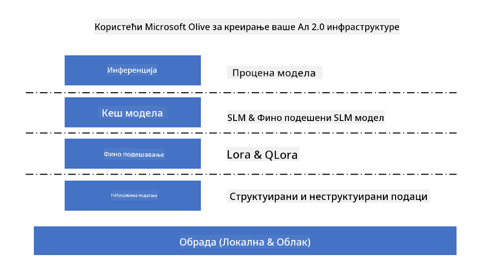
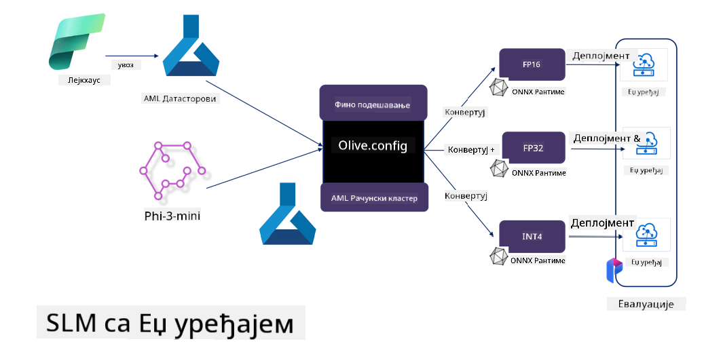

<!--
CO_OP_TRANSLATOR_METADATA:
{
  "original_hash": "5764be88ad2eb4f341e742eb8f14fab1",
  "translation_date": "2025-05-09T20:55:41+00:00",
  "source_file": "md/03.FineTuning/FineTuning_MicrosoftOlive.md",
  "language_code": "sr"
}
-->
# **Fino podešavanje Phi-3 uz Microsoft Olive**

[Olive](https://github.com/microsoft/OLive?WT.mc_id=aiml-138114-kinfeylo) je jednostavan za korišćenje alat za optimizaciju modela koji je svestan hardvera i koji objedinjuje vodeće tehnike iz industrije za kompresiju, optimizaciju i kompajliranje modela.

Dizajniran je da pojednostavi proces optimizacije modela mašinskog učenja, osiguravajući da modeli maksimalno efikasno koriste specifične hardverske arhitekture.

Bilo da radite na aplikacijama u oblaku ili na uređajima na ivici mreže, Olive vam omogućava da lako i efikasno optimizujete svoje modele.

## Ključne karakteristike:
- Olive objedinjuje i automatizuje tehnike optimizacije za željene hardverske ciljeve.
- Pošto nijedna tehnika optimizacije ne odgovara svim situacijama, Olive omogućava proširenje tako što stručnjaci iz industrije mogu da dodaju svoje inovacije u optimizaciji.

## Smanjite inženjerski napor:
- Programeri često moraju da nauče i koriste više alatki specifičnih za različite hardverske proizvođače da bi pripremili i optimizovali trenirane modele za implementaciju.
- Olive pojednostavljuje ovaj proces automatizacijom tehnika optimizacije za željeni hardver.

## Spremno za upotrebu E2E rešenje za optimizaciju:

Kombinovanjem i podešavanjem integrisanih tehnika, Olive nudi jedinstveno rešenje za end-to-end optimizaciju.
Uzimaju se u obzir ograničenja poput tačnosti i latencije tokom optimizacije modela.

## Korišćenje Microsoft Olive za fino podešavanje

Microsoft Olive je vrlo jednostavan za korišćenje open source alat za optimizaciju modela koji može pokriti kako fino podešavanje tako i referencu u oblasti generativne veštačke inteligencije. Potrebna je samo jednostavna konfiguracija, u kombinaciji sa korišćenjem open source malih jezičkih modela i odgovarajućih runtime okruženja (AzureML / lokalni GPU, CPU, DirectML), i možete završiti fino podešavanje ili referencu modela kroz automatsku optimizaciju, te pronaći najbolji model za implementaciju u oblak ili na uređaje na ivici mreže. Omogućava preduzećima da izgrade svoje industrijske vertikalne modele lokalno i u oblaku.



## Fino podešavanje Phi-3 uz Microsoft Olive



## Primer koda i primer Phi-3 Olive
U ovom primeru koristićete Olive da:

- Fino podesite LoRA adapter za klasifikaciju fraza u kategorije Tužan, Radost, Strah, Iznenađenje.
- Spojite težine adaptera u osnovni model.
- Optimizujete i kvantizujete model u int4.

[Sample Code](../../code/03.Finetuning/olive-ort-example/README.md)

### Instalacija Microsoft Olive

Instalacija Microsoft Olive je vrlo jednostavna, i može se instalirati za CPU, GPU, DirectML i Azure ML.

```bash
pip install olive-ai
```

Ako želite da pokrenete ONNX model na CPU-u, možete koristiti

```bash
pip install olive-ai[cpu]
```

Ako želite da pokrenete ONNX model na GPU-u, možete koristiti

```python
pip install olive-ai[gpu]
```

Ako želite da koristite Azure ML, koristite

```python
pip install git+https://github.com/microsoft/Olive#egg=olive-ai[azureml]
```

**Napomena**  
Zahtevi za OS: Ubuntu 20.04 / 22.04

### **Microsoft Olive Config.json**

Nakon instalacije, možete konfigurisati različite postavke specifične za model kroz Config fajl, uključujući podatke, računarske resurse, treniranje, implementaciju i generisanje modela.

**1. Podaci**

Na Microsoft Olive se podržava treniranje na lokalnim i cloud podacima, što se može podesiti u konfiguraciji.

*Podešavanje lokalnih podataka*

Jednostavno možete podesiti skup podataka za treniranje za fino podešavanje, obično u json formatu, i prilagoditi ga prema šablonu podataka. Ovo treba prilagoditi zahtevima modela (na primer, prilagoditi formatu koji zahteva Microsoft Phi-3-mini. Ako imate druge modele, molimo pogledajte potrebne formate za fino podešavanje drugih modela).

```json

    "data_configs": [
        {
            "name": "dataset_default_train",
            "type": "HuggingfaceContainer",
            "load_dataset_config": {
                "params": {
                    "data_name": "json", 
                    "data_files":"dataset/dataset-classification.json",
                    "split": "train"
                }
            },
            "pre_process_data_config": {
                "params": {
                    "dataset_type": "corpus",
                    "text_cols": [
                            "phrase",
                            "tone"
                    ],
                    "text_template": "### Text: {phrase}\n### The tone is:\n{tone}",
                    "corpus_strategy": "join",
                    "source_max_len": 2048,
                    "pad_to_max_len": false,
                    "use_attention_mask": false
                }
            }
        }
    ],
```

**Podešavanje izvora podataka u oblaku**

Povezivanjem skladišta podataka Azure AI Studio/Azure Machine Learning Service za pristup podacima u oblaku, možete birati različite izvore podataka u Azure AI Studio/Azure Machine Learning Service putem Microsoft Fabric i Azure Data kao podršku za fino podešavanje podataka.

```json

    "data_configs": [
        {
            "name": "dataset_default_train",
            "type": "HuggingfaceContainer",
            "load_dataset_config": {
                "params": {
                    "data_name": "json", 
                    "data_files": {
                        "type": "azureml_datastore",
                        "config": {
                            "azureml_client": {
                                "subscription_id": "Your Azure Subscrition ID",
                                "resource_group": "Your Azure Resource Group",
                                "workspace_name": "Your Azure ML Workspaces name"
                            },
                            "datastore_name": "workspaceblobstore",
                            "relative_path": "Your train_data.json Azure ML Location"
                        }
                    },
                    "split": "train"
                }
            },
            "pre_process_data_config": {
                "params": {
                    "dataset_type": "corpus",
                    "text_cols": [
                            "Question",
                            "Best Answer"
                    ],
                    "text_template": "<|user|>\n{Question}<|end|>\n<|assistant|>\n{Best Answer}\n<|end|>",
                    "corpus_strategy": "join",
                    "source_max_len": 2048,
                    "pad_to_max_len": false,
                    "use_attention_mask": false
                }
            }
        }
    ],
    
```

**2. Računarska konfiguracija**

Ako želite da radite lokalno, možete direktno koristiti lokalne resurse podataka. Ako koristite Azure AI Studio / Azure Machine Learning Service, potrebno je podesiti relevantne Azure parametre, ime računarske snage i slično.

```json

    "systems": {
        "aml": {
            "type": "AzureML",
            "config": {
                "accelerators": ["gpu"],
                "hf_token": true,
                "aml_compute": "Your Azure AI Studio / Azure Machine Learning Service Compute Name",
                "aml_docker_config": {
                    "base_image": "Your Azure AI Studio / Azure Machine Learning Service docker",
                    "conda_file_path": "conda.yaml"
                }
            }
        },
        "azure_arc": {
            "type": "AzureML",
            "config": {
                "accelerators": ["gpu"],
                "aml_compute": "Your Azure AI Studio / Azure Machine Learning Service Compute Name",
                "aml_docker_config": {
                    "base_image": "Your Azure AI Studio / Azure Machine Learning Service docker",
                    "conda_file_path": "conda.yaml"
                }
            }
        }
    },
```

***Napomena***

Pošto se izvršava kroz kontejner na Azure AI Studio/Azure Machine Learning Service, potrebno je konfigurisati okruženje. Ovo se podešava u conda.yaml fajlu.

```yaml

name: project_environment
channels:
  - defaults
dependencies:
  - python=3.8.13
  - pip=22.3.1
  - pip:
      - einops
      - accelerate
      - azure-keyvault-secrets
      - azure-identity
      - bitsandbytes
      - datasets
      - huggingface_hub
      - peft
      - scipy
      - sentencepiece
      - torch>=2.2.0
      - transformers
      - git+https://github.com/microsoft/Olive@jiapli/mlflow_loading_fix#egg=olive-ai[gpu]
      - --extra-index-url https://aiinfra.pkgs.visualstudio.com/PublicPackages/_packaging/ORT-Nightly/pypi/simple/ 
      - ort-nightly-gpu==1.18.0.dev20240307004
      - --extra-index-url https://aiinfra.pkgs.visualstudio.com/PublicPackages/_packaging/onnxruntime-genai/pypi/simple/
      - onnxruntime-genai-cuda

    

```

**3. Izbor SLM**

Model možete direktno koristiti sa Hugging Face-a, ili ga možete povezati sa Model Catalog-om Azure AI Studio / Azure Machine Learning da biste izabrali model. U donjem primeru koristićemo Microsoft Phi-3-mini kao primer.

Ako imate model lokalno, možete koristiti ovaj način

```json

    "input_model":{
        "type": "PyTorchModel",
        "config": {
            "hf_config": {
                "model_name": "model-cache/microsoft/phi-3-mini",
                "task": "text-generation",
                "model_loading_args": {
                    "trust_remote_code": true
                }
            }
        }
    },
```

Ako želite da koristite model iz Azure AI Studio / Azure Machine Learning Service, možete koristiti ovaj način

```json

    "input_model":{
        "type": "PyTorchModel",
        "config": {
            "model_path": {
                "type": "azureml_registry_model",
                "config": {
                    "name": "microsoft/Phi-3-mini-4k-instruct",
                    "registry_name": "azureml-msr",
                    "version": "11"
                }
            },
             "model_file_format": "PyTorch.MLflow",
             "hf_config": {
                "model_name": "microsoft/Phi-3-mini-4k-instruct",
                "task": "text-generation",
                "from_pretrained_args": {
                    "trust_remote_code": true
                }
            }
        }
    },
```

**Napomena:**  
Potrebna je integracija sa Azure AI Studio / Azure Machine Learning Service, pa prilikom podešavanja modela obratite pažnju na verziju i relevantne nazive.

Svi modeli na Azure-u moraju biti podešeni kao PyTorch.MLflow

Potrebno je imati Hugging Face nalog i povezati ključ sa Key vrednošću Azure AI Studio / Azure Machine Learning.

**4. Algoritam**

Microsoft Olive vrlo dobro enkapsulira Lora i QLora algoritme za fino podešavanje. Potrebno je samo podesiti neke relevantne parametre. Ovde uzimam QLora kao primer.

```json
        "lora": {
            "type": "LoRA",
            "config": {
                "target_modules": [
                    "o_proj",
                    "qkv_proj"
                ],
                "double_quant": true,
                "lora_r": 64,
                "lora_alpha": 64,
                "lora_dropout": 0.1,
                "train_data_config": "dataset_default_train",
                "eval_dataset_size": 0.3,
                "training_args": {
                    "seed": 0,
                    "data_seed": 42,
                    "per_device_train_batch_size": 1,
                    "per_device_eval_batch_size": 1,
                    "gradient_accumulation_steps": 4,
                    "gradient_checkpointing": false,
                    "learning_rate": 0.0001,
                    "num_train_epochs": 3,
                    "max_steps": 10,
                    "logging_steps": 10,
                    "evaluation_strategy": "steps",
                    "eval_steps": 187,
                    "group_by_length": true,
                    "adam_beta2": 0.999,
                    "max_grad_norm": 0.3
                }
            }
        },
```

Ako želite kvantizaciju, glavni branch Microsoft Olive već podržava onnxruntime-genai metodu. Možete podesiti prema svojim potrebama:

1. spojite težine adaptera u osnovni model  
2. konvertujte model u onnx model sa potrebnom preciznošću pomoću ModelBuilder-a

na primer konverzija u kvantizovani INT4

```json

        "merge_adapter_weights": {
            "type": "MergeAdapterWeights"
        },
        "builder": {
            "type": "ModelBuilder",
            "config": {
                "precision": "int4"
            }
        }
```

**Napomena**  
- Ako koristite QLoRA, kvantizacija pomoću ONNXRuntime-genai trenutno nije podržana.

- Važno je napomenuti da gore navedene korake možete prilagoditi svojim potrebama. Nije neophodno da kompletno podesite sve korake. U zavisnosti od potreba, možete direktno koristiti korake algoritma bez fino podešavanja. Na kraju je potrebno podesiti relevantne engine-e.

```json

    "engine": {
        "log_severity_level": 0,
        "host": "aml",
        "target": "aml",
        "search_strategy": false,
        "execution_providers": ["CUDAExecutionProvider"],
        "cache_dir": "../model-cache/models/phi3-finetuned/cache",
        "output_dir" : "../model-cache/models/phi3-finetuned"
    }
```

**5. Završetak fino podešavanja**

Na komandnoj liniji, pokrenite u direktorijumu gde se nalazi olive-config.json

```bash
olive run --config olive-config.json  
```

**Ограничење одговорности**:  
Овај документ је преведен помоћу AI преводилачке услуге [Co-op Translator](https://github.com/Azure/co-op-translator). Иако настојимо да превод буде прецизан, имајте у виду да аутоматски преводи могу садржати грешке или нетачности. Изворни документ на његовом оригиналном језику треба сматрати ауторитетним извором. За критичне информације препоручује се професионални људски превод. Нисмо одговорни за било какве неспоразуме или погрешне тумачења настала коришћењем овог превода.