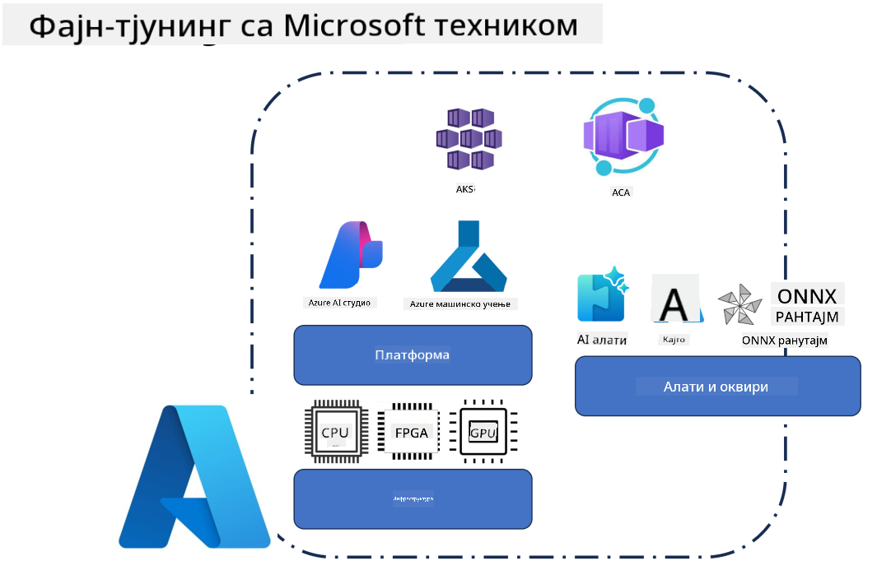
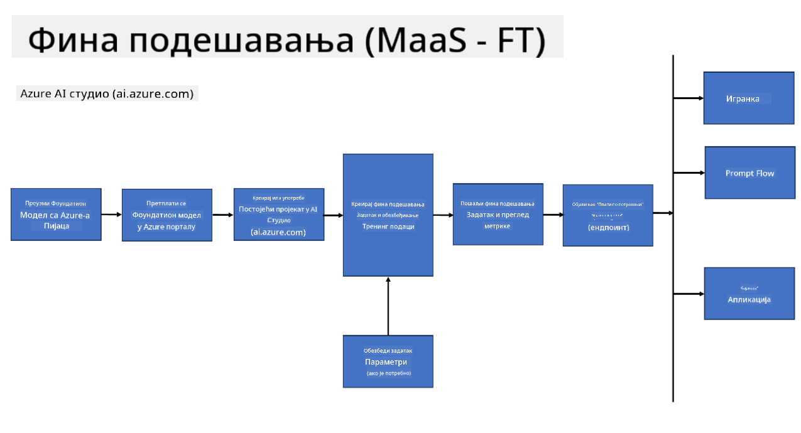
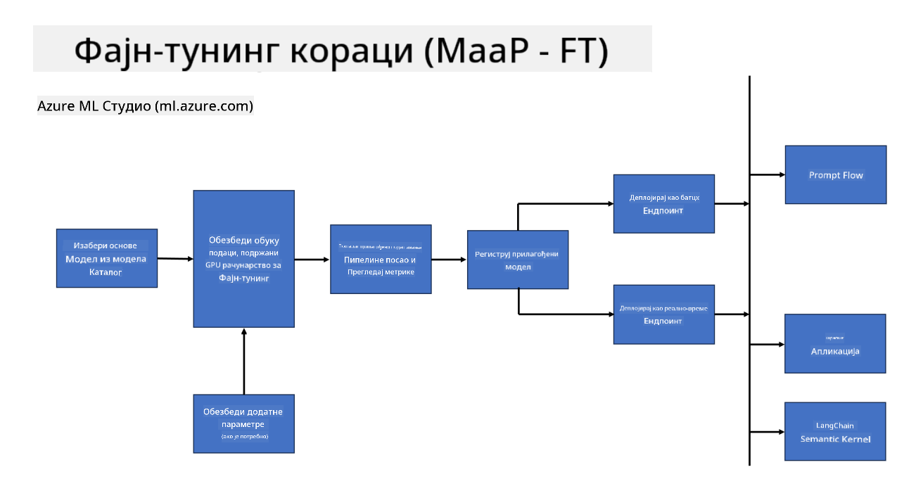
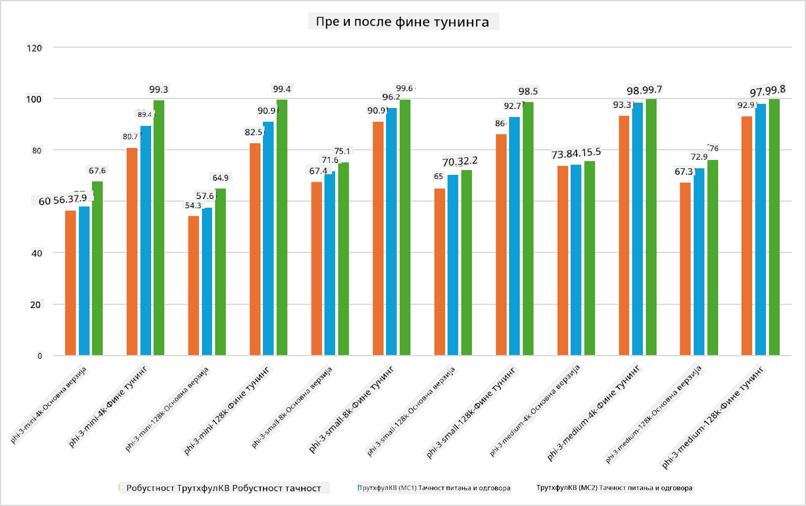

<!--
CO_OP_TRANSLATOR_METADATA:
{
  "original_hash": "cb5648935f63edc17e95ce38f23adc32",
  "translation_date": "2025-05-09T21:58:06+00:00",
  "source_file": "md/03.FineTuning/FineTuning_Scenarios.md",
  "language_code": "sr"
}
-->
## Scenariji za fino podešavanje

**Platforma** Obuhvata različite tehnologije kao što su Azure AI Foundry, Azure Machine Learning, AI Tools, Kaito i ONNX Runtime.

**Infrastruktura** Obuhvata CPU i FPGA, koji su ključni za proces fino podešavanja. Pokažem vam ikone za svaku od ovih tehnologija.

**Alati i okviri** Obuhvataju ONNX Runtime i ONNX Runtime. Pokažem vam ikone za svaku od ovih tehnologija.  
[Insert icons for ONNX Runtime and ONNX Runtime]

Proces fino podešavanja sa Microsoft tehnologijama uključuje različite komponente i alate. Razumevanjem i korišćenjem ovih tehnologija možemo efikasno fino podesiti naše aplikacije i kreirati bolje rešenja.

## Model kao usluga

Fino podesite model koristeći hostovano fino podešavanje, bez potrebe za kreiranjem i upravljanjem računarskim resursima.

Serverless fino podešavanje je dostupno za Phi-3-mini i Phi-3-medium modele, omogućavajući programerima da brzo i lako prilagode modele za cloud i edge scenarije, bez potrebe za organizovanjem računarskih resursa. Takođe smo najavili da je Phi-3-small sada dostupan kroz našu ponudu Models-as-a-Service, tako da programeri mogu brzo i lako započeti razvoj AI bez upravljanja osnovnom infrastrukturom.

## Model kao platforma

Korisnici sami upravljaju svojim računarskim resursima kako bi fino podesili svoje modele.

[Fine Tuning Sample](https://github.com/Azure/azureml-examples/blob/main/sdk/python/foundation-models/system/finetune/chat-completion/chat-completion.ipynb)

## Scenariji za fino podešavanje

| | | | | | | |
|-|-|-|-|-|-|-|
|Scenario|LoRA|QLoRA|PEFT|DeepSpeed|ZeRO|DORA|
|Prilagođavanje prethodno treniranih LLM modela specifičnim zadacima ili domenima|Da|Da|Da|Da|Da|Da|
|Fino podešavanje za NLP zadatke kao što su klasifikacija teksta, prepoznavanje imenovanih entiteta i mašinski prevod|Da|Da|Da|Da|Da|Da|
|Fino podešavanje za QA zadatke|Da|Da|Da|Da|Da|Da|
|Fino podešavanje za generisanje odgovora nalik ljudskim u chatbotovima|Da|Da|Da|Da|Da|Da|
|Fino podešavanje za generisanje muzike, umetnosti ili drugih oblika kreativnosti|Da|Da|Da|Da|Da|Da|
|Smanjenje računarskih i finansijskih troškova|Da|Da|Ne|Da|Da|Ne|
|Smanjenje korišćenja memorije|Ne|Da|Ne|Da|Da|Da|
|Korišćenje manjeg broja parametara za efikasno fino podešavanje|Ne|Da|Da|Ne|Ne|Da|
|Memorijski efikasna forma paralelizma podataka koja omogućava pristup ukupnoj GPU memoriji svih dostupnih GPU uređaja|Ne|Ne|Ne|Da|Da|Da|

## Primeri performansi fino podešavanja

**Ограничење одговорности**:  
Овај документ је преведен коришћењем AI услуге за превођење [Co-op Translator](https://github.com/Azure/co-op-translator). Иако се трудимо да превод буде тачан, имајте у виду да аутоматизовани преводи могу садржати грешке или нетачности. Изворни документ на његовом оригиналном језику треба сматрати ауторитетом. За критичне информације препоручује се професионални људски превод. Нисмо одговорни за било каква неспоразума или погрешне интерпретације настале употребом овог превода.