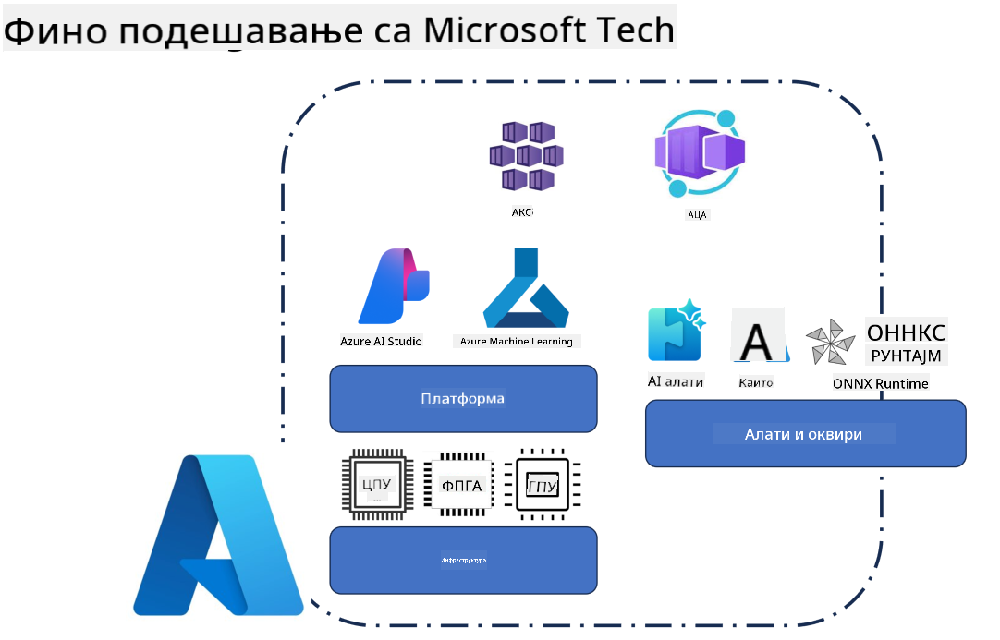
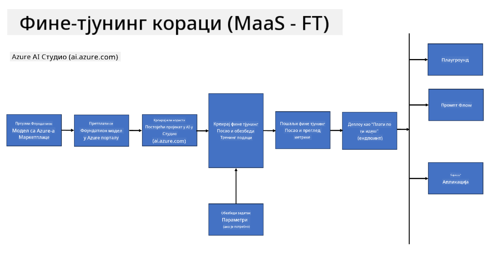
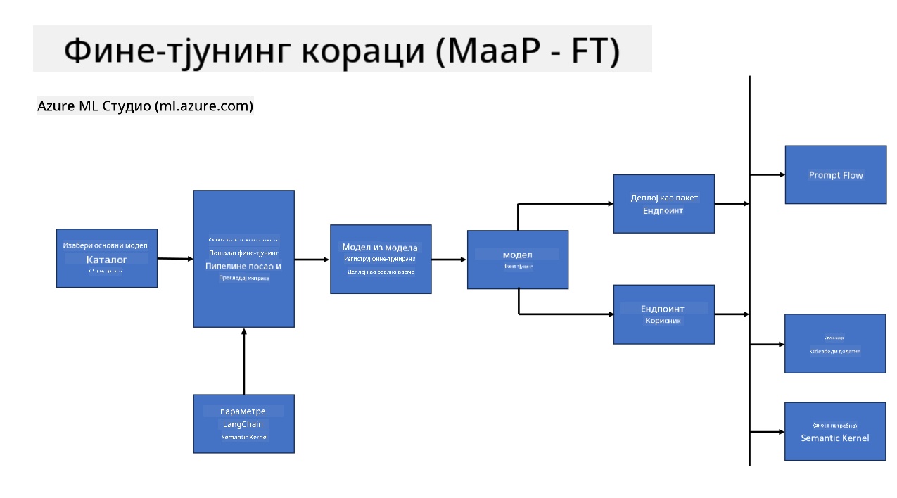

<!--
CO_OP_TRANSLATOR_METADATA:
{
  "original_hash": "cb5648935f63edc17e95ce38f23adc32",
  "translation_date": "2025-07-17T08:30:47+00:00",
  "source_file": "md/03.FineTuning/FineTuning_Scenarios.md",
  "language_code": "sr"
}
-->
## Сценарији фино подешавање

**Платформа** Ово обухвата различите технологије као што су Azure AI Foundry, Azure Machine Learning, AI Tools, Kaito и ONNX Runtime.

**Инфраструктура** Ово укључује CPU и FPGA, који су кључни за процес фино подешавања. Хајде да вам покажем иконе за сваку од ових технологија.

**Алатке и оквири** Ово укључује ONNX Runtime и ONNX Runtime. Хајде да вам покажем иконе за сваку од ових технологија.  
[Insert icons for ONNX Runtime and ONNX Runtime]

Процес фино подешавања уз Microsoft технологије укључује различите компоненте и алатке. Разумевањем и коришћењем ових технологија можемо ефикасно фино подесити наше апликације и креирати боља решења.

## Модел као услуга

Фино подесите модел користећи хостовано фино подешавање, без потребе за креирањем и управљањем рачунарским ресурсима.

Безсерверско фино подешавање је доступно за Phi-3-mini и Phi-3-medium моделе, омогућавајући програмерима да брзо и лако прилагоде моделе за облачне и edge сценарије без потребе за обезбеђивањем рачунарских ресурса. Такође смо најавили да је Phi-3-small сада доступан кроз нашу понуду Models-as-a-Service, тако да програмери могу брзо и лако започети са развојем вештачке интелигенције без потребе за управљањем основном инфраструктуром.

## Модел као платформа

Корисници управљају својим рачунарским ресурсима како би фино подесили своје моделе.

[Fine Tuning Sample](https://github.com/Azure/azureml-examples/blob/main/sdk/python/foundation-models/system/finetune/chat-completion/chat-completion.ipynb)

## Сценарији фино подешавања

| | | | | | | |
|-|-|-|-|-|-|-|
|Сценарио|LoRA|QLoRA|PEFT|DeepSpeed|ZeRO|DORA|
|Прилагођавање претходно обучених LLM модела специфичним задацима или доменима|Да|Да|Да|Да|Да|Да|
|Фино подешавање за NLP задатке као што су класификација текста, препознавање именованих ентитета и машински превод|Да|Да|Да|Да|Да|Да|
|Фино подешавање за QA задатке|Да|Да|Да|Да|Да|Да|
|Фино подешавање за генерисање одговора сличних људским у чатботовима|Да|Да|Да|Да|Да|Да|
|Фино подешавање за генерисање музике, уметности или других облика креативности|Да|Да|Да|Да|Да|Да|
|Смањење рачунарских и финансијских трошкова|Да|Да|Не|Да|Да|Не|
|Смањење коришћења меморије|Не|Да|Не|Да|Да|Да|
|Коришћење мањег броја параметара за ефикасно фино подешавање|Не|Да|Да|Не|Не|Да|
|Меморијски ефикасан облик паралелизма података који омогућава приступ укупној GPU меморији свих доступних GPU уређаја|Не|Не|Не|Да|Да|Да|

## Примери перформанси фино подешавања

**Одрицање од одговорности**:  
Овај документ је преведен коришћењем AI сервиса за превођење [Co-op Translator](https://github.com/Azure/co-op-translator). Иако тежимо прецизности, молимо вас да имате у виду да аутоматски преводи могу садржати грешке или нетачности. Оригинални документ на његовом изворном језику треба сматрати ауторитетним извором. За критичне информације препоручује се професионални људски превод. Нисмо одговорни за било каква неспоразума или погрешна тумачења која произилазе из коришћења овог превода.