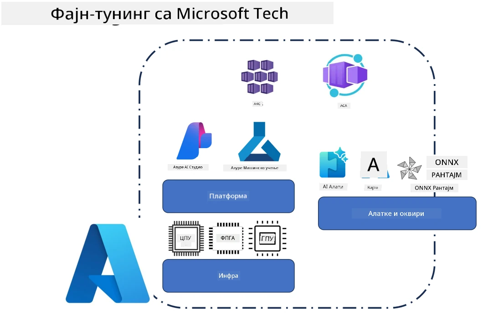
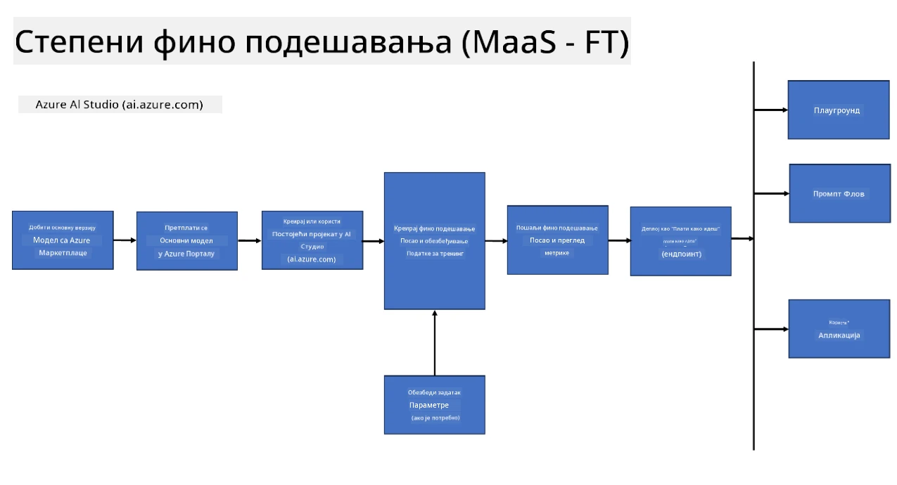
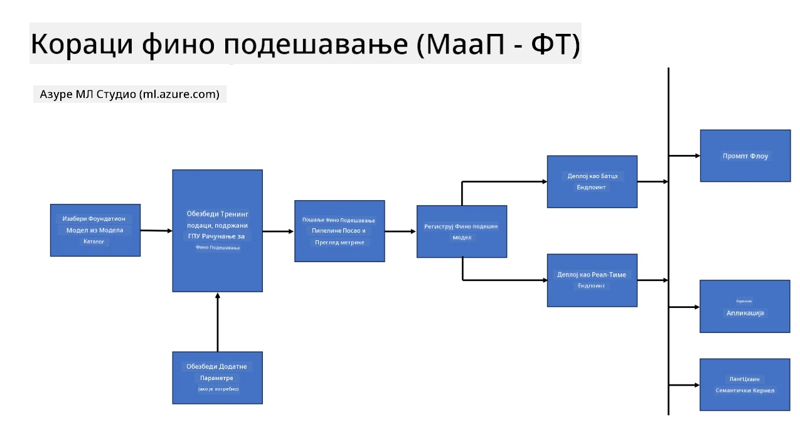
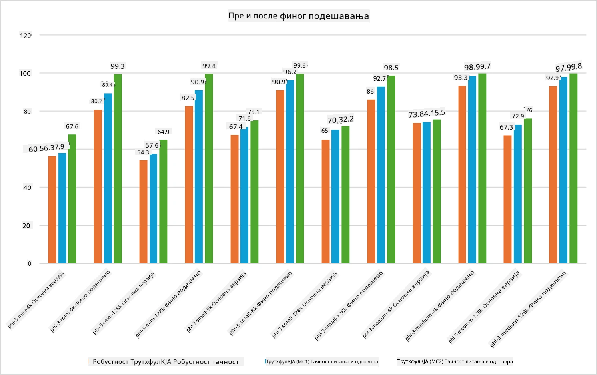

## Сценарији фино подешавање

Овај одељак пружа преглед сценарија фино подешавања у окружењима Microsoft Foundry и Azure, укључујући моделе распореда, слојеве инфраструктуре и уобичајене технике оптимизације.

**Платформа**  
Ово укључује управљане сервисе као што су Microsoft Foundry (раније Azure AI Foundry) и Azure Machine Learning, који пружају управљање моделима, оркестрацију, праћење експеримената и токове рада распореда.

**Инфраструктура**  
Фино подешавање захтева скалабилне рачунарске ресурсе. У Azure окружењима, то обично укључује виртуелне машине засноване на GPU-овима и CPU ресурсе за лакше радно оптерећење, као и скалабилну фасциклу за скупове података и контролне тачке.

**Алати и оквири**  
Токови рада фино подешавања често се ослањају на оквире и библиотеке за оптимизацију као што су Hugging Face Transformers, DeepSpeed и PEFT (Параметарски ефикасно фино подешавање).

Процес фино подешавања са Microsoft технологијама обухвата сервисе платформе, рачунарску инфраструктуру и оквире за тренинг. Разумевањем како ови елементи заједно функционишу, програмери могу ефикасно прилагодити основне моделе специфичним задацима и сценаријима производње.

## Модел као сервис

Фино подешавајте модел користећи хостовано фино подешавање, без потребе да креирате и управљате рачунарским ресурсима.

Серверлес фино подешавање је сада доступно за породице модела Phi-3, Phi-3.5 и Phi-4, омогућавајући програмерима да брзо и лако прилагоде моделе за облачне и угаоне сценарије без потребе за обезбеђивањем рачунарске снаге.

## Модел као платформа

Корисници управљају сопственом рачунарском инфраструктуром како би фино подесили своје моделе.

[Пример фино подешавања](https://github.com/Azure/azureml-examples/blob/main/sdk/python/foundation-models/system/finetune/chat-completion/chat-completion.ipynb)

## Поређење техника фино подешавања

|Сценарио|LoRA|QLoRA|PEFT|DeepSpeed|ZeRO|DoRA|
|---|---|---|---|---|---|---|
|Прилагођавање претходно обучених LLM-ова специфичним задацима или доменима|Да|Да|Да|Да|Да|Да|
|Фино подешавање за NLP задатке као што су класификација текста, препознавање именованих ентитета и машински превод|Да|Да|Да|Да|Да|Да|
|Фино подешавање за QA задатке|Да|Да|Да|Да|Да|Да|
|Фино подешавање за генерисање људских одговора у ћаскањима|Да|Да|Да|Да|Да|Да|
|Фино подешавање за генерисање музике, уметности или других облика креативности|Да|Да|Да|Да|Да|Да|
|Смањење рачунарских и финансијских трошкова|Да|Да|Да|Да|Да|Да|
|Смањење коришћења меморије|Да|Да|Да|Да|Да|Да|
|Коришћење мањег броја параметара за ефикасно фино подешавање|Да|Да|Да|Не|Не|Да|
|Меморијски ефикасан облик паралелизма података који пружа приступ агрегираној GPU меморији свих доступних GPU уређаја|Не|Не|Не|Да|Да|Не|

> [!NOTE]
> LoRA, QLoRA, PEFT и DoRA су параметарски ефикасне методе фино подешавања, док DeepSpeed и ZeRO фокусирају на дистрибуирани тренинг и оптимизацију меморије.

## Примери перформанси фино подешавања

---

<!-- CO-OP TRANSLATOR DISCLAIMER START -->
**Саопштење**:  
Овај документ је преведен коришћењем АИ преводилачке услуге [Co-op Translator](https://github.com/Azure/co-op-translator). Иако тежимо прецизности, молимо вас да имате у виду да аутоматски преводи могу садржати грешке или нетачности. Оригинални документ на његовом изворном језику треба сматрати ауторитетним извором. За кључне информације препоручује се професионални људски превод. Не сносимо одговорност за било каква неспоразума или погрешне интерпретације проистекле из коришћења овог превода.
<!-- CO-OP TRANSLATOR DISCLAIMER END -->