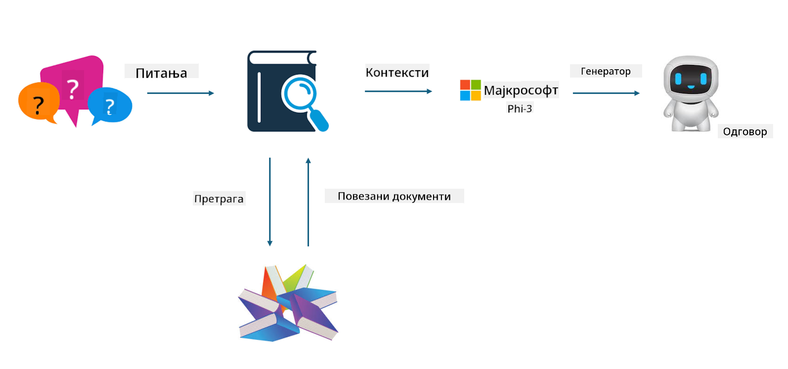

<!--
CO_OP_TRANSLATOR_METADATA:
{
  "original_hash": "e4e010400c2918557b36bb932a14004c",
  "translation_date": "2025-05-09T22:17:30+00:00",
  "source_file": "md/03.FineTuning/FineTuning_vs_RAG.md",
  "language_code": "sr"
}
-->
## Finetuning vs RAG

## Retrieval Augmented Generation

RAG je kombinacija pretraživanja podataka i generisanja teksta. Struktuirani i nestruktuirani podaci preduzeća se čuvaju u vektorskoj bazi podataka. Prilikom pretrage relevantnog sadržaja, pronalazi se odgovarajući sažetak i sadržaj koji formiraju kontekst, a zatim se koristi sposobnost dopunjavanja teksta LLM/SLM modela za generisanje sadržaja.

## RAG proces

## Fine-tuning
Fine-tuning se zasniva na unapređenju određenog modela. Nije potrebno počinjati od algoritma modela, ali je neophodno stalno prikupljanje podataka. Ako želite precizniju terminologiju i jezički izraz u industrijskim primenama, fine-tuning je bolji izbor. Međutim, ako se vaši podaci često menjaju, fine-tuning može postati komplikovan.

## Kako izabrati
Ako naš odgovor zahteva uključivanje spoljašnjih podataka, RAG je najbolji izbor.

Ako vam je potreban stabilan i precizan izlaz industrijskog znanja, fine-tuning će biti dobar izbor. RAG daje prioritet pronalaženju relevantnog sadržaja, ali možda neće uvek uhvatiti specifične nijanse.

Fine-tuning zahteva visokokvalitetni skup podataka, a ako je u pitanju samo mali obim podataka, neće doneti značajnu razliku. RAG je fleksibilniji.  
Fine-tuning je „crna kutija“, metafizika, i teško je razumeti njegov unutrašnji mehanizam. Ali RAG olakšava pronalaženje izvora podataka, što omogućava efikasno ispravljanje halucinacija ili grešaka u sadržaju i pruža bolju transparentnost.

**Ограничење одговорности**:  
Овај документ је преведен помоћу AI преводилачке услуге [Co-op Translator](https://github.com/Azure/co-op-translator). Иако тежимо тачности, молимо вас да имате у виду да аутоматизовани преводи могу садржати грешке или нетачности. Изворни документ на његовом оригиналном језику треба сматрати ауторитетним извором. За критичне информације препоручује се професионални људски превод. Нисмо одговорни за било каква неспоразума или погрешне тумачења која могу настати употребом овог превода.