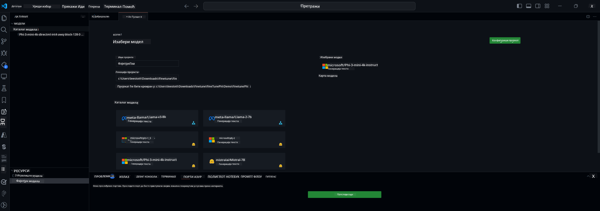

<!--
CO_OP_TRANSLATOR_METADATA:
{
  "original_hash": "c2bc0950f44919ac75a88c1a871680c2",
  "translation_date": "2025-07-17T09:22:14+00:00",
  "source_file": "md/03.FineTuning/Finetuning_VSCodeaitoolkit.md",
  "language_code": "sr"
}
-->
## Добродошли у AI Toolkit за VS Code

[AI Toolkit за VS Code](https://github.com/microsoft/vscode-ai-toolkit/tree/main) окупља различите моделе из Azure AI Studio каталога и других каталога као што је Hugging Face. Овај алат поједностављује уобичајене развојне задатке за прављење AI апликација користећи генеративне AI алате и моделе кроз:
- Почетак рада са проналажењем модела и playground-ом.
- Фино подешавање модела и извођење закључака користећи локалне рачунарске ресурсе.
- Удаљено фино подешавање и извођење закључака користећи Azure ресурсе.

[Инсталирајте AI Toolkit за VSCode](https://marketplace.visualstudio.com/items?itemName=ms-windows-ai-studio.windows-ai-studio)




**[Private Preview]** Једним кликом омогућавање Azure Container Apps за покретање фино подешавања и извођења закључака у облаку.

Хајде да започнемо развој ваше AI апликације:

- [Добродошли у AI Toolkit за VS Code](../../../../md/03.FineTuning)
- [Локални развој](../../../../md/03.FineTuning)
  - [Припреме](../../../../md/03.FineTuning)
  - [Активирање Condu](../../../../md/03.FineTuning)
  - [Само фино подешавање базног модела](../../../../md/03.FineTuning)
  - [Фино подешавање модела и извођење закључака](../../../../md/03.FineTuning)
  - [Фино подешавање модела](../../../../md/03.FineTuning)
  - [Microsoft Olive](../../../../md/03.FineTuning)
  - [Примери и ресурси за фино подешавање](../../../../md/03.FineTuning)
- [**\[Private Preview\]** Удаљени развој](../../../../md/03.FineTuning)
  - [Претпоставке](../../../../md/03.FineTuning)
  - [Подешавање удаљеног развојног пројекта](../../../../md/03.FineTuning)
  - [Обезбеђивање Azure ресурса](../../../../md/03.FineTuning)
  - [\[Опционо\] Додавање Huggingface токена у Azure Container App Secret](../../../../md/03.FineTuning)
  - [Покретање фино подешавања](../../../../md/03.FineTuning)
  - [Обезбеђивање inference endpoint-а](../../../../md/03.FineTuning)
  - [Деплој inference endpoint-а](../../../../md/03.FineTuning)
  - [Напредна употреба](../../../../md/03.FineTuning)

## Локални развој
### Припреме

1. Проверите да ли је NVIDIA драјвер инсталиран на хосту.
2. Покрените `huggingface-cli login` ако користите HF за коришћење скупова података.
3. Објашњења подешавања кључа `Olive` за све што мења коришћење меморије.

### Активирање Conda
Пошто користимо WSL окружење које је дељено, потребно је ручно активирати Conda окружење. Након овог корака можете покренути фино подешавање или извођење закључака.

```bash
conda activate [conda-env-name] 
```

### Само фино подешавање базног модела
Да бисте само испробали базни модел без фино подешавања, покрените ову команду након активирања conda окружења.

```bash
cd inference

# Web browser interface allows to adjust a few parameters like max new token length, temperature and so on.
# User has to manually open the link (e.g. http://0.0.0.0:7860) in a browser after gradio initiates the connections.
python gradio_chat.py --baseonly
```

### Фино подешавање модела и извођење закључака

Када је радни простор отворен у дев контејнеру, отворите терминал (подразумевани пут је корен пројекта), затим покрените команду испод да бисте фино подесили LLM на изабраном скупу података.

```bash
python finetuning/invoke_olive.py 
```

Checkpoint-ови и финални модел ће бити сачувани у фасцикли `models`.

Затим покрените извођење закључака са фино подешеним моделом кроз ћаскања у `конзоли`, `веб прегледачу` или `prompt flow`.

```bash
cd inference

# Console interface.
python console_chat.py

# Web browser interface allows to adjust a few parameters like max new token length, temperature and so on.
# User has to manually open the link (e.g. http://127.0.0.1:7860) in a browser after gradio initiates the connections.
python gradio_chat.py
```

За коришћење `prompt flow` у VS Code, погледајте овај [Quick Start](https://microsoft.github.io/promptflow/how-to-guides/quick-start.html).

### Фино подешавање модела

Затим, преузмите следећи модел у зависности од тога да ли имате GPU на уређају.

Да бисте покренули локалну сесију фино подешавања користећи QLoRA, изаберите модел који желите да подесите из нашег каталога.
| Платформа(е) | GPU доступан | Назив модела | Величина (GB) |
|---------|---------|--------|--------|
| Windows | Да | Phi-3-mini-4k-**directml**-int4-awq-block-128-onnx | 2.13GB |
| Linux | Да | Phi-3-mini-4k-**cuda**-int4-onnx | 2.30GB |
| Windows<br>Linux | Не | Phi-3-mini-4k-**cpu**-int4-rtn-block-32-acc-level-4-onnx | 2.72GB |

**_Напомена_** Нема потребе за Azure налогом да бисте преузели моделе.

Phi3-mini (int4) модел је отприлике величине од 2GB до 3GB. У зависности од брзине ваше мреже, преузимање може трајати неколико минута.

Почните тако што ћете изабрати име пројекта и локацију.
Затим изаберите модел из каталога модела. Бићете упитани да преузмете шаблон пројекта. Након тога можете кликнути на "Configure Project" да подесите различите опције.

### Microsoft Olive

Користимо [Olive](https://microsoft.github.io/Olive/why-olive.html) за покретање QLoRA фино подешавања на PyTorch моделу из нашег каталога. Сва подешавања су унапред дефинисана са подразумеваним вредностима како би се оптимизовао локални процес фино подешавања са оптималном употребом меморије, али се могу прилагодити вашем сценарију.

### Примери и ресурси за фино подешавање

- [Водич за почетак рада са финим подешавањем](https://learn.microsoft.com/windows/ai/toolkit/toolkit-fine-tune)
- [Фино подешавање са HuggingFace скупом података](https://github.com/microsoft/vscode-ai-toolkit/blob/main/archive/walkthrough-hf-dataset.md)
- [Фино подешавање са једноставним скупом података](https://github.com/microsoft/vscode-ai-toolkit/blob/main/archive/walkthrough-simple-dataset.md)

## **[Private Preview]** Удаљени развој

### Претпоставке

1. Да бисте покренули фино подешавање модела у вашем удаљеном Azure Container App окружењу, уверите се да ваша претплата има довољан капацитет GPU-а. Поднесите [захтев за подршку](https://azure.microsoft.com/support/create-ticket/) да бисте тражили потребан капацитет за вашу апликацију. [Сазнајте више о GPU капацитету](https://learn.microsoft.com/azure/container-apps/workload-profiles-overview)
2. Ако користите приватни скуп података на HuggingFace, уверите се да имате [HuggingFace налог](https://huggingface.co/?WT.mc_id=aiml-137032-kinfeylo) и да сте [генерисали приступни токен](https://huggingface.co/docs/hub/security-tokens?WT.mc_id=aiml-137032-kinfeylo)
3. Омогућите функцију удаљеног фино подешавања и извођења закључака у AI Toolkit за VS Code
   1. Отворите VS Code подешавања тако што ћете изабрати *File -> Preferences -> Settings*.
   2. Идите на *Extensions* и изаберите *AI Toolkit*.
   3. Изаберите опцију *"Enable Remote Fine-tuning And Inference"*.
   4. Поново покрените VS Code да би промене ступиле на снагу.

- [Удаљено фино подешавање](https://github.com/microsoft/vscode-ai-toolkit/blob/main/archive/remote-finetuning.md)

### Подешавање удаљеног развојног пројекта
1. Покрените командну палету и изаберите `AI Toolkit: Focus on Resource View`.
2. Идите на *Model Fine-tuning* да приступите каталогу модела. Доделите име вашем пројекту и изаберите локацију на вашем уређају. Затим кликните на дугме *"Configure Project"*.
3. Конфигурација пројекта
    1. Избегавајте омогућавање опције *"Fine-tune locally"*.
    2. Поставке за Olive конфигурацију ће се појавити са унапред подешеним подразумеваним вредностима. Молимо вас да их прилагодите и попуните по потреби.
    3. Наставите са *Generate Project*. Овај корак користи WSL и укључује подешавање новог Conda окружења, припремајући се за будућа ажурирања која укључују Dev Containers.
4. Кликните на *"Relaunch Window In Workspace"* да бисте отворили ваш удаљени развојни пројекат.

> **Напомена:** Пројекат тренутно ради или локално или удаљено у оквиру AI Toolkit за VS Code. Ако изаберете *"Fine-tune locally"* током креирања пројекта, радиће искључиво у WSL без могућности удаљеног развоја. Са друге стране, ако не омогућите *"Fine-tune locally"*, пројекат ће бити ограничен на удаљено Azure Container App окружење.

### Обезбеђивање Azure ресурса
Да бисте започели, потребно је да обезбедите Azure ресурс за удаљено фино подешавање. То урадите покретањем команде `AI Toolkit: Provision Azure Container Apps job for fine-tuning` из командне палете.

Пратите напредак обезбеђивања преко линка који се приказује у излазном каналу.

### [Опционо] Додавање Huggingface токена у Azure Container App Secret
Ако користите приватни HuggingFace скуп података, подесите ваш HuggingFace токен као променљиву окружења да бисте избегли потребу за ручним пријављивањем на Hugging Face Hub.
Ово можете урадити помоћу команде `AI Toolkit: Add Azure Container Apps Job secret for fine-tuning`. Уз ову команду, можете поставити име тајне као [`HF_TOKEN`](https://huggingface.co/docs/huggingface_hub/package_reference/environment_variables#hftoken) и користити ваш Hugging Face токен као вредност тајне.

### Покретање фино подешавања
Да бисте покренули удаљени посао фино подешавања, извршите команду `AI Toolkit: Run fine-tuning`.

Да бисте видели системске и конзолне логове, можете посетити Azure портал преко линка у излазном панелу (више корака на [View and Query Logs on Azure](https://aka.ms/ai-toolkit/remote-provision#view-and-query-logs-on-azure)). Или, можете директно у VSCode излазном панелу видети конзолне логове покретањем команде `AI Toolkit: Show the running fine-tuning job streaming logs`.
> **Напомена:** Посао може бити у реду чекања због недовољних ресурса. Ако се лог не приказује, покрените команду `AI Toolkit: Show the running fine-tuning job streaming logs`, сачекајте мало, па поново покрените команду да бисте се поново повезали на стриминг лог.

Током овог процеса, QLoRA ће се користити за фино подешавање и креираће LoRA адаптере за модел који ће се користити током извођења закључака.
Резултати фино подешавања ће бити сачувани у Azure Files.

### Обезбеђивање inference endpoint-а
Након што су адаптери обучени у удаљеном окружењу, користите једноставну Gradio апликацију за интеракцију са моделом.
Слично процесу фино подешавања, потребно је да обезбедите Azure ресурсе за удаљено извођење закључака покретањем команде `AI Toolkit: Provision Azure Container Apps for inference` из командне палете.

Подразумевано, претплата и ресурсна група за извођење закључака треба да буду исте као оне које се користе за фино подешавање. Извођење закључака ће користити исто Azure Container App окружење и приступати моделу и адаптеру модела сачуваним у Azure Files, који су генерисани током корака фино подешавања.

### Деплој inference endpoint-а
Ако желите да измените код за извођење закључака или поново учитате модел за извођење, покрените команду `AI Toolkit: Deploy for inference`. Ово ће синхронизовати ваш најновији код са Azure Container App и поново покренути реплику.

Када је деплој успешно завршен, можете приступити inference API-ју кликом на дугме "*Go to Inference Endpoint*" које се појављује у обавештењу у VSCode-у. Такође, веб API endpoint се налази у `ACA_APP_ENDPOINT` у `./infra/inference.config.json` и у излазном панелу. Сада сте спремни да процените модел користећи овај endpoint.

### Напредна употреба
За више информација о удаљеном развоју са AI Toolkit-ом, погледајте документацију о [Фино подешавању модела удаљено](https://aka.ms/ai-toolkit/remote-provision) и [Извођењу закључака са фино подешеним моделом](https://aka.ms/ai-toolkit/remote-inference).

**Одрицање од одговорности**:  
Овај документ је преведен коришћењем AI преводилачке услуге [Co-op Translator](https://github.com/Azure/co-op-translator). Иако се трудимо да превод буде тачан, молимо вас да имате у виду да аутоматизовани преводи могу садржати грешке или нетачности. Оригинални документ на његовом изворном језику треба сматрати ауторитетним извором. За критичне информације препоручује се професионални људски превод. Нисмо одговорни за било каква неспоразума или погрешна тумачења која произилазе из коришћења овог превода.