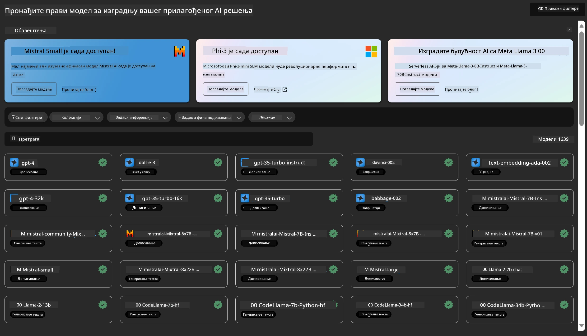
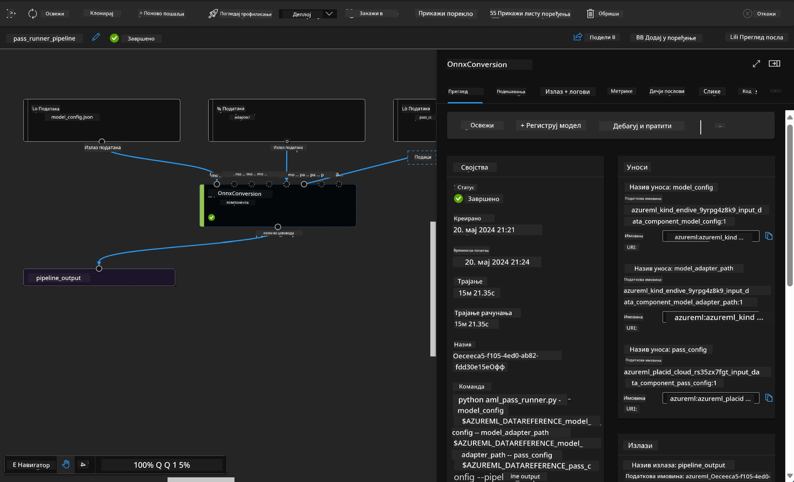

# **Упознавање са Azure Machine Learning сервисом**

[Azure Machine Learning](https://ml.azure.com?WT.mc_id=aiml-138114-kinfeylo) је облачна услуга за убрзавање и управљање животним циклусом пројеката машинског учења (ML).

ML стручњаци, научници података и инжењери могу га користити у свакодневним радним процесима да:

- Тренирају и имплементирају моделе.
- Управљају операцијама машинског учења (MLOps).
- Можете креирати модел у Azure Machine Learning-у или користити модел направљен на некој open-source платформи, као што су PyTorch, TensorFlow или scikit-learn.
- MLOps алати помажу у праћењу, поновном тренирању и поновном имплементирању модела.

## За кога је Azure Machine Learning?

**Научници података и ML инжењери**

Могу користити алате за убрзавање и аутоматизацију свакодневних радних процеса.  
Azure ML пружа функције за праведност, објашњивост, праћење и ревизију.

**Развојни програмери апликација**  
Могу без проблема интегрисати моделе у апликације или сервисе.

**Развојни програмери платформи**

Имају приступ робусном скупу алата подржаних од стране поузданих Azure Resource Manager API-ја.  
Ови алати омогућавају изградњу напредних ML алата.

**Привредна друштва**

Радом у Microsoft Azure облаку, предузећа имају корист од познате безбедности и контроле приступа засноване на улогама.  
Постављају пројекте за контролу приступа заштићеним подацима и одређеним операцијама.

## Продуктивност за цео тим  
ML пројекти често захтевају тим са разноврсним вештинама за изградњу и одржавање.

Azure ML пружа алате који вам омогућавају да:  
- Сарађујете са тимом преко заједничких бележница, рачунарских ресурса, серверлес рачунара, података и окружења.  
- Развијате моделе са праведношћу, објашњивошћу, праћењем и ревизијом како бисте испунили захтеве за пореклом и усаглашеношћу.  
- Брзо и лако имплементирате ML моделе у великом обиму и ефикасно их управљате и контролишете помоћу MLOps.  
- Покрећете машинско учење било где уз уграђену управу, безбедност и усаглашеност.

## Крос-компатибилни алати платформе

Свако у ML тиму може користити омиљене алате за обављање посла.  
Без обзира да ли изводите брзе експерименте, подешавате хиперпараметре, градите цевоводе или управљате предвиђањима, можете користити познате интерфејсе као што су:  
- Azure Machine Learning Studio  
- Python SDK (v2)  
- Azure CLI (v2)  
- Azure Resource Manager REST API-ји

Док усавршавате моделе и сарађујете током развојног циклуса, можете делити и проналазити ресурсе, средства и метрике у Azure Machine Learning студио корисничком интерфејсу.

## **LLM/SLM у Azure ML**

Azure ML је додао многе функције везане за LLM/SLM, комбинујући LLMOps и SLMOps како би створио платформу за генеративну вештачку интелигенцију на нивоу предузећа.

### **Каталог модела**

Корисници из предузећа могу да имплементирају различите моделе према различитим пословним сценаријима преко Каталога модела, и пружају услуге као Model as Service за приступ предузетничким програмерима или корисницима.

Каталог модела у Azure Machine Learning студију је центар за откривање и коришћење широког спектра модела који вам омогућавају да градите генеративне AI апликације. Каталог модела садржи стотине модела од провајдера као што су Azure OpenAI сервис, Mistral, Meta, Cohere, Nvidia, Hugging Face, укључујући и моделе које је обучио Microsoft. Модели од провајдера осим Microsoft-а су Non-Microsoft Products, како је дефинисано у Microsoft-овим условима коришћења производа, и подлежу условима који су приложени уз модел.

### **Job Pipeline**

Језгро машинског учења цевовода је подела комплетног задатка машинског учења у више корака. Сваки корак је управљива компонента која се може развијати, оптимизовати, конфигурисати и аутоматизовати појединачно. Кораци су повезани преко јасно дефинисаних интерфејса. Azure Machine Learning pipeline сервис аутоматски оркестрира све зависности између корака цевовода.

При финој подешавању SLM / LLM, можемо управљати нашим подацима, тренингом и процесима генерисања кроз Pipeline.

### **Prompt flow**

Предности коришћења Azure Machine Learning prompt flow  
Azure Machine Learning prompt flow нуди низ предности које помажу корисницима да пређу од идеје до експериментисања и коначно до продукцијски спремних LLM апликација:

**Агилност у prompt инжењерингу**

Интерактивно креирање: Azure Machine Learning prompt flow пружа визуелни приказ структуре тока, омогућавајући корисницима лако разумевање и навигацију кроз пројекте. Такође нуди искуство слично бележници за ефикасан развој и отклањање грешака у току.  
Варијанте за подешавање prompt-а: Корисници могу креирати и упоређивати више варијанти prompt-а, олакшавајући итеративни процес усавршавања.

Евалуација: Уграђени токови за евалуацију омогућавају корисницима да процене квалитет и ефикасност својих prompt-ова и токова.

Обимни ресурси: Azure Machine Learning prompt flow укључује библиотеку уграђених алата, примера и шаблона који служе као полазна тачка за развој, подстичу креативност и убрзавају процес.

**Спремност за предузећа у LLM апликацијама**

Сарадња: Azure Machine Learning prompt flow подржава тимски рад, омогућавајући више корисника да заједно раде на пројектима prompt инжењеринга, деле знање и одржавају контролу верзија.

Све у једном платформи: Azure Machine Learning prompt flow поједностављује цео процес prompt инжењеринга, од развоја и евалуације до имплементације и праћења. Корисници могу лако да имплементирају своје токове као Azure Machine Learning endpoint-ове и прате њихове перформансе у реалном времену, обезбеђујући оптималан рад и континуирано унапређење.

Решења за спремност предузећа Azure Machine Learning: Prompt flow користи робусна решења Azure Machine Learning-а за спремност предузећа, пружајући сигурну, скалабилну и поуздану основу за развој, експериментисање и имплементацију токова.

Са Azure Machine Learning prompt flow, корисници могу ослободити своју агилност у prompt инжењерингу, ефикасно сарађивати и користити решења предузећа за успешан развој и имплементацију LLM апликација.

Комбинујући рачунарску снагу, податке и различите компоненте Azure ML-а, програмери у предузећима могу лако градити своје вештачке интелигенције апликације.

**Одрицање од одговорности**:  
Овај документ је преведен коришћењем AI услуге за превођење [Co-op Translator](https://github.com/Azure/co-op-translator). Иако се трудимо да превод буде тачан, молимо вас да имате у виду да аутоматски преводи могу садржати грешке или нетачности. Оригинални документ на његовом изворном језику треба сматрати ауторитетним извором. За критичне информације препоручује се професионални људски превод. Нисмо одговорни за било каква неспоразума или погрешна тумачења која произилазе из коришћења овог превода.