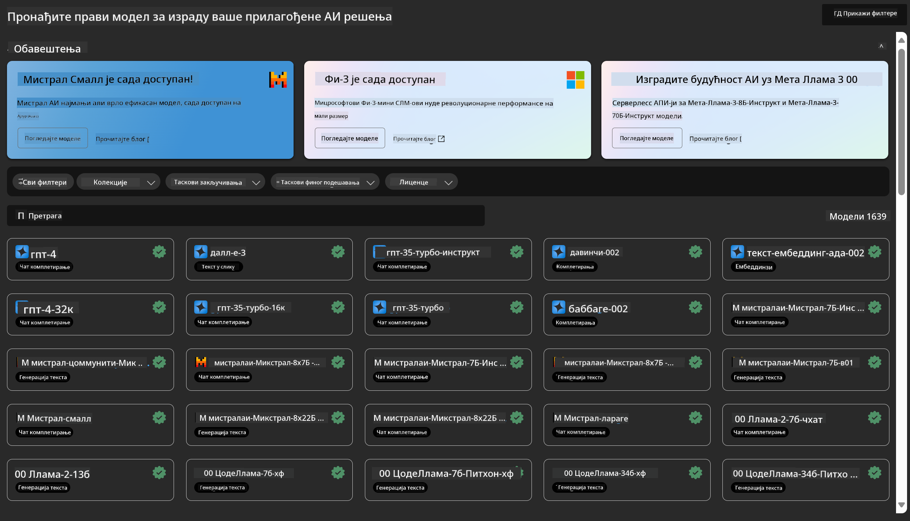
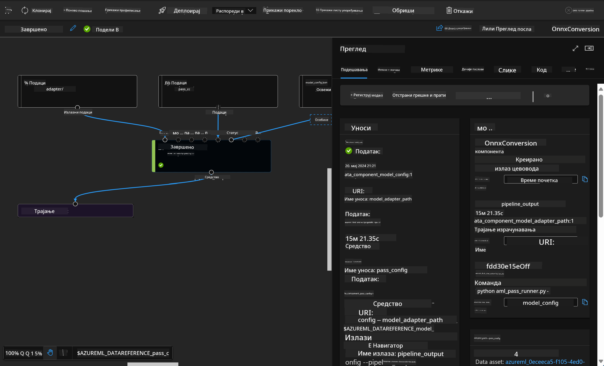

<!--
CO_OP_TRANSLATOR_METADATA:
{
  "original_hash": "7fe541373802e33568e94e13226d463c",
  "translation_date": "2025-05-09T22:24:22+00:00",
  "source_file": "md/03.FineTuning/Introduce_AzureML.md",
  "language_code": "sr"
}
-->
# **Uvod u Azure Machine Learning Service**

[Azure Machine Learning](https://ml.azure.com?WT.mc_id=aiml-138114-kinfeylo) je cloud servis za ubrzavanje i upravljanje životnim ciklusom projekata mašinskog učenja (ML).

ML stručnjaci, data naučnici i inženjeri mogu ga koristiti u svakodnevnim radnim tokovima da:

- Treniraju i implementiraju modele.
- Upravljaju operacijama mašinskog učenja (MLOps).
- Možete kreirati model u Azure Machine Learning ili koristiti model napravljen na nekoj open-source platformi, kao što su PyTorch, TensorFlow ili scikit-learn.
- MLOps alati pomažu u praćenju, ponovnom treniranju i ponovnoj implementaciji modela.

## Za koga je Azure Machine Learning?

**Data naučnici i ML inženjeri**

Mogu koristiti alate za ubrzavanje i automatizaciju svakodnevnih zadataka.  
Azure ML nudi funkcije za pravičnost, objašnjivost, praćenje i reviziju.  

**Programeri aplikacija**

Mogu lako integrisati modele u aplikacije ili servise.

**Programeri platformi**

Imaju pristup snažnom skupu alata podržanih stabilnim Azure Resource Manager API-jima.  
Ovi alati omogućavaju izgradnju naprednih ML alata.

**Preduzeća**

Rad u Microsoft Azure oblaku donosi poznatu sigurnost i kontrolu pristupa zasnovanu na ulogama.  
Postavite projekte za kontrolu pristupa zaštićenim podacima i određenim operacijama.

## Produktivnost za ceo tim  
ML projekti često zahtevaju tim sa različitim veštinama za izgradnju i održavanje.

Azure ML pruža alate koji vam omogućavaju da:  
- Saradjujete sa timom putem deljenih beležnica, računarskih resursa, serverless računanja, podataka i okruženja.  
- Razvijate modele sa fokusom na pravičnost, objašnjivost, praćenje i reviziju da ispunite zahteve za poreklom i usklađenošću.  
- Brzo i lako implementirate ML modele u velikom obimu i efikasno ih upravljate i nadgledate pomoću MLOps.  
- Pokrećete mašinsko učenje bilo gde uz ugrađenu upravu, sigurnost i usklađenost.

## Alati platforme kompatibilni sa više okruženja

Svako u ML timu može koristiti omiljene alate za obavljanje zadataka.  
Bilo da radite brze eksperimente, podešavate hiperparametre, gradite pipeline-ove ili upravljate inferencama, možete koristiti poznate interfejse kao što su:  
- Azure Machine Learning Studio  
- Python SDK (v2)  
- Azure CLI (v2)  
- Azure Resource Manager REST API-jevi  

Kako usavršavate modele i sarađujete tokom celog razvojnog ciklusa, možete deliti i pronalaziti resurse, materijale i metrike unutar Azure Machine Learning studio korisničkog interfejsa.

## **LLM/SLM u Azure ML**

Azure ML je dodao mnoge funkcije vezane za LLM/SLM, kombinujući LLMOps i SLMOps kako bi kreirao platformu za generativnu veštačku inteligenciju na nivou preduzeća.

### **Model Catalog**

Korisnici iz preduzeća mogu implementirati različite modele u zavisnosti od poslovnih scenarija preko Model Catalog-a i nuditi usluge kao Model as Service za pristup programerima ili korisnicima iz preduzeća.

Model Catalog u Azure Machine Learning studiju je centar za pronalaženje i korišćenje širokog spektra modela koji omogućavaju izgradnju generativnih AI aplikacija. Katalog modela sadrži stotine modela različitih provajdera kao što su Azure OpenAI servis, Mistral, Meta, Cohere, Nvidia, Hugging Face, uključujući i modele koje je trenirao Microsoft. Modeli od provajdera koji nisu Microsoft su proizvodi trećih strana, kako je definisano u Microsoft Product Terms, i podložni su uslovima koji dolaze uz model.

### **Job Pipeline**

Suština mašinskog učenja pipeline-a je da se kompletan ML zadatak podeli u višestepeni radni tok. Svaki korak je upravljiva komponenta koja se može razvijati, optimizovati, konfigurisati i automatizovati pojedinačno. Koraci su povezani jasno definisanim interfejsima. Azure Machine Learning pipeline servis automatski orkestrira sve zavisnosti između koraka pipeline-a.

Kod fino podešavanja SLM / LLM, možemo upravljati podacima, treninzima i procesima generisanja kroz Pipeline.

### **Prompt flow**

Prednosti korišćenja Azure Machine Learning prompt flow-a  
Azure Machine Learning prompt flow nudi niz prednosti koje pomažu korisnicima da pređu od ideje do eksperimentisanja i na kraju do produkcijski spremnih LLM aplikacija:

**Agilnost u dizajnu promptova**

Interaktivno kreiranje: Azure Machine Learning prompt flow pruža vizuelni prikaz strukture toka, omogućavajući korisnicima da lako razumeju i navigiraju kroz projekte. Takođe nudi iskustvo kodiranja slično beležnici za efikasan razvoj i debagovanje toka.  
Varijante za podešavanje promptova: Korisnici mogu kreirati i upoređivati više varijanti promptova, što olakšava iterativno usavršavanje.

Evaluacija: Ugrađeni evaluacioni tokovi omogućavaju korisnicima da procene kvalitet i efikasnost svojih promptova i tokova.

Sveobuhvatni resursi: Azure Machine Learning prompt flow uključuje biblioteku ugrađenih alata, primera i šablona koji služe kao polazna tačka za razvoj, podstiču kreativnost i ubrzavaju proces.

**Spremnost za preduzeća kod LLM aplikacija**

Saradnja: Azure Machine Learning prompt flow podržava timsku saradnju, omogućavajući više korisnika da rade zajedno na projektima dizajna promptova, dele znanje i održavaju verzionisanje.

Sve-u-jednom platforma: Azure Machine Learning prompt flow pojednostavljuje ceo proces dizajna promptova, od razvoja i evaluacije do implementacije i nadgledanja. Korisnici mogu lako implementirati svoje tokove kao Azure Machine Learning endpoint-e i pratiti njihovu performansu u realnom vremenu, osiguravajući optimalan rad i kontinuirano unapređenje.

Azure Machine Learning Enterprise Readiness Solutions: Prompt flow koristi snažne rešenja Azure Machine Learning za spremnost preduzeća, pružajući sigurnu, skalabilnu i pouzdanu osnovu za razvoj, eksperimentisanje i implementaciju tokova.

Uz Azure Machine Learning prompt flow, korisnici mogu osloboditi agilnost u dizajnu promptova, efikasno sarađivati i koristiti rešenja na nivou preduzeća za uspešan razvoj i implementaciju LLM aplikacija.

Kombinovanjem računarske snage, podataka i različitih komponenti Azure ML, programeri u preduzećima mogu lako izgraditi sopstvene aplikacije veštačke inteligencije.

**Одрицање од одговорности**:  
Овај документ је преведен коришћењем AI сервиса за превођење [Co-op Translator](https://github.com/Azure/co-op-translator). Иако тежимо прецизности, молимо вас да имате у виду да аутоматски преводи могу садржати грешке или нетачности. Оригинални документ на његовом изворном језику треба сматрати ауторитетним извором. За критичне информације препоручује се професионални људски превод. Нисмо одговорни за било каква неспоразума или погрешна тумачења која произилазе из коришћења овог превода.