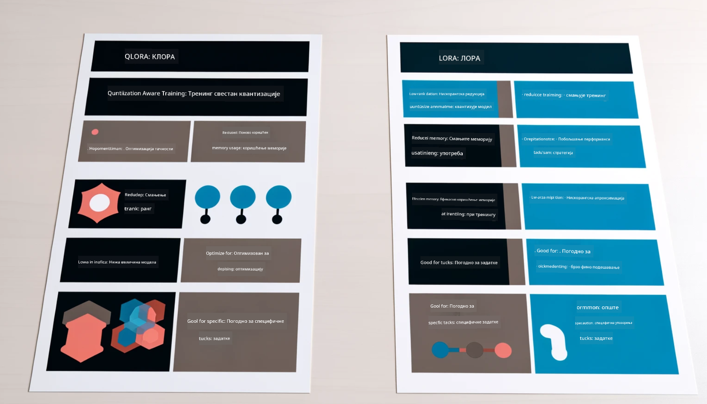

<!--
CO_OP_TRANSLATOR_METADATA:
{
  "original_hash": "743d7e9cb9c4e8ea642d77bee657a7fa",
  "translation_date": "2025-05-09T22:30:06+00:00",
  "source_file": "md/03.FineTuning/LetPhi3gotoIndustriy.md",
  "language_code": "sr"
}
-->
# **Neka Phi-3 postane industrijski stručnjak**

Da biste model Phi-3 prilagodili određenoj industriji, potrebno je dodati poslovne podatke te industrije u Phi-3 model. Imamo dve opcije: prva je RAG (Retrieval Augmented Generation), a druga Fine Tuning.

## **RAG vs Fine-Tuning**

### **Retrieval Augmented Generation**

RAG je kombinacija pretraživanja podataka i generisanja teksta. Struktuirani i nestruktuirani podaci preduzeća čuvaju se u vektorskoj bazi podataka. Kada se traži relevantan sadržaj, pronalaze se odgovarajući sažeci i sadržaj koji se koriste za formiranje konteksta, a zatim se koristi sposobnost dopunjavanja teksta LLM/SLM modela za generisanje sadržaja.

### **Fine-tuning**

Fine-tuning predstavlja unapređenje određenog modela. Ne zahteva promenu algoritma modela, ali je potrebno stalno prikupljanje podataka. Ako želite precizniju terminologiju i izraze u industrijskim aplikacijama, fine-tuning je bolji izbor. Međutim, ako se vaši podaci često menjaju, fine-tuning može postati komplikovan.

### **Kako izabrati**

1. Ako naš odgovor zahteva uvođenje spoljašnjih podataka, RAG je najbolji izbor

2. Ako vam je potreban stabilan i precizan izlaz industrijskog znanja, fine-tuning je dobar izbor. RAG daje prioritet izvlačenju relevantnog sadržaja, ali ne uvek hvata specifične nijanse.

3. Fine-tuning zahteva kvalitetan skup podataka, i ako je obuhvat podataka mali, neće doneti značajnu razliku. RAG je fleksibilniji.

4. Fine-tuning je „crna kutija“, metafizički proces, i teško je razumeti unutrašnji mehanizam. Sa druge strane, RAG olakšava pronalaženje izvora podataka, što pomaže u ispravljanju halucinacija ili grešaka u sadržaju i pruža bolju transparentnost.

### **Scenariji**

1. Vertikalne industrije koje zahtevaju specifičnu stručnu terminologiju i izraze, ***Fine-tuning*** je najbolji izbor

2. QA sistem, koji uključuje sintezu različitih tačaka znanja, ***RAG*** je najbolji izbor

3. Kombinacija automatizovanog poslovnog toka ***RAG + Fine-tuning*** je najbolji izbor

## **Kako koristiti RAG**

Vektorska baza podataka je skup podataka sačuvanih u matematičkom obliku. Vektorske baze olakšavaju mašinskim modelima da zapamte prethodne unose, što omogućava upotrebu mašinskog učenja za podršku slučajevima kao što su pretraga, preporuke i generisanje teksta. Podaci se mogu identifikovati na osnovu mera sličnosti, a ne tačnih poklapanja, što omogućava modelima da razumeju kontekst podataka.

Vektorska baza je ključ za realizaciju RAG. Podatke možemo pretvoriti u vektorski oblik pomoću vektorskih modela kao što su text-embedding-3, jina-ai-embedding i slično.

Saznajte više o kreiranju RAG aplikacije na [https://github.com/microsoft/Phi-3CookBook](https://github.com/microsoft/Phi-3CookBook?WT.mc_id=aiml-138114-kinfeylo)

## **Kako koristiti Fine-tuning**

Najčešće korišćeni algoritmi u Fine-tuningu su Lora i QLora. Kako izabrati?
- [Saznajte više sa ovim primerom notebook-a](../../../../code/04.Finetuning/Phi_3_Inference_Finetuning.ipynb)
- [Primer Python FineTuning skripte](../../../../code/04.Finetuning/FineTrainingScript.py)

### **Lora i QLora**

LoRA (Low-Rank Adaptation) i QLoRA (Quantized Low-Rank Adaptation) su tehnike koje se koriste za fine-tuning velikih jezičkih modela (LLM) pomoću Parameter Efficient Fine Tuning (PEFT). PEFT tehnike su dizajnirane da treniraju modele efikasnije nego tradicionalne metode.  
LoRA je samostalna tehnika fine-tuninga koja smanjuje zauzeće memorije primenom niskorangirane aproksimacije na matricu ažuriranja težina. Omogućava brzo treniranje i održava performanse blizu tradicionalnog fine-tuninga.

QLoRA je proširena verzija LoRA koja uključuje kvantizacione tehnike za dalju redukciju memorijske potrošnje. QLoRA kvantizuje preciznost parametara težina u prethodno treniranom LLM na 4-bitnu preciznost, što je efikasnije u pogledu memorije nego LoRA. Međutim, QLoRA treniranje je oko 30% sporije od LoRA treniranja zbog dodatnih koraka kvantizacije i dekvantizacije.

QLoRA koristi LoRA kao dodatak za ispravljanje grešaka nastalih kvantizacijom. QLoRA omogućava fine-tuning ogromnih modela sa milijardama parametara na relativno malim, lako dostupnim GPU-ovima. Na primer, QLoRA može fino podesiti model sa 70B parametara koji zahteva 36 GPU-ova sa samo 2...

**Odricanje od odgovornosti**:  
Ovaj dokument je preveden korišćenjem AI servisa za prevođenje [Co-op Translator](https://github.com/Azure/co-op-translator). Iako težimo tačnosti, imajte na umu da automatski prevodi mogu sadržati greške ili netačnosti. Izvorni dokument na njegovom izvornom jeziku treba smatrati autoritativnim izvorom. Za kritične informacije preporučuje se profesionalni ljudski prevod. Nismo odgovorni za bilo kakva nesporazuma ili pogrešna tumačenja nastala korišćenjem ovog prevoda.