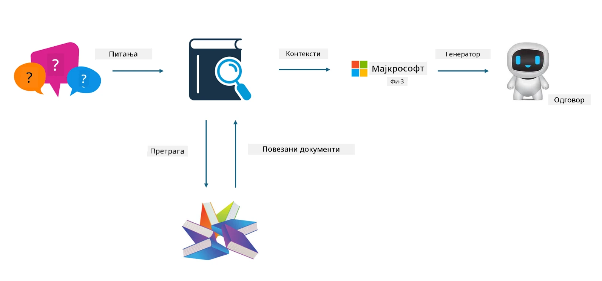

<!--
CO_OP_TRANSLATOR_METADATA:
{
  "original_hash": "743d7e9cb9c4e8ea642d77bee657a7fa",
  "translation_date": "2025-07-17T10:01:28+00:00",
  "source_file": "md/03.FineTuning/LetPhi3gotoIndustriy.md",
  "language_code": "sr"
}
-->
# **Нека Phi-3 постане индустријски стручњак**

Да бисте применили Phi-3 модел у некој индустрији, потребно је да додате пословне податке те индустрије у Phi-3 модел. Имамо две различите опције: прва је RAG (Retrieval Augmented Generation), а друга је Fine Tuning.

## **RAG против Fine-Tuning**

### **Retrieval Augmented Generation**

RAG је комбинација претраживања података и генерисања текста. Структурирани и неструктурирани подаци предузећа се чувају у векторској бази података. При претрази релевантног садржаја, проналазе се одговарајући сажетак и садржај који формирају контекст, а затим се користи способност допуњавања текста LLM/SLM модела за генерисање садржаја.

### **Fine-tuning**

Fine-tuning подразумева унапређење одређеног модела. Не мора се почети од алгоритма модела, али је потребно континуирано прикупљање података. Ако желите прецизнију терминологију и језичке изразе у индустријским апликацијама, fine-tuning је бољи избор. Међутим, ако се ваши подаци често мењају, fine-tuning може постати компликован.

### **Како изабрати**

1. Ако наш одговор захтева увођење спољних података, RAG је најбољи избор

2. Ако треба да излаз буде стабилно и прецизно индустријско знање, fine-tuning ће бити добар избор. RAG приоритетно повлачи релевантан садржај, али можда неће увек ухватити специјалне нијансе.

3. Fine-tuning захтева квалитетан скуп података, а ако је реч о малом обиму података, разлика неће бити значајна. RAG је флексибилнији.

4. Fine-tuning је црна кутија, метафизика, и тешко је разумети унутрашњи механизам. Али RAG олакшава проналажење извора података, што помаже у корекцији халуцинација или грешака у садржају и пружа бољу транспарентност.

### **Сценарији**

1. Вертикалне индустрије које захтевају специфичну стручну терминологију и изразе, ***Fine-tuning*** је најбољи избор

2. QA системи који укључују синтезу различитих знања, ***RAG*** је најбољи избор

3. Комбинација аутоматизованог пословног тока ***RAG + Fine-tuning*** је најбољи избор

## **Како користити RAG**

Векторска база података је скуп података који се чува у математичком облику. Векторске базе података олакшавају машинском учењу да памти претходне уносе, омогућавајући коришћење машинског учења за подршку случајевима као што су претрага, препоруке и генерисање текста. Подаци се могу идентификовати на основу метрика сличности, а не само тачних поклапања, што омогућава моделима да разумеју контекст података.

Векторска база података је кључ за реализацију RAG. Подаци се могу претворити у векторски формат помоћу векторских модела као што су text-embedding-3, jina-ai-embedding и други.

Сазнајте више о креирању RAG апликације [https://github.com/microsoft/Phi-3CookBook](https://github.com/microsoft/Phi-3CookBook?WT.mc_id=aiml-138114-kinfeylo)

## **Како користити Fine-tuning**

Често коришћени алгоритми у Fine-tuning-у су Lora и QLora. Како изабрати?
- [Сазнајте више уз овај пример notebook-а](../../../../code/04.Finetuning/Phi_3_Inference_Finetuning.ipynb)
- [Пример Python FineTuning скрипте](../../../../code/04.Finetuning/FineTrainingScript.py)

### **Lora и QLora**

LoRA (Low-Rank Adaptation) и QLoRA (Quantized Low-Rank Adaptation) су технике које се користе за фино подешавање великих језичких модела (LLM) помоћу Parameter Efficient Fine Tuning (PEFT). PEFT технике су дизајниране да тренирају моделе ефикасније од традиционалних метода.

LoRA је самостална техника фино подешавања која смањује потрошњу меморије применом нискоредне апроксимације на матрицу ажурирања тежина. Пружа брзо време тренинга и одржава перформансе близу традиционалним методама фино подешавања.

QLoRA је проширена верзија LoRA која укључује квантовање како би додатно смањила потрошњу меморије. QLoRA квантова прецизност параметара тежина у претходно обученом LLM-у на 4-битну прецизност, што је меморијски ефикасније од LoRA. Међутим, QLoRA тренинг је око 30% спорији од LoRA тренинга због додатних корака квантовања и деквантовања.

QLoRA користи LoRA као додатак за исправљање грешака насталих током квантовања. QLoRA омогућава фино подешавање масивних модела са милијардама параметара на релативно малим, лако доступним GPU-овима. На пример, QLoRA може фино подесити модел са 70 милијарди параметара који иначе захтева 36 GPU-ова са само 2...

**Одрицање од одговорности**:  
Овај документ је преведен коришћењем AI услуге за превођење [Co-op Translator](https://github.com/Azure/co-op-translator). Иако се трудимо да превод буде тачан, молимо вас да имате у виду да аутоматски преводи могу садржати грешке или нетачности. Оригинални документ на његовом изворном језику треба сматрати ауторитетним извором. За критичне информације препоручује се професионални људски превод. Нисмо одговорни за било каква неспоразума или погрешна тумачења која произилазе из коришћења овог превода.