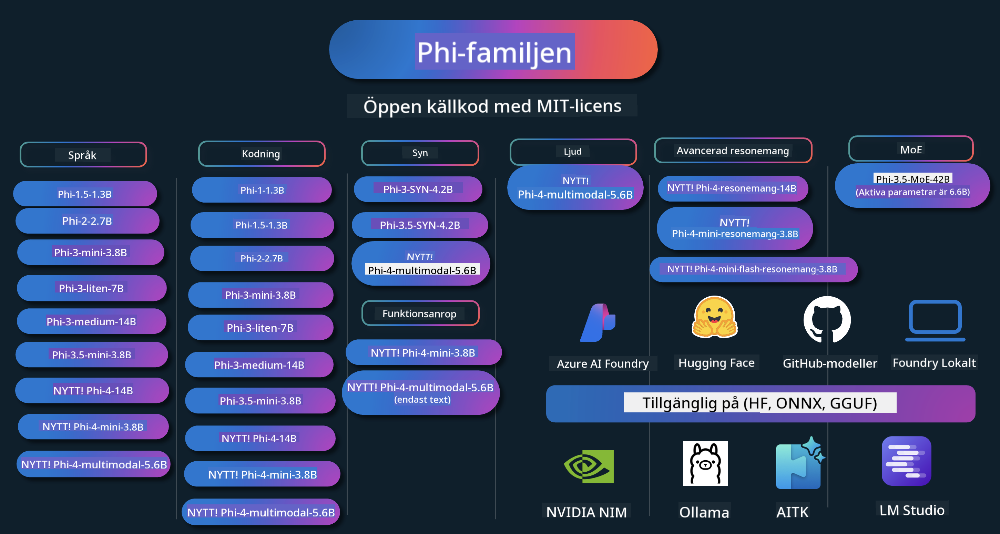

<!--
CO_OP_TRANSLATOR_METADATA:
{
  "original_hash": "5c07bb4c3c89a36c9be332a065a9a33c",
  "translation_date": "2025-07-16T15:15:27+00:00",
  "source_file": "README.md",
  "language_code": "sv"
}
-->
# Phi Cookbook: Praktiska exempel med Microsofts Phi-modeller

  

  
  
  

  
  

Phi är en serie open source AI-modeller utvecklade av Microsoft.

Phi är för närvarande den mest kraftfulla och kostnadseffektiva lilla språkmodellen (SLM), med mycket bra resultat inom flerspråkighet, resonemang, text-/chattgenerering, kodning, bilder, ljud och andra scenarier.

Du kan distribuera Phi till molnet eller till edge-enheter, och du kan enkelt bygga generativa AI-applikationer med begränsad beräkningskraft.

Följ dessa steg för att komma igång med dessa resurser:  
1. **Forka Repositoryt**: Klicka   
2. **Klona Repositoryt**: `git clone https://github.com/microsoft/PhiCookBook.git`  
3. [**Gå med i Microsoft AI Discord Community och träffa experter och andra utvecklare**](https://discord.com/invite/ByRwuEEgH4?WT.mc_id=aiml-137032-kinfeylo)

### 🌐 Flerspråkigt stöd

#### Stöds via GitHub Action (Automatiserat & Alltid uppdaterat)

[Franska](../fr/README.md) | [Spanska](../es/README.md) | [Tyska](../de/README.md) | [Ryska](../ru/README.md) | [Arabiska](../ar/README.md) | [Persiska (Farsi)](../fa/README.md) | [Urdu](../ur/README.md) | [Kinesiska (Förenklad)](../zh/README.md) | [Kinesiska (Traditionell, Macau)](../mo/README.md) | [Kinesiska (Traditionell, Hong Kong)](../hk/README.md) | [Kinesiska (Traditionell, Taiwan)](../tw/README.md) | [Japanska](../ja/README.md) | [Koreanska](../ko/README.md) | [Hindi](../hi/README.md)  
[Bengali](../bn/README.md) | [Marathi](../mr/README.md) | [Nepali](../ne/README.md) | [Punjabi (Gurmukhi)](../pa/README.md) | [Portugisiska (Portugal)](../pt/README.md) | [Portugisiska (Brasilien)](../br/README.md) | [Italienska](../it/README.md) | [Polska](../pl/README.md) | [Turkiska](../tr/README.md) | [Grekiska](../el/README.md) | [Thailändska](../th/README.md) | [Svenska](./README.md) | [Danska](../da/README.md) | [Norska](../no/README.md) | [Finska](../fi/README.md) | [Nederländska](../nl/README.md) | [Hebreiska](../he/README.md) | [Vietnamesiska](../vi/README.md) | [Indonesiska](../id/README.md) | [Malajiska](../ms/README.md) | [Tagalog (Filippinska)](../tl/README.md) | [Swahili](../sw/README.md) | [Ungerska](../hu/README.md) | [Tjeckiska](../cs/README.md) | [Slovakiska](../sk/README.md) | [Rumänska](../ro/README.md) | [Bulgariska](../bg/README.md) | [Serbiska (Kyrilliska)](../sr/README.md) | [Kroatiska](../hr/README.md) | [Slovenska](../sl/README.md)

## Innehållsförteckning

- Introduktion  
  - [Välkommen till Phi-familjen](./md/01.Introduction/01/01.PhiFamily.md)  
  - [Sätta upp din miljö](./md/01.Introduction/01/01.EnvironmentSetup.md)  
  - [Förstå viktiga teknologier](./md/01.Introduction/01/01.Understandingtech.md)  
  - [AI-säkerhet för Phi-modeller](./md/01.Introduction/01/01.AISafety.md)  
  - [Phi hårdvarustöd](./md/01.Introduction/01/01.Hardwaresupport.md)  
  - [Phi-modeller & tillgänglighet på olika plattformar](./md/01.Introduction/01/01.Edgeandcloud.md)  
  - [Använda Guidance-ai och Phi](./md/01.Introduction/01/01.Guidance.md)  
  - [GitHub Marketplace Models](https://github.com/marketplace/models)  
  - [Azure AI Model Catalog](https://ai.azure.com)

- Inferens av Phi i olika miljöer  
    -  [Hugging face](./md/01.Introduction/02/01.HF.md)  
    -  [GitHub Models](./md/01.Introduction/02/02.GitHubModel.md)  
    -  [Azure AI Foundry Model Catalog](./md/01.Introduction/02/03.AzureAIFoundry.md)  
    -  [Ollama](./md/01.Introduction/02/04.Ollama.md)  
    -  [AI Toolkit VSCode (AITK)](./md/01.Introduction/02/05.AITK.md)  
    -  [NVIDIA NIM](./md/01.Introduction/02/06.NVIDIA.md)  
    -  [Foundry Local](./md/01.Introduction/02/07.FoundryLocal.md)

- Inferens Phi-familjen  
    - [Inferens Phi på iOS](./md/01.Introduction/03/iOS_Inference.md)  
    - [Inferens Phi på Android](./md/01.Introduction/03/Android_Inference.md)  
    - [Inferens Phi på Jetson](./md/01.Introduction/03/Jetson_Inference.md)  
    - [Inferens Phi på AI PC](./md/01.Introduction/03/AIPC_Inference.md)  
    - [Inferens Phi med Apple MLX Framework](./md/01.Introduction/03/MLX_Inference.md)  
    - [Inferens Phi på lokal server](./md/01.Introduction/03/Local_Server_Inference.md)  
    - [Inferens Phi på fjärrserver med AI Toolkit](./md/01.Introduction/03/Remote_Interence.md)  
    - [Inferens Phi med Rust](./md/01.Introduction/03/Rust_Inference.md)  
    - [Inferens Phi–Vision lokalt](./md/01.Introduction/03/Vision_Inference.md)  
    - [Inferens Phi med Kaito AKS, Azure Containers (officiellt stöd)](./md/01.Introduction/03/Kaito_Inference.md)  
-  [Kvantisering av Phi-familjen](./md/01.Introduction/04/QuantifyingPhi.md)  
    - [Kvantisera Phi-3.5 / 4 med llama.cpp](./md/01.Introduction/04/UsingLlamacppQuantifyingPhi.md)  
    - [Kvantisera Phi-3.5 / 4 med Generative AI extensions för onnxruntime](./md/01.Introduction/04/UsingORTGenAIQuantifyingPhi.md)  
    - [Kvantisera Phi-3.5 / 4 med Intel OpenVINO](./md/01.Introduction/04/UsingIntelOpenVINOQuantifyingPhi.md)  
    - [Kvantisera Phi-3.5 / 4 med Apple MLX Framework](./md/01.Introduction/04/UsingAppleMLXQuantifyingPhi.md)

- Utvärdering av Phi  
    - [Ansvarsfull AI](./md/01.Introduction/05/ResponsibleAI.md)  
    - [Azure AI Foundry för utvärdering](./md/01.Introduction/05/AIFoundry.md)  
    - [Använda Promptflow för utvärdering](./md/01.Introduction/05/Promptflow.md)

- RAG med Azure AI Search  
    - [Hur man använder Phi-4-mini och Phi-4-multimodal (RAG) med Azure AI Search](https://github.com/microsoft/PhiCookBook/blob/main/code/06.E2E/E2E_Phi-4-RAG-Azure-AI-Search.ipynb)

- Exempel på Phi-applikationsutveckling  
  - Text- & chattapplikationer  
    - Phi-4 Exempel 🆕  
      - [📓] [Chatta med Phi-4-mini ONNX-modell](./md/02.Application/01.TextAndChat/Phi4/ChatWithPhi4ONNX/README.md)  
      - [Chatta med Phi-4 lokal ONNX-modell .NET](../../md/04.HOL/dotnet/src/LabsPhi4-Chat-01OnnxRuntime)  
      - [Chat .NET Console App med Phi-4 ONNX med Semantic Kernel](../../md/04.HOL/dotnet/src/LabsPhi4-Chat-02SK)  
    - Phi-3 / 3.5 Exempel  
      - [Lokal chatbot i webbläsaren med Phi3, ONNX Runtime Web och WebGPU](https://github.com/microsoft/onnxruntime-inference-examples/tree/main/js/chat)  
      - [OpenVino Chat](./md/02.Application/01.TextAndChat/Phi3/E2E_OpenVino_Chat.md)  
      - [Multi Model - Interaktiv Phi-3-mini och OpenAI Whisper](./md/02.Application/01.TextAndChat/Phi3/E2E_Phi-3-mini_with_whisper.md)  
      - [MLFlow - Bygga ett wrapper och använda Phi-3 med MLFlow](./md//02.Application/01.TextAndChat/Phi3/E2E_Phi-3-MLflow.md)  
      - [Modelloptimering - Hur man optimerar Phi-3-minimodellen för ONNX Runtime Web med Olive](https://github.com/microsoft/Olive/tree/main/examples/phi3)  
      - [WinUI3-app med Phi-3 mini-4k-instruct-onnx](https://github.com/microsoft/Phi3-Chat-WinUI3-Sample/)  
      - [WinUI3 Multi Model AI-driven anteckningsapp-exempel](https://github.com/microsoft/ai-powered-notes-winui3-sample)
- [Finjustera och integrera anpassade Phi-3-modeller med Prompt flow](./md/02.Application/01.TextAndChat/Phi3/E2E_Phi-3-FineTuning_PromptFlow_Integration.md)
- [Finjustera och integrera anpassade Phi-3-modeller med Prompt flow i Azure AI Foundry](./md/02.Application/01.TextAndChat/Phi3/E2E_Phi-3-FineTuning_PromptFlow_Integration_AIFoundry.md)
- [Utvärdera den finjusterade Phi-3 / Phi-3.5-modellen i Azure AI Foundry med fokus på Microsofts principer för ansvarsfull AI](./md/02.Application/01.TextAndChat/Phi3/E2E_Phi-3-Evaluation_AIFoundry.md)
- [📓] [Phi-3.5-mini-instruct språkprognosexempel (kinesiska/engelska)](../../md/02.Application/01.TextAndChat/Phi3/phi3-instruct-demo.ipynb)
- [Phi-3.5-Instruct WebGPU RAG Chatbot](./md/02.Application/01.TextAndChat/Phi3/WebGPUWithPhi35Readme.md)
- [Använda Windows GPU för att skapa Prompt flow-lösning med Phi-3.5-Instruct ONNX](./md/02.Application/01.TextAndChat/Phi3/UsingPromptFlowWithONNX.md)
- [Använda Microsoft Phi-3.5 tflite för att skapa Android-app](./md/02.Application/01.TextAndChat/Phi3/UsingPhi35TFLiteCreateAndroidApp.md)
- [Q&A .NET-exempel med lokal ONNX Phi-3-modell med Microsoft.ML.OnnxRuntime](../../md/04.HOL/dotnet/src/LabsPhi301)
- [Konsolchatt .NET-app med Semantic Kernel och Phi-3](../../md/04.HOL/dotnet/src/LabsPhi302)

- Azure AI Inference SDK kodbaserade exempel  
  - Phi-4-exempel 🆕  
    - [📓] [Generera projektkod med Phi-4-multimodal](./md/02.Application/02.Code/Phi4/GenProjectCode/README.md)  
  - Phi-3 / 3.5-exempel  
    - [Bygg din egen Visual Studio Code GitHub Copilot Chat med Microsoft Phi-3-familjen](./md/02.Application/02.Code/Phi3/VSCodeExt/README.md)  
    - [Skapa din egen Visual Studio Code Chat Copilot-agent med Phi-3.5 via GitHub-modeller](/md/02.Application/02.Code/Phi3/CreateVSCodeChatAgentWithGitHubModels.md)  

- Avancerade resonemangsexempel  
  - Phi-4-exempel 🆕  
    - [📓] [Phi-4-mini-reasoning eller Phi-4-reasoning-exempel](./md/02.Application/03.AdvancedReasoning/Phi4/AdvancedResoningPhi4mini/README.md)  
    - [📓] [Finjustering av Phi-4-mini-reasoning med Microsoft Olive](../../md/02.Application/03.AdvancedReasoning/Phi4/AdvancedResoningPhi4mini/olive_ft_phi_4_reasoning_with_medicaldata.ipynb)  
    - [📓] [Finjustering av Phi-4-mini-reasoning med Apple MLX](../../md/02.Application/03.AdvancedReasoning/Phi4/AdvancedResoningPhi4mini/mlx_ft_phi_4_reasoning_with_medicaldata.ipynb)  
    - [📓] [Phi-4-mini-reasoning med GitHub-modeller](../../md/02.Application/02.Code/Phi4r/github_models_inference.ipynb)  
    - [📓] [Phi-4-mini-reasoning med Azure AI Foundry-modeller](../../md/02.Application/02.Code/Phi4r/azure_models_inference.ipynb)  
- Demos  
    - [Phi-4-mini demos hostade på Hugging Face Spaces](https://huggingface.co/spaces/microsoft/phi-4-mini?WT.mc_id=aiml-137032-kinfeylo)  
    - [Phi-4-multimodal demos hostade på Hugging Face Spaces](https://huggingface.co/spaces/microsoft/phi-4-multimodal?WT.mc_id=aiml-137032-kinfeylo)  
- Visionsexempel  
  - Phi-4-exempel 🆕  
    - [📓] [Använd Phi-4-multimodal för att läsa bilder och generera kod](./md/02.Application/04.Vision/Phi4/CreateFrontend/README.md)  
  - Phi-3 / 3.5-exempel  
    - [📓][Phi-3-vision-Bild text till text](../../md/02.Application/04.Vision/Phi3/E2E_Phi-3-vision-image-text-to-text-online-endpoint.ipynb)  
    - [Phi-3-vision-ONNX](https://onnxruntime.ai/docs/genai/tutorials/phi3-v.html)  
    - [📓][Phi-3-vision CLIP-embedding](../../md/02.Application/04.Vision/Phi3/E2E_Phi-3-vision-image-text-to-text-online-endpoint.ipynb)  
    - [DEMO: Phi-3 Recycling](https://github.com/jennifermarsman/PhiRecycling/)  
    - [Phi-3-vision - Visuell språkassistent - med Phi3-Vision och OpenVINO](https://docs.openvino.ai/nightly/notebooks/phi-3-vision-with-output.html)  
    - [Phi-3 Vision Nvidia NIM](./md/02.Application/04.Vision/Phi3/E2E_Nvidia_NIM_Vision.md)  
    - [Phi-3 Vision OpenVino](./md/02.Application/04.Vision/Phi3/E2E_OpenVino_Phi3Vision.md)  
    - [📓][Phi-3.5 Vision multi-frame eller multi-bild exempel](../../md/02.Application/04.Vision/Phi3/phi3-vision-demo.ipynb)  
    - [Phi-3 Vision lokal ONNX-modell med Microsoft.ML.OnnxRuntime .NET](../../md/04.HOL/dotnet/src/LabsPhi303)  
    - [Menybaserad Phi-3 Vision lokal ONNX-modell med Microsoft.ML.OnnxRuntime .NET](../../md/04.HOL/dotnet/src/LabsPhi304)  

- Mattexempel  
  - Phi-4-Mini-Flash-Reasoning-Instruct-exempel 🆕 [Mattemo med Phi-4-Mini-Flash-Reasoning-Instruct](../../md/02.Application/09.Math/MathDemo.ipynb)  

- Ljudexempel  
  - Phi-4-exempel 🆕  
    - [📓] [Extrahera ljudtranskriptioner med Phi-4-multimodal](./md/02.Application/05.Audio/Phi4/Transciption/README.md)  
    - [📓] [Phi-4-multimodal ljudexempel](../../md/02.Application/05.Audio/Phi4/Siri/demo.ipynb)  
    - [📓] [Phi-4-multimodal talöversättningsexempel](../../md/02.Application/05.Audio/Phi4/Translate/demo.ipynb)  
    - [.NET-konsolapplikation som använder Phi-4-multimodal ljud för att analysera en ljudfil och generera transkription](../../md/04.HOL/dotnet/src/LabsPhi4-MultiModal-02Audio)  

- MOE-exempel  
  - Phi-3 / 3.5-exempel  
    - [📓] [Phi-3.5 Mixture of Experts-modeller (MoEs) sociala medier-exempel](../../md/02.Application/06.MoE/Phi3/phi3_moe_demo.ipynb)  
    - [📓] [Bygga en Retrieval-Augmented Generation (RAG) pipeline med NVIDIA NIM Phi-3 MOE, Azure AI Search och LlamaIndex](../../md/02.Application/06.MoE/Phi3/azure-ai-search-nvidia-rag.ipynb)  

- Funktionanrops-exempel  
  - Phi-4-exempel 🆕  
    - [📓] [Använda Function Calling med Phi-4-mini](./md/02.Application/07.FunctionCalling/Phi4/FunctionCallingBasic/README.md)  
    - [📓] [Använda Function Calling för att skapa multi-agenter med Phi-4-mini](../../md/02.Application/07.FunctionCalling/Phi4/Multiagents/Phi_4_mini_multiagent.ipynb)  
    - [📓] [Använda Function Calling med Ollama](../../md/02.Application/07.FunctionCalling/Phi4/Ollama/ollama_functioncalling.ipynb)  
    - [📓] [Använda Function Calling med ONNX](../../md/02.Application/07.FunctionCalling/Phi4/ONNX/onnx_parallel_functioncalling.ipynb)  

- Multimodala mixningsexempel  
  - Phi-4-exempel 🆕  
    - [📓] [Använda Phi-4-multimodal som teknologijournalist](../../md/02.Application/08.Multimodel/Phi4/TechJournalist/phi_4_mm_audio_text_publish_news.ipynb)  
    - [.NET-konsolapplikation som använder Phi-4-multimodal för att analysera bilder](../../md/04.HOL/dotnet/src/LabsPhi4-MultiModal-01Images)  

- Finjustering av Phi-exempel  
  - [Finjusteringsscenarier](./md/03.FineTuning/FineTuning_Scenarios.md)  
  - [Finjustering vs RAG](./md/03.FineTuning/FineTuning_vs_RAG.md)  
  - [Finjustera för att låta Phi-3 bli en branschexpert](./md/03.FineTuning/LetPhi3gotoIndustriy.md)  
  - [Finjustera Phi-3 med AI Toolkit för VS Code](./md/03.FineTuning/Finetuning_VSCodeaitoolkit.md)  
  - [Finjustera Phi-3 med Azure Machine Learning Service](./md/03.FineTuning/Introduce_AzureML.md)  
  - [Finjustera Phi-3 med Lora](./md/03.FineTuning/FineTuning_Lora.md)  
  - [Finjustera Phi-3 med QLora](./md/03.FineTuning/FineTuning_Qlora.md)  
  - [Finjustera Phi-3 med Azure AI Foundry](./md/03.FineTuning/FineTuning_AIFoundry.md)  
  - [Finjustera Phi-3 med Azure ML CLI/SDK](./md/03.FineTuning/FineTuning_MLSDK.md)  
  - [Finjustera med Microsoft Olive](./md/03.FineTuning/FineTuning_MicrosoftOlive.md)  
  - [Finjustera med Microsoft Olive Hands-On Lab](./md/03.FineTuning/olive-lab/readme.md)  
  - [Finjustera Phi-3-vision med Weights and Bias](./md/03.FineTuning/FineTuning_Phi-3-visionWandB.md)  
  - [Finjustera Phi-3 med Apple MLX Framework](./md/03.FineTuning/FineTuning_MLX.md)  
  - [Finjustera Phi-3-vision (officiellt stöd)](./md/03.FineTuning/FineTuning_Vision.md)  
  - [Finjustera Phi-3 med Kaito AKS, Azure Containers (officiellt stöd)](./md/03.FineTuning/FineTuning_Kaito.md)  
  - [Finjustera Phi-3 och 3.5 Vision](https://github.com/2U1/Phi3-Vision-Finetune)  

- Hands on Lab  
  - [Utforska banbrytande modeller: LLMs, SLMs, lokal utveckling med mera](https://github.com/microsoft/aitour-exploring-cutting-edge-models)  
  - [Lås upp NLP-potential: Finjustering med Microsoft Olive](https://github.com/azure/Ignite_FineTuning_workshop)  

- Akademiska forskningsartiklar och publikationer  
  - [Textbooks Are All You Need II: phi-1.5 teknisk rapport](https://arxiv.org/abs/2309.05463)  
  - [Phi-3 teknisk rapport: En mycket kapabel språkmodell lokalt på din telefon](https://arxiv.org/abs/2404.14219)  
  - [Phi-4 teknisk rapport](https://arxiv.org/abs/2412.08905)  
  - [Phi-4-Mini teknisk rapport: Kompakta men kraftfulla multimodala språkmodeller via Mixture-of-LoRAs](https://arxiv.org/abs/2503.01743)  
  - [Optimera små språkmodeller för in-vehicle function-calling](https://arxiv.org/abs/2501.02342)  
  - [(WhyPHI) Finjustering av PHI-3 för flervalsfrågor: Metodik, resultat och utmaningar](https://arxiv.org/abs/2501.01588)
- [Phi-4-reasoning Technical Report](https://www.microsoft.com/en-us/research/wp-content/uploads/2025/04/phi_4_reasoning.pdf)  
- [Phi-4-mini-reasoning Technical Report](https://huggingface.co/microsoft/Phi-4-mini-reasoning/blob/main/Phi-4-Mini-Reasoning.pdf)

## Använda Phi-modeller

### Phi på Azure AI Foundry

Du kan lära dig hur du använder Microsoft Phi och hur du bygger E2E-lösningar på dina olika hårdvaruenheter. För att själv prova Phi, börja med att leka med modellerna och anpassa Phi för dina scenarier med hjälp av [Azure AI Foundry Azure AI Model Catalog](https://aka.ms/phi3-azure-ai). Du kan läsa mer i Kom igång med [Azure AI Foundry](/md/02.QuickStart/AzureAIFoundry_QuickStart.md)

**Playground**  
Varje modell har en dedikerad playground för att testa modellen [Azure AI Playground](https://aka.ms/try-phi3).

### Phi på GitHub Models

Du kan lära dig hur du använder Microsoft Phi och hur du bygger E2E-lösningar på dina olika hårdvaruenheter. För att själv prova Phi, börja med att leka med modellen och anpassa Phi för dina scenarier med hjälp av [GitHub Model Catalog](https://github.com/marketplace/models?WT.mc_id=aiml-137032-kinfeylo). Du kan läsa mer i Kom igång med [GitHub Model Catalog](/md/02.QuickStart/GitHubModel_QuickStart.md)

**Playground**  
Varje modell har en dedikerad [playground för att testa modellen](/md/02.QuickStart/GitHubModel_QuickStart.md).

### Phi på Hugging Face

Du kan också hitta modellen på [Hugging Face](https://huggingface.co/microsoft)

**Playground**  
[Hugging Chat playground](https://huggingface.co/chat/models/microsoft/Phi-3-mini-4k-instruct)

## Ansvarsfull AI

Microsoft är engagerat i att hjälpa våra kunder att använda våra AI-produkter på ett ansvarsfullt sätt, dela med oss av våra erfarenheter och bygga förtroendebaserade partnerskap genom verktyg som Transparency Notes och Impact Assessments. Många av dessa resurser finns på [https://aka.ms/RAI](https://aka.ms/RAI).  
Microsofts syn på ansvarsfull AI grundar sig i våra AI-principer om rättvisa, tillförlitlighet och säkerhet, integritet och säkerhet, inkludering, transparens och ansvarstagande.

Storskaliga modeller för naturligt språk, bild och tal – som de som används i detta exempel – kan potentiellt bete sig på sätt som är orättvisa, opålitliga eller stötande, vilket i sin tur kan orsaka skada. Vänligen se [Azure OpenAI service Transparency note](https://learn.microsoft.com/legal/cognitive-services/openai/transparency-note?tabs=text) för att få information om risker och begränsningar.

Den rekommenderade metoden för att minska dessa risker är att inkludera ett säkerhetssystem i din arkitektur som kan upptäcka och förhindra skadligt beteende. [Azure AI Content Safety](https://learn.microsoft.com/azure/ai-services/content-safety/overview) erbjuder ett oberoende skyddsskikt som kan upptäcka skadligt användargenererat och AI-genererat innehåll i applikationer och tjänster. Azure AI Content Safety inkluderar text- och bild-API:er som gör det möjligt att upptäcka skadligt material. Inom Azure AI Foundry kan du med Content Safety-tjänsten visa, utforska och prova exempel på kod för att upptäcka skadligt innehåll i olika modaliteter. Följande [quickstart-dokumentation](https://learn.microsoft.com/azure/ai-services/content-safety/quickstart-text?tabs=visual-studio%2Clinux&pivots=programming-language-rest) guidar dig genom hur du gör förfrågningar till tjänsten.

En annan aspekt att ta hänsyn till är den övergripande applikationsprestandan. Med multimodala och multimodellsapplikationer menar vi med prestanda att systemet fungerar som du och dina användare förväntar sig, inklusive att det inte genererar skadliga resultat. Det är viktigt att utvärdera prestandan för din totala applikation med hjälp av [Performance and Quality and Risk and Safety evaluators](https://learn.microsoft.com/azure/ai-studio/concepts/evaluation-metrics-built-in). Du har också möjlighet att skapa och utvärdera med [custom evaluators](https://learn.microsoft.com/azure/ai-studio/how-to/develop/evaluate-sdk#custom-evaluators).

Du kan utvärdera din AI-applikation i din utvecklingsmiljö med hjälp av [Azure AI Evaluation SDK](https://microsoft.github.io/promptflow/index.html). Med antingen en testdatamängd eller ett mål mäts dina generativa AI-applikationsgenereringar kvantitativt med inbyggda eller egna utvärderare. För att komma igång med Azure AI Evaluation SDK och utvärdera ditt system kan du följa [quickstart-guiden](https://learn.microsoft.com/azure/ai-studio/how-to/develop/flow-evaluate-sdk). När du har kört en utvärdering kan du [visualisera resultaten i Azure AI Foundry](https://learn.microsoft.com/azure/ai-studio/how-to/evaluate-flow-results).

## Varumärken

Detta projekt kan innehålla varumärken eller logotyper för projekt, produkter eller tjänster. Auktoriserad användning av Microsofts varumärken eller logotyper måste följa [Microsofts riktlinjer för varumärken och varumärkesanvändning](https://www.microsoft.com/legal/intellectualproperty/trademarks/usage/general).  
Användning av Microsofts varumärken eller logotyper i modifierade versioner av detta projekt får inte orsaka förvirring eller antyda Microsofts sponsring. All användning av tredjeparts varumärken eller logotyper är föremål för dessa tredjeparters policyer.

**Ansvarsfriskrivning**:  
Detta dokument har översatts med hjälp av AI-översättningstjänsten [Co-op Translator](https://github.com/Azure/co-op-translator). Även om vi strävar efter noggrannhet, vänligen observera att automatiska översättningar kan innehålla fel eller brister. Det ursprungliga dokumentet på dess modersmål bör betraktas som den auktoritativa källan. För kritisk information rekommenderas professionell mänsklig översättning. Vi ansvarar inte för några missförstånd eller feltolkningar som uppstår vid användning av denna översättning.