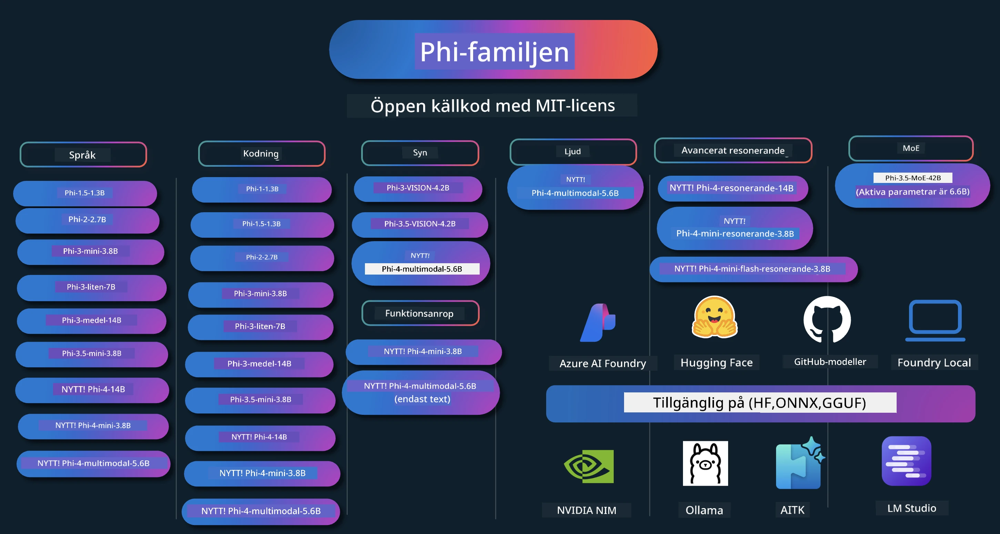

# Phi Cookbook: Praktiska exempel med Microsofts Phi-modeller

[](https://codespaces.new/microsoft/phicookbook)
[](https://vscode.dev/redirect?url=vscode://ms-vscode-remote.remote-containers/cloneInVolume?url=https://github.com/microsoft/phicookbook)

[](https://GitHub.com/microsoft/phicookbook/graphs/contributors/?WT.mc_id=aiml-137032-kinfeylo)
[](https://GitHub.com/microsoft/phicookbook/issues/?WT.mc_id=aiml-137032-kinfeylo)
[](https://GitHub.com/microsoft/phicookbook/pulls/?WT.mc_id=aiml-137032-kinfeylo)
[](http://makeapullrequest.com?WT.mc_id=aiml-137032-kinfeylo)

[](https://GitHub.com/microsoft/phicookbook/watchers/?WT.mc_id=aiml-137032-kinfeylo)
[](https://GitHub.com/microsoft/phicookbook/network/?WT.mc_id=aiml-137032-kinfeylo)
[](https://GitHub.com/microsoft/phicookbook/stargazers/?WT.mc_id=aiml-137032-kinfeylo)

[](https://discord.com/invite/ByRwuEEgH4)

Phi är en serie open source AI-modeller utvecklade av Microsoft.

Phi är för närvarande den mest kraftfulla och kostnadseffektiva lilla språkmodellen (SLM), med mycket bra resultat inom flerspråkighet, resonemang, text-/chattgenerering, kodning, bilder, ljud och andra scenarier.

Du kan distribuera Phi i molnet eller till edge-enheter, och du kan enkelt bygga generativa AI-applikationer med begränsad beräkningskraft.

Följ dessa steg för att komma igång med dessa resurser:
1. **Forka repot**: Klicka på [](https://GitHub.com/microsoft/phicookbook/network/?WT.mc_id=aiml-137032-kinfeylo)
2. **Klona repot**: `git clone https://github.com/microsoft/PhiCookBook.git`
3. [**Gå med i Microsoft AI Discord Community och träffa experter och andra utvecklare**](https://discord.com/invite/ByRwuEEgH4?WT.mc_id=aiml-137032-kinfeylo)



### 🌐 Flerspråkigt stöd

#### Stöds via GitHub Action (Automatiserat & Alltid uppdaterat)

<!-- CO-OP TRANSLATOR LANGUAGES TABLE START -->
[Arabiska](../ar/README.md) | [Bengali](../bn/README.md) | [Bulgariska](../bg/README.md) | [Burmese (Myanmar)](../my/README.md) | [Kinesiska (Förenklad)](../zh-CN/README.md) | [Kinesiska (Traditionell, Hongkong)](../zh-HK/README.md) | [Kinesiska (Traditionell, Macau)](../zh-MO/README.md) | [Kinesiska (Traditionell, Taiwan)](../zh-TW/README.md) | [Kroatiska](../hr/README.md) | [Tjeckiska](../cs/README.md) | [Danska](../da/README.md) | [Nederländska](../nl/README.md) | [Estniska](../et/README.md) | [Finska](../fi/README.md) | [Franska](../fr/README.md) | [Tyska](../de/README.md) | [Grekiska](../el/README.md) | [Hebreiska](../he/README.md) | [Hindi](../hi/README.md) | [Ungerska](../hu/README.md) | [Indonesiska](../id/README.md) | [Italienska](../it/README.md) | [Japanska](../ja/README.md) | [Kannada](../kn/README.md) | [Koreanska](../ko/README.md) | [Litauiska](../lt/README.md) | [Malajiska](../ms/README.md) | [Malayalam](../ml/README.md) | [Marathi](../mr/README.md) | [Nepalesiska](../ne/README.md) | [Nigeriansk Pidgin](../pcm/README.md) | [Norska](../no/README.md) | [Persiska (Farsi)](../fa/README.md) | [Polska](../pl/README.md) | [Portugisiska (Brasilien)](../pt-BR/README.md) | [Portugisiska (Portugal)](../pt-PT/README.md) | [Punjabi (Gurmukhi)](../pa/README.md) | [Rumänska](../ro/README.md) | [Ryska](../ru/README.md) | [Serbiska (Kyrilliska)](../sr/README.md) | [Slovakiska](../sk/README.md) | [Slovenska](../sl/README.md) | [Spanska](../es/README.md) | [Swahili](../sw/README.md) | [Svenska](./README.md) | [Tagalog (Filippinska)](../tl/README.md) | [Tamil](../ta/README.md) | [Telugu](../te/README.md) | [Thailändska](../th/README.md) | [Turkiska](../tr/README.md) | [Ukrainska](../uk/README.md) | [Urdu](../ur/README.md) | [Vietnamesiska](../vi/README.md)

> **Föredrar du att klona lokalt?**
>
> Detta repo innehåller över 50 språköversättningar vilket kraftigt ökar nedladdningsstorleken. För att klona utan översättningar, använd sparsam utcheckning:
>
> **Bash / macOS / Linux:**
> ```bash
> git clone --filter=blob:none --sparse https://github.com/microsoft/PhiCookBook.git
> cd PhiCookBook
> git sparse-checkout set --no-cone '/*' '!translations' '!translated_images'
> ```
>
> **CMD (Windows):**
> ```cmd
> git clone --filter=blob:none --sparse https://github.com/microsoft/PhiCookBook.git
> cd PhiCookBook
> git sparse-checkout set --no-cone "/*" "!translations" "!translated_images"
> ```
>
> Detta ger dig allt du behöver för att slutföra kursen med en mycket snabbare nedladdning.
<!-- CO-OP TRANSLATOR LANGUAGES TABLE END -->

## Innehållsförteckning

- Introduktion
  - [Välkommen till Phi-familjen](./md/01.Introduction/01/01.PhiFamily.md)
  - [Ställa in din miljö](./md/01.Introduction/01/01.EnvironmentSetup.md)
  - [Förståelse av nyckelteknologier](./md/01.Introduction/01/01.Understandingtech.md)
  - [AI-säkerhet för Phi-modeller](./md/01.Introduction/01/01.AISafety.md)
  - [Phi maskinvarustöd](./md/01.Introduction/01/01.Hardwaresupport.md)
  - [Phi-modeller & tillgänglighet över plattformar](./md/01.Introduction/01/01.Edgeandcloud.md)
  - [Använda Guidance-ai och Phi](./md/01.Introduction/01/01.Guidance.md)
  - [GitHub Marketplace-modeller](https://github.com/marketplace/models)
  - [Azure AI Model Catalog](https://ai.azure.com)

- Inferens Phi i olika miljöer
    -  [Hugging face](./md/01.Introduction/02/01.HF.md)
    -  [GitHub-modeller](./md/01.Introduction/02/02.GitHubModel.md)
    -  [Microsoft Foundry Model Catalog](./md/01.Introduction/02/03.AzureAIFoundry.md)
    -  [Ollama](./md/01.Introduction/02/04.Ollama.md)
    -  [AI Toolkit VSCode (AITK)](./md/01.Introduction/02/05.AITK.md)
    -  [NVIDIA NIM](./md/01.Introduction/02/06.NVIDIA.md)
    -  [Foundry Local](./md/01.Introduction/02/07.FoundryLocal.md)

- Inferens Phi-familjen
    - [Inferens Phi i iOS](./md/01.Introduction/03/iOS_Inference.md)
    - [Inferens Phi i Android](./md/01.Introduction/03/Android_Inference.md)
    - [Inferens Phi i Jetson](./md/01.Introduction/03/Jetson_Inference.md)
    - [Inferens Phi i AI PC](./md/01.Introduction/03/AIPC_Inference.md)
    - [Inferens Phi med Apple MLX Framework](./md/01.Introduction/03/MLX_Inference.md)
    - [Inferens Phi i lokal server](./md/01.Introduction/03/Local_Server_Inference.md)
    - [Inferens Phi i fjärrserver med AI Toolkit](./md/01.Introduction/03/Remote_Interence.md)
    - [Inferens Phi med Rust](./md/01.Introduction/03/Rust_Inference.md)
    - [Inferens Phi--Vision lokalt](./md/01.Introduction/03/Vision_Inference.md)
    - [Inferens Phi med Kaito AKS, Azure Containers (officiellt stöd)](./md/01.Introduction/03/Kaito_Inference.md)
-  [Kvantifiering av Phi-familjen](./md/01.Introduction/04/QuantifyingPhi.md)
    - [Kvantifiera Phi-3.5 / 4 med llama.cpp](./md/01.Introduction/04/UsingLlamacppQuantifyingPhi.md)
    - [Kvantifiera Phi-3.5 / 4 med Generative AI extension för onnxruntime](./md/01.Introduction/04/UsingORTGenAIQuantifyingPhi.md)
    - [Kvantifiera Phi-3.5 / 4 med Intel OpenVINO](./md/01.Introduction/04/UsingIntelOpenVINOQuantifyingPhi.md)
    - [Kvantifiera Phi-3.5 / 4 med Apple MLX Framework](./md/01.Introduction/04/UsingAppleMLXQuantifyingPhi.md)

- Utvärdering av Phi
    - [Ansvarsfull AI](./md/01.Introduction/05/ResponsibleAI.md)
    - [Microsoft Foundry för utvärdering](./md/01.Introduction/05/AIFoundry.md)
    - [Använda Promptflow för utvärdering](./md/01.Introduction/05/Promptflow.md)
 
- RAG med Azure AI Search
    - [Hur man använder Phi-4-mini och Phi-4-multimodal (RAG) med Azure AI Search](https://github.com/microsoft/PhiCookBook/blob/main/code/06.E2E/E2E_Phi-4-RAG-Azure-AI-Search.ipynb)

- Phi applikationsutveckling exempel
  - Text- & chattapplikationer
    - Phi-4-exempel 🆕
      - [📓] [Chatta med Phi-4-mini ONNX-modell](./md/02.Application/01.TextAndChat/Phi4/ChatWithPhi4ONNX/README.md)
      - [Chatta med Phi-4 lokal ONNX-modell .NET](../../md/04.HOL/dotnet/src/LabsPhi4-Chat-01OnnxRuntime)
      - [Chat .NET-konsolapp med Phi-4 ONNX via Semantic Kernel](../../md/04.HOL/dotnet/src/LabsPhi4-Chat-02SK)
    - Phi-3 / 3.5-exempel
      - [Lokal chatbot i webbläsaren med Phi3, ONNX Runtime Web och WebGPU](https://github.com/microsoft/onnxruntime-inference-examples/tree/main/js/chat)
      - [OpenVino Chatt](./md/02.Application/01.TextAndChat/Phi3/E2E_OpenVino_Chat.md)
      - [Multi Model - Interaktiv Phi-3-mini och OpenAI Whisper](./md/02.Application/01.TextAndChat/Phi3/E2E_Phi-3-mini_with_whisper.md)
      - [MLFlow - Skapa ett wrapper och använd Phi-3 med MLFlow](./md//02.Application/01.TextAndChat/Phi3/E2E_Phi-3-MLflow.md)
      - [Modelloptimering - Hur man optimerar Phi-3-minimodell för ONNX Runtime Web med Olive](https://github.com/microsoft/Olive/tree/main/examples/phi3)
      - [WinUI3 App med Phi-3 mini-4k-instruct-onnx](https://github.com/microsoft/Phi3-Chat-WinUI3-Sample/)
      -[WinUI3 Multi Model AI Powered Notes App Exempel](https://github.com/microsoft/ai-powered-notes-winui3-sample)
      - [Finjustera och integrera anpassade Phi-3-modeller med Prompt flow](./md/02.Application/01.TextAndChat/Phi3/E2E_Phi-3-FineTuning_PromptFlow_Integration.md)
      - [Finjustera och integrera anpassade Phi-3-modeller med Prompt flow i Microsoft Foundry](./md/02.Application/01.TextAndChat/Phi3/E2E_Phi-3-FineTuning_PromptFlow_Integration_AIFoundry.md)
      - [Utvärdera den finjusterade Phi-3 / Phi-3.5-modellen i Microsoft Foundry med fokus på Microsofts principer för ansvarsfull AI](./md/02.Application/01.TextAndChat/Phi3/E2E_Phi-3-Evaluation_AIFoundry.md)
      - [📓] [Phi-3.5-mini-instruct språkprediktionsprov (kinesiska/engelska)](./md/02.Application/01.TextAndChat/Phi3/phi3-instruct-demo.ipynb)
      - [Phi-3.5-Instruct WebGPU RAG Chattbot](./md/02.Application/01.TextAndChat/Phi3/WebGPUWithPhi35Readme.md)
      - [Använda Windows GPU för att skapa Prompt flow-lösning med Phi-3.5-Instruct ONNX](./md/02.Application/01.TextAndChat/Phi3/UsingPromptFlowWithONNX.md)
      - [Använda Microsoft Phi-3.5 tflite för att skapa Android-app](./md/02.Application/01.TextAndChat/Phi3/UsingPhi35TFLiteCreateAndroidApp.md)
      - [Q&A .NET-exempel som använder lokal ONNX Phi-3-modell med Microsoft.ML.OnnxRuntime](../../md/04.HOL/dotnet/src/LabsPhi301)
      - [Konsolchatt .NET-app med Semantic Kernel och Phi-3](../../md/04.HOL/dotnet/src/LabsPhi302)

  - Azure AI Inference SDK Kodbaserade Exempel 
    - Phi-4 Exempel 🆕
      - [📓] [Generera projektkod med Phi-4-multimodal](./md/02.Application/02.Code/Phi4/GenProjectCode/README.md)
    - Phi-3 / 3.5 Exempel
      - [Bygg din egen Visual Studio Code GitHub Copilot Chatt med Microsoft Phi-3-familjen](./md/02.Application/02.Code/Phi3/VSCodeExt/README.md)
      - [Skapa din egen Visual Studio Code Chatt Copilot Agent med Phi-3.5 från GitHub-modeller](/md/02.Application/02.Code/Phi3/CreateVSCodeChatAgentWithGitHubModels.md)

  - Avancerade Resonemangsexempel
    - Phi-4 Exempel 🆕
      - [📓] [Phi-4-mini-resonemang eller Phi-4-resonemang Exempel](./md/02.Application/03.AdvancedReasoning/Phi4/AdvancedResoningPhi4mini/README.md)
      - [📓] [Finjustera Phi-4-mini-resonemang med Microsoft Olive](./md/02.Application/03.AdvancedReasoning/Phi4/AdvancedResoningPhi4mini/olive_ft_phi_4_reasoning_with_medicaldata.ipynb)
      - [📓] [Finjustera Phi-4-mini-resonemang med Apple MLX](./md/02.Application/03.AdvancedReasoning/Phi4/AdvancedResoningPhi4mini/mlx_ft_phi_4_reasoning_with_medicaldata.ipynb)
      - [📓] [Phi-4-mini-resonemang med GitHub-modeller](./md/02.Application/02.Code/Phi4r/github_models_inference.ipynb)
      - [📓] [Phi-4-mini-resonemang med Microsoft Foundry-modeller](./md/02.Application/02.Code/Phi4r/azure_models_inference.ipynb)
  - Demos
      - [Phi-4-mini demos hostade på Hugging Face Spaces](https://huggingface.co/spaces/microsoft/phi-4-mini?WT.mc_id=aiml-137032-kinfeylo)
      - [Phi-4-multimodal demos hostade på Hugginge Face Spaces](https://huggingface.co/spaces/microsoft/phi-4-multimodal?WT.mc_id=aiml-137032-kinfeylo)
  - Vision Exempel
    - Phi-4 Exempel 🆕
      - [📓] [Använd Phi-4-multimodal för att läsa bilder och generera kod](./md/02.Application/04.Vision/Phi4/CreateFrontend/README.md) 
    - Phi-3 / 3.5 Exempel
      -  [📓][Phi-3-vision-Bildtext till text](./md/02.Application/04.Vision/Phi3/E2E_Phi-3-vision-image-text-to-text-online-endpoint.ipynb)
      - [Phi-3-vision-ONNX](https://onnxruntime.ai/docs/genai/tutorials/phi3-v.html)
      - [📓][Phi-3-vision CLIP Inbäddning](./md/02.Application/04.Vision/Phi3/E2E_Phi-3-vision-image-text-to-text-online-endpoint.ipynb)
      - [DEMO: Phi-3 Återvinning](https://github.com/jennifermarsman/PhiRecycling/)
      - [Phi-3-vision - Visuell språkassistent - med Phi3-Vision och OpenVINO](https://docs.openvino.ai/nightly/notebooks/phi-3-vision-with-output.html)
      - [Phi-3 Vision Nvidia NIM](./md/02.Application/04.Vision/Phi3/E2E_Nvidia_NIM_Vision.md)
      - [Phi-3 Vision OpenVino](./md/02.Application/04.Vision/Phi3/E2E_OpenVino_Phi3Vision.md)
      - [📓][Phi-3.5 Vision multi-frame eller multi-bild exempel](./md/02.Application/04.Vision/Phi3/phi3-vision-demo.ipynb)
      - [Phi-3 Vision Lokal ONNX Modell med Microsoft.ML.OnnxRuntime .NET](../../md/04.HOL/dotnet/src/LabsPhi303)
      - [Menybaserad Phi-3 Vision Lokal ONNX Modell med Microsoft.ML.OnnxRuntime .NET](../../md/04.HOL/dotnet/src/LabsPhi304)

  - Matte Exempel
    -  Phi-4-Mini-Flash-Reasoning-Instruct Exempel 🆕 [Matte-demo med Phi-4-Mini-Flash-Reasoning-Instruct](./md/02.Application/09.Math/MathDemo.ipynb)

  - Ljud Exempel
    - Phi-4 Exempel 🆕
      - [📓] [Extrahera ljudutskrifter med Phi-4-multimodal](./md/02.Application/05.Audio/Phi4/Transciption/README.md)
      - [📓] [Phi-4-multimodal Ljudexempel](./md/02.Application/05.Audio/Phi4/Siri/demo.ipynb)
      - [📓] [Phi-4-multimodal Talöversättningsexempel](./md/02.Application/05.Audio/Phi4/Translate/demo.ipynb)
      - [.NET konsolapplikation som använder Phi-4-multimodal Ljud för att analysera en ljudfil och generera utskrift](../../md/04.HOL/dotnet/src/LabsPhi4-MultiModal-02Audio)

  - MOE Exempel
    - Phi-3 / 3.5 Exempel
      - [📓] [Phi-3.5 Mixture of Experts Models (MoEs) Social Media-exempel](./md/02.Application/06.MoE/Phi3/phi3_moe_demo.ipynb)
      - [📓] [Bygga en Retrieval-Augmented Generation (RAG) Pipeline med NVIDIA NIM Phi-3 MOE, Azure AI Search och LlamaIndex](./md/02.Application/06.MoE/Phi3/azure-ai-search-nvidia-rag.ipynb)
      - 
  - Funktionsanrops Exempel
    - Phi-4 Exempel 🆕
      -  [📓] [Använda Funktionsanrop med Phi-4-mini](./md/02.Application/07.FunctionCalling/Phi4/FunctionCallingBasic/README.md)
      -  [📓] [Använda Funktionsanrop för att skapa multi-agenter med Phi-4-mini](./md/02.Application/07.FunctionCalling/Phi4/Multiagents/Phi_4_mini_multiagent.ipynb)
      -  [📓] [Använda Funktionsanrop med Ollama](./md/02.Application/07.FunctionCalling/Phi4/Ollama/ollama_functioncalling.ipynb)
      -  [📓] [Använda Funktionsanrop med ONNX](./md/02.Application/07.FunctionCalling/Phi4/ONNX/onnx_parallel_functioncalling.ipynb)
  - Multimodala Blandningsexempel
    - Phi-4 Exempel 🆕
      -  [📓] [Använda Phi-4-multimodal som teknikjournalist](./md/02.Application/08.Multimodel/Phi4/TechJournalist/phi_4_mm_audio_text_publish_news.ipynb)
      - [.NET konsolapplikation som använder Phi-4-multimodal för att analysera bilder](../../md/04.HOL/dotnet/src/LabsPhi4-MultiModal-01Images)

- Finjustering av Phi Exempel
  - [Finjusteringsscenarier](./md/03.FineTuning/FineTuning_Scenarios.md)
  - [Finjustering vs RAG](./md/03.FineTuning/FineTuning_vs_RAG.md)
  - [Finjustering Låt Phi-3 bli en expert inom industrin](./md/03.FineTuning/LetPhi3gotoIndustriy.md)
  - [Finjustering Phi-3 med AI Toolkit för VS Code](./md/03.FineTuning/Finetuning_VSCodeaitoolkit.md)
  - [Finjustering Phi-3 med Azure Machine Learning Service](./md/03.FineTuning/Introduce_AzureML.md)
  - [Finjustering Phi-3 med Lora](./md/03.FineTuning/FineTuning_Lora.md)
  - [Finjustering Phi-3 med QLora](./md/03.FineTuning/FineTuning_Qlora.md)
  - [Finjustering Phi-3 med Microsoft Foundry](./md/03.FineTuning/FineTuning_AIFoundry.md)
  - [Finjustering Phi-3 med Azure ML CLI/SDK](./md/03.FineTuning/FineTuning_MLSDK.md)
  - [Finjustering med Microsoft Olive](./md/03.FineTuning/FineTuning_MicrosoftOlive.md)
  - [Finjustering med Microsoft Olive Hands-On Lab](./md/03.FineTuning/olive-lab/readme.md)
  - [Finjustering Phi-3-vision med Weights and Bias](./md/03.FineTuning/FineTuning_Phi-3-visionWandB.md)
  - [Finjustering Phi-3 med Apple MLX Framework](./md/03.FineTuning/FineTuning_MLX.md)
  - [Finjustering Phi-3-vision (officiellt stöd)](./md/03.FineTuning/FineTuning_Vision.md)
  - [Finjustering Phi-3 med Kaito AKS, Azure Containers (officiellt stöd)](./md/03.FineTuning/FineTuning_Kaito.md)
  - [Finjustering Phi-3 och 3.5 Vision](https://github.com/2U1/Phi3-Vision-Finetune)

- Hands on Lab
  - [Utforska banbrytande modeller: LLMs, SLMs, lokal utveckling med mera](https://github.com/microsoft/aitour-exploring-cutting-edge-models)
  - [Lås upp NLP-potential: Finjustering med Microsoft Olive](https://github.com/azure/Ignite_FineTuning_workshop)
- Akademiska forskningsartiklar och publikationer  
  - [Textbooks Are All You Need II: phi-1.5 teknisk rapport](https://arxiv.org/abs/2309.05463)  
  - [Phi-3 teknisk rapport: En mycket kapabel språkmodell lokalt på din telefon](https://arxiv.org/abs/2404.14219)  
  - [Phi-4 teknisk rapport](https://arxiv.org/abs/2412.08905)  
  - [Phi-4-Mini teknisk rapport: Kompakta men kraftfulla multimodala språkmodeller via Mixture-of-LoRAs](https://arxiv.org/abs/2503.01743)  
  - [Optimering av små språkmodeller för funktionanrop i fordon](https://arxiv.org/abs/2501.02342)  
  - [(WhyPHI) Finjustering av PHI-3 för flervalssvarsfrågor: Metodik, resultat och utmaningar](https://arxiv.org/abs/2501.01588)  
  - [Phi-4-reasoning teknisk rapport](https://www.microsoft.com/en-us/research/wp-content/uploads/2025/04/phi_4_reasoning.pdf)  
  - [Phi-4-mini-reasoning teknisk rapport](https://huggingface.co/microsoft/Phi-4-mini-reasoning/blob/main/Phi-4-Mini-Reasoning.pdf)  

## Använda Phi Modeller

### Phi på Microsoft Foundry

Du kan lära dig hur du använder Microsoft Phi och hur du bygger end-to-end-lösningar på dina olika hårdvaruenheter. För att uppleva Phi själv, börja med att leka med modellerna och anpassa Phi för dina scenarier genom att använda [Microsoft Foundry Azure AI Model Catalog](https://aka.ms/phi3-azure-ai). Du kan lära dig mer i Komma igång med [Microsoft Foundry](/md/02.QuickStart/AzureAIFoundry_QuickStart.md)

**Playground**  
Varje modell har en dedikerad playground för att testa modellen [Azure AI Playground](https://aka.ms/try-phi3).

### Phi på GitHub Modeller

Du kan lära dig hur du använder Microsoft Phi och hur du bygger end-to-end-lösningar på dina olika hårdvaruenheter. För att uppleva Phi själv, börja med att leka med modellen och anpassa Phi för dina scenarier genom att använda [GitHub Model Catalog](https://github.com/marketplace/models?WT.mc_id=aiml-137032-kinfeylo). Du kan lära dig mer i Komma igång med [GitHub Model Catalog](/md/02.QuickStart/GitHubModel_QuickStart.md)

**Playground**  
Varje modell har en dedikerad [playground för att testa modellen](/md/02.QuickStart/GitHubModel_QuickStart.md).

### Phi på Hugging Face

Du kan också hitta modellen på [Hugging Face](https://huggingface.co/microsoft)

**Playground**  
[Hugging Chat playground](https://huggingface.co/chat/models/microsoft/Phi-3-mini-4k-instruct)

## 🎒 Andra kurser

Vårt team producerar även andra kurser! Kolla in:

<!-- CO-OP TRANSLATOR OTHER COURSES START -->
### LangChain  
[](https://aka.ms/langchain4j-for-beginners)  
[](https://aka.ms/langchainjs-for-beginners?WT.mc_id=m365-94501-dwahlin)  
[](https://github.com/microsoft/langchain-for-beginners?WT.mc_id=m365-94501-dwahlin)  
---

### Azure / Edge / MCP / Agenter  
[](https://github.com/microsoft/AZD-for-beginners?WT.mc_id=academic-105485-koreyst)  
[](https://github.com/microsoft/edgeai-for-beginners?WT.mc_id=academic-105485-koreyst)  
[](https://github.com/microsoft/mcp-for-beginners?WT.mc_id=academic-105485-koreyst)  
[](https://github.com/microsoft/ai-agents-for-beginners?WT.mc_id=academic-105485-koreyst)  

---

### Generativ AI-serie  
[](https://github.com/microsoft/generative-ai-for-beginners?WT.mc_id=academic-105485-koreyst)  
[-9333EA?style=for-the-badge&labelColor=E5E7EB&color=9333EA)](https://github.com/microsoft/Generative-AI-for-beginners-dotnet?WT.mc_id=academic-105485-koreyst)  
[-C084FC?style=for-the-badge&labelColor=E5E7EB&color=C084FC)](https://github.com/microsoft/generative-ai-for-beginners-java?WT.mc_id=academic-105485-koreyst)  
[-E879F9?style=for-the-badge&labelColor=E5E7EB&color=E879F9)](https://github.com/microsoft/generative-ai-with-javascript?WT.mc_id=academic-105485-koreyst)  

---

### Grundläggande lärande  
[](https://aka.ms/ml-beginners?WT.mc_id=academic-105485-koreyst)  
[](https://aka.ms/datascience-beginners?WT.mc_id=academic-105485-koreyst)  
[](https://aka.ms/ai-beginners?WT.mc_id=academic-105485-koreyst)  
[](https://github.com/microsoft/Security-101?WT.mc_id=academic-96948-sayoung)  
[](https://aka.ms/webdev-beginners?WT.mc_id=academic-105485-koreyst)  
[](https://aka.ms/iot-beginners?WT.mc_id=academic-105485-koreyst)  
[](https://github.com/microsoft/xr-development-for-beginners?WT.mc_id=academic-105485-koreyst)  

---

### Copilot-serie  
[](https://aka.ms/GitHubCopilotAI?WT.mc_id=academic-105485-koreyst)  
[](https://github.com/microsoft/mastering-github-copilot-for-dotnet-csharp-developers?WT.mc_id=academic-105485-koreyst)  
[](https://github.com/microsoft/CopilotAdventures?WT.mc_id=academic-105485-koreyst)  
<!-- CO-OP TRANSLATOR OTHER COURSES END -->

## Ansvarsfull AI

Microsoft är engagerade i att hjälpa våra kunder använda våra AI-produkter ansvarsfullt, dela våra erfarenheter och bygga förtroendebaserade partnerskap genom verktyg som Transparency Notes och Impact Assessments. Många av dessa resurser finns på [https://aka.ms/RAI](https://aka.ms/RAI).  
Microsofts syn på ansvarsfull AI grundar sig på våra AI-principer om rättvisa, tillförlitlighet och säkerhet, sekretess och säkerhet, inkludering, transparens och ansvar.

Storskaliga språk-, bild- och talmodeller – som de som används i detta exempel – kan potentiellt bete sig på sätt som är orättvisa, opålitliga eller stötande, vilket i sin tur kan orsaka skada. Vänligen se [Azure OpenAI service Transparency note](https://learn.microsoft.com/legal/cognitive-services/openai/transparency-note?tabs=text) för att bli informerad om risker och begränsningar.

Den rekommenderade metoden för att minska dessa risker är att inkludera ett säkerhetssystem i din arkitektur som kan upptäcka och förhindra skadligt beteende. [Azure AI Content Safety](https://learn.microsoft.com/azure/ai-services/content-safety/overview) erbjuder ett oberoende skyddslager som kan upptäcka skadligt användargenererat och AI-genererat innehåll i applikationer och tjänster. Azure AI Content Safety inkluderar text- och bild-API:er som tillåter dig att upptäcka skadligt material. Inom Microsoft Foundry låter Content Safety-tjänsten dig visa, utforska och prova exempel på kod för att upptäcka skadligt innehåll över olika modaliteter. Följande [kom igång-dokumentation](https://learn.microsoft.com/azure/ai-services/content-safety/quickstart-text?tabs=visual-studio%2Clinux&pivots=programming-language-rest) guidar dig genom att göra förfrågningar till tjänsten.
En annan aspekt att ta hänsyn till är den övergripande prestandan för applikationen. Med multimodala och multimodellsapplikationer avser vi prestanda som att systemet fungerar som du och dina användare förväntar er, inklusive att inte generera skadliga resultat. Det är viktigt att bedöma prestandan för din övergripande applikation med hjälp av [Performance and Quality and Risk and Safety evaluators](https://learn.microsoft.com/azure/ai-studio/concepts/evaluation-metrics-built-in). Du har också möjlighet att skapa och utvärdera med [custom evaluators](https://learn.microsoft.com/azure/ai-studio/how-to/develop/evaluate-sdk#custom-evaluators).

Du kan utvärdera din AI-applikation i din utvecklingsmiljö med hjälp av [Azure AI Evaluation SDK](https://microsoft.github.io/promptflow/index.html). Givet antingen en testdatamängd eller ett mål mäts dina generativa AI-applikationsresultat kvantitativt med inbyggda evaluatorer eller custom evaluators efter eget val. För att komma igång med azure ai evaluation sdk för att utvärdera ditt system kan du följa [quickstart guide](https://learn.microsoft.com/azure/ai-studio/how-to/develop/flow-evaluate-sdk). När du har kört en utvärderingskörning kan du [visualisera resultaten i Microsoft Foundry](https://learn.microsoft.com/azure/ai-studio/how-to/evaluate-flow-results).

## Varumärken

Detta projekt kan innehålla varumärken eller logotyper för projekt, produkter eller tjänster. Auktoriserad användning av Microsofts varumärken eller logotyper är föremål för och måste följa [Microsofts Trademark & Brand Guidelines](https://www.microsoft.com/legal/intellectualproperty/trademarks/usage/general).
Användning av Microsofts varumärken eller logotyper i modifierade versioner av detta projekt får inte orsaka förvirring eller antyda Microsofts sponsring. All användning av tredjeparts varumärken eller logotyper omfattas av dessa tredjeparts policys.

## Få hjälp

Om du kör fast eller har några frågor om att bygga AI-appar, gå med i:

[](https://aka.ms/foundry/discord)

Om du har produktfeedback eller fel under byggandet, besök:

[](https://aka.ms/foundry/forum)

---

<!-- CO-OP TRANSLATOR DISCLAIMER START -->
**Ansvarsfriskrivning**:
Detta dokument har översatts med hjälp av AI-översättningstjänsten [Co-op Translator](https://github.com/Azure/co-op-translator). Även om vi strävar efter noggrannhet, var medveten om att automatiska översättningar kan innehålla fel eller brister. Det ursprungliga dokumentet på dess modersmål bör ses som den auktoritativa källan. För kritisk information rekommenderas professionell mänsklig översättning. Vi ansvarar inte för några missförstånd eller feltolkningar som uppstår vid användning av denna översättning.
<!-- CO-OP TRANSLATOR DISCLAIMER END -->