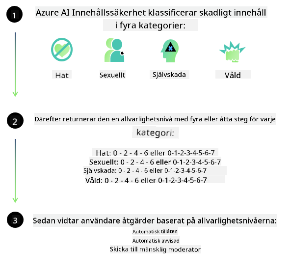
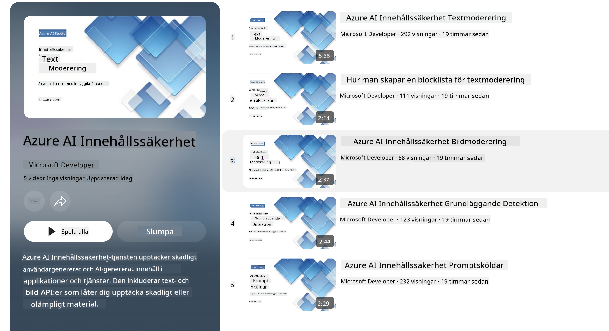

<!--
CO_OP_TRANSLATOR_METADATA:
{
  "original_hash": "c8273672cc57df2be675407a1383aaf0",
  "translation_date": "2025-07-16T17:48:52+00:00",
  "source_file": "md/01.Introduction/01/01.AISafety.md",
  "language_code": "sv"
}
-->
# AI-säkerhet för Phi-modeller  
Phi-familjen av modeller utvecklades i enlighet med [Microsoft Responsible AI Standard](https://query.prod.cms.rt.microsoft.com/cms/api/am/binary/RE5cmFl), som är en företagsomfattande uppsättning krav baserade på följande sex principer: ansvarsskyldighet, transparens, rättvisa, tillförlitlighet och säkerhet, integritet och säkerhet samt inkludering, vilka utgör [Microsofts principer för ansvarsfull AI](https://www.microsoft.com/ai/responsible-ai).

Precis som de tidigare Phi-modellerna användes en mångfacetterad säkerhetsutvärdering och säkerhetspost-träningsmetod, med ytterligare åtgärder för att ta hänsyn till denna versions flerspråkiga kapaciteter. Vår metod för säkerhetsträning och utvärderingar, inklusive testning över flera språk och riskkategorier, beskrivs i [Phi Safety Post-Training Paper](https://arxiv.org/abs/2407.13833). Även om Phi-modellerna drar nytta av denna metod bör utvecklare tillämpa ansvarsfulla AI-bästa praxis, inklusive kartläggning, mätning och hantering av risker kopplade till deras specifika användningsfall samt kulturella och språkliga kontext.

## Bästa praxis

Precis som andra modeller kan Phi-familjen potentiellt uppvisa beteenden som är orättvisa, opålitliga eller stötande.

Några av de begränsande beteenden hos SLM och LLM som du bör vara medveten om inkluderar:

- **Tjänstekvalitet:** Phi-modellerna är främst tränade på engelska texter. Språk andra än engelska kommer att uppleva sämre prestanda. Engelska dialekter med mindre representation i träningsdata kan prestera sämre än standardamerikansk engelska.  
- **Representation av skador & förstärkning av stereotyper:** Dessa modeller kan över- eller underrepresentera grupper av människor, sudda ut representationen av vissa grupper eller förstärka förnedrande eller negativa stereotyper. Trots säkerhetspost-träning kan dessa begränsningar fortfarande finnas kvar på grund av olika nivåer av representation av olika grupper eller förekomsten av exempel på negativa stereotyper i träningsdata som speglar verkliga mönster och samhälleliga fördomar.  
- **Olämpligt eller stötande innehåll:** Dessa modeller kan generera andra typer av olämpligt eller stötande innehåll, vilket kan göra det olämpligt att använda dem i känsliga sammanhang utan ytterligare åtgärder som är specifika för användningsfallet.  
- **Informationspålitlighet:** Språkmodeller kan generera nonsensinnehåll eller fabricera innehåll som kan låta rimligt men som är felaktigt eller inaktuellt.  
- **Begränsad kodomfattning:** Majoriteten av Phi-3:s träningsdata baseras på Python och använder vanliga paket som "typing, math, random, collections, datetime, itertools". Om modellen genererar Python-skript som använder andra paket eller skript i andra språk rekommenderar vi starkt att användare manuellt verifierar all API-användning.

Utvecklare bör tillämpa ansvarsfulla AI-bästa praxis och ansvarar för att säkerställa att ett specifikt användningsfall följer relevanta lagar och regler (t.ex. integritet, handel osv.).

## Ansvarsfulla AI-överväganden

Precis som andra språkmodeller kan Phi-seriens modeller potentiellt uppvisa beteenden som är orättvisa, opålitliga eller stötande. Några av de begränsande beteenden att vara medveten om inkluderar:

**Tjänstekvalitet:** Phi-modellerna är främst tränade på engelska texter. Språk andra än engelska kommer att prestera sämre. Engelska dialekter med mindre representation i träningsdata kan prestera sämre än standardamerikansk engelska.

**Representation av skador & förstärkning av stereotyper:** Dessa modeller kan över- eller underrepresentera grupper av människor, sudda ut representationen av vissa grupper eller förstärka förnedrande eller negativa stereotyper. Trots säkerhetspost-träning kan dessa begränsningar fortfarande finnas kvar på grund av olika nivåer av representation av olika grupper eller förekomsten av exempel på negativa stereotyper i träningsdata som speglar verkliga mönster och samhälleliga fördomar.

**Olämpligt eller stötande innehåll:** Dessa modeller kan generera andra typer av olämpligt eller stötande innehåll, vilket kan göra det olämpligt att använda dem i känsliga sammanhang utan ytterligare åtgärder som är specifika för användningsfallet.  
Informationspålitlighet: Språkmodeller kan generera nonsensinnehåll eller fabricera innehåll som kan låta rimligt men som är felaktigt eller inaktuellt.

**Begränsad kodomfattning:** Majoriteten av Phi-3:s träningsdata baseras på Python och använder vanliga paket som "typing, math, random, collections, datetime, itertools". Om modellen genererar Python-skript som använder andra paket eller skript i andra språk rekommenderar vi starkt att användare manuellt verifierar all API-användning.

Utvecklare bör tillämpa ansvarsfulla AI-bästa praxis och ansvarar för att säkerställa att ett specifikt användningsfall följer relevanta lagar och regler (t.ex. integritet, handel osv.). Viktiga områden att beakta inkluderar:

**Tilldelning:** Modeller kan vara olämpliga för scenarier som kan ha avgörande påverkan på juridisk status eller tilldelning av resurser eller livsmöjligheter (t.ex. bostad, anställning, kredit osv.) utan ytterligare bedömningar och kompletterande avbiasing-tekniker.

**Högrisk-scenarier:** Utvecklare bör bedöma lämpligheten att använda modeller i högrisk-scenarier där orättvisa, opålitliga eller stötande resultat kan vara extremt kostsamma eller leda till skada. Detta inkluderar att ge råd inom känsliga eller expertområden där noggrannhet och tillförlitlighet är avgörande (t.ex. juridisk eller medicinsk rådgivning). Ytterligare skyddsåtgärder bör implementeras på applikationsnivå beroende på distributionskontext.

**Desinformation:** Modeller kan producera felaktig information. Utvecklare bör följa transparensbästa praxis och informera slutanvändare om att de interagerar med ett AI-system. På applikationsnivå kan utvecklare bygga in återkopplingsmekanismer och processer för att förankra svar i användningsfallsspecifik, kontextuell information, en teknik som kallas Retrieval Augmented Generation (RAG).

**Generering av skadligt innehåll:** Utvecklare bör bedöma utdata utifrån deras kontext och använda tillgängliga säkerhetsklassificerare eller anpassade lösningar som är lämpliga för deras användningsfall.

**Missbruk:** Andra former av missbruk som bedrägeri, spam eller produktion av skadlig kod kan vara möjliga, och utvecklare bör säkerställa att deras applikationer inte bryter mot tillämpliga lagar och regler.

### Finjustering och AI-innehållssäkerhet

Efter finjustering av en modell rekommenderar vi starkt att använda [Azure AI Content Safety](https://learn.microsoft.com/azure/ai-services/content-safety/overview) för att övervaka det innehåll som genereras av modellerna, identifiera och blockera potentiella risker, hot och kvalitetsproblem.

[Azure AI Content Safety](https://learn.microsoft.com/azure/ai-services/content-safety/overview) stödjer både text- och bildinnehåll. Det kan distribueras i molnet, i isolerade containrar och på edge-/inbäddade enheter.

## Översikt av Azure AI Content Safety

Azure AI Content Safety är inte en universallösning; den kan anpassas för att stämma överens med företags specifika policyer. Dessutom gör dess flerspråkiga modeller det möjligt att förstå flera språk samtidigt.

- **Azure AI Content Safety**  
- **Microsoft Developer**  
- **5 videor**

Azure AI Content Safety-tjänsten upptäcker skadligt användargenererat och AI-genererat innehåll i applikationer och tjänster. Den inkluderar text- och bild-API:er som gör det möjligt att upptäcka skadligt eller olämpligt material.

[AI Content Safety Playlist](https://www.youtube.com/playlist?list=PLlrxD0HtieHjaQ9bJjyp1T7FeCbmVcPkQ)

**Ansvarsfriskrivning**:  
Detta dokument har översatts med hjälp av AI-översättningstjänsten [Co-op Translator](https://github.com/Azure/co-op-translator). Även om vi strävar efter noggrannhet, vänligen observera att automatiska översättningar kan innehålla fel eller brister. Det ursprungliga dokumentet på dess modersmål bör betraktas som den auktoritativa källan. För kritisk information rekommenderas professionell mänsklig översättning. Vi ansvarar inte för några missförstånd eller feltolkningar som uppstår vid användning av denna översättning.