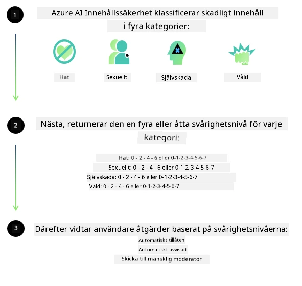

<!--
CO_OP_TRANSLATOR_METADATA:
{
  "original_hash": "839ccc4b3886ef10cfd4e64977f5792d",
  "translation_date": "2026-01-05T12:24:39+00:00",
  "source_file": "md/01.Introduction/01/01.AISafety.md",
  "language_code": "sv"
}
-->
# AI-säkerhet för Phi-modeller
Phi-familjen av modeller utvecklades i enlighet med [Microsoft Responsible AI Standard](https://www.microsoft.com/ai/principles-and-approach#responsible-ai-standard), som är en företagsomfattande uppsättning krav baserade på följande sex principer: ansvarsskyldighet, transparens, rättvisa, tillförlitlighet och säkerhet, integritet och säkerhet samt inkludering, vilka utgör [Microsofts Responsible AI-principer](https://www.microsoft.com/ai/responsible-ai). 

Liksom de tidigare Phi-modellerna antogs en mångfacetterad säkerhetsutvärdering och säkerhetsåtgärder efter träning, med ytterligare åtgärder för att ta hänsyn till flerspråkiga möjligheter i denna version. Vår metod för säkerhetsträning och utvärderingar, inklusive testning över flera språk och riskkategorier, beskrivs i [Phi Safety Post-Training Paper](https://arxiv.org/abs/2407.13833). Även om Phi-modellerna drar nytta av denna metod bör utvecklare tillämpa bästa praxis för ansvarsfull AI, inklusive kartläggning, mätning och mildrande av risker kopplade till deras specifika användningsfall och kulturella samt språkliga kontext.

## Bästa praxis

Liksom andra modeller kan Phi-familjen potentiellt bete sig på sätt som är orättvisa, opålitliga eller stötande.

Några av de begränsande beteendena hos SLM och LLM som du bör känna till inkluderar:

- **Kvalitet på tjänsten:** Phi-modellerna tränas främst på engelska texter. Andra språk än engelska kommer att ha sämre prestanda. Engelska språkvarianter som är mindre representerade i träningsdata kan prestera sämre än standardamerikansk engelska.
- **Representation av skador och förstärkning av stereotyper:** Dessa modeller kan över- eller underrepresentera grupper av människor, utplåna representationen av vissa grupper eller förstärka förnedrande eller negativa stereotyper. Trots säkerhetsåtgärder efter träning kan dessa begränsningar fortfarande finnas kvar på grund av olika nivåer av representation av olika grupper eller förekomsten av exempel på negativa stereotyper i träningsdata som speglar verkliga mönster och samhälleliga bias.
- **Olämligt eller stötande innehåll:** Dessa modeller kan producera andra typer av olämpligt eller stötande innehåll, vilket kan göra det olämpligt att använda dem i känsliga sammanhang utan ytterligare mildrande åtgärder som är specifika för användningsfallet.
- **Informationspålitlighet:** Språkmodeller kan generera osammanhängande innehåll eller fabricera innehåll som kan låta rimligt men som är felaktigt eller föråldrat.
- **Begränsad kodkapacitet:** Majoriteten av Phi-3:s träningsdata baseras på Python och använder vanliga paket som "typing, math, random, collections, datetime, itertools". Om modellen genererar Python-skript som använder andra paket eller skript i andra språk rekommenderar vi starkt att användare manuellt verifierar all API-användning.

Utvecklare bör tillämpa bästa praxis för ansvarsfull AI och ansvarar för att säkerställa att ett specifikt användningsfall följer relevanta lagar och regler (t.ex. integritet, handel osv.). 

## Överväganden för ansvarsfull AI

Liksom andra språkmodeller kan Phi-seriens modeller potentiellt bete sig på sätt som är orättvisa, opålitliga eller stötande. Några av de begränsande beteendena att vara medveten om inkluderar:

**Kvalitet på tjänsten:** Phi-modellerna tränas främst på engelska texter. Andra språk än engelska kommer att prestera sämre. Engelska språkvarianter med mindre representation i träningsdata kan prestera sämre än standardamerikansk engelska.

**Representation av skador och förstärkning av stereotyper:** Dessa modeller kan över- eller underrepresentera grupper av människor, utplåna representationen av vissa grupper eller förstärka förnedrande eller negativa stereotyper. Trots säkerhetsåtgärder efter träning kan dessa begränsningar fortfarande finnas kvar på grund av olika nivåer av representation av olika grupper eller förekomsten av exempel på negativa stereotyper i träningsdata som speglar verkliga mönster och samhälleliga bias.

**Olämligt eller stötande innehåll:** Dessa modeller kan producera andra typer av olämpligt eller stötande innehåll, vilket kan göra det olämpligt att använda dem i känsliga sammanhang utan ytterligare mildrande åtgärder som är specifika för användningsfallet.
Informationspålitlighet: Språkmodeller kan generera osammanhängande innehåll eller fabricera innehåll som kan låta rimligt men är felaktigt eller föråldrat.

**Begränsad kodkapacitet:** Majoriteten av Phi-3:s träningsdata baseras på Python och använder vanliga paket som "typing, math, random, collections, datetime, itertools". Om modellen genererar Python-skript som använder andra paket eller skript i andra språk rekommenderar vi starkt att användare manuellt verifierar all API-användning.

Utvecklare bör tillämpa bästa praxis för ansvarsfull AI och ansvarar för att säkerställa att ett specifikt användningsfall följer relevanta lagar och regler (t.ex. integritet, handel osv.). Viktiga områden för övervägande inkluderar:

**Allokering:** Modeller kan vara olämpliga för scenarier som kan ha en betydande påverkan på rättslig status eller allokering av resurser eller livschanser (t.ex. bostad, sysselsättning, kredit osv.) utan ytterligare bedömningar och extra metoder för att minska bias.

**Högrisk-scenarier:** Utvecklare bör bedöma lämpligheten av att använda modeller i högrisk-scenarier där orättvisa, opålitliga eller stötande resultat kan vara extremt kostsamma eller leda till skada. Detta inkluderar att ge råd i känsliga eller expertområden där noggrannhet och tillförlitlighet är kritiska (t.ex. juridiska eller hälsorelaterade råd). Ytterligare skyddsåtgärder bör implementeras på applikationsnivå enligt distributionskontexten.

**Desinformation:** Modeller kan producera felaktig information. Utvecklare bör följa bästa praxis för transparens och informera slutanvändare om att de interagerar med ett AI-system. På applikationsnivå kan utvecklare bygga in feedbackmekanismer och processer för att förankra svar i användarspecifik, kontextuell information, en teknik känd som Retrieval Augmented Generation (RAG).

**Generering av skadligt innehåll:** Utvecklare bör bedöma resultat beroende på kontext och använda tillgängliga säkerhetsklassificerare eller anpassade lösningar som passar deras användningsfall.

**Missbruk:** Andra former av missbruk som bedrägeri, spam eller produktion av skadlig programvara kan vara möjliga, och utvecklare bör säkerställa att deras applikationer inte bryter mot tillämpliga lagar och regler.

### Finjustering och AI-innehållssäkerhet

Efter att ha finjusterat en modell rekommenderar vi starkt att använda [Azure AI Content Safety](https://learn.microsoft.com/azure/ai-services/content-safety/overview) för att övervaka innehåll genererat av modellerna, identifiera och blockera potentiella risker, hot och kvalitetsproblem.

[Azure AI Content Safety](https://learn.microsoft.com/azure/ai-services/content-safety/overview) stödjer både text- och bildinnehåll. Det kan distribueras i molnet, i separata containrar och på edge-/inbäddade enheter.

## Översikt av Azure AI Content Safety

Azure AI Content Safety är inte en universallösning; den kan anpassas för att överensstämma med företags specifika policyer. Dessutom möjliggör dess flerspråkiga modeller att den kan förstå flera språk samtidigt.

- **Azure AI Content Safety**
- **Microsoft Developer**
- **5 videor**

Tjänsten Azure AI Content Safety upptäcker skadligt användargenererat och AI-genererat innehåll i applikationer och tjänster. Den inkluderar text- och bild-API:er som låter dig upptäcka skadligt eller olämpligt material.

[AI Content Safety Playlist](https://www.youtube.com/playlist?list=PLlrxD0HtieHjaQ9bJjyp1T7FeCbmVcPkQ)

---

<!-- CO-OP TRANSLATOR DISCLAIMER START -->
**Ansvarsfriskrivning**:
Detta dokument har översatts med hjälp av AI-översättningstjänsten [Co-op Translator](https://github.com/Azure/co-op-translator). Även om vi strävar efter noggrannhet, bör du vara medveten om att automatiska översättningar kan innehålla fel eller unøjaktigheter. Det ursprungliga dokumentet på dess modersmål bör betraktas som den auktoritativa källan. För kritisk information rekommenderas professionell mänsklig översättning. Vi ansvarar inte för några missförstånd eller feltolkningar som uppstår vid användning av denna översättning.
<!-- CO-OP TRANSLATOR DISCLAIMER END -->