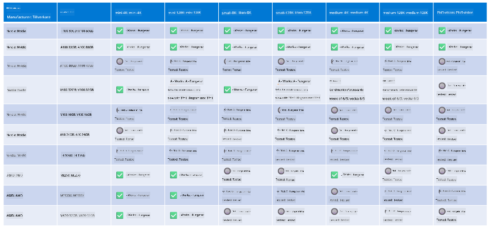

<!--
CO_OP_TRANSLATOR_METADATA:
{
  "original_hash": "8cdc17ce0f10535da30b53d23fe1a795",
  "translation_date": "2025-07-16T18:25:29+00:00",
  "source_file": "md/01.Introduction/01/01.Hardwaresupport.md",
  "language_code": "sv"
}
-->
# Phi Hårdvarustöd

Microsoft Phi har optimerats för ONNX Runtime och stöder Windows DirectML. Det fungerar bra på olika typer av hårdvara, inklusive GPU:er, CPU:er och till och med mobila enheter.

## Enhetshårdvara  
Specifikt inkluderar den stödda hårdvaran:

- GPU SKU: RTX 4090 (DirectML)
- GPU SKU: 1 A100 80GB (CUDA)
- CPU SKU: Standard F64s v2 (64 vCPU:er, 128 GiB minne)

## Mobil SKU

- Android - Samsung Galaxy S21
- Apple iPhone 14 eller senare med A16/A17-processor

## Phi Hårdvaruspecifikation

- Minimikonfiguration krävs.
- Windows: DirectX 12-kompatibel GPU och minst 4 GB sammanlagt RAM

CUDA: NVIDIA GPU med Compute Capability >= 7.02



## Köra onnxruntime på flera GPU:er

De Phi ONNX-modeller som finns tillgängliga idag är endast för 1 GPU. Det är möjligt att stödja multi-GPU för Phi-modeller, men ORT med 2 GPU:er garanterar inte att det ger högre genomströmning jämfört med 2 instanser av ORT. Se [ONNX Runtime](https://onnxruntime.ai/) för de senaste uppdateringarna.

På [Build 2024 med GenAI ONNX Team](https://youtu.be/WLW4SE8M9i8?si=EtG04UwDvcjunyfC) meddelades att de har aktiverat multi-instans istället för multi-GPU för Phi-modeller.

För närvarande kan du köra en onnxruntime- eller onnxruntime-genai-instans med miljövariabeln CUDA_VISIBLE_DEVICES på detta sätt.

```Python
CUDA_VISIBLE_DEVICES=0 python infer.py
CUDA_VISIBLE_DEVICES=1 python infer.py
```

Utforska gärna Phi vidare i [Azure AI Foundry](https://ai.azure.com)

**Ansvarsfriskrivning**:  
Detta dokument har översatts med hjälp av AI-översättningstjänsten [Co-op Translator](https://github.com/Azure/co-op-translator). Även om vi strävar efter noggrannhet, vänligen observera att automatiska översättningar kan innehålla fel eller brister. Det ursprungliga dokumentet på dess modersmål bör betraktas som den auktoritativa källan. För kritisk information rekommenderas professionell mänsklig översättning. Vi ansvarar inte för några missförstånd eller feltolkningar som uppstår vid användning av denna översättning.