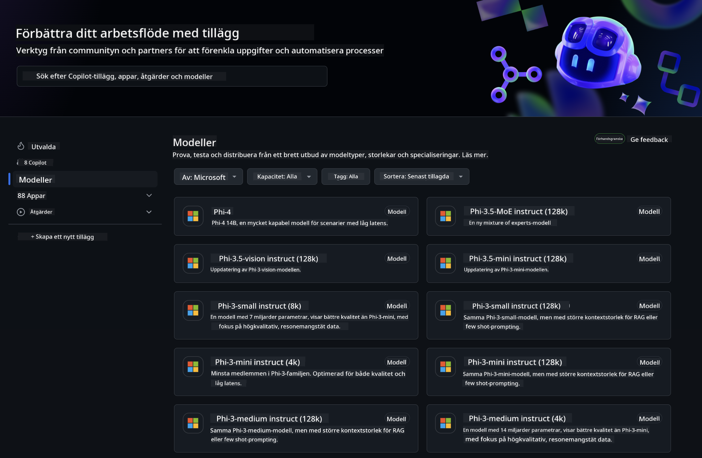
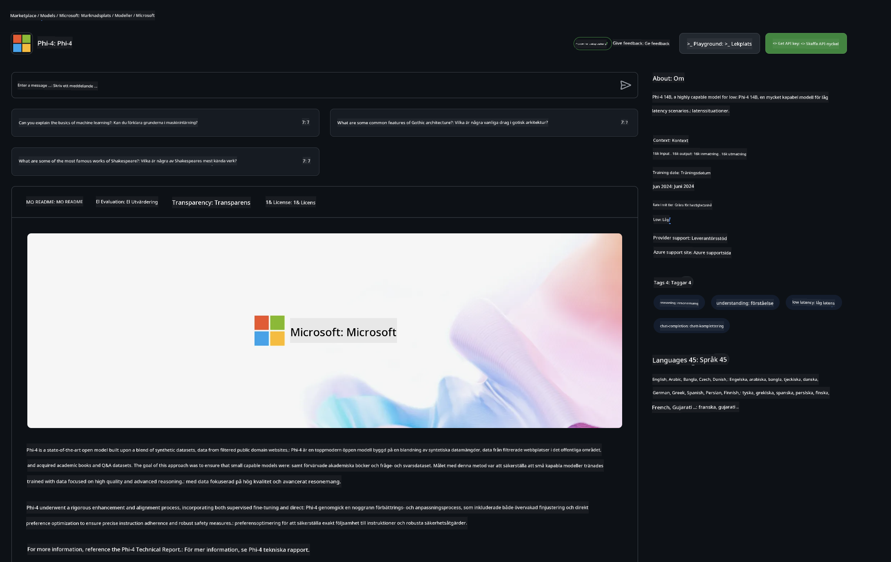

<!--
CO_OP_TRANSLATOR_METADATA:
{
  "original_hash": "fb67a08b9fc911a10ed58081fadef416",
  "translation_date": "2025-07-16T19:01:36+00:00",
  "source_file": "md/01.Introduction/02/02.GitHubModel.md",
  "language_code": "sv"
}
-->
## Phi-familjen i GitHub Models

Välkommen till [GitHub Models](https://github.com/marketplace/models)! Vi har allt igång och redo för dig att utforska AI-modeller som är hostade på Azure AI.



För mer information om modellerna som finns tillgängliga på GitHub Models, kolla in [GitHub Model Marketplace](https://github.com/marketplace/models)

## Tillgängliga modeller

Varje modell har en egen playground och exempel på kod


### Phi-familjen i GitHub Model Catalog

- [Phi-4](https://github.com/marketplace/models/azureml/Phi-4)

- [Phi-3.5-MoE instruct (128k)](https://github.com/marketplace/models/azureml/Phi-3-5-MoE-instruct)

- [Phi-3.5-vision instruct (128k)](https://github.com/marketplace/models/azureml/Phi-3-5-vision-instruct)

- [Phi-3.5-mini instruct (128k)](https://github.com/marketplace/models/azureml/Phi-3-5-mini-instruct)

- [Phi-3-Medium-128k-Instruct](https://github.com/marketplace/models/azureml/Phi-3-medium-128k-instruct)

- [Phi-3-medium-4k-instruct](https://github.com/marketplace/models/azureml/Phi-3-medium-4k-instruct)

- [Phi-3-mini-128k-instruct](https://github.com/marketplace/models/azureml/Phi-3-mini-128k-instruct)

- [Phi-3-mini-4k-instruct](https://github.com/marketplace/models/azureml/Phi-3-mini-4k-instruct)

- [Phi-3-small-128k-instruct](https://github.com/marketplace/models/azureml/Phi-3-small-128k-instruct)

- [Phi-3-small-8k-instruct](https://github.com/marketplace/models/azureml/Phi-3-small-8k-instruct)

## Kom igång

Det finns några grundläggande exempel som är redo att köras. Du hittar dem i samples-mappen. Om du vill hoppa direkt till ditt favoritprogrammeringsspråk finns exemplen i följande språk:

- Python
- JavaScript
- C#
- Java
- cURL

Det finns också en dedikerad Codespaces-miljö för att köra exemplen och modellerna.


## Exempelkod

Nedan finns kodexempel för några användningsfall. För mer information om Azure AI Inference SDK, se fullständig dokumentation och exempel.

## Setup

1. Skapa en personlig access-token  
Du behöver inte ge några särskilda behörigheter till token. Observera att token kommer att skickas till en Microsoft-tjänst.

För att använda kodexemplen nedan, skapa en miljövariabel där du sätter din token som nyckel för klientkoden.

Om du använder bash:  
```
export GITHUB_TOKEN="<your-github-token-goes-here>"
```  
Om du använder powershell:  

```
$Env:GITHUB_TOKEN="<your-github-token-goes-here>"
```  

Om du använder Windows kommandoprompt:  

```
set GITHUB_TOKEN=<your-github-token-goes-here>
```  

## Python-exempel

### Installera beroenden  
Installera Azure AI Inference SDK med pip (Kräver: Python >=3.8):  

```
pip install azure-ai-inference
```  
### Kör ett grundläggande kodexempel

Detta exempel visar ett enkelt anrop till chat completion API. Det använder GitHub AI-modellens inferensendpoint och din GitHub-token. Anropet är synkront.

```python
import os
from azure.ai.inference import ChatCompletionsClient
from azure.ai.inference.models import SystemMessage, UserMessage
from azure.core.credentials import AzureKeyCredential

endpoint = "https://models.inference.ai.azure.com"
model_name = "Phi-4"
token = os.environ["GITHUB_TOKEN"]

client = ChatCompletionsClient(
    endpoint=endpoint,
    credential=AzureKeyCredential(token),
)

response = client.complete(
    messages=[
        UserMessage(content="I have $20,000 in my savings account, where I receive a 4% profit per year and payments twice a year. Can you please tell me how long it will take for me to become a millionaire? Also, can you please explain the math step by step as if you were explaining it to an uneducated person?"),
    ],
    temperature=0.4,
    top_p=1.0,
    max_tokens=2048,
    model=model_name
)

print(response.choices[0].message.content)
```

### Kör en konversation med flera turer

Detta exempel visar en konversation med flera turer med chat completion API. När du använder modellen för en chattapplikation behöver du hantera konversationshistoriken och skicka de senaste meddelandena till modellen.

```
import os
from azure.ai.inference import ChatCompletionsClient
from azure.ai.inference.models import AssistantMessage, SystemMessage, UserMessage
from azure.core.credentials import AzureKeyCredential

token = os.environ["GITHUB_TOKEN"]
endpoint = "https://models.inference.ai.azure.com"
# Replace Model_Name
model_name = "Phi-4"

client = ChatCompletionsClient(
    endpoint=endpoint,
    credential=AzureKeyCredential(token),
)

messages = [
    SystemMessage(content="You are a helpful assistant."),
    UserMessage(content="What is the capital of France?"),
    AssistantMessage(content="The capital of France is Paris."),
    UserMessage(content="What about Spain?"),
]

response = client.complete(messages=messages, model=model_name)

print(response.choices[0].message.content)
```

### Strömma utdata

För en bättre användarupplevelse vill du strömma modellens svar så att den första token visas tidigt och du slipper vänta på långa svar.

```
import os
from azure.ai.inference import ChatCompletionsClient
from azure.ai.inference.models import SystemMessage, UserMessage
from azure.core.credentials import AzureKeyCredential

token = os.environ["GITHUB_TOKEN"]
endpoint = "https://models.inference.ai.azure.com"
# Replace Model_Name
model_name = "Phi-4"

client = ChatCompletionsClient(
    endpoint=endpoint,
    credential=AzureKeyCredential(token),
)

response = client.complete(
    stream=True,
    messages=[
        SystemMessage(content="You are a helpful assistant."),
        UserMessage(content="Give me 5 good reasons why I should exercise every day."),
    ],
    model=model_name,
)

for update in response:
    if update.choices:
        print(update.choices[0].delta.content or "", end="")

client.close()
```

## GRATIS användning och begränsningar för GitHub Models



[Begränsningarna för playground och gratis API-användning](https://docs.github.com/en/github-models/prototyping-with-ai-models#rate-limits) är till för att hjälpa dig experimentera med modeller och prototypa din AI-applikation. För användning utöver dessa gränser, och för att skala upp din applikation, måste du tilldela resurser från ett Azure-konto och autentisera därifrån istället för med din personliga GitHub access-token. Du behöver inte ändra något annat i din kod. Använd denna länk för att ta reda på hur du går förbi gratisnivåns begränsningar i Azure AI.

### Viktig information

Kom ihåg att när du interagerar med en modell experimenterar du med AI, så innehållsmissar kan förekomma.

Funktionen är föremål för olika begränsningar (inklusive förfrågningar per minut, förfrågningar per dag, tokens per förfrågan och samtidiga förfrågningar) och är inte avsedd för produktionsanvändning.

GitHub Models använder Azure AI Content Safety. Dessa filter kan inte stängas av som en del av GitHub Models-upplevelsen. Om du väljer att använda modeller via en betaltjänst, vänligen konfigurera dina innehållsfilter så att de uppfyller dina krav.

Denna tjänst omfattas av GitHubs villkor för förhandsversion.

**Ansvarsfriskrivning**:  
Detta dokument har översatts med hjälp av AI-översättningstjänsten [Co-op Translator](https://github.com/Azure/co-op-translator). Även om vi strävar efter noggrannhet, vänligen observera att automatiska översättningar kan innehålla fel eller brister. Det ursprungliga dokumentet på dess modersmål ska betraktas som den auktoritativa källan. För kritisk information rekommenderas professionell mänsklig översättning. Vi ansvarar inte för några missförstånd eller feltolkningar som uppstår vid användning av denna översättning.