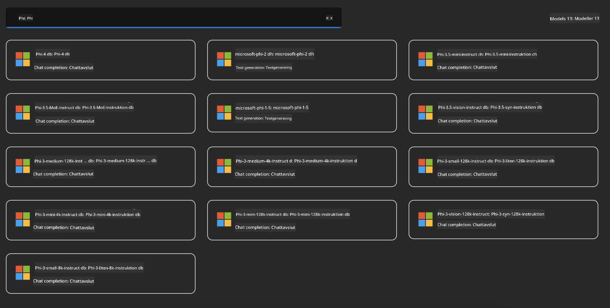

<!--
CO_OP_TRANSLATOR_METADATA:
{
  "original_hash": "3ae21dc5554e888defbe57946ee995ee",
  "translation_date": "2025-07-16T19:09:34+00:00",
  "source_file": "md/01.Introduction/02/03.AzureAIFoundry.md",
  "language_code": "sv"
}
-->
## Phi-familjen i Azure AI Foundry

[Azure AI Foundry](https://ai.azure.com) är en pålitlig plattform som ger utvecklare möjlighet att driva innovation och forma framtiden med AI på ett säkert, tryggt och ansvarsfullt sätt.

[Azure AI Foundry](https://ai.azure.com) är utformad för utvecklare att:

- Bygga generativa AI-applikationer på en företagsklassad plattform.
- Utforska, bygga, testa och distribuera med hjälp av avancerade AI-verktyg och ML-modeller, baserade på ansvarsfulla AI-principer.
- Samarbeta i team genom hela applikationsutvecklingens livscykel.

Med Azure AI Foundry kan du utforska ett brett utbud av modeller, tjänster och funktioner, och börja bygga AI-applikationer som bäst stödjer dina mål. Plattformen Azure AI Foundry underlättar skalbarhet för att enkelt omvandla konceptbevis till fullfjädrade produktionsapplikationer. Kontinuerlig övervakning och förbättring stödjer långsiktig framgång.


Förutom att använda Azure AOAI Service i Azure AI Foundry kan du även använda tredjepartsmodeller i Azure AI Foundry Model Catalog. Detta är ett bra val om du vill använda Azure AI Foundry som din AI-lösningsplattform.

Vi kan snabbt distribuera Phi Family Models via Model Catalog i Azure AI Foundry

[Microsoft Phi Models i Azure AI Foundry Models](https://ai.azure.com/explore/models/?selectedCollection=phi)



### **Distribuera Phi-4 i Azure AI Foundry**


### **Testa Phi-4 i Azure AI Foundry Playground**


### **Köra Python-kod för att anropa Azure AI Foundry Phi-4**

```python

import os  
import base64
from openai import AzureOpenAI  
from azure.identity import DefaultAzureCredential, get_bearer_token_provider  
        
endpoint = os.getenv("ENDPOINT_URL", "Your Azure AOAI Service Endpoint")  
deployment = os.getenv("DEPLOYMENT_NAME", "Phi-4")  
      
token_provider = get_bearer_token_provider(  
    DefaultAzureCredential(),  
    "https://cognitiveservices.azure.com/.default"  
)  
  
client = AzureOpenAI(  
    azure_endpoint=endpoint,  
    azure_ad_token_provider=token_provider,  
    api_version="2024-05-01-preview",  
)  
  

chat_prompt = [
    {
        "role": "system",
        "content": "You are an AI assistant that helps people find information."
    },
    {
        "role": "user",
        "content": "can you introduce yourself"
    }
] 
    
# Include speech result if speech is enabled  
messages = chat_prompt 

completion = client.chat.completions.create(  
    model=deployment,  
    messages=messages,
    max_tokens=800,  
    temperature=0.7,  
    top_p=0.95,  
    frequency_penalty=0,  
    presence_penalty=0,
    stop=None,  
    stream=False  
)  
  
print(completion.to_json())  

```

**Ansvarsfriskrivning**:  
Detta dokument har översatts med hjälp av AI-översättningstjänsten [Co-op Translator](https://github.com/Azure/co-op-translator). Även om vi strävar efter noggrannhet, vänligen observera att automatiska översättningar kan innehålla fel eller brister. Det ursprungliga dokumentet på dess modersmål bör betraktas som den auktoritativa källan. För kritisk information rekommenderas professionell mänsklig översättning. Vi ansvarar inte för några missförstånd eller feltolkningar som uppstår vid användning av denna översättning.