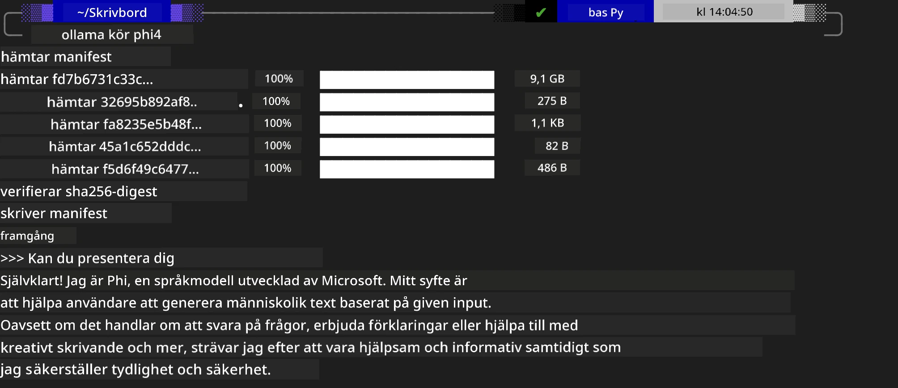
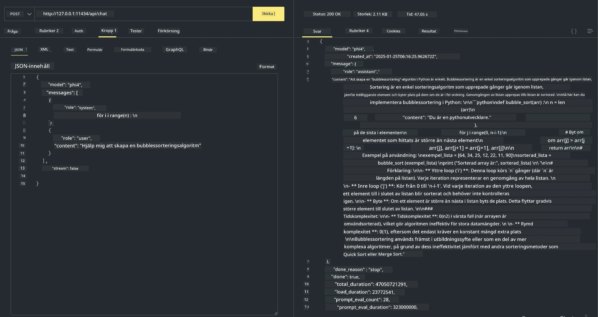

<!--
CO_OP_TRANSLATOR_METADATA:
{
  "original_hash": "2aa35f3c8b437fd5dc9995d53909d495",
  "translation_date": "2025-12-21T12:04:11+00:00",
  "source_file": "md/01.Introduction/02/04.Ollama.md",
  "language_code": "sv"
}
-->
## Phi-familjen i Ollama


[Ollama](https://ollama.com) gör det möjligt för fler att direkt distribuera open source LLM eller SLM genom enkla skript, och kan också bygga API:er för att hjälpa lokala Copilot-applikationsscenarier.

## **1. Installation**

Ollama stöder körning på Windows, macOS och Linux. Du kan installera Ollama via denna länk ([https://ollama.com/download](https://ollama.com/download)). Efter en lyckad installation kan du direkt använda Ollama-skriptet för att anropa Phi-3 via ett terminalfönster. Du kan se alla [tillgängliga bibliotek i Ollama](https://ollama.com/library). Om du öppnar detta repository i en Codespace kommer Ollama redan att vara installerat.

```bash

ollama run phi4

```

> [!NOTE]
> Modellen kommer att laddas ner först när du kör den för första gången. Naturligtvis kan du också direkt ange den redan nedladdade Phi-4-modellen. Vi tar WSL som exempel för att köra kommandot. När modellen har laddats ner framgångsrikt kan du interagera direkt i terminalen.



## **2. Anropa phi-4 API:et från Ollama**

Om du vill anropa Phi-4 API:et som genereras av ollama kan du använda detta kommando i terminalen för att starta Ollama-servern.

```bash

ollama serve

```

> [!NOTE]
> If running MacOS or Linux, please note that you may encounter the following error **"Error: listen tcp 127.0.0.1:11434: bind: address already in use"** You may get this error when calling running the command. You can either ignore that error, since it typically indicates the server is already running, or you can stop the and restart Ollama:

**macOS**

```bash

brew services restart ollama

```

**Linux**

```bash

sudo systemctl stop ollama

```

Ollama supports two API: generate and chat. You can call the model API provided by Ollama according to your needs, by sending requests to the local service running on port 11434.

**Chat**

```bash

curl http://127.0.0.1:11434/api/chat -d '{
  "model": "phi3",
  "messages": [
    {
      "role": "system",
      "content": "Your are a python developer."
    },
    {
      "role": "user",
      "content": "Help me generate a bubble algorithm"
    }
  ],
  "stream": false
  
}'
```

This is the result in Postman



## Ytterligare resurser

Kontrollera listan över tillgängliga modeller i Ollama i [deras library](https://ollama.com/library).

Hämta din modell från Ollama-servern med detta kommando

```bash
ollama pull phi4
```

Kör modellen med detta kommando

```bash
ollama run phi4
```

***Obs:*** Besök denna länk [https://github.com/ollama/ollama/blob/main/docs/api.md](https://github.com/ollama/ollama/blob/main/docs/api.md) för att lära dig mer

## Anropa Ollama från Python

Du kan använda `requests` eller `urllib3` för att göra förfrågningar till de lokala serverendpunkter som används ovan. Ett populärt sätt att använda Ollama i Python är dock via [openai](https://pypi.org/project/openai/) SDK, eftersom Ollama även tillhandahåller OpenAI-kompatibla serverendpunkter.

Här är ett exempel för phi3-mini:

```python
import openai

client = openai.OpenAI(
    base_url="http://localhost:11434/v1",
    api_key="nokeyneeded",
)

response = client.chat.completions.create(
    model="phi4",
    temperature=0.7,
    n=1,
    messages=[
        {"role": "system", "content": "You are a helpful assistant."},
        {"role": "user", "content": "Write a haiku about a hungry cat"},
    ],
)

print("Response:")
print(response.choices[0].message.content)
```

## Anropa Ollama från JavaScript 

```javascript
// Exempel på att sammanfatta en fil med Phi-4
script({
    model: "ollama:phi4",
    title: "Summarize with Phi-4",
    system: ["system"],
})

// Exempel på att sammanfatta
const file = def("FILE", env.files)
$`Summarize ${file} in a single paragraph.`
```

## Anropa Ollama från C#

Skapa en ny C# Console-applikation och lägg till följande NuGet-paket:

```bash
dotnet add package Microsoft.SemanticKernel --version 1.34.0
```

Ersätt sedan denna kod i filen `Program.cs`

```csharp
using Microsoft.SemanticKernel;
using Microsoft.SemanticKernel.ChatCompletion;

// add chat completion service using the local ollama server endpoint
#pragma warning disable SKEXP0001, SKEXP0003, SKEXP0010, SKEXP0011, SKEXP0050, SKEXP0052
builder.AddOpenAIChatCompletion(
    modelId: "phi4",
    endpoint: new Uri("http://localhost:11434/"),
    apiKey: "non required");

// invoke a simple prompt to the chat service
string prompt = "Write a joke about kittens";
var response = await kernel.InvokePromptAsync(prompt);
Console.WriteLine(response.GetValue<string>());
```

Kör appen med kommandot:

```bash
dotnet run
```

---

<!-- CO-OP TRANSLATOR DISCLAIMER START -->
**Ansvarsfriskrivning**:
Detta dokument har översatts med hjälp av AI-översättningstjänsten [Co-op Translator](https://github.com/Azure/co-op-translator). Vi strävar efter noggrannhet, men var medveten om att automatiska översättningar kan innehålla fel eller brister. Den ursprungliga versionen av dokumentet på originalspråket ska betraktas som den auktoritativa källan. För kritisk information rekommenderas professionell mänsklig översättning. Vi ansvarar inte för några missförstånd eller feltolkningar som uppstår genom användning av denna översättning.
<!-- CO-OP TRANSLATOR DISCLAIMER END -->