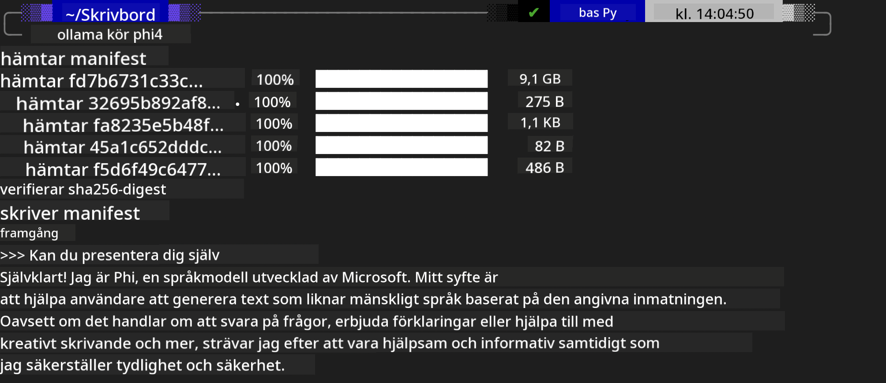
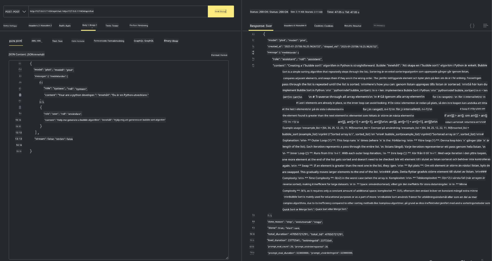

<!--
CO_OP_TRANSLATOR_METADATA:
{
  "original_hash": "0b38834693bb497f96bf53f0d941f9a1",
  "translation_date": "2025-05-09T09:16:26+00:00",
  "source_file": "md/01.Introduction/02/04.Ollama.md",
  "language_code": "sv"
}
-->
## Phi-familjen i Ollama

[Ollama](https://ollama.com) gör det möjligt för fler att direkt använda öppna LLM eller SLM genom enkla skript, och kan även bygga API:er för att underlätta lokala Copilot-applikationer.

## **1. Installation**

Ollama stöder Windows, macOS och Linux. Du kan installera Ollama via denna länk ([https://ollama.com/download](https://ollama.com/download)). Efter en lyckad installation kan du direkt använda Ollama-skript för att anropa Phi-3 via terminalen. Du kan se alla [tillgängliga bibliotek i Ollama](https://ollama.com/library). Om du öppnar detta repository i en Codespace är Ollama redan installerat.

```bash

ollama run phi4

```

> [!NOTE]
> Modellen laddas ner första gången du kör den. Du kan självklart också ange den redan nedladdade Phi-4 modellen direkt. Vi använder WSL som exempel för att köra kommandot. När modellen är nedladdad kan du interagera direkt i terminalen.



## **2. Anropa phi-4 API från Ollama**

Om du vill anropa Phi-4 API genererat av Ollama kan du använda detta kommando i terminalen för att starta Ollama-servern.

```bash

ollama serve

```

> [!NOTE]
> Om du kör macOS eller Linux kan du få följande felmeddelande **"Error: listen tcp 127.0.0.1:11434: bind: address already in use"** när du kör kommandot. Det betyder oftast att servern redan körs och kan oftast ignoreras, eller så kan du stoppa och starta om Ollama:

**macOS**

```bash

brew services restart ollama

```

**Linux**

```bash

sudo systemctl stop ollama

```

Ollama stöder två API: generate och chat. Du kan anropa modellens API via Ollama efter behov genom att skicka förfrågningar till den lokala tjänsten på port 11434.

**Chat**

```bash

curl http://127.0.0.1:11434/api/chat -d '{
  "model": "phi3",
  "messages": [
    {
      "role": "system",
      "content": "Your are a python developer."
    },
    {
      "role": "user",
      "content": "Help me generate a bubble algorithm"
    }
  ],
  "stream": false
  
}'

This is the result in Postman



## Additional Resources

Check the list of available models in Ollama in [their library](https://ollama.com/library).

Pull your model from the Ollama server using this command

```bash  
ollama pull phi4  
```

Run the model using this command

```bash  
ollama run phi4  
```

***Note:*** Visit this link [https://github.com/ollama/ollama/blob/main/docs/api.md](https://github.com/ollama/ollama/blob/main/docs/api.md) to learn more

## Calling Ollama from Python

You can use `requests` or `urllib3` to make requests to the local server endpoints used above. However, a popular way to use Ollama in Python is via the [openai](https://pypi.org/project/openai/) SDK, since Ollama provides OpenAI-compatible server endpoints as well.

Here is an example for phi3-mini:

```python  
import openai

client = openai.OpenAI(
    base_url="http://localhost:11434/v1",
    api_key="nokeyneeded",
)

response = client.chat.completions.create(
    model="phi4",
    temperature=0.7,
    n=1,
    messages=[
        {"role": "system", "content": "You are a helpful assistant."},
        {"role": "user", "content": "Write a haiku about a hungry cat"},
    ],
)

print("Response:")
print(response.choices[0].message.content)  
```

## Calling Ollama from JavaScript 

```javascript  
// Exempel på att sammanfatta en fil med Phi-4  
script({  
    model: "ollama:phi4",  
    title: "Summarize with Phi-4",  
    system: ["system"],  
})

// Exempel på sammanfattning  
const file = def("FILE", env.files)  
$`Summarize ${file} in a single paragraph.`  
```

## Calling Ollama from C#

Create a new C# Console application and add the following NuGet package:

```bash  
dotnet add package Microsoft.SemanticKernel --version 1.34.0  
```

Then replace this code in the `Program.cs` file

```csharp  
using Microsoft.SemanticKernel;  
using Microsoft.SemanticKernel.ChatCompletion;  

// lägg till chat completion-tjänst med lokal ollama-server  
#pragma warning disable SKEXP0001, SKEXP0003, SKEXP0010, SKEXP0011, SKEXP0050, SKEXP0052  
builder.AddOpenAIChatCompletion(  
    modelId: "phi4",  
    endpoint: new Uri("http://localhost:11434/"),  
    apiKey: "non required");  

// anropa en enkel prompt till chattjänsten  
string prompt = "Write a joke about kittens";  
var response = await kernel.InvokePromptAsync(prompt);  
Console.WriteLine(response.GetValue<string>());  
```

Run the app with the command:

```bash  
dotnet run  


**Ansvarsfriskrivning**:  
Detta dokument har översatts med hjälp av AI-översättningstjänsten [Co-op Translator](https://github.com/Azure/co-op-translator). Även om vi strävar efter noggrannhet, vänligen observera att automatiska översättningar kan innehålla fel eller brister. Det ursprungliga dokumentet på dess modersmål bör betraktas som den auktoritativa källan. För viktig information rekommenderas professionell mänsklig översättning. Vi ansvarar inte för några missförstånd eller feltolkningar som uppstår vid användning av denna översättning.