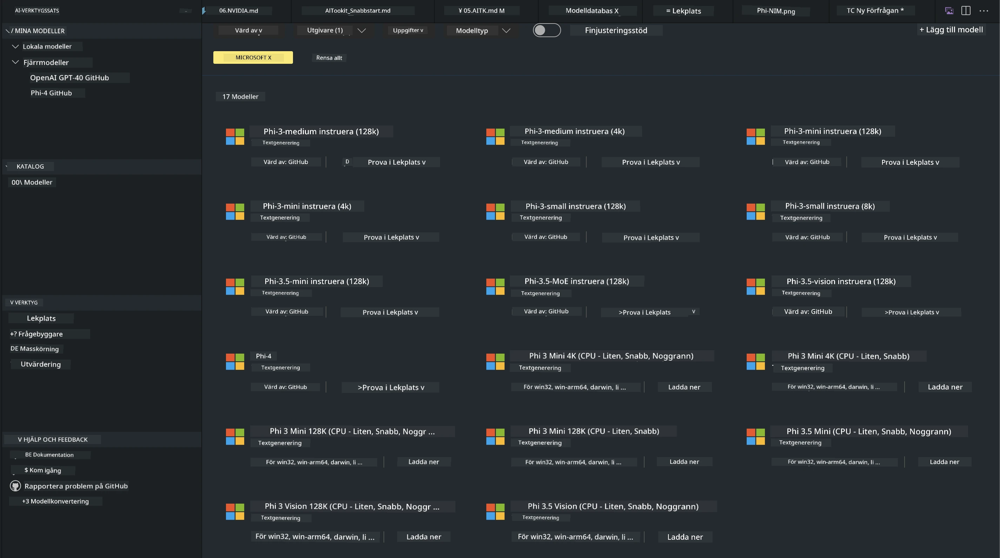
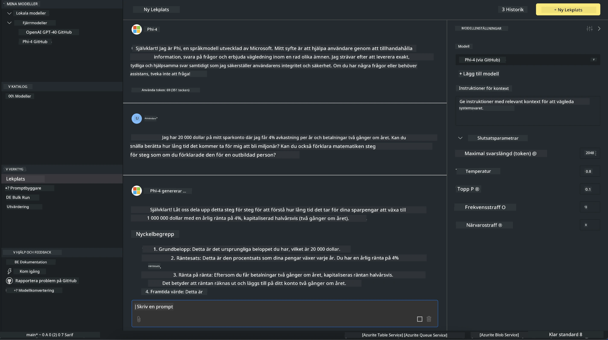

<!--
CO_OP_TRANSLATOR_METADATA:
{
  "original_hash": "4951d458c0b60c02cd1e751b40903877",
  "translation_date": "2025-07-16T19:26:46+00:00",
  "source_file": "md/01.Introduction/02/05.AITK.md",
  "language_code": "sv"
}
-->
# Phi Family i AITK

[AI Toolkit för VS Code](https://marketplace.visualstudio.com/items?itemName=ms-windows-ai-studio.windows-ai-studio) förenklar utvecklingen av generativa AI-appar genom att samla toppmoderna AI-utvecklingsverktyg och modeller från Azure AI Foundry Catalog och andra kataloger som Hugging Face. Du kan bläddra i AI-modellkatalogen som drivs av GitHub Models och Azure AI Foundry Model Catalogs, ladda ner modeller lokalt eller fjärrstyrt, finjustera, testa och använda dem i din applikation.

AI Toolkit Preview körs lokalt. Lokal inferens eller finjustering beror på vilken modell du valt, och du kan behöva en GPU som NVIDIA CUDA GPU. Du kan också köra GitHub Models direkt med AITK.

## Kom igång

[Lär dig mer om hur du installerar Windows subsystem för Linux](https://learn.microsoft.com/windows/wsl/install?WT.mc_id=aiml-137032-kinfeylo)

och [hur du byter standarddistribution](https://learn.microsoft.com/windows/wsl/install#change-the-default-linux-distribution-installed).

[AI Toolkit GitHub Repo](https://github.com/microsoft/vscode-ai-toolkit/)

- Windows, Linux, macOS
  
- För finjustering på både Windows och Linux behöver du en Nvidia GPU. Dessutom kräver **Windows** subsystem för Linux med Ubuntu-distribution 18.4 eller senare. [Lär dig mer om hur du installerar Windows subsystem för Linux](https://learn.microsoft.com/windows/wsl/install) och [hur du byter standarddistribution](https://learn.microsoft.com/windows/wsl/install#change-the-default-linux-distribution-installed).

### Installera AI Toolkit

AI Toolkit levereras som en [Visual Studio Code Extension](https://code.visualstudio.com/docs/setup/additional-components#_vs-code-extensions), så du behöver först installera [VS Code](https://code.visualstudio.com/docs/setup/windows?WT.mc_id=aiml-137032-kinfeylo) och sedan ladda ner AI Toolkit från [VS Marketplace](https://marketplace.visualstudio.com/items?itemName=ms-windows-ai-studio.windows-ai-studio).  
[AI Toolkit finns tillgängligt i Visual Studio Marketplace](https://marketplace.visualstudio.com/items?itemName=ms-windows-ai-studio.windows-ai-studio) och kan installeras som vilken annan VS Code-extension som helst.

Om du inte är van vid att installera VS Code-tillägg, följ dessa steg:

### Logga in

1. I aktivitetsfältet i VS Code, välj **Extensions**  
1. Skriv "AI Toolkit" i sökfältet för tillägg  
1. Välj "AI Toolkit for Visual Studio code"  
1. Klicka på **Install**

Nu är du redo att använda tillägget!

Du kommer att uppmanas att logga in på GitHub, klicka då på "Allow" för att fortsätta. Du kommer att omdirigeras till GitHubs inloggningssida.

Logga in och följ instruktionerna. Efter lyckad inloggning kommer du tillbaka till VS Code.

När tillägget är installerat ser du AI Toolkit-ikonen i aktivitetsfältet.

Låt oss utforska de tillgängliga funktionerna!

### Tillgängliga funktioner

AI Toolkits primära sidofält är organiserat i  

- **Models**  
- **Resources**  
- **Playground**  
- **Fine-tuning**  
- **Evaluation**

Dessa finns i Resources-sektionen. För att komma igång, välj **Model Catalog**.

### Ladda ner en modell från katalogen

När du startar AI Toolkit från VS Code:s sidofält kan du välja bland följande alternativ:



- Hitta en stödjad modell i **Model Catalog** och ladda ner den lokalt  
- Testa modellinferens i **Model Playground**  
- Finjustera modellen lokalt eller fjärrstyrt i **Model Fine-tuning**  
- Distribuera finjusterade modeller till molnet via kommandopaletten för AI Toolkit  
- Utvärdera modeller

> [!NOTE]
>
> **GPU vs CPU**
>
> Du kommer att märka att modellkorten visar modellstorlek, plattform och accelerator-typ (CPU, GPU). För optimerad prestanda på **Windows-enheter med minst en GPU**, välj modellversioner som endast riktar sig mot Windows.
>
> Detta säkerställer att du har en modell optimerad för DirectML-acceleratorn.
>
> Modellnamnen följer formatet
>
> - `{model_name}-{accelerator}-{quantization}-{format}`.
>
>För att kontrollera om du har en GPU på din Windows-enhet, öppna **Task Manager** och välj fliken **Performance**. Om du har GPU:er listas de under namn som "GPU 0" eller "GPU 1".

### Kör modellen i playground

När alla parametrar är inställda, klicka på **Generate Project**.

När din modell har laddats ner, välj **Load in Playground** på modellkortet i katalogen:

- Starta modellnedladdningen  
- Installera alla förutsättningar och beroenden  
- Skapa VS Code-arbetsyta



### Använd REST API i din applikation

AI Toolkit levereras med en lokal REST API-webbserver **på port 5272** som använder [OpenAI chat completions format](https://platform.openai.com/docs/api-reference/chat/create).

Detta gör att du kan testa din applikation lokalt utan att behöva förlita dig på en molnbaserad AI-modelltjänst. Till exempel visar följande JSON-fil hur du konfigurerar förfrågans kropp:

```json
{
    "model": "Phi-4",
    "messages": [
        {
            "role": "user",
            "content": "what is the golden ratio?"
        }
    ],
    "temperature": 0.7,
    "top_p": 1,
    "top_k": 10,
    "max_tokens": 100,
    "stream": true
}
```

Du kan testa REST API med (till exempel) [Postman](https://www.postman.com/) eller CURL (Client URL)-verktyget:

```bash
curl -vX POST http://127.0.0.1:5272/v1/chat/completions -H 'Content-Type: application/json' -d @body.json
```

### Använd OpenAI-klientbiblioteket för Python

```python
from openai import OpenAI

client = OpenAI(
    base_url="http://127.0.0.1:5272/v1/", 
    api_key="x" # required for the API but not used
)

chat_completion = client.chat.completions.create(
    messages=[
        {
            "role": "user",
            "content": "what is the golden ratio?",
        }
    ],
    model="Phi-4",
)

print(chat_completion.choices[0].message.content)
```

### Använd Azure OpenAI-klientbiblioteket för .NET

Lägg till [Azure OpenAI client library för .NET](https://www.nuget.org/packages/Azure.AI.OpenAI/) i ditt projekt via NuGet:

```bash
dotnet add {project_name} package Azure.AI.OpenAI --version 1.0.0-beta.17
```

Lägg till en C#-fil som heter **OverridePolicy.cs** i ditt projekt och klistra in följande kod:

```csharp
// OverridePolicy.cs
using Azure.Core.Pipeline;
using Azure.Core;

internal partial class OverrideRequestUriPolicy(Uri overrideUri)
    : HttpPipelineSynchronousPolicy
{
    private readonly Uri _overrideUri = overrideUri;

    public override void OnSendingRequest(HttpMessage message)
    {
        message.Request.Uri.Reset(_overrideUri);
    }
}
```

Klistra sedan in följande kod i din **Program.cs**-fil:

```csharp
// Program.cs
using Azure.AI.OpenAI;

Uri localhostUri = new("http://localhost:5272/v1/chat/completions");

OpenAIClientOptions clientOptions = new();
clientOptions.AddPolicy(
    new OverrideRequestUriPolicy(localhostUri),
    Azure.Core.HttpPipelinePosition.BeforeTransport);
OpenAIClient client = new(openAIApiKey: "unused", clientOptions);

ChatCompletionsOptions options = new()
{
    DeploymentName = "Phi-4",
    Messages =
    {
        new ChatRequestSystemMessage("You are a helpful assistant. Be brief and succinct."),
        new ChatRequestUserMessage("What is the golden ratio?"),
    }
};

StreamingResponse<StreamingChatCompletionsUpdate> streamingChatResponse
    = await client.GetChatCompletionsStreamingAsync(options);

await foreach (StreamingChatCompletionsUpdate chatChunk in streamingChatResponse)
{
    Console.Write(chatChunk.ContentUpdate);
}
```


## Finjustering med AI Toolkit

- Kom igång med modellupptäckt och playground.  
- Modellfinjustering och inferens med lokala resurser.  
- Fjärrfinjustering och inferens med Azure-resurser.

[Finjustering med AI Toolkit](../../03.FineTuning/Finetuning_VSCodeaitoolkit.md)

## AI Toolkit Q&A-resurser

Se vår [Q&A-sida](https://github.com/microsoft/vscode-ai-toolkit/blob/main/archive/QA.md) för vanliga problem och lösningar.

**Ansvarsfriskrivning**:  
Detta dokument har översatts med hjälp av AI-översättningstjänsten [Co-op Translator](https://github.com/Azure/co-op-translator). Även om vi strävar efter noggrannhet, vänligen observera att automatiska översättningar kan innehålla fel eller brister. Det ursprungliga dokumentet på dess modersmål bör betraktas som den auktoritativa källan. För kritisk information rekommenderas professionell mänsklig översättning. Vi ansvarar inte för några missförstånd eller feltolkningar som uppstår vid användning av denna översättning.