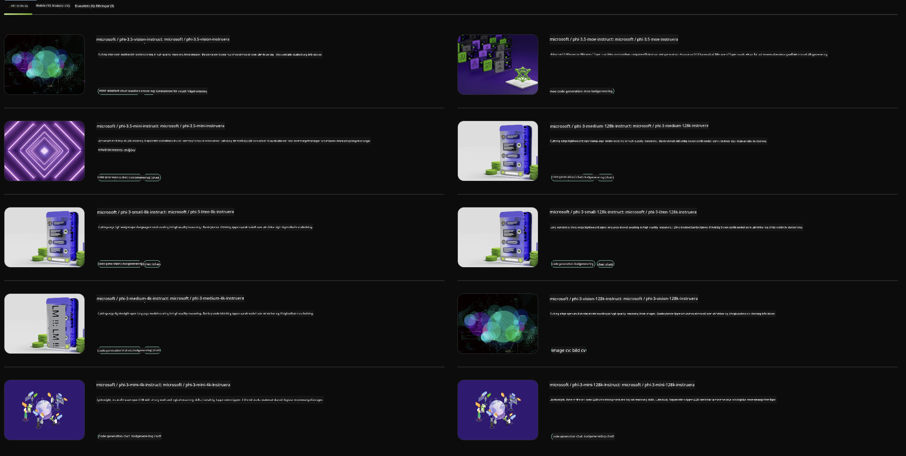

<!--
CO_OP_TRANSLATOR_METADATA:
{
  "original_hash": "7b08e277df2a9307f861ae54bc30c772",
  "translation_date": "2025-05-09T09:55:01+00:00",
  "source_file": "md/01.Introduction/02/06.NVIDIA.md",
  "language_code": "sv"
}
-->
## Phi-familjen i NVIDIA NIM

NVIDIA NIM är en uppsättning användarvänliga mikrotjänster utformade för att påskynda driftsättningen av generativa AI-modeller i molnet, datacenter och arbetsstationer. NIM kategoriseras efter modelfamilj och per modell. Till exempel ger NVIDIA NIM för stora språkmodeller (LLMs) kraften från toppmoderna LLM:er till företagsapplikationer, med oöverträffade möjligheter för naturlig språkbehandling och förståelse.

NIM gör det enkelt för IT- och DevOps-team att själv hosta stora språkmodeller (LLMs) i sina egna hanterade miljöer, samtidigt som utvecklare får tillgång till branschstandard-API:er som låter dem bygga kraftfulla assistenter, chatbots och AI-assistenter som kan förändra deras verksamhet. Genom att utnyttja NVIDIAs banbrytande GPU-acceleration och skalbar driftsättning erbjuder NIM den snabbaste vägen till inferens med oöverträffad prestanda.

Du kan använda NVIDIA NIM för att inferera Phi-familjens modeller



### **Exempel - Phi-3-Vision i NVIDIA NIM**

Föreställ dig att du har en bild (`demo.png`) och vill generera Python-kod som bearbetar bilden och sparar en ny version av den (`phi-3-vision.jpg`).

Koden ovan automatiserar denna process genom att:

1. Ställa in miljön och nödvändiga konfigurationer.
2. Skapa en prompt som instruerar modellen att generera den efterfrågade Python-koden.
3. Skicka prompten till modellen och samla in den genererade koden.
4. Extrahera och köra den genererade koden.
5. Visa originalbilden och den bearbetade bilden.

Denna metod utnyttjar AI:s kraft för att automatisera bildbehandlingsuppgifter, vilket gör det enklare och snabbare att nå dina mål.

[Sample Code Solution](../../../../../code/06.E2E/E2E_Nvidia_NIM_Phi3_Vision.ipynb)

Låt oss gå igenom vad hela koden gör steg för steg:

1. **Installera nödvändigt paket**:
    ```python
    !pip install langchain_nvidia_ai_endpoints -U
    ```
    Detta kommando installerar paketet `langchain_nvidia_ai_endpoints` och säkerställer att det är den senaste versionen.

2. **Importera nödvändiga moduler**:
    ```python
    from langchain_nvidia_ai_endpoints import ChatNVIDIA
    import getpass
    import os
    import base64
    ```
    Dessa importeringar tar in moduler som behövs för att interagera med NVIDIA AI-endpoints, hantera lösenord säkert, interagera med operativsystemet och koda/dekoda data i base64-format.

3. **Ställ in API-nyckel**:
    ```python
    if not os.getenv("NVIDIA_API_KEY"):
        os.environ["NVIDIA_API_KEY"] = getpass.getpass("Enter your NVIDIA API key: ")
    ```
    Den här koden kontrollerar om miljövariabeln `NVIDIA_API_KEY` är satt. Om inte, uppmanas användaren att ange sin API-nyckel på ett säkert sätt.

4. **Definiera modell och bildsökväg**:
    ```python
    model = 'microsoft/phi-3-vision-128k-instruct'
    chat = ChatNVIDIA(model=model)
    img_path = './imgs/demo.png'
    ```
    Detta sätter vilken modell som ska användas, skapar en instans av `ChatNVIDIA` med den angivna modellen och definierar sökvägen till bildfilen.

5. **Skapa textprompt**:
    ```python
    text = "Please create Python code for image, and use plt to save the new picture under imgs/ and name it phi-3-vision.jpg."
    ```
    Här definieras en textprompt som instruerar modellen att generera Python-kod för att bearbeta en bild.

6. **Koda bilden i Base64**:
    ```python
    with open(img_path, "rb") as f:
        image_b64 = base64.b64encode(f.read()).decode()
    image = f''
    ```
    Denna kod läser bildfilen, kodar den i base64 och skapar en HTML-bildtagg med den kodade datan.

7. **Kombinera text och bild i prompt**:
    ```python
    prompt = f"{text} {image}"
    ```
    Här kombineras textprompten och HTML-bildtaggen till en enda sträng.

8. **Generera kod med ChatNVIDIA**:
    ```python
    code = ""
    for chunk in chat.stream(prompt):
        print(chunk.content, end="")
        code += chunk.content
    ```
    Denna kod skickar prompten till `ChatNVIDIA` model and collects the generated code in chunks, printing and appending each chunk to the `code`-strängen.

9. **Extrahera Python-kod från genererat innehåll**:
    ```python
    begin = code.index('```python') + 9
    code = code[begin:]
    end = code.index('```')
    code = code[:end]
    ```
    Detta extraherar den faktiska Python-koden från det genererade innehållet genom att ta bort markdown-formattering.

10. **Kör den genererade koden**:
    ```python
    import subprocess
    result = subprocess.run(["python", "-c", code], capture_output=True)
    ```
    Detta kör den extraherade Python-koden som en subprocess och fångar dess utdata.

11. **Visa bilder**:
    ```python
    from IPython.display import Image, display
    display(Image(filename='./imgs/phi-3-vision.jpg'))
    display(Image(filename='./imgs/demo.png'))
    ```
    Dessa rader visar bilderna med hjälp av `IPython.display`-modulen.

**Ansvarsfriskrivning**:  
Detta dokument har översatts med hjälp av AI-översättningstjänsten [Co-op Translator](https://github.com/Azure/co-op-translator). Även om vi strävar efter noggrannhet, vänligen observera att automatiska översättningar kan innehålla fel eller brister. Det ursprungliga dokumentet på dess modersmål bör betraktas som den auktoritativa källan. För kritisk information rekommenderas professionell mänsklig översättning. Vi ansvarar inte för eventuella missförstånd eller feltolkningar som uppstår vid användning av denna översättning.