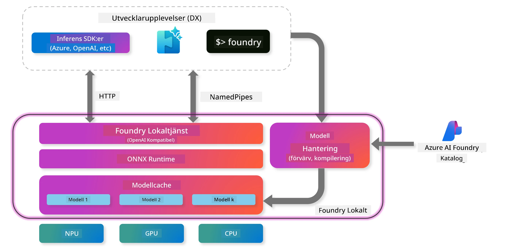

## Kom igång med Phi-Family-modeller i Foundry Local

### Introduktion till Foundry Local

Foundry Local är en kraftfull AI-inferenslösning som körs direkt på din enhet och ger företagsklassade AI-funktioner på din lokala hårdvara. Den här guiden hjälper dig att installera och använda Phi-Family-modeller med Foundry Local, vilket ger dig full kontroll över dina AI-arbetsflöden samtidigt som du skyddar din integritet och minskar kostnaderna.

Foundry Local erbjuder fördelar inom prestanda, integritet, anpassning och kostnadseffektivitet genom att köra AI-modeller lokalt på din enhet. Det integreras smidigt i dina befintliga arbetsflöden och applikationer via ett intuitivt CLI, SDK och REST API.




### Varför välja Foundry Local?

Att förstå fördelarna med Foundry Local hjälper dig att fatta välgrundade beslut om din AI-distributionsstrategi:

- **Inferens på enheten:** Kör modeller lokalt på din egen hårdvara, vilket minskar kostnaderna samtidigt som all data stannar på din enhet.

- **Modellanpassning:** Välj mellan förinställda modeller eller använd dina egna för att möta specifika krav och användningsområden.

- **Kostnadseffektivitet:** Eliminera återkommande molntjänstkostnader genom att använda din befintliga hårdvara, vilket gör AI mer tillgängligt.

- **Sömlös integration:** Anslut till dina applikationer via SDK, API-endpoints eller CLI, med enkel skalning till Azure AI Foundry när dina behov växer.

> **Kom igång-notis:** Den här guiden fokuserar på att använda Foundry Local via CLI och SDK. Du kommer att lära dig båda metoderna för att kunna välja det bästa sättet för ditt användningsfall.

## Del 1: Installera Foundry Local CLI

### Steg 1: Installation

Foundry Local CLI är din ingång för att hantera och köra AI-modeller lokalt. Vi börjar med att installera det på ditt system.

**Stödda plattformar:** Windows och macOS

För detaljerade installationsinstruktioner, se den [officiella Foundry Local-dokumentationen](https://github.com/microsoft/Foundry-Local/blob/main/README.md).

### Steg 2: Utforska tillgängliga modeller

När du har installerat Foundry Local CLI kan du ta reda på vilka modeller som finns tillgängliga för ditt användningsområde. Det här kommandot visar alla stödda modeller:


```bash
foundry model list
```

### Steg 3: Förstå Phi Family-modellerna

Phi Family erbjuder en rad modeller optimerade för olika användningsområden och hårdvarukonfigurationer. Här är Phi-modellerna som finns i Foundry Local:

**Tillgängliga Phi-modeller:** 

- **phi-3.5-mini** - Kompakt modell för grundläggande uppgifter
- **phi-3-mini-128k** - Version med utökat kontext för längre samtal
- **phi-3-mini-4k** - Standardmodell för allmänt bruk
- **phi-4** - Avancerad modell med förbättrade funktioner
- **phi-4-mini** - Lättviktsversion av Phi-4
- **phi-4-mini-reasoning** - Specialiserad för komplexa resonemangsuppgifter

> **Hårdvarukompatibilitet:** Varje modell kan konfigureras för olika hårdvaruaccelerationer (CPU, GPU) beroende på din systems kapacitet.

### Steg 4: Kör din första Phi-modell

Vi börjar med ett praktiskt exempel. Vi kör modellen `phi-4-mini-reasoning`, som är särskilt bra på att lösa komplexa problem steg för steg.


**Kommando för att köra modellen:**

```bash
foundry model run Phi-4-mini-reasoning-generic-cpu
```

> **Första gången-setup:** När du kör en modell för första gången laddar Foundry Local automatiskt ner den till din enhet. Nedladdningstiden varierar beroende på din nätverkshastighet, så ha tålamod under den första installationen.

### Steg 5: Testa modellen med ett verkligt problem

Nu testar vi modellen med ett klassiskt logikproblem för att se hur den hanterar steg-för-steg-resonemang:

**Exempelproblem:**

```txt
Please calculate the following step by step: Now there are pheasants and rabbits in the same cage, there are thirty-five heads on top and ninety-four legs on the bottom, how many pheasants and rabbits are there?
```

**Förväntat beteende:** Modellen bör dela upp problemet i logiska steg och använda att fasaner har 2 ben och kaniner 4 ben för att lösa ekvationssystemet.

**Resultat:**


## Del 2: Bygga applikationer med Foundry Local SDK

### Varför använda SDK?

Medan CLI är perfekt för testning och snabba interaktioner, gör SDK det möjligt att programmera in Foundry Local i dina applikationer. Det öppnar upp möjligheter för:

- Att bygga skräddarsydda AI-drivna applikationer
- Skapa automatiserade arbetsflöden
- Integrera AI-funktioner i befintliga system
- Utveckla chatbots och interaktiva verktyg

### Stödda programmeringsspråk

Foundry Local erbjuder SDK-stöd för flera programmeringsspråk för att passa dina utvecklingspreferenser:

**📦 Tillgängliga SDK:er:**

- **C# (.NET):** [SDK-dokumentation & exempel](https://github.com/microsoft/Foundry-Local/tree/main/sdk/cs)
- **Python:** [SDK-dokumentation & exempel](https://github.com/microsoft/Foundry-Local/tree/main/sdk/python)
- **JavaScript:** [SDK-dokumentation & exempel](https://github.com/microsoft/Foundry-Local/tree/main/sdk/js)
- **Rust:** [SDK-dokumentation & exempel](https://github.com/microsoft/Foundry-Local/tree/main/sdk/rust)

### Nästa steg

1. **Välj ditt föredragna SDK** baserat på din utvecklingsmiljö
2. **Följ SDK-specifik dokumentation** för detaljerade implementeringsguider
3. **Börja med enkla exempel** innan du bygger mer komplexa applikationer
4. **Utforska exempel-koden** som finns i varje SDK-repo

## Slutsats

Du har nu lärt dig att:
- ✅ Installera och konfigurera Foundry Local CLI
- ✅ Upptäcka och köra Phi Family-modeller
- ✅ Testa modeller med verkliga problem
- ✅ Förstå SDK-alternativ för applikationsutveckling

Foundry Local ger en kraftfull grund för att ta AI-funktioner direkt till din lokala miljö, vilket ger dig kontroll över prestanda, integritet och kostnader samtidigt som du behåller flexibiliteten att skala upp till molnlösningar vid behov.

**Ansvarsfriskrivning**:  
Detta dokument har översatts med hjälp av AI-översättningstjänsten [Co-op Translator](https://github.com/Azure/co-op-translator). Även om vi strävar efter noggrannhet, vänligen observera att automatiska översättningar kan innehålla fel eller brister. Det ursprungliga dokumentet på dess modersmål bör betraktas som den auktoritativa källan. För kritisk information rekommenderas professionell mänsklig översättning. Vi ansvarar inte för några missförstånd eller feltolkningar som uppstår vid användning av denna översättning.