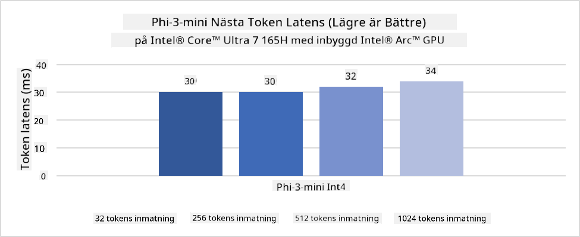
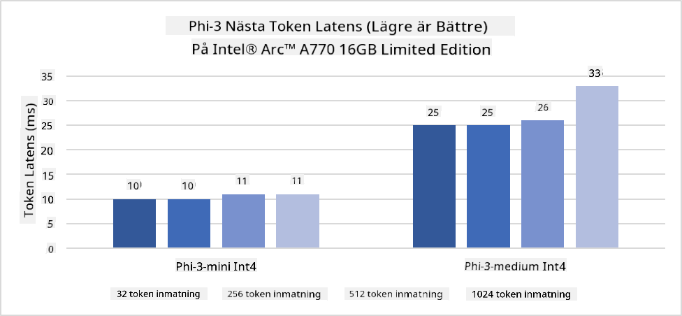
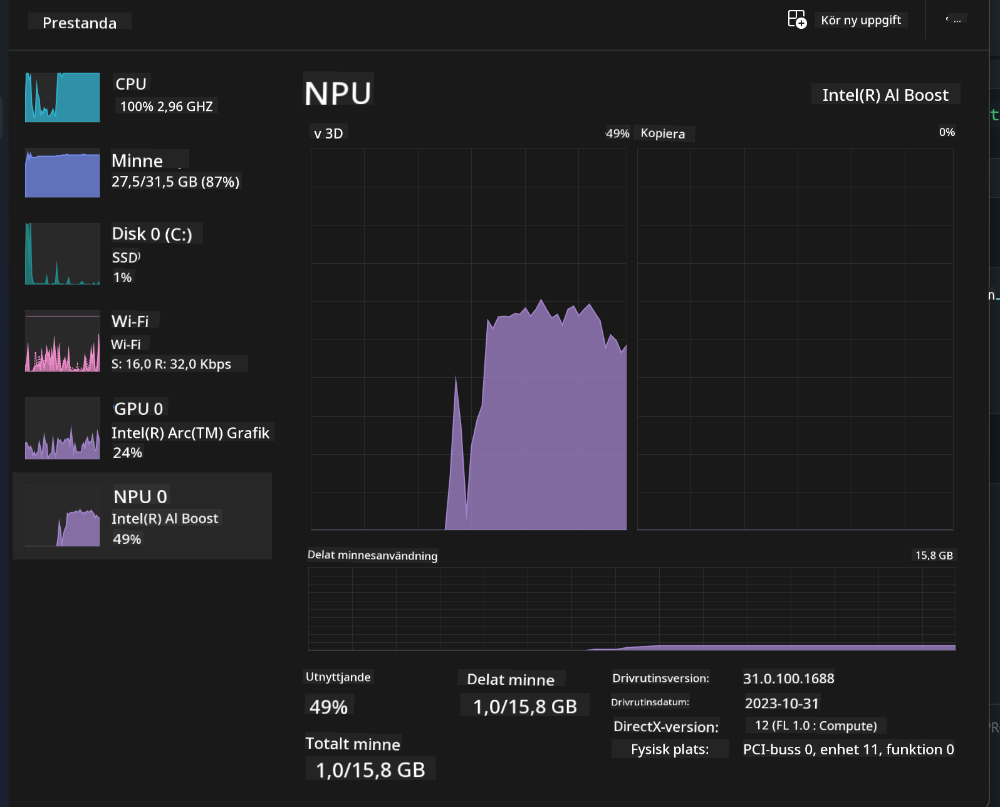
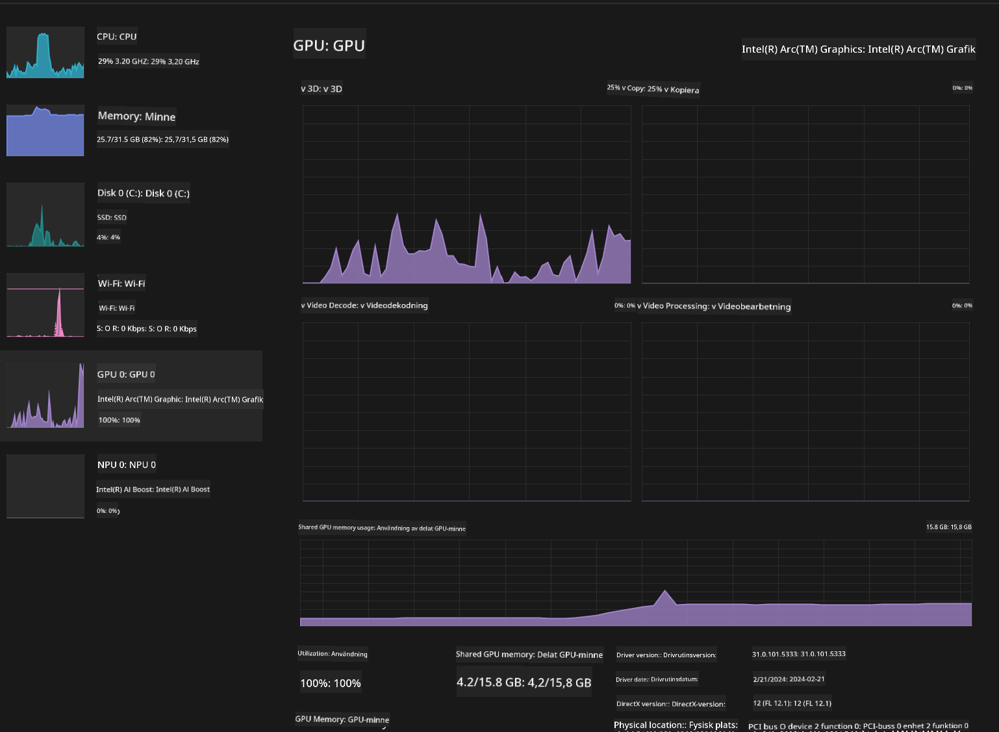

<!--
CO_OP_TRANSLATOR_METADATA:
{
  "original_hash": "e08ce816e23ad813244a09ca34ebb8ac",
  "translation_date": "2025-05-09T10:19:37+00:00",
  "source_file": "md/01.Introduction/03/AIPC_Inference.md",
  "language_code": "sv"
}
-->
# **Inferens Phi-3 på AI PC**

Med framstegen inom generativ AI och förbättringar i hårdvarukapaciteten hos edge-enheter kan allt fler generativa AI-modeller nu integreras i användarnas Bring Your Own Device (BYOD)-enheter. AI PC är bland dessa modeller. Från och med 2024 har Intel, AMD och Qualcomm samarbetat med PC-tillverkare för att introducera AI PC som underlättar distributionen av lokala generativa AI-modeller genom hårdvaruändringar. I denna diskussion kommer vi att fokusera på Intel AI PC och utforska hur man distribuerar Phi-3 på en Intel AI PC.

### Vad är NPU

En NPU (Neural Processing Unit) är en dedikerad processor eller enhet på en större SoC som är speciellt utformad för att accelerera neurala nätverksoperationer och AI-uppgifter. Till skillnad från allmänna CPU:er och GPU:er är NPUs optimerade för datadriven parallellberäkning, vilket gör dem mycket effektiva på att bearbeta stora mängder multimedia-data som video och bilder samt bearbeta data för neurala nätverk. De är särskilt skickliga på AI-relaterade uppgifter, såsom taligenkänning, bakgrundsoskärpa vid videosamtal och redigeringsprocesser för foto eller video som objektigenkänning.

## NPU vs GPU

Även om många AI- och maskininlärningsuppgifter körs på GPU:er finns en viktig skillnad mellan GPU:er och NPU:er.  
GPU:er är kända för sina parallella beräkningsförmågor, men alla GPU:er är inte lika effektiva utöver grafisk bearbetning. NPUs är däremot specialbyggda för de komplexa beräkningar som ingår i neurala nätverksoperationer, vilket gör dem mycket effektiva för AI-uppgifter.

Sammanfattningsvis är NPUs de matematiska genierna som ger extra kraft åt AI-beräkningar och spelar en nyckelroll i den framväxande eran av AI PC!

***Detta exempel är baserat på Intels senaste Intel Core Ultra-processor***

## **1. Använd NPU för att köra Phi-3-modellen**

Intel® NPU-enhet är en AI-inferensaccelerator integrerad med Intel-klient-CPU:er, från och med Intel® Core™ Ultra-generationen av CPU:er (tidigare känd som Meteor Lake). Den möjliggör energieffektiv körning av artificiella neurala nätverksuppgifter.





**Intel NPU Acceleration Library**

Intel NPU Acceleration Library [https://github.com/intel/intel-npu-acceleration-library](https://github.com/intel/intel-npu-acceleration-library) är ett Python-bibliotek utformat för att öka effektiviteten i dina applikationer genom att utnyttja kraften hos Intel Neural Processing Unit (NPU) för att utföra högpresterande beräkningar på kompatibel hårdvara.

Exempel på Phi-3-mini på AI PC driven av Intel® Core™ Ultra-processorer.


Installera Python-biblioteket med pip

```bash

   pip install intel-npu-acceleration-library

```

***Note*** Projektet är fortfarande under utveckling, men referensmodellen är redan mycket komplett.

### **Köra Phi-3 med Intel NPU Acceleration Library**

Med Intel NPU-acceleration påverkar detta bibliotek inte den traditionella kodningsprocessen. Du behöver bara använda detta bibliotek för att kvantisera den ursprungliga Phi-3-modellen, som FP16, INT8, INT4, till exempel

```python
from transformers import AutoTokenizer, pipeline,TextStreamer
from intel_npu_acceleration_library import NPUModelForCausalLM, int4
from intel_npu_acceleration_library.compiler import CompilerConfig
import warnings

model_id = "microsoft/Phi-3-mini-4k-instruct"

compiler_conf = CompilerConfig(dtype=int4)
model = NPUModelForCausalLM.from_pretrained(
    model_id, use_cache=True, config=compiler_conf, attn_implementation="sdpa"
).eval()

tokenizer = AutoTokenizer.from_pretrained(model_id)

text_streamer = TextStreamer(tokenizer, skip_prompt=True)
```

När kvantiseringen lyckats fortsätter du med att anropa NPU för att köra Phi-3-modellen.

```python
generation_args = {
   "max_new_tokens": 1024,
   "return_full_text": False,
   "temperature": 0.3,
   "do_sample": False,
   "streamer": text_streamer,
}

pipe = pipeline(
   "text-generation",
   model=model,
   tokenizer=tokenizer,
)

query = "<|system|>You are a helpful AI assistant.<|end|><|user|>Can you introduce yourself?<|end|><|assistant|>"

with warnings.catch_warnings():
    warnings.simplefilter("ignore")
    pipe(query, **generation_args)
```

När koden körs kan vi se NPU:s status i Aktivitetshanteraren



***Samples*** : [AIPC_NPU_DEMO.ipynb](../../../../../code/03.Inference/AIPC/AIPC_NPU_DEMO.ipynb)

## **2. Använd DirectML + ONNX Runtime för att köra Phi-3-modellen**

### **Vad är DirectML**

[DirectML](https://github.com/microsoft/DirectML) är ett högpresterande, hårdvaruaccelererat DirectX 12-bibliotek för maskininlärning. DirectML ger GPU-acceleration för vanliga maskininlärningsuppgifter på en bred mängd stödd hårdvara och drivrutiner, inklusive alla DirectX 12-kompatibla GPU:er från leverantörer som AMD, Intel, NVIDIA och Qualcomm.

När det används fristående är DirectML API ett låg-nivå DirectX 12-bibliotek och är lämpligt för högpresterande, låg-latensapplikationer såsom ramverk, spel och andra realtidsapplikationer. Den sömlösa interoperabiliteten mellan DirectML och Direct3D 12 samt dess låga overhead och kompatibilitet över hårdvara gör DirectML idealiskt för att accelerera maskininlärning när både hög prestanda och tillförlitlighet samt förutsägbarhet av resultat över hårdvara är avgörande.

***Note*** : Den senaste DirectML stöder redan NPU(https://devblogs.microsoft.com/directx/introducing-neural-processor-unit-npu-support-in-directml-developer-preview/)

### DirectML och CUDA i termer av deras kapabiliteter och prestanda:

**DirectML** är ett maskininlärningsbibliotek utvecklat av Microsoft. Det är designat för att accelerera maskininlärningsuppgifter på Windows-enheter, inklusive stationära datorer, bärbara och edge-enheter.  
- DX12-baserat: DirectML är byggt ovanpå DirectX 12 (DX12), vilket ger brett hårdvarustöd över GPU:er, inklusive både NVIDIA och AMD.  
- Bredare stöd: Eftersom det utnyttjar DX12 kan DirectML fungera med vilken GPU som helst som stöder DX12, även integrerade GPU:er.  
- Bildbehandling: DirectML bearbetar bilder och annan data med neurala nätverk, vilket gör det lämpligt för uppgifter som bildigenkänning, objektigenkänning med mera.  
- Enkel installation: Att sätta upp DirectML är enkelt och kräver inga specifika SDK:er eller bibliotek från GPU-tillverkare.  
- Prestanda: I vissa fall presterar DirectML bra och kan vara snabbare än CUDA, särskilt för vissa arbetsbelastningar.  
- Begränsningar: Det finns dock tillfällen där DirectML kan vara långsammare, särskilt för float16 med stora batchstorlekar.

**CUDA** är NVIDIAs plattform för parallellberäkning och programmeringsmodell. Den gör det möjligt för utvecklare att utnyttja kraften i NVIDIA GPU:er för allmän beräkning, inklusive maskininlärning och vetenskapliga simuleringar.  
- NVIDIA-specifik: CUDA är tätt integrerat med NVIDIA GPU:er och är specifikt designat för dem.  
- Högoptimerad: Den ger utmärkt prestanda för GPU-accelererade uppgifter, särskilt med NVIDIA GPU:er.  
- Vida använd: Många maskininlärningsramverk och bibliotek (som TensorFlow och PyTorch) har stöd för CUDA.  
- Anpassningsbarhet: Utvecklare kan finjustera CUDA-inställningar för specifika uppgifter, vilket kan ge optimal prestanda.  
- Begränsningar: Dock kan CUDA:s beroende av NVIDIA-hårdvara vara begränsande om du vill ha bredare kompatibilitet över olika GPU:er.

### Välja mellan DirectML och CUDA

Valet mellan DirectML och CUDA beror på ditt specifika användningsfall, hårdvarutillgång och preferenser.  
Om du söker bredare kompatibilitet och enkel installation kan DirectML vara ett bra val. Om du däremot har NVIDIA GPU:er och behöver högoptimerad prestanda är CUDA fortfarande ett starkt alternativ. Sammanfattningsvis har både DirectML och CUDA sina styrkor och svagheter, så överväg dina krav och tillgänglig hårdvara när du fattar beslut.

### **Generativ AI med ONNX Runtime**

I AI-eran är portabilitet av AI-modeller mycket viktigt. ONNX Runtime kan enkelt distribuera tränade modeller till olika enheter. Utvecklare behöver inte bry sig om inferensramverket utan använder ett enhetligt API för att slutföra modellinferens. I den generativa AI-eran har ONNX Runtime också utfört kodoptimering (https://onnxruntime.ai/docs/genai/). Genom den optimerade ONNX Runtime kan den kvantiserade generativa AI-modellen infereras på olika enheter. I Generative AI med ONNX Runtime kan du använda AI-modellens API via Python, C#, C/C++. Självklart kan distribution på iPhone dra nytta av C++’s Generative AI med ONNX Runtime API.

[Sample Code](https://github.com/Azure-Samples/Phi-3MiniSamples/tree/main/onnx)

***kompilera generativ AI med ONNX Runtime-biblioteket***

```bash

winget install --id=Kitware.CMake  -e

git clone https://github.com/microsoft/onnxruntime.git

cd .\onnxruntime\

./build.bat --build_shared_lib --skip_tests --parallel --use_dml --config Release

cd ../

git clone https://github.com/microsoft/onnxruntime-genai.git

cd .\onnxruntime-genai\

mkdir ort

cd ort

mkdir include

mkdir lib

copy ..\onnxruntime\include\onnxruntime\core\providers\dml\dml_provider_factory.h ort\include

copy ..\onnxruntime\include\onnxruntime\core\session\onnxruntime_c_api.h ort\include

copy ..\onnxruntime\build\Windows\Release\Release\*.dll ort\lib

copy ..\onnxruntime\build\Windows\Release\Release\onnxruntime.lib ort\lib

python build.py --use_dml


```

**Installera bibliotek**

```bash

pip install .\onnxruntime_genai_directml-0.3.0.dev0-cp310-cp310-win_amd64.whl

```

Så här ser resultatet ut vid körning


***Samples*** : [AIPC_DirectML_DEMO.ipynb](../../../../../code/03.Inference/AIPC/AIPC_DirectML_DEMO.ipynb)

## **3. Använd Intel OpenVino för att köra Phi-3-modellen**

### **Vad är OpenVINO**

[OpenVINO](https://github.com/openvinotoolkit/openvino) är ett open source-verktyg för att optimera och distribuera djupinlärningsmodeller. Det ger förbättrad prestanda för djupinlärning inom vision, ljud och språkmodeller från populära ramverk som TensorFlow, PyTorch med flera. Kom igång med OpenVINO. OpenVINO kan också användas i kombination med CPU och GPU för att köra Phi-3-modellen.

***Note***: För närvarande stöder inte OpenVINO NPU.

### **Installera OpenVINO-biblioteket**

```bash

 pip install git+https://github.com/huggingface/optimum-intel.git

 pip install git+https://github.com/openvinotoolkit/nncf.git

 pip install openvino-nightly

```

### **Köra Phi-3 med OpenVINO**

Precis som med NPU fullbordar OpenVINO anropet av generativa AI-modeller genom att köra kvantiserade modeller. Vi behöver först kvantisera Phi-3-modellen och slutföra modellkvantiseringen via kommandoraden med optimum-cli

**INT4**

```bash

optimum-cli export openvino --model "microsoft/Phi-3-mini-4k-instruct" --task text-generation-with-past --weight-format int4 --group-size 128 --ratio 0.6  --sym  --trust-remote-code ./openvinomodel/phi3/int4

```

**FP16**

```bash

optimum-cli export openvino --model "microsoft/Phi-3-mini-4k-instruct" --task text-generation-with-past --weight-format fp16 --trust-remote-code ./openvinomodel/phi3/fp16

```

det konverterade formatet, så här


Ladda modellvägar (model_dir), relaterade konfigurationer (ov_config = {"PERFORMANCE_HINT": "LATENCY", "NUM_STREAMS": "1", "CACHE_DIR": ""}) och hårdvaruaccelererade enheter (GPU.0) via OVModelForCausalLM

```python

ov_model = OVModelForCausalLM.from_pretrained(
     model_dir,
     device='GPU.0',
     ov_config=ov_config,
     config=AutoConfig.from_pretrained(model_dir, trust_remote_code=True),
     trust_remote_code=True,
)

```

När koden körs kan vi se GPU:s status i Aktivitetshanteraren



***Samples*** : [AIPC_OpenVino_Demo.ipynb](../../../../../code/03.Inference/AIPC/AIPC_OpenVino_Demo.ipynb)

### ***Note*** : De tre ovanstående metoderna har alla sina fördelar, men det rekommenderas att använda NPU-acceleration för AI PC-inferens.

**Ansvarsfriskrivning**:  
Detta dokument har översatts med hjälp av AI-översättningstjänsten [Co-op Translator](https://github.com/Azure/co-op-translator). Även om vi strävar efter noggrannhet, vänligen var medveten om att automatiska översättningar kan innehålla fel eller brister. Det ursprungliga dokumentet på dess modersmål bör betraktas som den auktoritativa källan. För kritisk information rekommenderas professionell mänsklig översättning. Vi ansvarar inte för några missförstånd eller feltolkningar som uppstår vid användning av denna översättning.