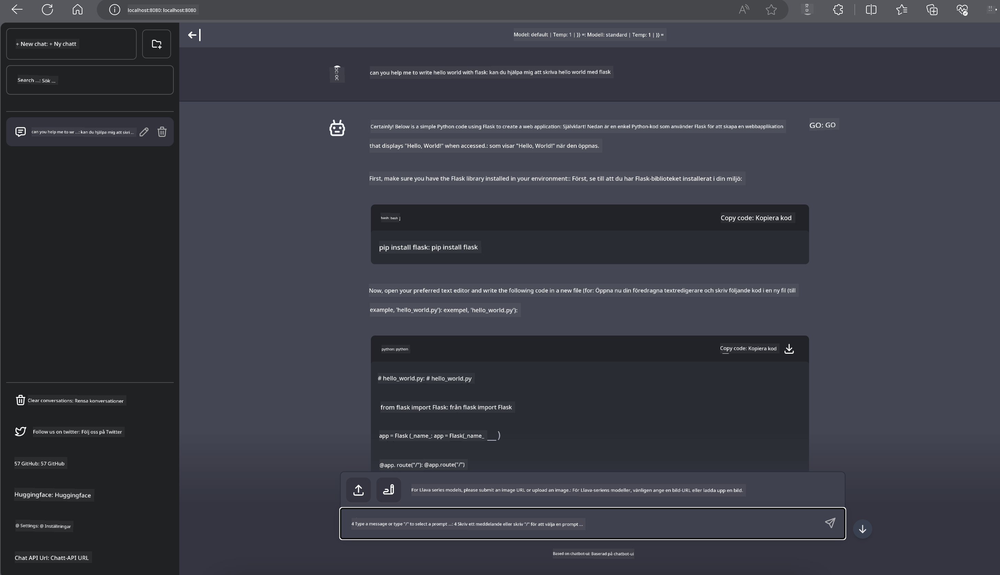

<!--
CO_OP_TRANSLATOR_METADATA:
{
  "original_hash": "be4101a30d98e95a71d42c276e8bcd37",
  "translation_date": "2025-05-09T11:38:48+00:00",
  "source_file": "md/01.Introduction/03/Jetson_Inference.md",
  "language_code": "sv"
}
-->
# **Inference Phi-3 på Nvidia Jetson**

Nvidia Jetson är en serie inbyggda datorplattformar från Nvidia. Jetson TK1, TX1 och TX2-modellerna har alla en Tegra-processor (eller SoC) från Nvidia som integrerar en ARM-baserad centralprocessor (CPU). Jetson är ett lågströmsystem och är designat för att accelerera maskininlärningsapplikationer. Nvidia Jetson används av professionella utvecklare för att skapa banbrytande AI-produkter inom alla branscher, samt av studenter och entusiaster för praktiskt AI-lärande och för att göra fantastiska projekt. SLM distribueras i edge-enheter som Jetson, vilket möjliggör bättre implementering av industriella generativa AI-scenarier.

## Distribution på NVIDIA Jetson:
Utvecklare som arbetar med autonoma robotar och inbyggda enheter kan dra nytta av Phi-3 Mini. Phi-3:s relativt lilla storlek gör den idealisk för edge-distribution. Parametrarna har noggrant justerats under träningen för att säkerställa hög noggrannhet i svaren.

### TensorRT-LLM Optimering:
NVIDIAs [TensorRT-LLM-bibliotek](https://github.com/NVIDIA/TensorRT-LLM?WT.mc_id=aiml-138114-kinfeylo) optimerar inferens för stora språkmodeller. Det stödjer Phi-3 Minis långa kontextfönster, vilket förbättrar både genomströmning och latens. Optimeringarna inkluderar tekniker som LongRoPE, FP8 och inflight batching.

### Tillgänglighet och distribution:
Utvecklare kan utforska Phi-3 Mini med 128K kontextfönster på [NVIDIAs AI](https://www.nvidia.com/en-us/ai-data-science/generative-ai/). Den är paketerad som en NVIDIA NIM, en mikrotjänst med ett standard-API som kan distribueras var som helst. Dessutom finns [TensorRT-LLM-implementationer på GitHub](https://github.com/NVIDIA/TensorRT-LLM).

## **1. Förberedelser**

a. Jetson Orin NX / Jetson NX

b. JetPack 5.1.2+

c. Cuda 11.8

d. Python 3.8+

## **2. Köra Phi-3 på Jetson**

Vi kan välja [Ollama](https://ollama.com) eller [LlamaEdge](https://llamaedge.com)

Om du vill använda gguf både i molnet och på edge-enheter samtidigt kan LlamaEdge ses som WasmEdge (WasmEdge är en lättviktig, högpresterande och skalbar WebAssembly-runtime som passar för molnbaserade, edge- och decentraliserade applikationer. Den stödjer serverlösa applikationer, inbäddade funktioner, mikrotjänster, smarta kontrakt och IoT-enheter. Du kan distribuera ggufs kvantitativa modell till edge-enheter och molnet via LlamaEdge.


Här är stegen för att använda

1. Installera och ladda ner relaterade bibliotek och filer

```bash

curl -sSf https://raw.githubusercontent.com/WasmEdge/WasmEdge/master/utils/install.sh | bash -s -- --plugin wasi_nn-ggml

curl -LO https://github.com/LlamaEdge/LlamaEdge/releases/latest/download/llama-api-server.wasm

curl -LO https://github.com/LlamaEdge/chatbot-ui/releases/latest/download/chatbot-ui.tar.gz

tar xzf chatbot-ui.tar.gz

```

**Note**: llama-api-server.wasm och chatbot-ui måste finnas i samma katalog

2. Kör skripten i terminalen

```bash

wasmedge --dir .:. --nn-preload default:GGML:AUTO:{Your gguf path} llama-api-server.wasm -p phi-3-chat

```

Här är resultatet av körningen



***Exempelkod*** [Phi-3 mini WASM Notebook Sample](https://github.com/Azure-Samples/Phi-3MiniSamples/tree/main/wasm)

Sammanfattningsvis representerar Phi-3 Mini ett stort steg framåt inom språkmodellering, med en kombination av effektivitet, kontextmedvetenhet och NVIDIAs optimeringsförmåga. Oavsett om du bygger robotar eller edge-applikationer är Phi-3 Mini ett kraftfullt verktyg att känna till.

**Ansvarsfriskrivning**:  
Detta dokument har översatts med hjälp av AI-översättningstjänsten [Co-op Translator](https://github.com/Azure/co-op-translator). Även om vi strävar efter noggrannhet, vänligen observera att automatiska översättningar kan innehålla fel eller brister. Det ursprungliga dokumentet på dess modersmål bör betraktas som den auktoritativa källan. För kritisk information rekommenderas professionell mänsklig översättning. Vi ansvarar inte för eventuella missförstånd eller feltolkningar som uppstår vid användning av denna översättning.