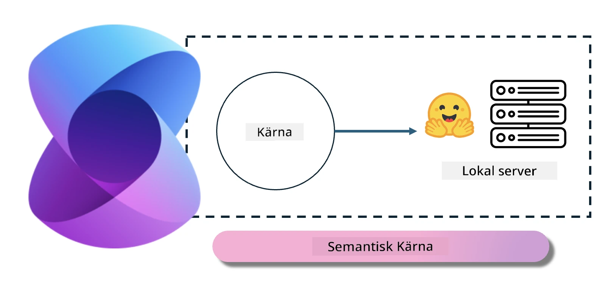
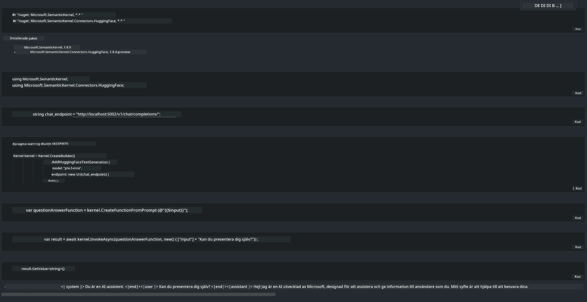

<!--
CO_OP_TRANSLATOR_METADATA:
{
  "original_hash": "bcf5dd7031db0031abdb9dd0c05ba118",
  "translation_date": "2025-07-16T20:57:36+00:00",
  "source_file": "md/01.Introduction/03/Local_Server_Inference.md",
  "language_code": "sv"
}
-->
# **Inferens Phi-3 på lokal server**

Vi kan distribuera Phi-3 på en lokal server. Användare kan välja [Ollama](https://ollama.com) eller [LM Studio](https://llamaedge.com) lösningar, eller skriva egen kod. Du kan ansluta Phi-3:s lokala tjänster via [Semantic Kernel](https://github.com/microsoft/semantic-kernel?WT.mc_id=aiml-138114-kinfeylo) eller [Langchain](https://www.langchain.com/) för att bygga Copilot-applikationer

## **Använd Semantic Kernel för att komma åt Phi-3-mini**

I Copilot-applikationen skapar vi applikationer genom Semantic Kernel / LangChain. Denna typ av applikationsramverk är generellt kompatibelt med Azure OpenAI Service / OpenAI-modeller, och kan även stödja open source-modeller på Hugging Face samt lokala modeller. Vad ska vi göra om vi vill använda Semantic Kernel för att komma åt Phi-3-mini? Med .NET som exempel kan vi kombinera det med Hugging Face Connector i Semantic Kernel. Som standard kan det kopplas till modell-id på Hugging Face (första gången du använder det laddas modellen ner från Hugging Face, vilket tar lång tid). Du kan också ansluta till den lokalt uppbyggda tjänsten. Jämfört med de två rekommenderar vi att använda den senare eftersom den har en högre grad av självständighet, särskilt i företagsapplikationer.

Från bilden kan man se att åtkomst till lokala tjänster via Semantic Kernel enkelt kan kopplas till den egenbyggda Phi-3-mini modellservern. Här är körresultatet

***Exempelkod*** https://github.com/kinfey/Phi3MiniSamples/tree/main/semantickernel

**Ansvarsfriskrivning**:  
Detta dokument har översatts med hjälp av AI-översättningstjänsten [Co-op Translator](https://github.com/Azure/co-op-translator). Även om vi strävar efter noggrannhet, vänligen observera att automatiska översättningar kan innehålla fel eller brister. Det ursprungliga dokumentet på dess modersmål ska betraktas som den auktoritativa källan. För kritisk information rekommenderas professionell mänsklig översättning. Vi ansvarar inte för eventuella missförstånd eller feltolkningar som uppstår vid användning av denna översättning.