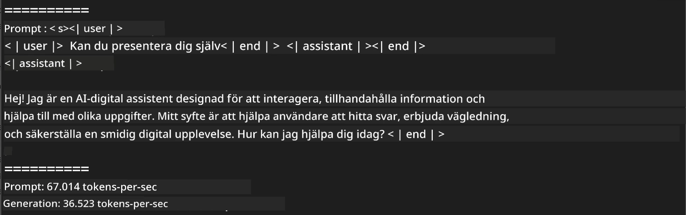
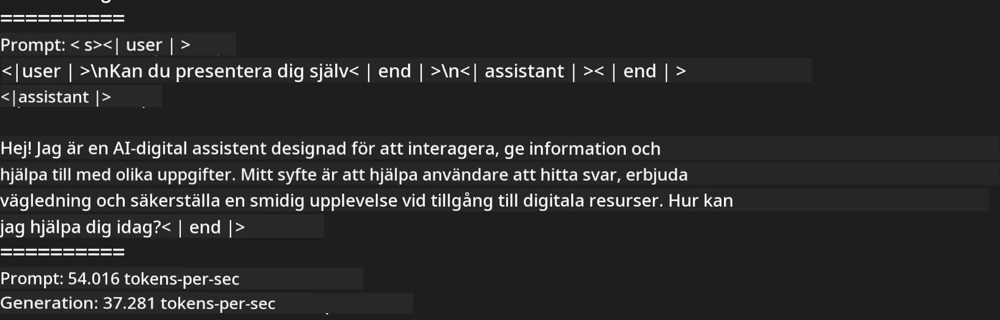
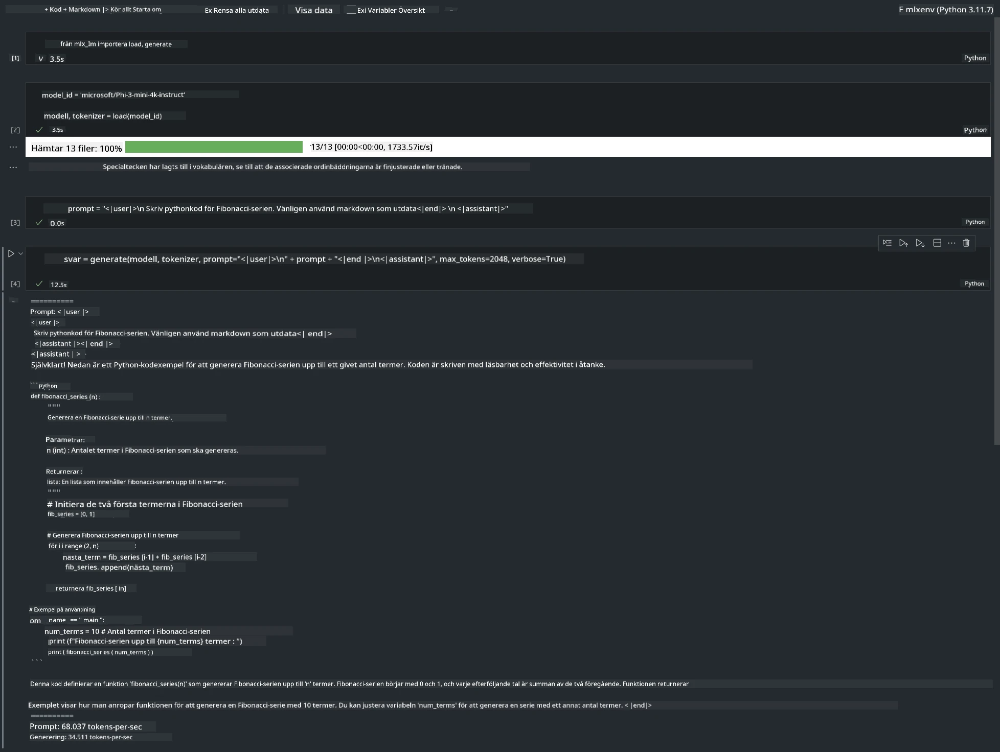

<!--
CO_OP_TRANSLATOR_METADATA:
{
  "original_hash": "dcb656f3d206fc4968e236deec5d4384",
  "translation_date": "2025-07-16T21:03:28+00:00",
  "source_file": "md/01.Introduction/03/MLX_Inference.md",
  "language_code": "sv"
}
-->
# **Inferens Phi-3 med Apple MLX Framework**

## **Vad är MLX Framework**

MLX är ett array-ramverk för maskininlärningsforskning på Apple silicon, utvecklat av Apples maskininlärningsforskare.

MLX är designat av maskininlärningsforskare för maskininlärningsforskare. Ramverket är tänkt att vara användarvänligt, men ändå effektivt för att träna och distribuera modeller. Själva designen av ramverket är också konceptuellt enkel. Vi vill göra det lätt för forskare att utöka och förbättra MLX med målet att snabbt kunna utforska nya idéer.

LLM:er kan accelereras på Apple Silicon-enheter via MLX, och modeller kan köras lokalt på ett mycket smidigt sätt.

## **Använda MLX för inferens av Phi-3-mini**

### **1. Ställ in din MLX-miljö**

1. Python 3.11.x  
2. Installera MLX-biblioteket

```bash

pip install mlx-lm

```

### **2. Köra Phi-3-mini i Terminal med MLX**

```bash

python -m mlx_lm.generate --model microsoft/Phi-3-mini-4k-instruct --max-token 2048 --prompt  "<|user|>\nCan you introduce yourself<|end|>\n<|assistant|>"

```

Resultatet (min miljö är Apple M1 Max, 64GB) är



### **3. Kvantisera Phi-3-mini med MLX i Terminal**

```bash

python -m mlx_lm.convert --hf-path microsoft/Phi-3-mini-4k-instruct

```

***Note：*** Modellen kan kvantiseras via mlx_lm.convert, och standardkvantiseringen är INT4. Detta exempel kvantiserar Phi-3-mini till INT4.

Modellen kan kvantiseras via mlx_lm.convert, och standardkvantiseringen är INT4. I detta exempel kvantiseras Phi-3-mini till INT4. Efter kvantisering sparas den i standardkatalogen ./mlx_model

Vi kan testa den kvantiserade modellen med MLX från terminalen

```bash

python -m mlx_lm.generate --model ./mlx_model/ --max-token 2048 --prompt  "<|user|>\nCan you introduce yourself<|end|>\n<|assistant|>"

```

Resultatet är



### **4. Köra Phi-3-mini med MLX i Jupyter Notebook**



***Note:*** Läs gärna detta exempel [klicka på denna länk](../../../../../code/03.Inference/MLX/MLX_DEMO.ipynb)

## **Resurser**

1. Läs om Apple MLX Framework [https://ml-explore.github.io](https://ml-explore.github.io/mlx/build/html/index.html)

2. Apple MLX GitHub Repo [https://github.com/ml-explore](https://github.com/ml-explore)

**Ansvarsfriskrivning**:  
Detta dokument har översatts med hjälp av AI-översättningstjänsten [Co-op Translator](https://github.com/Azure/co-op-translator). Även om vi strävar efter noggrannhet, vänligen observera att automatiska översättningar kan innehålla fel eller brister. Det ursprungliga dokumentet på dess modersmål bör betraktas som den auktoritativa källan. För kritisk information rekommenderas professionell mänsklig översättning. Vi ansvarar inte för några missförstånd eller feltolkningar som uppstår vid användning av denna översättning.