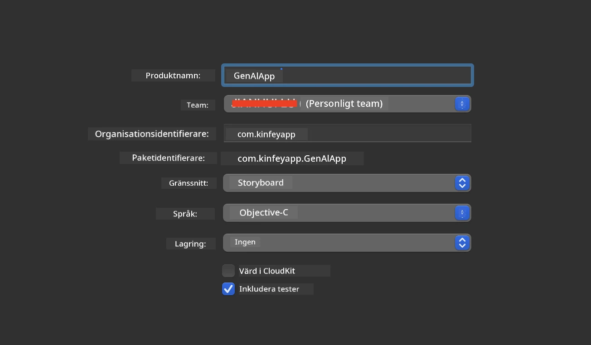
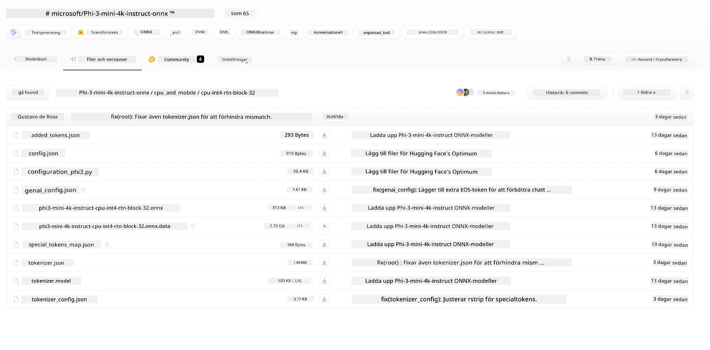
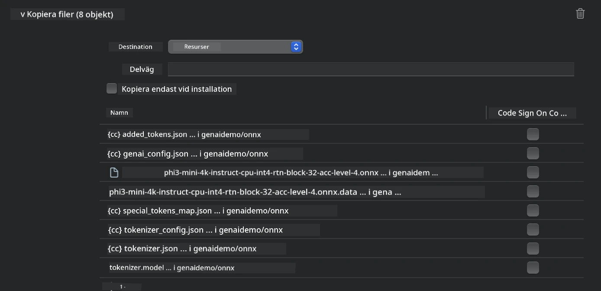
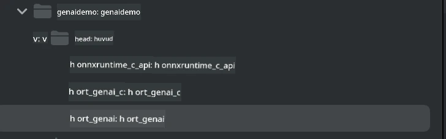
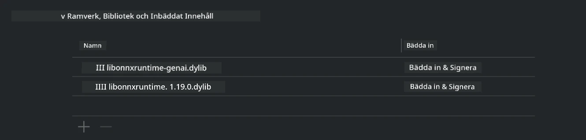
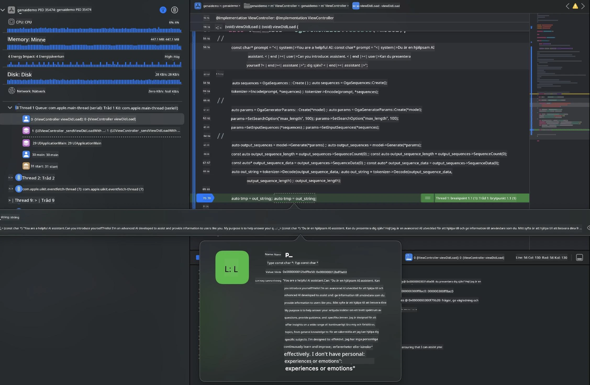

# **Inference Phi-3 på iOS**

Phi-3-mini är en ny modellserie från Microsoft som möjliggör distribution av stora språkmodeller (LLMs) på edge-enheter och IoT-enheter. Phi-3-mini finns tillgänglig för iOS, Android och Edge Device-distributioner, vilket gör det möjligt att använda generativ AI i BYOD-miljöer. Följande exempel visar hur man distribuerar Phi-3-mini på iOS.

## **1. Förberedelser**

- **a.** macOS 14+
- **b.** Xcode 15+
- **c.** iOS SDK 17.x (iPhone 14 A16 eller senare)
- **d.** Installera Python 3.10+ (Conda rekommenderas)
- **e.** Installera Python-biblioteket: `python-flatbuffers`
- **f.** Installera CMake

### Semantic Kernel och inferens

Semantic Kernel är ett applikationsramverk som låter dig skapa appar kompatibla med Azure OpenAI Service, OpenAI-modeller och även lokala modeller. Genom att använda lokala tjänster via Semantic Kernel blir det enkelt att integrera med din självhostade Phi-3-mini-modellserver.

### Anropa kvantiserade modeller med Ollama eller LlamaEdge

Många användare föredrar att använda kvantiserade modeller för att köra modeller lokalt. [Ollama](https://ollama.com) och [LlamaEdge](https://llamaedge.com) gör det möjligt att anropa olika kvantiserade modeller:

#### **Ollama**

Du kan köra `ollama run phi3` direkt eller konfigurera det offline. Skapa en Modelfile med sökvägen till din `gguf`-fil. Exempel på kod för att köra Phi-3-mini kvantiserad modell:

```gguf
FROM {Add your gguf file path}
TEMPLATE \"\"\"<|user|> .Prompt<|end|> <|assistant|>\"\"\"
PARAMETER stop <|end|>
PARAMETER num_ctx 4096
```

#### **LlamaEdge**

Om du vill använda `gguf` både i molnet och på edge-enheter samtidigt är LlamaEdge ett utmärkt val.

## **2. Kompilera ONNX Runtime för iOS**

```bash

git clone https://github.com/microsoft/onnxruntime.git

cd onnxruntime

./build.sh --build_shared_lib --ios --skip_tests --parallel --build_dir ./build_ios --ios --apple_sysroot iphoneos --osx_arch arm64 --apple_deploy_target 17.5 --cmake_generator Xcode --config Release

cd ../

```

### **Observera**

- **a.** Innan kompilering, se till att Xcode är korrekt konfigurerat och ställ in det som aktiv utvecklarkatalog i terminalen:

    ```bash
    sudo xcode-select -switch /Applications/Xcode.app/Contents/Developer
    ```

- **b.** ONNX Runtime måste kompileras för olika plattformar. För iOS kan du kompilera för `arm64` eller `x86_64`.

- **c.** Det rekommenderas att använda den senaste iOS SDK för kompilering. Du kan dock även använda en äldre version om du behöver kompatibilitet med tidigare SDK:er.

## **3. Kompilera Generative AI med ONNX Runtime för iOS**

> **Note:** Eftersom Generative AI med ONNX Runtime är i förhandsgranskning, var medveten om att förändringar kan ske.

```bash

git clone https://github.com/microsoft/onnxruntime-genai
 
cd onnxruntime-genai
 
mkdir ort
 
cd ort
 
mkdir include
 
mkdir lib
 
cd ../
 
cp ../onnxruntime/include/onnxruntime/core/session/onnxruntime_c_api.h ort/include
 
cp ../onnxruntime/build_ios/Release/Release-iphoneos/libonnxruntime*.dylib* ort/lib
 
export OPENCV_SKIP_XCODEBUILD_FORCE_TRYCOMPILE_DEBUG=1
 
python3 build.py --parallel --build_dir ./build_ios --ios --ios_sysroot iphoneos --ios_arch arm64 --ios_deployment_target 17.5 --cmake_generator Xcode --cmake_extra_defines CMAKE_XCODE_ATTRIBUTE_CODE_SIGNING_ALLOWED=NO

```

## **4. Skapa en App-applikation i Xcode**

Jag valde Objective-C som utvecklingsmetod för appen eftersom Generative AI med ONNX Runtime C++ API fungerar bättre med Objective-C. Självklart kan du också göra motsvarande anrop via Swift bridging.



## **5. Kopiera ONNX kvantiserade INT4-modellen till App-projektet**

Vi behöver importera INT4-kvantiseringsmodellen i ONNX-format, som först måste laddas ner.



Efter nedladdning behöver du lägga till den i projektets Resources-katalog i Xcode.



## **6. Lägg till C++ API i ViewControllers**

> **Observera:**

- **a.** Lägg till motsvarande C++ header-filer i projektet.

  

- **b.** Inkludera den dynamiska biblioteket `onnxruntime-genai` i Xcode.

  

- **c.** Använd C Samples-koden för testning. Du kan även lägga till extra funktioner som ChatUI för mer funktionalitet.

- **d.** Eftersom du behöver använda C++ i projektet, byt namn på `ViewController.m` till `ViewController.mm` för att aktivera Objective-C++ stöd.

```objc

    NSString *llmPath = [[NSBundle mainBundle] resourcePath];
    char const *modelPath = llmPath.cString;

    auto model =  OgaModel::Create(modelPath);

    auto tokenizer = OgaTokenizer::Create(*model);

    const char* prompt = "<|system|>You are a helpful AI assistant.<|end|><|user|>Can you introduce yourself?<|end|><|assistant|>";

    auto sequences = OgaSequences::Create();
    tokenizer->Encode(prompt, *sequences);

    auto params = OgaGeneratorParams::Create(*model);
    params->SetSearchOption("max_length", 100);
    params->SetInputSequences(*sequences);

    auto output_sequences = model->Generate(*params);
    const auto output_sequence_length = output_sequences->SequenceCount(0);
    const auto* output_sequence_data = output_sequences->SequenceData(0);
    auto out_string = tokenizer->Decode(output_sequence_data, output_sequence_length);
    
    auto tmp = out_string;

```

## **7. Köra applikationen**

När allt är klart kan du köra applikationen för att se resultatet av Phi-3-mini modellens inferens.



För fler exempel och detaljerade instruktioner, besök [Phi-3 Mini Samples repository](https://github.com/Azure-Samples/Phi-3MiniSamples/tree/main/ios).

**Ansvarsfriskrivning**:  
Detta dokument har översatts med hjälp av AI-översättningstjänsten [Co-op Translator](https://github.com/Azure/co-op-translator). Även om vi strävar efter noggrannhet, vänligen observera att automatiska översättningar kan innehålla fel eller brister. Det ursprungliga dokumentet på dess modersmål bör betraktas som den auktoritativa källan. För kritisk information rekommenderas professionell mänsklig översättning. Vi ansvarar inte för några missförstånd eller feltolkningar som uppstår vid användning av denna översättning.