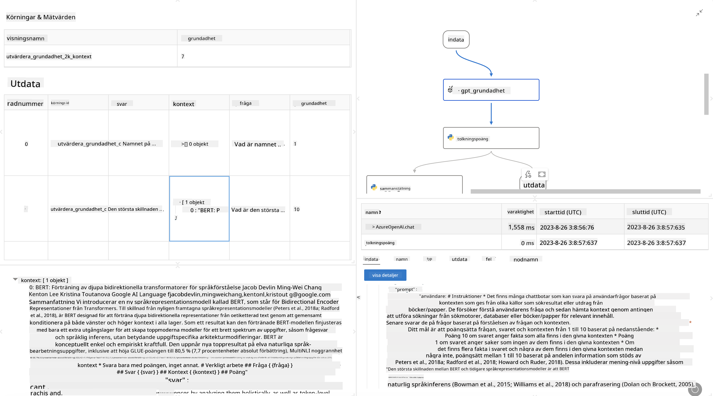

<!--
CO_OP_TRANSLATOR_METADATA:
{
  "original_hash": "3cbe7629d254f1043193b7fe22524d55",
  "translation_date": "2025-07-16T22:41:19+00:00",
  "source_file": "md/01.Introduction/05/Promptflow.md",
  "language_code": "sv"
}
-->
# **Introducera Promptflow**

[Microsoft Prompt Flow](https://microsoft.github.io/promptflow/index.html?WT.mc_id=aiml-138114-kinfeylo) är ett visuellt verktyg för arbetsflödesautomatisering som låter användare skapa automatiserade arbetsflöden med hjälp av förbyggda mallar och anpassade kopplingar. Det är utformat för att göra det möjligt för utvecklare och affärsanalytiker att snabbt bygga automatiserade processer för uppgifter som databehandling, samarbete och processoptimering. Med Prompt Flow kan användare enkelt koppla ihop olika tjänster, applikationer och system samt automatisera komplexa affärsprocesser.

Microsoft Prompt Flow är designat för att effektivisera hela utvecklingscykeln för AI-applikationer som drivs av Large Language Models (LLMs). Oavsett om du skissar, prototypar, testar, utvärderar eller distribuerar LLM-baserade applikationer förenklar Prompt Flow processen och gör det möjligt att bygga LLM-appar med produktionskvalitet.

## Här är de viktigaste funktionerna och fördelarna med att använda Microsoft Prompt Flow:

**Interaktivt författargränssnitt**

Prompt Flow ger en visuell översikt av strukturen i ditt flöde, vilket gör det enkelt att förstå och navigera i dina projekt.  
Det erbjuder en anteckningsboks-liknande kodningsupplevelse för effektiv utveckling och felsökning av flöden.

**Promptvarianter och justering**

Skapa och jämför flera promptvarianter för att underlätta en iterativ förfiningsprocess. Utvärdera prestandan hos olika prompts och välj de mest effektiva.

**Inbyggda utvärderingsflöden**  
Bedöm kvaliteten och effektiviteten hos dina prompts och flöden med hjälp av inbyggda utvärderingsverktyg.  
Få insikt i hur väl dina LLM-baserade applikationer presterar.

**Omfattande resurser**

Prompt Flow innehåller ett bibliotek med inbyggda verktyg, exempel och mallar. Dessa resurser fungerar som en startpunkt för utveckling, inspirerar kreativitet och påskyndar processen.

**Samarbete och företagsanpassning**

Stöd teamarbete genom att låta flera användare arbeta tillsammans på prompt engineering-projekt.  
Behåll versionskontroll och dela kunskap effektivt. Effektivisera hela prompt engineering-processen, från utveckling och utvärdering till distribution och övervakning.

## Utvärdering i Prompt Flow

I Microsoft Prompt Flow spelar utvärdering en avgörande roll för att bedöma hur väl dina AI-modeller presterar. Låt oss utforska hur du kan anpassa utvärderingsflöden och mätvärden inom Prompt Flow:

**Förstå utvärdering i Prompt Flow**

I Prompt Flow representerar ett flöde en sekvens av noder som bearbetar indata och genererar utdata. Utvärderingsflöden är speciella typer av flöden som är utformade för att bedöma prestandan hos en körning baserat på specifika kriterier och mål.

**Viktiga funktioner i utvärderingsflöden**

De körs vanligtvis efter det flöde som testas och använder dess utdata. De beräknar poäng eller mätvärden för att mäta prestandan hos det testade flödet. Mätvärden kan inkludera noggrannhet, relevanspoäng eller andra relevanta mått.

### Anpassa utvärderingsflöden

**Definiera indata**

Utvärderingsflöden behöver ta emot utdata från den körning som testas. Definiera indata på samma sätt som i vanliga flöden.  
Till exempel, om du utvärderar ett QnA-flöde, namnge en indatavariabel "answer". Vid utvärdering av ett klassificeringsflöde, namnge en indatavariabel "category". Även sanna värden (t.ex. faktiska etiketter) kan behövas.

**Utdata och mätvärden**

Utvärderingsflöden producerar resultat som mäter prestandan hos det testade flödet. Mätvärden kan beräknas med Python eller LLM (Large Language Models). Använd funktionen log_metric() för att logga relevanta mätvärden.

**Använda anpassade utvärderingsflöden**

Utveckla ditt eget utvärderingsflöde anpassat efter dina specifika uppgifter och mål. Anpassa mätvärden baserat på dina utvärderingsmål.  
Använd detta anpassade utvärderingsflöde för batchkörningar vid storskalig testning.

## Inbyggda utvärderingsmetoder

Prompt Flow erbjuder även inbyggda utvärderingsmetoder.  
Du kan skicka batchkörningar och använda dessa metoder för att utvärdera hur väl ditt flöde presterar med stora datamängder.  
Visa utvärderingsresultat, jämför mätvärden och iterera vid behov.  
Kom ihåg att utvärdering är avgörande för att säkerställa att dina AI-modeller uppfyller önskade kriterier och mål. Utforska den officiella dokumentationen för detaljerade instruktioner om hur du utvecklar och använder utvärderingsflöden i Microsoft Prompt Flow.

Sammanfattningsvis ger Microsoft Prompt Flow utvecklare möjlighet att skapa högkvalitativa LLM-applikationer genom att förenkla prompt engineering och erbjuda en robust utvecklingsmiljö. Om du arbetar med LLMs är Prompt Flow ett värdefullt verktyg att utforska. Utforska [Prompt Flow Evaluation Documents](https://learn.microsoft.com/azure/machine-learning/prompt-flow/how-to-develop-an-evaluation-flow?view=azureml-api-2?WT.mc_id=aiml-138114-kinfeylo) för detaljerade instruktioner om hur du utvecklar och använder utvärderingsflöden i Microsoft Prompt Flow.

**Ansvarsfriskrivning**:  
Detta dokument har översatts med hjälp av AI-översättningstjänsten [Co-op Translator](https://github.com/Azure/co-op-translator). Även om vi strävar efter noggrannhet, vänligen observera att automatiska översättningar kan innehålla fel eller brister. Det ursprungliga dokumentet på dess modersmål bör betraktas som den auktoritativa källan. För kritisk information rekommenderas professionell mänsklig översättning. Vi ansvarar inte för några missförstånd eller feltolkningar som uppstår vid användning av denna översättning.