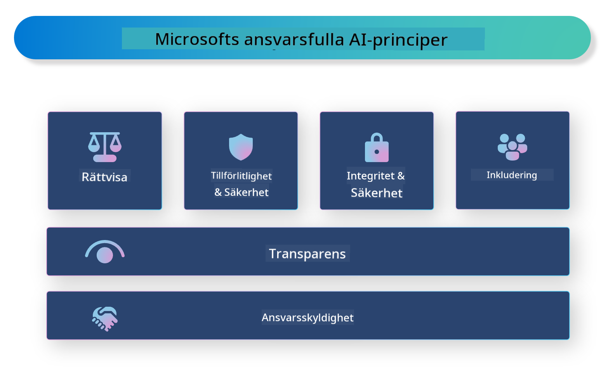

<!--
CO_OP_TRANSLATOR_METADATA:
{
  "original_hash": "805b96b20152936d8f4c587d90d6e06e",
  "translation_date": "2025-07-16T22:53:49+00:00",
  "source_file": "md/01.Introduction/05/ResponsibleAI.md",
  "language_code": "sv"
}
-->
# **Introducera Responsible AI**

[Microsoft Responsible AI](https://www.microsoft.com/ai/responsible-ai?WT.mc_id=aiml-138114-kinfeylo) är ett initiativ som syftar till att hjälpa utvecklare och organisationer att bygga AI-system som är transparenta, pålitliga och ansvarstagande. Initiativet erbjuder vägledning och resurser för att utveckla ansvarsfulla AI-lösningar som följer etiska principer, såsom integritet, rättvisa och transparens. Vi kommer även att titta på några av de utmaningar och bästa metoder som är kopplade till att bygga ansvarsfulla AI-system.

## Översikt av Microsoft Responsible AI

**Etiska principer**

Microsoft Responsible AI styrs av en uppsättning etiska principer, såsom integritet, rättvisa, transparens, ansvar och säkerhet. Dessa principer är utformade för att säkerställa att AI-system utvecklas på ett etiskt och ansvarsfullt sätt.

**Transparent AI**

Microsoft Responsible AI betonar vikten av transparens i AI-system. Detta inkluderar att ge tydliga förklaringar om hur AI-modeller fungerar, samt att säkerställa att datakällor och algoritmer är offentligt tillgängliga.

**Ansvarsfull AI**

[Microsoft Responsible AI](https://www.microsoft.com/ai/responsible-ai?WT.mc_id=aiml-138114-kinfeylo) främjar utvecklingen av ansvarsfulla AI-system som kan ge insikter i hur AI-modeller fattar beslut. Detta kan hjälpa användare att förstå och lita på resultaten från AI-systemen.

**Inkludering**

AI-system bör utformas för att gynna alla. Microsoft strävar efter att skapa inkluderande AI som tar hänsyn till olika perspektiv och undviker partiskhet eller diskriminering.

**Tillförlitlighet och säkerhet**

Att säkerställa att AI-system är tillförlitliga och säkra är avgörande. Microsoft fokuserar på att bygga robusta modeller som presterar konsekvent och undviker skadliga resultat.

**Rättvisa i AI**

Microsoft Responsible AI erkänner att AI-system kan förstärka fördomar om de tränas på partisk data eller algoritmer. Initiativet ger vägledning för att utveckla rättvisa AI-system som inte diskriminerar baserat på faktorer som ras, kön eller ålder.

**Integritet och säkerhet**

Microsoft Responsible AI betonar vikten av att skydda användarens integritet och datasäkerhet i AI-system. Detta inkluderar att implementera stark datakryptering och åtkomstkontroller samt att regelbundet granska AI-system för sårbarheter.

**Ansvar och ansvarstagande**

Microsoft Responsible AI främjar ansvar och ansvarstagande i AI-utveckling och implementering. Detta innebär att säkerställa att utvecklare och organisationer är medvetna om de potentiella riskerna med AI-system och vidtar åtgärder för att minska dessa risker.

## Bästa metoder för att bygga ansvarsfulla AI-system

**Utveckla AI-modeller med hjälp av mångsidiga datamängder**

För att undvika partiskhet i AI-system är det viktigt att använda mångsidiga datamängder som representerar olika perspektiv och erfarenheter.

**Använd förklarbar AI-teknik**

Förklarbar AI-teknik kan hjälpa användare att förstå hur AI-modeller fattar beslut, vilket kan öka förtroendet för systemet.

**Granska AI-system regelbundet för sårbarheter**

Regelbundna granskningar av AI-system kan hjälpa till att identifiera potentiella risker och sårbarheter som behöver åtgärdas.

**Implementera stark datakryptering och åtkomstkontroller**

Datakryptering och åtkomstkontroller kan bidra till att skydda användarens integritet och säkerhet i AI-system.

**Följ etiska principer i AI-utveckling**

Att följa etiska principer, såsom rättvisa, transparens och ansvar, kan bidra till att bygga förtroende för AI-system och säkerställa att de utvecklas på ett ansvarsfullt sätt.

## Använda AI Foundry för Responsible AI

[Azure AI Foundry](https://ai.azure.com?WT.mc_id=aiml-138114-kinfeylo) är en kraftfull plattform som gör det möjligt för utvecklare och organisationer att snabbt skapa intelligenta, avancerade, marknadsklara och ansvarsfulla applikationer. Här är några viktiga funktioner och möjligheter i Azure AI Foundry:

**Färdiga API:er och modeller**

Azure AI Foundry erbjuder förbyggda och anpassningsbara API:er och modeller. Dessa täcker ett brett spektrum av AI-uppgifter, inklusive generativ AI, naturlig språkbehandling för konversationer, sökning, övervakning, översättning, tal, vision och beslutsfattande.

**Prompt Flow**

Prompt flow i Azure AI Foundry gör det möjligt att skapa konverserande AI-upplevelser. Det låter dig designa och hantera konversationsflöden, vilket förenklar byggandet av chatbots, virtuella assistenter och andra interaktiva applikationer.

**Retrieval Augmented Generation (RAG)**

RAG är en teknik som kombinerar sökbaserade och generativa metoder. Den förbättrar kvaliteten på genererade svar genom att utnyttja både befintlig kunskap (sökning) och kreativ generering (generering).

**Utvärderings- och övervakningsmått för generativ AI**

Azure AI Foundry erbjuder verktyg för att utvärdera och övervaka generativa AI-modeller. Du kan bedöma deras prestanda, rättvisa och andra viktiga mått för att säkerställa ansvarsfull implementering. Dessutom, om du har skapat en dashboard, kan du använda den kodfria användargränssnittet i Azure Machine Learning Studio för att anpassa och generera en Responsible AI Dashboard och tillhörande scorecard baserat på [Responsible AI Toolbox](https://responsibleaitoolbox.ai/?WT.mc_id=aiml-138114-kinfeylo) Python-bibliotek. Detta scorecard hjälper dig att dela viktiga insikter kring rättvisa, funktionsvikt och andra ansvarsfulla implementeringsaspekter med både tekniska och icke-tekniska intressenter.

För att använda AI Foundry med Responsible AI kan du följa dessa bästa metoder:

**Definiera problemet och målen för ditt AI-system**

Innan utvecklingsprocessen påbörjas är det viktigt att tydligt definiera det problem eller mål som ditt AI-system ska lösa. Detta hjälper dig att identifiera vilka data, algoritmer och resurser som behövs för att bygga en effektiv modell.

**Samla in och förbehandla relevant data**

Kvaliteten och mängden data som används för att träna ett AI-system kan ha stor påverkan på dess prestanda. Därför är det viktigt att samla in relevant data, rengöra den, förbehandla den och säkerställa att den är representativ för den population eller det problem du försöker lösa.

**Välj lämplig utvärderingsmetod**

Det finns olika utvärderingsalgoritmer tillgängliga. Det är viktigt att välja den mest lämpliga algoritmen baserat på din data och ditt problem.

**Utvärdera och tolka modellen**

När du har byggt en AI-modell är det viktigt att utvärdera dess prestanda med lämpliga mått och tolka resultaten på ett transparent sätt. Detta hjälper dig att identifiera eventuella partiskheter eller begränsningar i modellen och göra förbättringar där det behövs.

**Säkerställ transparens och förklarbarhet**

AI-system bör vara transparenta och förklarbara så att användare kan förstå hur de fungerar och hur beslut fattas. Detta är särskilt viktigt för applikationer som har stor påverkan på människors liv, såsom inom vård, finans och rättssystem.

**Övervaka och uppdatera modellen**

AI-system bör kontinuerligt övervakas och uppdateras för att säkerställa att de förblir korrekta och effektiva över tid. Detta kräver löpande underhåll, testning och omträning av modellen.

Avslutningsvis är Microsoft Responsible AI ett initiativ som syftar till att hjälpa utvecklare och organisationer att bygga AI-system som är transparenta, pålitliga och ansvarstagande. Kom ihåg att ansvarsfull AI-implementering är avgörande, och Azure AI Foundry strävar efter att göra detta praktiskt för organisationer. Genom att följa etiska principer och bästa metoder kan vi säkerställa att AI-system utvecklas och implementeras på ett ansvarsfullt sätt som gynnar samhället som helhet.

**Ansvarsfriskrivning**:  
Detta dokument har översatts med hjälp av AI-översättningstjänsten [Co-op Translator](https://github.com/Azure/co-op-translator). Även om vi strävar efter noggrannhet, vänligen observera att automatiska översättningar kan innehålla fel eller brister. Det ursprungliga dokumentet på dess modersmål bör betraktas som den auktoritativa källan. För kritisk information rekommenderas professionell mänsklig översättning. Vi ansvarar inte för några missförstånd eller feltolkningar som uppstår vid användning av denna översättning.