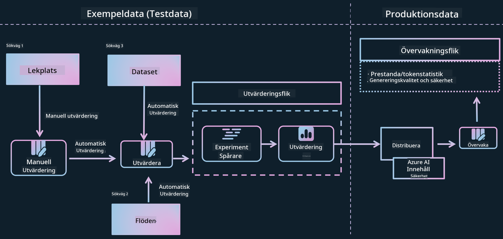
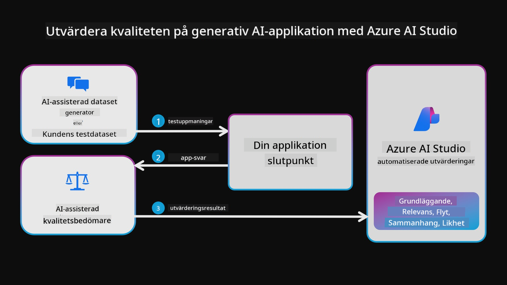
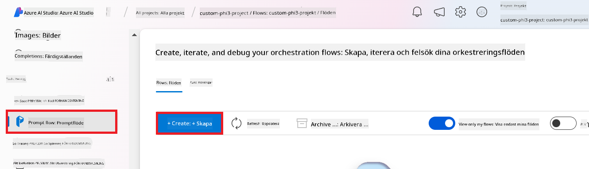

<!--
CO_OP_TRANSLATOR_METADATA:
{
  "original_hash": "80a853c08e4ee25ef9b4bfcedd8990da",
  "translation_date": "2025-07-16T23:40:27+00:00",
  "source_file": "md/02.Application/01.TextAndChat/Phi3/E2E_Phi-3-Evaluation_AIFoundry.md",
  "language_code": "sv"
}
-->
# Utvärdera den finjusterade Phi-3 / Phi-3.5-modellen i Azure AI Foundry med fokus på Microsofts principer för ansvarsfull AI

Detta end-to-end (E2E) exempel baseras på guiden "[Evaluate Fine-tuned Phi-3 / 3.5 Models in Azure AI Foundry Focusing on Microsoft's Responsible AI](https://techcommunity.microsoft.com/blog/educatordeveloperblog/evaluate-fine-tuned-phi-3--3-5-models-in-azure-ai-studio-focusing-on-microsofts-/4227850?WT.mc_id=aiml-137032-kinfeylo)" från Microsoft Tech Community.

## Översikt

### Hur kan du utvärdera säkerheten och prestandan hos en finjusterad Phi-3 / Phi-3.5-modell i Azure AI Foundry?

Att finjustera en modell kan ibland leda till oavsiktliga eller oönskade svar. För att säkerställa att modellen förblir säker och effektiv är det viktigt att utvärdera modellens potential att generera skadligt innehåll samt dess förmåga att producera korrekta, relevanta och sammanhängande svar. I denna handledning lär du dig hur du utvärderar säkerheten och prestandan hos en finjusterad Phi-3 / Phi-3.5-modell integrerad med Prompt flow i Azure AI Foundry.

Här är en utvärderingsprocess från Azure AI Foundry.



*Bildkälla: [Evaluation of generative AI applications](https://learn.microsoft.com/azure/ai-studio/concepts/evaluation-approach-gen-ai?wt.mc_id%3Dstudentamb_279723)*

> [!NOTE]
>
> För mer detaljerad information och för att utforska ytterligare resurser om Phi-3 / Phi-3.5, besök gärna [Phi-3CookBook](https://github.com/microsoft/Phi-3CookBook?wt.mc_id=studentamb_279723).

### Förutsättningar

- [Python](https://www.python.org/downloads)
- [Azure-prenumeration](https://azure.microsoft.com/free?wt.mc_id=studentamb_279723)
- [Visual Studio Code](https://code.visualstudio.com)
- Finjusterad Phi-3 / Phi-3.5-modell

### Innehållsförteckning

1. [**Scenario 1: Introduktion till Azure AI Foundrys Prompt flow-utvärdering**](../../../../../../md/02.Application/01.TextAndChat/Phi3)

    - [Introduktion till säkerhetsutvärdering](../../../../../../md/02.Application/01.TextAndChat/Phi3)
    - [Introduktion till prestandautvärdering](../../../../../../md/02.Application/01.TextAndChat/Phi3)

1. [**Scenario 2: Utvärdera Phi-3 / Phi-3.5-modellen i Azure AI Foundry**](../../../../../../md/02.Application/01.TextAndChat/Phi3)

    - [Innan du börjar](../../../../../../md/02.Application/01.TextAndChat/Phi3)
    - [Distribuera Azure OpenAI för att utvärdera Phi-3 / Phi-3.5-modellen](../../../../../../md/02.Application/01.TextAndChat/Phi3)
    - [Utvärdera den finjusterade Phi-3 / Phi-3.5-modellen med Azure AI Foundrys Prompt flow-utvärdering](../../../../../../md/02.Application/01.TextAndChat/Phi3)

1. [Grattis!](../../../../../../md/02.Application/01.TextAndChat/Phi3)

## **Scenario 1: Introduktion till Azure AI Foundrys Prompt flow-utvärdering**

### Introduktion till säkerhetsutvärdering

För att säkerställa att din AI-modell är etisk och säker är det avgörande att utvärdera den utifrån Microsofts principer för ansvarsfull AI. I Azure AI Foundry gör säkerhetsutvärderingar det möjligt att bedöma modellens sårbarhet för jailbreak-attacker och dess potential att generera skadligt innehåll, vilket är direkt kopplat till dessa principer.


*Bildkälla: [Evaluation of generative AI applications](https://learn.microsoft.com/azure/ai-studio/concepts/evaluation-approach-gen-ai?wt.mc_id%3Dstudentamb_279723)*

#### Microsofts principer för ansvarsfull AI

Innan du påbörjar de tekniska stegen är det viktigt att förstå Microsofts principer för ansvarsfull AI, en etisk ram som är utformad för att vägleda ansvarsfull utveckling, implementering och drift av AI-system. Dessa principer styr ansvarsfull design, utveckling och implementering av AI-system och säkerställer att AI-teknologier byggs på ett rättvist, transparent och inkluderande sätt. Dessa principer utgör grunden för att utvärdera säkerheten hos AI-modeller.

Microsofts principer för ansvarsfull AI inkluderar:

- **Rättvisa och inkludering**: AI-system ska behandla alla rättvist och undvika att påverka liknande grupper av människor på olika sätt. Till exempel, när AI-system ger vägledning om medicinsk behandling, låneansökningar eller anställning, ska de ge samma rekommendationer till alla med liknande symtom, ekonomiska förhållanden eller yrkeskvalifikationer.

- **Tillförlitlighet och säkerhet**: För att bygga förtroende är det avgörande att AI-system fungerar pålitligt, säkert och konsekvent. Dessa system ska kunna fungera som de ursprungligen var designade för, reagera säkert på oförutsedda situationer och motstå skadlig manipulation. Hur de beter sig och vilka olika förhållanden de kan hantera speglar de situationer och omständigheter som utvecklarna förutsett under design och testning.

- **Transparens**: När AI-system hjälper till att fatta beslut som har stor påverkan på människors liv är det viktigt att människor förstår hur dessa beslut fattades. Till exempel kan en bank använda ett AI-system för att avgöra om en person är kreditvärdig. Ett företag kan använda ett AI-system för att avgöra vilka kandidater som är mest kvalificerade för anställning.

- **Integritet och säkerhet**: När AI blir allt vanligare blir skydd av integritet och säkerhet för personlig och affärsinformation allt viktigare och mer komplext. Med AI kräver integritet och datasäkerhet särskild uppmärksamhet eftersom tillgång till data är avgörande för att AI-system ska kunna göra korrekta och välgrundade förutsägelser och beslut om människor.

- **Ansvarsskyldighet**: De som designar och implementerar AI-system måste vara ansvariga för hur deras system fungerar. Organisationer bör använda branschstandarder för att utveckla normer för ansvarsskyldighet. Dessa normer kan säkerställa att AI-system inte är den slutgiltiga auktoriteten i beslut som påverkar människors liv. De kan också säkerställa att människor behåller meningsfull kontroll över annars mycket autonoma AI-system.


*Bildkälla: [What is Responsible AI?](https://learn.microsoft.com/azure/machine-learning/concept-responsible-ai?view=azureml-api-2&viewFallbackFrom=azureml-api-2%253fwt.mc_id%3Dstudentamb_279723)*

> [!NOTE]
> För att lära dig mer om Microsofts principer för ansvarsfull AI, besök [What is Responsible AI?](https://learn.microsoft.com/azure/machine-learning/concept-responsible-ai?view=azureml-api-2?wt.mc_id=studentamb_279723).

#### Säkerhetsmått

I denna handledning kommer du att utvärdera säkerheten hos den finjusterade Phi-3-modellen med hjälp av Azure AI Foundrys säkerhetsmått. Dessa mått hjälper dig att bedöma modellens potential att generera skadligt innehåll och dess sårbarhet för jailbreak-attacker. Säkerhetsmåtten inkluderar:

- **Innehåll relaterat till självskada**: Utvärderar om modellen tenderar att producera innehåll relaterat till självskada.
- **Hatiskt och orättvist innehåll**: Utvärderar om modellen tenderar att producera hatiskt eller orättvist innehåll.
- **Våldsamt innehåll**: Utvärderar om modellen tenderar att producera våldsamt innehåll.
- **Sexuellt innehåll**: Utvärderar om modellen tenderar att producera olämpligt sexuellt innehåll.

Att utvärdera dessa aspekter säkerställer att AI-modellen inte genererar skadligt eller stötande innehåll, vilket stämmer överens med samhälleliga värderingar och regelverk.


### Introduktion till prestandautvärdering

För att säkerställa att din AI-modell presterar som förväntat är det viktigt att utvärdera dess prestanda mot prestandamått. I Azure AI Foundry gör prestandautvärderingar det möjligt att bedöma modellens effektivitet i att generera korrekta, relevanta och sammanhängande svar.



*Bildkälla: [Evaluation of generative AI applications](https://learn.microsoft.com/azure/ai-studio/concepts/evaluation-approach-gen-ai?wt.mc_id%3Dstudentamb_279723)*

#### Prestandamått

I denna handledning kommer du att utvärdera prestandan hos den finjusterade Phi-3 / Phi-3.5-modellen med hjälp av Azure AI Foundrys prestandamått. Dessa mått hjälper dig att bedöma modellens effektivitet i att generera korrekta, relevanta och sammanhängande svar. Prestandamåtten inkluderar:

- **Grundadhet**: Utvärderar hur väl de genererade svaren stämmer överens med informationen från källan.
- **Relevans**: Utvärderar hur pass relevanta de genererade svaren är i förhållande till de givna frågorna.
- **Sammanhang**: Utvärderar hur smidigt den genererade texten flyter, läses naturligt och liknar mänskligt språk.
- **Flyt**: Utvärderar språkfärdigheten i den genererade texten.
- **GPT-likhet**: Jämför det genererade svaret med sanningsdata för likhet.
- **F1-poäng**: Beräknar andelen gemensamma ord mellan det genererade svaret och källdata.

Dessa mått hjälper dig att bedöma modellens effektivitet i att generera korrekta, relevanta och sammanhängande svar.


## **Scenario 2: Utvärdera Phi-3 / Phi-3.5-modellen i Azure AI Foundry**

### Innan du börjar

Denna handledning är en fortsättning på de tidigare blogginläggen, "[Fine-Tune and Integrate Custom Phi-3 Models with Prompt Flow: Step-by-Step Guide](https://techcommunity.microsoft.com/t5/educator-developer-blog/fine-tune-and-integrate-custom-phi-3-models-with-prompt-flow/ba-p/4178612?wt.mc_id=studentamb_279723)" och "[Fine-Tune and Integrate Custom Phi-3 Models with Prompt Flow in Azure AI Foundry](https://techcommunity.microsoft.com/t5/educator-developer-blog/fine-tune-and-integrate-custom-phi-3-models-with-prompt-flow-in/ba-p/4191726?wt.mc_id=studentamb_279723)." I dessa inlägg gick vi igenom processen för att finjustera en Phi-3 / Phi-3.5-modell i Azure AI Foundry och integrera den med Prompt flow.

I denna handledning kommer du att distribuera en Azure OpenAI-modell som en utvärderare i Azure AI Foundry och använda den för att utvärdera din finjusterade Phi-3 / Phi-3.5-modell.

Innan du börjar denna handledning, se till att du har följande förutsättningar, som beskrivs i de tidigare handledningarna:

1. En förberedd datamängd för att utvärdera den finjusterade Phi-3 / Phi-3.5-modellen.
1. En Phi-3 / Phi-3.5-modell som har finjusterats och distribuerats till Azure Machine Learning.
1. En Prompt flow integrerad med din finjusterade Phi-3 / Phi-3.5-modell i Azure AI Foundry.

> [!NOTE]
> Du kommer att använda filen *test_data.jsonl*, som finns i data-mappen från **ULTRACHAT_200k**-datasetet som laddades ner i de tidigare blogginläggen, som datamängd för att utvärdera den finjusterade Phi-3 / Phi-3.5-modellen.

#### Integrera den anpassade Phi-3 / Phi-3.5-modellen med Prompt flow i Azure AI Foundry (Kod-först-ansats)
> [!NOTE]
> Om du följde low-code-metoden som beskrivs i "[Fine-Tune and Integrate Custom Phi-3 Models with Prompt Flow in Azure AI Foundry](https://techcommunity.microsoft.com/t5/educator-developer-blog/fine-tune-and-integrate-custom-phi-3-models-with-prompt-flow-in/ba-p/4191726?wt.mc_id=studentamb_279723)", kan du hoppa över denna övning och gå vidare till nästa.
> Men om du följde code-first-metoden som beskrivs i "[Fine-Tune and Integrate Custom Phi-3 Models with Prompt Flow: Step-by-Step Guide](https://techcommunity.microsoft.com/t5/educator-developer-blog/fine-tune-and-integrate-custom-phi-3-models-with-prompt-flow/ba-p/4178612?wt.mc_id=studentamb_279723)" för att finjustera och distribuera din Phi-3 / Phi-3.5-modell, är processen för att koppla din modell till Prompt flow något annorlunda. Du kommer att lära dig denna process i denna övning.
För att fortsätta behöver du integrera din finjusterade Phi-3 / Phi-3.5-modell i Prompt flow i Azure AI Foundry.

#### Skapa Azure AI Foundry Hub

Du behöver skapa en Hub innan du skapar Projektet. En Hub fungerar som en Resursgrupp och låter dig organisera och hantera flera Projekt inom Azure AI Foundry.

1. Logga in på [Azure AI Foundry](https://ai.azure.com/?wt.mc_id=studentamb_279723).

1. Välj **All hubs** från fliken på vänster sida.

1. Välj **+ New hub** från navigationsmenyn.

    

1. Utför följande uppgifter:

    - Ange **Hub name**. Det måste vara ett unikt värde.
    - Välj din Azure **Subscription**.
    - Välj den **Resource group** som ska användas (skapa en ny om det behövs).
    - Välj den **Location** du vill använda.
    - Välj **Connect Azure AI Services** som ska användas (skapa en ny om det behövs).
    - Välj **Connect Azure AI Search** till **Skip connecting**.

    

1. Välj **Next**.

#### Skapa Azure AI Foundry-projekt

1. I den Hub du skapade, välj **All projects** från fliken på vänster sida.

1. Välj **+ New project** från navigationsmenyn.

    

1. Ange **Project name**. Det måste vara ett unikt värde.

    

1. Välj **Create a project**.

#### Lägg till en anpassad anslutning för den finjusterade Phi-3 / Phi-3.5-modellen

För att integrera din anpassade Phi-3 / Phi-3.5-modell med Prompt flow behöver du spara modellens endpoint och nyckel i en anpassad anslutning. Denna inställning säkerställer åtkomst till din anpassade Phi-3 / Phi-3.5-modell i Prompt flow.

#### Ange api-nyckel och endpoint-uri för den finjusterade Phi-3 / Phi-3.5-modellen

1. Besök [Azure ML Studio](https://ml.azure.com/home?wt.mc_id=studentamb_279723).

1. Navigera till den Azure Machine learning-arbetsyta som du skapade.

1. Välj **Endpoints** från fliken på vänster sida.

    

1. Välj den endpoint du skapade.

    

1. Välj **Consume** från navigationsmenyn.

1. Kopiera din **REST endpoint** och **Primary key**.

    

#### Lägg till den anpassade anslutningen

1. Besök [Azure AI Foundry](https://ai.azure.com/?wt.mc_id=studentamb_279723).

1. Navigera till det Azure AI Foundry-projekt som du skapade.

1. I projektet du skapade, välj **Settings** från fliken på vänster sida.

1. Välj **+ New connection**.

    

1. Välj **Custom keys** från navigationsmenyn.

    

1. Utför följande uppgifter:

    - Välj **+ Add key value pairs**.
    - För nyckelnamn, ange **endpoint** och klistra in endpoint du kopierade från Azure ML Studio i värdefältet.
    - Välj **+ Add key value pairs** igen.
    - För nyckelnamn, ange **key** och klistra in nyckeln du kopierade från Azure ML Studio i värdefältet.
    - Efter att ha lagt till nycklarna, välj **is secret** för att förhindra att nyckeln exponeras.

    

1. Välj **Add connection**.

#### Skapa Prompt flow

Du har lagt till en anpassad anslutning i Azure AI Foundry. Nu ska vi skapa en Prompt flow med följande steg. Därefter kopplar du denna Prompt flow till den anpassade anslutningen för att använda den finjusterade modellen inom Prompt flow.

1. Navigera till det Azure AI Foundry-projekt som du skapade.

1. Välj **Prompt flow** från fliken på vänster sida.

1. Välj **+ Create** från navigationsmenyn.

    

1. Välj **Chat flow** från navigationsmenyn.

    

1. Ange **Folder name** som ska användas.

    

1. Välj **Create**.

#### Ställ in Prompt flow för att chatta med din anpassade Phi-3 / Phi-3.5-modell

Du behöver integrera den finjusterade Phi-3 / Phi-3.5-modellen i en Prompt flow. Den befintliga Prompt flow som tillhandahålls är dock inte utformad för detta ändamål. Därför måste du designa om Prompt flow för att möjliggöra integration av den anpassade modellen.

1. I Prompt flow, utför följande för att bygga om den befintliga flödet:

    - Välj **Raw file mode**.
    - Radera all befintlig kod i filen *flow.dag.yml*.
    - Lägg till följande kod i *flow.dag.yml*.

        ```yml
        inputs:
          input_data:
            type: string
            default: "Who founded Microsoft?"

        outputs:
          answer:
            type: string
            reference: ${integrate_with_promptflow.output}

        nodes:
        - name: integrate_with_promptflow
          type: python
          source:
            type: code
            path: integrate_with_promptflow.py
          inputs:
            input_data: ${inputs.input_data}
        ```

    - Välj **Save**.

    

1. Lägg till följande kod i *integrate_with_promptflow.py* för att använda den anpassade Phi-3 / Phi-3.5-modellen i Prompt flow.

    ```python
    import logging
    import requests
    from promptflow import tool
    from promptflow.connections import CustomConnection

    # Logging setup
    logging.basicConfig(
        format="%(asctime)s - %(levelname)s - %(name)s - %(message)s",
        datefmt="%Y-%m-%d %H:%M:%S",
        level=logging.DEBUG
    )
    logger = logging.getLogger(__name__)

    def query_phi3_model(input_data: str, connection: CustomConnection) -> str:
        """
        Send a request to the Phi-3 / Phi-3.5 model endpoint with the given input data using Custom Connection.
        """

        # "connection" is the name of the Custom Connection, "endpoint", "key" are the keys in the Custom Connection
        endpoint_url = connection.endpoint
        api_key = connection.key

        headers = {
            "Content-Type": "application/json",
            "Authorization": f"Bearer {api_key}"
        }
    data = {
        "input_data": [input_data],
        "params": {
            "temperature": 0.7,
            "max_new_tokens": 128,
            "do_sample": True,
            "return_full_text": True
            }
        }
        try:
            response = requests.post(endpoint_url, json=data, headers=headers)
            response.raise_for_status()
            
            # Log the full JSON response
            logger.debug(f"Full JSON response: {response.json()}")

            result = response.json()["output"]
            logger.info("Successfully received response from Azure ML Endpoint.")
            return result
        except requests.exceptions.RequestException as e:
            logger.error(f"Error querying Azure ML Endpoint: {e}")
            raise

    @tool
    def my_python_tool(input_data: str, connection: CustomConnection) -> str:
        """
        Tool function to process input data and query the Phi-3 / Phi-3.5 model.
        """
        return query_phi3_model(input_data, connection)

    ```

    

> [!NOTE]
> För mer detaljerad information om att använda Prompt flow i Azure AI Foundry kan du se [Prompt flow in Azure AI Foundry](https://learn.microsoft.com/azure/ai-studio/how-to/prompt-flow).

1. Välj **Chat input**, **Chat output** för att aktivera chatt med din modell.

    

1. Nu är du redo att chatta med din anpassade Phi-3 / Phi-3.5-modell. I nästa övning kommer du att lära dig hur du startar Prompt flow och använder den för att chatta med din finjusterade Phi-3 / Phi-3.5-modell.

> [!NOTE]
>
> Det ombyggda flödet bör se ut som bilden nedan:
>
> 
>

#### Starta Prompt flow

1. Välj **Start compute sessions** för att starta Prompt flow.

    

1. Välj **Validate and parse input** för att uppdatera parametrarna.

    

1. Välj **Value** för **connection** till den anpassade anslutning du skapade. Till exempel, *connection*.

    

#### Chatta med din anpassade Phi-3 / Phi-3.5-modell

1. Välj **Chat**.

    

1. Här är ett exempel på resultatet: Nu kan du chatta med din anpassade Phi-3 / Phi-3.5-modell. Det rekommenderas att ställa frågor baserade på den data som användes för finjustering.

    

### Distribuera Azure OpenAI för att utvärdera Phi-3 / Phi-3.5-modellen

För att utvärdera Phi-3 / Phi-3.5-modellen i Azure AI Foundry behöver du distribuera en Azure OpenAI-modell. Denna modell kommer att användas för att bedöma prestandan hos Phi-3 / Phi-3.5-modellen.

#### Distribuera Azure OpenAI

1. Logga in på [Azure AI Foundry](https://ai.azure.com/?wt.mc_id=studentamb_279723).

1. Navigera till det Azure AI Foundry-projekt som du skapade.

    

1. I projektet du skapade, välj **Deployments** från fliken på vänster sida.

1. Välj **+ Deploy model** från navigationsmenyn.

1. Välj **Deploy base model**.

    

1. Välj den Azure OpenAI-modell du vill använda. Till exempel, **gpt-4o**.

    

1. Välj **Confirm**.

### Utvärdera den finjusterade Phi-3 / Phi-3.5-modellen med Azure AI Foundrys Prompt flow-utvärdering

### Starta en ny utvärdering

1. Besök [Azure AI Foundry](https://ai.azure.com/?wt.mc_id=studentamb_279723).

1. Navigera till det Azure AI Foundry-projekt som du skapade.

    

1. I projektet du skapade, välj **Evaluation** från fliken på vänster sida.

1. Välj **+ New evaluation** från navigationsmenyn.

    

1. Välj **Prompt flow**-utvärdering.

    

1. Utför följande uppgifter:

    - Ange utvärderingens namn. Det måste vara ett unikt värde.
    - Välj **Question and answer without context** som uppgiftstyp. Eftersom datasetet **UlTRACHAT_200k** som används i denna handledning inte innehåller kontext.
    - Välj den prompt flow du vill utvärdera.

    

1. Välj **Next**.

1. Utför följande uppgifter:

    - Välj **Add your dataset** för att ladda upp datasetet. Till exempel kan du ladda upp testdatasetfilen, såsom *test_data.json1*, som ingår när du laddar ner **ULTRACHAT_200k**-datasetet.
    - Välj lämplig **Dataset column** som matchar ditt dataset. Till exempel, om du använder **ULTRACHAT_200k**-datasetet, välj **${data.prompt}** som datasetkolumn.

    

1. Välj **Next**.

1. Utför följande för att konfigurera prestanda- och kvalitetsmått:

    - Välj de prestanda- och kvalitetsmått du vill använda.
    - Välj den Azure OpenAI-modell som du skapade för utvärdering. Till exempel, välj **gpt-4o**.

    

1. Utför följande för att konfigurera risk- och säkerhetsmått:

    - Välj de risk- och säkerhetsmått du vill använda.
    - Välj tröskelvärdet för att beräkna defektrate som du vill använda. Till exempel, välj **Medium**.
    - För **question**, välj **Data source** till **{$data.prompt}**.
    - För **answer**, välj **Data source** till **{$run.outputs.answer}**.
    - För **ground_truth**, välj **Data source** till **{$data.message}**.

    

1. Välj **Next**.

1. Välj **Submit** för att starta utvärderingen.

1. Utvärderingen tar lite tid att slutföra. Du kan följa framstegen i fliken **Evaluation**.

### Granska utvärderingsresultaten
> [!NOTE]
> Resultaten som presenteras nedan är avsedda att illustrera utvärderingsprocessen. I denna handledning har vi använt en modell som finjusterats på en relativt liten datamängd, vilket kan leda till mindre optimala resultat. Faktiska resultat kan variera avsevärt beroende på storlek, kvalitet och mångfald i den använda datamängden, samt den specifika konfigurationen av modellen.
När utvärderingen är klar kan du granska resultaten för både prestanda- och säkerhetsmått.

1. Prestanda- och kvalitetsmått:

    - utvärdera modellens förmåga att generera sammanhängande, flytande och relevanta svar.

    

1. Risk- och säkerhetsmått:

    - Säkerställ att modellens output är säker och följer Responsible AI Principles, och undvik skadligt eller stötande innehåll.

    

1. Du kan scrolla ner för att se **Detaljerade måttresultat**.

    

1. Genom att utvärdera din anpassade Phi-3 / Phi-3.5-modell mot både prestanda- och säkerhetsmått kan du bekräfta att modellen inte bara är effektiv, utan också följer ansvarsfulla AI-principer, vilket gör den redo för verklig användning.

## Grattis!

### Du har slutfört denna handledning

Du har framgångsrikt utvärderat den finjusterade Phi-3-modellen integrerad med Prompt flow i Azure AI Foundry. Detta är ett viktigt steg för att säkerställa att dina AI-modeller inte bara presterar bra, utan också följer Microsofts Responsible AI-principer för att hjälpa dig bygga pålitliga och trovärdiga AI-applikationer.


## Rensa upp Azure-resurser

Rensa upp dina Azure-resurser för att undvika extra kostnader på ditt konto. Gå till Azure-portalen och ta bort följande resurser:

- Azure Machine learning-resursen.
- Azure Machine learning-modellendpunkten.
- Azure AI Foundry Project-resursen.
- Azure AI Foundry Prompt flow-resursen.

### Nästa steg

#### Dokumentation

- [Assess AI systems by using the Responsible AI dashboard](https://learn.microsoft.com/azure/machine-learning/concept-responsible-ai-dashboard?view=azureml-api-2&source=recommendations?wt.mc_id=studentamb_279723)
- [Evaluation and monitoring metrics for generative AI](https://learn.microsoft.com/azure/ai-studio/concepts/evaluation-metrics-built-in?tabs=definition?wt.mc_id=studentamb_279723)
- [Azure AI Foundry documentation](https://learn.microsoft.com/azure/ai-studio/?wt.mc_id=studentamb_279723)
- [Prompt flow documentation](https://microsoft.github.io/promptflow/?wt.mc_id=studentamb_279723)

#### Träningsinnehåll

- [Introduction to Microsoft's Responsible AI Approach](https://learn.microsoft.com/training/modules/introduction-to-microsofts-responsible-ai-approach/?source=recommendations?wt.mc_id=studentamb_279723)
- [Introduction to Azure AI Foundry](https://learn.microsoft.com/training/modules/introduction-to-azure-ai-studio/?wt.mc_id=studentamb_279723)

### Referens

- [What is Responsible AI?](https://learn.microsoft.com/azure/machine-learning/concept-responsible-ai?view=azureml-api-2?wt.mc_id=studentamb_279723)
- [Announcing new tools in Azure AI to help you build more secure and trustworthy generative AI applications](https://azure.microsoft.com/blog/announcing-new-tools-in-azure-ai-to-help-you-build-more-secure-and-trustworthy-generative-ai-applications/?wt.mc_id=studentamb_279723)
- [Evaluation of generative AI applications](https://learn.microsoft.com/azure/ai-studio/concepts/evaluation-approach-gen-ai?wt.mc_id%3Dstudentamb_279723)

**Ansvarsfriskrivning**:  
Detta dokument har översatts med hjälp av AI-översättningstjänsten [Co-op Translator](https://github.com/Azure/co-op-translator). Även om vi strävar efter noggrannhet, vänligen observera att automatiska översättningar kan innehålla fel eller brister. Det ursprungliga dokumentet på dess modersmål bör betraktas som den auktoritativa källan. För kritisk information rekommenderas professionell mänsklig översättning. Vi ansvarar inte för några missförstånd eller feltolkningar som uppstår till följd av användningen av denna översättning.