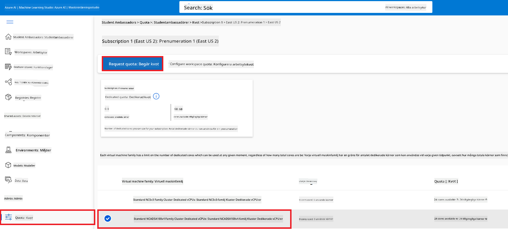
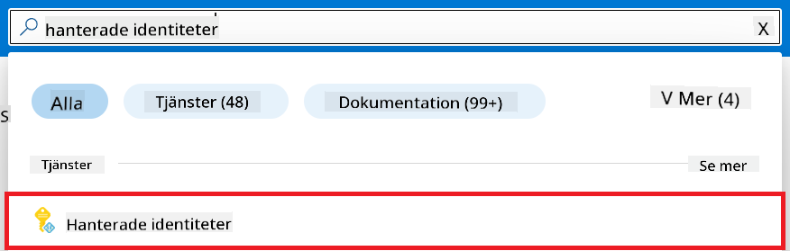
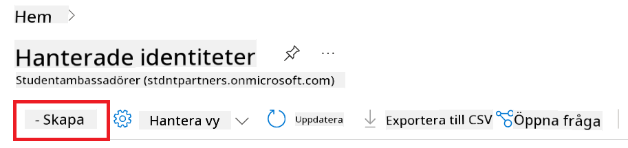
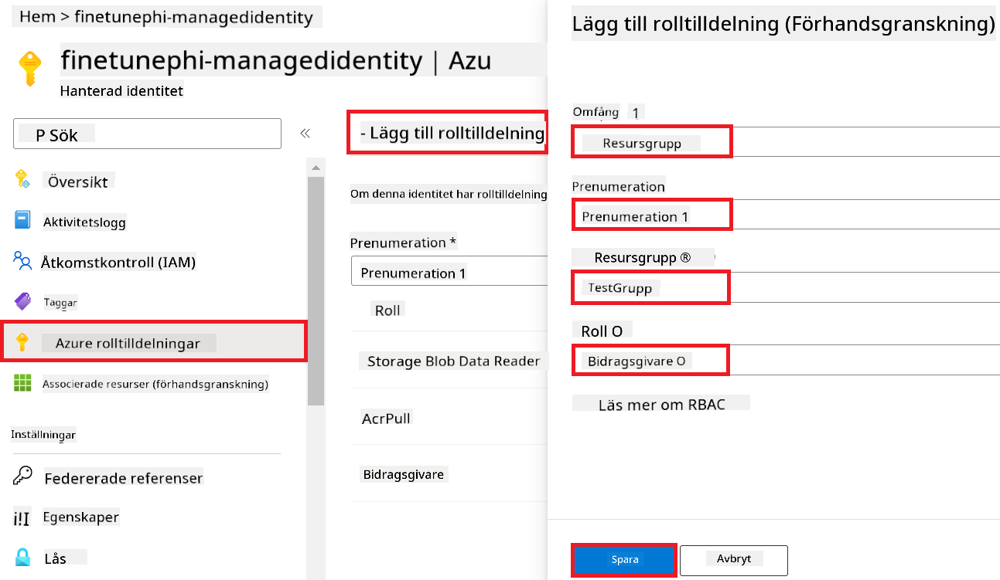
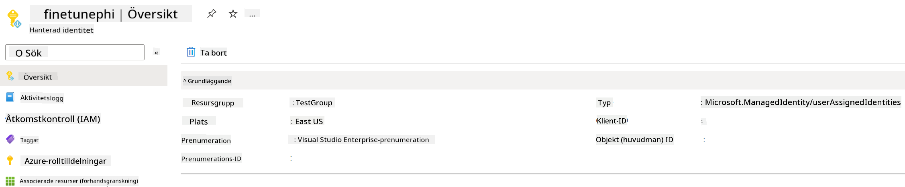
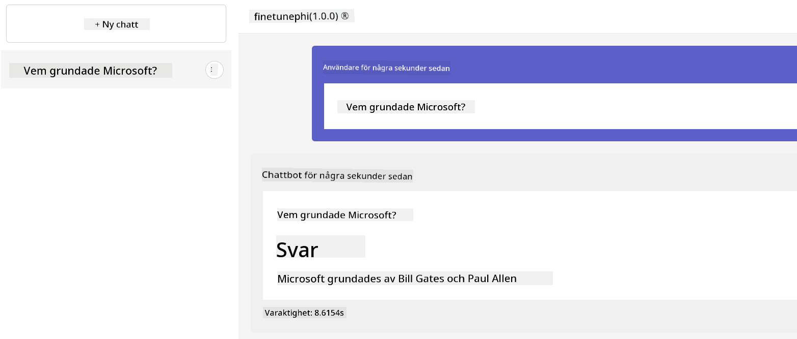

<!--
CO_OP_TRANSLATOR_METADATA:
{
  "original_hash": "7ca2c30fdb802664070e9cfbf92e24fe",
  "translation_date": "2026-01-05T12:22:31+00:00",
  "source_file": "md/02.Application/01.TextAndChat/Phi3/E2E_Phi-3-FineTuning_PromptFlow_Integration.md",
  "language_code": "sv"
}
-->
# Finjustera och integrera anpassade Phi-3-modeller med Prompt flow

Detta end-to-end (E2E) exempel är baserat på guiden "[Finjustera och integrera anpassade Phi-3-modeller med Prompt flow: Steg-för-steg-guide](https://techcommunity.microsoft.com/t5/educator-developer-blog/fine-tune-and-integrate-custom-phi-3-models-with-prompt-flow/ba-p/4178612?WT.mc_id=aiml-137032-kinfeylo)" från Microsoft Tech Community. Den introducerar processerna för finjustering, distribution och integration av anpassade Phi-3-modeller med Prompt flow.

## Översikt

I detta E2E exempel kommer du att lära dig hur man finjusterar Phi-3-modellen och integrerar den med Prompt flow. Genom att utnyttja Azure Machine Learning och Prompt flow skapar du ett arbetsflöde för att distribuera och använda anpassade AI-modeller. Detta E2E exempel är uppdelat i tre scenarier:

**Scenario 1: Ställ in Azure-resurser och förbered för finjustering**

**Scenario 2: Finjustera Phi-3-modellen och distribuera i Azure Machine Learning Studio**

**Scenario 3: Integrera med Prompt flow och chatta med din anpassade modell**

Här är en översikt av detta E2E-exempel.


### Innehållsförteckning

1. **[Scenario 1: Ställ in Azure-resurser och förbered för finjustering](../../../../../../md/02.Application/01.TextAndChat/Phi3)**
    - [Skapa ett Azure Machine Learning-arbetsyta](../../../../../../md/02.Application/01.TextAndChat/Phi3)
    - [Begär GPU-kvoter i Azure-prenumeration](../../../../../../md/02.Application/01.TextAndChat/Phi3)
    - [Lägg till rolltilldelning](../../../../../../md/02.Application/01.TextAndChat/Phi3)
    - [Ställ in projekt](../../../../../../md/02.Application/01.TextAndChat/Phi3)
    - [Förbered dataset för finjustering](../../../../../../md/02.Application/01.TextAndChat/Phi3)

1. **[Scenario 2: Finjustera Phi-3-modell och distribuera i Azure Machine Learning Studio](../../../../../../md/02.Application/01.TextAndChat/Phi3)**
    - [Ställ in Azure CLI](../../../../../../md/02.Application/01.TextAndChat/Phi3)
    - [Finjustera Phi-3-modellen](../../../../../../md/02.Application/01.TextAndChat/Phi3)
    - [Distribuera den finjusterade modellen](../../../../../../md/02.Application/01.TextAndChat/Phi3)

1. **[Scenario 3: Integrera med Prompt flow och chatta med din anpassade modell](../../../../../../md/02.Application/01.TextAndChat/Phi3)**
    - [Integrera den anpassade Phi-3-modellen med Prompt flow](../../../../../../md/02.Application/01.TextAndChat/Phi3)
    - [Chatta med din anpassade modell](../../../../../../md/02.Application/01.TextAndChat/Phi3)

## Scenario 1: Ställ in Azure-resurser och förbered för finjustering

### Skapa ett Azure Machine Learning-arbetsyta

1. Skriv *azure machine learning* i **sökfältet** högst upp på portal-sidan och välj **Azure Machine Learning** från de förslag som visas.

    

1. Välj **+ Create** från navigationsmenyn.

1. Välj **New workspace** från navigationsmenyn.

    

1. Utför följande uppgifter:

    - Välj din Azure **Prenumeration**.
    - Välj den **Resursgrupp** du vill använda (skapa en ny om det behövs).
    - Ange **Workspace Name**. Det måste vara ett unikt värde.
    - Välj den **Region** du vill använda.
    - Välj det **Lagringskonto** du vill använda (skapa ett nytt om det behövs).
    - Välj den **Nyckelvalv** du vill använda (skapa en ny om det behövs).
    - Välj den **Application insights** du vill använda (skapa en ny om det behövs).
    - Välj det **Container register** du vill använda (skapa ett nytt om det behövs).

    

1. Välj **Review + Create**.

1. Välj **Create**.

### Begär GPU-kvoter i Azure-prenumeration

I detta E2E exempel kommer du att använda *Standard_NC24ads_A100_v4 GPU* för finjustering, vilket kräver en kvotförfrågan, samt *Standard_E4s_v3* CPU för distribution, vilket inte kräver en kvotförfrågan.

> [!NOTE]
>
> Endast Pay-As-You-Go-prenumerationer (den standardprenumerationstypen) är berättigade till GPU-allokering; förmånspaket prenumerationer stöds för närvarande inte.
>
> För de som använder förmånspaket-prenumerationer (såsom Visual Studio Enterprise Subscription) eller som snabbt vill testa finjusterings- och distributionsprocessen, ger denna handledning även vägledning för finjustering med ett minimalt dataset med hjälp av en CPU. Det är dock viktigt att notera att finjusteringsresultat är betydligt bättre när man använder en GPU med större dataset.

1. Besök [Azure ML Studio](https://ml.azure.com/home?wt.mc_id=studentamb_279723).

1. Utför följande uppgifter för att begära *Standard NCADSA100v4 Family*-kvot:

    - Välj **Kvot** i vänstermeny.
    - Välj den **Virtual machine family** du vill använda. Till exempel, välj **Standard NCADSA100v4 Family Cluster Dedicated vCPUs**, som inkluderar *Standard_NC24ads_A100_v4* GPU.
    - Välj **Begär kvot** i navigationsmenyn.

        

    - På sidan för begäran, ange det **Nya kärnbegränsningen** du vill använda. Till exempel, 24.
    - På sidan för begäran, välj **Skicka** för att begära GPU-kvoten.

> [!NOTE]
> Du kan välja lämplig GPU eller CPU utifrån dina behov genom att hänvisa till dokumentationen [Storlekar för virtuella maskiner i Azure](https://learn.microsoft.com/azure/virtual-machines/sizes/overview?tabs=breakdownseries%2Cgeneralsizelist%2Ccomputesizelist%2Cmemorysizelist%2Cstoragesizelist%2Cgpusizelist%2Cfpgasizelist%2Chpcsizelist).

### Lägg till rolltilldelning

För att finjustera och distribuera dina modeller måste du först skapa en användartillsatt hanterad identitet (UAI) och ge den lämpliga behörigheter. Denna UAI kommer att användas för autentisering under distribution.

#### Skapa User Assigned Managed Identity (UAI)

1. Skriv *managed identities* i **sökfältet** högst upp på portal-sidan och välj **Managed Identities** från de förslag som visas.

    

1. Välj **+ Create**.

    

1. Utför följande uppgifter:

    - Välj din Azure **Prenumeration**.
    - Välj den **Resursgrupp** du vill använda (skapa en ny om det behövs).
    - Välj den **Region** du vill använda.
    - Ange **Namn**. Det måste vara ett unikt värde.

1. Välj **Review + create**.

1. Välj **+ Create**.

#### Lägg till rollen Contributor till Managed Identity

1. Navigera till Managed Identity-resursen du skapade.

1. Välj **Azure role assignments** i vänstermeny.

1. Välj **+Add role assignment** i navigationsmenyn.

1. På sidan för att lägga till rolltilldelning, utför följande uppgifter:
    - Välj **Omfång** till **Resursgrupp**.
    - Välj din Azure **Prenumeration**.
    - Välj den **Resursgrupp** som ska användas.
    - Välj rollen **Contributor**.

    

1. Välj **Spara**.

#### Lägg till rollen Storage Blob Data Reader till Managed Identity

1. Skriv *storage accounts* i **sökfältet** högst upp på portal-sidan och välj **Storage accounts** från de förslag som visas.

    

1. Välj det lagringskonto som är kopplat till Azure Machine Learning-arbetsytan du skapade. Till exempel, *finetunephistorage*.

1. Utför följande för att navigera till sidan för att lägga till rolltilldelning:

    - Navigera till den Azure Storage-konto du skapade.
    - Välj **Access Control (IAM)** i vänsterfliken.
    - Välj **+ Add** i navigationsmenyn.
    - Välj **Add role assignment** i navigationsmenyn.

    

1. På sidan för att lägga till rolltilldelning, utför följande uppgifter:

    - På Rollen, skriv *Storage Blob Data Reader* i **sökfältet** och välj **Storage Blob Data Reader** från de förslag som visas.
    - Välj **Next**.
    - På Medlemmar-sidan, välj **Assign access to** **Managed identity**.
    - Välj **+ Select members**.
    - Välj din Azure **Prenumeration**.
    - Välj den **Managed identity** under **Manage Identity**.
    - Välj den Managed Identity du skapade, till exempel *finetunephi-managedidentity*.
    - Välj **Select**.

    

1. Välj **Review + assign**.

#### Lägg till rollen AcrPull till Managed Identity

1. Skriv *container registries* i **sökfältet** högst upp på portal-sidan och välj **Container registries** från de förslag som visas.

    

1. Välj containerregistret som är kopplat till Azure Machine Learning-arbetsytan. Till exempel, *finetunephicontainerregistries*

1. Utför följande för att navigera till sidan för att lägga till rolltilldelning:

    - Välj **Access Control (IAM)** i vänstermeny.
    - Välj **+ Add** i navigationsmenyn.
    - Välj **Add role assignment** i navigationsmenyn.

1. På sidan för att lägga till rolltilldelning, utför följande uppgifter:

    - På Rollen, skriv *AcrPull* i **sökfältet** och välj **AcrPull** från de förslag som visas.
    - Välj **Next**.
    - På Medlemmar-sidan, välj **Assign access to** **Managed identity**.
    - Välj **+ Select members**.
    - Välj din Azure **Prenumeration**.
    - Välj den **Managed identity** under **Manage Identity**.
    - Välj den Managed Identity du skapade, till exempel *finetunephi-managedidentity*.
    - Välj **Select**.
    - Välj **Review + assign**.

### Ställ in projekt

Nu ska du skapa en mapp att arbeta i och konfigurera en virtuell miljö för att utveckla ett program som interagerar med användare och använder lagrad chathistorik från Azure Cosmos DB för att informera sina svar.

#### Skapa en mapp för att arbeta i

1. Öppna ett terminalfönster och skriv följande kommando för att skapa en mapp med namnet *finetune-phi* i standardvägen.

    ```console
    mkdir finetune-phi
    ```

1. Skriv följande kommando i din terminal för att navigera till *finetune-phi*-mappen du skapade.

    ```console
    cd finetune-phi
    ```

#### Skapa en virtuell miljö

1. Skriv följande kommando i din terminal för att skapa en virtuell miljö med namnet *.venv*.

    ```console
    python -m venv .venv
    ```

1. Skriv följande kommando i din terminal för att aktivera den virtuella miljön.

    ```console
    .venv\Scripts\activate.bat
    ```

> [!NOTE]
>
> Om det fungerade, bör du se *(.venv)* före kommandotolken.

#### Installera de nödvändiga paketen

1. Skriv följande kommandon i din terminal för att installera de nödvändiga paketen.

    ```console
    pip install datasets==2.19.1
    pip install transformers==4.41.1
    pip install azure-ai-ml==1.16.0
    pip install torch==2.3.1
    pip install trl==0.9.4
    pip install promptflow==1.12.0
    ```

#### Skapa projektfiler
I denna övning kommer du att skapa de essentiella filerna för vårt projekt. Dessa filer inkluderar skript för att ladda ner datasetet, sätta upp Azure Machine Learning-miljön, finjustera Phi-3-modellen samt distribuera den finjusterade modellen. Du kommer också att skapa en *conda.yml*-fil för att konfigurera finjusteringsmiljön.

I denna övning kommer du att:

- Skapa en *download_dataset.py*-fil för att ladda ner datasetet.
- Skapa en *setup_ml.py*-fil för att sätta upp Azure Machine Learning-miljön.
- Skapa en *fine_tune.py*-fil i mappen *finetuning_dir* för att finjustera Phi-3-modellen med hjälp av datasetet.
- Skapa en *conda.yml*-fil för att konfigurera finjusteringsmiljön.
- Skapa en *deploy_model.py*-fil för att distribuera den finjusterade modellen.
- Skapa en *integrate_with_promptflow.py*-fil för att integrera den finjusterade modellen och köra modellen med Prompt flow.
- Skapa en flow.dag.yml-fil för att sätta upp arbetsflödesstrukturen för Prompt flow.
- Skapa en *config.py*-fil där du anger Azure-information.

> [!NOTE]
>
> Komplett mappstruktur:
>
> ```text
> └── YourUserName
> .    └── finetune-phi
> .        ├── finetuning_dir
> .        │      └── fine_tune.py
> .        ├── conda.yml
> .        ├── config.py
> .        ├── deploy_model.py
> .        ├── download_dataset.py
> .        ├── flow.dag.yml
> .        ├── integrate_with_promptflow.py
> .        └── setup_ml.py
> ```

1. Öppna **Visual Studio Code**.

1. Välj **File** i menyraden.

1. Välj **Open Folder**.

1. Välj mappen *finetune-phi* som du skapade, som finns på *C:\Users\yourUserName\finetune-phi*.

    

1. I vänstra panelen i Visual Studio Code, högerklicka och välj **New File** för att skapa en ny fil med namnet *download_dataset.py*.

1. I vänstra panelen i Visual Studio Code, högerklicka och välj **New File** för att skapa en ny fil med namnet *setup_ml.py*.

1. I vänstra panelen i Visual Studio Code, högerklicka och välj **New File** för att skapa en ny fil med namnet *deploy_model.py*.

    

1. I vänstra panelen i Visual Studio Code, högerklicka och välj **New Folder** för att skapa en ny mapp med namnet *finetuning_dir*.

1. I mappen *finetuning_dir*, skapa en ny fil med namnet *fine_tune.py*.

#### Skapa och konfigurera *conda.yml*-filen

1. I vänstra panelen i Visual Studio Code, högerklicka och välj **New File** för att skapa en ny fil med namnet *conda.yml*.

1. Lägg till följande kod i *conda.yml*-filen för att konfigurera finjusteringsmiljön för Phi-3-modellen.

    ```yml
    name: phi-3-training-env
    channels:
      - defaults
      - conda-forge
    dependencies:
      - python=3.10
      - pip
      - numpy<2.0
      - pip:
          - torch==2.4.0
          - torchvision==0.19.0
          - trl==0.8.6
          - transformers==4.41
          - datasets==2.21.0
          - azureml-core==1.57.0
          - azure-storage-blob==12.19.0
          - azure-ai-ml==1.16
          - azure-identity==1.17.1
          - accelerate==0.33.0
          - mlflow==2.15.1
          - azureml-mlflow==1.57.0
    ```

#### Skapa och konfigurera *config.py*-filen

1. I vänstra panelen i Visual Studio Code, högerklicka och välj **New File** för att skapa en ny fil med namnet *config.py*.

1. Lägg till följande kod i *config.py*-filen för att inkludera din Azure-information.

    ```python
    # Azure-inställningar
    AZURE_SUBSCRIPTION_ID = "your_subscription_id"
    AZURE_RESOURCE_GROUP_NAME = "your_resource_group_name" # "TestGroup"

    # Azure Machine Learning-inställningar
    AZURE_ML_WORKSPACE_NAME = "your_workspace_name" # "finetunephi-workspace"

    # Azure Managed Identity-inställningar
    AZURE_MANAGED_IDENTITY_CLIENT_ID = "your_azure_managed_identity_client_id"
    AZURE_MANAGED_IDENTITY_NAME = "your_azure_managed_identity_name" # "finetunephi-mangedidentity"
    AZURE_MANAGED_IDENTITY_RESOURCE_ID = f"/subscriptions/{AZURE_SUBSCRIPTION_ID}/resourceGroups/{AZURE_RESOURCE_GROUP_NAME}/providers/Microsoft.ManagedIdentity/userAssignedIdentities/{AZURE_MANAGED_IDENTITY_NAME}"

    # Dataset-filvägar
    TRAIN_DATA_PATH = "data/train_data.jsonl"
    TEST_DATA_PATH = "data/test_data.jsonl"

    # Inställningar för finjusterad modell
    AZURE_MODEL_NAME = "your_fine_tuned_model_name" # "finetune-phi-model"
    AZURE_ENDPOINT_NAME = "your_fine_tuned_model_endpoint_name" # "finetune-phi-endpoint"
    AZURE_DEPLOYMENT_NAME = "your_fine_tuned_model_deployment_name" # "finetune-phi-deployment"

    AZURE_ML_API_KEY = "your_fine_tuned_model_api_key"
    AZURE_ML_ENDPOINT = "your_fine_tuned_model_endpoint_uri" # "https://{your-endpoint-name}.{your-region}.inference.ml.azure.com/score"
    ```

#### Lägg till Azure-miljövariabler

1. Utför följande steg för att lägga till Azure Subscription ID:

    - Skriv *subscriptions* i **sökrutan** högst upp på portalens sida och välj **Subscriptions** från alternativen som dyker upp.
    - Välj den Azure-prenumeration du använder.
    - Kopiera och klistra in din Subscription ID i *config.py*-filen.

    

1. Utför följande steg för att lägga till Azure Workspace Name:

    - Navigera till Azure Machine Learning-resursen du skapade.
    - Kopiera och klistra in ditt kontonamn i *config.py*-filen.

    

1. Utför följande steg för att lägga till Azure Resource Group Name:

    - Navigera till Azure Machine Learning-resursen du skapade.
    - Kopiera och klistra in ditt Azure Resource Group-namn i *config.py*-filen.

    

2. Utför följande steg för att lägga till Azure Managed Identity namn

    - Navigera till Managed Identities-resursen du skapade.
    - Kopiera och klistra in ditt Azure Managed Identity-namn i *config.py*-filen.

    

### Förbered dataset för finjustering

I denna övning kommer du att köra filen *download_dataset.py* för att ladda ner *ULTRACHAT_200k* dataset till din lokala miljö. Du kommer sedan att använda detta dataset för att finjustera Phi-3-modellen i Azure Machine Learning.

#### Ladda ner ditt dataset med *download_dataset.py*

1. Öppna filen *download_dataset.py* i Visual Studio Code.

1. Lägg till följande kod i *download_dataset.py*.

    ```python
    import json
    import os
    from datasets import load_dataset
    from config import (
        TRAIN_DATA_PATH,
        TEST_DATA_PATH)

    def load_and_split_dataset(dataset_name, config_name, split_ratio):
        """
        Load and split a dataset.
        """
        # Ladda datasetet med det angivna namnet, konfigurationen och delningsförhållandet
        dataset = load_dataset(dataset_name, config_name, split=split_ratio)
        print(f"Original dataset size: {len(dataset)}")
        
        # Dela upp datasetet i tränings- och testuppsättningar (80 % träning, 20 % test)
        split_dataset = dataset.train_test_split(test_size=0.2)
        print(f"Train dataset size: {len(split_dataset['train'])}")
        print(f"Test dataset size: {len(split_dataset['test'])}")
        
        return split_dataset

    def save_dataset_to_jsonl(dataset, filepath):
        """
        Save a dataset to a JSONL file.
        """
        # Skapa mappen om den inte finns
        os.makedirs(os.path.dirname(filepath), exist_ok=True)
        
        # Öppna filen i skrivläge
        with open(filepath, 'w', encoding='utf-8') as f:
            # Iterera över varje post i datasetet
            for record in dataset:
                # Dumpa posten som ett JSON-objekt och skriv den till filen
                json.dump(record, f)
                # Skriv en radbrytning för att separera poster
                f.write('\n')
        
        print(f"Dataset saved to {filepath}")

    def main():
        """
        Main function to load, split, and save the dataset.
        """
        # Ladda och dela ULTRACHAT_200k-datasetet med en specifik konfiguration och delningsförhållande
        dataset = load_and_split_dataset("HuggingFaceH4/ultrachat_200k", 'default', 'train_sft[:1%]')
        
        # Extrahera tränings- och testdataseten från uppdelningen
        train_dataset = dataset['train']
        test_dataset = dataset['test']

        # Spara träningsdatasetet i en JSONL-fil
        save_dataset_to_jsonl(train_dataset, TRAIN_DATA_PATH)
        
        # Spara testdatasetet i en separat JSONL-fil
        save_dataset_to_jsonl(test_dataset, TEST_DATA_PATH)

    if __name__ == "__main__":
        main()

    ```

> [!TIP]
>
> **Vägledning för finjustering med ett minimalt dataset med CPU**
>
> Om du vill använda CPU för finjustering är detta tillvägagångssätt idealiskt för de som har förmånsprenumerationer (som Visual Studio Enterprise Subscription) eller för att snabbt testa finjusterings- och distributionsprocessen.
>
> Ersätt `dataset = load_and_split_dataset("HuggingFaceH4/ultrachat_200k", 'default', 'train_sft[:1%]')` med `dataset = load_and_split_dataset("HuggingFaceH4/ultrachat_200k", 'default', 'train_sft[:10]')`
>

1. Skriv följande kommando i din terminal för att köra skriptet och ladda ner datasetet till din lokala miljö.

    ```console
    python download_data.py
    ```

1. Kontrollera att dataset har sparats korrekt i din lokala *finetune-phi/data*-mapp.

> [!NOTE]
>
> **Datasets storlek och finjusteringstid**
>
> I detta E2E-exempel använder du endast 1 % av datasetet (`train_sft[:1%]`). Detta minskar mängden data avsevärt, vilket snabbar upp både uppladdning och finjusteringsprocesser. Du kan justera procentandelen för att hitta rätt balans mellan träningstid och modellens prestanda. Att använda en mindre delmängd av datasetet minskar den tid som krävs för finjustering, vilket gör processen mer hanterbar för ett E2E-exempel.

## Scenario 2: Finjustera Phi-3-modellen och distribuera i Azure Machine Learning Studio

### Ställ in Azure CLI

Du behöver konfigurera Azure CLI för att autentisera din miljö. Azure CLI låter dig hantera Azure-resurser direkt från kommandoraden och tillhandahåller nödvändiga autentiseringsuppgifter för Azure Machine Learning att få åtkomst till dessa resurser. För att komma igång, installera [Azure CLI](https://learn.microsoft.com/cli/azure/install-azure-cli)

1. Öppna ett terminalfönster och skriv följande kommando för att logga in på ditt Azure-konto.

    ```console
    az login
    ```

1. Välj ditt Azure-konto att använda.

1. Välj din Azure-prenumeration att använda.

    

> [!TIP]
>
> Om du har problem att logga in på Azure, försök använda en enhetskod. Öppna ett terminalfönster och skriv följande kommando för att logga in på ditt Azure-konto:
>
> ```console
> az login --use-device-code
> ```
>

### Finjustera Phi-3-modellen

I denna övning kommer du att finjustera Phi-3-modellen med det tillhandahållna datasetet. Först definierar du finjusteringsprocessen i filen *fine_tune.py*. Därefter konfigurerar du Azure Machine Learning-miljön och initierar finjusteringen genom att köra filen *setup_ml.py*. Detta skript säkerställer att finjusteringen sker inom Azure Machine Learning-miljön.

Genom att köra *setup_ml.py* kommer finjusteringsprocessen att köras i Azure Machine Learning-miljön.

#### Lägg till kod i *fine_tune.py*-filen

1. Navigera till mappen *finetuning_dir* och öppna filen *fine_tune.py* i Visual Studio Code.

1. Lägg till följande kod i *fine_tune.py*.

    ```python
    import argparse
    import sys
    import logging
    import os
    from datasets import load_dataset
    import torch
    import mlflow
    from transformers import AutoModelForCausalLM, AutoTokenizer, TrainingArguments
    from trl import SFTTrainer

    # För att undvika felet INVALID_PARAMETER_VALUE i MLflow, inaktivera MLflow-integrationen
    os.environ["DISABLE_MLFLOW_INTEGRATION"] = "True"

    # Loggkonfiguration
    logging.basicConfig(
        format="%(asctime)s - %(levelname)s - %(name)s - %(message)s",
        datefmt="%Y-%m-%d %H:%M:%S",
        handlers=[logging.StreamHandler(sys.stdout)],
        level=logging.WARNING
    )
    logger = logging.getLogger(__name__)

    def initialize_model_and_tokenizer(model_name, model_kwargs):
        """
        Initialize the model and tokenizer with the given pretrained model name and arguments.
        """
        model = AutoModelForCausalLM.from_pretrained(model_name, **model_kwargs)
        tokenizer = AutoTokenizer.from_pretrained(model_name)
        tokenizer.model_max_length = 2048
        tokenizer.pad_token = tokenizer.unk_token
        tokenizer.pad_token_id = tokenizer.convert_tokens_to_ids(tokenizer.pad_token)
        tokenizer.padding_side = 'right'
        return model, tokenizer

    def apply_chat_template(example, tokenizer):
        """
        Apply a chat template to tokenize messages in the example.
        """
        messages = example["messages"]
        if messages[0]["role"] != "system":
            messages.insert(0, {"role": "system", "content": ""})
        example["text"] = tokenizer.apply_chat_template(
            messages, tokenize=False, add_generation_prompt=False
        )
        return example

    def load_and_preprocess_data(train_filepath, test_filepath, tokenizer):
        """
        Load and preprocess the dataset.
        """
        train_dataset = load_dataset('json', data_files=train_filepath, split='train')
        test_dataset = load_dataset('json', data_files=test_filepath, split='train')
        column_names = list(train_dataset.features)

        train_dataset = train_dataset.map(
            apply_chat_template,
            fn_kwargs={"tokenizer": tokenizer},
            num_proc=10,
            remove_columns=column_names,
            desc="Applying chat template to train dataset",
        )

        test_dataset = test_dataset.map(
            apply_chat_template,
            fn_kwargs={"tokenizer": tokenizer},
            num_proc=10,
            remove_columns=column_names,
            desc="Applying chat template to test dataset",
        )

        return train_dataset, test_dataset

    def train_and_evaluate_model(train_dataset, test_dataset, model, tokenizer, output_dir):
        """
        Train and evaluate the model.
        """
        training_args = TrainingArguments(
            bf16=True,
            do_eval=True,
            output_dir=output_dir,
            eval_strategy="epoch",
            learning_rate=5.0e-06,
            logging_steps=20,
            lr_scheduler_type="cosine",
            num_train_epochs=3,
            overwrite_output_dir=True,
            per_device_eval_batch_size=4,
            per_device_train_batch_size=4,
            remove_unused_columns=True,
            save_steps=500,
            seed=0,
            gradient_checkpointing=True,
            gradient_accumulation_steps=1,
            warmup_ratio=0.2,
        )

        trainer = SFTTrainer(
            model=model,
            args=training_args,
            train_dataset=train_dataset,
            eval_dataset=test_dataset,
            max_seq_length=2048,
            dataset_text_field="text",
            tokenizer=tokenizer,
            packing=True
        )

        train_result = trainer.train()
        trainer.log_metrics("train", train_result.metrics)

        mlflow.transformers.log_model(
            transformers_model={"model": trainer.model, "tokenizer": tokenizer},
            artifact_path=output_dir,
        )

        tokenizer.padding_side = 'left'
        eval_metrics = trainer.evaluate()
        eval_metrics["eval_samples"] = len(test_dataset)
        trainer.log_metrics("eval", eval_metrics)

    def main(train_file, eval_file, model_output_dir):
        """
        Main function to fine-tune the model.
        """
        model_kwargs = {
            "use_cache": False,
            "trust_remote_code": True,
            "torch_dtype": torch.bfloat16,
            "device_map": None,
            "attn_implementation": "eager"
        }

        # pretrained_model_name = "microsoft/Phi-3-mini-4k-instruct"
        pretrained_model_name = "microsoft/Phi-3.5-mini-instruct"

        with mlflow.start_run():
            model, tokenizer = initialize_model_and_tokenizer(pretrained_model_name, model_kwargs)
            train_dataset, test_dataset = load_and_preprocess_data(train_file, eval_file, tokenizer)
            train_and_evaluate_model(train_dataset, test_dataset, model, tokenizer, model_output_dir)

    if __name__ == "__main__":
        parser = argparse.ArgumentParser()
        parser.add_argument("--train-file", type=str, required=True, help="Path to the training data")
        parser.add_argument("--eval-file", type=str, required=True, help="Path to the evaluation data")
        parser.add_argument("--model_output_dir", type=str, required=True, help="Directory to save the fine-tuned model")
        args = parser.parse_args()
        main(args.train_file, args.eval_file, args.model_output_dir)

    ```

1. Spara och stäng filen *fine_tune.py*.

> [!TIP]
> **Du kan finjustera Phi-3.5-modellen**
>
> I filen *fine_tune.py* kan du ändra `pretrained_model_name` från `"microsoft/Phi-3-mini-4k-instruct"` till vilken modell du vill finjustera. Till exempel, om du ändrar det till `"microsoft/Phi-3.5-mini-instruct"`, använder du Phi-3.5-mini-instruct-modellen för finjustering. För att hitta och använda det modellnamn du föredrar, besök [Hugging Face](https://huggingface.co/), sök efter modellen du är intresserad av och kopiera sedan in dess namn i fältet `pretrained_model_name` i ditt skript.
>
> <image type="content" src="../../../../imgs/02/FineTuning-PromptFlow/finetunephi3.5.png" alt-text="Finjustera Phi-3.5.">
>

#### Lägg till kod i *setup_ml.py*-filen

1. Öppna filen *setup_ml.py* i Visual Studio Code.

1. Lägg till följande kod i *setup_ml.py*.

    ```python
    import logging
    from azure.ai.ml import MLClient, command, Input
    from azure.ai.ml.entities import Environment, AmlCompute
    from azure.identity import AzureCliCredential
    from config import (
        AZURE_SUBSCRIPTION_ID,
        AZURE_RESOURCE_GROUP_NAME,
        AZURE_ML_WORKSPACE_NAME,
        TRAIN_DATA_PATH,
        TEST_DATA_PATH
    )

    # Konstanter

    # Avkommentera följande rader för att använda en CPU-instans för träning
    # COMPUTE_INSTANCE_TYPE = "Standard_E16s_v3" # cpu
    # COMPUTE_NAME = "cpu-e16s-v3"
    # DOCKER_IMAGE_NAME = "mcr.microsoft.com/azureml/openmpi4.1.0-ubuntu20.04:latest"

    # Avkommentera följande rader för att använda en GPU-instans för träning
    COMPUTE_INSTANCE_TYPE = "Standard_NC24ads_A100_v4"
    COMPUTE_NAME = "gpu-nc24s-a100-v4"
    DOCKER_IMAGE_NAME = "mcr.microsoft.com/azureml/curated/acft-hf-nlp-gpu:59"

    CONDA_FILE = "conda.yml"
    LOCATION = "eastus2" # Ersätt med platsen för din beräkningskluster
    FINETUNING_DIR = "./finetuning_dir" # Sökväg till finjusteringsskriptet
    TRAINING_ENV_NAME = "phi-3-training-environment" # Namn på träningsmiljön
    MODEL_OUTPUT_DIR = "./model_output" # Sökväg till modellens utmatningskatalog i Azure ML

    # Logginställningar för att följa processen
    logger = logging.getLogger(__name__)
    logging.basicConfig(
        format="%(asctime)s - %(levelname)s - %(name)s - %(message)s",
        datefmt="%Y-%m-%d %H:%M:%S",
        level=logging.WARNING
    )

    def get_ml_client():
        """
        Initialize the ML Client using Azure CLI credentials.
        """
        credential = AzureCliCredential()
        return MLClient(credential, AZURE_SUBSCRIPTION_ID, AZURE_RESOURCE_GROUP_NAME, AZURE_ML_WORKSPACE_NAME)

    def create_or_get_environment(ml_client):
        """
        Create or update the training environment in Azure ML.
        """
        env = Environment(
            image=DOCKER_IMAGE_NAME,  # Dockerbild för miljön
            conda_file=CONDA_FILE,  # Conda-miljöfil
            name=TRAINING_ENV_NAME,  # Namn på miljön
        )
        return ml_client.environments.create_or_update(env)

    def create_or_get_compute_cluster(ml_client, compute_name, COMPUTE_INSTANCE_TYPE, location):
        """
        Create or update the compute cluster in Azure ML.
        """
        try:
            compute_cluster = ml_client.compute.get(compute_name)
            logger.info(f"Compute cluster '{compute_name}' already exists. Reusing it for the current run.")
        except Exception:
            logger.info(f"Compute cluster '{compute_name}' does not exist. Creating a new one with size {COMPUTE_INSTANCE_TYPE}.")
            compute_cluster = AmlCompute(
                name=compute_name,
                size=COMPUTE_INSTANCE_TYPE,
                location=location,
                tier="Dedicated",  # Nivå på beräkningsklustret
                min_instances=0,  # Minsta antal instanser
                max_instances=1  # Högsta antal instanser
            )
            ml_client.compute.begin_create_or_update(compute_cluster).wait()  # Vänta på att klustret ska skapas
        return compute_cluster

    def create_fine_tuning_job(env, compute_name):
        """
        Set up the fine-tuning job in Azure ML.
        """
        return command(
            code=FINETUNING_DIR,  # Sökväg till fine_tune.py
            command=(
                "python fine_tune.py "
                "--train-file ${{inputs.train_file}} "
                "--eval-file ${{inputs.eval_file}} "
                "--model_output_dir ${{inputs.model_output}}"
            ),
            environment=env,  # Träningsmiljö
            compute=compute_name,  # Beräkningskluster som ska användas
            inputs={
                "train_file": Input(type="uri_file", path=TRAIN_DATA_PATH),  # Sökväg till träningsdatafilen
                "eval_file": Input(type="uri_file", path=TEST_DATA_PATH),  # Sökväg till evalueringsdatafilen
                "model_output": MODEL_OUTPUT_DIR
            }
        )

    def main():
        """
        Main function to set up and run the fine-tuning job in Azure ML.
        """
        # Initiera ML-klient
        ml_client = get_ml_client()

        # Skapa miljö
        env = create_or_get_environment(ml_client)
        
        # Skapa eller hämta befintligt beräkningskluster
        create_or_get_compute_cluster(ml_client, COMPUTE_NAME, COMPUTE_INSTANCE_TYPE, LOCATION)

        # Skapa och skicka finjusteringsjobb
        job = create_fine_tuning_job(env, COMPUTE_NAME)
        returned_job = ml_client.jobs.create_or_update(job)  # Skicka jobbet
        ml_client.jobs.stream(returned_job.name)  # Strömma jobbets loggar
        
        # Fånga jobbnamnet
        job_name = returned_job.name
        print(f"Job name: {job_name}")

    if __name__ == "__main__":
        main()

    ```

1. Ersätt `COMPUTE_INSTANCE_TYPE`, `COMPUTE_NAME` och `LOCATION` med dina specifika uppgifter.

    ```python
   # Avkommentera följande rader för att använda en GPU-instans för träning
    COMPUTE_INSTANCE_TYPE = "Standard_NC24ads_A100_v4"
    COMPUTE_NAME = "gpu-nc24s-a100-v4"
    ...
    LOCATION = "eastus2" # Byt ut mot platsen för din datorkluster
    ```

> [!TIP]
>
> **Vägledning för finjustering med ett minimalt dataset med CPU**
>
> Om du vill använda CPU för finjustering är detta tillvägagångssätt idealiskt för de som har förmånsprenumerationer (som Visual Studio Enterprise Subscription) eller för att snabbt testa finjusterings- och distributionsprocessen.
>
> 1. Öppna filen *setup_ml*.
> 1. Ersätt `COMPUTE_INSTANCE_TYPE`, `COMPUTE_NAME` och `DOCKER_IMAGE_NAME` med följande. Om du inte har tillgång till *Standard_E16s_v3* kan du använda en motsvarande CPU-instans eller begära en ny kvot.
> 1. Ersätt `LOCATION` med dina specifika uppgifter.
>
>    ```python
>    # Uncomment the following lines to use a CPU instance for training
>    COMPUTE_INSTANCE_TYPE = "Standard_E16s_v3" # cpu
>    COMPUTE_NAME = "cpu-e16s-v3"
>    DOCKER_IMAGE_NAME = "mcr.microsoft.com/azureml/openmpi4.1.0-ubuntu20.04:latest"
>    LOCATION = "eastus2" # Replace with the location of your compute cluster
>    ```
>

1. Skriv följande kommando för att köra skriptet *setup_ml.py* och starta finjusteringsprocessen i Azure Machine Learning.

    ```python
    python setup_ml.py
    ```

1. I denna övning har du framgångsrikt finjusterat Phi-3-modellen med hjälp av Azure Machine Learning. Genom att köra skriptet *setup_ml.py* har du satt upp Azure Machine Learning-miljön och startat finjusteringsprocessen som definieras i filen *fine_tune.py*. Observera att finjusteringsprocessen kan ta en betydande tid. Efter att ha kört kommandot `python setup_ml.py` behöver du vänta tills processen är klar. Du kan följa statusen för finjusteringsjobbet via länken som visas i terminalen till Azure Machine Learning-portalen.

    

### Distribuera den finjusterade modellen

För att integrera den finjusterade Phi-3-modellen med Prompt Flow behöver du distribuera modellen så att den är tillgänglig för realtidsinferens. Denna process innebär att registrera modellen, skapa en online-endpoint och distribuera modellen.

#### Ställ in modellnamn, endpoint-namn och deploymentsnamn för distribution

1. Öppna filen *config.py*.

1. Ersätt `AZURE_MODEL_NAME = "your_fine_tuned_model_name"` med det önskade namnet på din modell.

1. Ersätt `AZURE_ENDPOINT_NAME = "your_fine_tuned_model_endpoint_name"` med det önskade namnet på din endpoint.

1. Ersätt `AZURE_DEPLOYMENT_NAME = "your_fine_tuned_model_deployment_name"` med det önskade namnet på din deployment.

#### Lägg till kod i filen *deploy_model.py*

Att köra filen *deploy_model.py* automatiserar hela distributionsprocessen. Den registrerar modellen, skapar en endpoint och utför distributionen baserat på inställningarna i *config.py*-filen, som inkluderar modellnamn, endpoint-namn och deploymentsnamn.

1. Öppna filen *deploy_model.py* i Visual Studio Code.

1. Lägg till följande kod i *deploy_model.py*.

    ```python
    import logging
    from azure.identity import AzureCliCredential
    from azure.ai.ml import MLClient
    from azure.ai.ml.entities import Model, ProbeSettings, ManagedOnlineEndpoint, ManagedOnlineDeployment, IdentityConfiguration, ManagedIdentityConfiguration, OnlineRequestSettings
    from azure.ai.ml.constants import AssetTypes

    # Konfigurationsimporter
    from config import (
        AZURE_SUBSCRIPTION_ID,
        AZURE_RESOURCE_GROUP_NAME,
        AZURE_ML_WORKSPACE_NAME,
        AZURE_MANAGED_IDENTITY_RESOURCE_ID,
        AZURE_MANAGED_IDENTITY_CLIENT_ID,
        AZURE_MODEL_NAME,
        AZURE_ENDPOINT_NAME,
        AZURE_DEPLOYMENT_NAME
    )

    # Konstanter
    JOB_NAME = "your-job-name"
    COMPUTE_INSTANCE_TYPE = "Standard_E4s_v3"

    deployment_env_vars = {
        "SUBSCRIPTION_ID": AZURE_SUBSCRIPTION_ID,
        "RESOURCE_GROUP_NAME": AZURE_RESOURCE_GROUP_NAME,
        "UAI_CLIENT_ID": AZURE_MANAGED_IDENTITY_CLIENT_ID,
    }

    # Logginställning
    logging.basicConfig(
        format="%(asctime)s - %(levelname)s - %(name)s - %(message)s",
        datefmt="%Y-%m-%d %H:%M:%S",
        level=logging.DEBUG
    )
    logger = logging.getLogger(__name__)

    def get_ml_client():
        """Initialize and return the ML Client."""
        credential = AzureCliCredential()
        return MLClient(credential, AZURE_SUBSCRIPTION_ID, AZURE_RESOURCE_GROUP_NAME, AZURE_ML_WORKSPACE_NAME)

    def register_model(ml_client, model_name, job_name):
        """Register a new model."""
        model_path = f"azureml://jobs/{job_name}/outputs/artifacts/paths/model_output"
        logger.info(f"Registering model {model_name} from job {job_name} at path {model_path}.")
        run_model = Model(
            path=model_path,
            name=model_name,
            description="Model created from run.",
            type=AssetTypes.MLFLOW_MODEL,
        )
        model = ml_client.models.create_or_update(run_model)
        logger.info(f"Registered model ID: {model.id}")
        return model

    def delete_existing_endpoint(ml_client, endpoint_name):
        """Delete existing endpoint if it exists."""
        try:
            endpoint_result = ml_client.online_endpoints.get(name=endpoint_name)
            logger.info(f"Deleting existing endpoint {endpoint_name}.")
            ml_client.online_endpoints.begin_delete(name=endpoint_name).result()
            logger.info(f"Deleted existing endpoint {endpoint_name}.")
        except Exception as e:
            logger.info(f"No existing endpoint {endpoint_name} found to delete: {e}")

    def create_or_update_endpoint(ml_client, endpoint_name, description=""):
        """Create or update an endpoint."""
        delete_existing_endpoint(ml_client, endpoint_name)
        logger.info(f"Creating new endpoint {endpoint_name}.")
        endpoint = ManagedOnlineEndpoint(
            name=endpoint_name,
            description=description,
            identity=IdentityConfiguration(
                type="user_assigned",
                user_assigned_identities=[ManagedIdentityConfiguration(resource_id=AZURE_MANAGED_IDENTITY_RESOURCE_ID)]
            )
        )
        endpoint_result = ml_client.online_endpoints.begin_create_or_update(endpoint).result()
        logger.info(f"Created new endpoint {endpoint_name}.")
        return endpoint_result

    def create_or_update_deployment(ml_client, endpoint_name, deployment_name, model):
        """Create or update a deployment."""

        logger.info(f"Creating deployment {deployment_name} for endpoint {endpoint_name}.")
        deployment = ManagedOnlineDeployment(
            name=deployment_name,
            endpoint_name=endpoint_name,
            model=model.id,
            instance_type=COMPUTE_INSTANCE_TYPE,
            instance_count=1,
            environment_variables=deployment_env_vars,
            request_settings=OnlineRequestSettings(
                max_concurrent_requests_per_instance=3,
                request_timeout_ms=180000,
                max_queue_wait_ms=120000
            ),
            liveness_probe=ProbeSettings(
                failure_threshold=30,
                success_threshold=1,
                period=100,
                initial_delay=500,
            ),
            readiness_probe=ProbeSettings(
                failure_threshold=30,
                success_threshold=1,
                period=100,
                initial_delay=500,
            ),
        )
        deployment_result = ml_client.online_deployments.begin_create_or_update(deployment).result()
        logger.info(f"Created deployment {deployment.name} for endpoint {endpoint_name}.")
        return deployment_result

    def set_traffic_to_deployment(ml_client, endpoint_name, deployment_name):
        """Set traffic to the specified deployment."""
        try:
            # Hämta aktuella slutpunktsdetaljer
            endpoint = ml_client.online_endpoints.get(name=endpoint_name)
            
            # Logga den aktuella trafikfördelningen för felsökning
            logger.info(f"Current traffic allocation: {endpoint.traffic}")
            
            # Sätt trafikfördelningen för distributionen
            endpoint.traffic = {deployment_name: 100}
            
            # Uppdatera slutpunkten med den nya trafikfördelningen
            endpoint_poller = ml_client.online_endpoints.begin_create_or_update(endpoint)
            updated_endpoint = endpoint_poller.result()
            
            # Logga den uppdaterade trafikfördelningen för felsökning
            logger.info(f"Updated traffic allocation: {updated_endpoint.traffic}")
            logger.info(f"Set traffic to deployment {deployment_name} at endpoint {endpoint_name}.")
            return updated_endpoint
        except Exception as e:
            # Logga eventuella fel som uppstår under processen
            logger.error(f"Failed to set traffic to deployment: {e}")
            raise


    def main():
        ml_client = get_ml_client()

        registered_model = register_model(ml_client, AZURE_MODEL_NAME, JOB_NAME)
        logger.info(f"Registered model ID: {registered_model.id}")

        endpoint = create_or_update_endpoint(ml_client, AZURE_ENDPOINT_NAME, "Endpoint for finetuned Phi-3 model")
        logger.info(f"Endpoint {AZURE_ENDPOINT_NAME} is ready.")

        try:
            deployment = create_or_update_deployment(ml_client, AZURE_ENDPOINT_NAME, AZURE_DEPLOYMENT_NAME, registered_model)
            logger.info(f"Deployment {AZURE_DEPLOYMENT_NAME} is created for endpoint {AZURE_ENDPOINT_NAME}.")

            set_traffic_to_deployment(ml_client, AZURE_ENDPOINT_NAME, AZURE_DEPLOYMENT_NAME)
            logger.info(f"Traffic is set to deployment {AZURE_DEPLOYMENT_NAME} at endpoint {AZURE_ENDPOINT_NAME}.")
        except Exception as e:
            logger.error(f"Failed to create or update deployment: {e}")

    if __name__ == "__main__":
        main()

    ```

1. Utför följande steg för att hämta `JOB_NAME`:

    - Navigera till den Azure Machine Learning-resurs du skapade.
    - Välj **Studio web URL** för att öppna Azure Machine Learning-arbetsytan.
    - Välj **Jobs** i vänstra sidomenyn.
    - Välj experimentet för finjustering, till exempel *finetunephi*.
    - Välj jobbet du skapade.
    - Kopiera och klistra in ditt jobbnamn i `JOB_NAME = "your-job-name"` i filen *deploy_model.py*.

1. Ersätt `COMPUTE_INSTANCE_TYPE` med dina specifika uppgifter.

1. Skriv följande kommando för att köra skriptet *deploy_model.py* och starta distributionsprocessen i Azure Machine Learning.

    ```python
    python deploy_model.py
    ```

> [!WARNING]
> För att undvika ytterligare avgifter på ditt konto, se till att ta bort den skapade slutpunkten i Azure Machine Learning-arbetsytan.
>

#### Kontrollera distributionsstatus i Azure Machine Learning Workspace

1. Besök [Azure ML Studio](https://ml.azure.com/home?wt.mc_id=studentamb_279723).

1. Navigera till Azure Machine Learning-arbetsytan som du skapade.

1. Välj **Studio web URL** för att öppna Azure Machine Learning-arbetsytan.

1. Välj **Endpoints** från fliken till vänster.

    

2. Välj den slutpunkt som du skapade.

    

3. På denna sida kan du hantera de slutpunkter som skapats under distributionsprocessen.

## Scenario 3: Integrera med Prompt flow och chatta med din anpassade modell

### Integrera den anpassade Phi-3-modellen med Prompt flow

Efter att du framgångsrikt har distribuerat din finjusterade modell kan du nu integrera den med Prompt flow för att använda din modell i realtidsapplikationer, vilket möjliggör en mängd interaktiva uppgifter med din anpassade Phi-3-modell.

#### Ställ in api-nyckel och endpoint-uri för den finjusterade Phi-3-modellen

1. Navigera till Azure Machine learning-arbetsytan som du skapade.
1. Välj **Endpoints** från fliken till vänster.
1. Välj den slutpunkt som du skapade.
1. Välj **Consume** från navigationsmenyn.
1. Kopiera och klistra in din **REST endpoint** i filen *config.py*, ersätt `AZURE_ML_ENDPOINT = "your_fine_tuned_model_endpoint_uri"` med din **REST endpoint**.
1. Kopiera och klistra in din **Primära nyckel** i filen *config.py*, ersätt `AZURE_ML_API_KEY = "your_fine_tuned_model_api_key"` med din **Primära nyckel**.

    

#### Lägg till kod i filen *flow.dag.yml*

1. Öppna filen *flow.dag.yml* i Visual Studio Code.

1. Lägg till följande kod i *flow.dag.yml*.

    ```yml
    inputs:
      input_data:
        type: string
        default: "Who founded Microsoft?"

    outputs:
      answer:
        type: string
        reference: ${integrate_with_promptflow.output}

    nodes:
    - name: integrate_with_promptflow
      type: python
      source:
        type: code
        path: integrate_with_promptflow.py
      inputs:
        input_data: ${inputs.input_data}
    ```

#### Lägg till kod i filen *integrate_with_promptflow.py*

1. Öppna filen *integrate_with_promptflow.py* i Visual Studio Code.

1. Lägg till följande kod i *integrate_with_promptflow.py*.

    ```python
    import logging
    import requests
    from promptflow.core import tool
    import asyncio
    import platform
    from config import (
        AZURE_ML_ENDPOINT,
        AZURE_ML_API_KEY
    )

    # Loggningsinställning
    logging.basicConfig(
        format="%(asctime)s - %(levelname)s - %(name)s - %(message)s",
        datefmt="%Y-%m-%d %H:%M:%S",
        level=logging.DEBUG
    )
    logger = logging.getLogger(__name__)

    def query_azml_endpoint(input_data: list, endpoint_url: str, api_key: str) -> str:
        """
        Send a request to the Azure ML endpoint with the given input data.
        """
        headers = {
            "Content-Type": "application/json",
            "Authorization": f"Bearer {api_key}"
        }
        data = {
            "input_data": [input_data],
            "params": {
                "temperature": 0.7,
                "max_new_tokens": 128,
                "do_sample": True,
                "return_full_text": True
            }
        }
        try:
            response = requests.post(endpoint_url, json=data, headers=headers)
            response.raise_for_status()
            result = response.json()[0]
            logger.info("Successfully received response from Azure ML Endpoint.")
            return result
        except requests.exceptions.RequestException as e:
            logger.error(f"Error querying Azure ML Endpoint: {e}")
            raise

    def setup_asyncio_policy():
        """
        Setup asyncio event loop policy for Windows.
        """
        if platform.system() == 'Windows':
            asyncio.set_event_loop_policy(asyncio.WindowsSelectorEventLoopPolicy())
            logger.info("Set Windows asyncio event loop policy.")

    @tool
    def my_python_tool(input_data: str) -> str:
        """
        Tool function to process input data and query the Azure ML endpoint.
        """
        setup_asyncio_policy()
        return query_azml_endpoint(input_data, AZURE_ML_ENDPOINT, AZURE_ML_API_KEY)

    ```

### Chatta med din anpassade modell

1. Skriv följande kommando för att köra skriptet *deploy_model.py* och starta distributionsprocessen i Azure Machine Learning.

    ```python
    pf flow serve --source ./ --port 8080 --host localhost
    ```

1. Här är ett exempel på resultaten: Nu kan du chatta med din anpassade Phi-3-modell. Det rekommenderas att ställa frågor baserat på de data som användes för finjustering.

    

---

<!-- CO-OP TRANSLATOR DISCLAIMER START -->
**Ansvarsfriskrivning**:
Detta dokument har översatts med hjälp av AI-översättningstjänsten [Co-op Translator](https://github.com/Azure/co-op-translator). Även om vi strävar efter noggrannhet, var vänlig observera att automatiska översättningar kan innehålla fel eller brister. Det ursprungliga dokumentet på dess modersmål ska betraktas som den auktoritativa källan. För kritisk information rekommenderas professionell mänsklig översättning. Vi ansvarar inte för eventuella missförstånd eller feltolkningar som uppstår vid användning av denna översättning.
<!-- CO-OP TRANSLATOR DISCLAIMER END -->