<!--
CO_OP_TRANSLATOR_METADATA:
{
  "original_hash": "455be2b7b9c3390d367d528f8fab2aa0",
  "translation_date": "2025-07-17T00:30:11+00:00",
  "source_file": "md/02.Application/01.TextAndChat/Phi3/E2E_Phi-3-FineTuning_PromptFlow_Integration.md",
  "language_code": "sv"
}
-->
# Finjustera och integrera anpassade Phi-3-modeller med Prompt flow

Detta end-to-end (E2E) exempel är baserat på guiden "[Fine-Tune and Integrate Custom Phi-3 Models with Prompt Flow: Step-by-Step Guide](https://techcommunity.microsoft.com/t5/educator-developer-blog/fine-tune-and-integrate-custom-phi-3-models-with-prompt-flow/ba-p/4178612?WT.mc_id=aiml-137032-kinfeylo)" från Microsoft Tech Community. Det introducerar processerna för finjustering, distribution och integration av anpassade Phi-3-modeller med Prompt flow.

## Översikt

I detta E2E-exempel kommer du att lära dig hur du finjusterar Phi-3-modellen och integrerar den med Prompt flow. Genom att använda Azure Machine Learning och Prompt flow skapar du ett arbetsflöde för att distribuera och använda anpassade AI-modeller. Detta E2E-exempel är uppdelat i tre scenarier:

**Scenario 1: Ställ in Azure-resurser och förbered för finjustering**

**Scenario 2: Finjustera Phi-3-modellen och distribuera i Azure Machine Learning Studio**

**Scenario 3: Integrera med Prompt flow och chatta med din anpassade modell**

Här är en översikt av detta E2E-exempel.

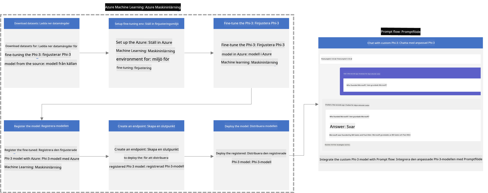

### Innehållsförteckning

1. **[Scenario 1: Ställ in Azure-resurser och förbered för finjustering](../../../../../../md/02.Application/01.TextAndChat/Phi3)**
    - [Skapa ett Azure Machine Learning Workspace](../../../../../../md/02.Application/01.TextAndChat/Phi3)
    - [Begär GPU-kvoter i Azure-prenumerationen](../../../../../../md/02.Application/01.TextAndChat/Phi3)
    - [Lägg till rolltilldelning](../../../../../../md/02.Application/01.TextAndChat/Phi3)
    - [Ställ in projektet](../../../../../../md/02.Application/01.TextAndChat/Phi3)
    - [Förbered dataset för finjustering](../../../../../../md/02.Application/01.TextAndChat/Phi3)

1. **[Scenario 2: Finjustera Phi-3-modellen och distribuera i Azure Machine Learning Studio](../../../../../../md/02.Application/01.TextAndChat/Phi3)**
    - [Ställ in Azure CLI](../../../../../../md/02.Application/01.TextAndChat/Phi3)
    - [Finjustera Phi-3-modellen](../../../../../../md/02.Application/01.TextAndChat/Phi3)
    - [Distribuera den finjusterade modellen](../../../../../../md/02.Application/01.TextAndChat/Phi3)

1. **[Scenario 3: Integrera med Prompt flow och chatta med din anpassade modell](../../../../../../md/02.Application/01.TextAndChat/Phi3)**
    - [Integrera den anpassade Phi-3-modellen med Prompt flow](../../../../../../md/02.Application/01.TextAndChat/Phi3)
    - [Chatta med din anpassade modell](../../../../../../md/02.Application/01.TextAndChat/Phi3)

## Scenario 1: Ställ in Azure-resurser och förbered för finjustering

### Skapa ett Azure Machine Learning Workspace

1. Skriv *azure machine learning* i **sökrutan** högst upp på portalens sida och välj **Azure Machine Learning** från alternativen som visas.

    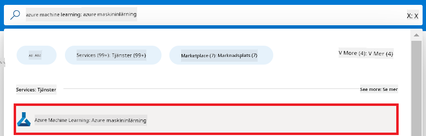

1. Välj **+ Create** i navigationsmenyn.

1. Välj **New workspace** i navigationsmenyn.

    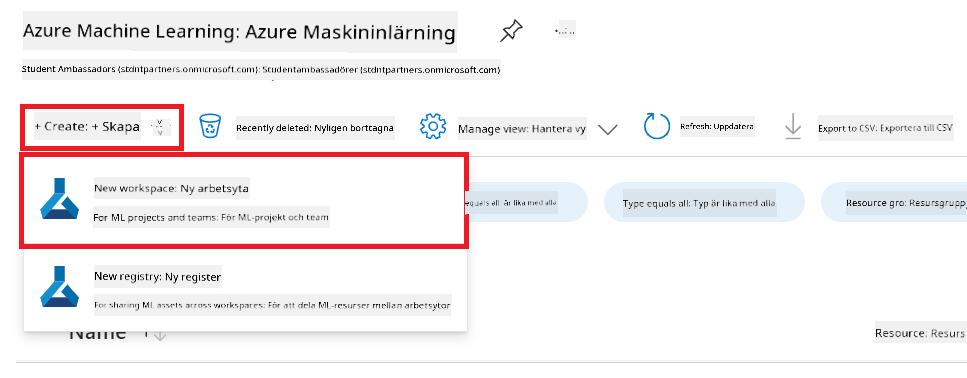

1. Utför följande uppgifter:

    - Välj din Azure **Subscription**.
    - Välj den **Resource group** som ska användas (skapa en ny om det behövs).
    - Ange **Workspace Name**. Det måste vara ett unikt namn.
    - Välj den **Region** du vill använda.
    - Välj det **Storage account** som ska användas (skapa ett nytt om det behövs).
    - Välj den **Key vault** som ska användas (skapa en ny om det behövs).
    - Välj den **Application insights** som ska användas (skapa en ny om det behövs).
    - Välj den **Container registry** som ska användas (skapa en ny om det behövs).

    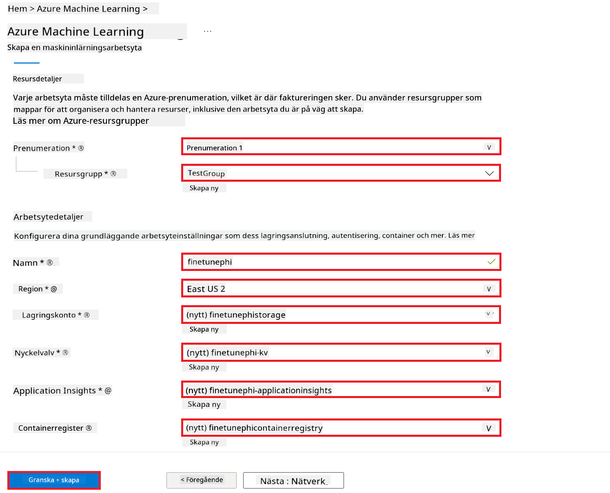

1. Välj **Review + Create**.

1. Välj **Create**.

### Begär GPU-kvoter i Azure-prenumerationen

I detta E2E-exempel kommer du att använda *Standard_NC24ads_A100_v4 GPU* för finjustering, vilket kräver en kvotbegäran, och *Standard_E4s_v3* CPU för distribution, vilket inte kräver någon kvotbegäran.

> [!NOTE]
>
> Endast Pay-As-You-Go-prenumerationer (standardprenumerationstypen) är berättigade till GPU-allokering; förmånsprenumerationer stöds för närvarande inte.
>
> För de som använder förmånsprenumerationer (som Visual Studio Enterprise Subscription) eller vill snabbt testa finjusterings- och distributionsprocessen, ger denna handledning också vägledning för finjustering med ett minimalt dataset med CPU. Det är dock viktigt att notera att finjusteringsresultaten är betydligt bättre när man använder GPU med större dataset.

1. Besök [Azure ML Studio](https://ml.azure.com/home?wt.mc_id=studentamb_279723).

1. Utför följande för att begära *Standard NCADSA100v4 Family* kvot:

    - Välj **Quota** från vänstra sidomenyn.
    - Välj den **Virtual machine family** som ska användas. Till exempel, välj **Standard NCADSA100v4 Family Cluster Dedicated vCPUs**, som inkluderar *Standard_NC24ads_A100_v4* GPU.
    - Välj **Request quota** i navigationsmenyn.

        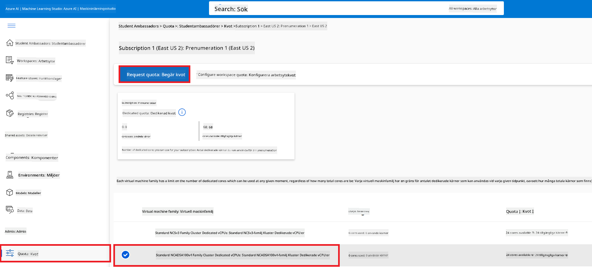

    - På sidan Request quota, ange den **New cores limit** du vill använda. Till exempel 24.
    - På sidan Request quota, välj **Submit** för att begära GPU-kvoten.

> [!NOTE]
> Du kan välja lämplig GPU eller CPU för dina behov genom att hänvisa till dokumentet [Sizes for Virtual Machines in Azure](https://learn.microsoft.com/azure/virtual-machines/sizes/overview?tabs=breakdownseries%2Cgeneralsizelist%2Ccomputesizelist%2Cmemorysizelist%2Cstoragesizelist%2Cgpusizelist%2Cfpgasizelist%2Chpcsizelist).

### Lägg till rolltilldelning

För att finjustera och distribuera dina modeller måste du först skapa en User Assigned Managed Identity (UAI) och tilldela den rätt behörigheter. Denna UAI kommer att användas för autentisering under distributionen.

#### Skapa User Assigned Managed Identity (UAI)

1. Skriv *managed identities* i **sökrutan** högst upp på portalens sida och välj **Managed Identities** från alternativen som visas.

    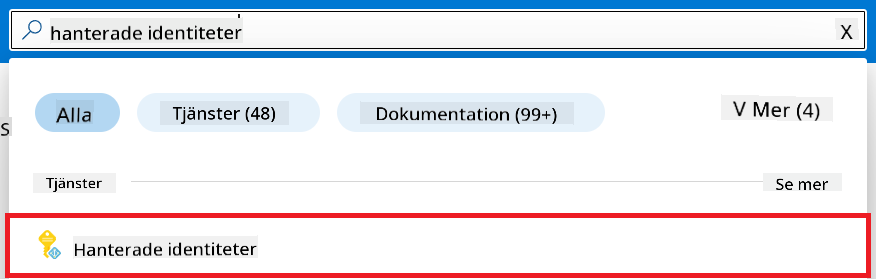

1. Välj **+ Create**.

    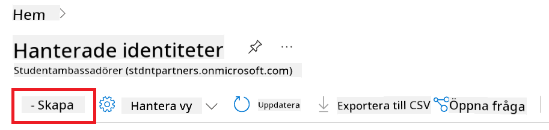

1. Utför följande uppgifter:

    - Välj din Azure **Subscription**.
    - Välj den **Resource group** som ska användas (skapa en ny om det behövs).
    - Välj den **Region** du vill använda.
    - Ange ett **Name**. Det måste vara unikt.

1. Välj **Review + create**.

1. Välj **+ Create**.

#### Lägg till Contributor-rolltilldelning till Managed Identity

1. Navigera till den Managed Identity-resurs du skapade.

1. Välj **Azure role assignments** från vänstra sidomenyn.

1. Välj **+Add role assignment** i navigationsmenyn.

1. På sidan Add role assignment, utför följande:

    - Välj **Scope** till **Resource group**.
    - Välj din Azure **Subscription**.
    - Välj den **Resource group** som ska användas.
    - Välj rollen **Contributor**.

    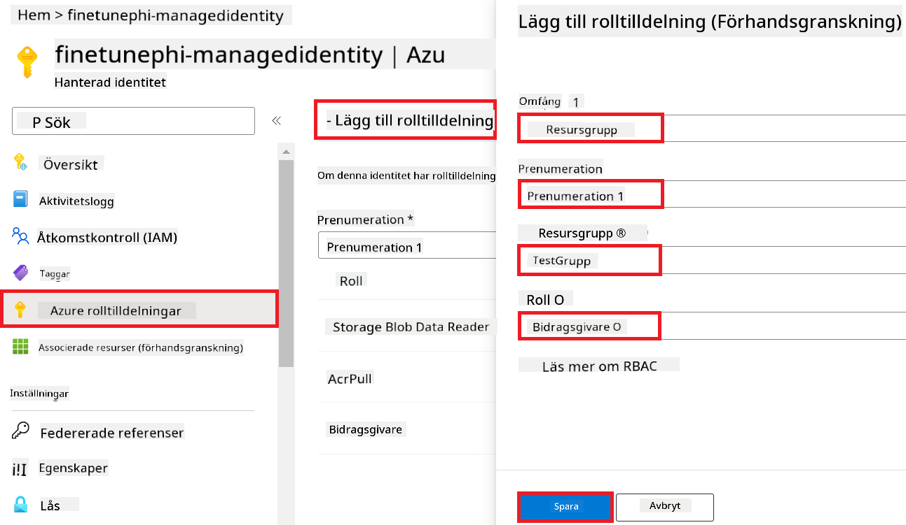

1. Välj **Save**.

#### Lägg till Storage Blob Data Reader-rolltilldelning till Managed Identity

1. Skriv *storage accounts* i **sökrutan** högst upp på portalens sida och välj **Storage accounts** från alternativen som visas.

    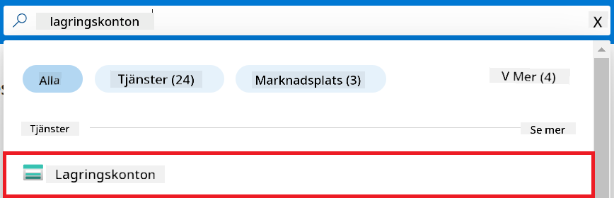

1. Välj det lagringskonto som är kopplat till Azure Machine Learning-workspacet du skapade. Till exempel *finetunephistorage*.

1. Utför följande för att navigera till sidan Add role assignment:

    - Navigera till det Azure Storage-konto du skapade.
    - Välj **Access Control (IAM)** från vänstra sidomenyn.
    - Välj **+ Add** i navigationsmenyn.
    - Välj **Add role assignment** i navigationsmenyn.

    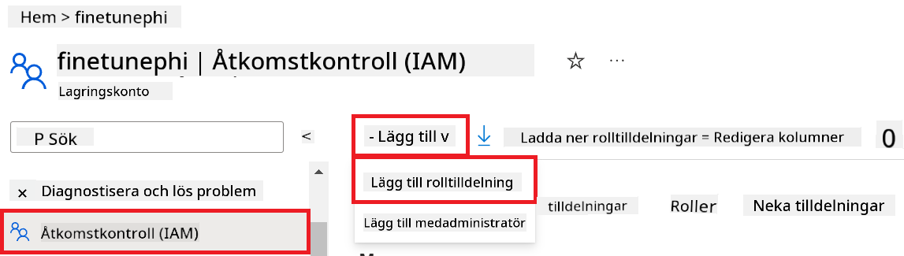

1. På sidan Add role assignment, utför följande:

    - På Role-sidan, skriv *Storage Blob Data Reader* i **sökrutan** och välj **Storage Blob Data Reader** från alternativen som visas.
    - På Role-sidan, välj **Next**.
    - På Members-sidan, välj **Assign access to** **Managed identity**.
    - På Members-sidan, välj **+ Select members**.
    - På sidan Select managed identities, välj din Azure **Subscription**.
    - På sidan Select managed identities, välj **Managed identity** till **Manage Identity**.
    - På sidan Select managed identities, välj den Managed Identity du skapade. Till exempel *finetunephi-managedidentity*.
    - På sidan Select managed identities, välj **Select**.

    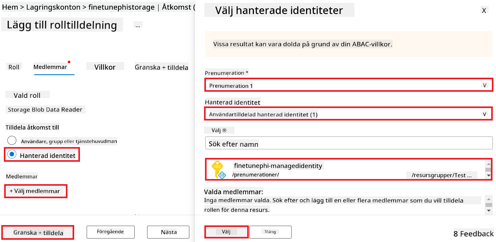

1. Välj **Review + assign**.

#### Lägg till AcrPull-rolltilldelning till Managed Identity

1. Skriv *container registries* i **sökrutan** högst upp på portalens sida och välj **Container registries** från alternativen som visas.

    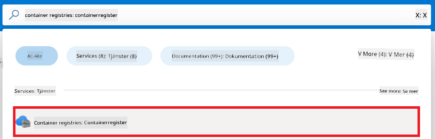

1. Välj den container registry som är kopplad till Azure Machine Learning-workspacet. Till exempel *finetunephicontainerregistries*.

1. Utför följande för att navigera till sidan Add role assignment:

    - Välj **Access Control (IAM)** från vänstra sidomenyn.
    - Välj **+ Add** i navigationsmenyn.
    - Välj **Add role assignment** i navigationsmenyn.

1. På sidan Add role assignment, utför följande:

    - På Role-sidan, skriv *AcrPull* i **sökrutan** och välj **AcrPull** från alternativen som visas.
    - På Role-sidan, välj **Next**.
    - På Members-sidan, välj **Assign access to** **Managed identity**.
    - På Members-sidan, välj **+ Select members**.
    - På sidan Select managed identities, välj din Azure **Subscription**.
    - På sidan Select managed identities, välj **Managed identity** till **Manage Identity**.
    - På sidan Select managed identities, välj den Managed Identity du skapade. Till exempel *finetunephi-managedidentity*.
    - På sidan Select managed identities, välj **Select**.
    - Välj **Review + assign**.

### Ställ in projektet

Nu ska du skapa en mapp att arbeta i och ställa in en virtuell miljö för att utveckla ett program som interagerar med användare och använder lagrad chathistorik från Azure Cosmos DB för att informera sina svar.

#### Skapa en mapp att arbeta i

1. Öppna ett terminalfönster och skriv följande kommando för att skapa en mapp med namnet *finetune-phi* i standardvägen.

    ```console
    mkdir finetune-phi
    ```

1. Skriv följande kommando i terminalen för att navigera till mappen *finetune-phi* som du skapade.

    ```console
    cd finetune-phi
    ```

#### Skapa en virtuell miljö

1. Skriv följande kommando i terminalen för att skapa en virtuell miljö med namnet *.venv*.

    ```console
    python -m venv .venv
    ```

1. Skriv följande kommando i terminalen för att aktivera den virtuella miljön.

    ```console
    .venv\Scripts\activate.bat
    ```
> [!NOTE]
>
> Om det fungerade ska du se *(.venv)* före kommandoprompten.
#### Installera de nödvändiga paketen

1. Skriv följande kommandon i din terminal för att installera de nödvändiga paketen.

    ```console
    pip install datasets==2.19.1
    pip install transformers==4.41.1
    pip install azure-ai-ml==1.16.0
    pip install torch==2.3.1
    pip install trl==0.9.4
    pip install promptflow==1.12.0
    ```

#### Skapa projektfiler

I denna övning kommer du att skapa de viktiga filerna för vårt projekt. Dessa filer inkluderar skript för att ladda ner datasetet, sätta upp Azure Machine Learning-miljön, finjustera Phi-3-modellen och distribuera den finjusterade modellen. Du kommer också att skapa en *conda.yml*-fil för att konfigurera finjusteringsmiljön.

I denna övning kommer du att:

- Skapa en *download_dataset.py*-fil för att ladda ner datasetet.
- Skapa en *setup_ml.py*-fil för att konfigurera Azure Machine Learning-miljön.
- Skapa en *fine_tune.py*-fil i mappen *finetuning_dir* för att finjustera Phi-3-modellen med datasetet.
- Skapa en *conda.yml*-fil för att konfigurera finjusteringsmiljön.
- Skapa en *deploy_model.py*-fil för att distribuera den finjusterade modellen.
- Skapa en *integrate_with_promptflow.py*-fil för att integrera den finjusterade modellen och köra modellen med Prompt flow.
- Skapa en *flow.dag.yml*-fil för att sätta upp arbetsflödesstrukturen för Prompt flow.
- Skapa en *config.py*-fil för att ange Azure-information.

> [!NOTE]
>
> Komplett mappstruktur:
>
> ```text
> └── YourUserName
> .    └── finetune-phi
> .        ├── finetuning_dir
> .        │      └── fine_tune.py
> .        ├── conda.yml
> .        ├── config.py
> .        ├── deploy_model.py
> .        ├── download_dataset.py
> .        ├── flow.dag.yml
> .        ├── integrate_with_promptflow.py
> .        └── setup_ml.py
> ```

1. Öppna **Visual Studio Code**.

1. Välj **File** i menyraden.

1. Välj **Open Folder**.

1. Välj mappen *finetune-phi* som du skapade, som finns på *C:\Users\yourUserName\finetune-phi*.

    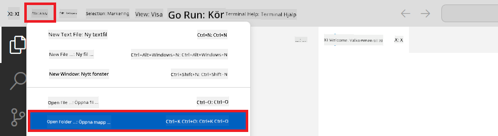

1. I vänstra panelen i Visual Studio Code, högerklicka och välj **New File** för att skapa en ny fil med namnet *download_dataset.py*.

1. I vänstra panelen i Visual Studio Code, högerklicka och välj **New File** för att skapa en ny fil med namnet *setup_ml.py*.

1. I vänstra panelen i Visual Studio Code, högerklicka och välj **New File** för att skapa en ny fil med namnet *deploy_model.py*.

    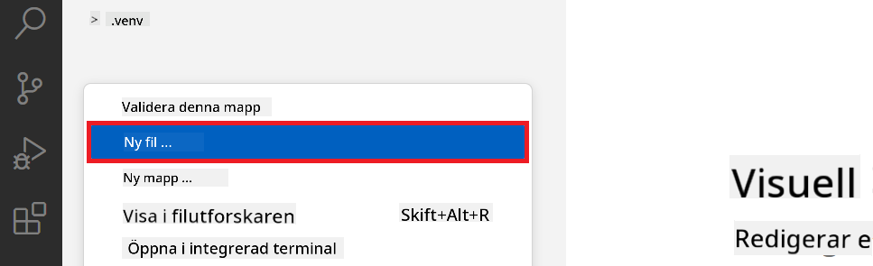

1. I vänstra panelen i Visual Studio Code, högerklicka och välj **New Folder** för att skapa en ny mapp med namnet *finetuning_dir*.

1. I mappen *finetuning_dir*, skapa en ny fil med namnet *fine_tune.py*.

#### Skapa och konfigurera *conda.yml*-filen

1. I vänstra panelen i Visual Studio Code, högerklicka och välj **New File** för att skapa en ny fil med namnet *conda.yml*.

1. Lägg till följande kod i *conda.yml*-filen för att konfigurera finjusteringsmiljön för Phi-3-modellen.

    ```yml
    name: phi-3-training-env
    channels:
      - defaults
      - conda-forge
    dependencies:
      - python=3.10
      - pip
      - numpy<2.0
      - pip:
          - torch==2.4.0
          - torchvision==0.19.0
          - trl==0.8.6
          - transformers==4.41
          - datasets==2.21.0
          - azureml-core==1.57.0
          - azure-storage-blob==12.19.0
          - azure-ai-ml==1.16
          - azure-identity==1.17.1
          - accelerate==0.33.0
          - mlflow==2.15.1
          - azureml-mlflow==1.57.0
    ```

#### Skapa och konfigurera *config.py*-filen

1. I vänstra panelen i Visual Studio Code, högerklicka och välj **New File** för att skapa en ny fil med namnet *config.py*.

1. Lägg till följande kod i *config.py*-filen för att ange din Azure-information.

    ```python
    # Azure settings
    AZURE_SUBSCRIPTION_ID = "your_subscription_id"
    AZURE_RESOURCE_GROUP_NAME = "your_resource_group_name" # "TestGroup"

    # Azure Machine Learning settings
    AZURE_ML_WORKSPACE_NAME = "your_workspace_name" # "finetunephi-workspace"

    # Azure Managed Identity settings
    AZURE_MANAGED_IDENTITY_CLIENT_ID = "your_azure_managed_identity_client_id"
    AZURE_MANAGED_IDENTITY_NAME = "your_azure_managed_identity_name" # "finetunephi-mangedidentity"
    AZURE_MANAGED_IDENTITY_RESOURCE_ID = f"/subscriptions/{AZURE_SUBSCRIPTION_ID}/resourceGroups/{AZURE_RESOURCE_GROUP_NAME}/providers/Microsoft.ManagedIdentity/userAssignedIdentities/{AZURE_MANAGED_IDENTITY_NAME}"

    # Dataset file paths
    TRAIN_DATA_PATH = "data/train_data.jsonl"
    TEST_DATA_PATH = "data/test_data.jsonl"

    # Fine-tuned model settings
    AZURE_MODEL_NAME = "your_fine_tuned_model_name" # "finetune-phi-model"
    AZURE_ENDPOINT_NAME = "your_fine_tuned_model_endpoint_name" # "finetune-phi-endpoint"
    AZURE_DEPLOYMENT_NAME = "your_fine_tuned_model_deployment_name" # "finetune-phi-deployment"

    AZURE_ML_API_KEY = "your_fine_tuned_model_api_key"
    AZURE_ML_ENDPOINT = "your_fine_tuned_model_endpoint_uri" # "https://{your-endpoint-name}.{your-region}.inference.ml.azure.com/score"
    ```

#### Lägg till Azure-miljövariabler

1. Utför följande steg för att lägga till Azure Subscription ID:

    - Skriv *subscriptions* i **sökfältet** högst upp på portalens sida och välj **Subscriptions** från alternativen som visas.
    - Välj den Azure-prenumeration du använder.
    - Kopiera och klistra in ditt Subscription ID i *config.py*-filen.

    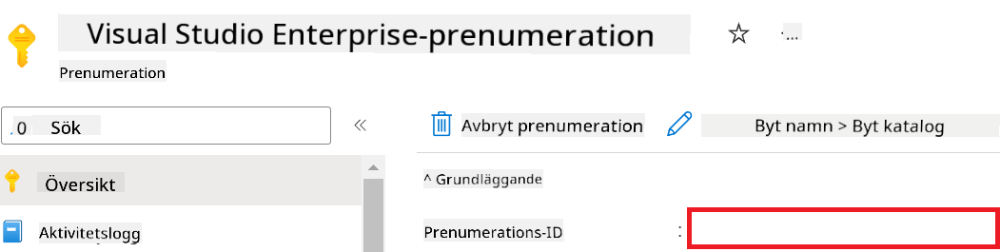

1. Utför följande steg för att lägga till Azure Workspace Name:

    - Navigera till den Azure Machine Learning-resurs du skapade.
    - Kopiera och klistra in ditt kontonamn i *config.py*-filen.

    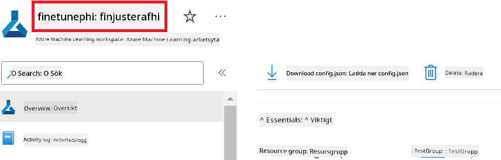

1. Utför följande steg för att lägga till Azure Resource Group Name:

    - Navigera till den Azure Machine Learning-resurs du skapade.
    - Kopiera och klistra in namnet på din Azure Resource Group i *config.py*-filen.

    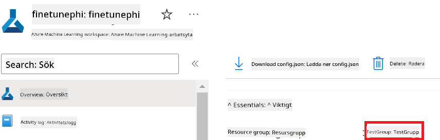

2. Utför följande steg för att lägga till Azure Managed Identity-namn:

    - Navigera till Managed Identities-resursen du skapade.
    - Kopiera och klistra in namnet på din Azure Managed Identity i *config.py*-filen.

    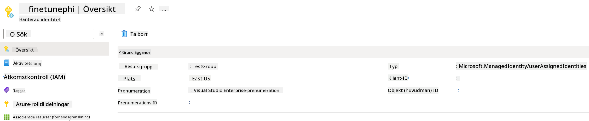

### Förbered dataset för finjustering

I denna övning kommer du att köra filen *download_dataset.py* för att ladda ner *ULTRACHAT_200k*-dataseten till din lokala miljö. Du kommer sedan att använda detta dataset för att finjustera Phi-3-modellen i Azure Machine Learning.

#### Ladda ner ditt dataset med *download_dataset.py*

1. Öppna filen *download_dataset.py* i Visual Studio Code.

1. Lägg till följande kod i *download_dataset.py*.

    ```python
    import json
    import os
    from datasets import load_dataset
    from config import (
        TRAIN_DATA_PATH,
        TEST_DATA_PATH)

    def load_and_split_dataset(dataset_name, config_name, split_ratio):
        """
        Load and split a dataset.
        """
        # Load the dataset with the specified name, configuration, and split ratio
        dataset = load_dataset(dataset_name, config_name, split=split_ratio)
        print(f"Original dataset size: {len(dataset)}")
        
        # Split the dataset into train and test sets (80% train, 20% test)
        split_dataset = dataset.train_test_split(test_size=0.2)
        print(f"Train dataset size: {len(split_dataset['train'])}")
        print(f"Test dataset size: {len(split_dataset['test'])}")
        
        return split_dataset

    def save_dataset_to_jsonl(dataset, filepath):
        """
        Save a dataset to a JSONL file.
        """
        # Create the directory if it does not exist
        os.makedirs(os.path.dirname(filepath), exist_ok=True)
        
        # Open the file in write mode
        with open(filepath, 'w', encoding='utf-8') as f:
            # Iterate over each record in the dataset
            for record in dataset:
                # Dump the record as a JSON object and write it to the file
                json.dump(record, f)
                # Write a newline character to separate records
                f.write('\n')
        
        print(f"Dataset saved to {filepath}")

    def main():
        """
        Main function to load, split, and save the dataset.
        """
        # Load and split the ULTRACHAT_200k dataset with a specific configuration and split ratio
        dataset = load_and_split_dataset("HuggingFaceH4/ultrachat_200k", 'default', 'train_sft[:1%]')
        
        # Extract the train and test datasets from the split
        train_dataset = dataset['train']
        test_dataset = dataset['test']

        # Save the train dataset to a JSONL file
        save_dataset_to_jsonl(train_dataset, TRAIN_DATA_PATH)
        
        # Save the test dataset to a separate JSONL file
        save_dataset_to_jsonl(test_dataset, TEST_DATA_PATH)

    if __name__ == "__main__":
        main()

    ```

> [!TIP]
>
> **Tips för finjustering med ett minimalt dataset på CPU**
>
> Om du vill använda en CPU för finjustering är detta tillvägagångssätt idealiskt för de med förmånsprenumerationer (som Visual Studio Enterprise Subscription) eller för att snabbt testa finjusterings- och distributionsprocessen.
>
> Byt ut `dataset = load_and_split_dataset("HuggingFaceH4/ultrachat_200k", 'default', 'train_sft[:1%]')` mot `dataset = load_and_split_dataset("HuggingFaceH4/ultrachat_200k", 'default', 'train_sft[:10]')`
>

1. Skriv följande kommando i din terminal för att köra skriptet och ladda ner datasetet till din lokala miljö.

    ```console
    python download_data.py
    ```

1. Kontrollera att datasetet sparades korrekt i din lokala *finetune-phi/data*-mapp.

> [!NOTE]
>
> **Datasetstorlek och finjusteringstid**
>
> I detta E2E-exempel använder du endast 1 % av datasetet (`train_sft[:1%]`). Detta minskar mängden data avsevärt, vilket snabbar upp både uppladdning och finjustering. Du kan justera procentandelen för att hitta rätt balans mellan träningstid och modellprestanda. Att använda en mindre delmängd av datasetet minskar tiden som krävs för finjustering, vilket gör processen mer hanterbar för ett E2E-exempel.

## Scenario 2: Finjustera Phi-3-modellen och distribuera i Azure Machine Learning Studio

### Sätt upp Azure CLI

Du behöver konfigurera Azure CLI för att autentisera din miljö. Azure CLI låter dig hantera Azure-resurser direkt från kommandoraden och tillhandahåller de autentiseringsuppgifter som krävs för att Azure Machine Learning ska kunna komma åt dessa resurser. För att komma igång, installera [Azure CLI](https://learn.microsoft.com/cli/azure/install-azure-cli)

1. Öppna ett terminalfönster och skriv följande kommando för att logga in på ditt Azure-konto.

    ```console
    az login
    ```

1. Välj det Azure-konto du vill använda.

1. Välj den Azure-prenumeration du vill använda.

    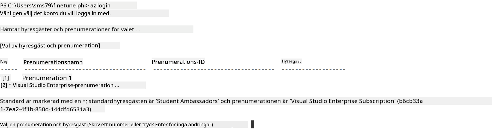

> [!TIP]
>
> Om du har problem med att logga in på Azure, prova att använda en enhetskod. Öppna ett terminalfönster och skriv följande kommando för att logga in på ditt Azure-konto:
>
> ```console
> az login --use-device-code
> ```
>

### Finjustera Phi-3-modellen

I denna övning kommer du att finjustera Phi-3-modellen med det tillhandahållna datasetet. Först definierar du finjusteringsprocessen i filen *fine_tune.py*. Sedan konfigurerar du Azure Machine Learning-miljön och startar finjusteringsprocessen genom att köra filen *setup_ml.py*. Detta skript säkerställer att finjusteringen sker inom Azure Machine Learning-miljön.

Genom att köra *setup_ml.py* startar du finjusteringsprocessen i Azure Machine Learning-miljön.

#### Lägg till kod i filen *fine_tune.py*

1. Navigera till mappen *finetuning_dir* och öppna filen *fine_tune.py* i Visual Studio Code.

1. Lägg till följande kod i *fine_tune.py*.

    ```python
    import argparse
    import sys
    import logging
    import os
    from datasets import load_dataset
    import torch
    import mlflow
    from transformers import AutoModelForCausalLM, AutoTokenizer, TrainingArguments
    from trl import SFTTrainer

    # To avoid the INVALID_PARAMETER_VALUE error in MLflow, disable MLflow integration
    os.environ["DISABLE_MLFLOW_INTEGRATION"] = "True"

    # Logging setup
    logging.basicConfig(
        format="%(asctime)s - %(levelname)s - %(name)s - %(message)s",
        datefmt="%Y-%m-%d %H:%M:%S",
        handlers=[logging.StreamHandler(sys.stdout)],
        level=logging.WARNING
    )
    logger = logging.getLogger(__name__)

    def initialize_model_and_tokenizer(model_name, model_kwargs):
        """
        Initialize the model and tokenizer with the given pretrained model name and arguments.
        """
        model = AutoModelForCausalLM.from_pretrained(model_name, **model_kwargs)
        tokenizer = AutoTokenizer.from_pretrained(model_name)
        tokenizer.model_max_length = 2048
        tokenizer.pad_token = tokenizer.unk_token
        tokenizer.pad_token_id = tokenizer.convert_tokens_to_ids(tokenizer.pad_token)
        tokenizer.padding_side = 'right'
        return model, tokenizer

    def apply_chat_template(example, tokenizer):
        """
        Apply a chat template to tokenize messages in the example.
        """
        messages = example["messages"]
        if messages[0]["role"] != "system":
            messages.insert(0, {"role": "system", "content": ""})
        example["text"] = tokenizer.apply_chat_template(
            messages, tokenize=False, add_generation_prompt=False
        )
        return example

    def load_and_preprocess_data(train_filepath, test_filepath, tokenizer):
        """
        Load and preprocess the dataset.
        """
        train_dataset = load_dataset('json', data_files=train_filepath, split='train')
        test_dataset = load_dataset('json', data_files=test_filepath, split='train')
        column_names = list(train_dataset.features)

        train_dataset = train_dataset.map(
            apply_chat_template,
            fn_kwargs={"tokenizer": tokenizer},
            num_proc=10,
            remove_columns=column_names,
            desc="Applying chat template to train dataset",
        )

        test_dataset = test_dataset.map(
            apply_chat_template,
            fn_kwargs={"tokenizer": tokenizer},
            num_proc=10,
            remove_columns=column_names,
            desc="Applying chat template to test dataset",
        )

        return train_dataset, test_dataset

    def train_and_evaluate_model(train_dataset, test_dataset, model, tokenizer, output_dir):
        """
        Train and evaluate the model.
        """
        training_args = TrainingArguments(
            bf16=True,
            do_eval=True,
            output_dir=output_dir,
            eval_strategy="epoch",
            learning_rate=5.0e-06,
            logging_steps=20,
            lr_scheduler_type="cosine",
            num_train_epochs=3,
            overwrite_output_dir=True,
            per_device_eval_batch_size=4,
            per_device_train_batch_size=4,
            remove_unused_columns=True,
            save_steps=500,
            seed=0,
            gradient_checkpointing=True,
            gradient_accumulation_steps=1,
            warmup_ratio=0.2,
        )

        trainer = SFTTrainer(
            model=model,
            args=training_args,
            train_dataset=train_dataset,
            eval_dataset=test_dataset,
            max_seq_length=2048,
            dataset_text_field="text",
            tokenizer=tokenizer,
            packing=True
        )

        train_result = trainer.train()
        trainer.log_metrics("train", train_result.metrics)

        mlflow.transformers.log_model(
            transformers_model={"model": trainer.model, "tokenizer": tokenizer},
            artifact_path=output_dir,
        )

        tokenizer.padding_side = 'left'
        eval_metrics = trainer.evaluate()
        eval_metrics["eval_samples"] = len(test_dataset)
        trainer.log_metrics("eval", eval_metrics)

    def main(train_file, eval_file, model_output_dir):
        """
        Main function to fine-tune the model.
        """
        model_kwargs = {
            "use_cache": False,
            "trust_remote_code": True,
            "torch_dtype": torch.bfloat16,
            "device_map": None,
            "attn_implementation": "eager"
        }

        # pretrained_model_name = "microsoft/Phi-3-mini-4k-instruct"
        pretrained_model_name = "microsoft/Phi-3.5-mini-instruct"

        with mlflow.start_run():
            model, tokenizer = initialize_model_and_tokenizer(pretrained_model_name, model_kwargs)
            train_dataset, test_dataset = load_and_preprocess_data(train_file, eval_file, tokenizer)
            train_and_evaluate_model(train_dataset, test_dataset, model, tokenizer, model_output_dir)

    if __name__ == "__main__":
        parser = argparse.ArgumentParser()
        parser.add_argument("--train-file", type=str, required=True, help="Path to the training data")
        parser.add_argument("--eval-file", type=str, required=True, help="Path to the evaluation data")
        parser.add_argument("--model_output_dir", type=str, required=True, help="Directory to save the fine-tuned model")
        args = parser.parse_args()
        main(args.train_file, args.eval_file, args.model_output_dir)

    ```

1. Spara och stäng filen *fine_tune.py*.

> [!TIP]
> **Du kan finjustera Phi-3.5-modellen**
>
> I filen *fine_tune.py* kan du ändra `pretrained_model_name` från `"microsoft/Phi-3-mini-4k-instruct"` till vilken modell du vill finjustera. Till exempel, om du ändrar till `"microsoft/Phi-3.5-mini-instruct"`, kommer du att använda Phi-3.5-mini-instruct-modellen för finjustering. För att hitta och använda det modellnamn du föredrar, besök [Hugging Face](https://huggingface.co/), sök efter modellen du är intresserad av och kopiera sedan namnet till fältet `pretrained_model_name` i ditt skript.
>
> :::image type="content" source="../../imgs/03/FineTuning-PromptFlow/finetunephi3.5.png" alt-text="Finjustera Phi-3.5.":::
>

#### Lägg till kod i filen *setup_ml.py*

1. Öppna filen *setup_ml.py* i Visual Studio Code.

1. Lägg till följande kod i *setup_ml.py*.

    ```python
    import logging
    from azure.ai.ml import MLClient, command, Input
    from azure.ai.ml.entities import Environment, AmlCompute
    from azure.identity import AzureCliCredential
    from config import (
        AZURE_SUBSCRIPTION_ID,
        AZURE_RESOURCE_GROUP_NAME,
        AZURE_ML_WORKSPACE_NAME,
        TRAIN_DATA_PATH,
        TEST_DATA_PATH
    )

    # Constants

    # Uncomment the following lines to use a CPU instance for training
    # COMPUTE_INSTANCE_TYPE = "Standard_E16s_v3" # cpu
    # COMPUTE_NAME = "cpu-e16s-v3"
    # DOCKER_IMAGE_NAME = "mcr.microsoft.com/azureml/openmpi4.1.0-ubuntu20.04:latest"

    # Uncomment the following lines to use a GPU instance for training
    COMPUTE_INSTANCE_TYPE = "Standard_NC24ads_A100_v4"
    COMPUTE_NAME = "gpu-nc24s-a100-v4"
    DOCKER_IMAGE_NAME = "mcr.microsoft.com/azureml/curated/acft-hf-nlp-gpu:59"

    CONDA_FILE = "conda.yml"
    LOCATION = "eastus2" # Replace with the location of your compute cluster
    FINETUNING_DIR = "./finetuning_dir" # Path to the fine-tuning script
    TRAINING_ENV_NAME = "phi-3-training-environment" # Name of the training environment
    MODEL_OUTPUT_DIR = "./model_output" # Path to the model output directory in azure ml

    # Logging setup to track the process
    logger = logging.getLogger(__name__)
    logging.basicConfig(
        format="%(asctime)s - %(levelname)s - %(name)s - %(message)s",
        datefmt="%Y-%m-%d %H:%M:%S",
        level=logging.WARNING
    )

    def get_ml_client():
        """
        Initialize the ML Client using Azure CLI credentials.
        """
        credential = AzureCliCredential()
        return MLClient(credential, AZURE_SUBSCRIPTION_ID, AZURE_RESOURCE_GROUP_NAME, AZURE_ML_WORKSPACE_NAME)

    def create_or_get_environment(ml_client):
        """
        Create or update the training environment in Azure ML.
        """
        env = Environment(
            image=DOCKER_IMAGE_NAME,  # Docker image for the environment
            conda_file=CONDA_FILE,  # Conda environment file
            name=TRAINING_ENV_NAME,  # Name of the environment
        )
        return ml_client.environments.create_or_update(env)

    def create_or_get_compute_cluster(ml_client, compute_name, COMPUTE_INSTANCE_TYPE, location):
        """
        Create or update the compute cluster in Azure ML.
        """
        try:
            compute_cluster = ml_client.compute.get(compute_name)
            logger.info(f"Compute cluster '{compute_name}' already exists. Reusing it for the current run.")
        except Exception:
            logger.info(f"Compute cluster '{compute_name}' does not exist. Creating a new one with size {COMPUTE_INSTANCE_TYPE}.")
            compute_cluster = AmlCompute(
                name=compute_name,
                size=COMPUTE_INSTANCE_TYPE,
                location=location,
                tier="Dedicated",  # Tier of the compute cluster
                min_instances=0,  # Minimum number of instances
                max_instances=1  # Maximum number of instances
            )
            ml_client.compute.begin_create_or_update(compute_cluster).wait()  # Wait for the cluster to be created
        return compute_cluster

    def create_fine_tuning_job(env, compute_name):
        """
        Set up the fine-tuning job in Azure ML.
        """
        return command(
            code=FINETUNING_DIR,  # Path to fine_tune.py
            command=(
                "python fine_tune.py "
                "--train-file ${{inputs.train_file}} "
                "--eval-file ${{inputs.eval_file}} "
                "--model_output_dir ${{inputs.model_output}}"
            ),
            environment=env,  # Training environment
            compute=compute_name,  # Compute cluster to use
            inputs={
                "train_file": Input(type="uri_file", path=TRAIN_DATA_PATH),  # Path to the training data file
                "eval_file": Input(type="uri_file", path=TEST_DATA_PATH),  # Path to the evaluation data file
                "model_output": MODEL_OUTPUT_DIR
            }
        )

    def main():
        """
        Main function to set up and run the fine-tuning job in Azure ML.
        """
        # Initialize ML Client
        ml_client = get_ml_client()

        # Create Environment
        env = create_or_get_environment(ml_client)
        
        # Create or get existing compute cluster
        create_or_get_compute_cluster(ml_client, COMPUTE_NAME, COMPUTE_INSTANCE_TYPE, LOCATION)

        # Create and Submit Fine-Tuning Job
        job = create_fine_tuning_job(env, COMPUTE_NAME)
        returned_job = ml_client.jobs.create_or_update(job)  # Submit the job
        ml_client.jobs.stream(returned_job.name)  # Stream the job logs
        
        # Capture the job name
        job_name = returned_job.name
        print(f"Job name: {job_name}")

    if __name__ == "__main__":
        main()

    ```

1. Ersätt `COMPUTE_INSTANCE_TYPE`, `COMPUTE_NAME` och `LOCATION` med dina specifika uppgifter.

    ```python
   # Uncomment the following lines to use a GPU instance for training
    COMPUTE_INSTANCE_TYPE = "Standard_NC24ads_A100_v4"
    COMPUTE_NAME = "gpu-nc24s-a100-v4"
    ...
    LOCATION = "eastus2" # Replace with the location of your compute cluster
    ```

> [!TIP]
>
> **Tips för finjustering med ett minimalt dataset på CPU**
>
> Om du vill använda en CPU för finjustering är detta tillvägagångssätt idealiskt för de med förmånsprenumerationer (som Visual Studio Enterprise Subscription) eller för att snabbt testa finjusterings- och distributionsprocessen.
>
> 1. Öppna filen *setup_ml*.
> 1. Ersätt `COMPUTE_INSTANCE_TYPE`, `COMPUTE_NAME` och `DOCKER_IMAGE_NAME` med följande. Om du inte har tillgång till *Standard_E16s_v3* kan du använda en motsvarande CPU-instans eller begära en ny kvot.
> 1. Ersätt `LOCATION` med dina specifika uppgifter.
>
>    ```python
>    # Uncomment the following lines to use a CPU instance for training
>    COMPUTE_INSTANCE_TYPE = "Standard_E16s_v3" # cpu
>    COMPUTE_NAME = "cpu-e16s-v3"
>    DOCKER_IMAGE_NAME = "mcr.microsoft.com/azureml/openmpi4.1.0-ubuntu20.04:latest"
>    LOCATION = "eastus2" # Replace with the location of your compute cluster
>    ```
>

1. Skriv följande kommando för att köra skriptet *setup_ml.py* och starta finjusteringsprocessen i Azure Machine Learning.

    ```python
    python setup_ml.py
    ```

1. I denna övning har du framgångsrikt finjusterat Phi-3-modellen med Azure Machine Learning. Genom att köra skriptet *setup_ml.py* har du satt upp Azure Machine Learning-miljön och startat finjusteringsprocessen som definierats i filen *fine_tune.py*. Observera att finjusteringsprocessen kan ta en betydande tid. Efter att ha kört kommandot `python setup_ml.py` behöver du vänta tills processen är klar. Du kan följa statusen för finjusteringsjobbet via länken som visas i terminalen till Azure Machine Learning-portalen.

    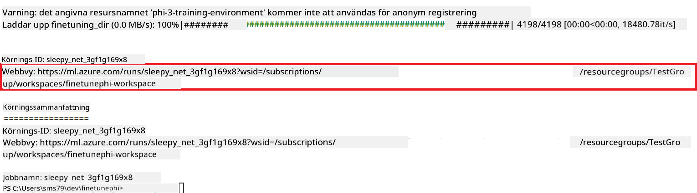

### Distribuera den finjusterade modellen

För att integrera den finjusterade Phi-3-modellen med Prompt Flow behöver du distribuera modellen för att göra den tillgänglig för realtidsinferens. Denna process innebär att registrera modellen, skapa en online-endpoint och distribuera modellen.

#### Ange modellnamn, endpoint-namn och distributionsnamn för distributionen

1. Öppna filen *config.py*.

1. Ersätt `AZURE_MODEL_NAME = "your_fine_tuned_model_name"` med det önskade namnet för din modell.

1. Ersätt `AZURE_ENDPOINT_NAME = "your_fine_tuned_model_endpoint_name"` med det önskade namnet för din endpoint.

1. Ersätt `AZURE_DEPLOYMENT_NAME = "your_fine_tuned_model_deployment_name"` med det önskade namnet för din distribution.

#### Lägg till kod i filen *deploy_model.py*

Att köra filen *deploy_model.py* automatiserar hela distributionsprocessen. Den registrerar modellen, skapar en endpoint och utför distributionen baserat på inställningarna i filen *config.py*, som inkluderar modellnamn, endpoint-namn och distributionsnamn.

1. Öppna filen *deploy_model.py* i Visual Studio Code.

1. Lägg till följande kod i *deploy_model.py*.

    ```python
    import logging
    from azure.identity import AzureCliCredential
    from azure.ai.ml import MLClient
    from azure.ai.ml.entities import Model, ProbeSettings, ManagedOnlineEndpoint, ManagedOnlineDeployment, IdentityConfiguration, ManagedIdentityConfiguration, OnlineRequestSettings
    from azure.ai.ml.constants import AssetTypes

    # Configuration imports
    from config import (
        AZURE_SUBSCRIPTION_ID,
        AZURE_RESOURCE_GROUP_NAME,
        AZURE_ML_WORKSPACE_NAME,
        AZURE_MANAGED_IDENTITY_RESOURCE_ID,
        AZURE_MANAGED_IDENTITY_CLIENT_ID,
        AZURE_MODEL_NAME,
        AZURE_ENDPOINT_NAME,
        AZURE_DEPLOYMENT_NAME
    )

    # Constants
    JOB_NAME = "your-job-name"
    COMPUTE_INSTANCE_TYPE = "Standard_E4s_v3"

    deployment_env_vars = {
        "SUBSCRIPTION_ID": AZURE_SUBSCRIPTION_ID,
        "RESOURCE_GROUP_NAME": AZURE_RESOURCE_GROUP_NAME,
        "UAI_CLIENT_ID": AZURE_MANAGED_IDENTITY_CLIENT_ID,
    }

    # Logging setup
    logging.basicConfig(
        format="%(asctime)s - %(levelname)s - %(name)s - %(message)s",
        datefmt="%Y-%m-%d %H:%M:%S",
        level=logging.DEBUG
    )
    logger = logging.getLogger(__name__)

    def get_ml_client():
        """Initialize and return the ML Client."""
        credential = AzureCliCredential()
        return MLClient(credential, AZURE_SUBSCRIPTION_ID, AZURE_RESOURCE_GROUP_NAME, AZURE_ML_WORKSPACE_NAME)

    def register_model(ml_client, model_name, job_name):
        """Register a new model."""
        model_path = f"azureml://jobs/{job_name}/outputs/artifacts/paths/model_output"
        logger.info(f"Registering model {model_name} from job {job_name} at path {model_path}.")
        run_model = Model(
            path=model_path,
            name=model_name,
            description="Model created from run.",
            type=AssetTypes.MLFLOW_MODEL,
        )
        model = ml_client.models.create_or_update(run_model)
        logger.info(f"Registered model ID: {model.id}")
        return model

    def delete_existing_endpoint(ml_client, endpoint_name):
        """Delete existing endpoint if it exists."""
        try:
            endpoint_result = ml_client.online_endpoints.get(name=endpoint_name)
            logger.info(f"Deleting existing endpoint {endpoint_name}.")
            ml_client.online_endpoints.begin_delete(name=endpoint_name).result()
            logger.info(f"Deleted existing endpoint {endpoint_name}.")
        except Exception as e:
            logger.info(f"No existing endpoint {endpoint_name} found to delete: {e}")

    def create_or_update_endpoint(ml_client, endpoint_name, description=""):
        """Create or update an endpoint."""
        delete_existing_endpoint(ml_client, endpoint_name)
        logger.info(f"Creating new endpoint {endpoint_name}.")
        endpoint = ManagedOnlineEndpoint(
            name=endpoint_name,
            description=description,
            identity=IdentityConfiguration(
                type="user_assigned",
                user_assigned_identities=[ManagedIdentityConfiguration(resource_id=AZURE_MANAGED_IDENTITY_RESOURCE_ID)]
            )
        )
        endpoint_result = ml_client.online_endpoints.begin_create_or_update(endpoint).result()
        logger.info(f"Created new endpoint {endpoint_name}.")
        return endpoint_result

    def create_or_update_deployment(ml_client, endpoint_name, deployment_name, model):
        """Create or update a deployment."""

        logger.info(f"Creating deployment {deployment_name} for endpoint {endpoint_name}.")
        deployment = ManagedOnlineDeployment(
            name=deployment_name,
            endpoint_name=endpoint_name,
            model=model.id,
            instance_type=COMPUTE_INSTANCE_TYPE,
            instance_count=1,
            environment_variables=deployment_env_vars,
            request_settings=OnlineRequestSettings(
                max_concurrent_requests_per_instance=3,
                request_timeout_ms=180000,
                max_queue_wait_ms=120000
            ),
            liveness_probe=ProbeSettings(
                failure_threshold=30,
                success_threshold=1,
                period=100,
                initial_delay=500,
            ),
            readiness_probe=ProbeSettings(
                failure_threshold=30,
                success_threshold=1,
                period=100,
                initial_delay=500,
            ),
        )
        deployment_result = ml_client.online_deployments.begin_create_or_update(deployment).result()
        logger.info(f"Created deployment {deployment.name} for endpoint {endpoint_name}.")
        return deployment_result

    def set_traffic_to_deployment(ml_client, endpoint_name, deployment_name):
        """Set traffic to the specified deployment."""
        try:
            # Fetch the current endpoint details
            endpoint = ml_client.online_endpoints.get(name=endpoint_name)
            
            # Log the current traffic allocation for debugging
            logger.info(f"Current traffic allocation: {endpoint.traffic}")
            
            # Set the traffic allocation for the deployment
            endpoint.traffic = {deployment_name: 100}
            
            # Update the endpoint with the new traffic allocation
            endpoint_poller = ml_client.online_endpoints.begin_create_or_update(endpoint)
            updated_endpoint = endpoint_poller.result()
            
            # Log the updated traffic allocation for debugging
            logger.info(f"Updated traffic allocation: {updated_endpoint.traffic}")
            logger.info(f"Set traffic to deployment {deployment_name} at endpoint {endpoint_name}.")
            return updated_endpoint
        except Exception as e:
            # Log any errors that occur during the process
            logger.error(f"Failed to set traffic to deployment: {e}")
            raise


    def main():
        ml_client = get_ml_client()

        registered_model = register_model(ml_client, AZURE_MODEL_NAME, JOB_NAME)
        logger.info(f"Registered model ID: {registered_model.id}")

        endpoint = create_or_update_endpoint(ml_client, AZURE_ENDPOINT_NAME, "Endpoint for finetuned Phi-3 model")
        logger.info(f"Endpoint {AZURE_ENDPOINT_NAME} is ready.")

        try:
            deployment = create_or_update_deployment(ml_client, AZURE_ENDPOINT_NAME, AZURE_DEPLOYMENT_NAME, registered_model)
            logger.info(f"Deployment {AZURE_DEPLOYMENT_NAME} is created for endpoint {AZURE_ENDPOINT_NAME}.")

            set_traffic_to_deployment(ml_client, AZURE_ENDPOINT_NAME, AZURE_DEPLOYMENT_NAME)
            logger.info(f"Traffic is set to deployment {AZURE_DEPLOYMENT_NAME} at endpoint {AZURE_ENDPOINT_NAME}.")
        except Exception as e:
            logger.error(f"Failed to create or update deployment: {e}")

    if __name__ == "__main__":
        main()

    ```

1. Utför följande steg för att få `JOB_NAME`:

    - Navigera till den Azure Machine Learning-resurs du skapade.
    - Välj **Studio web URL** för att öppna Azure Machine Learning-arbetsytan.
    - Välj **Jobs** från fliken till vänster.
    - Välj experimentet för finjustering, till exempel *finetunephi*.
    - Välj det jobb du skapade.
- Kopiera och klistra in ditt jobbnamn i `JOB_NAME = "your-job-name"` i filen *deploy_model.py*.

1. Byt ut `COMPUTE_INSTANCE_TYPE` med dina specifika uppgifter.

1. Skriv följande kommando för att köra skriptet *deploy_model.py* och starta distributionsprocessen i Azure Machine Learning.

    ```python
    python deploy_model.py
    ```


> [!WARNING]
> För att undvika extra kostnader på ditt konto, se till att ta bort den skapade endpointen i Azure Machine Learning-arbetsytan.
>

#### Kontrollera distributionsstatus i Azure Machine Learning-arbetsyta

1. Besök [Azure ML Studio](https://ml.azure.com/home?wt.mc_id=studentamb_279723).

1. Navigera till den Azure Machine Learning-arbetsyta som du skapade.

1. Välj **Studio web URL** för att öppna Azure Machine Learning-arbetsytan.

1. Välj **Endpoints** från fliken till vänster.

    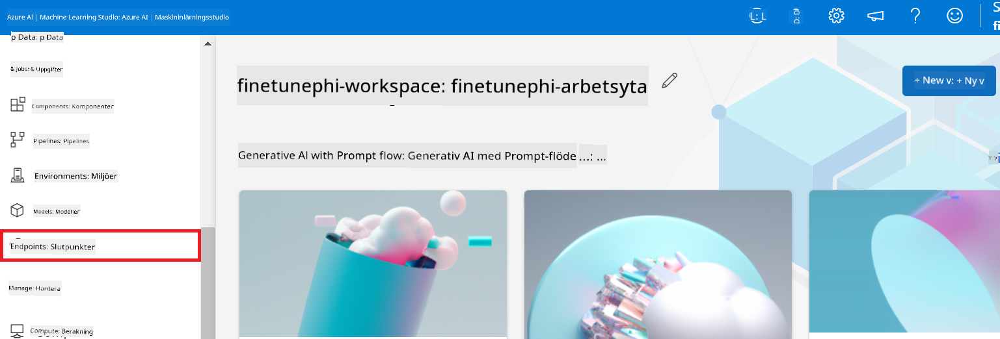

2. Välj den endpoint som du skapade.

    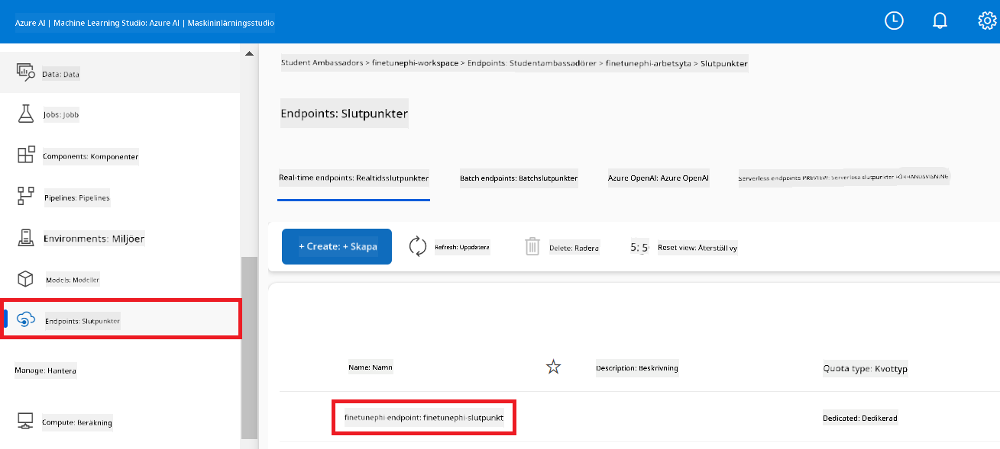

3. På denna sida kan du hantera de endpoints som skapades under distributionsprocessen.

## Scenario 3: Integrera med Prompt flow och chatta med din anpassade modell

### Integrera den anpassade Phi-3-modellen med Prompt flow

Efter att du framgångsrikt har distribuerat din finjusterade modell kan du nu integrera den med Prompt flow för att använda din modell i realtidsapplikationer, vilket möjliggör en rad interaktiva uppgifter med din anpassade Phi-3-modell.

#### Ange api-nyckel och endpoint-URI för den finjusterade Phi-3-modellen

1. Navigera till den Azure Machine Learning-arbetsyta som du skapade.
1. Välj **Endpoints** från fliken till vänster.
1. Välj den endpoint som du skapade.
1. Välj **Consume** i navigationsmenyn.
1. Kopiera och klistra in din **REST endpoint** i filen *config.py*, och ersätt `AZURE_ML_ENDPOINT = "your_fine_tuned_model_endpoint_uri"` med din **REST endpoint**.
1. Kopiera och klistra in din **Primary key** i filen *config.py*, och ersätt `AZURE_ML_API_KEY = "your_fine_tuned_model_api_key"` med din **Primary key**.

    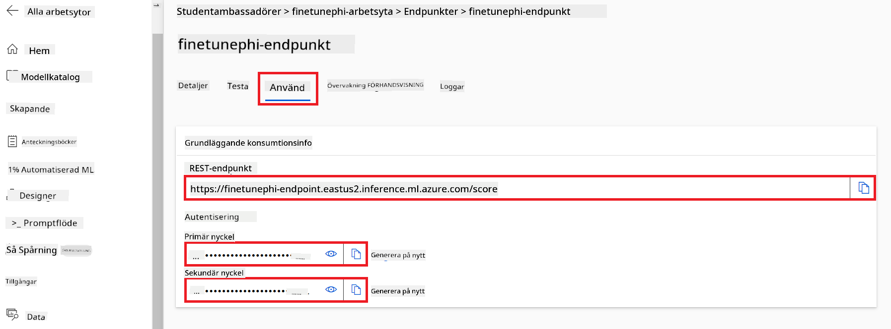

#### Lägg till kod i filen *flow.dag.yml*

1. Öppna filen *flow.dag.yml* i Visual Studio Code.

1. Lägg till följande kod i *flow.dag.yml*.

    ```yml
    inputs:
      input_data:
        type: string
        default: "Who founded Microsoft?"

    outputs:
      answer:
        type: string
        reference: ${integrate_with_promptflow.output}

    nodes:
    - name: integrate_with_promptflow
      type: python
      source:
        type: code
        path: integrate_with_promptflow.py
      inputs:
        input_data: ${inputs.input_data}
    ```

#### Lägg till kod i filen *integrate_with_promptflow.py*

1. Öppna filen *integrate_with_promptflow.py* i Visual Studio Code.

1. Lägg till följande kod i *integrate_with_promptflow.py*.

    ```python
    import logging
    import requests
    from promptflow.core import tool
    import asyncio
    import platform
    from config import (
        AZURE_ML_ENDPOINT,
        AZURE_ML_API_KEY
    )

    # Logging setup
    logging.basicConfig(
        format="%(asctime)s - %(levelname)s - %(name)s - %(message)s",
        datefmt="%Y-%m-%d %H:%M:%S",
        level=logging.DEBUG
    )
    logger = logging.getLogger(__name__)

    def query_azml_endpoint(input_data: list, endpoint_url: str, api_key: str) -> str:
        """
        Send a request to the Azure ML endpoint with the given input data.
        """
        headers = {
            "Content-Type": "application/json",
            "Authorization": f"Bearer {api_key}"
        }
        data = {
            "input_data": [input_data],
            "params": {
                "temperature": 0.7,
                "max_new_tokens": 128,
                "do_sample": True,
                "return_full_text": True
            }
        }
        try:
            response = requests.post(endpoint_url, json=data, headers=headers)
            response.raise_for_status()
            result = response.json()[0]
            logger.info("Successfully received response from Azure ML Endpoint.")
            return result
        except requests.exceptions.RequestException as e:
            logger.error(f"Error querying Azure ML Endpoint: {e}")
            raise

    def setup_asyncio_policy():
        """
        Setup asyncio event loop policy for Windows.
        """
        if platform.system() == 'Windows':
            asyncio.set_event_loop_policy(asyncio.WindowsSelectorEventLoopPolicy())
            logger.info("Set Windows asyncio event loop policy.")

    @tool
    def my_python_tool(input_data: str) -> str:
        """
        Tool function to process input data and query the Azure ML endpoint.
        """
        setup_asyncio_policy()
        return query_azml_endpoint(input_data, AZURE_ML_ENDPOINT, AZURE_ML_API_KEY)

    ```

### Chatta med din anpassade modell

1. Skriv följande kommando för att köra skriptet *deploy_model.py* och starta distributionsprocessen i Azure Machine Learning.

    ```python
    pf flow serve --source ./ --port 8080 --host localhost
    ```

1. Här är ett exempel på resultatet: Nu kan du chatta med din anpassade Phi-3-modell. Det rekommenderas att ställa frågor baserade på den data som användes för finjusteringen.

    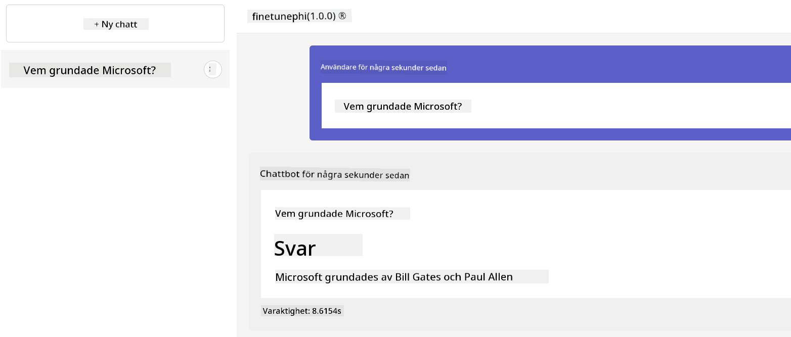

**Ansvarsfriskrivning**:  
Detta dokument har översatts med hjälp av AI-översättningstjänsten [Co-op Translator](https://github.com/Azure/co-op-translator). Även om vi strävar efter noggrannhet, vänligen observera att automatiska översättningar kan innehålla fel eller brister. Det ursprungliga dokumentet på dess modersmål bör betraktas som den auktoritativa källan. För kritisk information rekommenderas professionell mänsklig översättning. Vi ansvarar inte för några missförstånd eller feltolkningar som uppstår vid användning av denna översättning.