<!--
CO_OP_TRANSLATOR_METADATA:
{
  "original_hash": "0df910a227098303cc392b6ad204c271",
  "translation_date": "2026-01-06T04:43:06+00:00",
  "source_file": "md/02.Application/01.TextAndChat/Phi3/E2E_Phi-3-FineTuning_PromptFlow_Integration_AIFoundry.md",
  "language_code": "sv"
}
-->
# Finjustera och integrera anpassade Phi-3-modeller med Prompt flow i Azure AI Foundry

Detta end-to-end (E2E) exempel är baserat på guiden "[Fine-Tune and Integrate Custom Phi-3 Models with Prompt Flow in Azure AI Foundry](https://techcommunity.microsoft.com/t5/educator-developer-blog/fine-tune-and-integrate-custom-phi-3-models-with-prompt-flow-in/ba-p/4191726?WT.mc_id=aiml-137032-kinfeylo)" från Microsoft Tech Community. Den introducerar processerna för finjustering, driftsättning och integration av anpassade Phi-3-modeller med Prompt flow i Azure AI Foundry.
Till skillnad från E2E-exemplet, "[Fine-Tune and Integrate Custom Phi-3 Models with Prompt Flow](./E2E_Phi-3-FineTuning_PromptFlow_Integration.md)", som involverade körning av kod lokalt, fokuserar denna handledning helt på att finjustera och integrera din modell inom Azure AI / ML Studio.

## Översikt

I detta E2E-exempel kommer du att lära dig hur du finjusterar Phi-3-modellen och integrerar den med Prompt flow i Azure AI Foundry. Genom att utnyttja Azure AI / ML Studio kommer du att skapa ett arbetsflöde för att driftsätta och använda anpassade AI-modeller. Detta E2E-exempel är uppdelat i tre scenarier:

**Scenario 1: Ställ in Azure-resurser och förbered för finjustering**

**Scenario 2: Finjustera Phi-3-modellen och driftsätt i Azure Machine Learning Studio**

**Scenario 3: Integrera med Prompt flow och chatta med din anpassade modell i Azure AI Foundry**

Här är en översikt av detta E2E-exempel.


### Innehållsförteckning

1. **[Scenario 1: Ställ in Azure-resurser och förbered för finjustering](../../../../../../md/02.Application/01.TextAndChat/Phi3)**
    - [Skapa en Azure Machine Learning Workspace](../../../../../../md/02.Application/01.TextAndChat/Phi3)
    - [Begär GPU-kvoter i Azure Subscription](../../../../../../md/02.Application/01.TextAndChat/Phi3)
    - [Lägg till rolltilldelning](../../../../../../md/02.Application/01.TextAndChat/Phi3)
    - [Ställ in projekt](../../../../../../md/02.Application/01.TextAndChat/Phi3)
    - [Förbered dataset för finjustering](../../../../../../md/02.Application/01.TextAndChat/Phi3)

1. **[Scenario 2: Finjustera Phi-3-modellen och driftsätt i Azure Machine Learning Studio](../../../../../../md/02.Application/01.TextAndChat/Phi3)**
    - [Finjustera Phi-3-modellen](../../../../../../md/02.Application/01.TextAndChat/Phi3)
    - [Driftsätt den finjusterade Phi-3-modellen](../../../../../../md/02.Application/01.TextAndChat/Phi3)

1. **[Scenario 3: Integrera med Prompt flow och chatta med din anpassade modell i Azure AI Foundry](../../../../../../md/02.Application/01.TextAndChat/Phi3)**
    - [Integrera den anpassade Phi-3-modellen med Prompt flow](../../../../../../md/02.Application/01.TextAndChat/Phi3)
    - [Chatta med din anpassade Phi-3-modell](../../../../../../md/02.Application/01.TextAndChat/Phi3)

## Scenario 1: Ställ in Azure-resurser och förbered för finjustering

### Skapa en Azure Machine Learning Workspace

1. Skriv *azure machine learning* i **sökrutan** högst upp på portalens sida och välj **Azure Machine Learning** från alternativen som visas.

    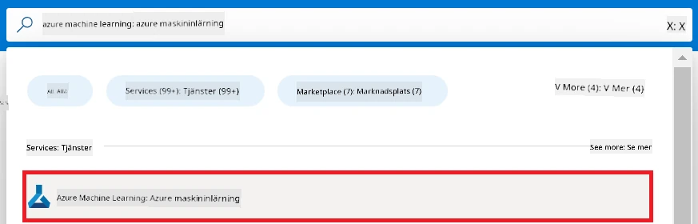

2. Välj **+ Skapa** från navigationsmenyn.

3. Välj **Ny arbetsyta** från navigationsmenyn.

    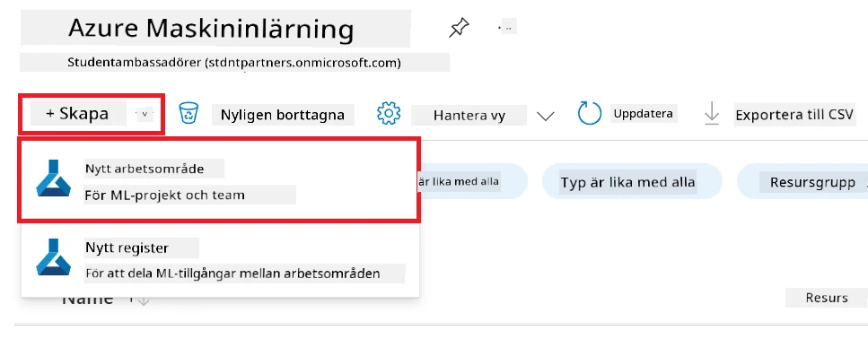

4. Utför följande uppgifter:

    - Välj din Azure-**Subscription**.
    - Välj **Resursgrupp** att använda (skapa en ny om det behövs).
    - Ange **Arbetsyte-namn**. Det måste vara ett unikt värde.
    - Välj **Region** du vill använda.
    - Välj **Lagringskonto** att använda (skapa ett nytt om det behövs).
    - Välj **Key vault** att använda (skapa ett nytt om det behövs).
    - Välj **Application insights** att använda (skapa en ny om det behövs).
    - Välj **Container registry** att använda (skapa en ny om det behövs).

    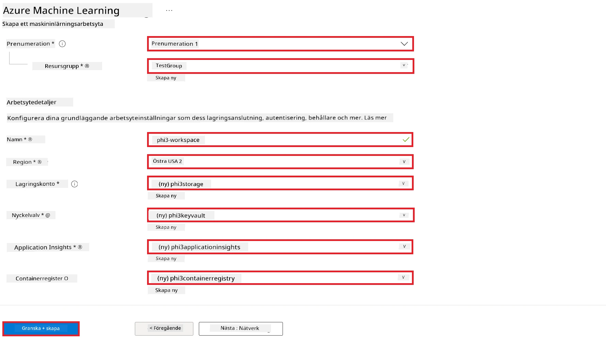

5. Välj **Granska + skapa**.

6. Välj **Skapa**.

### Begär GPU-kvoter i Azure Subscription

I denna handledning kommer du att lära dig hur du finjusterar och driftsätter en Phi-3-modell med hjälp av GPU:er. För finjustering använder du GPU:n *Standard_NC24ads_A100_v4*, vilken kräver en kvotbegäran. För driftsättning använder du GPU:n *Standard_NC6s_v3*, som också kräver en kvotbegäran.

> [!NOTE]
>
> Endast Pay-As-You-Go-abonnemang (standard abonnemangstyp) är berättigade till GPU-tilldelning; förmånprenumerationer stöds för närvarande inte.
>

1. Besök [Azure ML Studio](https://ml.azure.com/home?wt.mc_id=studentamb_279723).

1. Utför följande för att begära *Standard NCADSA100v4 Family* kvot:

    - Välj **Kvot** från fliken till vänster.
    - Välj den **Virtuella maskinfamilj** du vill använda. Till exempel välj **Standard NCADSA100v4 Family Cluster Dedicated vCPUs**, som inkluderar GPU:n *Standard_NC24ads_A100_v4*.
    - Välj **Begär kvot** från navigationsmenyn.

        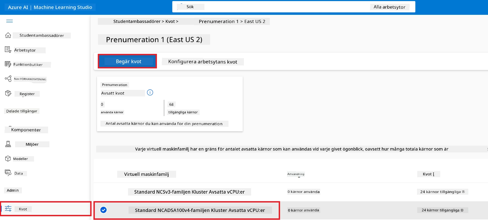

    - På sidan Begär kvot, ange det **Nya kärnbegränsning** du vill använda. Till exempel 24.
    - På sidan Begär kvot, välj **Skicka** för att begära GPU-kvoten.

1. Utför följande för att begära *Standard NCSv3 Family* kvot:

    - Välj **Kvot** från fliken till vänster.
    - Välj den **Virtuella maskinfamilj** du vill använda. Till exempel välj **Standard NCSv3 Family Cluster Dedicated vCPUs**, som innehåller GPU:n *Standard_NC6s_v3*.
    - Välj **Begär kvot** från navigationsmenyn.
    - På sidan Begär kvot, ange det **Nya kärnbegränsning** du vill använda. Till exempel 24.
    - På sidan Begär kvot, välj **Skicka** för att begära GPU-kvoten.

### Lägg till rolltilldelning

För att finjustera och driftsätta dina modeller måste du först skapa en User Assigned Managed Identity (UAI) och tilldela den lämpliga behörigheter. Denna UAI kommer att användas för autentisering under driftsättningen.

#### Skapa User Assigned Managed Identity(UAI)

1. Skriv *managed identities* i **sökrutan** högst upp på portalens sida och välj **Managed Identities** från alternativen som visas.

    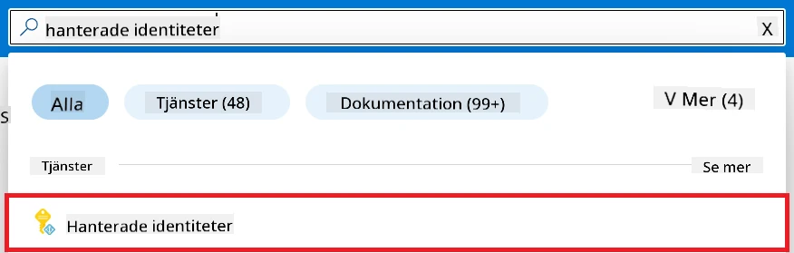

1. Välj **+ Skapa**.

    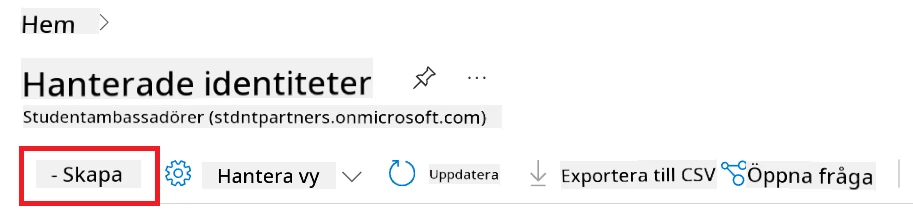

1. Utför följande uppgifter:

    - Välj din Azure-**Subscription**.
    - Välj **Resursgrupp** att använda (skapa en ny om det behövs).
    - Välj **Region** du vill använda.
    - Ange **Namn**. Det måste vara ett unikt värde.

    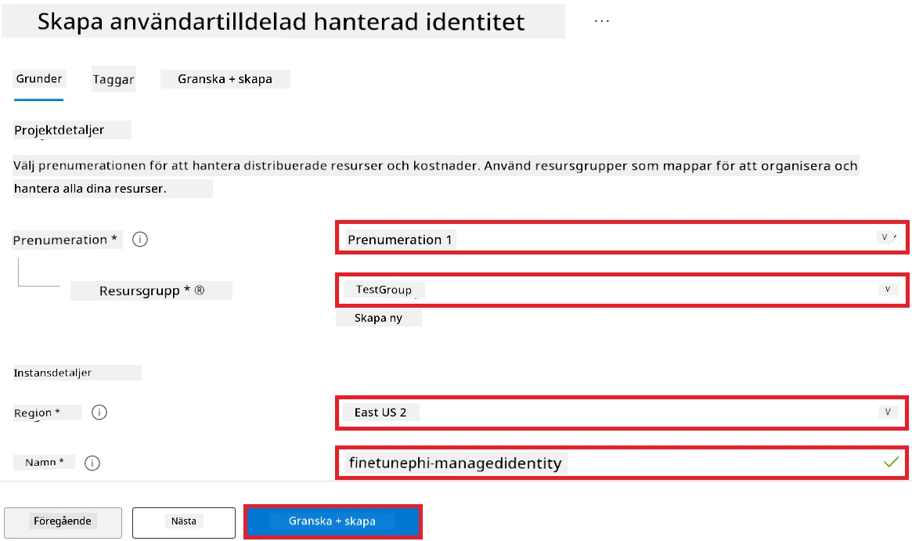

1. Välj **Granska + skapa**.

1. Välj **+ Skapa**.

#### Lägg till rolltilldelningen Contributor till Managed Identity

1. Navigera till Managed Identity-resursen som du skapade.

1. Välj **Azure rolltilldelningar** från fliken till vänster.

1. Välj **+ Lägg till rolltilldelning** från navigationsmenyn.

1. På sidan Lägg till rolltilldelning, utför följande uppgifter:
    - Välj **Omfång** till **Resursgrupp**.
    - Välj din Azure-**Subscription**.
    - Välj **Resursgrupp** att använda.
    - Välj **Roll** till **Contributor**.

    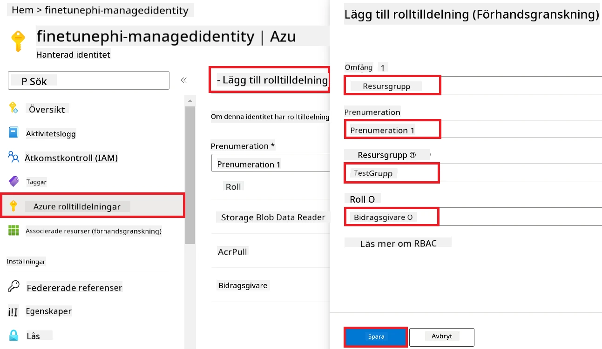

2. Välj **Spara**.

#### Lägg till rolltilldelningen Storage Blob Data Reader till Managed Identity

1. Skriv *storage accounts* i **sökrutan** högst upp på portalens sida och välj **Lagringskonton** från alternativen som visas.

    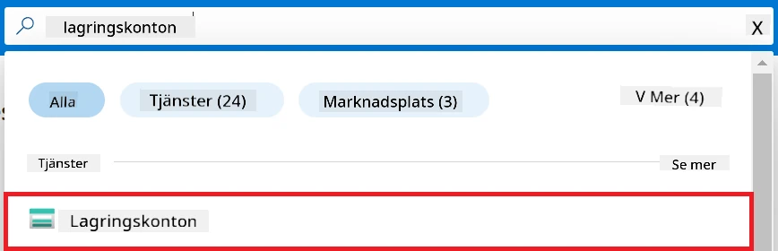

1. Välj det lagringskonto som är kopplat till Azure Machine Learning-arbetsytan du skapade. Exempelvis *finetunephistorage*.

1. Utför följande för att navigera till sidan Lägg till rolltilldelning:

    - Navigera till det Azure-lagringskonto du skapade.
    - Välj **Access Control (IAM)** från fliken till vänster.
    - Välj **+ Lägg till** från navigationsmenyn.
    - Välj **Lägg till rolltilldelning** från navigationsmenyn.

    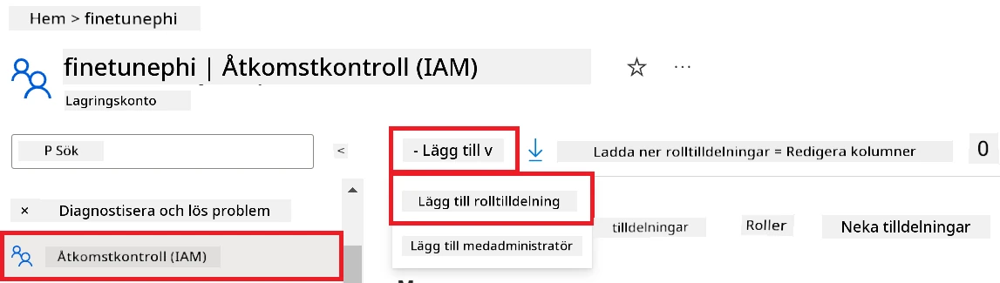

1. På sidan Lägg till rolltilldelning, utför följande:

    - På Roll-sidan, skriv *Storage Blob Data Reader* i **sökrutan** och välj **Storage Blob Data Reader** från alternativen som visas.
    - På Roll-sidan, välj **Nästa**.
    - På Medlemmar-sidan, välj **Tilldela åtkomst till** **Hantera identitet**.
    - På Medlemmar-sidan, välj **+ Välj medlemmar**.
    - På sidan Välj hanterade identiteter, välj din Azure-**Subscription**.
    - På sidan Välj hanterade identiteter, välj den **Hanterade identiteten** som **Hantera identitet**.
    - På sidan Välj hanterade identiteter, välj den Hanterade identitet du skapade. Till exempel, *finetunephi-managedidentity*.
    - På sidan Välj hanterade identiteter, välj **Välj**.

    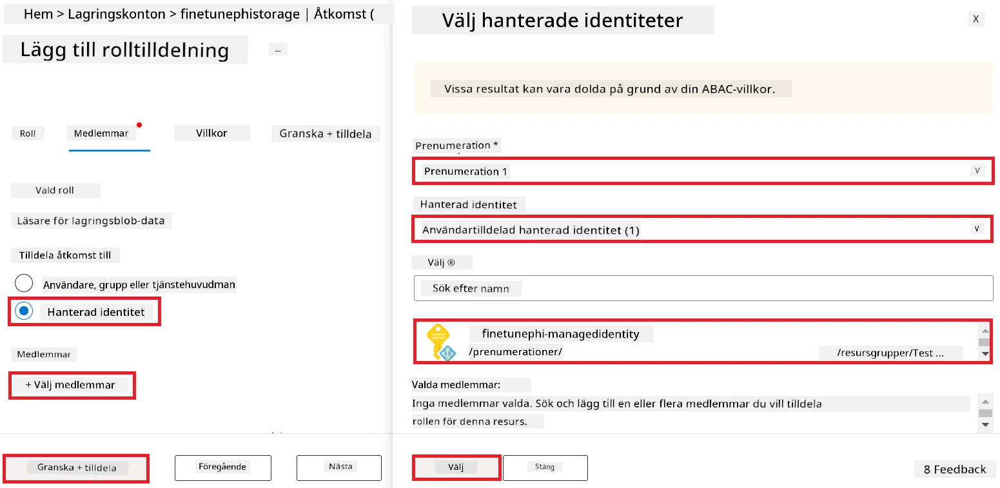

1. Välj **Granska + tilldela**.

#### Lägg till rolltilldelningen AcrPull till Managed Identity

1. Skriv *container registries* i **sökrutan** högst upp på portalens sida och välj **Container registries** från alternativen som visas.

    

1. Välj det containerregister som är kopplat till Azure Machine Learning-arbetsytan. Till exempel, *finetunephicontainerregistry*

1. Utför följande för att navigera till sidan Lägg till rolltilldelning:

    - Välj **Access Control (IAM)** från fliken till vänster.
    - Välj **+ Lägg till** från navigationsmenyn.
    - Välj **Lägg till rolltilldelning** från navigationsmenyn.

1. På sidan Lägg till rolltilldelning, utför följande:

    - På Roll-sidan, skriv *AcrPull* i **sökrutan** och välj **AcrPull** från alternativen som visas.
    - På Roll-sidan, välj **Nästa**.
    - På Medlemmar-sidan, välj **Tilldela åtkomst till** **Hantera identitet**.
    - På Medlemmar-sidan, välj **+ Välj medlemmar**.
    - På sidan Välj hanterade identiteter, välj din Azure-**Subscription**.
    - På sidan Välj hanterade identiteter, välj den **Hanterade identiteten** som **Hantera identitet**.
    - På sidan Välj hanterade identiteter, välj den Hanterade identitet du skapade. Till exempel, *finetunephi-managedidentity*.
    - På sidan Välj hanterade identiteter, välj **Välj**.
    - Välj **Granska + tilldela**.

### Ställ in projekt

För att ladda ner de dataset som behövs för finjustering kommer du att ställa in en lokal miljö.

I denna övning kommer du att

- Skapa en mapp att arbeta i.
- Skapa en virtuell miljö.
- Installera nödvändiga paket.
- Skapa en fil *download_dataset.py* för att ladda ner datasetet.

#### Skapa en mapp att arbeta i

1. Öppna ett terminalfönster och skriv följande kommando för att skapa en mapp med namnet *finetune-phi* i standardvägen.

    ```console
    mkdir finetune-phi
    ```

2. Skriv följande kommando i din terminal för att navigera till mappen *finetune-phi* som du skapade.

    ```console
    cd finetune-phi
    ```

#### Skapa en virtuell miljö

1. Skriv följande kommando i din terminal för att skapa en virtuell miljö som heter *.venv*.

    ```console
    python -m venv .venv
    ```

2. Skriv följande kommando i din terminal för att aktivera den virtuella miljön.

    ```console
    .venv\Scripts\activate.bat
    ```

> [!NOTE]
> Om det fungerade borde du se *(.venv)* före kommandoprompten.

#### Installera nödvändiga paket

1. Skriv följande kommandon i din terminal för att installera de nödvändiga paketen.

    ```console
    pip install datasets==2.19.1
    ```

#### Skapa `donload_dataset.py`

> [!NOTE]
> Komplett mappstruktur:
>
> ```text
> └── YourUserName
> .    └── finetune-phi
> .        └── download_dataset.py
> ```

1. Öppna **Visual Studio Code**.

1. Välj **File** i menyraden.

1. Välj **Open Folder**.

1. Välj mappen *finetune-phi* som du skapade, som finns i *C:\Users\yourUserName\finetune-phi*.

    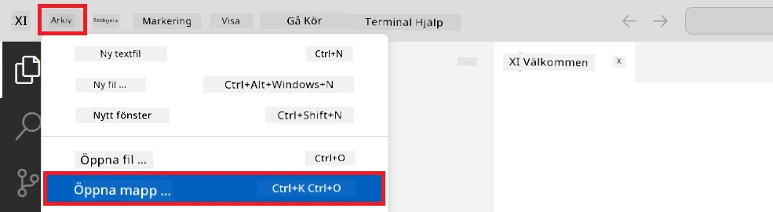

1. I vänstra panelen i Visual Studio Code, högerklicka och välj **New File** för att skapa en ny fil med namnet *download_dataset.py*.

    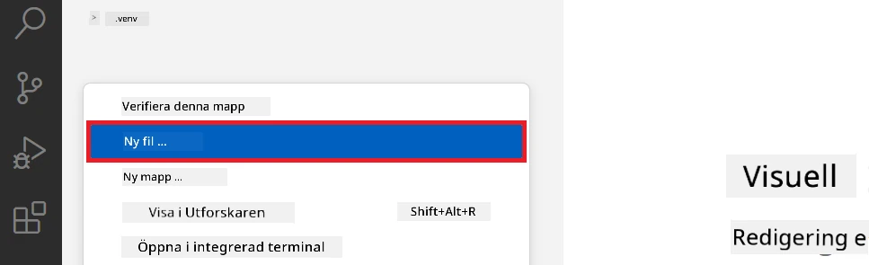

### Förbered dataset för finjustering

I denna övning kommer du köra filen *download_dataset.py* för att ladda ner *ultrachat_200k* datasets till din lokala miljö. Du kommer sedan att använda dessa dataset för att finjustera Phi-3 modellen i Azure Machine Learning.

I denna övning ska du:

- Lägga till kod i filen *download_dataset.py* för att ladda ner dataseten.
- Köra filen *download_dataset.py* för att ladda ner dataseten till din lokala miljö.

#### Ladda ner ditt dataset med *download_dataset.py*

1. Öppna filen *download_dataset.py* i Visual Studio Code.

1. Lägg till följande kod i filen *download_dataset.py*.

    ```python
    import json
    import os
    from datasets import load_dataset

    def load_and_split_dataset(dataset_name, config_name, split_ratio):
        """
        Load and split a dataset.
        """
        # Ladda datasetet med det angivna namnet, konfigurationen och delningsförhållandet
        dataset = load_dataset(dataset_name, config_name, split=split_ratio)
        print(f"Original dataset size: {len(dataset)}")
        
        # Dela upp datasetet i tränings- och testuppsättningar (80 % träning, 20 % test)
        split_dataset = dataset.train_test_split(test_size=0.2)
        print(f"Train dataset size: {len(split_dataset['train'])}")
        print(f"Test dataset size: {len(split_dataset['test'])}")
        
        return split_dataset

    def save_dataset_to_jsonl(dataset, filepath):
        """
        Save a dataset to a JSONL file.
        """
        # Skapa katalogen om den inte finns
        os.makedirs(os.path.dirname(filepath), exist_ok=True)
        
        # Öppna filen i skrivläge
        with open(filepath, 'w', encoding='utf-8') as f:
            # Iterera över varje post i datasetet
            for record in dataset:
                # Skriv posten som ett JSON-objekt och skriv det till filen
                json.dump(record, f)
                # Skriv en radbrytning för att separera poster
                f.write('\n')
        
        print(f"Dataset saved to {filepath}")

    def main():
        """
        Main function to load, split, and save the dataset.
        """
        # Ladda och dela ULTRACHAT_200k datasetet med en specifik konfiguration och delningsförhållande
        dataset = load_and_split_dataset("HuggingFaceH4/ultrachat_200k", 'default', 'train_sft[:1%]')
        
        # Extrahera tränings- och testdataset från delningen
        train_dataset = dataset['train']
        test_dataset = dataset['test']

        # Spara träningsdatasetet till en JSONL-fil
        save_dataset_to_jsonl(train_dataset, "data/train_data.jsonl")
        
        # Spara testdatasetet till en separat JSONL-fil
        save_dataset_to_jsonl(test_dataset, "data/test_data.jsonl")

    if __name__ == "__main__":
        main()

    ```

1. Skriv följande kommando i din terminal för att köra skriptet och ladda ner datasetet till din lokala miljö.

    ```console
    python download_dataset.py
    ```

1. Verifiera att dataseten har sparats framgångsrikt i din lokala mapp *finetune-phi/data*.

> [!NOTE]
>
> #### Notera datasetstorlek och finjusteringstid
>
> I denna handledning använder du endast 1% av datasettet (`split='train[:1%]'`). Detta minskar mängden data avsevärt, vilket gör både uppladdnings- och finjusteringsprocesserna snabbare. Du kan justera procentsatsen för att hitta rätt balans mellan träningstid och modellprestanda. Att använda en mindre delmängd av datasettet minskar den tid som krävs för finjustering och gör processen mer hanterbar för en handledning.

## Scenario 2: Finjustera Phi-3 modellen och distribuera i Azure Machine Learning Studio

### Finjustera Phi-3 modellen

I denna övning ska du finjustera Phi-3 modellen i Azure Machine Learning Studio.

I denna övning ska du:

- Skapa datorcluster för finjustering.
- Finjustera Phi-3 modellen i Azure Machine Learning Studio.

#### Skapa datorcluster för finjustering

1. Besök [Azure ML Studio](https://ml.azure.com/home?wt.mc_id=studentamb_279723).

1. Välj **Compute** från fliken till vänster.

1. Välj **Compute clusters** från navigeringsmenyn.

1. Välj **+ New**.

    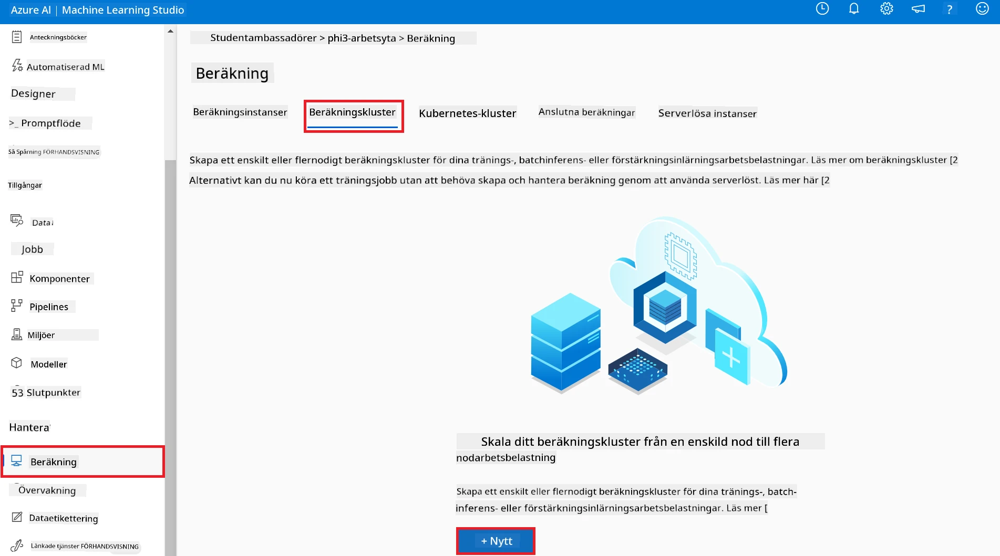

1. Utför följande uppgifter:

    - Välj den **Region** du vill använda.
    - Välj **Virtual machine tier** till **Dedicated**.
    - Välj **Virtual machine type** till **GPU**.
    - Välj filtret för **Virtual machine size** till **Select from all options**.
    - Välj **Virtual machine size** till **Standard_NC24ads_A100_v4**.

    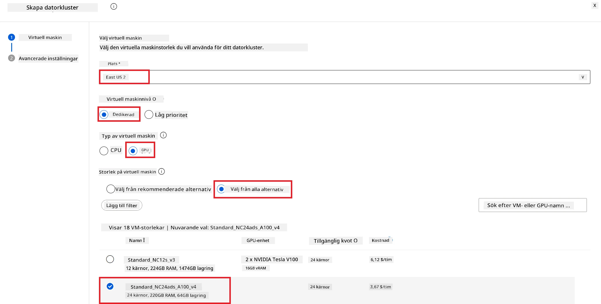

1. Välj **Next**.

1. Utför följande uppgifter:

    - Ange **Compute name**. Det måste vara ett unikt värde.
    - Välj **Minimum number of nodes** till **0**.
    - Välj **Maximum number of nodes** till **1**.
    - Välj **Idle seconds before scale down** till **120**.

    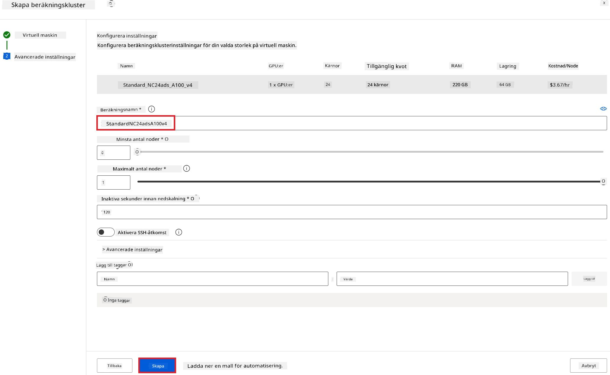

1. Välj **Create**.

#### Finjustera Phi-3 modellen

1. Besök [Azure ML Studio](https://ml.azure.com/home?wt.mc_id=studentamb_279723).

1. Välj den Azure Machine Learning workspace som du skapade.

    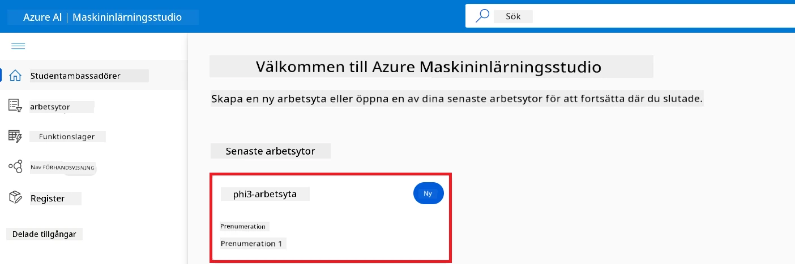

1. Utför följande uppgifter:

    - Välj **Model catalog** från fliken till vänster.
    - Skriv *phi-3-mini-4k* i **sökfältet** och välj **Phi-3-mini-4k-instruct** från alternativen som visas.

    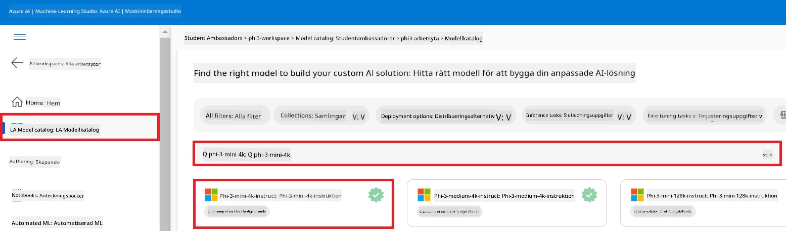

1. Välj **Fine-tune** från navigeringsmenyn.

    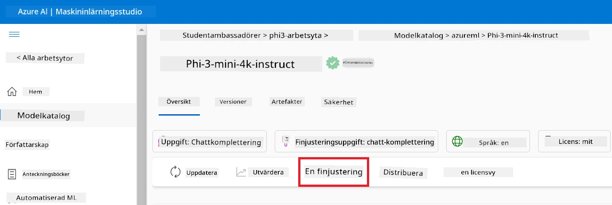

1. Utför följande uppgifter:

    - Välj **Select task type** till **Chat completion**.
    - Välj **+ Select data** för att ladda upp **Träningsdata**.
    - Välj typen för valideringsdatauppladdning till **Provide different validation data**.
    - Välj **+ Select data** för att ladda upp **Valideringsdata**.

    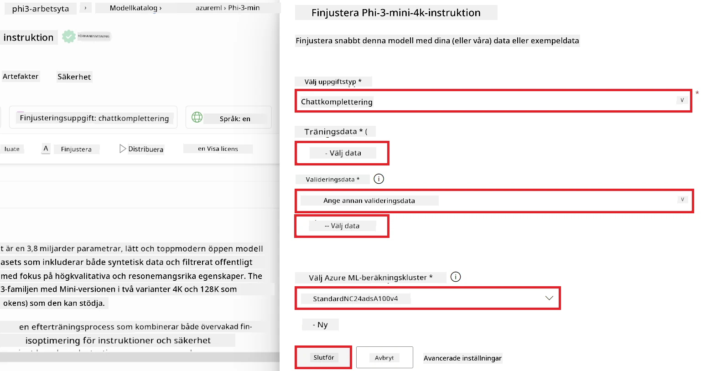

> [!TIP]
>
> Du kan välja **Advanced settings** för att anpassa konfigurationer som **learning_rate** och **lr_scheduler_type** för att optimera finjusteringsprocessen efter dina specifika behov.

1. Välj **Finish**.

1. I denna övning har du framgångsrikt finjusterat Phi-3 modellen med hjälp av Azure Machine Learning. Observera att finjusteringsprocessen kan ta en avsevärd tid. Efter att du startat finjusteringsjobbet behöver du vänta tills det är klart. Du kan följa statusen för finjusteringsjobbet genom att navigera till fliken Jobs till vänster i din Azure Machine Learning Workspace. I nästa serie kommer du distribuera den finjusterade modellen och integrera den med Prompt flow.

    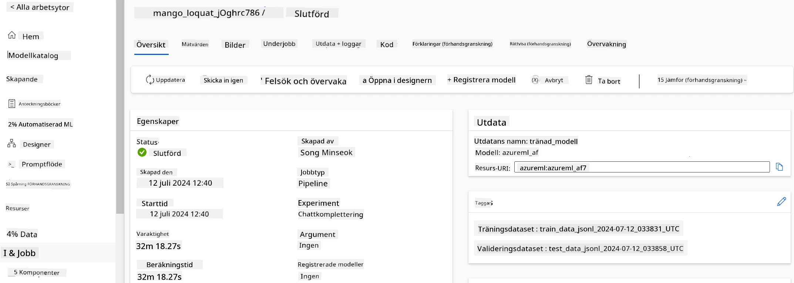

### Distribuera den finjusterade Phi-3 modellen

För att integrera den finjusterade Phi-3 modellen med Prompt flow behöver du distribuera modellen för att göra den tillgänglig för realtidsinferens. Denna process inkluderar att registrera modellen, skapa en online-endpoint och distribuera modellen.

I denna övning ska du:

- Registrera den finjusterade modellen i Azure Machine Learning workspace.
- Skapa en online-endpoint.
- Distribuera den registrerade finjusterade Phi-3 modellen.

#### Registrera den finjusterade modellen

1. Besök [Azure ML Studio](https://ml.azure.com/home?wt.mc_id=studentamb_279723).

1. Välj den Azure Machine Learning workspace som du skapade.

    

1. Välj **Models** från fliken till vänster.
1. Välj **+ Register**.
1. Välj **From a job output**.

    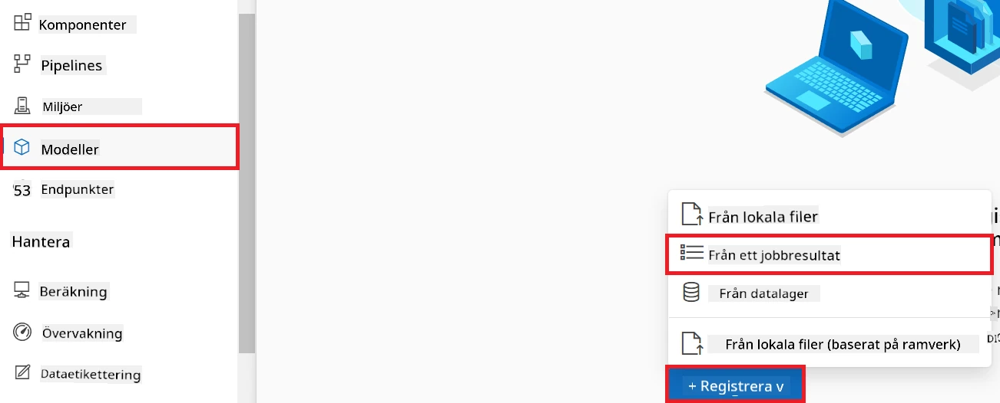

1. Välj jobbet som du skapade.

    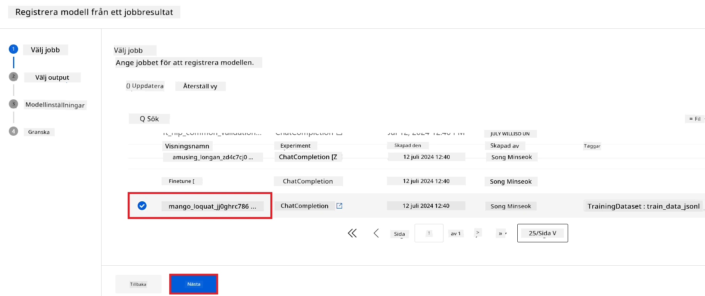

1. Välj **Next**.

1. Välj **Model type** till **MLflow**.

1. Säkerställ att **Job output** är valt; det bör väljas automatiskt.

    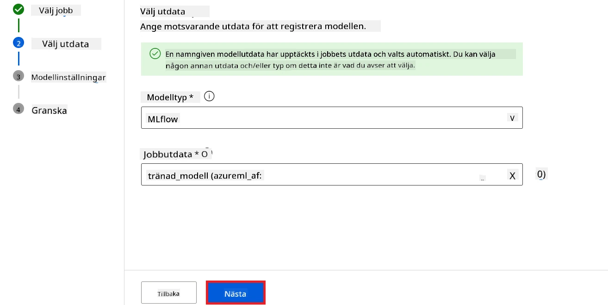

2. Välj **Next**.

3. Välj **Register**.

    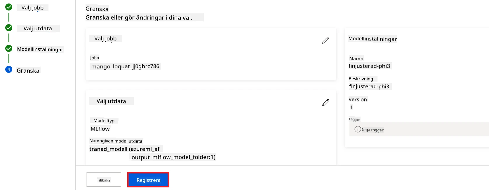

4. Du kan visa dina registrerade modeller genom att navigera till menyn **Models** från fliken till vänster.

    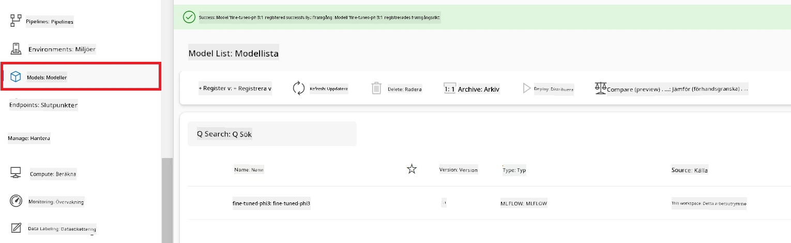

#### Distribuera den finjusterade modellen

1. Navigera till den Azure Machine Learning workspace som du skapade.

1. Välj **Endpoints** från fliken till vänster.

1. Välj **Real-time endpoints** från navigeringsmenyn.

    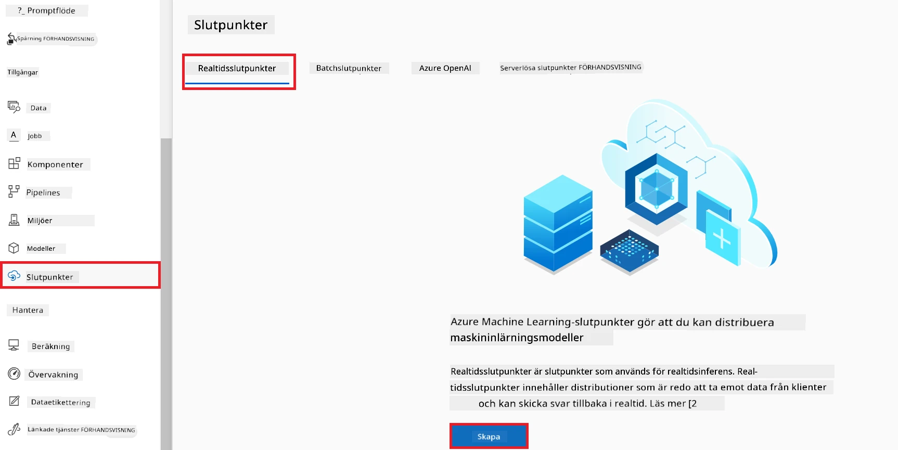

1. Välj **Create**.

1. Välj den registrerade modellen som du skapade.

    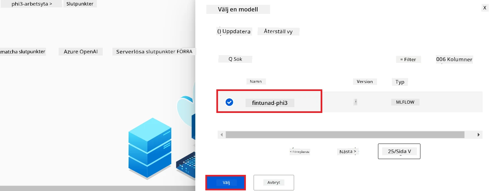

1. Välj **Select**.

1. Utför följande uppgifter:

    - Välj **Virtual machine** till *Standard_NC6s_v3*.
    - Välj det **Instance count** du vill använda. Till exempel, *1*.
    - Välj **Endpoint** till **New** för att skapa en endpoint.
    - Ange **Endpoint name**. Det måste vara ett unikt värde.
    - Ange **Deployment name**. Det måste vara ett unikt värde.

    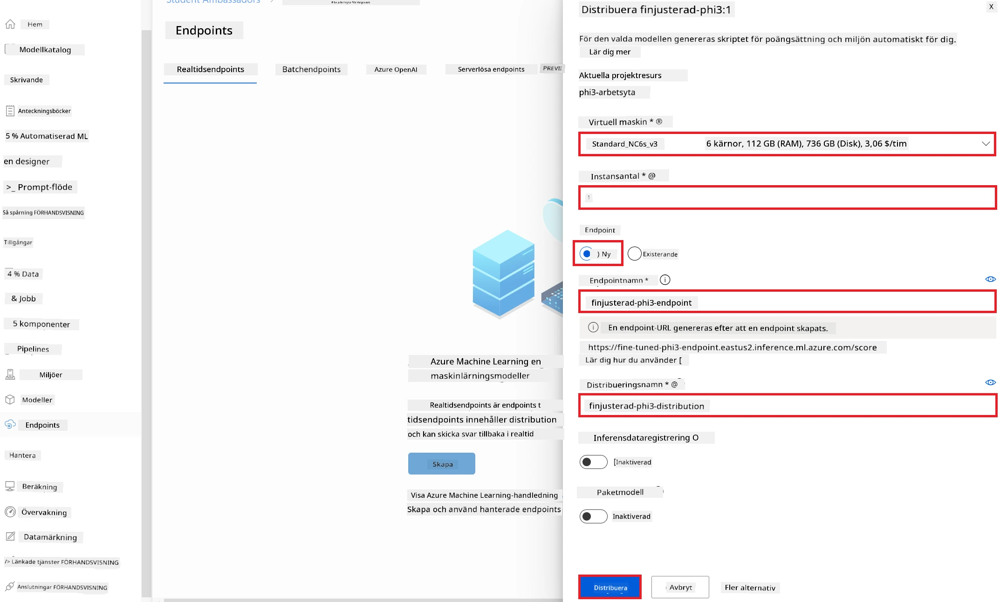

1. Välj **Deploy**.

> [!WARNING]
> För att undvika extra kostnader på ditt konto, se till att ta bort den skapade endpointen i Azure Machine Learning workspace.
>

#### Kontrollera distributionsstatus i Azure Machine Learning Workspace

1. Navigera till Azure Machine Learning workspace som du skapade.

1. Välj **Endpoints** från fliken till vänster.

1. Välj den endpoint som du skapade.

    

1. På denna sida kan du hantera endpoints under distributionsprocessen.

> [!NOTE]
> När distributionen är klar, se till att **Live traffic** är inställt på **100%**. Om det inte är det, välj **Update traffic** för att justera trafikinställningarna. Observera att du inte kan testa modellen om trafiken är satt till 0%.
>
> 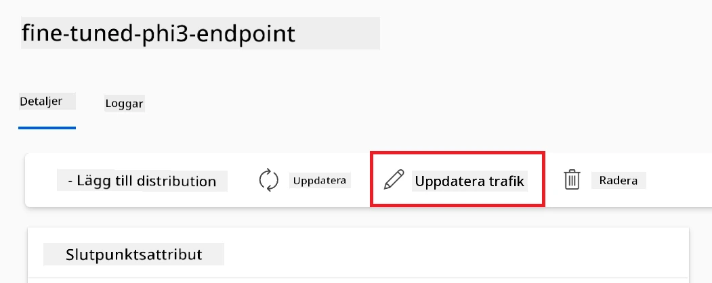
>

## Scenario 3: Integrera med Prompt flow och chatta med din anpassade modell i Azure AI Foundry

### Integrera den anpassade Phi-3 modellen med Prompt flow

Efter att du framgångsrikt har distribuerat din finjusterade modell kan du nu integrera den med Prompt Flow för att använda din modell i realtidsapplikationer, vilket möjliggör en rad interaktiva uppgifter med din anpassade Phi-3 modell.

I denna övning ska du:

- Skapa Azure AI Foundry Hub.
- Skapa Azure AI Foundry Project.
- Skapa Prompt flow.
- Lägg till en anpassad anslutning för den finjusterade Phi-3 modellen.
- Ställ in Prompt flow för att chatta med din anpassade Phi-3 modell.

> [!NOTE]
> Du kan också integrera med Promptflow med hjälp av Azure ML Studio. Samma integrationsprocess kan användas i Azure ML Studio.

#### Skapa Azure AI Foundry Hub

Du måste skapa en Hub innan du skapar Project. En Hub fungerar som en Resursgrupp och gör att du kan organisera och hantera flera Projects inom Azure AI Foundry.

1. Besök [Azure AI Foundry](https://ai.azure.com/?WT.mc_id=aiml-137032-kinfeylo).

1. Välj **All hubs** från fliken till vänster.

1. Välj **+ New hub** från navigeringsmenyn.
    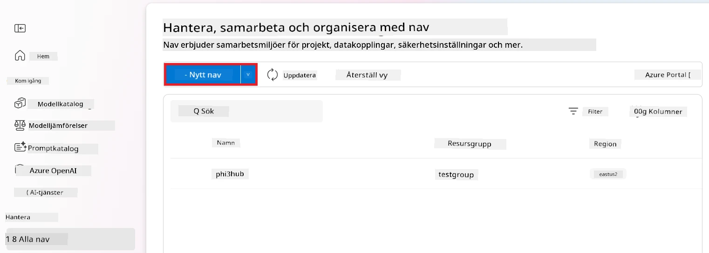

1. Utför följande uppgifter:

    - Ange **Hub-namn**. Det måste vara ett unikt värde.
    - Välj din Azure-**Prenumeration**.
    - Välj **Resursgrupp** att använda (skapa en ny om det behövs).
    - Välj **Plats** som du vill använda.
    - Välj **Anslut Azure AI-tjänster** att använda (skapa en ny om det behövs).
    - Välj **Anslut Azure AI Search** till **Hoppa över anslutning**.

    

1. Välj **Nästa**.

#### Skapa Azure AI Foundry-projekt

1. I hubben du skapade, välj **Alla projekt** från fliken på vänster sida.

1. Välj **+ Nytt projekt** i navigationsmenyn.

    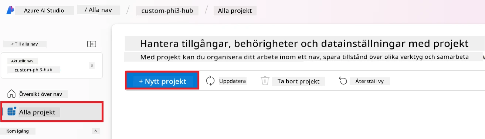

1. Ange **Projektnamn**. Det måste vara ett unikt värde.

    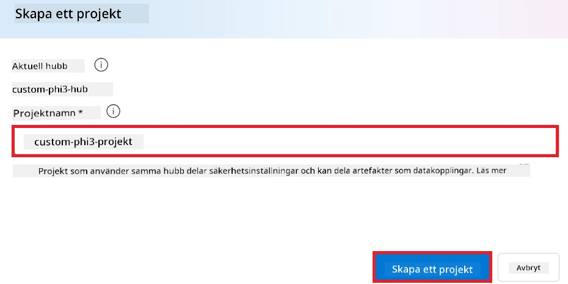

1. Välj **Skapa ett projekt**.

#### Lägg till en anpassad anslutning för den finjusterade Phi-3-modellen

För att integrera din anpassade Phi-3-modell med Prompt flow behöver du spara modellens slutpunkt och nyckel i en anpassad anslutning. Denna inställning säkerställer åtkomst till din anpassade Phi-3-modell i Prompt flow.

#### Ställ in api-nyckel och slutpunkts-URI för den finjusterade Phi-3-modellen

1. Besök [Azure ML Studio](https://ml.azure.com/home?WT.mc_id=aiml-137032-kinfeylo).

1. Navigera till Azure Machine learning-arbetsytan som du skapade.

1. Välj **Endpoints** från fliken på vänster sida.

    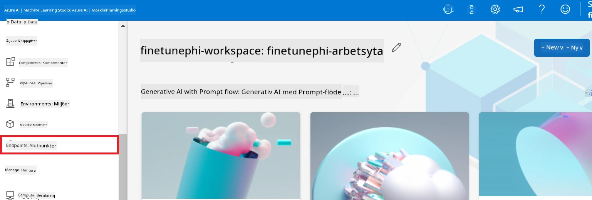

1. Välj endpointen som du skapade.

    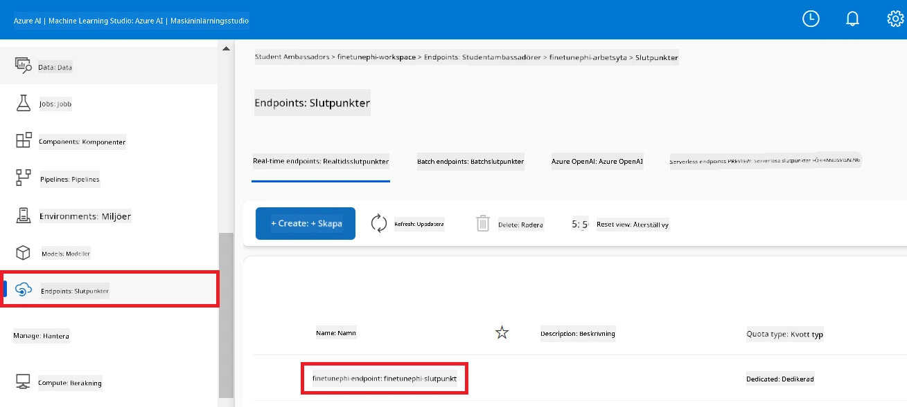

1. Välj **Använd** från navigationsmenyn.

1. Kopiera din **REST-slutpunkt** och **Primära nyckel**.

    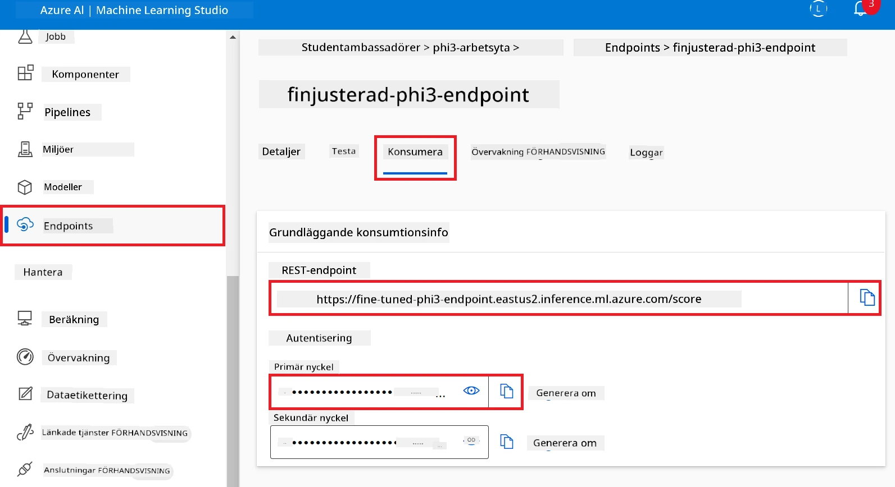

#### Lägg till den anpassade anslutningen

1. Besök [Azure AI Foundry](https://ai.azure.com/?WT.mc_id=aiml-137032-kinfeylo).

1. Navigera till Azure AI Foundry-projektet som du skapade.

1. I projektet som du skapade, välj **Inställningar** från fliken på vänster sida.

1. Välj **+ Ny anslutning**.

    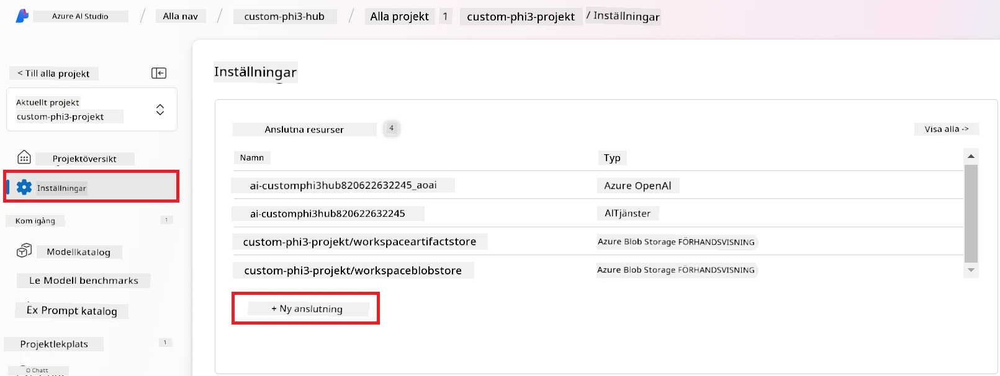

1. Välj **Anpassade nycklar** från navigationsmenyn.

    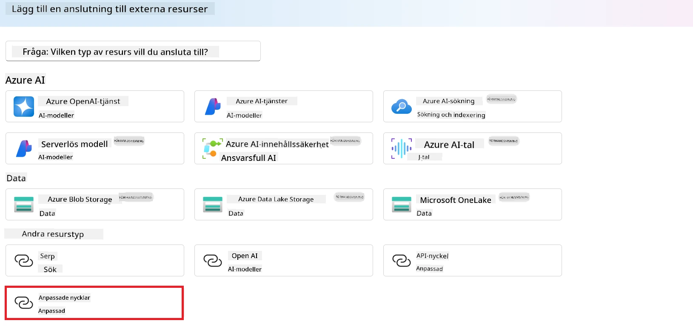

1. Utför följande uppgifter:

    - Välj **+ Lägg till nyckel-värdepar**.
    - För nyckelnamn, skriv **endpoint** och klistra in slutpunkten du kopierade från Azure ML Studio i värdefältet.
    - Välj **+ Lägg till nyckel-värdepar** igen.
    - För nyckelnamn, skriv **key** och klistra in nyckeln du kopierade från Azure ML Studio i värdefältet.
    - Efter att du lagt till nycklarna, markera **är hemlig** för att förhindra att nyckeln exponeras.

    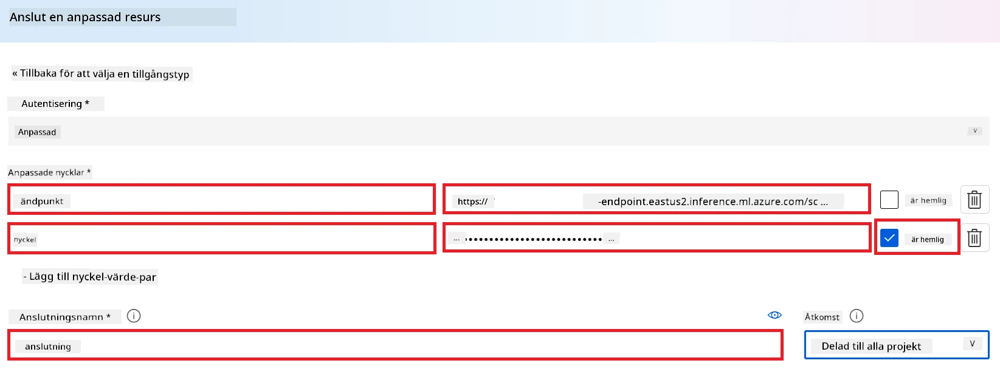

1. Välj **Lägg till anslutning**.

#### Skapa Prompt flow

Du har lagt till en anpassad anslutning i Azure AI Foundry. Låt oss nu skapa en Prompt flow med följande steg. Sedan kommer du att koppla denna Prompt flow till den anpassade anslutningen så att du kan använda den finjusterade modellen inom Prompt flow.

1. Navigera till Azure AI Foundry-projektet som du skapade.

1. Välj **Prompt flow** från fliken på vänster sida.

1. Välj **+ Skapa** från navigationsmenyn.

    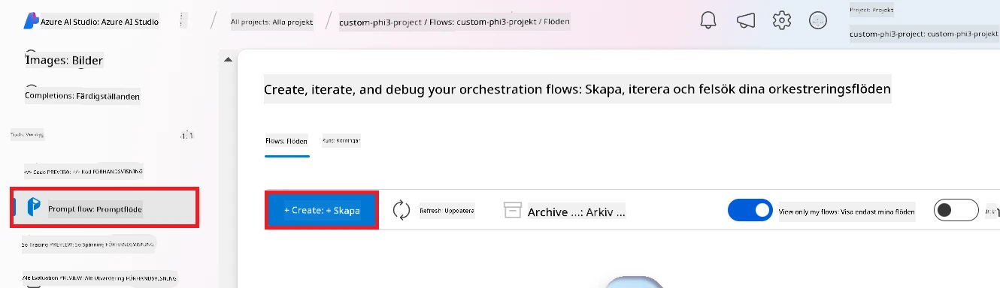

1. Välj **Chatflow** från navigationsmenyn.

    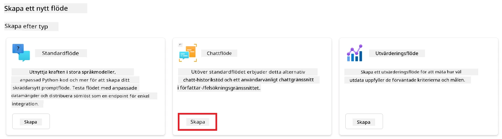

1. Ange **Mappnamn** som ska användas.

    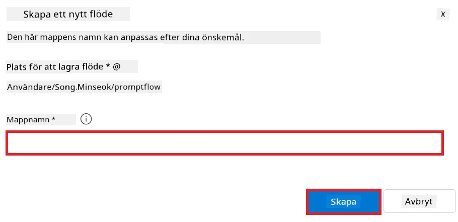

2. Välj **Skapa**.

#### Ställ in Prompt flow för att chatta med din anpassade Phi-3-modell

Du behöver integrera den finjusterade Phi-3-modellen i en Prompt flow. Den befintliga Prompt flowen som tillhandahålls är dock inte designad för detta ändamål. Därför måste du omdesigna Prompt flowen för att möjliggöra integrationen av den anpassade modellen.

1. I Prompt flow, utför följande uppgifter för att bygga om den befintliga flowen:

    - Välj **Rå filläge**.
    - Radera all befintlig kod i filen *flow.dag.yml*.
    - Lägg till följande kod i filen *flow.dag.yml*.

        ```yml
        inputs:
          input_data:
            type: string
            default: "Who founded Microsoft?"

        outputs:
          answer:
            type: string
            reference: ${integrate_with_promptflow.output}

        nodes:
        - name: integrate_with_promptflow
          type: python
          source:
            type: code
            path: integrate_with_promptflow.py
          inputs:
            input_data: ${inputs.input_data}
        ```

    - Välj **Spara**.

    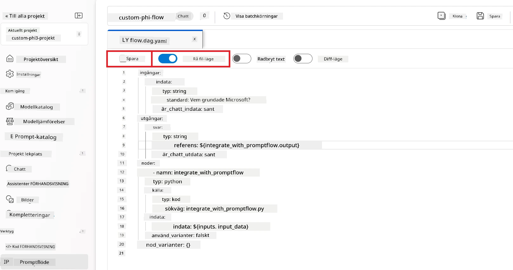

1. Lägg till följande kod i filen *integrate_with_promptflow.py* för att använda den anpassade Phi-3-modellen i Prompt flow.

    ```python
    import logging
    import requests
    from promptflow import tool
    from promptflow.connections import CustomConnection

    # Logginställning
    logging.basicConfig(
        format="%(asctime)s - %(levelname)s - %(name)s - %(message)s",
        datefmt="%Y-%m-%d %H:%M:%S",
        level=logging.DEBUG
    )
    logger = logging.getLogger(__name__)

    def query_phi3_model(input_data: str, connection: CustomConnection) -> str:
        """
        Send a request to the Phi-3 model endpoint with the given input data using Custom Connection.
        """

        # "connection" är namnet på den anpassade anslutningen, "endpoint", "key" är nycklarna i den anpassade anslutningen
        endpoint_url = connection.endpoint
        api_key = connection.key

        headers = {
            "Content-Type": "application/json",
            "Authorization": f"Bearer {api_key}"
        }
        data = {
            "input_data": {
                "input_string": [
                    {"role": "user", "content": input_data}
                ],
                "parameters": {
                    "temperature": 0.7,
                    "max_new_tokens": 128
                }
            }
        }
        try:
            response = requests.post(endpoint_url, json=data, headers=headers)
            response.raise_for_status()
            
            # Logga hela JSON-svaret
            logger.debug(f"Full JSON response: {response.json()}")

            result = response.json()["output"]
            logger.info("Successfully received response from Azure ML Endpoint.")
            return result
        except requests.exceptions.RequestException as e:
            logger.error(f"Error querying Azure ML Endpoint: {e}")
            raise

    @tool
    def my_python_tool(input_data: str, connection: CustomConnection) -> str:
        """
        Tool function to process input data and query the Phi-3 model.
        """
        return query_phi3_model(input_data, connection)

    ```

    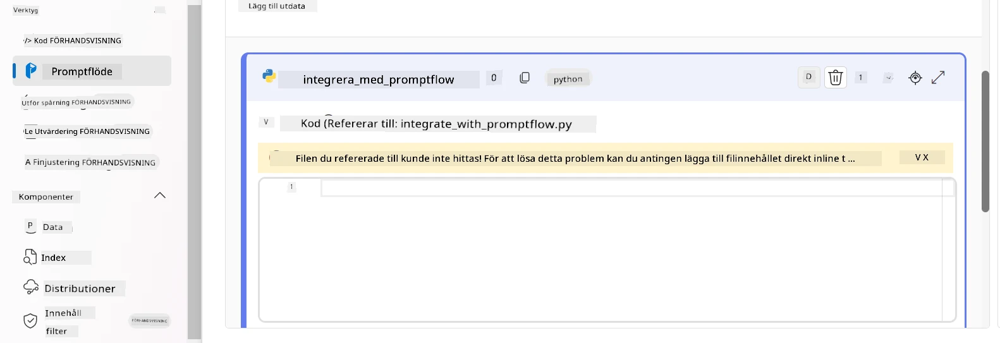

> [!NOTE]
> För mer detaljerad information om att använda Prompt flow i Azure AI Foundry kan du referera till [Prompt flow i Azure AI Foundry](https://learn.microsoft.com/azure/ai-studio/how-to/prompt-flow).

1. Välj **Chattinmatning**, **Chattutmatning** för att aktivera chatt med din modell.

    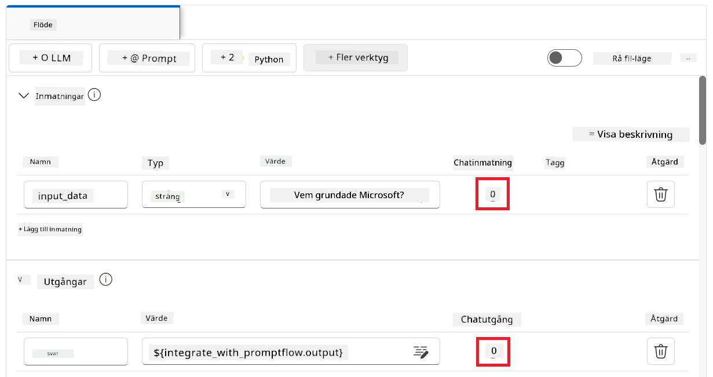

1. Nu är du redo att chatta med din anpassade Phi-3-modell. I nästa övning kommer du att lära dig hur du startar Prompt flow och använder den för att chatta med din finjusterade Phi-3-modell.

> [!NOTE]
>
> Den ombyggda flowen bör se ut som bilden nedan:
>
> 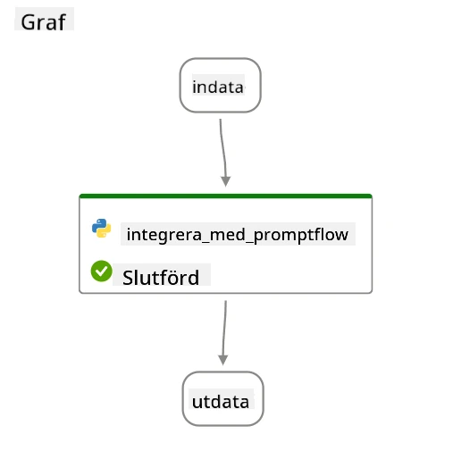
>

### Chatta med din anpassade Phi-3-modell

Nu när du har finjusterat och integrerat din anpassade Phi-3-modell med Prompt flow är du redo att börja interagera med den. Denna övning guidar dig genom processen att ställa in och initiera en chatt med din modell med hjälp av Prompt flow. Genom att följa dessa steg kommer du kunna utnyttja kapaciteterna hos din finjusterade Phi-3-modell fullt ut för olika uppgifter och konversationer.

- Chatta med din anpassade Phi-3-modell med Prompt flow.

#### Starta Prompt flow

1. Välj **Starta beräkningssessioner** för att starta Prompt flow.

    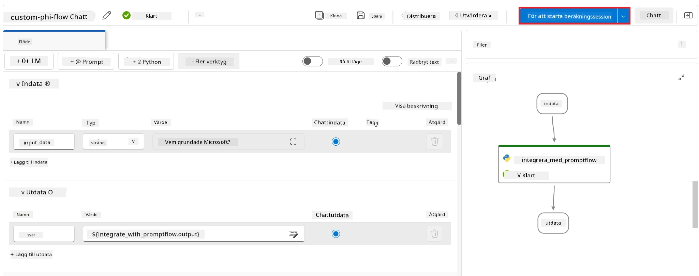

1. Välj **Verifiera och analysera inmatning** för att förnya parametrar.

    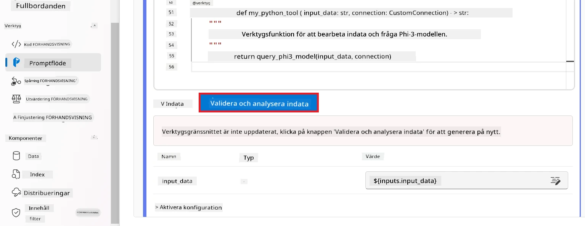

1. Välj **Värdet** för **anslutningen** till den anpassade anslutningen du skapade. Till exempel, *connection*.

    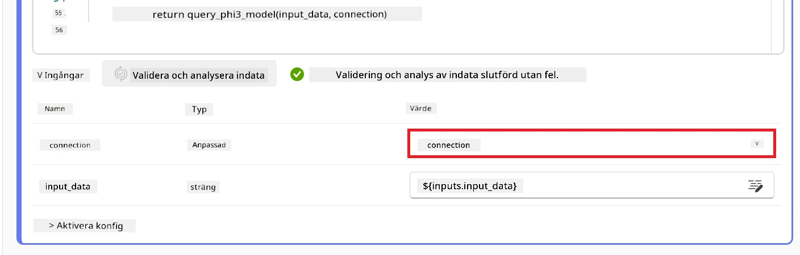

#### Chatta med din anpassade modell

1. Välj **Chatt**.

    

1. Här är ett exempel på resultaten: Nu kan du chatta med din anpassade Phi-3-modell. Det rekommenderas att ställa frågor baserade på den data som användes för finjusteringen.

    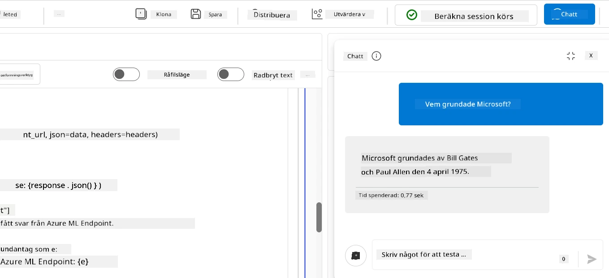

---

<!-- CO-OP TRANSLATOR DISCLAIMER START -->
**Ansvarsfriskrivning**:
Detta dokument har översatts med hjälp av AI-översättningstjänsten [Co-op Translator](https://github.com/Azure/co-op-translator). Även om vi strävar efter noggrannhet, vänligen observera att automatiska översättningar kan innehålla fel eller brister. Det ursprungliga dokumentet på dess modersmål bör betraktas som den auktoritativa källan. För kritisk information rekommenderas professionell mänsklig översättning. Vi ansvarar inte för några missförstånd eller feltolkningar som uppstår till följd av användningen av denna översättning.
<!-- CO-OP TRANSLATOR DISCLAIMER END -->