<!--
CO_OP_TRANSLATOR_METADATA:
{
  "original_hash": "ecbd9179a21edbaafaf114d47f09f3e3",
  "translation_date": "2025-07-17T01:32:48+00:00",
  "source_file": "md/02.Application/01.TextAndChat/Phi3/E2E_Phi-3-FineTuning_PromptFlow_Integration_AIFoundry.md",
  "language_code": "sv"
}
-->
# Finjustera och integrera anpassade Phi-3-modeller med Prompt flow i Azure AI Foundry

Detta end-to-end (E2E) exempel är baserat på guiden "[Fine-Tune and Integrate Custom Phi-3 Models with Prompt Flow in Azure AI Foundry](https://techcommunity.microsoft.com/t5/educator-developer-blog/fine-tune-and-integrate-custom-phi-3-models-with-prompt-flow-in/ba-p/4191726?WT.mc_id=aiml-137032-kinfeylo)" från Microsoft Tech Community. Det introducerar processerna för finjustering, distribution och integration av anpassade Phi-3-modeller med Prompt flow i Azure AI Foundry.  
Till skillnad från E2E-exemplet, "[Fine-Tune and Integrate Custom Phi-3 Models with Prompt Flow](./E2E_Phi-3-FineTuning_PromptFlow_Integration.md)", som involverade att köra kod lokalt, fokuserar denna handledning helt på att finjustera och integrera din modell inom Azure AI / ML Studio.

## Översikt

I detta E2E-exempel kommer du att lära dig hur du finjusterar Phi-3-modellen och integrerar den med Prompt flow i Azure AI Foundry. Genom att använda Azure AI / ML Studio kommer du att skapa ett arbetsflöde för att distribuera och använda anpassade AI-modeller. Detta E2E-exempel är uppdelat i tre scenarier:

**Scenario 1: Ställ in Azure-resurser och förbered för finjustering**

**Scenario 2: Finjustera Phi-3-modellen och distribuera i Azure Machine Learning Studio**

**Scenario 3: Integrera med Prompt flow och chatta med din anpassade modell i Azure AI Foundry**

Här är en översikt av detta E2E-exempel.

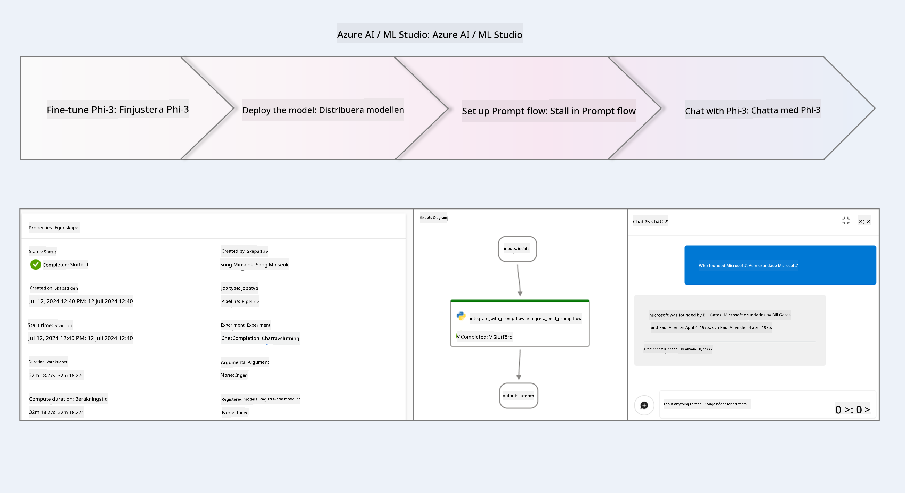

### Innehållsförteckning

1. **[Scenario 1: Ställ in Azure-resurser och förbered för finjustering](../../../../../../md/02.Application/01.TextAndChat/Phi3)**
    - [Skapa ett Azure Machine Learning Workspace](../../../../../../md/02.Application/01.TextAndChat/Phi3)
    - [Begär GPU-kvoter i Azure-prenumerationen](../../../../../../md/02.Application/01.TextAndChat/Phi3)
    - [Lägg till rolltilldelning](../../../../../../md/02.Application/01.TextAndChat/Phi3)
    - [Ställ in projekt](../../../../../../md/02.Application/01.TextAndChat/Phi3)
    - [Förbered dataset för finjustering](../../../../../../md/02.Application/01.TextAndChat/Phi3)

1. **[Scenario 2: Finjustera Phi-3-modellen och distribuera i Azure Machine Learning Studio](../../../../../../md/02.Application/01.TextAndChat/Phi3)**
    - [Finjustera Phi-3-modellen](../../../../../../md/02.Application/01.TextAndChat/Phi3)
    - [Distribuera den finjusterade Phi-3-modellen](../../../../../../md/02.Application/01.TextAndChat/Phi3)

1. **[Scenario 3: Integrera med Prompt flow och chatta med din anpassade modell i Azure AI Foundry](../../../../../../md/02.Application/01.TextAndChat/Phi3)**
    - [Integrera den anpassade Phi-3-modellen med Prompt flow](../../../../../../md/02.Application/01.TextAndChat/Phi3)
    - [Chatta med din anpassade Phi-3-modell](../../../../../../md/02.Application/01.TextAndChat/Phi3)

## Scenario 1: Ställ in Azure-resurser och förbered för finjustering

### Skapa ett Azure Machine Learning Workspace

1. Skriv *azure machine learning* i **sökfältet** högst upp på portalsidan och välj **Azure Machine Learning** från alternativen som visas.

    

2. Välj **+ Create** i navigationsmenyn.

3. Välj **New workspace** i navigationsmenyn.

    

4. Utför följande uppgifter:

    - Välj din Azure **Subscription**.
    - Välj den **Resource group** som ska användas (skapa en ny om det behövs).
    - Ange **Workspace Name**. Det måste vara ett unikt namn.
    - Välj den **Region** du vill använda.
    - Välj det **Storage account** som ska användas (skapa ett nytt om det behövs).
    - Välj den **Key vault** som ska användas (skapa en ny om det behövs).
    - Välj den **Application insights** som ska användas (skapa en ny om det behövs).
    - Välj den **Container registry** som ska användas (skapa en ny om det behövs).

    

5. Välj **Review + Create**.

6. Välj **Create**.

### Begär GPU-kvoter i Azure-prenumerationen

I denna handledning kommer du att lära dig hur du finjusterar och distribuerar en Phi-3-modell med hjälp av GPU:er. För finjustering använder du GPU:n *Standard_NC24ads_A100_v4*, som kräver en kvotbegäran. För distribution använder du GPU:n *Standard_NC6s_v3*, som också kräver en kvotbegäran.

> [!NOTE]
>
> Endast Pay-As-You-Go-prenumerationer (standardprenumerationstypen) är berättigade till GPU-allokering; förmånsprenumerationer stöds för närvarande inte.
>

1. Besök [Azure ML Studio](https://ml.azure.com/home?wt.mc_id=studentamb_279723).

1. Utför följande för att begära kvot för *Standard NCADSA100v4 Family*:

    - Välj **Quota** i vänstermenyn.
    - Välj den **Virtual machine family** som ska användas. Till exempel, välj **Standard NCADSA100v4 Family Cluster Dedicated vCPUs**, som inkluderar GPU:n *Standard_NC24ads_A100_v4*.
    - Välj **Request quota** i navigationsmenyn.

        

    - På sidan Request quota, ange den **New cores limit** du vill använda. Till exempel 24.
    - På sidan Request quota, välj **Submit** för att begära GPU-kvoten.

1. Utför följande för att begära kvot för *Standard NCSv3 Family*:

    - Välj **Quota** i vänstermenyn.
    - Välj den **Virtual machine family** som ska användas. Till exempel, välj **Standard NCSv3 Family Cluster Dedicated vCPUs**, som inkluderar GPU:n *Standard_NC6s_v3*.
    - Välj **Request quota** i navigationsmenyn.
    - På sidan Request quota, ange den **New cores limit** du vill använda. Till exempel 24.
    - På sidan Request quota, välj **Submit** för att begära GPU-kvoten.

### Lägg till rolltilldelning

För att finjustera och distribuera dina modeller måste du först skapa en User Assigned Managed Identity (UAI) och tilldela den rätt behörigheter. Denna UAI kommer att användas för autentisering vid distribution.

#### Skapa User Assigned Managed Identity (UAI)

1. Skriv *managed identities* i **sökfältet** högst upp på portalsidan och välj **Managed Identities** från alternativen som visas.

    

1. Välj **+ Create**.

    

1. Utför följande uppgifter:

    - Välj din Azure **Subscription**.
    - Välj den **Resource group** som ska användas (skapa en ny om det behövs).
    - Välj den **Region** du vill använda.
    - Ange ett **Namn**. Det måste vara unikt.

    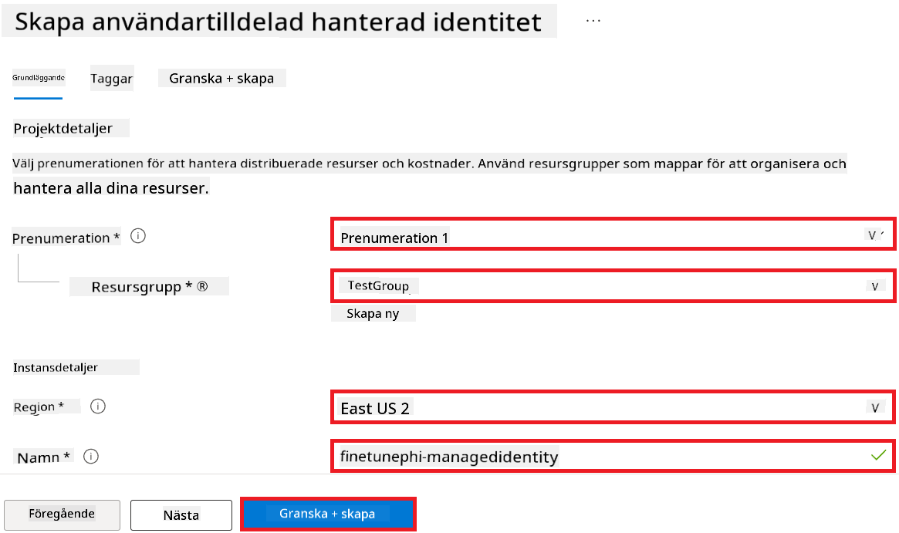

1. Välj **Review + create**.

1. Välj **+ Create**.

#### Lägg till Contributor-rolltilldelning till Managed Identity

1. Navigera till den Managed Identity-resurs du skapade.

1. Välj **Azure role assignments** i vänstermenyn.

1. Välj **+Add role assignment** i navigationsmenyn.

1. På sidan Add role assignment, utför följande:

    - Välj **Scope** till **Resource group**.
    - Välj din Azure **Subscription**.
    - Välj den **Resource group** som ska användas.
    - Välj rollen **Contributor**.

    

2. Välj **Save**.

#### Lägg till Storage Blob Data Reader-rolltilldelning till Managed Identity

1. Skriv *storage accounts* i **sökfältet** högst upp på portalsidan och välj **Storage accounts** från alternativen som visas.

    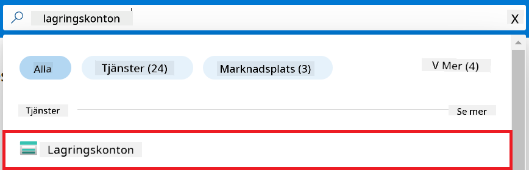

1. Välj det lagringskonto som är kopplat till det Azure Machine Learning workspace du skapade. Till exempel *finetunephistorage*.

1. Utför följande för att navigera till sidan Add role assignment:

    - Navigera till det Azure Storage-konto du skapade.
    - Välj **Access Control (IAM)** i vänstermenyn.
    - Välj **+ Add** i navigationsmenyn.
    - Välj **Add role assignment** i navigationsmenyn.

    

1. På sidan Add role assignment, utför följande:

    - På Role-sidan, skriv *Storage Blob Data Reader* i **sökfältet** och välj **Storage Blob Data Reader** från alternativen som visas.
    - På Role-sidan, välj **Next**.
    - På Members-sidan, välj **Assign access to** **Managed identity**.
    - På Members-sidan, välj **+ Select members**.
    - På sidan Select managed identities, välj din Azure **Subscription**.
    - På sidan Select managed identities, välj **Managed identity** till **Manage Identity**.
    - På sidan Select managed identities, välj den Managed Identity du skapade. Till exempel *finetunephi-managedidentity*.
    - På sidan Select managed identities, välj **Select**.

    

1. Välj **Review + assign**.

#### Lägg till AcrPull-rolltilldelning till Managed Identity

1. Skriv *container registries* i **sökfältet** högst upp på portalsidan och välj **Container registries** från alternativen som visas.

    

1. Välj den container registry som är kopplad till Azure Machine Learning workspace. Till exempel *finetunephicontainerregistry*.

1. Utför följande för att navigera till sidan Add role assignment:

    - Välj **Access Control (IAM)** i vänstermenyn.
    - Välj **+ Add** i navigationsmenyn.
    - Välj **Add role assignment** i navigationsmenyn.

1. På sidan Add role assignment, utför följande:

    - På Role-sidan, skriv *AcrPull* i **sökfältet** och välj **AcrPull** från alternativen som visas.
    - På Role-sidan, välj **Next**.
    - På Members-sidan, välj **Assign access to** **Managed identity**.
    - På Members-sidan, välj **+ Select members**.
    - På sidan Select managed identities, välj din Azure **Subscription**.
    - På sidan Select managed identities, välj **Managed identity** till **Manage Identity**.
    - På sidan Select managed identities, välj den Managed Identity du skapade. Till exempel *finetunephi-managedidentity*.
    - På sidan Select managed identities, välj **Select**.
    - Välj **Review + assign**.

### Ställ in projekt

För att ladda ner de dataset som behövs för finjustering kommer du att ställa in en lokal miljö.

I denna övning kommer du att

- Skapa en mapp att arbeta i.
- Skapa en virtuell miljö.
- Installera de nödvändiga paketen.
- Skapa en fil *download_dataset.py* för att ladda ner datasetet.

#### Skapa en mapp att arbeta i

1. Öppna ett terminalfönster och skriv följande kommando för att skapa en mapp med namnet *finetune-phi* i standardvägen.

    ```console
    mkdir finetune-phi
    ```

2. Skriv följande kommando i terminalen för att navigera till mappen *finetune-phi* som du skapade.
#### Skapa en virtuell miljö

1. Skriv följande kommando i din terminal för att skapa en virtuell miljö med namnet *.venv*.

    ```console
    python -m venv .venv
    ```

2. Skriv följande kommando i din terminal för att aktivera den virtuella miljön.

    ```console
    .venv\Scripts\activate.bat
    ```


> [!NOTE]
> Om det fungerade bör du se *(.venv)* före kommandoprompten.

#### Installera de nödvändiga paketen

1. Skriv följande kommandon i din terminal för att installera de nödvändiga paketen.

    ```console
    pip install datasets==2.19.1
    ```

#### Skapa `download_dataset.py`

> [!NOTE]
> Komplett mappstruktur:
>
> ```text
> └── YourUserName
> .    └── finetune-phi
> .        └── download_dataset.py
> ```

1. Öppna **Visual Studio Code**.

1. Välj **File** i menyraden.

1. Välj **Open Folder**.

1. Välj mappen *finetune-phi* som du skapade, som finns på *C:\Users\yourUserName\finetune-phi*.

    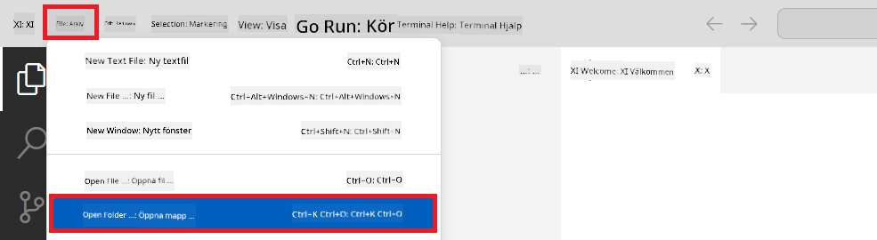

1. I vänstra panelen i Visual Studio Code, högerklicka och välj **New File** för att skapa en ny fil med namnet *download_dataset.py*.

    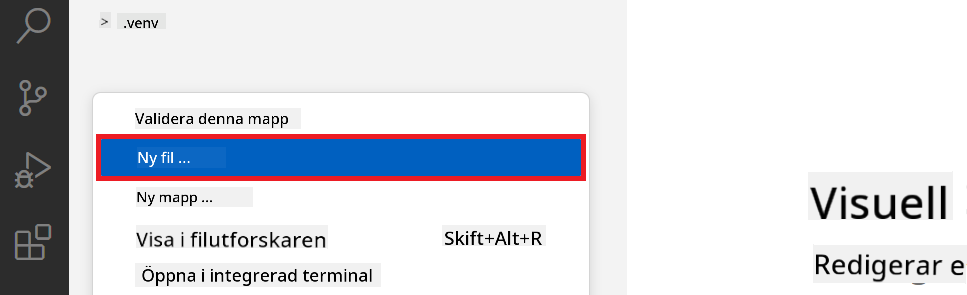

### Förbered dataset för finjustering

I denna övning kommer du att köra filen *download_dataset.py* för att ladda ner *ultrachat_200k* dataset till din lokala miljö. Du kommer sedan att använda detta dataset för att finjustera Phi-3 modellen i Azure Machine Learning.

I denna övning kommer du att:

- Lägga till kod i filen *download_dataset.py* för att ladda ner dataset.
- Köra filen *download_dataset.py* för att ladda ner dataset till din lokala miljö.

#### Ladda ner ditt dataset med *download_dataset.py*

1. Öppna filen *download_dataset.py* i Visual Studio Code.

1. Lägg till följande kod i filen *download_dataset.py*.

    ```python
    import json
    import os
    from datasets import load_dataset

    def load_and_split_dataset(dataset_name, config_name, split_ratio):
        """
        Load and split a dataset.
        """
        # Load the dataset with the specified name, configuration, and split ratio
        dataset = load_dataset(dataset_name, config_name, split=split_ratio)
        print(f"Original dataset size: {len(dataset)}")
        
        # Split the dataset into train and test sets (80% train, 20% test)
        split_dataset = dataset.train_test_split(test_size=0.2)
        print(f"Train dataset size: {len(split_dataset['train'])}")
        print(f"Test dataset size: {len(split_dataset['test'])}")
        
        return split_dataset

    def save_dataset_to_jsonl(dataset, filepath):
        """
        Save a dataset to a JSONL file.
        """
        # Create the directory if it does not exist
        os.makedirs(os.path.dirname(filepath), exist_ok=True)
        
        # Open the file in write mode
        with open(filepath, 'w', encoding='utf-8') as f:
            # Iterate over each record in the dataset
            for record in dataset:
                # Dump the record as a JSON object and write it to the file
                json.dump(record, f)
                # Write a newline character to separate records
                f.write('\n')
        
        print(f"Dataset saved to {filepath}")

    def main():
        """
        Main function to load, split, and save the dataset.
        """
        # Load and split the ULTRACHAT_200k dataset with a specific configuration and split ratio
        dataset = load_and_split_dataset("HuggingFaceH4/ultrachat_200k", 'default', 'train_sft[:1%]')
        
        # Extract the train and test datasets from the split
        train_dataset = dataset['train']
        test_dataset = dataset['test']

        # Save the train dataset to a JSONL file
        save_dataset_to_jsonl(train_dataset, "data/train_data.jsonl")
        
        # Save the test dataset to a separate JSONL file
        save_dataset_to_jsonl(test_dataset, "data/test_data.jsonl")

    if __name__ == "__main__":
        main()

    ```

1. Skriv följande kommando i din terminal för att köra skriptet och ladda ner dataset till din lokala miljö.

    ```console
    python download_dataset.py
    ```

1. Kontrollera att dataset sparades framgångsrikt i din lokala *finetune-phi/data* katalog.

> [!NOTE]
>
> #### Notering om datasetstorlek och finjusteringstid
>
> I denna handledning använder du endast 1% av datasetet (`split='train[:1%]'`). Detta minskar mängden data avsevärt, vilket påskyndar både uppladdning och finjusteringsprocessen. Du kan justera procentandelen för att hitta rätt balans mellan träningstid och modellprestanda. Att använda en mindre delmängd av datasetet minskar tiden som krävs för finjustering, vilket gör processen mer hanterbar för en handledning.

## Scenario 2: Finjustera Phi-3 modellen och distribuera i Azure Machine Learning Studio

### Finjustera Phi-3 modellen

I denna övning kommer du att finjustera Phi-3 modellen i Azure Machine Learning Studio.

I denna övning kommer du att:

- Skapa en datorcluster för finjustering.
- Finjustera Phi-3 modellen i Azure Machine Learning Studio.

#### Skapa datorcluster för finjustering

1. Besök [Azure ML Studio](https://ml.azure.com/home?wt.mc_id=studentamb_279723).

1. Välj **Compute** från vänstra sidomenyn.

1. Välj **Compute clusters** från navigationsmenyn.

1. Välj **+ New**.

    

1. Utför följande uppgifter:

    - Välj den **Region** du vill använda.
    - Välj **Virtual machine tier** till **Dedicated**.
    - Välj **Virtual machine type** till **GPU**.
    - Välj filtret för **Virtual machine size** till **Select from all options**.
    - Välj **Virtual machine size** till **Standard_NC24ads_A100_v4**.

    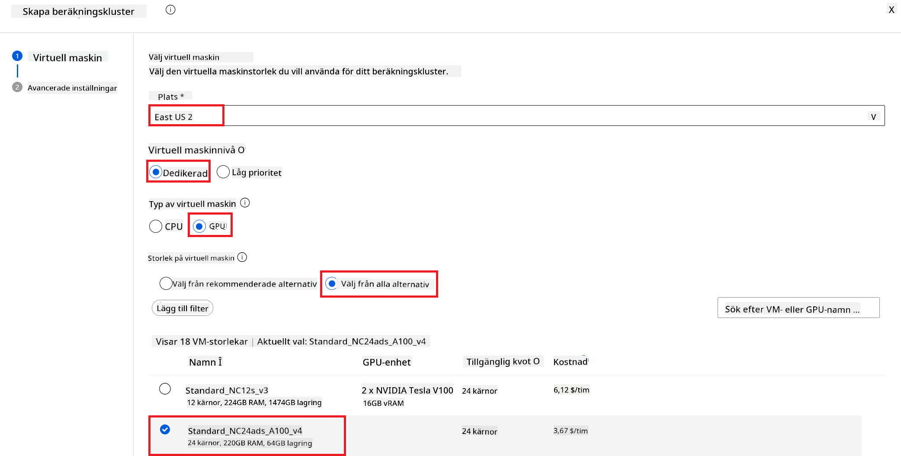

1. Välj **Next**.

1. Utför följande uppgifter:

    - Ange **Compute name**. Det måste vara ett unikt namn.
    - Välj **Minimum number of nodes** till **0**.
    - Välj **Maximum number of nodes** till **1**.
    - Välj **Idle seconds before scale down** till **120**.

    

1. Välj **Create**.

#### Finjustera Phi-3 modellen

1. Besök [Azure ML Studio](https://ml.azure.com/home?wt.mc_id=studentamb_279723).

1. Välj den Azure Machine Learning workspace som du skapade.

    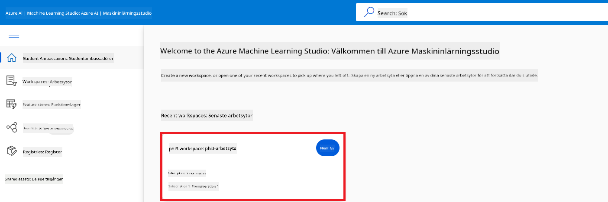

1. Utför följande uppgifter:

    - Välj **Model catalog** från vänstra sidomenyn.
    - Skriv *phi-3-mini-4k* i **sökfältet** och välj **Phi-3-mini-4k-instruct** från alternativen som visas.

    

1. Välj **Fine-tune** från navigationsmenyn.

    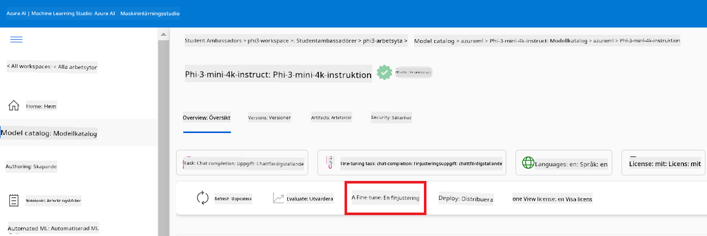

1. Utför följande uppgifter:

    - Välj **Select task type** till **Chat completion**.
    - Välj **+ Select data** för att ladda upp **Träningsdata**.
    - Välj uppladdningstyp för valideringsdata till **Provide different validation data**.
    - Välj **+ Select data** för att ladda upp **Valideringsdata**.

    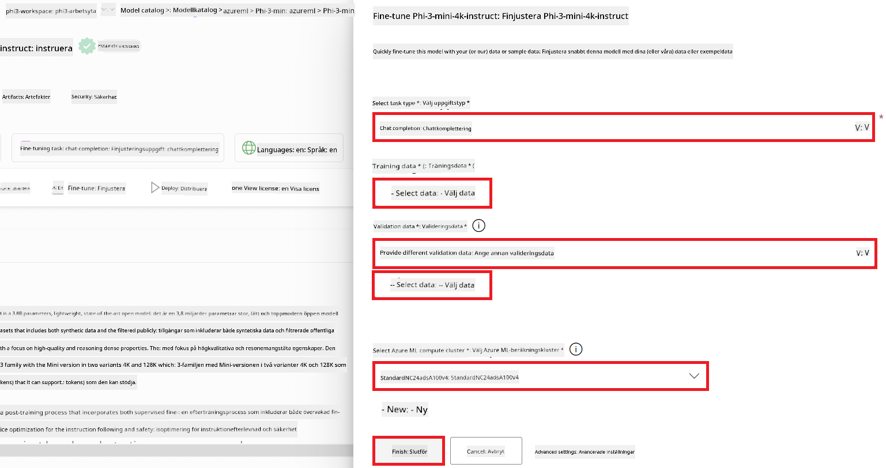

    > [!TIP]
    >
    > Du kan välja **Advanced settings** för att anpassa inställningar som **learning_rate** och **lr_scheduler_type** för att optimera finjusteringsprocessen efter dina specifika behov.

1. Välj **Finish**.

1. I denna övning har du framgångsrikt finjusterat Phi-3 modellen med hjälp av Azure Machine Learning. Observera att finjusteringsprocessen kan ta en betydande tid. Efter att ha startat finjusteringsjobbet behöver du vänta på att det ska slutföras. Du kan följa statusen för finjusteringsjobbet genom att gå till fliken Jobs i vänstra menyn i din Azure Machine Learning Workspace. I nästa del kommer du att distribuera den finjusterade modellen och integrera den med Prompt flow.

    

### Distribuera den finjusterade Phi-3 modellen

För att integrera den finjusterade Phi-3 modellen med Prompt flow behöver du distribuera modellen för att göra den tillgänglig för realtidsinferens. Denna process innefattar att registrera modellen, skapa en online-endpoint och distribuera modellen.

I denna övning kommer du att:

- Registrera den finjusterade modellen i Azure Machine Learning workspace.
- Skapa en online-endpoint.
- Distribuera den registrerade finjusterade Phi-3 modellen.

#### Registrera den finjusterade modellen

1. Besök [Azure ML Studio](https://ml.azure.com/home?wt.mc_id=studentamb_279723).

1. Välj den Azure Machine Learning workspace som du skapade.

    

1. Välj **Models** från vänstra sidomenyn.
1. Välj **+ Register**.
1. Välj **From a job output**.

    

1. Välj det jobb som du skapade.

    

1. Välj **Next**.

1. Välj **Model type** till **MLflow**.

1. Kontrollera att **Job output** är valt; det bör vara förvalt.

    

2. Välj **Next**.

3. Välj **Register**.

    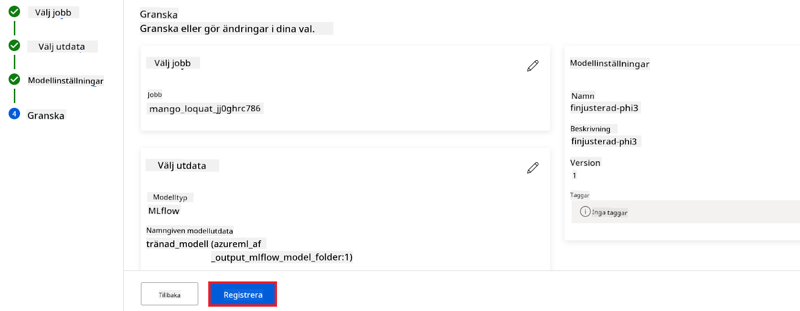

4. Du kan se din registrerade modell genom att gå till menyn **Models** i vänstra sidomenyn.

    

#### Distribuera den finjusterade modellen

1. Navigera till den Azure Machine Learning workspace som du skapade.

1. Välj **Endpoints** från vänstra sidomenyn.

1. Välj **Real-time endpoints** från navigationsmenyn.

    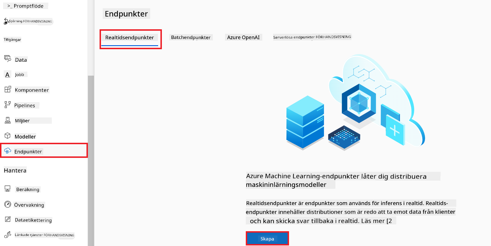

1. Välj **Create**.

1. Välj den registrerade modell som du skapade.

    

1. Välj **Select**.

1. Utför följande uppgifter:

    - Välj **Virtual machine** till *Standard_NC6s_v3*.
    - Välj det antal instanser du vill använda, till exempel *1*.
    - Välj **Endpoint** till **New** för att skapa en endpoint.
    - Ange **Endpoint name**. Det måste vara unikt.
    - Ange **Deployment name**. Det måste vara unikt.

    

1. Välj **Deploy**.

> [!WARNING]
> För att undvika extra kostnader på ditt konto, se till att ta bort den skapade endpointen i Azure Machine Learning workspace.
>

#### Kontrollera distributionsstatus i Azure Machine Learning Workspace

1. Navigera till Azure Machine Learning workspace som du skapade.

1. Välj **Endpoints** från vänstra sidomenyn.

1. Välj den endpoint som du skapade.

    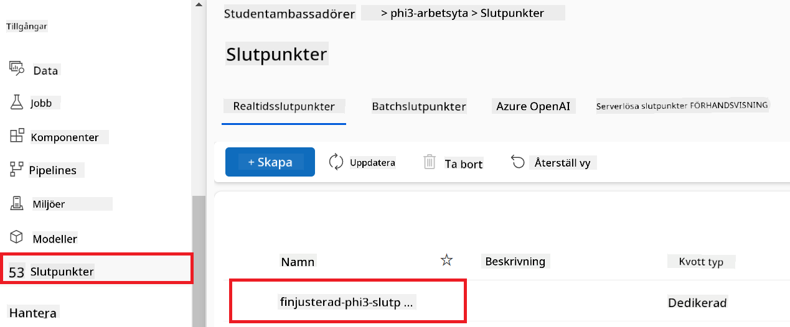

1. På denna sida kan du hantera endpoints under distributionsprocessen.

> [!NOTE]
> När distributionen är klar, se till att **Live traffic** är inställt på **100%**. Om det inte är det, välj **Update traffic** för att justera trafikinställningarna. Observera att du inte kan testa modellen om trafiken är satt till 0%.
>
> 
>

## Scenario 3: Integrera med Prompt flow och chatta med din anpassade modell i Azure AI Foundry

### Integrera den anpassade Phi-3 modellen med Prompt flow

Efter att du framgångsrikt distribuerat din finjusterade modell kan du nu integrera den med Prompt Flow för att använda din modell i realtidsapplikationer, vilket möjliggör en rad interaktiva uppgifter med din anpassade Phi-3 modell.

I denna övning kommer du att:

- Skapa Azure AI Foundry Hub.
- Skapa Azure AI Foundry Project.
- Skapa Prompt flow.
- Lägga till en anpassad anslutning för den finjusterade Phi-3 modellen.
- Ställa in Prompt flow för att chatta med din anpassade Phi-3 modell.
> [!NOTE]
> Du kan också integrera med Promptflow via Azure ML Studio. Samma integrationsprocess kan användas för Azure ML Studio.
#### Skapa Azure AI Foundry Hub

Du behöver skapa en Hub innan du skapar Projektet. En Hub fungerar som en Resursgrupp och låter dig organisera och hantera flera Projekt inom Azure AI Foundry.

1. Besök [Azure AI Foundry](https://ai.azure.com/?WT.mc_id=aiml-137032-kinfeylo).

1. Välj **All hubs** från fliken på vänster sida.

1. Välj **+ New hub** från navigationsmenyn.

    

1. Utför följande uppgifter:

    - Ange **Hub name**. Det måste vara ett unikt värde.
    - Välj din Azure **Subscription**.
    - Välj den **Resource group** som ska användas (skapa en ny om det behövs).
    - Välj den **Location** du vill använda.
    - Välj **Connect Azure AI Services** som ska användas (skapa en ny om det behövs).
    - Välj **Connect Azure AI Search** till **Skip connecting**.

    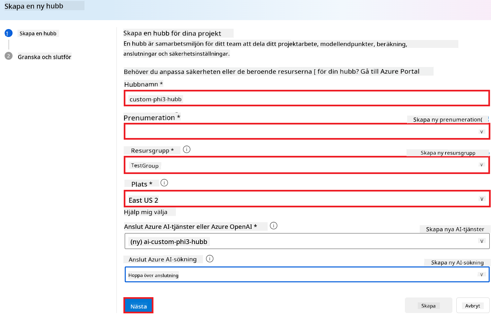

1. Välj **Next**.

#### Skapa Azure AI Foundry Projekt

1. I den Hub du skapade, välj **All projects** från fliken på vänster sida.

1. Välj **+ New project** från navigationsmenyn.

    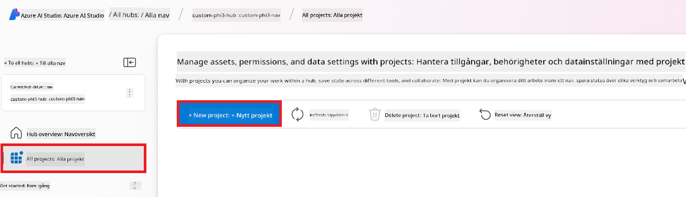

1. Ange **Project name**. Det måste vara ett unikt värde.

    

1. Välj **Create a project**.

#### Lägg till en anpassad anslutning för den finjusterade Phi-3 modellen

För att integrera din anpassade Phi-3 modell med Prompt flow behöver du spara modellens endpoint och nyckel i en anpassad anslutning. Denna inställning säkerställer åtkomst till din anpassade Phi-3 modell i Prompt flow.

#### Ange api-nyckel och endpoint-uri för den finjusterade Phi-3 modellen

1. Besök [Azure ML Studio](https://ml.azure.com/home?WT.mc_id=aiml-137032-kinfeylo).

1. Navigera till den Azure Machine learning workspace som du skapade.

1. Välj **Endpoints** från fliken på vänster sida.

    

1. Välj den endpoint du skapade.

    

1. Välj **Consume** från navigationsmenyn.

1. Kopiera din **REST endpoint** och **Primary key**.

    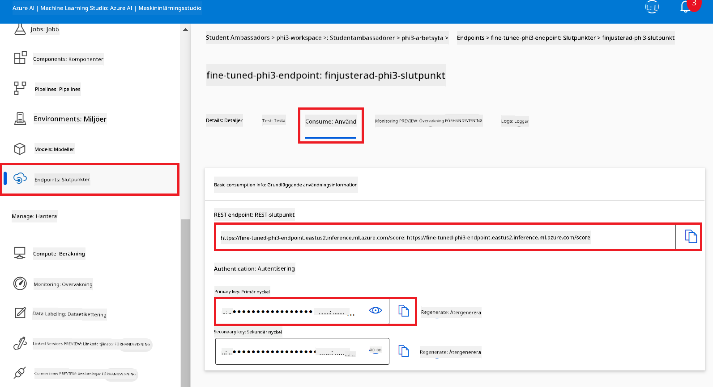

#### Lägg till den anpassade anslutningen

1. Besök [Azure AI Foundry](https://ai.azure.com/?WT.mc_id=aiml-137032-kinfeylo).

1. Navigera till det Azure AI Foundry-projekt som du skapade.

1. I Projektet du skapade, välj **Settings** från fliken på vänster sida.

1. Välj **+ New connection**.

    

1. Välj **Custom keys** från navigationsmenyn.

    

1. Utför följande uppgifter:

    - Välj **+ Add key value pairs**.
    - För nyckelnamn, ange **endpoint** och klistra in endpointen du kopierade från Azure ML Studio i värdefältet.
    - Välj **+ Add key value pairs** igen.
    - För nyckelnamn, ange **key** och klistra in nyckeln du kopierade från Azure ML Studio i värdefältet.
    - Efter att ha lagt till nycklarna, välj **is secret** för att förhindra att nyckeln exponeras.

    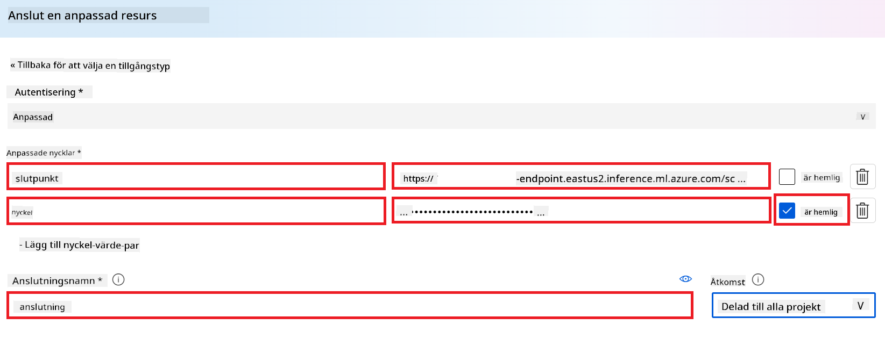

1. Välj **Add connection**.

#### Skapa Prompt flow

Du har lagt till en anpassad anslutning i Azure AI Foundry. Nu ska vi skapa en Prompt flow med följande steg. Därefter kopplar du denna Prompt flow till den anpassade anslutningen så att du kan använda den finjusterade modellen inom Prompt flow.

1. Navigera till det Azure AI Foundry-projekt som du skapade.

1. Välj **Prompt flow** från fliken på vänster sida.

1. Välj **+ Create** från navigationsmenyn.

    

1. Välj **Chat flow** från navigationsmenyn.

    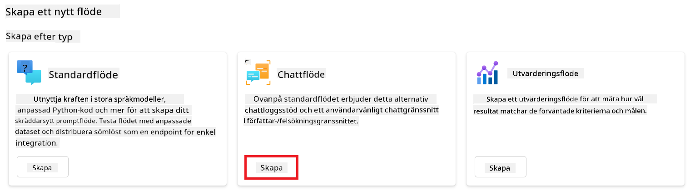

1. Ange **Folder name** som ska användas.

    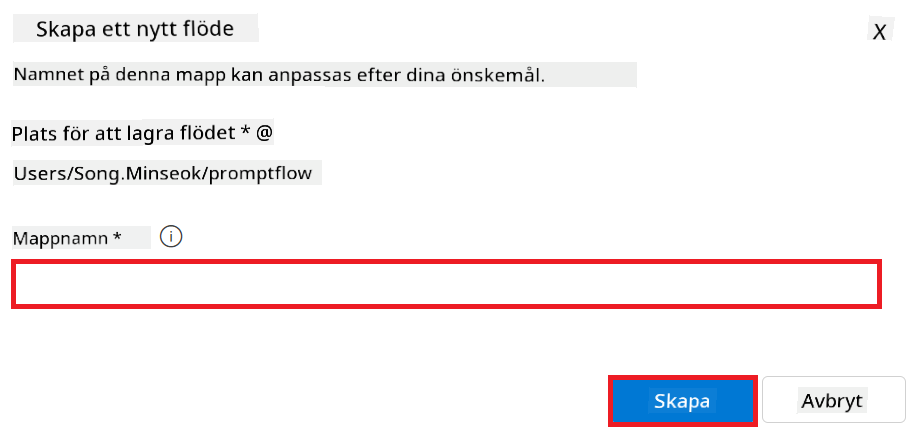

2. Välj **Create**.

#### Ställ in Prompt flow för att chatta med din anpassade Phi-3 modell

Du behöver integrera den finjusterade Phi-3 modellen i en Prompt flow. Den befintliga Prompt flow som tillhandahålls är dock inte utformad för detta ändamål. Därför måste du designa om Prompt flow för att möjliggöra integration av den anpassade modellen.

1. I Prompt flow, utför följande för att bygga om den befintliga flödet:

    - Välj **Raw file mode**.
    - Radera all befintlig kod i filen *flow.dag.yml*.
    - Lägg till följande kod i filen *flow.dag.yml*.

        ```yml
        inputs:
          input_data:
            type: string
            default: "Who founded Microsoft?"

        outputs:
          answer:
            type: string
            reference: ${integrate_with_promptflow.output}

        nodes:
        - name: integrate_with_promptflow
          type: python
          source:
            type: code
            path: integrate_with_promptflow.py
          inputs:
            input_data: ${inputs.input_data}
        ```

    - Välj **Save**.

    

1. Lägg till följande kod i filen *integrate_with_promptflow.py* för att använda den anpassade Phi-3 modellen i Prompt flow.

    ```python
    import logging
    import requests
    from promptflow import tool
    from promptflow.connections import CustomConnection

    # Logging setup
    logging.basicConfig(
        format="%(asctime)s - %(levelname)s - %(name)s - %(message)s",
        datefmt="%Y-%m-%d %H:%M:%S",
        level=logging.DEBUG
    )
    logger = logging.getLogger(__name__)

    def query_phi3_model(input_data: str, connection: CustomConnection) -> str:
        """
        Send a request to the Phi-3 model endpoint with the given input data using Custom Connection.
        """

        # "connection" is the name of the Custom Connection, "endpoint", "key" are the keys in the Custom Connection
        endpoint_url = connection.endpoint
        api_key = connection.key

        headers = {
            "Content-Type": "application/json",
            "Authorization": f"Bearer {api_key}"
        }
        data = {
            "input_data": {
                "input_string": [
                    {"role": "user", "content": input_data}
                ],
                "parameters": {
                    "temperature": 0.7,
                    "max_new_tokens": 128
                }
            }
        }
        try:
            response = requests.post(endpoint_url, json=data, headers=headers)
            response.raise_for_status()
            
            # Log the full JSON response
            logger.debug(f"Full JSON response: {response.json()}")

            result = response.json()["output"]
            logger.info("Successfully received response from Azure ML Endpoint.")
            return result
        except requests.exceptions.RequestException as e:
            logger.error(f"Error querying Azure ML Endpoint: {e}")
            raise

    @tool
    def my_python_tool(input_data: str, connection: CustomConnection) -> str:
        """
        Tool function to process input data and query the Phi-3 model.
        """
        return query_phi3_model(input_data, connection)

    ```

    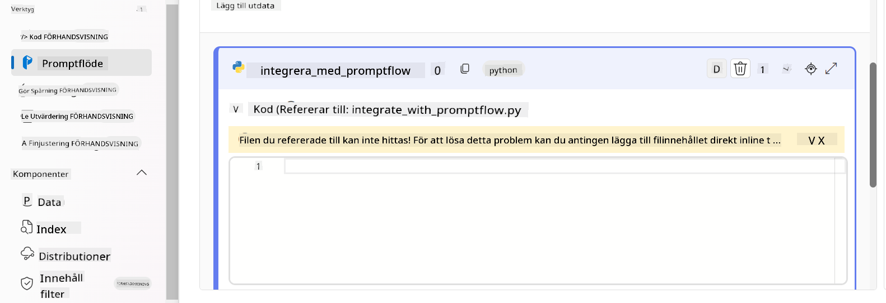

> [!NOTE]
> För mer detaljerad information om att använda Prompt flow i Azure AI Foundry kan du läsa [Prompt flow in Azure AI Foundry](https://learn.microsoft.com/azure/ai-studio/how-to/prompt-flow).

1. Välj **Chat input**, **Chat output** för att aktivera chatt med din modell.

    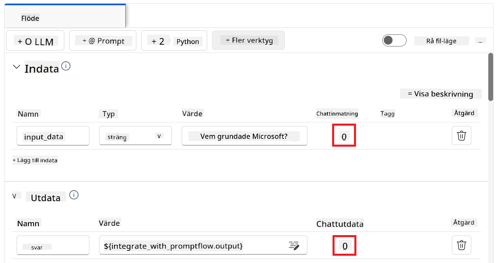

1. Nu är du redo att chatta med din anpassade Phi-3 modell. I nästa övning kommer du att lära dig hur du startar Prompt flow och använder den för att chatta med din finjusterade Phi-3 modell.

> [!NOTE]
>
> Det ombyggda flödet bör se ut som bilden nedan:
>
> 
>

### Chatta med din anpassade Phi-3 modell

Nu när du har finjusterat och integrerat din anpassade Phi-3 modell med Prompt flow är du redo att börja interagera med den. Denna övning guidar dig genom processen att ställa in och starta en chatt med din modell med hjälp av Prompt flow. Genom att följa dessa steg kan du fullt ut utnyttja kapaciteterna hos din finjusterade Phi-3 modell för olika uppgifter och samtal.

- Chatta med din anpassade Phi-3 modell med hjälp av Prompt flow.

#### Starta Prompt flow

1. Välj **Start compute sessions** för att starta Prompt flow.

    

1. Välj **Validate and parse input** för att uppdatera parametrarna.

    

1. Välj **Value** för **connection** till den anpassade anslutning du skapade. Till exempel, *connection*.

    

#### Chatta med din anpassade modell

1. Välj **Chat**.

    

1. Här är ett exempel på resultatet: Nu kan du chatta med din anpassade Phi-3 modell. Det rekommenderas att ställa frågor baserade på den data som användes för finjusteringen.

    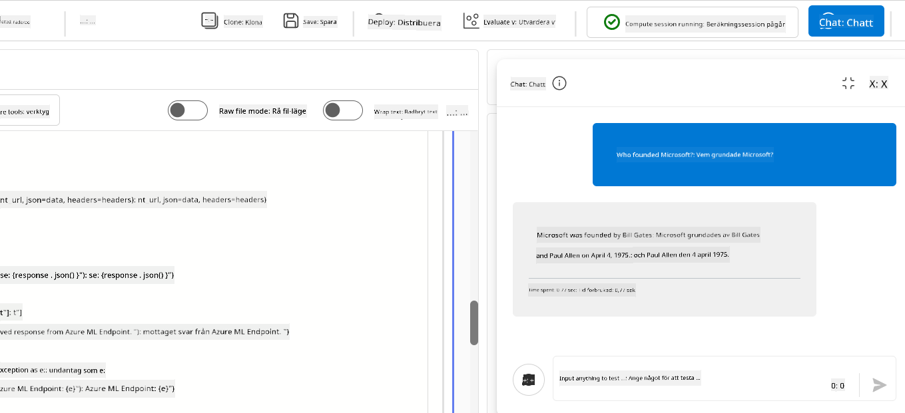

**Ansvarsfriskrivning**:  
Detta dokument har översatts med hjälp av AI-översättningstjänsten [Co-op Translator](https://github.com/Azure/co-op-translator). Även om vi strävar efter noggrannhet, vänligen observera att automatiska översättningar kan innehålla fel eller brister. Det ursprungliga dokumentet på dess modersmål bör betraktas som den auktoritativa källan. För kritisk information rekommenderas professionell mänsklig översättning. Vi ansvarar inte för några missförstånd eller feltolkningar som uppstår vid användning av denna översättning.