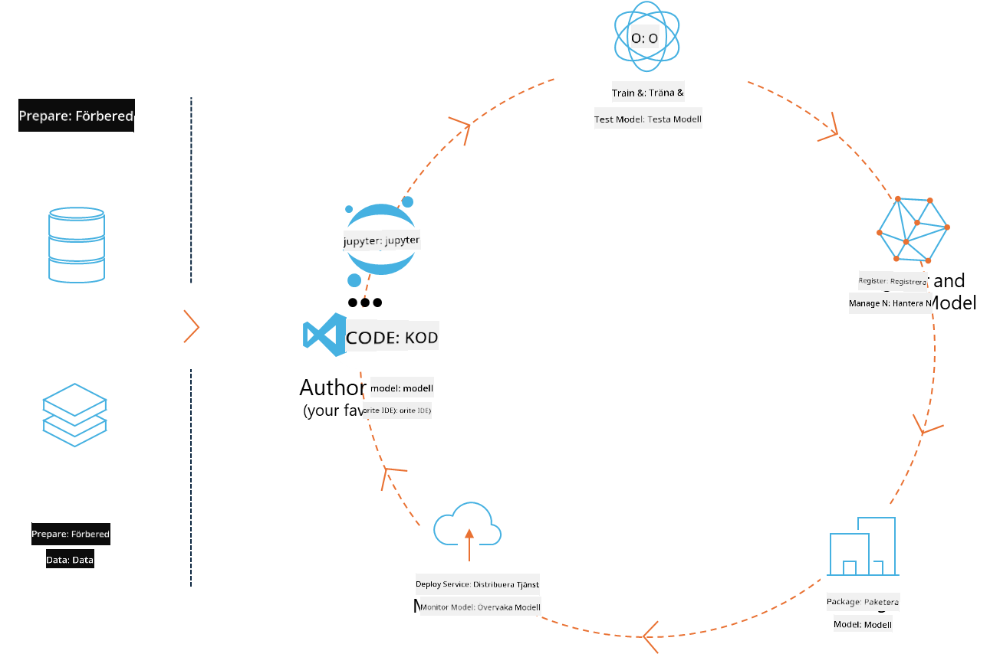

<!--
CO_OP_TRANSLATOR_METADATA:
{
  "original_hash": "f61c383bbf0c3dac97e43f833c258731",
  "translation_date": "2025-07-17T02:32:09+00:00",
  "source_file": "md/02.Application/01.TextAndChat/Phi3/E2E_Phi-3-MLflow.md",
  "language_code": "sv"
}
-->
# MLflow

[MLflow](https://mlflow.org/) är en öppen källkodsplattform designad för att hantera hela livscykeln för maskininlärning.



MLFlow används för att hantera ML-livscykeln, inklusive experimentering, reproducerbarhet, distribution och ett centralt modellregister. MLflow erbjuder för närvarande fyra komponenter.

- **MLflow Tracking:** Spåra och fråga experiment, kod, datakonfiguration och resultat.
- **MLflow Projects:** Paketera datavetenskaplig kod i ett format som gör det möjligt att reproducera körningar på vilken plattform som helst.
- **Mlflow Models:** Distribuera maskininlärningsmodeller i olika servermiljöer.
- **Model Registry:** Lagra, kommentera och hantera modeller i ett centralt register.

Det inkluderar funktioner för att spåra experiment, paketera kod till reproducerbara körningar samt dela och distribuera modeller. MLFlow är integrerat i Databricks och stödjer en mängd olika ML-bibliotek, vilket gör det bibliotek-agnostiskt. Det kan användas med vilket maskininlärningsbibliotek som helst och i vilket programmeringsspråk som helst, eftersom det erbjuder ett REST API och CLI för enkel användning.


Viktiga funktioner i MLFlow inkluderar:

- **Experiment Tracking:** Spåra och jämför parametrar och resultat.
- **Model Management:** Distribuera modeller till olika server- och inferensplattformar.
- **Model Registry:** Samarbeta kring hantering av MLflow-modellers livscykel, inklusive versionering och kommentarer.
- **Projects:** Paketera ML-kod för delning eller produktion.
MLFlow stödjer även MLOps-cykeln, som inkluderar förberedelse av data, registrering och hantering av modeller, paketering av modeller för körning, distribution av tjänster och övervakning av modeller. Målet är att förenkla processen från prototyp till produktionsflöde, särskilt i moln- och edge-miljöer.

## E2E Scenario – Bygga en wrapper och använda Phi-3 som en MLFlow-modell

I detta E2E-exempel visar vi två olika tillvägagångssätt för att bygga en wrapper runt Phi-3 small language model (SLM) och sedan köra den som en MLFlow-modell, antingen lokalt eller i molnet, t.ex. i Azure Machine Learning workspace.


| Projekt | Beskrivning | Plats |
| ------------ | ----------- | -------- |
| Transformer Pipeline | Transformer Pipeline är det enklaste sättet att bygga en wrapper om du vill använda en HuggingFace-modell med MLFlows experimentella transformers-flavour. | [**TransformerPipeline.ipynb**](../../../../../../code/06.E2E/E2E_Phi-3-MLflow_TransformerPipeline.ipynb) |
| Custom Python Wrapper | Vid skrivande stund stödde inte transformer pipeline MLFlow-wrappergenerering för HuggingFace-modeller i ONNX-format, även med det experimentella optimum Python-paketet. För sådana fall kan du bygga din egen Python-wrapper för MLFlow-modellen. | [**CustomPythonWrapper.ipynb**](../../../../../../code/06.E2E/E2E_Phi-3-MLflow_CustomPythonWrapper.ipynb) |

## Projekt: Transformer Pipeline

1. Du behöver relevanta Python-paket från MLFlow och HuggingFace:

    ``` Python
    import mlflow
    import transformers
    ```

2. Nästa steg är att initiera en transformer pipeline genom att referera till målmodellen Phi-3 i HuggingFace-registret. Som framgår av modellkortet för _Phi-3-mini-4k-instruct_ är dess uppgift av typen “Text Generation”:

    ``` Python
    pipeline = transformers.pipeline(
        task = "text-generation",
        model = "microsoft/Phi-3-mini-4k-instruct"
    )
    ```

3. Du kan nu spara din Phi-3-modells transformer pipeline i MLFlow-format och ange ytterligare detaljer som målväg för artefakter, specifika modellkonfigurationsinställningar och typ av inferens-API:

    ``` Python
    model_info = mlflow.transformers.log_model(
        transformers_model = pipeline,
        artifact_path = "phi3-mlflow-model",
        model_config = model_config,
        task = "llm/v1/chat"
    )
    ```

## Projekt: Custom Python Wrapper

1. Här kan vi använda Microsofts [ONNX Runtime generate() API](https://github.com/microsoft/onnxruntime-genai) för inferens och tokenkodning/avkodning av ONNX-modellen. Du måste välja paketet _onnxruntime_genai_ för din målplattform, i exemplet nedan riktat mot CPU:

    ``` Python
    import mlflow
    from mlflow.models import infer_signature
    import onnxruntime_genai as og
    ```

1. Vår anpassade klass implementerar två metoder: _load_context()_ för att initiera **ONNX-modellen** för Phi-3 Mini 4K Instruct, **generatorparametrar** och **tokenizer**; samt _predict()_ för att generera output-tokens för den givna prompten:

    ``` Python
    class Phi3Model(mlflow.pyfunc.PythonModel):
        def load_context(self, context):
            # Retrieving model from the artifacts
            model_path = context.artifacts["phi3-mini-onnx"]
            model_options = {
                 "max_length": 300,
                 "temperature": 0.2,         
            }
        
            # Defining the model
            self.phi3_model = og.Model(model_path)
            self.params = og.GeneratorParams(self.phi3_model)
            self.params.set_search_options(**model_options)
            
            # Defining the tokenizer
            self.tokenizer = og.Tokenizer(self.phi3_model)
    
        def predict(self, context, model_input):
            # Retrieving prompt from the input
            prompt = model_input["prompt"][0]
            self.params.input_ids = self.tokenizer.encode(prompt)
    
            # Generating the model's response
            response = self.phi3_model.generate(self.params)
    
            return self.tokenizer.decode(response[0][len(self.params.input_ids):])
    ```

1. Du kan nu använda funktionen _mlflow.pyfunc.log_model()_ för att generera en anpassad Python-wrapper (i pickle-format) för Phi-3-modellen, tillsammans med den ursprungliga ONNX-modellen och nödvändiga beroenden:

    ``` Python
    model_info = mlflow.pyfunc.log_model(
        artifact_path = artifact_path,
        python_model = Phi3Model(),
        artifacts = {
            "phi3-mini-onnx": "cpu_and_mobile/cpu-int4-rtn-block-32-acc-level-4",
        },
        input_example = input_example,
        signature = infer_signature(input_example, ["Run"]),
        extra_pip_requirements = ["torch", "onnxruntime_genai", "numpy"],
    )
    ```

## Signaturer för genererade MLFlow-modeller

1. I steg 3 i Transformer Pipeline-projektet ovan satte vi MLFlow-modellens uppgift till “_llm/v1/chat_”. Denna instruktion genererar en modell-API-wrapper som är kompatibel med OpenAI:s Chat API, som visas nedan:

    ``` Python
    {inputs: 
      ['messages': Array({content: string (required), name: string (optional), role: string (required)}) (required), 'temperature': double (optional), 'max_tokens': long (optional), 'stop': Array(string) (optional), 'n': long (optional), 'stream': boolean (optional)],
    outputs: 
      ['id': string (required), 'object': string (required), 'created': long (required), 'model': string (required), 'choices': Array({finish_reason: string (required), index: long (required), message: {content: string (required), name: string (optional), role: string (required)} (required)}) (required), 'usage': {completion_tokens: long (required), prompt_tokens: long (required), total_tokens: long (required)} (required)],
    params: 
      None}
    ```

1. Som resultat kan du skicka din prompt i följande format:

    ``` Python
    messages = [{"role": "user", "content": "What is the capital of Spain?"}]
    ```

1. Använd sedan OpenAI API-kompatibel efterbehandling, t.ex. _response[0][‘choices’][0][‘message’][‘content’]_, för att snygga till din output till något liknande detta:

    ``` JSON
    Question: What is the capital of Spain?
    
    Answer: The capital of Spain is Madrid. It is the largest city in Spain and serves as the political, economic, and cultural center of the country. Madrid is located in the center of the Iberian Peninsula and is known for its rich history, art, and architecture, including the Royal Palace, the Prado Museum, and the Plaza Mayor.
    
    Usage: {'prompt_tokens': 11, 'completion_tokens': 73, 'total_tokens': 84}
    ```

1. I steg 3 i Custom Python Wrapper-projektet ovan låter vi MLFlow-paketet generera modellens signatur från ett givet indataexempel. Vår MLFlow-wrapper-signatur kommer att se ut så här:

    ``` Python
    {inputs: 
      ['prompt': string (required)],
    outputs: 
      [string (required)],
    params: 
      None}
    ```

1. Så vår prompt behöver innehålla nyckeln "prompt" i en dictionary, ungefär så här:

    ``` Python
    {"prompt": "<|system|>You are a stand-up comedian.<|end|><|user|>Tell me a joke about atom<|end|><|assistant|>",}
    ```

1. Modellens output kommer sedan att levereras i strängformat:

    ``` JSON
    Alright, here's a little atom-related joke for you!
    
    Why don't electrons ever play hide and seek with protons?
    
    Because good luck finding them when they're always "sharing" their electrons!
    
    Remember, this is all in good fun, and we're just having a little atomic-level humor!
    ```

**Ansvarsfriskrivning**:  
Detta dokument har översatts med hjälp av AI-översättningstjänsten [Co-op Translator](https://github.com/Azure/co-op-translator). Även om vi strävar efter noggrannhet, vänligen observera att automatiska översättningar kan innehålla fel eller brister. Det ursprungliga dokumentet på dess modersmål bör betraktas som den auktoritativa källan. För kritisk information rekommenderas professionell mänsklig översättning. Vi ansvarar inte för några missförstånd eller feltolkningar som uppstår till följd av användningen av denna översättning.