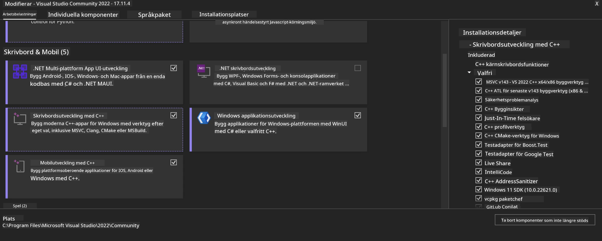
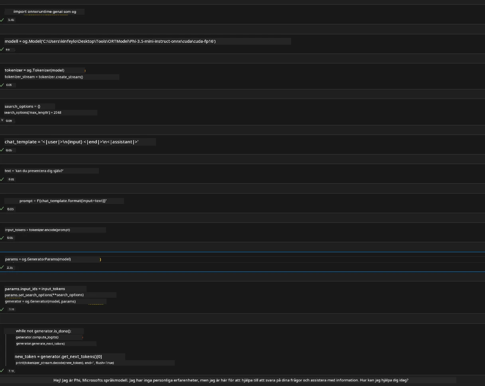
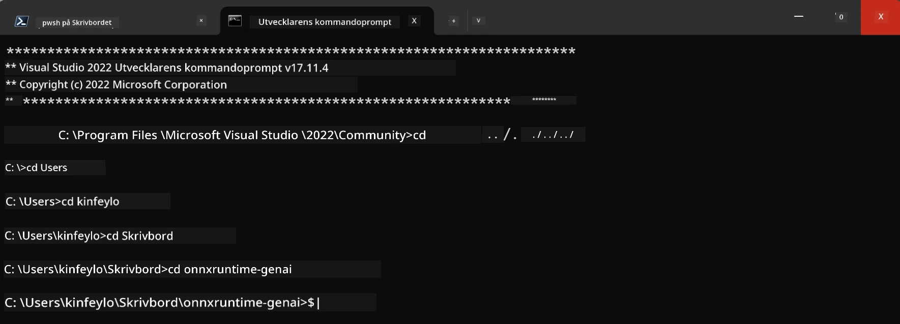

# **Riktlinje för OnnxRuntime GenAI Windows GPU**

Denna riktlinje ger steg för att sätta upp och använda ONNX Runtime (ORT) med GPU:er på Windows. Den är utformad för att hjälpa dig att utnyttja GPU-acceleration för dina modeller, vilket förbättrar prestanda och effektivitet.

Dokumentet ger vägledning om:

- Miljöuppsättning: Instruktioner för att installera nödvändiga beroenden som CUDA, cuDNN och ONNX Runtime.
- Konfiguration: Hur man konfigurerar miljön och ONNX Runtime för att effektivt använda GPU-resurser.
- Optimeringstips: Råd om hur du finjusterar dina GPU-inställningar för optimal prestanda.

### **1. Python 3.10.x /3.11.8**

   ***Notera*** Föreslår att använda [miniforge](https://github.com/conda-forge/miniforge/releases/latest/download/Miniforge3-Windows-x86_64.exe) som din Python-miljö

   ```bash

   conda create -n pydev python==3.11.8

   conda activate pydev

   ```

   ***Påminnelse*** Om du har installerat något angående python ONNX-bibliotek, vänligen avinstallera det

### **2. Installera CMake med winget**


   ```bash

   winget install -e --id Kitware.CMake

   ```

### **3. Installera Visual Studio 2022 - Desktop Development med C++**

   ***Notera*** Om du inte vill kompilera kan du hoppa över detta steg




### **4. Installera NVIDIA-drivrutin**

1. **NVIDIA GPU Driver** [https://www.nvidia.com/en-us/drivers/](https://www.nvidia.com/en-us/drivers/)

2. **NVIDIA CUDA 12.4** [https://developer.nvidia.com/cuda-12-4-0-download-archive](https://developer.nvidia.com/cuda-12-4-0-download-archive)

3. **NVIDIA CUDNN 9.4** [https://developer.nvidia.com/cudnn-downloads](https://developer.nvidia.com/cudnn-downloads)

***Påminnelse*** Vänligen använd standardinställningar vid installationsflödet

### **5. Ställ in NVIDIA-miljö**

Kopiera NVIDIA CUDNN 9.4 lib, bin, include till NVIDIA CUDA 12.4 lib, bin, include

- kopiera *'C:\Program Files\NVIDIA\CUDNN\v9.4\bin\12.6'* filer till *'C:\Program Files\NVIDIA GPU Computing Toolkit\CUDA\v12.4\bin'*

- kopiera *'C:\Program Files\NVIDIA\CUDNN\v9.4\include\12.6'* filer till *'C:\Program Files\NVIDIA GPU Computing Toolkit\CUDA\v12.4\include'*

- kopiera *'C:\Program Files\NVIDIA\CUDNN\v9.4\lib\12.6'* filer till *'C:\Program Files\NVIDIA GPU Computing Toolkit\CUDA\v12.4\lib\x64'*


### **6. Ladda ner Phi-3.5-mini-instruct-onnx**


   ```bash

   winget install -e --id Git.Git

   winget install -e --id GitHub.GitLFS

   git lfs install

   git clone https://huggingface.co/microsoft/Phi-3.5-mini-instruct-onnx

   ```

### **7. Köra InferencePhi35Instruct.ipynb**

   Öppna [Notebook](../../../../code/09.UpdateSamples/Aug/ortgpu-phi35-instruct.ipynb) och kör





### **8. Kompilera ORT GenAI GPU**


   ***Notera*** 
   
   1. Vänligen avinstallera allt som rör onnx och onnxruntime och onnxruntime-genai först

   
   ```bash

   pip list 
   
   ```

   Avinstallera sedan alla onnxruntime-bibliotek dvs.


   ```bash

   pip uninstall onnxruntime

   pip uninstall onnxruntime-genai

   pip uninstall onnxruntume-genai-cuda
   
   ```

   2. Kontrollera stöd för Visual Studio Extension 

   Kontrollera C:\Program Files\NVIDIA GPU Computing Toolkit\CUDA\v12.4\extras för att säkerställa att C:\Program Files\NVIDIA GPU Computing Toolkit\CUDA\v12.4\extras\visual_studio_integration finns. 
   
   Om det inte finns, kontrollera andra Cuda toolkit-drivrutinsmappar och kopiera mappen visual_studio_integration och dess innehåll till C:\Program Files\NVIDIA GPU Computing Toolkit\CUDA\v12.4\extras\visual_studio_integration


   - Om du inte vill kompilera kan du hoppa över detta steg


   ```bash

   git clone https://github.com/microsoft/onnxruntime-genai

   ```

   - Ladda ner [https://github.com/microsoft/onnxruntime/releases/download/v1.19.2/onnxruntime-win-x64-gpu-1.19.2.zip](https://github.com/microsoft/onnxruntime/releases/download/v1.19.2/onnxruntime-win-x64-gpu-1.19.2.zip)

   - Packa upp onnxruntime-win-x64-gpu-1.19.2.zip och byt namn till **ort**, kopiera ort-mappen till onnxruntime-genai

   - Använd Windows Terminal, gå till Developer Command Prompt för VS 2022 och gå till onnxruntime-genai



   - Kompilera det med din python-miljö

   
   ```bash

   cd onnxruntime-genai

   python build.py --use_cuda  --cuda_home "C:\Program Files\NVIDIA GPU Computing Toolkit\CUDA\v12.4" --config Release
 

   cd build/Windows/Release/Wheel

   pip install .whl

   ```

---

<!-- CO-OP TRANSLATOR DISCLAIMER START -->
**Ansvarsfriskrivning**:
Detta dokument har översatts med hjälp av AI-översättningstjänsten [Co-op Translator](https://github.com/Azure/co-op-translator). Även om vi strävar efter noggrannhet, var vänlig notera att automatiska översättningar kan innehålla fel eller brister. Det ursprungliga dokumentet på dess modersmål bör betraktas som den auktoritativa källan. För kritisk information rekommenderas professionell mänsklig översättning. Vi ansvarar inte för några missförstånd eller feltolkningar som uppstår till följd av användningen av denna översättning.
<!-- CO-OP TRANSLATOR DISCLAIMER END -->