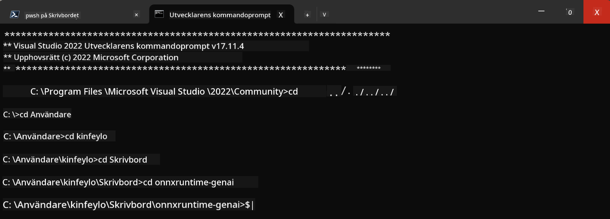

<!--
CO_OP_TRANSLATOR_METADATA:
{
  "original_hash": "b066fc29c1b2129df84e027cb75119ce",
  "translation_date": "2025-05-09T18:44:03+00:00",
  "source_file": "md/02.Application/01.TextAndChat/Phi3/ORTWindowGPUGuideline.md",
  "language_code": "sv"
}
-->
# **Riktlinjer för OnnxRuntime GenAI Windows GPU**

Denna riktlinje beskriver steg för att ställa in och använda ONNX Runtime (ORT) med GPU:er på Windows. Den är utformad för att hjälpa dig utnyttja GPU-acceleration för dina modeller, vilket förbättrar prestanda och effektivitet.

Dokumentet ger vägledning om:

- Miljöinställning: Instruktioner för att installera nödvändiga beroenden som CUDA, cuDNN och ONNX Runtime.
- Konfiguration: Hur du konfigurerar miljön och ONNX Runtime för att effektivt använda GPU-resurser.
- Optimeringstips: Råd om hur du finjusterar dina GPU-inställningar för bästa prestanda.

### **1. Python 3.10.x /3.11.8**

   ***Note*** Vi rekommenderar att använda [miniforge](https://github.com/conda-forge/miniforge/releases/latest/download/Miniforge3-Windows-x86_64.exe) som din Python-miljö

   ```bash

   conda create -n pydev python==3.11.8

   conda activate pydev

   ```

   ***Reminder*** Om du har installerat något Python ONNX-bibliotek, avinstallera det först

### **2. Installera CMake med winget**

   ```bash

   winget install -e --id Kitware.CMake

   ```

### **3. Installera Visual Studio 2022 - Desktop Development med C++**

   ***Note*** Om du inte vill kompilera kan du hoppa över detta steg


### **4. Installera NVIDIA-drivrutin**

1. **NVIDIA GPU Driver**  [https://www.nvidia.com/en-us/drivers/](https://www.nvidia.com/en-us/drivers/)

2. **NVIDIA CUDA 12.4** [https://developer.nvidia.com/cuda-12-4-0-download-archive](https://developer.nvidia.com/cuda-12-4-0-download-archive)

3. **NVIDIA CUDNN 9.4**  [https://developer.nvidia.com/cudnn-downloads](https://developer.nvidia.com/cudnn-downloads)

***Reminder*** Använd standardinställningarna under installationen

### **5. Ställ in NVIDIA-miljön**

Kopiera NVIDIA CUDNN 9.4 lib, bin, include till NVIDIA CUDA 12.4 lib, bin, include

- kopiera filer från *'C:\Program Files\NVIDIA\CUDNN\v9.4\bin\12.6'* till  *'C:\Program Files\NVIDIA GPU Computing Toolkit\CUDA\v12.4\bin'*

- kopiera filer från *'C:\Program Files\NVIDIA\CUDNN\v9.4\include\12.6'* till  *'C:\Program Files\NVIDIA GPU Computing Toolkit\CUDA\v12.4\include'*

- kopiera filer från *'C:\Program Files\NVIDIA\CUDNN\v9.4\lib\12.6'* till  *'C:\Program Files\NVIDIA GPU Computing Toolkit\CUDA\v12.4\lib\x64'*

### **6. Ladda ner Phi-3.5-mini-instruct-onnx**

   ```bash

   winget install -e --id Git.Git

   winget install -e --id GitHub.GitLFS

   git lfs install

   git clone https://huggingface.co/microsoft/Phi-3.5-mini-instruct-onnx

   ```

### **7. Kör InferencePhi35Instruct.ipynb**

   Öppna [Notebook](../../../../../../code/09.UpdateSamples/Aug/ortgpu-phi35-instruct.ipynb) och kör


### **8. Kompilera ORT GenAI GPU**

   ***Note*** 
   
   1. Avinstallera först alla onnx, onnxruntime och onnxruntime-genai

   
   ```bash

   pip list 
   
   ```

   Avinstallera sedan alla onnxruntime-bibliotek, t.ex.

   ```bash

   pip uninstall onnxruntime

   pip uninstall onnxruntime-genai

   pip uninstall onnxruntume-genai-cuda
   
   ```

   2. Kontrollera stöd för Visual Studio Extension 

   Kontrollera i C:\Program Files\NVIDIA GPU Computing Toolkit\CUDA\v12.4\extras att mappen C:\Program Files\NVIDIA GPU Computing Toolkit\CUDA\v12.4\extras\visual_studio_integration finns. 
   
   Om den inte finns, leta i andra CUDA toolkit-drivrutinsmappar och kopiera mappen visual_studio_integration och dess innehåll till C:\Program Files\NVIDIA GPU Computing Toolkit\CUDA\v12.4\extras\visual_studio_integration

   - Om du inte vill kompilera kan du hoppa över detta steg

   ```bash

   git clone https://github.com/microsoft/onnxruntime-genai

   ```

   - Ladda ner [https://github.com/microsoft/onnxruntime/releases/download/v1.19.2/onnxruntime-win-x64-gpu-1.19.2.zip](https://github.com/microsoft/onnxruntime/releases/download/v1.19.2/onnxruntime-win-x64-gpu-1.19.2.zip)

   - Packa upp onnxruntime-win-x64-gpu-1.19.2.zip, byt namn på mappen till **ort**, och kopiera ort-mappen till onnxruntime-genai

   - Använd Windows Terminal, öppna Developer Command Prompt för VS 2022 och gå till onnxruntime-genai



   - Kompilera med din Python-miljö

   ```bash

   cd onnxruntime-genai

   python build.py --use_cuda  --cuda_home "C:\Program Files\NVIDIA GPU Computing Toolkit\CUDA\v12.4" --config Release
 

   cd build/Windows/Release/Wheel

   pip install .whl

   ```

**Ansvarsfriskrivning**:  
Detta dokument har översatts med hjälp av AI-översättningstjänsten [Co-op Translator](https://github.com/Azure/co-op-translator). Även om vi strävar efter noggrannhet, vänligen var medveten om att automatiska översättningar kan innehålla fel eller brister. Det ursprungliga dokumentet på dess modersmål bör betraktas som den auktoritativa källan. För kritisk information rekommenderas professionell mänsklig översättning. Vi ansvarar inte för några missförstånd eller feltolkningar som uppstår vid användning av denna översättning.