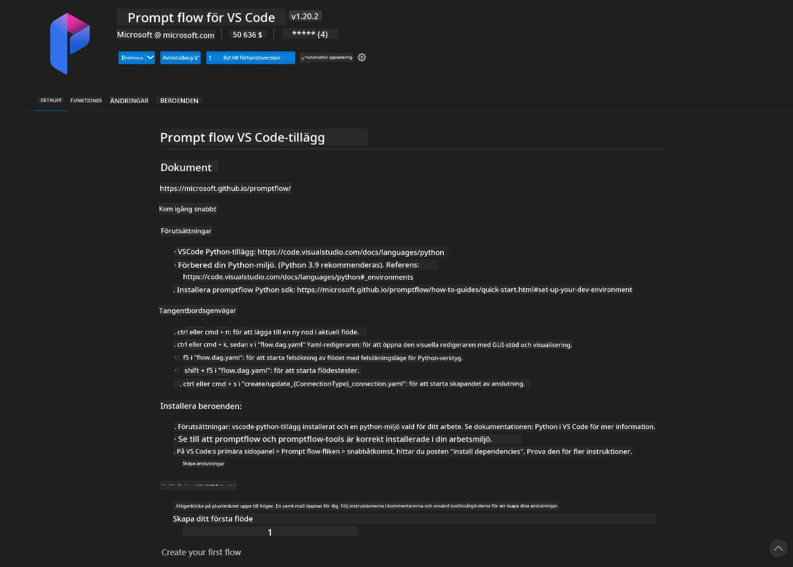
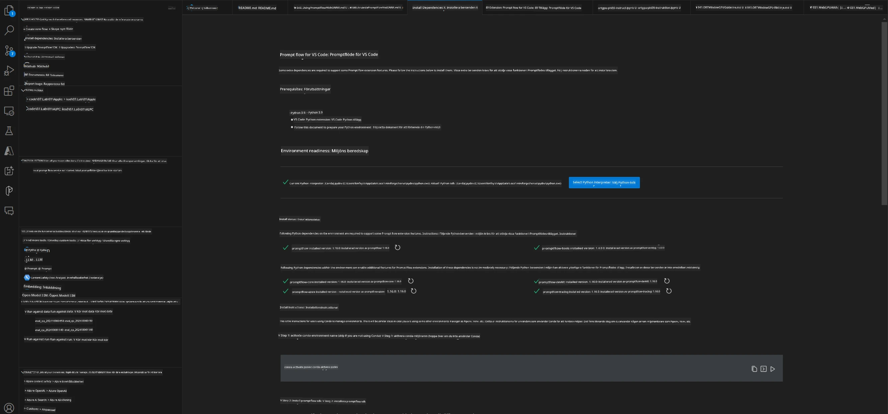
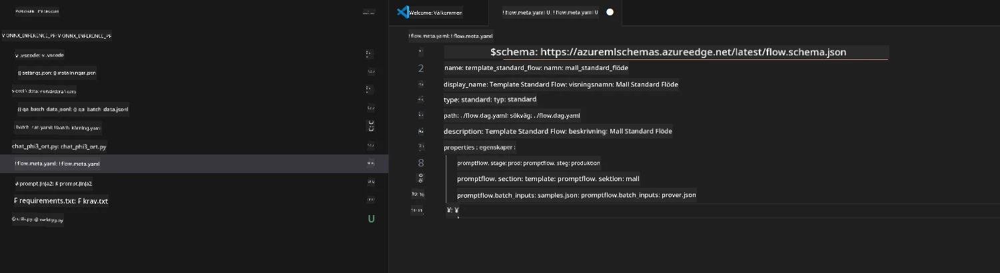
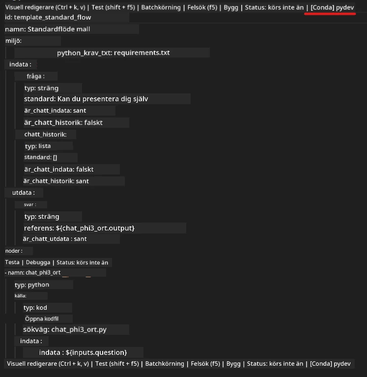
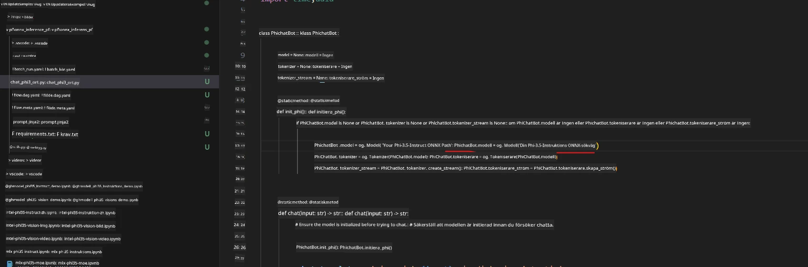
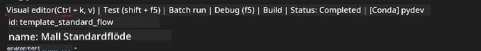
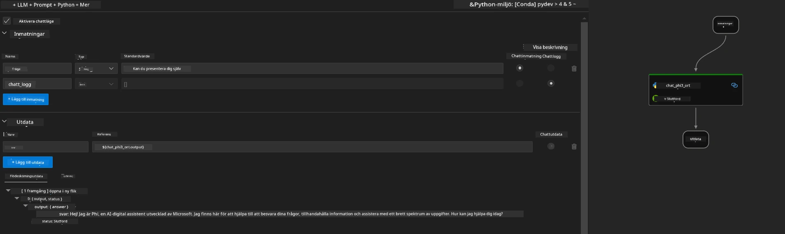

# Använda Windows GPU för att skapa Prompt flow-lösning med Phi-3.5-Instruct ONNX

Följande dokument är ett exempel på hur man använder PromptFlow med ONNX (Open Neural Network Exchange) för att utveckla AI-applikationer baserade på Phi-3-modeller.

PromptFlow är en uppsättning utvecklingsverktyg som är utformade för att effektivisera hela utvecklingscykeln för LLM-baserade (Large Language Model) AI-applikationer, från idé och prototypframtagning till testning och utvärdering.

Genom att integrera PromptFlow med ONNX kan utvecklare:

- Optimera modellprestanda: Utnyttja ONNX för effektiv modellinferens och distribution.
- Förenkla utvecklingen: Använd PromptFlow för att hantera arbetsflödet och automatisera repetitiva uppgifter.
- Förbättra samarbetet: Underlätta bättre samarbete mellan teammedlemmar genom att erbjuda en enhetlig utvecklingsmiljö.

**Prompt flow** är en uppsättning utvecklingsverktyg som är utformade för att effektivisera hela utvecklingscykeln för LLM-baserade AI-applikationer, från idé, prototypframtagning, testning, utvärdering till produktionssättning och övervakning. Det gör prompt engineering mycket enklare och gör det möjligt att bygga LLM-appar med produktionskvalitet.

Prompt flow kan kopplas till OpenAI, Azure OpenAI Service och anpassningsbara modeller (Huggingface, lokala LLM/SLM). Vi hoppas kunna distribuera Phi-3.5:s kvantiserade ONNX-modell till lokala applikationer. Prompt flow kan hjälpa oss att bättre planera vår verksamhet och slutföra lokala lösningar baserade på Phi-3.5. I detta exempel kommer vi att kombinera ONNX Runtime GenAI Library för att slutföra Prompt flow-lösningen baserad på Windows GPU.

## **Installation**

### **ONNX Runtime GenAI för Windows GPU**

Läs denna riktlinje för att ställa in ONNX Runtime GenAI för Windows GPU [klicka här](./ORTWindowGPUGuideline.md)

### **Ställ in Prompt flow i VSCode**

1. Installera Prompt flow VS Code Extension



2. Efter att ha installerat Prompt flow VS Code Extension, klicka på extensionen och välj **Installation dependencies** följ denna riktlinje för att installera Prompt flow SDK i din miljö



3. Ladda ner [Exempelkod](../../../../../../code/09.UpdateSamples/Aug/pf/onnx_inference_pf) och öppna detta exempel i VS Code



4. Öppna **flow.dag.yaml** för att välja din Python-miljö



   Öppna **chat_phi3_ort.py** för att ändra platsen för din Phi-3.5-instruct ONNX-modell



5. Kör din prompt flow för testning

Öppna **flow.dag.yaml** och klicka på visual editor



Efter att ha klickat på detta, kör den för att testa



1. Du kan köra batch i terminalen för att se fler resultat


```bash

pf run create --file batch_run.yaml --stream --name 'Your eval qa name'    

```

Du kan se resultaten i din standardwebbläsare


**Ansvarsfriskrivning**:  
Detta dokument har översatts med hjälp av AI-översättningstjänsten [Co-op Translator](https://github.com/Azure/co-op-translator). Även om vi strävar efter noggrannhet, vänligen observera att automatiska översättningar kan innehålla fel eller brister. Det ursprungliga dokumentet på dess modersmål bör betraktas som den auktoritativa källan. För kritisk information rekommenderas professionell mänsklig översättning. Vi ansvarar inte för några missförstånd eller feltolkningar som uppstår till följd av användningen av denna översättning.