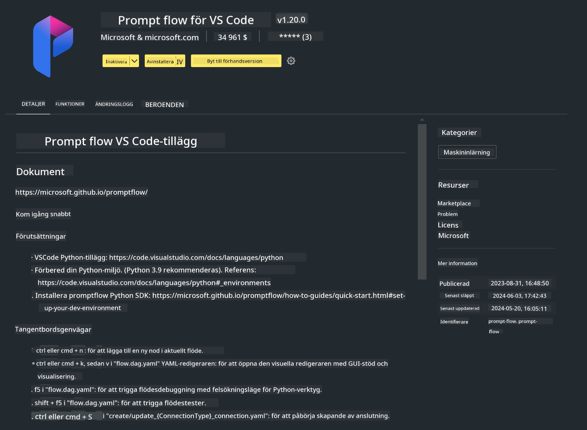

<!--
CO_OP_TRANSLATOR_METADATA:
{
  "original_hash": "a4ef39027902e82f2c33d568d2a2259a",
  "translation_date": "2025-05-09T19:19:49+00:00",
  "source_file": "md/02.Application/02.Code/Phi3/VSCodeExt/HOL/AIPC/01.Installations.md",
  "language_code": "sv"
}
-->
# **Lab 0 - Installation**

När vi går in i labbet behöver vi konfigurera den relevanta miljön:


### **1. Python 3.11+**

Det rekommenderas att använda miniforge för att konfigurera din Python-miljö

För att konfigurera miniforge, vänligen se [https://github.com/conda-forge/miniforge](https://github.com/conda-forge/miniforge)

Efter att ha konfigurerat miniforge, kör följande kommando i Power Shell

```bash

conda create -n pyenv python==3.11.8 -y

conda activate pyenv

```


### **2. Install Prompt flow SDK**

I Lab 1 använder vi Prompt flow, så du behöver konfigurera Prompt flow SDK.

```bash

pip install promptflow --upgrade

```

Du kan kontrollera promptflow sdk med detta kommando


```bash

pf --version

```

### **3. Install Visual Studio Code Prompt flow Extension**




### **4. Intel NPU Acceleration Library**

Intels nya generation processorer stödjer NPU. Om du vill använda NPU för att köra LLMs / SLMs lokalt kan du använda ***Intel NPU Acceleration Library***. Om du vill veta mer kan du läsa [https://github.com/microsoft/PhiCookBook/blob/main/md/01.Introduction/03/AIPC_Inference.md](https://github.com/microsoft/PhiCookBook/blob/main/md/01.Introduction/03/AIPC_Inference.md).

Installera Intel NPU Acceleration Library i bash


```bash

pip install intel-npu-acceleration-library

```

***Note***: Observera att detta bibliotek stödjer transformers ***4.40.2***, vänligen bekräfta versionen


### **5. Other Python Library**


skapa requirements.txt och lägg till detta innehåll

```txt

notebook
numpy 
scipy 
scikit-learn 
matplotlib 
pandas 
pillow 
graphviz

```


### **6. Install NVM**

installera nvm i Powershell 


```bash

winget install -e --id CoreyButler.NVMforWindows

```

installera nodejs 18.20


```bash

nvm install 18.20.0

nvm use 18.20.0

```

### **7. Install Visual Studio Code Development Support**


```bash

npm install --global yo generator-code

```

Grattis! Du har framgångsrikt konfigurerat SDK. Nästa steg är att gå vidare till de praktiska momenten.

**Ansvarsfriskrivning**:  
Detta dokument har översatts med hjälp av AI-översättningstjänsten [Co-op Translator](https://github.com/Azure/co-op-translator). Även om vi strävar efter noggrannhet, vänligen var medveten om att automatiska översättningar kan innehålla fel eller brister. Det ursprungliga dokumentet på dess modersmål bör betraktas som den auktoritativa källan. För kritisk information rekommenderas professionell mänsklig översättning. Vi ansvarar inte för några missförstånd eller feltolkningar som uppstår till följd av användningen av denna översättning.