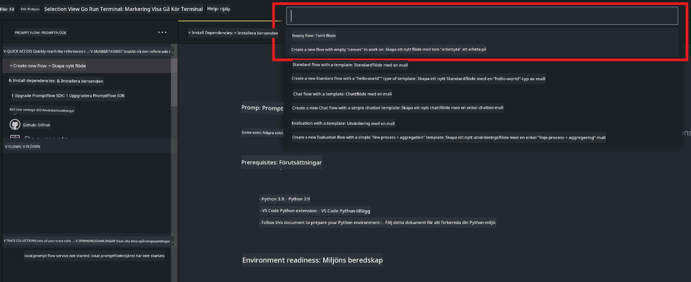
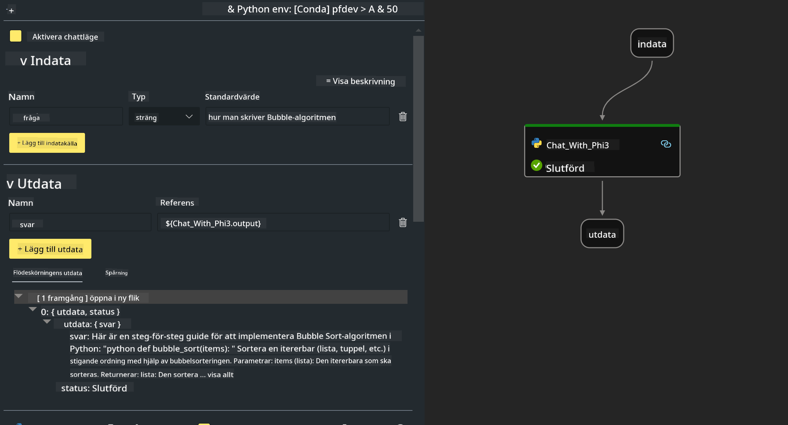

<!--
CO_OP_TRANSLATOR_METADATA:
{
  "original_hash": "bc29f7fe7fc16bed6932733eac8c81b8",
  "translation_date": "2025-05-09T19:23:57+00:00",
  "source_file": "md/02.Application/02.Code/Phi3/VSCodeExt/HOL/AIPC/02.PromptflowWithNPU.md",
  "language_code": "sv"
}
-->
# **Lab 2 - Kör Prompt flow med Phi-3-mini i AIPC**

## **Vad är Prompt flow**

Prompt flow är en samling utvecklingsverktyg designade för att effektivisera hela utvecklingscykeln för LLM-baserade AI-applikationer, från idé, prototypframtagning, testning, utvärdering till produktionssättning och övervakning. Det gör prompt engineering mycket enklare och gör det möjligt att bygga LLM-appar med produktionskvalitet.

Med prompt flow kan du:

- Skapa flöden som länkar samman LLMs, prompts, Python-kod och andra verktyg i ett körbart arbetsflöde.

- Felsöka och iterera dina flöden, särskilt interaktionen med LLMs, på ett enkelt sätt.

- Utvärdera dina flöden, beräkna kvalitets- och prestandamått med större dataset.

- Integrera testning och utvärdering i ditt CI/CD-system för att säkerställa kvaliteten på ditt flöde.

- Distribuera dina flöden till den servingsplattform du väljer eller enkelt integrera i din apps kodbas.

- (Valfritt men starkt rekommenderat) Samarbeta med ditt team genom att använda molnversionen av Prompt flow i Azure AI.

## **Vad är AIPC**

En AI-PC har en CPU, en GPU och en NPU, var och en med specifika AI-accelerationsmöjligheter. En NPU, eller neural processing unit, är en specialiserad accelerator som hanterar artificiell intelligens (AI) och maskininlärningsuppgifter (ML) direkt på din dator istället för att skicka data för bearbetning i molnet. GPU och CPU kan också hantera dessa arbetsbelastningar, men NPU är särskilt bra på AI-beräkningar med låg energiförbrukning. AI-PC:n representerar ett grundläggande skifte i hur våra datorer fungerar. Det är inte en lösning på ett problem som inte fanns tidigare. Istället lovar det en stor förbättring för vardaglig datoranvändning.

Hur fungerar det då? Jämfört med generativ AI och de enorma stora språkmodellerna (LLMs) som tränats på mängder av offentlig data, är AI:n som körs på din dator mer tillgänglig på nästan alla nivåer. Konceptet är lättare att ta till sig, och eftersom det tränas på dina egna data utan att behöva använda molnet, är fördelarna mer omedelbart attraktiva för en bredare användargrupp.

På kort sikt handlar AI-PC-världen om personliga assistenter och mindre AI-modeller som körs direkt på din dator, använder dina data för att erbjuda personliga, privata och mer säkra AI-förbättringar för saker du redan gör varje dag – ta mötesanteckningar, organisera en fantasyfotbollsliga, automatisera förbättringar för foto- och videoredigering eller lägga upp den perfekta resplanen för en familjesammankomst baserat på allas ankomst- och avresetider.

## **Bygga genereringsflöden på AIPC**

***Note*** ：Om du inte har slutfört miljöinstallationen, besök [Lab 0 -Installations](./01.Installations.md)

1. Öppna Prompt flow Extension i Visual Studio Code och skapa ett tomt flödesprojekt



2. Lägg till Inputs och Outputs parametrar och lägg till Python-kod som nytt flöde



Du kan använda denna struktur (flow.dag.yaml) för att bygga ditt flöde

```yaml

inputs:
  question:
    type: string
    default: how to write Bubble Algorithm
outputs:
  answer:
    type: string
    reference: ${Chat_With_Phi3.output}
nodes:
- name: Chat_With_Phi3
  type: python
  source:
    type: code
    path: Chat_With_Phi3.py
  inputs:
    question: ${inputs.question}


```

3. Lägg till kod i ***Chat_With_Phi3.py***

```python


from promptflow.core import tool

# import torch
from transformers import AutoTokenizer, pipeline,TextStreamer
import intel_npu_acceleration_library as npu_lib

import warnings

import asyncio
import platform

class Phi3CodeAgent:
    
    model = None
    tokenizer = None
    text_streamer = None
    
    model_id = "microsoft/Phi-3-mini-4k-instruct"

    @staticmethod
    def init_phi3():
        
        if Phi3CodeAgent.model is None or Phi3CodeAgent.tokenizer is None or Phi3CodeAgent.text_streamer is None:
            Phi3CodeAgent.model = npu_lib.NPUModelForCausalLM.from_pretrained(
                                    Phi3CodeAgent.model_id,
                                    torch_dtype="auto",
                                    dtype=npu_lib.int4,
                                    trust_remote_code=True
                                )
            Phi3CodeAgent.tokenizer = AutoTokenizer.from_pretrained(Phi3CodeAgent.model_id)
            Phi3CodeAgent.text_streamer = TextStreamer(Phi3CodeAgent.tokenizer, skip_prompt=True)

    

    @staticmethod
    def chat_with_phi3(prompt):
        
        Phi3CodeAgent.init_phi3()

        messages = "<|system|>You are a AI Python coding assistant. Please help me to generate code in Python.The answer only genertated Python code, but any comments and instructions do not need to be generated<|end|><|user|>" + prompt +"<|end|><|assistant|>"


        generation_args = {
            "max_new_tokens": 1024,
            "return_full_text": False,
            "temperature": 0.3,
            "do_sample": False,
            "streamer": Phi3CodeAgent.text_streamer,
        }

        pipe = pipeline(
            "text-generation",
            model=Phi3CodeAgent.model,
            tokenizer=Phi3CodeAgent.tokenizer,
            # **generation_args
        )

        result = ''

        with warnings.catch_warnings():
            warnings.simplefilter("ignore")
            response = pipe(messages, **generation_args)
            result =response[0]['generated_text']
            return result


@tool
def my_python_tool(question: str) -> str:
    if platform.system() == 'Windows':
        asyncio.set_event_loop_policy(asyncio.WindowsSelectorEventLoopPolicy())
    return Phi3CodeAgent.chat_with_phi3(question)


```

4. Du kan testa flödet via Debug eller Run för att kontrollera att genereringskoden fungerar


5. Kör flödet som utvecklings-API i terminalen

```

pf flow serve --source ./ --port 8080 --host localhost   

```

Du kan testa det i Postman / Thunder Client

### **Note**

1. Första körningen tar lång tid. Det rekommenderas att ladda ner phi-3-modellen från Hugging face CLI.

2. Med tanke på den begränsade beräkningskraften hos Intel NPU rekommenderas att använda Phi-3-mini-4k-instruct.

3. Vi använder Intel NPU Acceleration för att kvantifiera INT4-konvertering, men om du kör om tjänsten behöver du ta bort cache- och nc_workshop-mapparna.

## **Resurser**

1. Lär dig Promptflow [https://microsoft.github.io/promptflow/](https://microsoft.github.io/promptflow/)

2. Lär dig Intel NPU Acceleration [https://github.com/intel/intel-npu-acceleration-library](https://github.com/intel/intel-npu-acceleration-library)

3. Exempelkod, ladda ner [Local NPU Agent Sample Code](../../../../../../../../../code/07.Lab/01/AIPC)

**Ansvarsfriskrivning**:  
Detta dokument har översatts med hjälp av AI-översättningstjänsten [Co-op Translator](https://github.com/Azure/co-op-translator). Även om vi strävar efter noggrannhet, vänligen observera att automatiska översättningar kan innehålla fel eller brister. Det ursprungliga dokumentet på dess modersmål bör betraktas som den auktoritativa källan. För kritisk information rekommenderas professionell mänsklig översättning. Vi ansvarar inte för eventuella missförstånd eller feltolkningar som uppstår vid användning av denna översättning.