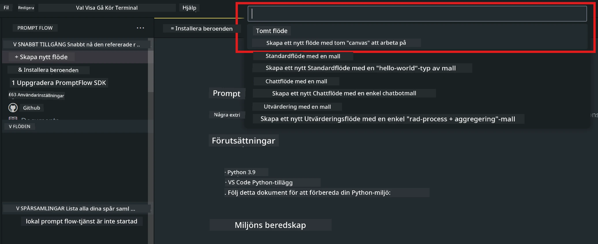
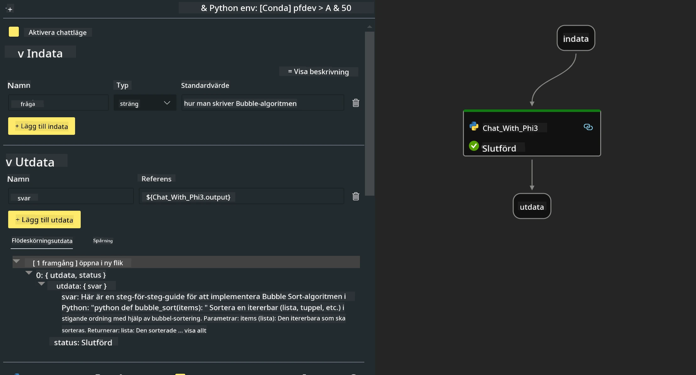
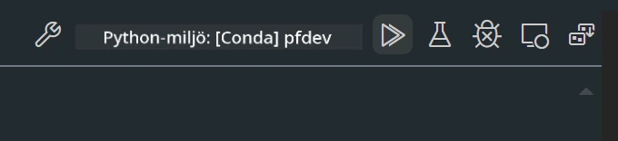

<!--
CO_OP_TRANSLATOR_METADATA:
{
  "original_hash": "3dbbf568625b1ee04b354c2dc81d3248",
  "translation_date": "2025-07-17T04:26:29+00:00",
  "source_file": "md/02.Application/02.Code/Phi3/VSCodeExt/HOL/Apple/02.PromptflowWithMLX.md",
  "language_code": "sv"
}
-->
# **Lab 2 - Kör Prompt flow med Phi-3-mini i AIPC**

## **Vad är Prompt flow**

Prompt flow är en uppsättning utvecklingsverktyg som är utformade för att förenkla hela utvecklingscykeln för AI-applikationer baserade på LLM, från idé, prototypframtagning, testning, utvärdering till produktionssättning och övervakning. Det gör prompt engineering mycket enklare och gör det möjligt för dig att bygga LLM-appar med produktionskvalitet.

Med prompt flow kan du:

- Skapa flöden som kopplar samman LLMs, prompts, Python-kod och andra verktyg i ett exekverbart arbetsflöde.

- Felsöka och iterera dina flöden, särskilt interaktionen med LLMs, på ett enkelt sätt.

- Utvärdera dina flöden, beräkna kvalitets- och prestandamått med större datamängder.

- Integrera testning och utvärdering i ditt CI/CD-system för att säkerställa kvaliteten på ditt flöde.

- Distribuera dina flöden till den serveringsplattform du väljer eller enkelt integrera dem i din apps kodbas.

- (Valfritt men starkt rekommenderat) Samarbeta med ditt team genom att använda molnversionen av Prompt flow i Azure AI.

## **Bygga genereringskodflöden på Apple Silicon**

***Note*** ：Om du inte har slutfört miljöinstallationen, vänligen besök [Lab 0 -Installations](./01.Installations.md)

1. Öppna Prompt flow Extension i Visual Studio Code och skapa ett tomt flödesprojekt



2. Lägg till Inputs och Outputs parametrar och lägg till Python-kod som ett nytt flöde



Du kan använda denna struktur (flow.dag.yaml) som referens för att bygga ditt flöde

```yaml

inputs:
  prompt:
    type: string
    default: Write python code for Fibonacci serie. Please use markdown as output
outputs:
  result:
    type: string
    reference: ${gen_code_by_phi3.output}
nodes:
- name: gen_code_by_phi3
  type: python
  source:
    type: code
    path: gen_code_by_phi3.py
  inputs:
    prompt: ${inputs.prompt}


```

3. Kvantifiera phi-3-mini

Vi vill kunna köra SLM bättre på lokala enheter. Generellt kvantifierar vi modellen (INT4, FP16, FP32)

```bash

python -m mlx_lm.convert --hf-path microsoft/Phi-3-mini-4k-instruct

```

**Note:** standardmappen är mlx_model

4. Lägg till kod i ***Chat_With_Phi3.py***

```python


from promptflow import tool

from mlx_lm import load, generate


# The inputs section will change based on the arguments of the tool function, after you save the code
# Adding type to arguments and return value will help the system show the types properly
# Please update the function name/signature per need
@tool
def my_python_tool(prompt: str) -> str:

    model_id = './mlx_model_phi3_mini'

    model, tokenizer = load(model_id)

    # <|user|>\nWrite python code for Fibonacci serie. Please use markdown as output<|end|>\n<|assistant|>

    response = generate(model, tokenizer, prompt="<|user|>\n" + prompt  + "<|end|>\n<|assistant|>", max_tokens=2048, verbose=True)

    return response


```

4. Du kan testa flödet från Debug eller Run för att kontrollera om genereringskoden fungerar



5. Kör flödet som utvecklings-API i terminalen

```

pf flow serve --source ./ --port 8080 --host localhost   

```

Du kan testa det i Postman / Thunder Client

### **Note**

1. Första körningen tar lång tid. Det rekommenderas att ladda ner phi-3-modellen via Hugging face CLI.

2. Med tanke på den begränsade beräkningskraften hos Intel NPU rekommenderas att använda Phi-3-mini-4k-instruct.

3. Vi använder Intel NPU Acceleration för att kvantifiera INT4-konvertering, men om du kör om tjänsten måste du ta bort cache- och nc_workshop-mapparna.

## **Resurser**

1. Lär dig Promptflow [https://microsoft.github.io/promptflow/](https://microsoft.github.io/promptflow/)

2. Lär dig Intel NPU Acceleration [https://github.com/intel/intel-npu-acceleration-library](https://github.com/intel/intel-npu-acceleration-library)

3. Exempelkod, ladda ner [Local NPU Agent Sample Code](../../../../../../../../../code/07.Lab/01/AIPC/local-npu-agent)

**Ansvarsfriskrivning**:  
Detta dokument har översatts med hjälp av AI-översättningstjänsten [Co-op Translator](https://github.com/Azure/co-op-translator). Även om vi strävar efter noggrannhet, vänligen observera att automatiska översättningar kan innehålla fel eller brister. Det ursprungliga dokumentet på dess modersmål bör betraktas som den auktoritativa källan. För kritisk information rekommenderas professionell mänsklig översättning. Vi ansvarar inte för några missförstånd eller feltolkningar som uppstår vid användning av denna översättning.