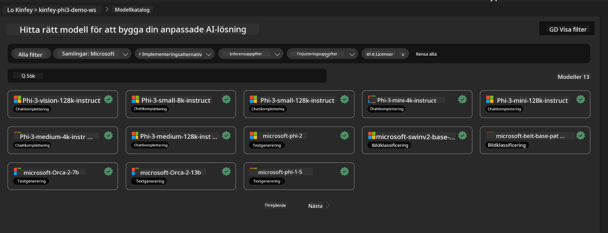
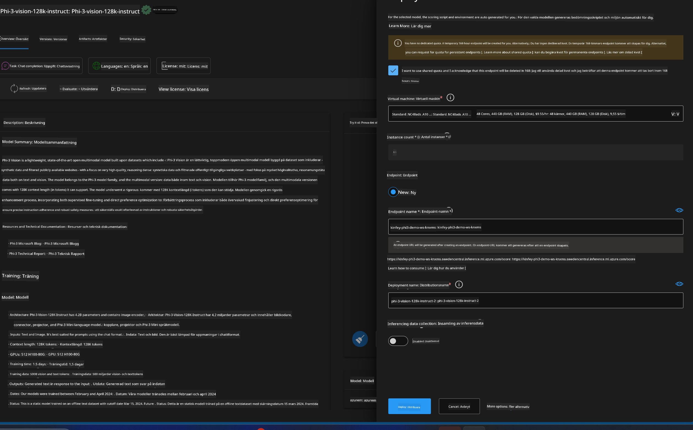
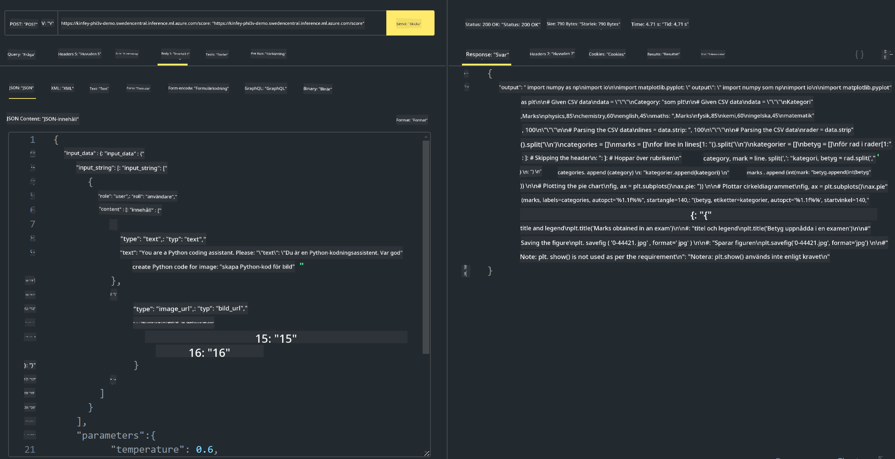

<!--
CO_OP_TRANSLATOR_METADATA:
{
  "original_hash": "20cb4e6ac1686248e8be913ccf6c2bc2",
  "translation_date": "2025-05-09T19:43:43+00:00",
  "source_file": "md/02.Application/02.Code/Phi3/VSCodeExt/HOL/Apple/03.DeployPhi3VisionOnAzure.md",
  "language_code": "sv"
}
-->
# **Lab 3 - Distribuera Phi-3-vision på Azure Machine Learning Service**

Vi använder NPU för att slutföra produktionsdistributionen av lokal kod, och sedan vill vi introducera möjligheten att använda PHI-3-VISION genom detta för att generera kod från bilder.

I denna introduktion kan vi snabbt bygga en Model As Service Phi-3 Vision-tjänst i Azure Machine Learning Service.

***Note***: Phi-3 Vision kräver beräkningskraft för att generera innehåll snabbare. Vi behöver molnberäkningskraft för att hjälpa oss uppnå detta.

### **1. Skapa Azure Machine Learning Service**

Vi behöver skapa en Azure Machine Learning Service i Azure-portalen. Om du vill lära dig hur, vänligen besök denna länk [https://learn.microsoft.com/azure/machine-learning/quickstart-create-resources?view=azureml-api-2](https://learn.microsoft.com/azure/machine-learning/quickstart-create-resources?view=azureml-api-2)

### **2. Välj Phi-3 Vision i Azure Machine Learning Service**



### **3. Distribuera Phi-3-Vision i Azure**



### **4. Testa Endpoint i Postman**



***Note***

1. Parametrarna som skickas måste inkludera Authorization, azureml-model-deployment och Content-Type. Du behöver kontrollera distributionsinformationen för att få dessa.

2. För att skicka parametrar behöver Phi-3-Vision en bildlänk. Vänligen se GPT-4-Vision-metoden för att skicka parametrar, till exempel

```json

{
  "input_data":{
    "input_string":[
      {
        "role":"user",
        "content":[ 
          {
            "type": "text",
            "text": "You are a Python coding assistant.Please create Python code for image "
          },
          {
              "type": "image_url",
              "image_url": {
                "url": "https://ajaytech.co/wp-content/uploads/2019/09/index.png"
              }
          }
        ]
      }
    ],
    "parameters":{
          "temperature": 0.6,
          "top_p": 0.9,
          "do_sample": false,
          "max_new_tokens": 2048
    }
  }
}

```

3. Anropa **/score** med Post-metoden

**Grattis**! Du har slutfört den snabba PHI-3-VISION-distributionen och testat hur man använder bilder för att generera kod. Nästa steg är att bygga applikationer i kombination med NPU:er och moln.

**Ansvarsfriskrivning**:  
Detta dokument har översatts med hjälp av AI-översättningstjänsten [Co-op Translator](https://github.com/Azure/co-op-translator). Även om vi strävar efter noggrannhet, vänligen var medveten om att automatiska översättningar kan innehålla fel eller brister. Det ursprungliga dokumentet på dess modersmål bör betraktas som den auktoritativa källan. För kritisk information rekommenderas professionell mänsklig översättning. Vi ansvarar inte för några missförstånd eller feltolkningar som uppstår till följd av användningen av denna översättning.